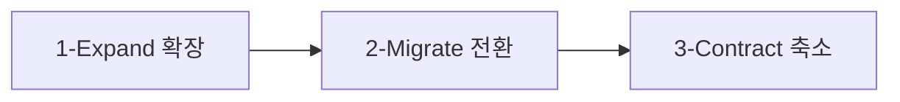
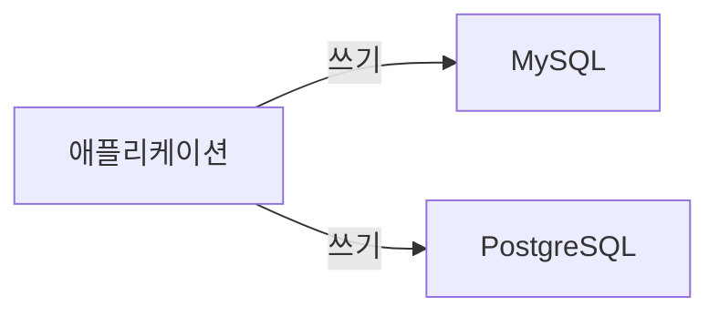
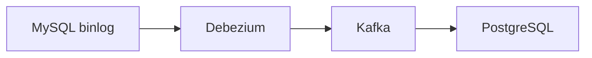
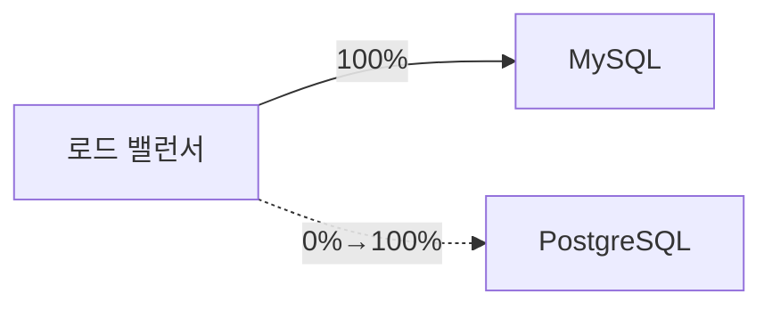

서비스가 운영 중인 데이터베이스의 스키마를 바꾸는 일은 달리는 기차 위에서 바퀴를 교체하는 것과 같다. 기차를 멈추면(서비스 중단) 간단하지만, 대부분의 서비스는 그 선택지가 없다. 무중단으로 스키마를 변경하는 기법, DB 자체를 교체하는 전략, 그리고 변경 이력을 코드로 관리하는 방법을 처음부터 짚어본다.

---

## 마이그레이션이 왜 어려운가

스키마 변경이 까다로운 이유는 **동시성** 때문이다. 마이그레이션이 진행되는 동안에도 애플리케이션은 쿼리를 보낸다. 대용량 테이블에 컬럼 하나를 추가하는 `ALTER TABLE`은 MySQL에서 테이블 잠금을 유발해 수십 분 동안 해당 테이블에 쓰기가 불가능해질 수 있다. 이 시간이 바로 다운타임이다.

세 가지 위험이 공존한다.

1. **잠금 경합**: DDL이 테이블 잠금을 획득하는 동안 기존 DML 트랜잭션이 대기하거나, 반대로 긴 트랜잭션이 DDL을 막는다.
2. **데이터 정합성**: 스키마 변경 중 들어온 데이터가 새 구조와 구 구조 중 어디에 기록되는지 불명확해진다.
3. **롤백 불가**: 대용량 테이블의 DDL이 절반쯤 진행됐을 때 실패하면 원상 복구가 오래 걸리거나 불가능하다.

---

## 스키마 버전 관리: Flyway와 Liquibase

스키마 변경을 코드 파일로 관리하면 팀 전체가 같은 스키마 상태를 공유하고, 환경마다(dev/staging/prod) 동일한 마이그레이션을 재현할 수 있다.

### Flyway

Flyway는 SQL 파일 또는 Java 파일 형태의 마이그레이션 스크립트를 버전 번호 순서로 실행한다. 실행 이력은 `flyway_schema_history` 테이블에 기록하며, 이미 실행된 스크립트는 다시 실행하지 않는다.

```
db/migration/
  V1__create_users_table.sql
  V2__add_email_to_users.sql
  V3__create_orders_table.sql
  V3.1__add_orders_index.sql
```

파일명 규칙: `V{버전}__{설명}.sql`. 버전은 정수 또는 소수점이며 사전 순서가 아닌 숫자 순서로 비교한다.

```sql
-- V2__add_email_to_users.sql
ALTER TABLE users
  ADD COLUMN email VARCHAR(255) NULL,
  ADD COLUMN email_verified_at DATETIME NULL;

CREATE INDEX idx_users_email ON users (email);
```

```java
// Spring Boot 설정 (application.yml)
// spring:
//   flyway:
//     enabled: true
//     locations: classpath:db/migration
//     baseline-on-migrate: true   # 기존 DB에 처음 적용 시
//     validate-on-migrate: true   # 실행 전 체크섬 검증
//     out-of-order: false         # 버전 순서 강제

// 프로그래밍 방식으로 실행
@Bean
public FlywayMigrationStrategy flywayMigrationStrategy() {
    return flyway -> {
        flyway.repair();   // 실패한 마이그레이션 이력 정리
        flyway.migrate();  // 마이그레이션 실행
    };
}
```

**체크섬 검증**이 Flyway의 핵심 안전장치다. 이미 실행된 파일을 수정하면 다음 기동 시 체크섬 불일치로 실패한다. 기존 마이그레이션을 절대 수정하지 말고, 새 버전 파일을 추가하는 방식으로만 변경한다.

### Liquibase

Liquibase는 XML, YAML, JSON, SQL 형식으로 변경 이력(changeset)을 관리한다. 각 changeset은 `id`와 `author`로 식별하며, DB 종류에 따라 다른 SQL을 생성할 수 있어 멀티 DB 환경에 유리하다.

```yaml
# db/changelog/db.changelog-master.yaml
databaseChangeLog:
  - changeSet:
      id: 2
      author: devteam
      changes:
        - addColumn:
            tableName: users
            columns:
              - column:
                  name: email
                  type: varchar(255)
                  constraints:
                    nullable: true
        - createIndex:
            indexName: idx_users_email
            tableName: users
            columns:
              - column:
                  name: email

  - changeSet:
      id: 3
      author: devteam
      preConditions:
        - onFail: MARK_RAN   # 조건 불충족 시 실행 건너뜀
        - tableExists:
            tableName: orders
      changes:
        - addColumn:
            tableName: orders
            columns:
              - column:
                  name: discount_amount
                  type: decimal(10,2)
                  defaultValueNumeric: 0
```

Liquibase는 `rollback` 블록을 changeset에 함께 정의해 되돌리기를 지원한다. 단, 일부 변경(DROP TABLE 등)은 되돌릴 수 없으므로 롤백 스크립트 작성에 주의가 필요하다.

---

## 무중단 스키마 변경: Expand-Contract 패턴

Expand-Contract(또는 Parallel Change) 패턴은 스키마 변경을 여러 단계로 나눠 구 버전 애플리케이션과 신 버전 애플리케이션이 동시에 동작할 수 있도록 한다.



컬럼 이름을 `user_name`에서 `username`으로 바꾸는 예시를 단계별로 살펴본다.

**1단계 Expand (확장)**: 새 컬럼을 추가하고, 애플리케이션이 구 컬럼과 신 컬럼 모두에 쓰도록 배포한다.

```sql
-- 새 컬럼 추가 (NULL 허용, 기존 데이터 영향 없음)
ALTER TABLE users ADD COLUMN username VARCHAR(100) NULL;
```

```java
// 애플리케이션: 구/신 컬럼 동시 쓰기
public void updateUser(User user) {
    jdbcTemplate.update(
        "UPDATE users SET user_name = ?, username = ? WHERE id = ?",
        user.getName(), user.getName(), user.getId()
    );
}
```

**2단계 Migrate (전환)**: 기존 데이터를 신 컬럼으로 복사한다.

```sql
-- 기존 데이터 배치 복사 (한 번에 전체 실행하면 잠금 위험)
UPDATE users SET username = user_name
WHERE username IS NULL
LIMIT 10000;
-- 위 쿼리를 username IS NULL인 행이 없을 때까지 반복

-- 백필 완료 후 NOT NULL 제약 추가
ALTER TABLE users MODIFY COLUMN username VARCHAR(100) NOT NULL;
```

**3단계 Contract (축소)**: 애플리케이션이 신 컬럼만 읽도록 배포하고, 구 컬럼을 제거한다.

```sql
-- 구 컬럼 제거
ALTER TABLE users DROP COLUMN user_name;
```

이 패턴의 핵심은 각 단계 사이에 배포와 검증이 들어가며, 어느 단계에서든 롤백이 안전하다는 점이다.

---

## pt-online-schema-change: 대용량 테이블 DDL

Percona Toolkit의 `pt-online-schema-change`(pt-osc)는 테이블 잠금 없이 대용량 테이블의 DDL을 수행한다. 동작 원리는 다음과 같다.


1. 새 구조로 빈 테이블(`_tablename_new`)을 생성한다.
2. 원본 테이블에 INSERT/UPDATE/DELETE 트리거를 설치해 변경 사항을 새 테이블에 실시간 반영한다.
3. 원본 데이터를 청크(chunk) 단위로 새 테이블에 복사한다.
4. 복사 완료 후 원본과 새 테이블을 원자적으로 이름 교체(RENAME)한다.
5. 트리거와 원본 테이블(이제 이름이 `_tablename_old`)을 정리한다.

```bash
# 사용 예시: orders 테이블에 컬럼 추가
pt-online-schema-change \
  --host=db-primary \
  --user=admin \
  --password=secret \
  --database=myapp \
  --table=orders \
  --alter="ADD COLUMN discount_amount DECIMAL(10,2) NOT NULL DEFAULT 0" \
  --chunk-size=1000 \
  --max-lag=1 \           # Replica 복제 지연이 1초 초과 시 일시 중단
  --check-interval=1 \
  --critical-load="Threads_running:100" \  # 서버 부하 임계치
  --execute

# 실제 실행 전 --dry-run으로 검증
pt-online-schema-change \
  ... \
  --dry-run
```

`--max-lag` 옵션이 중요하다. 복사 속도를 줄여 Replica 복제 지연을 제어하므로, 운영 중 Replica에 의존하는 읽기 트래픽에 미치는 영향을 최소화한다.

**주의사항**: pt-osc는 트리거를 사용하므로 이미 트리거가 있는 테이블에는 추가 설정이 필요하다. MySQL 5.7+에서는 트리거 중첩이 제한적으로 허용되지만, gh-ost가 더 나은 대안이다.

---

## gh-ost: GitHub이 만든 무잠금 DDL 도구

gh-ost(GitHub Online Schema Transmogrifier)는 트리거 대신 **binlog 스트리밍**을 이용해 변경을 동기화한다. 트리거 없이 동작하므로 pt-osc의 트리거 제약이 없다.


```bash
# gh-ost 실행 예시
gh-ost \
  --user="admin" \
  --password="secret" \
  --host="db-primary" \
  --database="myapp" \
  --table="orders" \
  --alter="ADD COLUMN discount_amount DECIMAL(10,2) NOT NULL DEFAULT 0" \
  --max-lag-millis=1500 \        # 복제 지연 임계치 (ms)
  --chunk-size=1000 \
  --max-load="Threads_running=50" \
  --switch-to-rbr \              # binlog를 ROW 포맷으로 전환
  --allow-master-master \        # Master-Master 구성 허용
  --cut-over=default \           # atomic cut-over 방식
  --exact-rowcount \
  --concurrent-rowcount \
  --default-retries=120 \
  --execute

# 실행 중 일시 중단 (Unix socket 사용)
echo "throttle" > /tmp/gh-ost.myapp.orders.sock

# 재개
echo "no-throttle" > /tmp/gh-ost.myapp.orders.sock
```

gh-ost의 특징은 **실행 중 동적 제어**다. 소켓 파일을 통해 실행 중에도 청크 크기 변경, 일시 중단, 재개가 가능해 피크 타임에 속도를 낮추고 한가한 시간에 속도를 높일 수 있다.

---

## 대용량 테이블 DDL 전략 비교

| 방법 | 잠금 | 트리거 필요 | 특징 |
|------|------|------------|------|
| 일반 ALTER TABLE | 전체 잠금 | 없음 | 소규모 테이블만 |
| pt-osc | 없음(RENAME 순간 제외) | 필요 | 검증된 도구, 트리거 제약 |
| gh-ost | 없음(cut-over 순간 제외) | 없음(binlog) | 동적 제어, GitHub 표준 |
| MySQL 8.0 Instant DDL | 없음 | 없음 | 컬럼 추가만 지원, 즉각 완료 |

MySQL 8.0의 `ALGORITHM=INSTANT`는 컬럼 추가(기본값 있음), 컬럼 순서 변경(가상) 등 일부 DDL을 메타데이터 변경만으로 즉각 처리한다.

```sql
-- MySQL 8.0 Instant DDL (메타데이터만 변경, 잠금 없음)
ALTER TABLE orders
  ADD COLUMN discount_amount DECIMAL(10,2) NOT NULL DEFAULT 0,
  ALGORITHM=INSTANT;

-- 지원 여부 확인 후 폴백
ALTER TABLE orders
  ADD COLUMN notes TEXT NULL,
  ALGORITHM=INSTANT;  -- 실패 시 ALGORITHM=INPLACE 시도
```

---

## DB 교체 마이그레이션: MySQL에서 PostgreSQL로

DB 엔진 자체를 교체하는 마이그레이션은 단순 스키마 변경보다 훨씬 복잡하다. 두 DB가 동시에 운영되는 기간 동안 데이터 정합성을 유지해야 한다.

### 이중 쓰기(Dual Write) 패턴



애플리케이션이 두 DB 모두에 쓰고, 읽기는 검증이 완료된 비율로 점진적으로 전환한다.

```java
@Service
public class OrderService {

    private final MySqlOrderRepository mysqlRepo;
    private final PostgresOrderRepository postgresRepo;
    private final MigrationFeatureFlag migrationFlag;

    public Order save(Order order) {
        // 항상 MySQL에 쓰기 (primary)
        Order saved = mysqlRepo.save(order);

        // PostgreSQL에도 비동기 쓰기 (검증용)
        if (migrationFlag.isDualWriteEnabled()) {
            try {
                postgresRepo.save(order);
            } catch (Exception e) {
                // 실패 로그만 남기고 MySQL 결과 반환 (PostgreSQL은 secondary)
                log.error("PostgreSQL dual write failed: {}", e.getMessage());
            }
        }
        return saved;
    }

    public Order findById(Long id) {
        if (migrationFlag.isPostgresReadEnabled()) {
            // 일부 트래픽을 PostgreSQL로 전환 (A/B 방식)
            Order pgResult = postgresRepo.findById(id);
            Order mysqlResult = mysqlRepo.findById(id);
            // 결과 비교 및 불일치 로깅
            if (!pgResult.equals(mysqlResult)) {
                log.warn("Data mismatch for order {}", id);
            }
            return mysqlResult;  // 아직 MySQL이 기준
        }
        return mysqlRepo.findById(id);
    }
}
```

### CDC 기반 마이그레이션 (Change Data Capture)

Debezium 같은 CDC 도구는 MySQL binlog를 읽어 변경 이벤트를 Kafka로 발행하고, 소비자가 PostgreSQL에 적용한다. 애플리케이션 코드 수정 없이 DB 레벨에서 동기화할 수 있다.



```json
// Debezium MySQL Connector 설정 예시
{
  "name": "mysql-connector",
  "config": {
    "connector.class": "io.debezium.connector.mysql.MySqlConnector",
    "database.hostname": "mysql-host",
    "database.port": "3306",
    "database.user": "debezium",
    "database.password": "secret",
    "database.server.id": "184054",
    "topic.prefix": "dbserver1",
    "database.include.list": "myapp",
    "schema.history.internal.kafka.topic": "schema-changes.myapp",
    "schema.history.internal.kafka.bootstrap.servers": "kafka:9092",
    "include.schema.changes": "true"
  }
}
```

CDC 방식의 장점은 초기 스냅샷과 이후 변경분 모두를 자동으로 처리한다는 점이다. 스냅샷 단계에서 전체 테이블을 한 번 복사하고, 이후 binlog 이벤트를 실시간 반영한다.

---

## 전환 전략: 트래픽을 점진적으로 이전하기

이중 쓰기나 CDC로 두 DB가 동기화된 상태에서 트래픽을 전환하는 방법이다.

### 블루-그린 DB 전환



1. **준비**: CDC로 PostgreSQL을 MySQL과 동기화 상태로 유지한다.
2. **전환**: 로드 밸런서 또는 애플리케이션 설정을 변경해 트래픽을 PostgreSQL로 전환한다.
3. **검증**: 전환 후 에러율, 응답 시간, 데이터 정합성을 모니터링한다.
4. **롤백**: 문제 발생 시 로드 밸런서를 다시 MySQL로 돌린다. MySQL은 여전히 이중 쓰기로 최신 상태를 유지하고 있다.

```yaml
# 피처 플래그로 DB 전환 제어 (예: LaunchDarkly, Unleash)
db:
  primary: mysql        # 현재 기준 DB
  read-replica: postgresql  # 읽기 전환 비율
  read-replica-weight: 10   # 10% 트래픽을 PostgreSQL로
```

### 카나리 전환

전체 사용자 중 1~5%만 새 DB를 사용하도록 라우팅하고, 에러가 없으면 점진적으로 비율을 높인다. 특정 사용자 ID 범위나 요청 헤더를 기반으로 분기한다.

---

## 롤백 전략

마이그레이션 실패 시 빠르게 되돌릴 수 있어야 한다.

### 스키마 롤백

Flyway는 기본적으로 롤백을 지원하지 않는다. Flyway Teams(유료) 또는 Liquibase의 `rollback` 블록을 사용하거나, 수동으로 역방향 마이그레이션 파일을 준비한다.

```sql
-- V2__add_email_to_users.sql의 롤백 스크립트
-- U2__undo_add_email_to_users.sql (수동 관리)
ALTER TABLE users
  DROP COLUMN email,
  DROP COLUMN email_verified_at;
DROP INDEX idx_users_email ON users;
```

실무에서 안전한 롤백을 위한 원칙이 있다.

- 컬럼 삭제는 Expand-Contract의 마지막 단계(여러 배포 후)에만 실행한다.
- 컬럼 이름 변경은 직접 `RENAME COLUMN` 대신 신규 컬럼 추가 → 데이터 복사 → 구 컬럼 삭제 순서로 진행한다.
- NOT NULL 제약은 데이터 백필이 100% 완료된 것을 확인 후 추가한다.

### DB 교체 롤백

이중 쓰기 기간에 MySQL이 항상 Primary 상태를 유지하면, PostgreSQL 전환 후 문제 발생 시 MySQL로 즉시 되돌릴 수 있다. 단, PostgreSQL 전환 후 MySQL로의 역방향 CDC도 설정해 두면 전환 기간 동안 PostgreSQL에 쓰인 데이터가 MySQL에도 반영된다.

---

## 데이터 정합성 검증

마이그레이션 중 두 DB의 데이터가 일치하는지 주기적으로 검증해야 한다.

```python
# 두 DB 간 카운트 및 체크섬 비교 (Python 예시)
import hashlib

def verify_table_consistency(mysql_conn, pg_conn, table, id_range):
    """지정 ID 범위의 행 수와 체크섬 비교"""
    mysql_cursor = mysql_conn.cursor()
    pg_cursor = pg_conn.cursor()

    query = f"""
        SELECT COUNT(*), COALESCE(SUM(CRC32(CONCAT_WS('|', id, user_id, amount, status))), 0)
        FROM {table}
        WHERE id BETWEEN {id_range[0]} AND {id_range[1]}
    """
    # MySQL CRC32 기반 체크섬
    mysql_cursor.execute(query)
    mysql_count, mysql_checksum = mysql_cursor.fetchone()

    # PostgreSQL 동등 쿼리
    pg_query = f"""
        SELECT COUNT(*),
               COALESCE(SUM(('x' || md5(CONCAT_WS('|', id::text, user_id::text,
                             amount::text, status)))::bit(32)::int), 0)
        FROM {table}
        WHERE id BETWEEN {id_range[0]} AND {id_range[1]}
    """
    pg_cursor.execute(pg_query)
    pg_count, pg_checksum = pg_cursor.fetchone()

    if mysql_count != pg_count or mysql_checksum != pg_checksum:
        print(f"MISMATCH in {table} [{id_range[0]}-{id_range[1]}]: "
              f"MySQL({mysql_count}, {mysql_checksum}) vs "
              f"PG({pg_count}, {pg_checksum})")
        return False
    return True
```

pt-table-checksum은 MySQL 복제 환경에서 Primary와 Replica 간 데이터 정합성을 검증하는 데 특화된 도구다.

```bash
pt-table-checksum \
  --host=mysql-primary \
  --user=admin \
  --password=secret \
  --databases=myapp \
  --tables=orders

# 불일치 행 수정
pt-table-sync \
  --execute \
  h=mysql-primary,D=myapp,t=orders \
  h=mysql-replica
```

---

## CI/CD 파이프라인에서 마이그레이션 자동화

```yaml
# .github/workflows/deploy.yml 예시
jobs:
  migrate-and-deploy:
    steps:
      - name: Run Flyway Migration (Staging)
        run: |
          flyway -url=jdbc:mysql://staging-db:3306/myapp \
                 -user=${{ secrets.DB_USER }} \
                 -password=${{ secrets.DB_PASS }} \
                 -locations=filesystem:db/migration \
                 migrate

      - name: Verify Migration
        run: |
          flyway -url=jdbc:mysql://staging-db:3306/myapp \
                 ... \
                 info
          # 현재 버전과 기대 버전 비교

      - name: Deploy Application
        # 마이그레이션 성공 후 애플리케이션 배포
        run: kubectl rollout restart deployment/myapp

      - name: Run Migration Tests
        # 마이그레이션 후 통합 테스트 실행
        run: ./gradlew integrationTest
```

마이그레이션과 애플리케이션 배포 순서가 중요하다. **마이그레이션 먼저, 배포 나중**이 원칙이다. 새 스키마에서 구 애플리케이션이 동작할 수 있도록 하위 호환성을 유지해야 한다. Expand-Contract 패턴이 이를 자연스럽게 보장한다.

---

## 극한 시나리오

### 시나리오 1: 마이그레이션 중 Primary DB 장애

gh-ost로 1억 건 테이블의 DDL을 70% 진행하던 중 Primary DB가 장애를 맞았다. Replica가 새 Primary로 승격됐는데, gh-ost의 작업 상태는 어떻게 되는가.

gh-ost는 binlog를 기반으로 동기화하므로 새 Primary에 접속해 중단 지점부터 재시작할 수 있다. 단, `_orders_new` 임시 테이블이 새 Primary에 복제되어 있어야 한다.

```bash
# gh-ost는 새 Primary에서 재실행 가능
# _orders_new 테이블이 Replica에 복제됐는지 확인
SHOW TABLES LIKE '_orders%';

# 재실행 시 기존 임시 테이블 재사용
gh-ost \
  --host=new-primary \
  ... \
  --initially-drop-ghost-table=false \  # 기존 임시 테이블 유지
  --execute
```

반면 pt-osc는 트리거를 사용하는데, 트리거는 Replica에 복제되지 않는다. 새 Primary에서 트리거를 다시 설치해야 하므로 처음부터 재실행하거나 수동 조정이 필요하다.

### 시나리오 2: 마이그레이션 중 데이터 정합성 깨짐

CDC 기반 MySQL → PostgreSQL 마이그레이션 중 일부 UPDATE 이벤트가 Kafka 처리 지연으로 순서가 뒤바뀌어 PostgreSQL에 구 버전 데이터가 저장됐다. 이미 PostgreSQL로 읽기 트래픽 30%를 전환한 상태다.

대응 절차는 다음과 같다.

1. **즉각 트래픽 롤백**: PostgreSQL 읽기 트래픽을 0%로 되돌린다.
2. **범위 파악**: 마지막 정상 확인 시점 이후 불일치 레코드 범위를 특정한다.
3. **재동기화**: 해당 범위를 MySQL 기준으로 PostgreSQL에 강제 덮어쓴다.

```sql
-- 불일치 범위 특정 (pt-table-checksum 또는 자체 스크립트)
-- 마지막 CDC 체크포인트 확인
SELECT MAX(updated_at) FROM orders WHERE updated_at < '2026-05-15 10:00:00';

-- MySQL 기준으로 PostgreSQL 강제 동기화 (pg_upsert)
INSERT INTO orders (id, user_id, amount, status, updated_at)
SELECT id, user_id, amount, status, updated_at
FROM mysql_fdw_orders
WHERE updated_at BETWEEN '2026-05-15 09:50:00' AND '2026-05-15 10:10:00'
ON CONFLICT (id) DO UPDATE SET
  user_id = EXCLUDED.user_id,
  amount = EXCLUDED.amount,
  status = EXCLUDED.status,
  updated_at = EXCLUDED.updated_at;
```

4. **원인 분석**: Kafka 파티션 수 부족 또는 동일 key에 대한 병렬 처리가 원인이라면, `orders` 토픽의 파티셔닝 키를 `order_id`로 설정해 같은 주문의 이벤트가 항상 같은 파티션에서 순서대로 처리되도록 변경한다.

### 시나리오 3: 스키마 변경 중 서비스 배포와 충돌

Flyway 마이그레이션이 운영 DB에서 수십 초가 걸리는 동안, Kubernetes rolling update로 새 Pod가 기동됐다. 새 Pod는 마이그레이션 완료를 기다리지 않고 이미 기동된 상태라면 구 스키마로 쿼리를 실행해 에러가 난다.

**해결책**: `initContainer`에서 Flyway를 실행하고 완료된 후에만 메인 컨테이너가 기동되도록 한다.

```yaml
# k8s deployment 예시
spec:
  initContainers:
    - name: flyway-migrate
      image: flyway/flyway:latest
      command:
        - flyway
        - -url=jdbc:mysql://db:3306/myapp
        - -user=$(DB_USER)
        - -password=$(DB_PASSWORD)
        - migrate
      env:
        - name: DB_USER
          valueFrom: { secretKeyRef: { name: db-secret, key: user } }
  containers:
    - name: myapp
      # initContainer 완료 후 기동됨
```

단, 여러 Pod가 동시에 롤링 업데이트되면 여러 initContainer가 동시에 Flyway를 실행할 수 있다. Flyway는 `flyway_schema_history` 테이블에 `LOCK`을 사용해 동시 실행을 막으므로 한 Pod만 마이그레이션을 실행하고 나머지는 대기 후 완료된 버전을 확인한다.

---

## 면접 포인트

### Flyway와 Liquibase의 차이는 무엇인가

Flyway는 SQL/Java 파일을 버전 번호 순서로 실행하며 단순하고 빠르게 도입할 수 있다. Liquibase는 XML/YAML/JSON 형식의 changeset을 id+author로 관리하며, DB 종류에 따라 다른 SQL을 생성하는 추상화 레이어를 제공한다. 멀티 DB 지원이 필요하거나 롤백 블록을 선언적으로 관리하고 싶다면 Liquibase, 단순성이 중요하다면 Flyway를 선택한다.

### Expand-Contract 패턴이 왜 필요한가

컬럼 이름 변경이나 타입 변경을 한 번에 하면 배포 순간 구 버전 코드와 신 버전 코드가 동시에 동작하는 Rolling Update 기간에 에러가 발생한다. Expand-Contract는 이 전환 기간에 두 버전이 모두 동작하도록 단계를 나눠 각 단계에서 롤백이 안전하도록 보장한다.

### pt-osc와 gh-ost의 동작 방식 차이는 무엇인가

pt-osc는 트리거를 원본 테이블에 설치해 새 테이블과 동기화한다. 이미 트리거가 있는 테이블에서 제약이 있다. gh-ost는 MySQL binlog를 직접 읽어 변경 이벤트를 새 테이블에 적용한다. 트리거가 없으므로 운영 테이블에 추가 부하를 주지 않고, 실행 중 소켓을 통해 속도 조절이 가능하다.

### 이중 쓰기 패턴에서 두 DB 간 데이터 불일치를 어떻게 다루는가

쓰기 실패 시 Primary(기존 DB)의 결과를 기준으로 응답하고, Secondary(신규 DB) 실패는 로그만 남겨 운영을 계속한다. 불일치가 누적되면 체크섬 비교 스크립트나 pt-table-checksum으로 범위를 파악하고 Primary 기준으로 덮어쓴다. CDC 방식에서는 동일 레코드의 이벤트가 순서 보장되도록 파티셔닝 키를 레코드 ID로 설정하는 것이 핵심이다.

### 마이그레이션 롤백 전략에서 가장 주의할 점은 무엇인가

컬럼 삭제나 테이블 삭제는 롤백이 불가능하다. Expand-Contract 패턴에서 축소(Contract) 단계를 여러 배포 사이클 후에 실행하면, 문제 발생 시 신 코드 배포 중단만으로 구 컬럼을 그대로 쓸 수 있다. NOT NULL 제약은 데이터 백필이 100% 완료됐는지 확인 후 추가해야 한다. 백필이 완료되지 않은 상태에서 NOT NULL을 추가하면 NULL 행이 있어 제약 추가 자체가 실패한다.
