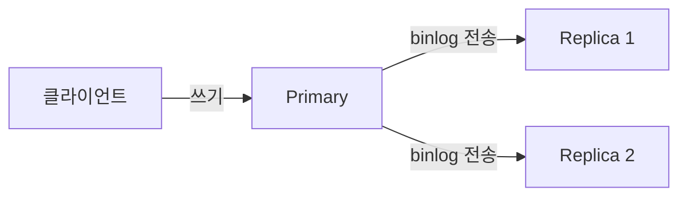
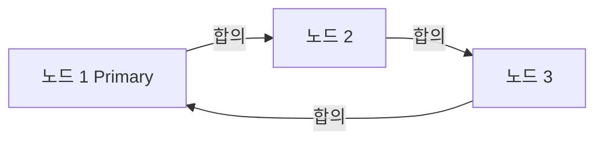
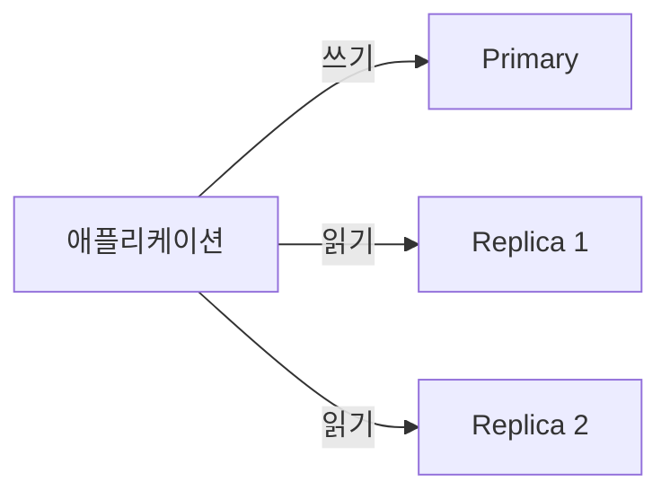
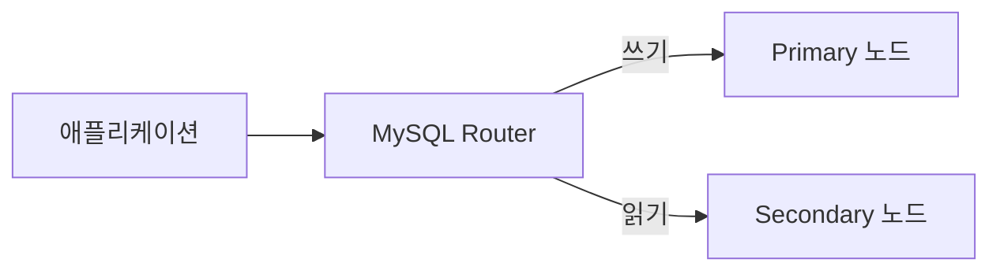

데이터베이스 서버가 한 대뿐이라면, 그 서버가 멈추는 순간 서비스 전체가 멈춘다. MySQL 복제는 이 단일 장애 지점(SPOF)을 없애기 위한 핵심 메커니즘이다. 단순히 백업용 서버를 한 대 더 두는 개념에서 시작해, 자동 페일오버와 멀티 마스터 합의까지 발전한 과정을 처음부터 짚어본다.

---

## 복제가 필요한 이유

식당 주방을 비유로 들어보자. 셰프가 한 명뿐이면 그 셰프가 쓰러지는 순간 주방이 멈춘다. 복제는 "같은 레시피를 배운 보조 셰프"를 옆에 두는 것이다. 메인 셰프(Primary)가 만든 요리(데이터 변경)를 보조 셰프(Replica)가 그대로 따라 만들어 두면, 메인 셰프가 자리를 비워도 서비스가 이어진다.

복제의 목적은 세 가지로 나뉜다.

1. **고가용성(HA)**: Primary 장애 시 Replica가 즉시 승격되어 서비스 중단을 최소화한다.
2. **읽기 분산(Read Scale-out)**: SELECT 쿼리를 여러 Replica로 분산해 Primary 부하를 줄인다.
3. **백업 오프로딩**: Replica에서 백업을 수행해 Primary I/O 영향을 제거한다.

---

## 바이너리 로그: 복제의 원재료

MySQL 복제의 핵심은 **바이너리 로그(Binary Log, binlog)**다. Primary는 데이터 변경 이벤트를 순서대로 binlog에 기록하고, Replica는 이 로그를 읽어 동일한 변경을 재현한다.

### 바이너리 로그 포맷 세 가지

**STATEMENT** 포맷은 SQL 문장 자체를 기록한다. `UPDATE orders SET status='done' WHERE created_at < NOW()`처럼 비결정적 함수가 포함되면 Replica에서 다른 결과가 나올 수 있다.

**ROW** 포맷은 변경된 행의 before/after 이미지를 기록한다. 저장 공간이 더 크지만 정확성이 보장된다. MySQL 8.0 기본값이다.

**MIXED** 포맷은 안전한 쿼리는 STATEMENT, 비결정적 쿼리는 ROW로 자동 전환한다.

```sql
-- 현재 binlog 포맷 확인
SHOW VARIABLES LIKE 'binlog_format';

-- binlog 목록 확인
SHOW BINARY LOGS;

-- 특정 binlog 내용 확인
SHOW BINLOG EVENTS IN 'mysql-bin.000001' LIMIT 20;

-- mysqlbinlog 도구로 내용 해석
-- mysqlbinlog --base64-output=DECODE-ROWS -v mysql-bin.000001
```

ROW 포맷에서 binlog 하나의 이벤트는 이렇게 생겼다.

```
# at 1234
#260515 10:00:01 server id 1  end_log_pos 1300
### UPDATE `shop`.`orders`
### WHERE
###   @1=42 /* INT */
###   @2='pending' /* VARCHAR(20) */
### SET
###   @1=42
###   @2='done' /* VARCHAR(20) */
```

---

## 복제 아키텍처: 세 가지 레벨

### 1. 비동기 복제 (Asynchronous Replication)



Primary는 binlog를 기록한 직후 클라이언트에게 커밋 완료를 응답한다. Replica가 실제로 받았는지는 확인하지 않는다. 성능은 가장 좋지만, Primary가 갑자기 죽으면 아직 전송되지 않은 binlog가 소실될 수 있다.

설정 방법은 아래와 같다.

```sql
-- Primary 설정 (my.cnf)
-- [mysqld]
-- server-id = 1
-- log-bin = mysql-bin
-- binlog-format = ROW

-- Primary에서 복제 계정 생성
CREATE USER 'repl'@'%' IDENTIFIED BY 'repl_password';
GRANT REPLICATION SLAVE ON *.* TO 'repl'@'%';

-- Replica에서 복제 시작
CHANGE MASTER TO
  MASTER_HOST='primary-host',
  MASTER_USER='repl',
  MASTER_PASSWORD='repl_password',
  MASTER_AUTO_POSITION=1;  -- GTID 사용 시

START SLAVE;
SHOW SLAVE STATUS\G
```

### 2. 반동기 복제 (Semi-Synchronous Replication)

비동기의 데이터 소실 위험을 줄이기 위해, Primary는 **최소 하나의 Replica가 binlog를 수신했음을 확인**한 후에야 클라이언트에게 응답한다. 수신 확인이지, 실제 적용 확인이 아니라는 점에 주의한다.

```sql
-- 플러그인 로드 (Primary)
INSTALL PLUGIN rpl_semi_sync_master SONAME 'semisync_master.so';
SET GLOBAL rpl_semi_sync_master_enabled = 1;
SET GLOBAL rpl_semi_sync_master_timeout = 1000;  -- 1초 대기 후 비동기로 폴백

-- 플러그인 로드 (Replica)
INSTALL PLUGIN rpl_semi_sync_slave SONAME 'semisync_slave.so';
SET GLOBAL rpl_semi_sync_slave_enabled = 1;

-- 반동기 상태 확인
SHOW STATUS LIKE 'Rpl_semi_sync%';
```

`rpl_semi_sync_master_timeout` 이내에 Replica 응답이 없으면 자동으로 비동기 모드로 폴백한다. 네트워크 이슈가 있을 때 Primary 쓰기가 느려지는 트레이드오프가 있다.

### 3. 그룹 복제 (Group Replication)

MySQL 5.7.17에 도입된 그룹 복제는 **Paxos 기반 합의 프로토콜**을 사용해 모든 노드가 트랜잭션 순서에 합의한다. 멀티 프라이머리 모드와 싱글 프라이머리 모드를 지원한다.



그룹 복제 설정의 핵심 파라미터들이다.

```sql
-- my.cnf 설정
-- [mysqld]
-- server-id = 1
-- gtid-mode = ON
-- enforce-gtid-consistency = ON
-- log-bin = binlog
-- log-slave-updates = ON
-- binlog-format = ROW
-- master-info-repository = TABLE
-- relay-log-info-repository = TABLE
-- transaction-write-set-extraction = XXHASH64
-- loose-group-replication-group-name = "aaaaaaaa-bbbb-cccc-dddd-eeeeeeeeeeee"
-- loose-group-replication-start-on-boot = off
-- loose-group-replication-local-address = "node1:33061"
-- loose-group-replication-group-seeds = "node1:33061,node2:33061,node3:33061"
-- loose-group-replication-bootstrap-group = off

-- 첫 번째 노드에서 그룹 부트스트랩
SET GLOBAL group_replication_bootstrap_group=ON;
START GROUP_REPLICATION;
SET GLOBAL group_replication_bootstrap_group=OFF;

-- 나머지 노드에서 합류
START GROUP_REPLICATION;

-- 그룹 멤버 확인
SELECT * FROM performance_schema.replication_group_members;
```

---

## GTID: 복제 위치를 좌표로 관리하기

**GTID(Global Transaction Identifier)**는 각 트랜잭션에 전 세계 유일한 ID를 부여하는 메커니즘이다. 포맷은 `server_uuid:transaction_id`다.

GTID 이전에는 Replica가 "binlog 파일명 + 오프셋"으로 위치를 추적했다. 페일오버 시 새 Primary의 파일명/오프셋은 달라지므로, DBA가 수동으로 위치를 계산해야 했다. GTID를 쓰면 트랜잭션 ID 기반이라 자동으로 맞출 수 있다.

```sql
-- GTID 활성화 확인
SHOW VARIABLES LIKE 'gtid_mode';
SHOW VARIABLES LIKE 'enforce_gtid_consistency';

-- 현재 실행된 GTID 집합 확인
SHOW VARIABLES LIKE 'gtid_executed';

-- Replica의 수신 및 실행 GTID 확인
SHOW SLAVE STATUS\G
-- Retrieved_Gtid_Set: 받은 GTID
-- Executed_Gtid_Set: 실행 완료한 GTID

-- GTID 기반 복제 설정
CHANGE MASTER TO
  MASTER_HOST='new-primary',
  MASTER_AUTO_POSITION=1;  -- GTID로 자동 위치 결정
```

GTID의 핵심 규칙: **한 번 실행된 GTID는 다시 실행하지 않는다.** 이미 실행한 트랜잭션을 건너뛰므로 중복 적용이 발생하지 않는다.

---

## 읽기 분산: Read Replica 운용

**읽기 트래픽을 Replica로 분산하는 이유**는 대부분의 서비스가 쓰기보다 읽기가 압도적으로 많기 때문이다. 쇼핑몰에서 상품을 보는 사람(읽기)은 실제로 구매하는 사람(쓰기)보다 수십 배 많다. Primary 한 대가 모든 SELECT를 처리하면 CPU와 I/O가 포화된다. Replica를 추가하는 것은 도서관에 사서를 더 고용하는 것과 같다. 책을 새로 들이는 작업(쓰기)은 관장(Primary)이 담당하고, 책을 찾아주는 일(읽기)은 여러 사서(Replica)가 분담한다.

보통 쓰기는 Primary, 읽기는 Replica로 라우팅한다.



Spring 애플리케이션에서 DataSource를 분기하는 패턴이다.

```java
@Configuration
public class DataSourceConfig {

    @Bean
    @ConfigurationProperties("spring.datasource.primary")
    public DataSource primaryDataSource() {
        return DataSourceBuilder.create().build();
    }

    @Bean
    @ConfigurationProperties("spring.datasource.replica")
    public DataSource replicaDataSource() {
        return DataSourceBuilder.create().build();
    }

    @Bean
    public DataSource routingDataSource(
            @Qualifier("primaryDataSource") DataSource primary,
            @Qualifier("replicaDataSource") DataSource replica) {
        AbstractRoutingDataSource routing = new AbstractRoutingDataSource() {
            @Override
            protected Object determineCurrentLookupKey() {
                return TransactionSynchronizationManager.isCurrentTransactionReadOnly()
                        ? "replica" : "primary";
            }
        };
        routing.setTargetDataSources(Map.of("primary", primary, "replica", replica));
        routing.setDefaultTargetDataSource(primary);
        return routing;
    }
}
```

`@Transactional(readOnly = true)`가 붙은 서비스 메서드는 자동으로 Replica로 라우팅된다.

**복제 지연(Replication Lag)** 문제에 주의해야 한다. 방금 쓴 데이터를 Replica에서 바로 읽으면 아직 반영이 안 됐을 수 있다. 쓰기 직후 읽기가 반드시 필요한 경우에는 Primary에서 읽어야 한다.

---

## ProxySQL: 복제 토폴로지의 교통 경찰

ProxySQL은 MySQL 앞단에서 동작하는 고성능 프록시다. 쿼리를 분석해 읽기/쓰기를 자동으로 분기하고, Primary 장애 시 자동 페일오버를 지원한다.

```sql
-- ProxySQL 관리 인터페이스 접속 (포트 6032)
-- mysql -u admin -padmin -h 127.0.0.1 -P6032

-- 백엔드 서버 등록
INSERT INTO mysql_servers(hostgroup_id, hostname, port)
VALUES (1, 'primary-host', 3306),   -- hostgroup 1: 쓰기
       (2, 'replica1-host', 3306),  -- hostgroup 2: 읽기
       (2, 'replica2-host', 3306);

-- 쿼리 라우팅 규칙 설정
INSERT INTO mysql_query_rules(rule_id, active, match_pattern, destination_hostgroup)
VALUES (1, 1, '^SELECT', 2),  -- SELECT는 읽기 그룹
       (2, 1, '.*', 1);       -- 나머지는 쓰기 그룹

-- 설정 적용
LOAD MYSQL SERVERS TO RUNTIME;
LOAD MYSQL QUERY RULES TO RUNTIME;
SAVE MYSQL SERVERS TO DISK;
SAVE MYSQL QUERY RULES TO DISK;

-- 현재 연결 통계 확인
SELECT * FROM stats.stats_mysql_connection_pool;
```

ProxySQL은 `mysql_replication_hostgroups` 테이블을 통해 Primary/Replica 역할을 자동으로 감지하고, 장애 시 호스트 그룹을 재조정한다.

---

## InnoDB Cluster: 완성된 HA 솔루션

InnoDB Cluster는 Group Replication + MySQL Router + MySQL Shell을 묶어 완성된 HA 패키지를 제공한다.



**MySQL Shell**로 클러스터를 생성하는 절차다.

```javascript
// MySQL Shell에서 실행 (JS 모드)

// 각 노드를 클러스터에 사용할 수 있도록 준비
dba.configureInstance('root@node1:3306')
dba.configureInstance('root@node2:3306')
dba.configureInstance('root@node3:3306')

// 클러스터 생성 (node1에서)
var cluster = dba.createCluster('myCluster')

// 나머지 노드 추가
cluster.addInstance('root@node2:3306')
cluster.addInstance('root@node3:3306')

// 클러스터 상태 확인
cluster.status()
// {
//   "clusterName": "myCluster",
//   "defaultReplicaSet": {
//     "topology": {
//       "node1:3306": { "mode": "R/W", "status": "ONLINE" },
//       "node2:3306": { "mode": "R/O", "status": "ONLINE" },
//       "node3:3306": { "mode": "R/O", "status": "ONLINE" }
//     }
//   }
// }
```

**MySQL Router**는 애플리케이션과 클러스터 사이에서 자동으로 Primary를 찾아 연결을 라우팅한다. Primary 장애가 발생하면 Group Replication이 새 Primary를 선출하고, Router는 메타데이터를 폴링해 자동으로 연결을 전환한다.

```bash
# MySQL Router 부트스트랩 (클러스터 메타데이터 등록)
mysqlrouter --bootstrap root@node1:3306 --directory /etc/mysqlrouter

# Router가 제공하는 포트
# 6446: 읽기/쓰기 (Primary)
# 6447: 읽기 전용 (Secondary 로드 밸런싱)
```

---

## 페일오버 시나리오

### 수동 페일오버 (GTID 기반)

Primary가 죽었을 때 가장 최신 데이터를 가진 Replica를 새 Primary로 승격하는 절차다.

```sql
-- 1. 모든 Replica의 복제 지연 확인
SHOW SLAVE STATUS\G
-- Seconds_Behind_Master 값 비교

-- 2. 가장 진행된 Replica에서 복제 중지
STOP SLAVE;
RESET SLAVE ALL;

-- 3. 읽기 전용 해제
SET GLOBAL read_only = OFF;
SET GLOBAL super_read_only = OFF;

-- 4. 나머지 Replica들이 새 Primary를 바라보게 설정
CHANGE MASTER TO
  MASTER_HOST='new-primary-host',
  MASTER_AUTO_POSITION=1;
START SLAVE;
```

### MHA (Master High Availability)를 이용한 자동 페일오버

실무에서는 MHA, Orchestrator 같은 도구로 자동 페일오버를 구현한다. Orchestrator는 복제 토폴로지를 그래프로 관리하고, Primary 장애를 감지하면 후보 Replica 중 가장 최신 데이터를 가진 노드를 자동으로 승격한다.

```bash
# Orchestrator CLI로 수동 페일오버
orchestrator-client -c graceful-master-takeover-auto \
  -alias mycluster

# 현재 토폴로지 확인
orchestrator-client -c topology -alias mycluster
```

---

## 극한 시나리오

### 시나리오 1: 복제 지연 폭발

대량 배치 작업이 Primary에서 실행되면 binlog 이벤트가 폭발적으로 증가한다. Replica의 SQL Thread는 단일 스레드로 순차 처리하므로 지연이 수 분에서 수 시간까지 벌어질 수 있다.

**해결책**: MySQL 5.7+의 **병렬 복제(Multi-Threaded Slave)**를 활성화한다.

```sql
-- Replica에서 설정
SET GLOBAL slave_parallel_workers = 8;
SET GLOBAL slave_parallel_type = 'LOGICAL_CLOCK';
-- LOGICAL_CLOCK: 같은 binlog group commit에 묶인 트랜잭션을 병렬 처리

-- 현재 워커 상태 확인
SELECT * FROM performance_schema.replication_applier_status_by_worker;
```

`slave_parallel_type = 'LOGICAL_CLOCK'`은 Primary에서 동시에 커밋된 트랜잭션을 Replica에서도 동시에 적용한다. Primary의 `binlog_group_commit_sync_delay`를 적절히 설정하면 그룹 커밋 효율이 높아져 병렬 복제 효과가 커진다.

### 시나리오 2: Split-Brain

네트워크 파티션이 발생해 Primary와 Replica가 서로를 죽었다고 판단하면, 두 노드가 모두 Primary가 되어 독립적으로 쓰기를 받는 상황이 생긴다. 네트워크가 복구되면 두 Primary의 데이터가 충돌해 병합이 불가능해진다.

**방어책**:
- **STONITH(Shoot The Other Node In The Head)**: 페일오버 시 이전 Primary를 전원 차단하거나 네트워크 격리해 쓰기 수신을 물리적으로 막는다.
- **Quorum 기반 Group Replication**: 과반수 동의 없이는 쓰기를 허용하지 않는다. 3노드 클러스터에서 1노드가 분리되면, 분리된 노드는 자신이 소수파임을 인식하고 읽기 전용으로 전환한다.
- **VIP(Virtual IP)** 이전: 페일오버 시 VIP를 새 Primary로만 이전해 구 Primary에 쓰기가 들어오지 않도록 한다.

### 시나리오 3: GTID 누락과 errant transaction

Replica에서 직접 DDL을 실행하거나, 수동 데이터 수정을 하면 Primary에는 없는 GTID가 Replica에만 존재하는 상황이 생긴다. 이 Replica를 나중에 Primary로 승격하면 다른 Replica들이 자신에게 없는 GTID를 가진 서버를 만나 복제를 거부한다.

```sql
-- errant transaction 확인
-- Primary의 gtid_executed와 Replica의 gtid_executed를 비교
-- GTID_SUBTRACT(replica_executed, primary_executed)가 비어있지 않으면 errant

-- 해결: errant GTID를 빈 트랜잭션으로 Primary에 주입
SET GTID_NEXT='errant-gtid-here';
BEGIN; COMMIT;  -- 빈 트랜잭션
SET GTID_NEXT='AUTOMATIC';
```

예방이 최선이다. Replica에는 `super_read_only = ON`을 설정해 관리자 실수도 막아야 한다.

---

## 복제 모니터링 핵심 지표

```sql
-- 복제 지연 (핵심 지표)
SHOW SLAVE STATUS\G
-- Seconds_Behind_Master: 현재 복제 지연 (초)
-- Slave_IO_Running: IO 스레드 상태
-- Slave_SQL_Running: SQL 스레드 상태
-- Last_Error: 마지막 에러 메시지

-- Performance Schema로 세부 지연 분석
SELECT
  channel_name,
  service_state,
  last_error_message,
  last_queued_transaction_start_queue_timestamp,
  last_applied_transaction_end_apply_timestamp
FROM performance_schema.replication_applier_status_by_worker;

-- 그룹 복제 멤버 상태
SELECT
  member_host,
  member_state,
  member_role,
  transactions_committed_all_members
FROM performance_schema.replication_group_member_stats;
```

알림 임계치 기준으로 `Seconds_Behind_Master > 30`이면 경고, `> 300`이면 즉각 조치가 필요하다.

---

## 면접 포인트

<details>
<summary>Q. 비동기, 반동기, 그룹 복제의 차이를 설명하라</summary>

비동기는 Primary가 binlog 기록 즉시 응답하며 성능이 가장 좋지만 데이터 소실 가능성이 있다. 반동기는 최소 한 Replica의 수신 확인 후 응답하므로 소실 위험이 줄지만 Replica 네트워크 지연이 Primary 응답 시간에 영향을 준다. 그룹 복제는 Paxos 합의로 모든 노드가 트랜잭션 순서에 동의하며 멀티 마스터를 지원하지만 복잡도가 높다.

</details>

<details>
<summary>Q. GTID가 왜 필요한가</summary>

전통적인 binlog 파일+오프셋 기반 복제에서는 페일오버 시 새 Primary의 파일명/오프셋을 수동 계산해야 했다. GTID는 트랜잭션마다 전역 유일 ID를 부여해, Replica가 어느 Primary를 바라보든 이미 실행한 트랜잭션을 자동으로 건너뛰고 누락된 트랜잭션만 적용한다.

</details>

<details>
<summary>Q. Split-Brain을 어떻게 방지하는가</summary>

Quorum 기반 시스템(Group Replication, Galera)에서는 과반수 멤버가 없는 파티션은 쓰기를 거부한다. 3노드 클러스터에서 1노드가 분리되면 분리된 노드는 OFFLINE 상태로 전환된다. STONITH, VIP 이전, Fencing 같은 추가 메커니즘으로 구 Primary가 쓰기를 받는 상황을 물리적으로 차단한다.

</details>

<details>
<summary>Q. 복제 지연이 크게 발생했을 때 어떻게 처리하는가</summary>

즉각적으로는 대량 배치 작업을 Primary에서 일시 중단하거나 속도를 제한한다. 구조적으로는 병렬 복제(`slave_parallel_workers`, `LOGICAL_CLOCK`)를 활성화하고, Primary의 그룹 커밋 설정을 조정해 병렬 적용 가능한 트랜잭션 수를 늘린다. 근본 원인이 단일 대형 트랜잭션이라면 배치를 소규모로 분할해 재설계한다.

</details>

<details>
<summary>Q. ProxySQL과 MySQL Router의 차이는 무엇인가</summary>

ProxySQL은 독립 프록시로 쿼리 캐싱, 쿼리 재작성, 연결 풀링, 세밀한 라우팅 규칙을 지원하며 InnoDB Cluster 외부 환경에서도 사용된다. MySQL Router는 InnoDB Cluster의 공식 컴포넌트로 클러스터 메타데이터를 기반으로 Primary/Secondary를 자동 감지해 라우팅한다. 복잡한 라우팅 정책이 필요하면 ProxySQL, InnoDB Cluster를 표준 스택으로 사용한다면 MySQL Router가 자연스럽다.

</details>
