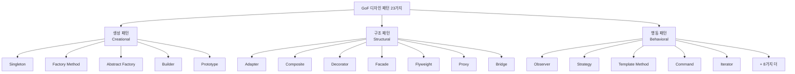
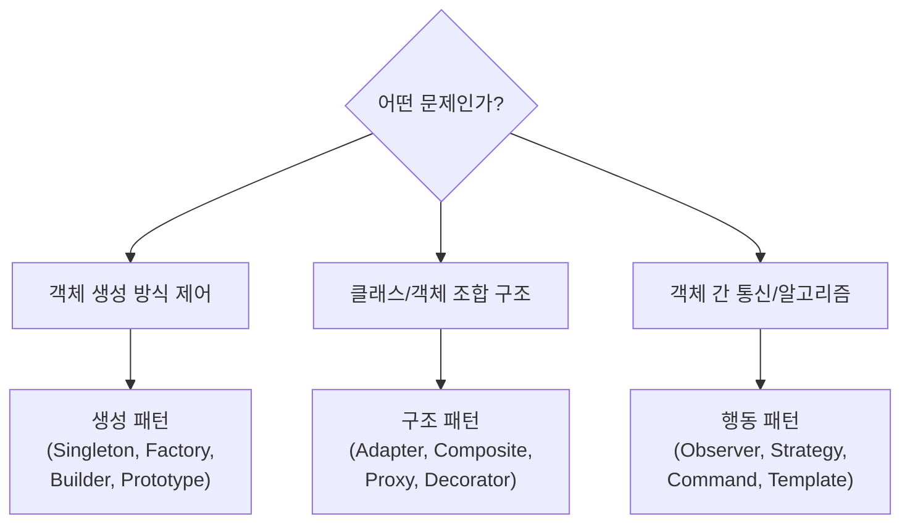

> **한 줄 요약:** 디자인 패턴은 소프트웨어 설계에서 반복적으로 등장하는 문제에 대한 검증된 해결책 템플릿이다.

## 실생활 비유

요리사가 "닭볶음탕 레시피"를 따라 요리한다고 생각해보자. 레시피는 닭볶음탕 그 자체가 아니라, 누구든 따라 하면 맛있는 닭볶음탕을 만들 수 있는 **절차와 노하우**이다. 재료(언어, 프레임워크)가 달라도 레시피(패턴)를 따르면 비슷한 품질의 결과물이 나온다.

디자인 패턴도 마찬가지다. 특정 코드가 아니라, 특정 상황에서 검증된 설계 방식을 문서화한 것이다.

---

## 디자인 패턴 개요

### 왜 필요한가?

소프트웨어를 개발하다 보면 비슷한 구조의 문제가 반복해서 나타난다. 매번 처음부터 해결책을 고민하는 것은 비효율적이며, 팀원마다 다른 방식으로 풀면 코드 일관성이 깨진다.

디자인 패턴을 사용하면 다음을 얻을 수 있다.

- **재사용 가능한 설계:** 검증된 구조를 반복 활용한다.
- **공통 어휘:** "이건 싱글톤이야"라고 말하면 팀원 모두가 즉시 이해한다.
- **유지보수성:** 패턴을 따른 코드는 의도가 명확해 나중에 수정하기 쉽다.
- **객체 간 관계 명확화:** 상호작용과 책임이 분리된다.

### 어떤 문제를 해결하는가?

| 문제 | 패턴이 제공하는 해결책 |
|------|----------------------|
| 인스턴스를 하나만 유지하고 싶다 | Singleton |
| 객체 생성 로직을 감추고 싶다 | Factory Method |
| 기존 인터페이스를 바꾸지 않고 기능을 추가하고 싶다 | Decorator |
| 복잡한 서브시스템을 단순하게 사용하고 싶다 | Facade |
| 상태 변화를 다른 객체에 알리고 싶다 | Observer |

---

## 디자인 패턴의 구조

모든 디자인 패턴은 세 가지 요소로 구성된다.

```
Context (문맥)
  └── 패턴이 적용될 수 있는 상황, 전제 조건

Problem (문제)
  └── 해당 문맥에서 반복적으로 발생하는 설계 이슈
  └── 제약 사항과 트레이드오프 포함

Solution (해결책)
  └── 클래스/객체의 구성 요소와 책임, 협력 방식
  └── 특정 언어에 의존하지 않는 일반적인 템플릿
```

---

## GOF 3대 분류

GoF(Gang of Four)의 저서 *Design Patterns: Elements of Reusable Object-Oriented Software*에서 23가지 패턴을 세 범주로 분류했다.



---

## 생성 패턴 (Creational Patterns)

인스턴스를 만드는 절차를 추상화하는 패턴이다. 객체 **생성 방식**을 캡슐화하여 코드와 객체 생성 로직을 분리한다.

| 패턴 | 핵심 목적 | 한 줄 설명 |
|------|-----------|-----------|
| **Singleton** | 인스턴스 유일성 보장 | 프로그램 전체에서 인스턴스가 딱 하나만 존재하도록 강제한다 |
| **Factory Method** | 생성 로직 캡슐화 | 인풋에 따라 적절한 서브클래스 인스턴스를 반환한다 |
| **Abstract Factory** | 연관 객체 묶음 생성 | if-else 없이 팩토리 객체 자체를 교체해 제품군을 바꾼다 |
| **Builder** | 복잡한 객체 단계적 생성 | 필수/선택 파라미터를 체이닝으로 조립하고 마지막에 build()를 호출한다 |
| **Prototype** | 비용이 큰 객체 복사 | 기존 객체를 clone()해서 재사용함으로써 초기화 비용을 절감한다 |

---

## 구조 패턴 (Structural Patterns)

작은 클래스들을 **상속과 합성**을 이용해 더 큰 구조를 만드는 방법을 제공한다. 런타임에 복합 방식을 변경할 수 있어 유연하다.

| 패턴 | 핵심 목적 | 한 줄 설명 |
|------|-----------|-----------|
| **Adapter** | 인터페이스 변환 | 호환되지 않는 두 인터페이스를 연결하는 변환기 역할을 한다 |
| **Composite** | 부분-전체 트리 구조 | 단일 객체와 복합 객체를 동일한 인터페이스로 다룬다 |
| **Decorator** | 동적 기능 추가 | 상속 없이 객체에 책임을 런타임에 덧붙인다 |
| **Facade** | 서브시스템 단순화 | 복잡한 내부 시스템을 단일 창구로 감싼다 |
| **Flyweight** | 메모리 절약 | 공유 가능한 부분을 캐시해 대량 객체의 메모리 사용을 줄인다 |
| **Proxy** | 접근 제어 | 실제 객체 앞에 대리자를 세워 접근을 통제하거나 부가 기능을 제공한다 |
| **Bridge** | 추상-구현 분리 | 추상화 계층과 구현 계층을 독립적으로 변화할 수 있게 분리한다 |

---

## 행동 패턴 (Behavioral Patterns)

객체나 클래스 **사이의 알고리즘, 책임 분배, 통신 방식**을 정의한다.

| 패턴 | 핵심 목적 | 한 줄 설명 |
|------|-----------|-----------|
| **Observer** | 상태 변화 통보 | 한 객체의 상태 변화를 구독한 다른 객체들에게 자동으로 알린다 |
| **Strategy** | 알고리즘 교체 | 알고리즘 군을 캡슐화하고 런타임에 교체 가능하게 만든다 |
| **Template Method** | 알고리즘 골격 정의 | 상위 클래스에 알고리즘 틀을 두고 세부 단계는 하위 클래스에 위임한다 |
| **Command** | 요청 객체화 | 명령을 객체로 캡슐화해 큐잉, 로깅, 취소를 가능하게 한다 |
| **Iterator** | 순회 표준화 | 내부 구조를 노출하지 않고 컬렉션 요소를 순차적으로 접근한다 |
| **Chain of Responsibility** | 요청 체인 전달 | 요청을 처리할 수 없으면 다음 핸들러로 자동으로 넘긴다 |
| **Mediator** | 복잡한 상호작용 중재 | 객체 간 직접 참조를 없애고 중재자 하나가 통신을 관리한다 |
| **Memento** | 상태 저장/복원 | 객체 내부 상태를 스냅샷으로 저장해 Undo/Redo를 구현한다 |
| **State** | 상태별 행동 변화 | 객체의 상태에 따라 동일한 메서드가 다르게 동작하도록 한다 |
| **Interpreter** | 언어 문법 구현 | SQL, 정규식처럼 문법 규칙을 클래스 계층으로 표현한다 |

---

## 패턴 선택 가이드



---

## 실무 적용 사례 (Spring / JDK)

| 패턴 | Spring/JDK 적용 예 |
|------|-------------------|
| Singleton | `@Bean` 기본 스코프, `ApplicationContext` |
| Factory Method | `BeanFactory`, `NumberFormat.getInstance()` |
| Abstract Factory | `DocumentBuilderFactory` |
| Builder | `StringBuilder`, `UriComponentsBuilder` |
| Prototype | `@Scope("prototype")` 빈 |
| Adapter | `HandlerAdapter`, `Arrays.asList()` |
| Proxy | `@Transactional` AOP, JDK Dynamic Proxy |
| Observer | `ApplicationEvent`, `@EventListener` |
| Template Method | `JdbcTemplate`, `RestTemplate` |
| Decorator | `BufferedInputStream`, `HttpServletRequestWrapper` |

---

## 핵심 포인트 정리

- 디자인 패턴은 **"코드"가 아니라 "설계 방식의 템플릿"**이다. 언어와 무관하게 적용할 수 있다.
- GoF는 23개 패턴을 **생성, 구조, 행동** 세 카테고리로 분류했다.
- 패턴을 외우는 것보다 **어떤 문제를 해결하는지** 이해하는 것이 핵심이다.
- 무조건 적용하는 것은 오히려 복잡도를 높인다. **문제가 있을 때** 적용하라.
- 실무에서 Spring, JDK 곳곳에 패턴이 이미 녹아있다. 코드를 읽을 때 패턴의 눈으로 보면 구조가 빠르게 파악된다.
- 면접에서 패턴을 물어볼 때는 **이름 + 해결하는 문제 + 간단한 예시** 세 가지를 세트로 설명하면 좋다.
