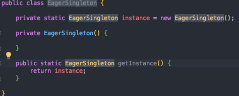
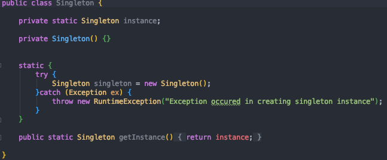
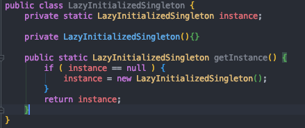
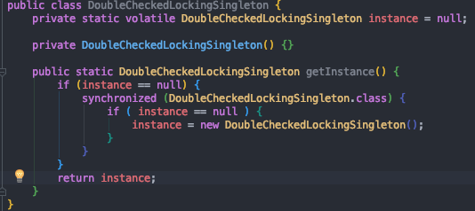
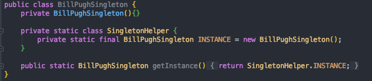
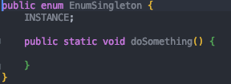

## 싱글톤(Singleton) 패턴이란?

싱글톤 패턴은 객체 지향 디자인 패턴에서 가장 유명한 패턴 중 하나이다.

싱글톤 패턴은 어떤 클래스의 인스턴스가 오직 하나임을 보장하며, 이 인스턴스에 접근 할 수 있는 전역적인 접촉점을 제공하는 패턴이다.

~~Why Singleton need?~~  솔직히 간지나게 영어 좀 써보려다가 잘모르겠어서 한글로 바꿨다.. 왜 싱글톤이 필요하지?

*개발을 하다보면 어떤 클래스에 대해 단 하나의 인스턴스만을 갖도록 하는 것이 좋은 경우가 있다.*

***ex) 로그 찍는 Logger 객체 등 여러 객체를 관리하는 역할의 객체는 프로그램 내에서 단 하나의 인스턴스를 갖는게 바람직하다.***

#### 접근방법?

*싱글톤에 대한 접근 방법은 생성자를 private하게 만들어 클래스 외부에서는 인스턴스를 생성하지 못하게 막고, 내부에서 단 하나의 인스턴스를 생성하여 외부에는 그 인스턴스에 대한 접근 방법을 제공한다.*

#### 싱글톤 패턴을 구현하는 방법은 6가지가 있다.

그러나 각각의 패턴이 공통적으로 갖는 특징이 있는데, 이는 다음과 같다.

* **private 생성자만을 정의해 외부 클래스로부터 인스턴스 생성을 차단한다.**
* **싱글톤을 구현하고자하는 클래스 내부에 멤버 변수로써 private static 객체 변수를 만든다.**
* **public static method를 통해 외부에서 싱글톤 인스턴스에 접근할 수 있도록 접점을 제공한다.**

##### 싱글톤 구현방법 6가지를 자세히 알아보자.

#### Eager Initiailization(Early Loading)

~~해석하자면... 조기 초기화.. 조기 로딩...~~싱글톤 패턴을 구현하는 가장 간단한 방법이다.

Eager Singleton클래스가 로드될 때 Eager Singleton인스턴스가 생성된다. 

Eager Singleton는 클라이언트에서 사용하지 않더라도 인스턴스가 항상 생성된다는 것이 단점이 있는데, 

*재미있는 점은.. **도대체 Eager Singleton는 언제 로드되지?** 이다.* 

 

결국 위 코드를 보면 static 제어자인 getInstance를 호출하지 않으면 EagerSingleton 클래스는 로드 되지않는다. 

***static 초기화가 필요한 경우에는 클래스가 로드되고, 로드된 클래스는 계속해서 메모리에 남아있을 수 있다.***

하지만, 만약 EagerSingleton 클래스에 다른 static Method가 존재하고, 이 다른 메소드가 getInstance()가 호출되기 전에 어딘가에서 호출이 된다면, getInstance() 를 호출하지 않아도 EagerSingleton 클래스의 인스턴스는 생성된다.

***다른 static method에 의해 EagerSingleton 클래스가 로드 되기 때문이다.***

#### Static Block Initialization(Early Loading)	

Static Block Initialization은 Eager Initialization과 유사하다. 다만, 인스턴스가 static block 내에서 만들어지고, static block 안에서 예외처리를 할 수 있다는 점이 다르다.

#### Lazy Initialization

Lazy Initialization은 Eager Initialization의 단점을 보완한 방법이다. 

생성자는 private으로 클래스 내부에서만 호출할 수 있고, 객체 생성은 getInstance() 메소드를 통해서만 가능하다.

instance가 null일 경우에만 인스턴스를 생성하므로 싱글톤패턴에 부합하며, getInstance()의 호출 이외에는 인스턴스를 생성하지 않기 때문에 Eager Initialization의 단점을 보완하였다.

하지만 Lazy Initialization은 멀티스레드 환경에서 Thread Safe하지 않다. 멀티 쓰레드 환경에서 여러 개의 쓰레드가 동시에 instance의 null check를 한다면 여러개의 스레트가 모두 instance가 null이라고 판단하고, 그 결과 여러개의 인스턴스가 생성되므로 싱글톤이 아니다.

 **그럼 어떻게 쓰레드 세이프 하게 ?**

쓰레드 세이프하게 만들려면 getInstance Method 앞에 synchronized 키워드만 붙여주면 된다. 하지만 synchronized 를 메소드에 사용하게 되면, 해당 메소드를 호출할 때 마다 다른 쓰레드에서 접근할 수 없게 되기 때문이다.  이렇게 하면 속도적인 측면에서 성능이 저하된다. 이를 위해 나온 방법이 **Double Checked Locking Pattern**이다.

#### Double Check Locking

이 방법은 Critical Section에만 synchronized 키워드를 사용하는 것이다.

Critical Section[임계 구역]이란 병렬 컴퓨팅에서 둘 이상의 쓰레드가 동시에 접근해서는 안되는 공유 자원을 접근하는 코드의 일부를 말한다.

instance의 null 체크를 synchronized 블록 안,밖에서 한번 하도록 되어있는데, 밖에서 하는 체크는 이미 인스턴스가 생성된 경우 빠르게 인스턴스를 리턴하기 위함이고, 안에서 하는 체크는 인스턴스가 생성되지 않은 경우에 단 한개의 인스턴스만 생성되도록 보장하기 위함이다.

#### Bill Pugh Solution

Bill Pugh Singleton은 현재 가장 널리쓰이는 싱글톤 구현 방법으로써 Buill Pugh가 고안한,

Inner static helper class를 사용하는 방식이다.

Private inner static class를 두어 싱글톤 인스턴스를 갖게 한다.

SingletoneHelper 클래스는 BillPughSingleton 클래스가 Load 될 때에도 Load 되지 않다가 getInstance()가 호출됐을 때 비로소 JVM 메모리에 로드되고, 인스턴스를 생성한다.

또한, synchronized를 사용하지 않기 떄문에 성능 저하의 문제 또한 없다.

#### Enum Singleton

위 싱글톤 방식들은 사실 Java의 Reflection을 통해서 파괴 될 수 있기 때문에 안전하지는 않다.

Enum을 사용한 싱글톤 패턴은 Lazy Loading[메모리 문제]이 아니라는 점과 유연성이 떨어진다는 단점이 있지만,다음과 같이 강력한 장점이 있다.

1. 구현이 쉽다

2. 쓰레드 세이프하게 구현 되어있다.

3. 직렬화/역직렬화 에 대한 처리가 필요없다.

   * 기존의 싱글톤 패턴을 구현한 클래스들은 직렬화를 구현하는 경우, 싱글톤 패턴이 파괴된다.	직렬화 한 객체의 해시코드와 역직렬화[새롭게 인스턴스 생성] 한 객체의 해시코드가 다르기 떄문이다.

     이를 해결하기 위해서는 Serialziable 클래스에 readResolve() 메소드를 추가하면 된다. 

     하지만, Enum Singleton의 경우 직,역직렬화 모두 인스턴스의 해시 코드가 같다.

     이 부분은 다음에 더 자세한 포스팅을 이어 하겠다.
