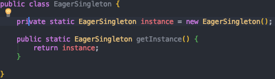

## 싱글톤(Singleton) 패턴이란?

싱글톤 패턴은 객체 지향 디자인 패턴에서 가장 유명한 패턴 중 하나이다.

싱글톤 패턴은 어떤 클래스의 인스턴스가 오직 하나임을 보장하며, 이 인스턴스에 접근 할 수 있는 전역적인 접촉점을 제공하는 패턴이다.

~~Why Singleton ?~~  솔직히 간지나게 영어 좀 써보려다가 잘모르겠어서 한글로 바꿨다.. 왜 싱글톤이 필요하지?

*개발을 하다보면 어떤 클래스에 대해 단 하나의 인스턴스만을 갖도록 하는 것이 좋은 경우가 있다.*

***ex) 로그 찍는 Logger 객체 등 여러 객체를 관리하는 역할의 객체는 프로그램 내에서 단 하나의 인스턴스를 갖는게 바람직하다.***

**접근방법?**

*싱글톤에 대한 접근 방법은 생성자를 private하게 만들어 클래스 외부에서는 인스턴스를 생성하지 못하게 막고, 내부에서 단 하나의 인스턴스를 생성하여 외부에는 그 인스턴스에 대한 접근 방법을 제공한다.*

**싱글톤 패턴을 구현하는 방법은 6가지가 있다.** 

그러나 각각의 패턴이 공통적으로 갖는 특징이 있는데, 이는 다음과 같다.

* **private 생성자만을 정의해 외부 클래스로부터 인스턴스 생성을 차단한다.**
* **싱글톤을 구현하고자하는 클래스 내부에 멤버 변수로써 private static 객체 변수를 만든다.**
* **public static method를 통해 외부에서 싱글톤 인스턴스에 접근할 수 있도록 접점을 제공한다.**

**싱글톤 구현방법 6가지를 자세히 알아보자.**

* **Eager Initiailization(Early Loading)**

  ~~해석하자면... 조기 초기화.. 조기 로딩...~~싱글톤 패턴을 구현하는 가장 간단한 방법이다.

  ​		

​		Eager Singleton클래스가 로드될 때 Eager Singleton인스턴스가 생성된다. 

​		클라이언트에서 사용하지 않더라도 인스턴스가 항상 생성된다는 것이 단점이 있는데,  재미있는 점은.. 

​		**도대체 Eager Singleton는 언제 로드되지?** 이다. 결국 위 코드를 보면 static 제어자인 getInstance를 호출하지 않으면 

​		EagerSingleton 클래스는 로드 되지않는다. **static 초기화가 필요한 경우에는 클래스가 로드되고, 로드된 클래스는 계속 		해서 메모리에 남아있을 수 있다.**

​		하지만, 만약 EagerSingleton 클래스에 다른 static Method가 존재한다고, 이 다른 메소드가 getInstance()가 호출 

​		되기 전에 어딘가에서 호출이 된다면, getInstance() 를 호출하지 않아도 EagerSingleton 클래스의 인스턴스는 생성된다.

​		다른 static method에 의해 EagerSingleton 클래스가 로드 되기 때문이다.

* **Static Block Initialization(Early Loading)**

​		

​	    

