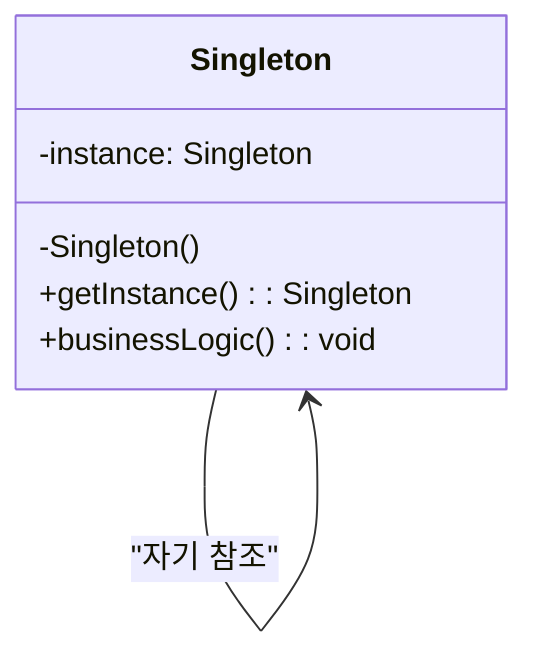
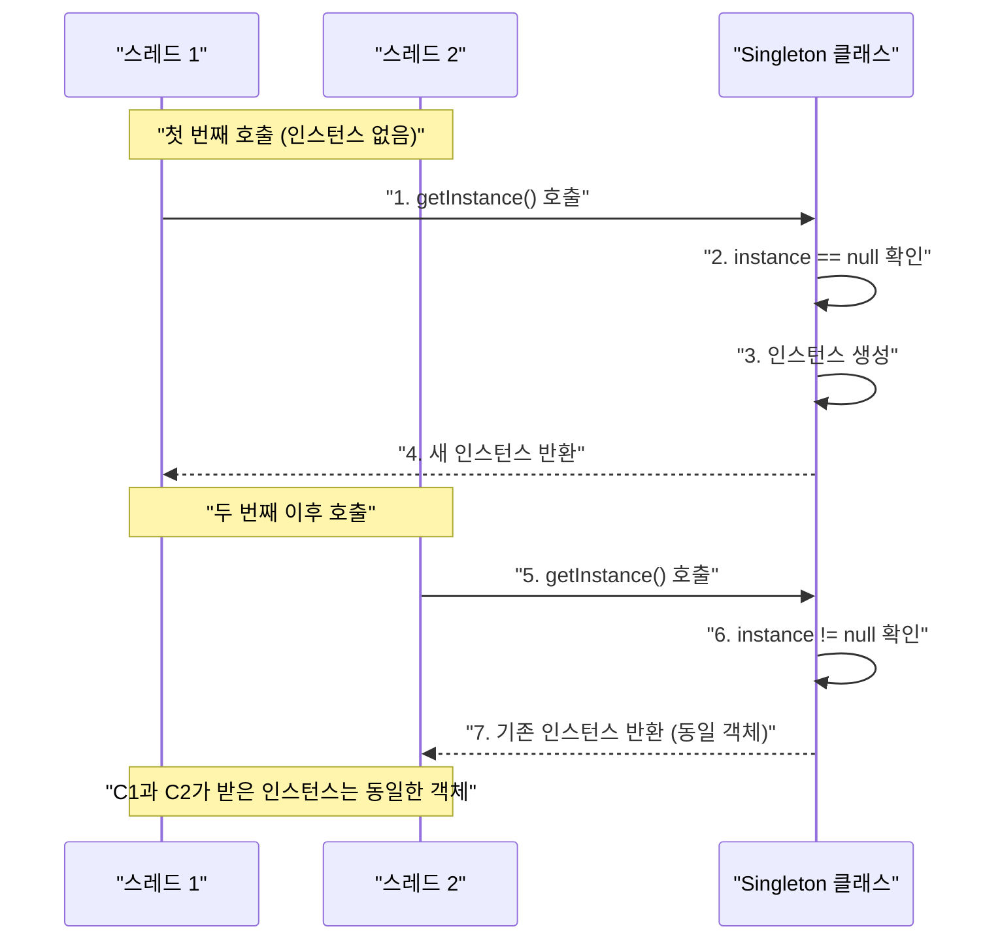

> **한 줄 요약:** 싱글톤 패턴은 클래스의 인스턴스가 프로그램 전체에서 오직 하나만 존재하도록 보장하고, 그 인스턴스에 전역적으로 접근할 수 있는 방법을 제공하는 생성 패턴이다.

## 실생활 비유

정부의 **대통령**을 생각해보자. 한 나라에 대통령은 오직 한 명이다. 누가 "대통령님"을 찾아도 항상 같은 한 사람이 응답한다. 새로운 대통령을 "생성"하려고 해도 기존 대통령이 있는 한 그럴 수 없다.

싱글톤 패턴도 마찬가지다. `new` 키워드로 인스턴스를 아무리 요청해도, 언제나 동일한 하나의 객체가 반환된다.

---

## 싱글톤 패턴 개요

### 왜 필요한가?

개발하다 보면 **프로그램 전체에서 하나의 인스턴스만 있어야 하는** 경우가 있다.

- **로거(Logger):** 로그를 여러 곳에서 기록해도 하나의 파일에 순서대로 써야 한다.
- **설정 관리자:** 애플리케이션 설정은 한 곳에서 일관되게 관리해야 한다.
- **스레드 풀, 커넥션 풀:** 리소스를 공유하는 풀은 하나만 존재해야 낭비가 없다.
- **캐시:** 동일한 데이터를 여러 곳에서 각각 들고 있으면 메모리 낭비다.

### 핵심 3가지 특징

- **private 생성자:** 외부에서 `new`로 인스턴스를 직접 만들지 못하게 한다.
- **private static 인스턴스 변수:** 클래스 내부에 유일한 인스턴스를 보관한다.
- **public static 접근 메서드:** 외부에서 유일한 인스턴스를 얻을 수 있는 창구를 제공한다.

---

## UML 다이어그램


```mermaid
classDiagram
    class Singleton {
        -instance: Singleton
        -Singleton()
        +getInstance(): Singleton
        +businessLogic(): void
    }
    Singleton --> Singleton : "자기 참조"
```

---

## 구현 방법 6가지

### 1. Eager Initialization (이른 초기화)

가장 단순한 방법이다. 클래스가 로드될 때 즉시 인스턴스를 생성한다.

```java
public class EagerSingleton {
    // 클래스 로드 시 즉시 생성
    private static final EagerSingleton INSTANCE = new EagerSingleton();

    private EagerSingleton() {}

    public static EagerSingleton getInstance() {
        return INSTANCE;
    }
}
```

**장점:** 구현이 단순하고 Thread-Safe하다.
**단점:** 클라이언트가 사용하지 않아도 인스턴스가 생성되어 메모리를 차지한다.

---

### 2. Static Block Initialization

Eager와 유사하지만 static 블록 안에서 예외 처리를 할 수 있다.

```java
public class StaticBlockSingleton {
    private static StaticBlockSingleton instance;

    private StaticBlockSingleton() {}

    static {
        try {
            instance = new StaticBlockSingleton();
        } catch (Exception e) {
            throw new RuntimeException("싱글톤 초기화 실패", e);
        }
    }

    public static StaticBlockSingleton getInstance() {
        return instance;
    }
}
```

**장점:** 초기화 중 예외 처리가 가능하다.
**단점:** 여전히 클래스 로드 시 즉시 인스턴스가 생성된다.

---

### 3. Lazy Initialization (지연 초기화)

`getInstance()`가 처음 호출될 때 인스턴스를 생성한다.

```java
public class LazySingleton {
    private static LazySingleton instance;

    private LazySingleton() {}

    public static LazySingleton getInstance() {
        if (instance == null) {
            instance = new LazySingleton();
        }
        return instance;
    }
}
```

**장점:** 실제로 사용될 때만 인스턴스를 생성해 메모리를 절약한다.
**단점:** 멀티스레드 환경에서 Thread-Safe하지 않다. 두 스레드가 동시에 `instance == null`을 통과하면 인스턴스가 2개 생성될 수 있다.

---

### 4. Thread-Safe (synchronized 방식)

`getInstance()`에 `synchronized`를 붙여 멀티스레드 문제를 해결한다.

```java
public class ThreadSafeSingleton {
    private static ThreadSafeSingleton instance;

    private ThreadSafeSingleton() {}

    // synchronized: 한 번에 하나의 스레드만 진입 가능
    public static synchronized ThreadSafeSingleton getInstance() {
        if (instance == null) {
            instance = new ThreadSafeSingleton();
        }
        return instance;
    }
}
```

**장점:** Thread-Safe하다.
**단점:** `getInstance()`가 호출될 때마다 동기화 비용이 발생해 성능이 저하된다.

---

### 5. Double-Checked Locking (권장)

임계 구역(Critical Section)에만 `synchronized`를 적용해 성능 저하를 최소화한다.

```java
public class DoubleCheckedSingleton {
    // volatile: 메모리 가시성 보장 (Java 5 이상)
    private static volatile DoubleCheckedSingleton instance;

    private DoubleCheckedSingleton() {}

    public static DoubleCheckedSingleton getInstance() {
        if (instance == null) {                        // 1차 체크 (비동기)
            synchronized (DoubleCheckedSingleton.class) {
                if (instance == null) {                // 2차 체크 (동기)
                    instance = new DoubleCheckedSingleton();
                }
            }
        }
        return instance;
    }
}
```

**바깥 체크:** 이미 인스턴스가 있으면 동기화 블록을 건너뛰어 빠르게 반환한다.
**안쪽 체크:** 두 스레드가 동시에 바깥 체크를 통과했을 때 하나만 생성하도록 보장한다.

---

### 6. Bill Pugh Solution (가장 널리 사용)

Inner Static Helper Class를 이용하는 방식이다. 현재 가장 많이 권장되는 구현이다.

```java
public class BillPughSingleton {

    private BillPughSingleton() {}

    // SingletonHelper는 getInstance()가 호출될 때 비로소 JVM에 로드된다.
    private static class SingletonHelper {
        private static final BillPughSingleton INSTANCE = new BillPughSingleton();
    }

    public static BillPughSingleton getInstance() {
        return SingletonHelper.INSTANCE;
    }
}
```

**장점:**
- Lazy Loading: `getInstance()`가 호출될 때 내부 클래스가 로드되어 인스턴스가 생성된다.
- `synchronized` 없이도 Thread-Safe하다. JVM의 클래스 로딩 메커니즘이 보장한다.
- 성능 저하가 없다.

---

### 7. Enum Singleton (Reflection 공격에 안전)

Java Reflection을 통해 private 생성자를 강제 호출하면 위의 방식들은 싱글톤이 깨질 수 있다. Enum은 이를 원천적으로 차단한다.

```java
public enum EnumSingleton {
    INSTANCE;

    public void businessLogic() {
        System.out.println("싱글톤 Enum 메서드 실행");
    }
}

// 사용
EnumSingleton singleton = EnumSingleton.INSTANCE;
singleton.businessLogic();
```

**장점:**
- 구현이 가장 단순하다.
- Thread-Safe하다.
- Reflection 공격으로 싱글톤이 깨지지 않는다.
- 직렬화/역직렬화 시에도 인스턴스가 유지된다.

**단점:** Lazy Loading이 아니다. Enum 클래스 로드 시 즉시 생성된다.

---

## 동작 흐름


```mermaid
sequenceDiagram
    participant C1 as "스레드 1"
    participant C2 as "스레드 2"
    participant S as "Singleton 클래스"

    Note over C1,C2: "첫 번째 호출 (인스턴스 없음)"
    C1->>S: "1. getInstance() 호출"
    S->>S: "2. instance == null 확인"
    S->>S: "3. 인스턴스 생성"
    S-->>C1: "4. 새 인스턴스 반환"

    Note over C1,C2: "두 번째 이후 호출"
    C2->>S: "5. getInstance() 호출"
    S->>S: "6. instance != null 확인"
    S-->>C2: "7. 기존 인스턴스 반환 (동일 객체)"

    Note over C1,C2: "C1과 C2가 받은 인스턴스는 동일한 객체"
```

---

## 구현 방법 비교표

| 방법 | Thread-Safe | Lazy Loading | 성능 | Reflection 안전 | 권장 |
|------|:-----------:|:------------:|:----:|:---------------:|:----:|
| Eager Initialization | O | X | 빠름 | X | 단순한 경우 |
| Static Block | O | X | 빠름 | X | 예외 처리 필요 시 |
| Lazy Initialization | X | O | 빠름 | X | 단일 스레드만 |
| synchronized | O | O | 느림 | X | 비권장 |
| Double-Checked | O | O | 빠름 | X | 권장 |
| Bill Pugh | O | O | 빠름 | X | **가장 권장** |
| Enum | O | X | 빠름 | **O** | Reflection 방어 필요 시 |

---

## 실무 적용 사례

### Spring Framework

Spring의 `@Bean`은 기본적으로 싱글톤 스코프다. 컨테이너 내에 하나의 인스턴스만 존재한다.

```java
@Configuration
public class AppConfig {

    @Bean  // 기본 스코프 = singleton
    public UserService userService() {
        return new UserService();
    }

    @Bean
    @Scope("prototype")  // 요청마다 새 인스턴스 생성
    public UserDto userDto() {
        return new UserDto();
    }
}
```

### Logger 패턴

```java
// Log4j, SLF4J 등의 Logger는 내부적으로 싱글톤
private static final Logger log = LoggerFactory.getLogger(UserService.class);

public void createUser(String name) {
    log.info("사용자 생성: {}", name);
    // ...
}
```

### 데이터베이스 커넥션 풀

```java
public class DatabaseConnectionPool {
    private static volatile DatabaseConnectionPool instance;
    private final List<Connection> pool;

    private DatabaseConnectionPool() {
        pool = new ArrayList<>();
        // 커넥션 10개 초기화
        for (int i = 0; i < 10; i++) {
            pool.add(createConnection());
        }
    }

    public static DatabaseConnectionPool getInstance() {
        if (instance == null) {
            synchronized (DatabaseConnectionPool.class) {
                if (instance == null) {
                    instance = new DatabaseConnectionPool();
                }
            }
        }
        return instance;
    }

    public Connection getConnection() {
        return pool.remove(pool.size() - 1);
    }

    public void releaseConnection(Connection conn) {
        pool.add(conn);
    }
}
```

---

## 장단점 비교

| 항목 | 내용 |
|------|------|
| **장점: 메모리 절약** | 인스턴스를 하나만 생성하므로 메모리를 효율적으로 사용한다 |
| **장점: 전역 접근** | 어디서든 동일한 인스턴스에 접근할 수 있어 공유 자원 관리가 쉽다 |
| **장점: 일관성** | 항상 같은 객체이므로 상태 일관성이 유지된다 |
| **단점: 테스트 어려움** | 전역 상태를 가지므로 단위 테스트 시 Mock 객체로 교체하기 어렵다 |
| **단점: OCP 위반 가능** | 싱글톤 클래스에 기능이 계속 추가되면 단일 책임 원칙이 깨질 수 있다 |
| **단점: 멀티스레드 주의** | 구현 방식을 잘못 선택하면 멀티스레드 환경에서 인스턴스가 여러 개 생성될 수 있다 |
| **단점: 의존성 숨김** | 생성자 주입 없이 전역으로 접근하기 때문에 의존성이 코드에서 보이지 않는다 |

---

## 핵심 포인트 정리

- 싱글톤 패턴은 **인스턴스가 오직 하나임을 보장**하는 생성 패턴이다.
- 구현 방법은 여러 가지이지만 **Bill Pugh Solution(Inner Static Helper)**이 가장 널리 권장된다.
- **멀티스레드 환경**에서는 반드시 Thread-Safe한 구현을 선택해야 한다.
- **Reflection 공격**을 방어해야 하는 보안이 중요한 환경에서는 **Enum Singleton**을 사용한다.
- Spring의 `@Bean` 기본 스코프가 싱글톤이므로 Spring을 사용한다면 싱글톤 관리는 컨테이너에 맡기는 것이 일반적이다.
- 단위 테스트에서 싱글톤은 테스트하기 어려우므로, 테스트 용이성이 중요하면 **의존성 주입(DI)**을 함께 고려한다.
