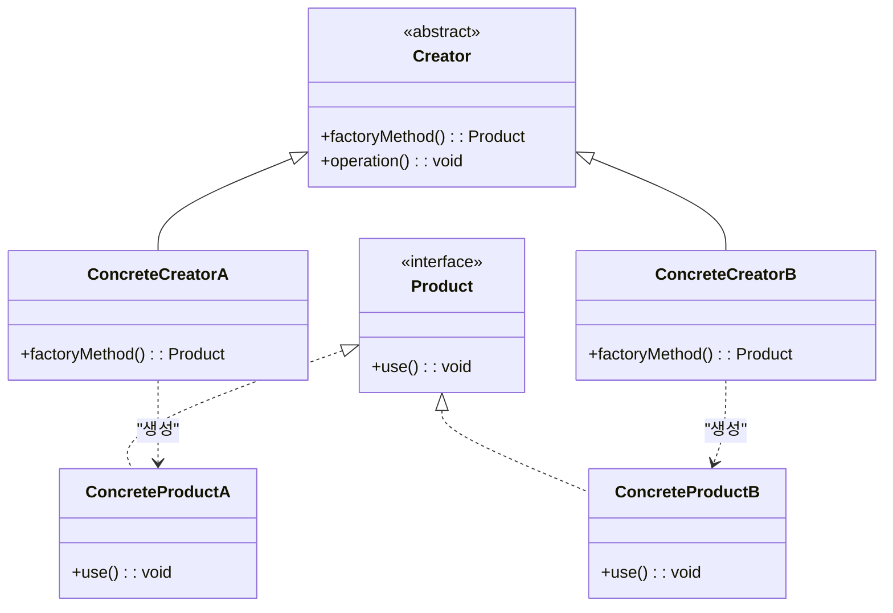
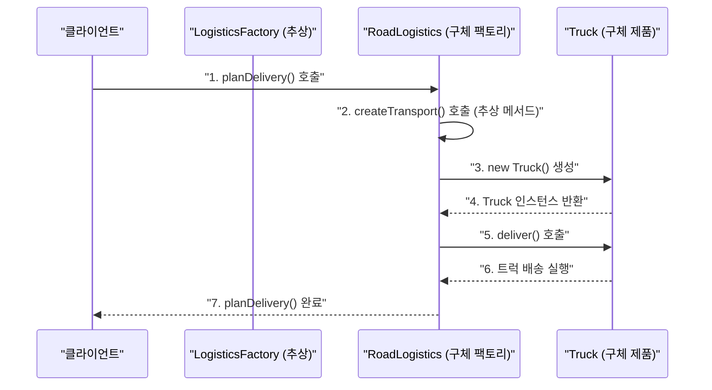

> **한 줄 요약:** 팩토리 메서드 패턴은 객체 생성 로직을 서브클래스에 위임하여, 클라이언트 코드가 구체적인 클래스에 의존하지 않고도 객체를 생성할 수 있게 하는 생성 패턴이다.

## 실생활 비유

**음료 자판기**를 생각해보자. 자판기 앞에 선 사람은 "커피", "녹차", "주스" 버튼만 누른다. 자판기 내부에서 어떤 캡슐을 쓰는지, 물 온도는 몇 도인지, 설탕을 얼마나 넣는지 알 필요가 없다.

팩토리 메서드 패턴도 마찬가지다. 클라이언트는 어떤 객체가 필요한지만 말하고, 구체적인 생성 과정은 팩토리가 책임진다.

---

## 패턴 개요

### 언제 사용하는가?

- 생성해야 할 객체의 정확한 클래스를 **미리 알 수 없을 때**
- 객체 생성 책임을 **서브클래스에게 위임**하고 싶을 때
- 여러 곳에 흩어진 `new SomeClass()` 코드를 **한 곳으로 모으고** 싶을 때
- 새로운 타입이 추가되어도 **기존 클라이언트 코드를 수정하지 않고** 확장하고 싶을 때 (OCP 원칙)

### Simple Factory vs Factory Method

| 구분 | Simple Factory | Factory Method |
|------|---------------|----------------|
| 구조 | 단일 팩토리 클래스 | 추상 팩토리 + 구체 팩토리 |
| 확장 | if-else 수정 필요 | 새 서브클래스 추가만 |
| OCP | 위반 가능 | 준수 |
| 복잡도 | 낮음 | 중간 |

---

## UML 다이어그램



---

## Java 코드 예제

### 예제 시나리오: 배송 수단 팩토리

물류 시스템에서 육상 배송과 해상 배송 객체를 팩토리 메서드로 생성하는 예제다.

**Product 인터페이스**

```java
// 모든 배송 수단이 구현해야 하는 인터페이스
public interface Transport {
    void deliver();
    String getType();
}
```

**Concrete Product - 트럭 배송**

```java
public class Truck implements Transport {

    @Override
    public void deliver() {
        System.out.println("트럭으로 육로 배송합니다.");
    }

    @Override
    public String getType() {
        return "TRUCK";
    }
}
```

**Concrete Product - 선박 배송**

```java
public class Ship implements Transport {

    @Override
    public void deliver() {
        System.out.println("선박으로 해상 배송합니다.");
    }

    @Override
    public String getType() {
        return "SHIP";
    }
}
```

**Abstract Creator - 추상 팩토리**

```java
public abstract class LogisticsFactory {

    // 팩토리 메서드: 서브클래스가 구현
    public abstract Transport createTransport();

    // 공통 로직: 팩토리 메서드로 생성된 객체를 사용
    public void planDelivery() {
        Transport transport = createTransport();
        System.out.println("[" + transport.getType() + "] 배송 계획 수립 완료");
        transport.deliver();
    }
}
```

**Concrete Creator - 육상 물류**

```java
public class RoadLogistics extends LogisticsFactory {

    @Override
    public Transport createTransport() {
        return new Truck();
    }
}
```

**Concrete Creator - 해상 물류**

```java
public class SeaLogistics extends LogisticsFactory {

    @Override
    public Transport createTransport() {
        return new Ship();
    }
}
```

**클라이언트 코드**

```java
public class Main {
    public static void main(String[] args) {
        // 클라이언트는 구체 클래스(Truck, Ship)를 직접 알 필요 없음
        LogisticsFactory factory = new RoadLogistics();
        factory.planDelivery();
        // 출력: [TRUCK] 배송 계획 수립 완료
        //       트럭으로 육로 배송합니다.

        factory = new SeaLogistics();
        factory.planDelivery();
        // 출력: [SHIP] 배송 계획 수립 완료
        //       선박으로 해상 배송합니다.
    }
}
```

### Simple Factory 방식 (비교용)

```java
// Simple Factory: if-else로 분기하는 방식
// 새 타입 추가 시 이 클래스를 수정해야 해 OCP 위반
public class SimpleTransportFactory {

    public static Transport getTransport(String type) {
        if ("TRUCK".equals(type)) {
            return new Truck();
        } else if ("SHIP".equals(type)) {
            return new Ship();
        }
        throw new IllegalArgumentException("알 수 없는 배송 타입: " + type);
    }
}
```

---

## 동작 흐름



---

## 새 배송 수단 추가 시 (OCP 준수)

항공 배송이 추가되어도 기존 코드는 전혀 수정하지 않는다.

```java
// 1. 새 제품 클래스 추가
public class Airplane implements Transport {
    @Override
    public void deliver() {
        System.out.println("항공기로 항공 배송합니다.");
    }

    @Override
    public String getType() {
        return "AIRPLANE";
    }
}

// 2. 새 팩토리 클래스 추가
public class AirLogistics extends LogisticsFactory {
    @Override
    public Transport createTransport() {
        return new Airplane();
    }
}

// 3. 클라이언트: 기존 코드 수정 없이 확장
LogisticsFactory airFactory = new AirLogistics();
airFactory.planDelivery();
```

---

## 실무 적용 사례

| 프레임워크/라이브러리 | 팩토리 메서드 적용 예 |
|--------------------|-------------------|
| **Spring** | `BeanFactory.getBean()` — 빈 타입에 따라 다른 객체 반환 |
| **JDK** | `NumberFormat.getInstance()` — 로케일에 맞는 포매터 반환 |
| **JDK** | `Calendar.getInstance()` — 시스템 설정에 맞는 Calendar 반환 |
| **JDBC** | `DriverManager.getConnection()` — DB 종류에 따른 커넥션 반환 |
| **Slf4j** | `LoggerFactory.getLogger()` — 구현체에 따른 Logger 반환 |

### Spring에서의 활용 예

```java
@Service
public class NotificationService {

    // 팩토리 메서드 패턴: 타입에 따라 다른 알림 객체 생성
    private Notifier createNotifier(String type) {
        switch (type) {
            case "EMAIL": return new EmailNotifier();
            case "SMS":   return new SmsNotifier();
            case "PUSH":  return new PushNotifier();
            default: throw new IllegalArgumentException("알 수 없는 알림 타입: " + type);
        }
    }

    public void sendNotification(String type, String message) {
        Notifier notifier = createNotifier(type);
        notifier.send(message);
    }
}
```

---

## 장단점 비교

| 항목 | 내용 |
|------|------|
| **장점: OCP 준수** | 새로운 제품 타입을 추가해도 기존 Creator 코드를 수정하지 않는다 |
| **장점: SRP 준수** | 객체 생성 코드가 팩토리로 분리되어 각 클래스의 책임이 명확해진다 |
| **장점: 느슨한 결합** | 클라이언트가 구체 클래스에 직접 의존하지 않는다 |
| **단점: 클래스 수 증가** | 제품 타입마다 Creator 서브클래스가 필요해 클래스 수가 늘어난다 |
| **단점: 복잡도 증가** | Simple Factory 대비 구조가 복잡하다 |

---

## 핵심 포인트 정리

- 팩토리 메서드 패턴은 **객체 생성을 서브클래스에 위임**하는 생성 패턴이다.
- 클라이언트는 **어떤 클래스가 생성되는지 알 필요 없이** 팩토리 메서드만 호출한다.
- 새 제품 타입이 생겨도 **기존 코드를 수정하지 않고 서브클래스만 추가**하면 된다 (OCP).
- JDK와 Spring 곳곳에서 팩토리 메서드 패턴이 사용되고 있다.
- 타입이 2~3개 이하로 고정되고 변경이 거의 없다면 **Simple Factory로도 충분**하다. 패턴을 과도하게 적용하면 오히려 복잡도만 높아진다.
