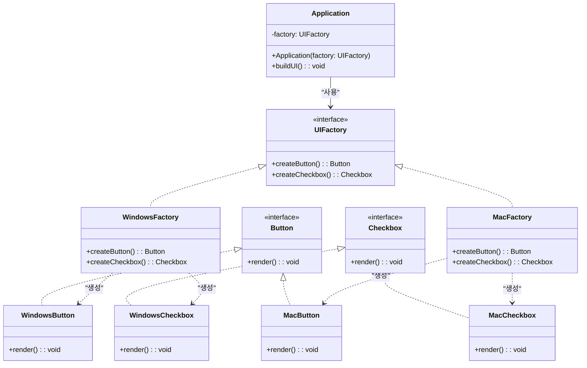
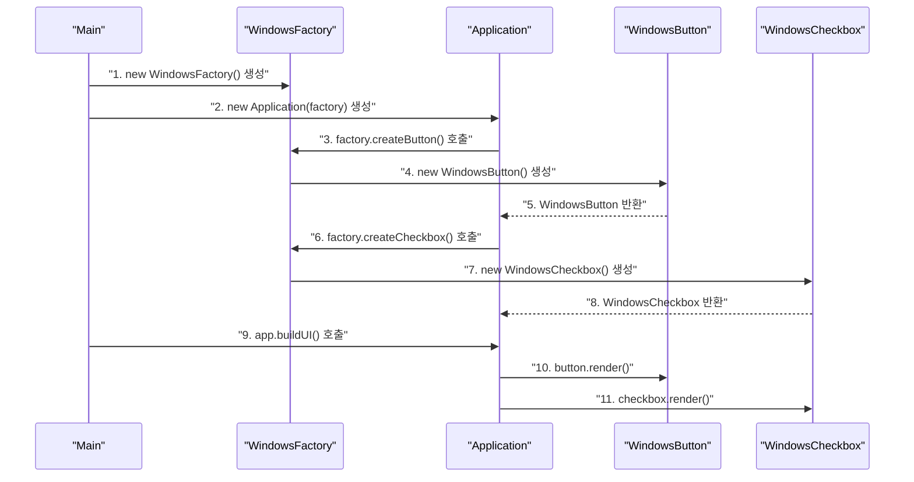

> **한 줄 요약:** 추상 팩토리 패턴은 관련된 객체들의 묶음(제품군)을 if-else 없이 팩토리 객체 자체를 교체하는 방식으로 생성하는 패턴이다.

## 실생활 비유

**가구 브랜드**를 생각해보자. 이케아(IKEA) 스타일로 집을 꾸민다면 소파, 테이블, 의자가 모두 이케아 디자인으로 통일된다. 한샘(HANSSEM) 스타일로 바꾼다면 소파, 테이블, 의자가 모두 한샘 제품으로 교체된다.

이때 각 가구를 하나씩 고르는 것이 아니라 **"이케아 공장"** 또는 **"한샘 공장"** 자체를 선택하고, 해당 공장에서 전체 가구 세트를 생산한다.

추상 팩토리 패턴은 이처럼 **팩토리 객체 자체를 교체**해서 연관된 객체 묶음 전체를 일관성 있게 바꾸는 패턴이다.

---

## 팩토리 메서드 vs 추상 팩토리

| 구분 | 팩토리 메서드 | 추상 팩토리 |
|------|-------------|-----------|
| 목적 | 하나의 제품 생성 | 연관된 제품군 생성 |
| 분기 제거 | 서브클래스로 위임 | 팩토리 객체 교체 |
| 구조 | Creator 상속 | Factory 인터페이스 구현 |
| 확장 | 새 Creator 추가 | 새 Factory 구현체 추가 |
| 적합한 상황 | 단일 제품, 생성 로직 위임 | 제품군 일관성 유지 필요 |

---

## UML 다이어그램



---

## Java 코드 예제

### 예제 시나리오: OS별 UI 컴포넌트 생성

Windows와 Mac 환경에서 각각 다른 스타일의 버튼과 체크박스를 생성하는 예제다.

**제품 인터페이스**

```java
// 버튼 제품 인터페이스
public interface Button {
    void render();
    void onClick();
}

// 체크박스 제품 인터페이스
public interface Checkbox {
    void render();
    boolean isChecked();
}
```

**Windows 제품 구현체**

```java
public class WindowsButton implements Button {

    @Override
    public void render() {
        System.out.println("Windows 스타일 버튼을 렌더링합니다.");
    }

    @Override
    public void onClick() {
        System.out.println("Windows 버튼 클릭 이벤트 처리");
    }
}

public class WindowsCheckbox implements Checkbox {
    private boolean checked = false;

    @Override
    public void render() {
        System.out.println("Windows 스타일 체크박스를 렌더링합니다.");
    }

    @Override
    public boolean isChecked() {
        return checked;
    }
}
```

**Mac 제품 구현체**

```java
public class MacButton implements Button {

    @Override
    public void render() {
        System.out.println("Mac 스타일 버튼을 렌더링합니다.");
    }

    @Override
    public void onClick() {
        System.out.println("Mac 버튼 클릭 이벤트 처리");
    }
}

public class MacCheckbox implements Checkbox {
    private boolean checked = false;

    @Override
    public void render() {
        System.out.println("Mac 스타일 체크박스를 렌더링합니다.");
    }

    @Override
    public boolean isChecked() {
        return checked;
    }
}
```

**추상 팩토리 인터페이스**

```java
// 추상 팩토리: 연관된 제품군을 생성하는 메서드들을 선언
public interface UIFactory {
    Button createButton();
    Checkbox createCheckbox();
}
```

**구체 팩토리 구현체**

```java
// Windows 전용 팩토리: Windows 제품군만 생성
public class WindowsFactory implements UIFactory {

    @Override
    public Button createButton() {
        return new WindowsButton();
    }

    @Override
    public Checkbox createCheckbox() {
        return new WindowsCheckbox();
    }
}

// Mac 전용 팩토리: Mac 제품군만 생성
public class MacFactory implements UIFactory {

    @Override
    public Button createButton() {
        return new MacButton();
    }

    @Override
    public Checkbox createCheckbox() {
        return new MacCheckbox();
    }
}
```

**클라이언트 코드**

```java
// Application은 UIFactory 인터페이스만 알고 있다.
// Windows인지 Mac인지 전혀 모른다.
public class Application {
    private final Button button;
    private final Checkbox checkbox;

    public Application(UIFactory factory) {
        // 팩토리 교체만으로 전체 UI 스타일이 바뀐다
        this.button = factory.createButton();
        this.checkbox = factory.createCheckbox();
    }

    public void buildUI() {
        button.render();
        checkbox.render();
    }
}

// Main: OS에 따라 팩토리만 교체
public class Main {
    public static void main(String[] args) {
        String os = System.getProperty("os.name").toLowerCase();

        UIFactory factory;
        if (os.contains("windows")) {
            factory = new WindowsFactory();
        } else {
            factory = new MacFactory();
        }

        // 클라이언트 코드는 변경 없이 팩토리만 교체
        Application app = new Application(factory);
        app.buildUI();
    }
}
```

---

## 동작 흐름



---

## 새 플랫폼 추가 시 (OCP 준수)

Linux UI가 추가되어도 기존 코드는 전혀 수정하지 않는다.

```java
// 1. Linux 제품 클래스 추가
public class LinuxButton implements Button {
    @Override
    public void render() {
        System.out.println("Linux 스타일 버튼을 렌더링합니다.");
    }

    @Override
    public void onClick() {
        System.out.println("Linux 버튼 클릭 이벤트 처리");
    }
}

public class LinuxCheckbox implements Checkbox {
    @Override
    public void render() {
        System.out.println("Linux 스타일 체크박스를 렌더링합니다.");
    }

    @Override
    public boolean isChecked() { return false; }
}

// 2. Linux 팩토리 추가 (기존 코드 수정 없음)
public class LinuxFactory implements UIFactory {
    @Override
    public Button createButton() {
        return new LinuxButton();
    }

    @Override
    public Checkbox createCheckbox() {
        return new LinuxCheckbox();
    }
}
```

---

## 실무 적용 사례

| 분야 | 추상 팩토리 적용 예 |
|------|-----------------|
| **JDK** | `DocumentBuilderFactory` — XML 파서 구현체 교체 |
| **JDBC** | `Connection` 객체 — DB 종류에 따른 드라이버별 팩토리 |
| **Spring** | `PlatformTransactionManager` — DB 종류에 따른 트랜잭션 팩토리 |
| **테마 시스템** | 라이트/다크 모드 UI 컴포넌트 일괄 교체 |
| **게임 개발** | 맵 종류에 따른 지형, 적군, 아이템 세트 일괄 생성 |

### 실무 Spring 예제: 결제 수단별 팩토리

```java
// 결제 관련 객체군을 일관성 있게 생성
public interface PaymentFactory {
    PaymentValidator createValidator();
    PaymentProcessor createProcessor();
    PaymentNotifier createNotifier();
}

public class KakaoPayFactory implements PaymentFactory {
    @Override
    public PaymentValidator createValidator() {
        return new KakaoPayValidator();
    }

    @Override
    public PaymentProcessor createProcessor() {
        return new KakaoPayProcessor();
    }

    @Override
    public PaymentNotifier createNotifier() {
        return new KakaoPayNotifier();
    }
}

public class NaverPayFactory implements PaymentFactory {
    @Override
    public PaymentValidator createValidator() {
        return new NaverPayValidator();
    }

    @Override
    public PaymentProcessor createProcessor() {
        return new NaverPayProcessor();
    }

    @Override
    public PaymentNotifier createNotifier() {
        return new NaverPayNotifier();
    }
}
```

---

## 장단점 비교

| 항목 | 내용 |
|------|------|
| **장점: 제품군 일관성** | 같은 팩토리에서 생성된 제품들은 서로 호환됨이 보장된다 |
| **장점: OCP 준수** | 새 제품군 추가 시 기존 코드를 수정하지 않는다 |
| **장점: 결합도 감소** | 클라이언트가 구체 제품 클래스를 직접 참조하지 않는다 |
| **단점: 복잡도 증가** | 제품 종류가 늘어날수록 인터페이스와 클래스 수가 크게 늘어난다 |
| **단점: 제품군 확장 어려움** | 기존 팩토리에 새 제품 종류를 추가하면 모든 구현 팩토리를 수정해야 한다 |

---

## 핵심 포인트 정리

- 추상 팩토리 패턴은 **연관된 객체들의 묶음(제품군)을 일관성 있게 생성**하는 패턴이다.
- 팩토리 메서드 패턴이 **단일 제품**을 대상으로 한다면, 추상 팩토리는 **여러 제품의 묶음**을 대상으로 한다.
- 핵심은 **팩토리 객체 자체를 교체**함으로써 관련 객체 전체를 한꺼번에 바꿀 수 있다는 점이다.
- 새로운 **제품군(플랫폼, 테마 등)이 자주 추가**되는 시스템에 적합하다.
- 반면 기존 팩토리에 **새 제품 종류**를 추가하려면 모든 팩토리 구현체를 수정해야 해 주의가 필요하다.
