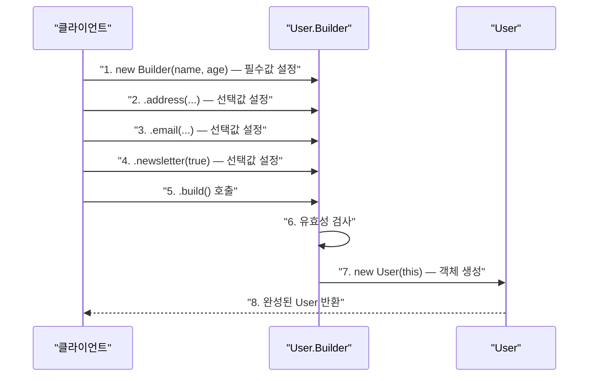

> **한 줄 요약:** 빌더 패턴은 복잡한 객체를 단계적으로 조립하는 패턴으로, 필수 값은 생성자로, 선택 값은 메서드 체이닝으로 받아 마지막에 `build()`로 완성된 객체를 반환한다.

## 실생활 비유

**서브웨이(Subway) 샌드위치**를 주문하는 과정을 떠올려보자.

1. 빵 종류 선택 (필수)
2. 사이즈 선택 (필수)
3. 채소 추가 (선택)
4. 소스 추가 (선택)
5. 추가 토핑 (선택)
6. 결제 (완성)

각 단계를 원하는 대로 선택하고, 마지막에 완성된 샌드위치를 받는다. 빌더 패턴도 똑같이 동작한다. 필요한 속성을 하나씩 설정하고 `build()`를 호출해 완성된 객체를 받는다.

---

## 패턴 개요

### 왜 빌더 패턴이 필요한가?

**문제 상황: 점층적 생성자 패턴(Telescoping Constructor)**

```java
// 파라미터가 많아지면 어떤 값이 무엇인지 알 수 없다
User user1 = new User("홍길동", 30, "서울", "010-1234-5678", "hong@mail.com", true, false);
//                     이름    나이  주소    전화번호          이메일      알림여부  탈퇴여부
// 7번째 파라미터가 뭘 의미하는지 바로 알기 어렵다
```

**또 다른 문제: null 파라미터 강제 전달**

```java
// 이메일이 없는 경우 null을 강제로 넣어야 한다
User user2 = new User("김철수", 25, "부산", "010-9876-5432", null, true, false);
```

빌더 패턴은 이 두 가지 문제를 해결한다.

### 빌더 패턴의 4가지 구현 원칙

1. 빌더 클래스를 **Static Nested Class**로 생성한다
2. 빌더 생성자는 **public**이며, 필수 값을 파라미터로 받는다
3. 선택 값은 각각 **메서드로 제공**하며, 메서드는 **빌더 자신(this)을 반환**해 체이닝이 가능하게 한다
4. `build()` 메서드에서 최종 객체를 생성하며, 대상 클래스의 생성자는 **private**으로 제한한다

---

## UML 다이어그램

```mermaid
classDiagram
    class User {
        -name: String
        -age: int
        -address: String
        -phone: String
        -email: String
        -User(builder: Builder)
        +getName(): String
        +getAge(): int
    }
    class Builder {
        -name: String
        -age: int
        -address: String
        -phone: String
        -email: String
        +Builder(name: String, age: int)
        +address(address: String): Builder
        +phone(phone: String): Builder
        +email(email: String): Builder
        +build(): User
    }

    User +-- Builder : "내부 클래스"
    Builder ..> User : "생성"
```

---

## Java 코드 예제

### 기본 빌더 패턴

```java
public class User {
    // 필수 필드
    private final String name;
    private final int age;

    // 선택 필드 (기본값 설정 가능)
    private final String address;
    private final String phone;
    private final String email;
    private final boolean newsletter;

    // private 생성자: 외부에서 직접 생성 불가, 빌더를 통해서만 생성 가능
    private User(Builder builder) {
        this.name = builder.name;
        this.age = builder.age;
        this.address = builder.address;
        this.phone = builder.phone;
        this.email = builder.email;
        this.newsletter = builder.newsletter;
    }

    // getter 메서드만 제공 (setter 없음 → 불변 객체)
    public String getName() { return name; }
    public int getAge() { return age; }
    public String getAddress() { return address; }
    public String getPhone() { return phone; }
    public String getEmail() { return email; }
    public boolean isNewsletter() { return newsletter; }

    @Override
    public String toString() {
        return "User{name='" + name + "', age=" + age
                + ", address='" + address + "', phone='" + phone
                + "', email='" + email + "', newsletter=" + newsletter + "}";
    }

    // Static Nested Builder Class
    public static class Builder {
        // 필수 필드
        private final String name;
        private final int age;

        // 선택 필드 (기본값 설정)
        private String address = "";
        private String phone = "";
        private String email = "";
        private boolean newsletter = false;

        // 빌더 생성자: 필수 값만 받는다
        public Builder(String name, int age) {
            this.name = name;
            this.age = age;
        }

        // 선택 값 설정 메서드: 반드시 this를 반환해 체이닝 가능하게 함
        public Builder address(String address) {
            this.address = address;
            return this;
        }

        public Builder phone(String phone) {
            this.phone = phone;
            return this;
        }

        public Builder email(String email) {
            this.email = email;
            return this;
        }

        public Builder newsletter(boolean newsletter) {
            this.newsletter = newsletter;
            return this;
        }

        // 최종 객체 생성
        public User build() {
            return new User(this);
        }
    }
}
```

**클라이언트 사용 코드**

```java
public class Main {
    public static void main(String[] args) {
        // 모든 필드를 설정하는 경우
        User fullUser = new User.Builder("홍길동", 30)
                .address("서울시 강남구")
                .phone("010-1234-5678")
                .email("hong@example.com")
                .newsletter(true)
                .build();

        System.out.println(fullUser);
        // 출력: User{name='홍길동', age=30, address='서울시 강남구', ...}

        // 필수 값만 설정하는 경우 (선택 필드는 기본값 사용)
        User minimalUser = new User.Builder("김철수", 25)
                .build();

        System.out.println(minimalUser);
        // 출력: User{name='김철수', age=25, address='', ...}

        // 일부 필드만 설정하는 경우
        User partialUser = new User.Builder("이영희", 28)
                .email("lee@example.com")
                .newsletter(true)
                .build();

        System.out.println(partialUser);
    }
}
```

---

## 빌더에 유효성 검사 추가

```java
public User build() {
    // build() 시점에 유효성 검사 가능
    if (name == null || name.trim().isEmpty()) {
        throw new IllegalStateException("이름은 필수입니다.");
    }
    if (age < 0 || age > 150) {
        throw new IllegalStateException("나이가 올바르지 않습니다: " + age);
    }
    if (email != null && !email.isEmpty() && !email.contains("@")) {
        throw new IllegalStateException("이메일 형식이 올바르지 않습니다: " + email);
    }
    return new User(this);
}
```

---

## 동작 흐름



---

## Lombok @Builder 활용

실무에서는 Lombok의 `@Builder` 어노테이션을 사용하면 빌더 코드를 자동 생성할 수 있다.

```java
import lombok.Builder;
import lombok.Getter;
import lombok.ToString;

@Getter
@Builder
@ToString
public class Order {
    private final String orderId;      // 필수
    private final String productName;  // 필수

    @Builder.Default
    private final int quantity = 1;    // 기본값 1

    @Builder.Default
    private final boolean express = false;  // 기본값 false

    private final String deliveryAddress;   // 선택
    private final String couponCode;        // 선택
}
```

**Lombok 빌더 사용 예**

```java
Order order = Order.builder()
        .orderId("ORD-20241201-001")
        .productName("노트북")
        .quantity(2)
        .express(true)
        .deliveryAddress("서울시 마포구")
        .build();

System.out.println(order);
```

---

## 실무 적용 사례

| 사례 | 빌더 적용 예 |
|------|------------|
| **JDK** | `StringBuilder`, `StringBuffer` |
| **JDK** | `ProcessBuilder` — 프로세스 실행 옵션 조립 |
| **Spring** | `UriComponentsBuilder` — URI 조립 |
| **Spring Security** | `HttpSecurity` 설정 체이닝 |
| **Lombok** | `@Builder` 어노테이션 자동 생성 |
| **OkHttp** | `Request.Builder()` — HTTP 요청 조립 |

### Spring에서의 URI 빌더

```java
// UriComponentsBuilder는 빌더 패턴의 실무 예
URI uri = UriComponentsBuilder
        .fromHttpUrl("https://api.example.com")
        .path("/v1/users/{userId}")
        .queryParam("include", "profile")
        .queryParam("format", "json")
        .buildAndExpand("12345")
        .toUri();
```

---

## 장단점 비교

| 항목 | 내용 |
|------|------|
| **장점: 가독성** | 각 파라미터의 의미가 메서드 이름으로 명확히 드러난다 |
| **장점: 선택적 파라미터** | 필요한 필드만 설정하고 나머지는 기본값을 사용할 수 있다 |
| **장점: 불변 객체** | setter가 없는 불변 객체를 자연스럽게 만들 수 있다 |
| **장점: 유효성 검사** | build() 시점에 일관된 유효성 검사가 가능하다 |
| **단점: 코드량 증가** | 빌더 클래스를 별도로 작성해야 해 코드가 늘어난다 (Lombok으로 해결 가능) |
| **단점: 필수값 강제 어려움** | 컴파일 타임에 필수 파라미터를 강제하기 어렵다 (build() 시 런타임 검사) |

---

## 핵심 포인트 정리

- 빌더 패턴은 **파라미터가 많은 객체 생성**에 특히 유용하다.
- `new User("홍길동", 30, null, null, "hong@mail.com", true, false)` 같은 코드보다 **가독성이 훨씬 높다**.
- **불변 객체(Immutable Object)** 를 만들기에 자연스러운 구조다. setter가 없어도 된다.
- 실무에서는 **Lombok @Builder**를 사용하면 빌더 클래스를 직접 작성하지 않아도 된다.
- `build()` 메서드에서 유효성 검사를 넣으면 **잘못된 상태의 객체 생성을 방지**할 수 있다.
- Spring의 `UriComponentsBuilder`, OkHttp의 `Request.Builder()` 등이 실무에서 자주 마주치는 빌더 패턴 예다.
