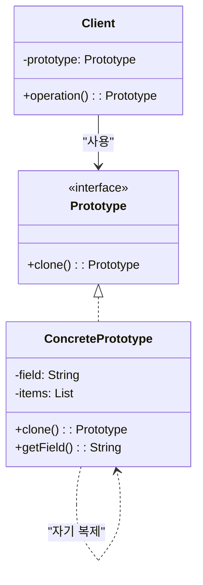
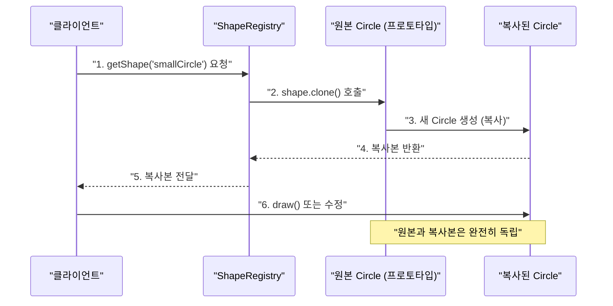

> **한 줄 요약:** 프로토타입 패턴은 생성 비용이 큰 객체를 새로 만드는 대신, 기존 객체를 `clone()`으로 복사해 재사용하는 생성 패턴이다.

## 실생활 비유

**세포 분열**을 생각해보자. 새로운 세포는 처음부터 아미노산을 조합해서 만들지 않는다. 기존 세포가 자신을 복제(clone)해서 새 세포를 만든다. 훨씬 빠르고 효율적이다.

또 다른 비유로 **복사기**가 있다. 원본 문서를 처음부터 다시 작성하는 대신, 복사기에 넣어 복사본을 만든다. 원본과 동일한 내용의 문서가 빠르게 생성된다.

프로토타입 패턴도 마찬가지다. 이미 존재하는 객체(원형, Prototype)를 복사해서 새 객체를 만든다.

---

## 패턴 개요

### 언제 사용하는가?

- 객체를 생성하는 데 **DB 조회, 네트워크 요청 등 비용이 많이 드는** 경우
- 생성된 객체와 **거의 동일한 객체**가 여러 개 필요한 경우
- 클래스 계층과 무관하게 **런타임에 동적으로 객체를 복사**해야 하는 경우
- 객체 초기화 코드를 반복하지 않고 **기존 설정을 복제**해서 쓰고 싶은 경우

### 얕은 복사 vs 깊은 복사

| 구분 | 얕은 복사 (Shallow Copy) | 깊은 복사 (Deep Copy) |
|------|------------------------|----------------------|
| 기본 타입 | 값이 복사됨 | 값이 복사됨 |
| 참조 타입 | 참조(주소)만 복사 — **원본과 같은 객체 공유** | 새 객체를 생성해 **완전히 독립** |
| Java 기본 `clone()` | 얕은 복사 수행 | 직접 구현 필요 |
| 위험 | 복사본 수정이 원본에 영향 | 없음 |

---

## UML 다이어그램



---

## Java 코드 예제

### 예제 1: 기본 Prototype (깊은 복사)

```java
import java.util.ArrayList;
import java.util.List;

// Cloneable 인터페이스를 구현해야 clone() 사용 가능
public class Employees implements Cloneable {

    private List<String> empList;

    public Employees() {
        empList = new ArrayList<>();
    }

    public Employees(List<String> empList) {
        this.empList = empList;
    }

    // DB에서 데이터를 조회한다고 가정 (비용이 큰 초기화)
    public void loadData() {
        System.out.println("DB에서 직원 목록 조회 중...");
        empList.add("김철수");
        empList.add("이영희");
        empList.add("박민준");
        empList.add("최지수");
    }

    public List<String> getEmpList() {
        return empList;
    }

    // 깊은 복사(Deep Copy): 리스트도 새로 만들어 완전히 독립된 복사본 생성
    @Override
    protected Employees clone() throws CloneNotSupportedException {
        List<String> temp = new ArrayList<>(this.empList);  // 새 리스트 생성
        return new Employees(temp);
    }
}
```

**클라이언트 코드**

```java
public class Main {
    public static void main(String[] args) throws CloneNotSupportedException {
        // 1회만 DB 조회
        Employees original = new Employees();
        original.loadData();
        // 출력: DB에서 직원 목록 조회 중...

        // clone()으로 복사 — DB 조회 없이 빠르게 생성
        Employees copy1 = original.clone();
        Employees copy2 = original.clone();

        // copy1에 직원 추가
        copy1.getEmpList().add("신입직원A");

        // copy2에서 직원 삭제
        copy2.getEmpList().remove("김철수");

        System.out.println("원본: " + original.getEmpList());
        // 출력: 원본: [김철수, 이영희, 박민준, 최지수]  ← 영향 없음

        System.out.println("copy1: " + copy1.getEmpList());
        // 출력: copy1: [김철수, 이영희, 박민준, 최지수, 신입직원A]

        System.out.println("copy2: " + copy2.getEmpList());
        // 출력: copy2: [이영희, 박민준, 최지수]
    }
}
```

### 예제 2: 추상 Prototype 인터페이스 활용

```java
// Prototype 인터페이스
public interface Shape extends Cloneable {
    Shape clone();
    void draw();
    String getType();
}
```

```java
// 구체 Prototype - 원
public class Circle implements Shape {
    private int radius;
    private String color;

    public Circle(int radius, String color) {
        this.radius = radius;
        this.color = color;
    }

    // 복사 생성자 방식 (CloneNotSupportedException 없음)
    private Circle(Circle target) {
        this.radius = target.radius;
        this.color = target.color;
    }

    @Override
    public Shape clone() {
        return new Circle(this);  // 복사 생성자 호출
    }

    @Override
    public void draw() {
        System.out.println("원 그리기 — 반지름: " + radius + ", 색상: " + color);
    }

    @Override
    public String getType() { return "Circle"; }

    public void setColor(String color) { this.color = color; }
}
```

```java
// 구체 Prototype - 사각형
public class Rectangle implements Shape {
    private int width;
    private int height;
    private String color;

    public Rectangle(int width, int height, String color) {
        this.width = width;
        this.height = height;
        this.color = color;
    }

    private Rectangle(Rectangle target) {
        this.width = target.width;
        this.height = target.height;
        this.color = target.color;
    }

    @Override
    public Shape clone() {
        return new Rectangle(this);
    }

    @Override
    public void draw() {
        System.out.println("사각형 그리기 — " + width + "x" + height + ", 색상: " + color);
    }

    @Override
    public String getType() { return "Rectangle"; }
}
```

```java
// 프로토타입 레지스트리: 자주 사용하는 프로토타입을 캐시
public class ShapeRegistry {
    private final Map<String, Shape> registry = new HashMap<>();

    public ShapeRegistry() {
        // 미리 만들어둔 프로토타입 등록
        registry.put("smallCircle", new Circle(5, "빨강"));
        registry.put("bigCircle", new Circle(50, "파랑"));
        registry.put("square", new Rectangle(100, 100, "초록"));
    }

    // 등록된 프로토타입을 복사해서 반환
    public Shape getShape(String key) {
        Shape shape = registry.get(key);
        if (shape == null) throw new IllegalArgumentException("미등록 프로토타입: " + key);
        return shape.clone();
    }
}
```

```java
// 클라이언트
public class Main {
    public static void main(String[] args) {
        ShapeRegistry registry = new ShapeRegistry();

        Shape c1 = registry.getShape("smallCircle");
        Shape c2 = registry.getShape("smallCircle");  // 복사본, 독립적

        c1.draw();  // 원 그리기 — 반지름: 5, 색상: 빨강
        c2.draw();  // 원 그리기 — 반지름: 5, 색상: 빨강

        // c1을 수정해도 c2에는 영향 없음
        ((Circle) c1).setColor("노랑");
        c1.draw();  // 원 그리기 — 반지름: 5, 색상: 노랑
        c2.draw();  // 원 그리기 — 반지름: 5, 색상: 빨강 (영향 없음)
    }
}
```

---

## 동작 흐름



---

## 실무 적용 사례

| 분야 | 프로토타입 적용 예 |
|------|----------------|
| **JDK** | `Object.clone()` — 모든 Java 객체의 기본 복제 메서드 |
| **JDK** | `ArrayList`, `HashMap` 등의 복사 생성자 |
| **Spring** | `@Scope("prototype")` — 요청마다 새 빈 인스턴스 생성 |
| **게임 개발** | 캐릭터, 몬스터 템플릿을 복사해 대량 생성 |
| **문서 편집기** | 복사/붙여넣기 기능 |

### Spring에서의 Prototype 스코프

```java
@Component
@Scope("prototype")  // 요청마다 새 인스턴스 생성 (프로토타입 개념)
public class ReportGenerator {
    private final List<String> reportData = new ArrayList<>();

    public void addData(String data) {
        reportData.add(data);
    }

    public void generate() {
        System.out.println("보고서 생성: " + reportData);
    }
}

// 매번 새 인스턴스
@Service
public class ReportService {
    @Autowired
    private ApplicationContext context;

    public void createReport() {
        // prototype 스코프이므로 매번 새 객체
        ReportGenerator generator = context.getBean(ReportGenerator.class);
        generator.addData("2024년 매출 데이터");
        generator.generate();
    }
}
```

---

## 장단점 비교

| 항목 | 내용 |
|------|------|
| **장점: 성능** | 비용이 큰 초기화(DB 조회, 파일 읽기 등)를 한 번만 수행하고 복사로 재사용한다 |
| **장점: 유연성** | 런타임에 동적으로 새 객체를 생성할 수 있다 |
| **장점: 간결성** | 복잡한 객체를 처음부터 조립하지 않아도 된다 |
| **단점: 깊은 복사 구현 복잡** | 참조 타입 필드가 중첩될수록 깊은 복사 구현이 복잡해진다 |
| **단점: 순환 참조 위험** | 객체 그래프에 순환 참조가 있으면 clone() 구현이 매우 까다롭다 |
| **단점: Cloneable 인터페이스 한계** | Java의 Cloneable은 설계가 좋지 않아 복사 생성자나 팩토리 메서드를 대신 쓰는 경우도 많다 |

---

## 핵심 포인트 정리

- 프로토타입 패턴은 **생성 비용이 큰 객체를 복사해서 재사용**하는 생성 패턴이다.
- Java에서는 `Cloneable` 인터페이스와 `clone()` 메서드를 사용하거나, **복사 생성자**를 직접 구현한다.
- **얕은 복사**는 참조 타입 필드가 공유되어 위험하므로, 대부분의 경우 **깊은 복사**를 구현해야 한다.
- **프로토타입 레지스트리**를 두어 자주 사용하는 프로토타입을 캐시해 두면 효율적이다.
- Spring의 `@Scope("prototype")`은 이름만 같을 뿐 엄밀한 의미의 프로토타입 패턴과는 다르지만, "요청마다 새 인스턴스"라는 개념에서 유사하다.
- Effective Java에서는 `Cloneable`보다 **복사 생성자나 팩토리 메서드**를 권장한다.
