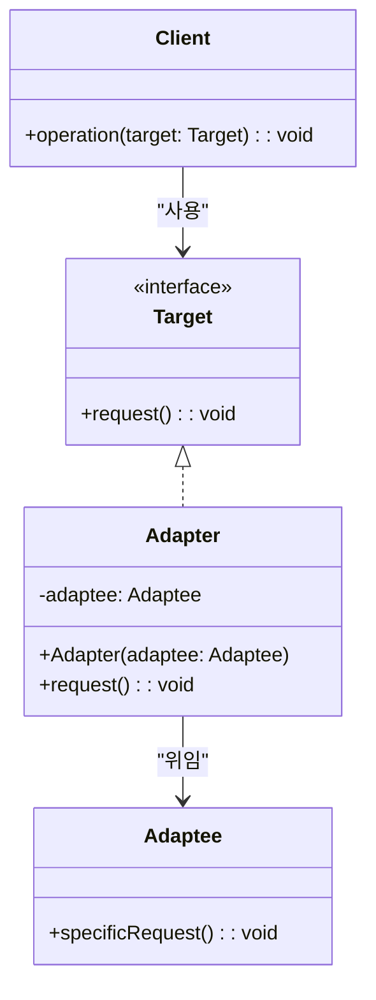
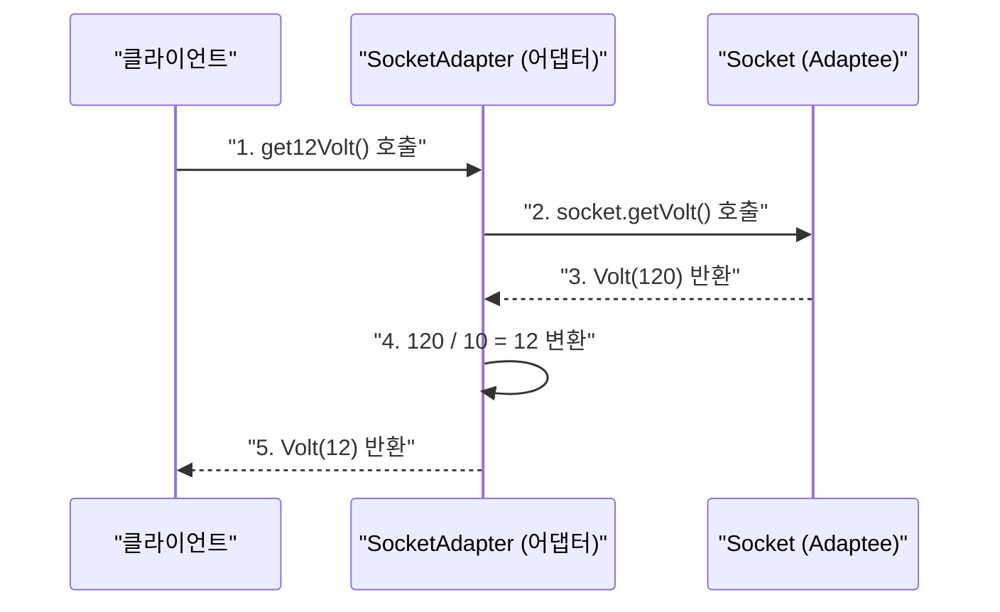

> **한 줄 요약:** 어댑터 패턴은 호환되지 않는 두 인터페이스를 연결하는 변환기 역할을 하는 구조 패턴이다.

## 실생활 비유

해외 여행 시 **전원 어댑터**를 사용하는 상황을 생각해보자. 한국 전자기기(220V 플러그)를 미국(110V 콘센트)에서 사용하려면 어댑터가 필요하다. 전자기기도, 콘센트도 바꾸지 않는다. 둘 사이에 어댑터만 끼워 넣으면 된다.

소프트웨어 어댑터 패턴도 동일하다. 기존 클래스와 새 인터페이스, 어느 쪽도 수정하지 않고 **어댑터 클래스 하나만 추가**해서 둘을 연결한다.

---

## 패턴 개요

### 언제 사용하는가?

- 기존 클래스를 사용하고 싶지만 **인터페이스가 맞지 않는** 경우
- 여러 서드파티 라이브러리를 **공통 인터페이스로 통일**하고 싶을 때
- 레거시 코드를 수정하지 않고 **새 인터페이스와 연결**하고 싶을 때
- 서로 다른 데이터 형식 간의 **변환 로직**을 캡슐화하고 싶을 때

### 두 가지 구현 방식

| 구분 | Class Adapter | Object Adapter |
|------|--------------|----------------|
| 방법 | **상속(extends)** 사용 | **합성(composition)** 사용 |
| 결합도 | 높음 (상속에 의존) | 낮음 (인터페이스에만 의존) |
| 유연성 | 낮음 | 높음 |
| 권장 여부 | Java는 단일 상속이므로 제한적 | **일반적으로 권장** |

---

## UML 다이어그램



---

## Java 코드 예제

### 예제 시나리오: 전압 변환 어댑터

220V 소켓에서 3V, 12V, 120V 전압을 제공하는 어댑터 예제다.

**Adaptee — 기존 소켓 (변경 불가)**

```java
// 기존 소켓: 120V만 제공한다
public class Volt {
    private int volts;

    public Volt(int volts) {
        this.volts = volts;
    }

    public int getVolts() {
        return volts;
    }
}

public class Socket {
    public Volt getVolt() {
        return new Volt(120);  // 120V 고정
    }
}
```

**Target 인터페이스 — 클라이언트가 원하는 인터페이스**

```java
// 클라이언트는 3V, 12V, 120V를 모두 원한다
public interface SocketAdapter {
    Volt get120Volt();
    Volt get12Volt();
    Volt get3Volt();
}
```

**Object Adapter 구현 (합성 방식 — 권장)**

```java
// Object Adapter: Socket을 필드로 갖고 위임한다
public class SocketObjectAdapter implements SocketAdapter {

    // 기존 객체를 합성으로 보유
    private final Socket socket = new Socket();

    @Override
    public Volt get120Volt() {
        return socket.getVolt();  // 120V 그대로 반환
    }

    @Override
    public Volt get12Volt() {
        Volt v = socket.getVolt();
        return convertVolt(v, 10);  // 120V → 12V
    }

    @Override
    public Volt get3Volt() {
        Volt v = socket.getVolt();
        return convertVolt(v, 40);  // 120V → 3V
    }

    private Volt convertVolt(Volt v, int divisor) {
        return new Volt(v.getVolts() / divisor);
    }
}
```

**Class Adapter 구현 (상속 방식)**

```java
// Class Adapter: Socket을 상속하고 SocketAdapter를 구현
public class SocketClassAdapter extends Socket implements SocketAdapter {

    @Override
    public Volt get120Volt() {
        return getVolt();
    }

    @Override
    public Volt get12Volt() {
        return convertVolt(getVolt(), 10);
    }

    @Override
    public Volt get3Volt() {
        return convertVolt(getVolt(), 40);
    }

    private Volt convertVolt(Volt v, int divisor) {
        return new Volt(v.getVolts() / divisor);
    }
}
```

**클라이언트 코드**

```java
public class Main {
    public static void main(String[] args) {
        // Object Adapter 사용
        SocketAdapter adapter = new SocketObjectAdapter();

        System.out.println("3V: " + getVolt(adapter, 3).getVolts() + "V");
        // 출력: 3V: 3V
        System.out.println("12V: " + getVolt(adapter, 12).getVolts() + "V");
        // 출력: 12V: 12V
        System.out.println("120V: " + getVolt(adapter, 120).getVolts() + "V");
        // 출력: 120V: 120V
    }

    private static Volt getVolt(SocketAdapter adapter, int volts) {
        switch (volts) {
            case 3:   return adapter.get3Volt();
            case 12:  return adapter.get12Volt();
            case 120: return adapter.get120Volt();
            default:  return adapter.get120Volt();
        }
    }
}
```

---

## 실무 예제: 결제 시스템 어댑터

외부 결제 라이브러리를 공통 인터페이스로 래핑하는 실무 예제다.

```java
// Target: 우리 시스템이 원하는 결제 인터페이스
public interface PaymentProcessor {
    void processPayment(String orderId, int amount);
    boolean refund(String orderId);
}

// Adaptee 1: 카카오페이 SDK (변경 불가)
public class KakaoPaySdk {
    public void kakaoPayCharge(String txId, int won) {
        System.out.println("카카오페이 결제: " + txId + ", " + won + "원");
    }
    public boolean kakaoPayCancel(String txId) {
        System.out.println("카카오페이 취소: " + txId);
        return true;
    }
}

// Adaptee 2: 네이버페이 SDK (변경 불가)
public class NaverPaySdk {
    public void charge(int amount, String orderId) {
        System.out.println("네이버페이 결제: " + orderId + ", " + amount + "원");
    }
    public void cancelPayment(String orderId) {
        System.out.println("네이버페이 취소: " + orderId);
    }
}

// Adapter 1: 카카오페이 어댑터
public class KakaoPayAdapter implements PaymentProcessor {
    private final KakaoPaySdk sdk = new KakaoPaySdk();

    @Override
    public void processPayment(String orderId, int amount) {
        sdk.kakaoPayCharge(orderId, amount);  // 메서드명, 파라미터 순서 변환
    }

    @Override
    public boolean refund(String orderId) {
        return sdk.kakaoPayCancel(orderId);
    }
}

// Adapter 2: 네이버페이 어댑터
public class NaverPayAdapter implements PaymentProcessor {
    private final NaverPaySdk sdk = new NaverPaySdk();

    @Override
    public void processPayment(String orderId, int amount) {
        sdk.charge(amount, orderId);  // 파라미터 순서가 다름 — 어댑터가 변환
    }

    @Override
    public boolean refund(String orderId) {
        sdk.cancelPayment(orderId);
        return true;
    }
}

// 클라이언트: PaymentProcessor만 알면 된다
public class OrderService {
    private final PaymentProcessor paymentProcessor;

    public OrderService(PaymentProcessor paymentProcessor) {
        this.paymentProcessor = paymentProcessor;
    }

    public void placeOrder(String orderId, int amount) {
        paymentProcessor.processPayment(orderId, amount);
    }
}
```

---

## 동작 흐름



---

## 실무 적용 사례

| 프레임워크/라이브러리 | 어댑터 적용 예 |
|-------------------|--------------|
| **JDK** | `Arrays.asList()` — 배열을 List 인터페이스로 변환 |
| **JDK** | `InputStreamReader` — InputStream을 Reader로 변환 |
| **Spring MVC** | `HandlerAdapter` — 다양한 핸들러를 공통 인터페이스로 처리 |
| **Spring** | `JpaRepository` — JPA를 Spring Data 인터페이스로 래핑 |
| **Slf4j** | 다양한 로깅 구현체(Log4j, Logback)를 단일 인터페이스로 통일 |

---

## 장단점 비교

| 항목 | 내용 |
|------|------|
| **장점: 기존 코드 보존** | Adaptee(기존 클래스)를 전혀 수정하지 않는다 |
| **장점: OCP 준수** | 새 어댑터 추가 시 기존 코드를 변경하지 않는다 |
| **장점: 재사용성** | 인터페이스가 맞지 않아 사용 못했던 클래스를 재활용할 수 있다 |
| **단점: 복잡도 증가** | 어댑터 클래스가 추가되어 코드 구조가 복잡해진다 |
| **단점: 성능** | 위임 호출이 한 단계 더 생겨 미세한 오버헤드가 있다 |

---

## 핵심 포인트 정리

- 어댑터 패턴은 **호환되지 않는 인터페이스를 연결**하는 구조 패턴이다.
- 기존 클래스(Adaptee)도, 클라이언트가 원하는 인터페이스(Target)도 **수정하지 않는다**.
- 두 방식 중 **Object Adapter(합성 방식)** 가 결합도가 낮아 일반적으로 권장된다.
- JDK의 `InputStreamReader`, Spring MVC의 `HandlerAdapter`가 대표적인 실무 예다.
- 서드파티 라이브러리를 **공통 인터페이스로 추상화**할 때 특히 유용하다.
