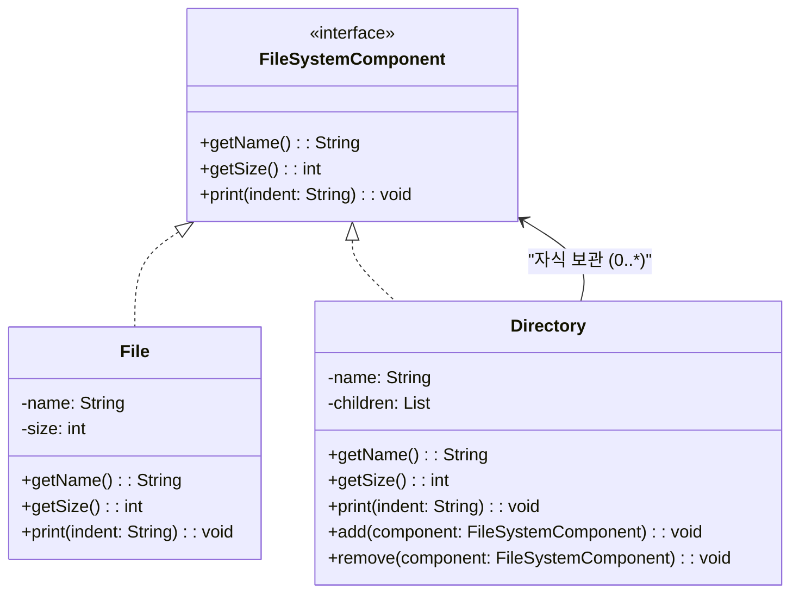
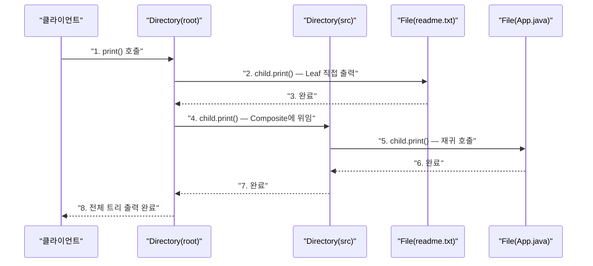

> **한 줄 요약:** 컴포지트 패턴은 객체들을 트리 구조로 구성하여 단일 객체와 복합 객체를 클라이언트가 동일한 인터페이스로 다룰 수 있게 하는 구조 패턴이다.

## 실생활 비유

**파일 시스템**을 생각해보자. 파일 시스템에는 파일과 폴더가 있다. 폴더는 파일을 담을 수도 있고, 또 다른 폴더를 담을 수도 있다. 그런데 운영체제에서 "삭제" 명령을 내릴 때, 파일에 내리든 폴더에 내리든 똑같이 `delete()`를 호출한다. 폴더라면 내부 항목을 재귀적으로 모두 삭제하고, 파일이라면 그 파일만 삭제한다.

컴포지트 패턴은 이처럼 **개별 객체(Leaf)** 와 **복합 객체(Composite)** 를 동일한 방식으로 처리할 수 있게 한다.

---

## 패턴 개요

### 구성 요소 3가지

| 구성 요소 | 역할 | 설명 |
|----------|------|------|
| **Component** | 공통 인터페이스 | Leaf와 Composite가 모두 구현하는 인터페이스/추상 클래스 |
| **Leaf** | 단말 객체 | 더 이상 자식이 없는 가장 기본 단위. 실제 동작을 수행 |
| **Composite** | 복합 객체 | Leaf 또는 다른 Composite를 자식으로 보관하며, 명령을 자식에게 위임 |

### 언제 사용하는가?

- 객체들이 **트리 구조**로 구성되는 경우 (파일 시스템, 조직도, 메뉴 등)
- 클라이언트가 **단일 객체와 복합 객체를 구분 없이** 동일하게 다루어야 할 때
- 재귀적 구조에서 **일관된 방식으로 전체 트리를 순회**해야 할 때

---

## UML 다이어그램



---

## Java 코드 예제

### 예제 시나리오: 파일 시스템

```java
// Component: 파일과 디렉터리의 공통 인터페이스
public interface FileSystemComponent {
    String getName();
    int getSize();
    void print(String indent);
}
```

**Leaf — 파일**

```java
// Leaf: 단말 노드. 자식이 없다.
public class File implements FileSystemComponent {
    private final String name;
    private final int size;

    public File(String name, int size) {
        this.name = name;
        this.size = size;
    }

    @Override
    public String getName() {
        return name;
    }

    @Override
    public int getSize() {
        return size;
    }

    @Override
    public void print(String indent) {
        System.out.println(indent + "📄 " + name + " (" + size + "KB)");
    }
}
```

**Composite — 디렉터리**

```java
import java.util.ArrayList;
import java.util.List;

// Composite: 자식(Leaf 또는 Composite)을 보관하고 명령을 위임
public class Directory implements FileSystemComponent {
    private final String name;
    private final List<FileSystemComponent> children = new ArrayList<>();

    public Directory(String name) {
        this.name = name;
    }

    public void add(FileSystemComponent component) {
        children.add(component);
    }

    public void remove(FileSystemComponent component) {
        children.remove(component);
    }

    @Override
    public String getName() {
        return name;
    }

    // 하위 모든 파일 크기의 합을 재귀적으로 계산
    @Override
    public int getSize() {
        int totalSize = 0;
        for (FileSystemComponent child : children) {
            totalSize += child.getSize();  // Leaf든 Composite든 동일하게 호출
        }
        return totalSize;
    }

    // 트리 구조를 재귀적으로 출력
    @Override
    public void print(String indent) {
        System.out.println(indent + "📁 " + name + " (" + getSize() + "KB)");
        for (FileSystemComponent child : children) {
            child.print(indent + "  ");  // 들여쓰기 추가
        }
    }
}
```

**클라이언트 코드**

```java
public class Main {
    public static void main(String[] args) {
        // 파일 생성 (Leaf)
        File file1 = new File("readme.txt", 10);
        File file2 = new File("image.png", 200);
        File file3 = new File("App.java", 15);
        File file4 = new File("Main.java", 8);
        File file5 = new File("config.yml", 3);

        // 디렉터리 구성 (Composite)
        Directory srcDir = new Directory("src");
        srcDir.add(file3);
        srcDir.add(file4);

        Directory rootDir = new Directory("project");
        rootDir.add(file1);
        rootDir.add(file2);
        rootDir.add(srcDir);   // 디렉터리 안에 디렉터리
        rootDir.add(file5);

        // 클라이언트는 Leaf(File)든 Composite(Directory)든 동일하게 print() 호출
        System.out.println("=== 전체 파일 구조 ===");
        rootDir.print("");

        System.out.println("\n전체 크기: " + rootDir.getSize() + "KB");
        System.out.println("src 디렉터리 크기: " + srcDir.getSize() + "KB");
    }
}
```

**실행 결과**

```
=== 전체 파일 구조 ===
📁 project (236KB)
  📄 readme.txt (10KB)
  📄 image.png (200KB)
  📁 src (23KB)
    📄 App.java (15KB)
    📄 Main.java (8KB)
  📄 config.yml (3KB)

전체 크기: 236KB
src 디렉터리 크기: 23KB
```

---

## 예제 2: 조직도

```java
// Component
public interface Employee {
    String getName();
    String getTitle();
    void printHierarchy(String indent);
}

// Leaf: 일반 직원
public class Developer implements Employee {
    private final String name;

    public Developer(String name) {
        this.name = name;
    }

    @Override
    public String getName() { return name; }

    @Override
    public String getTitle() { return "개발자"; }

    @Override
    public void printHierarchy(String indent) {
        System.out.println(indent + "- " + name + " [" + getTitle() + "]");
    }
}

// Composite: 팀장 (부하직원을 가짐)
public class Manager implements Employee {
    private final String name;
    private final List<Employee> reports = new ArrayList<>();

    public Manager(String name) {
        this.name = name;
    }

    public void addReport(Employee employee) {
        reports.add(employee);
    }

    @Override
    public String getName() { return name; }

    @Override
    public String getTitle() { return "매니저"; }

    @Override
    public void printHierarchy(String indent) {
        System.out.println(indent + "+ " + name + " [" + getTitle() + "]");
        for (Employee report : reports) {
            report.printHierarchy(indent + "  ");
        }
    }
}
```

---

## 동작 흐름



---

## 실무 적용 사례

| 분야 | 컴포지트 적용 예 |
|------|--------------|
| **JDK** | `java.awt.Container` — 컨테이너가 컴포넌트를 포함 |
| **JDK** | `javax.swing.JComponent` — Swing UI 트리 구조 |
| **Spring** | `CompositePropertySource` — 여러 설정 소스를 하나로 관리 |
| **HTML DOM** | 노드가 하위 노드를 포함하는 트리 구조 |
| **메뉴 시스템** | 메뉴 아이템과 서브메뉴를 동일하게 처리 |

---

## 장단점 비교

| 항목 | 내용 |
|------|------|
| **장점: 일관성** | 클라이언트가 Leaf와 Composite를 동일한 방식으로 처리해 코드가 단순해진다 |
| **장점: 재귀 처리** | 트리 전체를 순회하는 로직이 자연스럽게 재귀로 구현된다 |
| **장점: 확장성** | 새로운 Leaf나 Composite 타입을 추가해도 기존 코드가 변경되지 않는다 |
| **단점: 타입 안전성** | Leaf에는 불필요한 메서드(add/remove)가 노출될 수 있다 |
| **단점: 설계 복잡** | 컴포넌트 인터페이스를 지나치게 일반화하면 의도하지 않은 동작이 발생할 수 있다 |

---

## 핵심 포인트 정리

- 컴포지트 패턴은 **객체들의 트리 구조**에서 단일 객체와 복합 객체를 **동일한 인터페이스로 처리**한다.
- 핵심은 **재귀 구조**다. Composite는 자식에게 명령을 위임하고, Leaf는 직접 실행한다.
- 파일 시스템, 조직도, HTML DOM, UI 컴포넌트 트리처럼 **계층적 트리 구조** 문제에 적합하다.
- 클라이언트 코드는 **Leaf인지 Composite인지 알 필요 없이** 동일하게 메서드를 호출한다.
- JDK의 Swing, AWT 컴포넌트 계층이 컴포지트 패턴의 대표적 예다.
