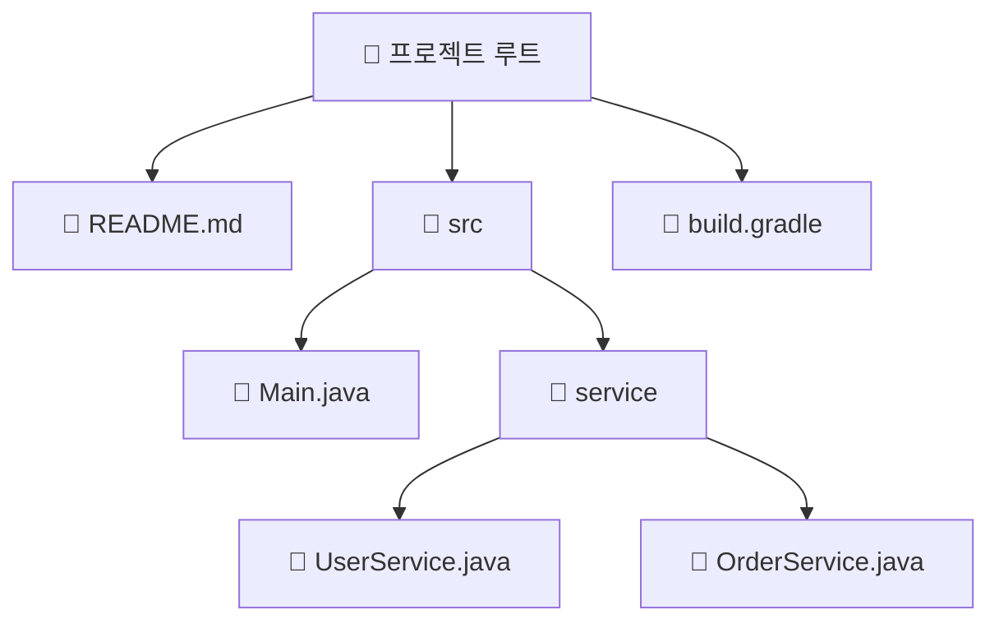
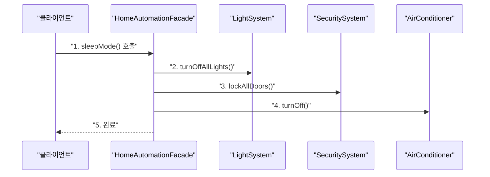
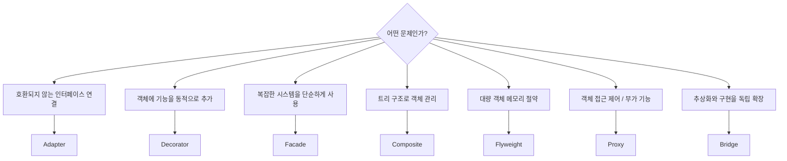

> **한 줄 요약:** 구조 패턴은 클래스나 객체를 조합해 더 큰 구조를 만드는 방법을 제공하는 패턴으로, 런타임에도 유연하게 구조를 변경할 수 있는 것이 특징이다.

## 구조 패턴이란?

구조 패턴(Structural Patterns)은 GoF 23가지 디자인 패턴 중 **두 번째 카테고리**다. 클래스나 객체들을 **상속(Inheritance)과 합성(Composition)** 으로 엮어 더 크고 유연한 구조를 만드는 방법을 제공한다.

생성 패턴이 "객체를 어떻게 만들 것인가"를 다룬다면, 구조 패턴은 **"만들어진 객체들을 어떻게 조합할 것인가"** 를 다룬다.

---

## GoF 구조 패턴 7가지

```mermaid
classDiagram
    class "구조 패턴" {
        Adapter
        Bridge
        Composite
        Decorator
        Facade
        Flyweight
        Proxy
    }
```

| 패턴 | 핵심 목적 | 핵심 키워드 |
|------|-----------|-----------|
| **Adapter** | 호환되지 않는 인터페이스 연결 | 변환기, 래퍼 |
| **Bridge** | 추상화와 구현을 독립적으로 분리 | 분리, 독립 확장 |
| **Composite** | 부분-전체 트리 구조 | 재귀, 트리, 일관성 |
| **Decorator** | 동적으로 기능 추가 | 래핑, 런타임 기능 확장 |
| **Facade** | 복잡한 서브시스템을 단순한 인터페이스로 | 단순화, 단일 창구 |
| **Flyweight** | 공유로 대량 객체 메모리 절약 | 공유, 캐싱 |
| **Proxy** | 실제 객체 앞에 대리자 배치 | 대리, 접근 제어 |

---

## 패턴별 상세 비교

### Adapter 패턴

**비유:** 220V → 110V 전원 어댑터

```mermaid
classDiagram
    class "Target 인터페이스" {
        +request()
    }
    class "Adapter" {
        -adaptee
        +request()
    }
    class "Adaptee (기존 클래스)" {
        +specificRequest()
    }

    "Target 인터페이스" <|.. "Adapter"
    "Adapter" --> "Adaptee (기존 클래스)" : "위임"
```

```java
// 기존 클래스 (변경 불가)
public class OldPaymentSystem {
    public void makePayment(double amount) {
        System.out.println("구형 결제 시스템: " + amount + "원");
    }
}

// 새 인터페이스
public interface NewPayment {
    void pay(int amount);
}

// 어댑터: 두 인터페이스를 연결
public class PaymentAdapter implements NewPayment {
    private final OldPaymentSystem oldSystem = new OldPaymentSystem();

    @Override
    public void pay(int amount) {
        oldSystem.makePayment((double) amount);  // 타입 변환 후 위임
    }
}
```

---

### Bridge 패턴

**비유:** 리모컨(추상)과 TV/라디오(구현)의 분리

```mermaid
classDiagram
    class "Remote (추상화)" {
        -device: Device
        +togglePower()
        +volumeUp()
    }
    class "BasicRemote" {
        +togglePower()
        +volumeUp()
    }
    class "Device (구현 인터페이스)" {
        +isEnabled()
        +enable()
        +getVolume()
        +setVolume()
    }
    class "TV" {
        +isEnabled()
        +enable()
    }
    class "Radio" {
        +isEnabled()
        +enable()
    }

    "Remote (추상화)" <|-- "BasicRemote"
    "Device (구현 인터페이스)" <|.. "TV"
    "Device (구현 인터페이스)" <|.. "Radio"
    "Remote (추상화)" --> "Device (구현 인터페이스)" : "브릿지"
```

Bridge 패턴은 추상화 계층(리모컨)과 구현 계층(기기 종류)을 **독립적으로 확장** 가능하게 분리한다. 리모컨 종류를 추가해도, 기기 종류를 추가해도 서로 영향을 주지 않는다.

---

### Composite 패턴

**비유:** 파일 시스템 (파일 + 폴더)



```java
// Component: Leaf와 Composite의 공통 인터페이스
public interface FileSystemItem {
    void print(String indent);
    int getSize();
}

// 클라이언트는 File이든 Directory든 동일하게 처리
FileSystemItem root = new Directory("project");
// root.print("") 하면 전체 트리가 재귀적으로 출력
```

---

### Decorator 패턴

**비유:** 커피에 샷, 휘핑크림, 시럽을 추가하는 것

```mermaid
classDiagram
    class "Coffee (컴포넌트)" {
        +getCost(): int
        +getDescription(): String
    }
    class "SimpleCoffee (Leaf)" {
        +getCost(): int
        +getDescription(): String
    }
    class "CoffeeDecorator (추상 데코레이터)" {
        -coffee: Coffee
        +getCost(): int
        +getDescription(): String
    }
    class "MilkDecorator" {
        +getCost(): int
        +getDescription(): String
    }
    class "SugarDecorator" {
        +getCost(): int
        +getDescription(): String
    }

    "Coffee (컴포넌트)" <|.. "SimpleCoffee (Leaf)"
    "Coffee (컴포넌트)" <|.. "CoffeeDecorator (추상 데코레이터)"
    "CoffeeDecorator (추상 데코레이터)" <|-- "MilkDecorator"
    "CoffeeDecorator (추상 데코레이터)" <|-- "SugarDecorator"
```

```java
public interface Coffee {
    int getCost();
    String getDescription();
}

public class SimpleCoffee implements Coffee {
    @Override public int getCost() { return 1000; }
    @Override public String getDescription() { return "기본 커피"; }
}

public class MilkDecorator implements Coffee {
    private final Coffee coffee;
    public MilkDecorator(Coffee coffee) { this.coffee = coffee; }
    @Override public int getCost() { return coffee.getCost() + 300; }
    @Override public String getDescription() { return coffee.getDescription() + " + 우유"; }
}

// 사용: 런타임에 기능을 동적으로 추가
Coffee myCoffee = new MilkDecorator(new SimpleCoffee());
// getCost() = 1300, getDescription() = "기본 커피 + 우유"
```

JDK에서 `BufferedInputStream(new FileInputStream(file))`이 대표적인 Decorator 패턴 활용 예다.

---

### Facade 패턴

**비유:** 스마트홈 앱의 "취침 모드" 버튼 한 번으로 조명 끄기, 문 잠금, 에어컨 끄기를 모두 실행



```java
// Facade: 복잡한 내부 서브시스템을 단순한 인터페이스로 감쌈
public class HomeAutomationFacade {
    private final LightSystem lights = new LightSystem();
    private final SecuritySystem security = new SecuritySystem();
    private final AirConditioner ac = new AirConditioner();

    public void sleepMode() {
        lights.turnOffAllLights();
        security.lockAllDoors();
        ac.turnOff();
        System.out.println("취침 모드 활성화 완료");
    }

    public void morningMode() {
        lights.turnOnLivingRoomLight();
        security.disarmAlarm();
        ac.setTemperature(24);
    }
}
```

Spring의 `JdbcTemplate`, `RestTemplate`이 Facade 패턴의 대표적 예다.

---

### Flyweight 패턴

**비유:** JDK의 Integer 캐시 풀 (-128~127)

```java
// 수천 개의 객체를 공유 객체 소수로 대체
public class TreeTypeFactory {
    private static final Map<String, TreeType> cache = new HashMap<>();

    public static TreeType getTreeType(String name) {
        return cache.computeIfAbsent(name, TreeType::new);
        // 동일한 이름이면 캐시에서 반환, 새 이름이면 생성 후 캐시
    }
}
// 나무 1,000그루 → TreeType 객체는 3개만 생성, 나머지는 공유
```

---

### Proxy 패턴

**비유:** 연예인 매니저 (연예인에게 직접 연락 불가, 매니저를 통해야 함)

```java
// 프록시: 실제 객체와 동일한 인터페이스를 구현
public class ServiceProxy implements Service {
    private RealService realService;

    @Override
    public String operation() {
        // 1. 접근 전 처리 (로깅, 인증, 캐싱 등)
        System.out.println("[프록시] 요청 수신");

        // 2. 실제 객체에 위임 (지연 초기화 포함)
        if (realService == null) {
            realService = new RealService();
        }
        String result = realService.operation();

        // 3. 접근 후 처리
        System.out.println("[프록시] 응답 반환");
        return result;
    }
}
```

Spring의 `@Transactional`, `@Cacheable`이 동적 프록시로 동작한다.

---

## 패턴 선택 가이드



---

## 실무에서의 구조 패턴

| 패턴 | Spring/JDK 적용 예 |
|------|-----------------|
| **Adapter** | `HandlerAdapter`, `Arrays.asList()`, `InputStreamReader` |
| **Bridge** | JDBC 드라이버 (Driver 인터페이스 + 구현체) |
| **Composite** | `CompositePropertySource`, Swing/AWT 컴포넌트 계층 |
| **Decorator** | `BufferedInputStream`, `HttpServletRequestWrapper` |
| **Facade** | `JdbcTemplate`, `RestTemplate`, `SimpMessagingTemplate` |
| **Flyweight** | `Integer.valueOf()`, `String Pool`, `Boolean.valueOf()` |
| **Proxy** | `@Transactional`, `@Cacheable`, Hibernate Lazy Loading |

---

## 핵심 포인트 정리

- 구조 패턴은 **객체들을 조합해 더 큰 구조를 만드는** 7가지 패턴의 모음이다.
- **Adapter:** 인터페이스 불일치 문제 해결, 레거시 코드 연동 시 사용
- **Composite:** 트리 구조에서 단일/복합 객체를 동일하게 처리
- **Decorator:** 상속 없이 런타임에 기능을 동적으로 추가 (`BufferedInputStream`)
- **Facade:** 복잡한 서브시스템을 단순한 인터페이스로 감싸기 (`JdbcTemplate`)
- **Flyweight:** 공유 캐시로 대량 객체의 메모리 절약 (`Integer.valueOf()`)
- **Proxy:** 접근 제어, 지연 초기화, 캐싱, 로깅 (`@Transactional`)
- Spring과 JDK 곳곳에 구조 패턴이 녹아 있으므로, 코드를 읽을 때 **어떤 패턴이 쓰였는지** 파악하면 이해가 빨라진다.
