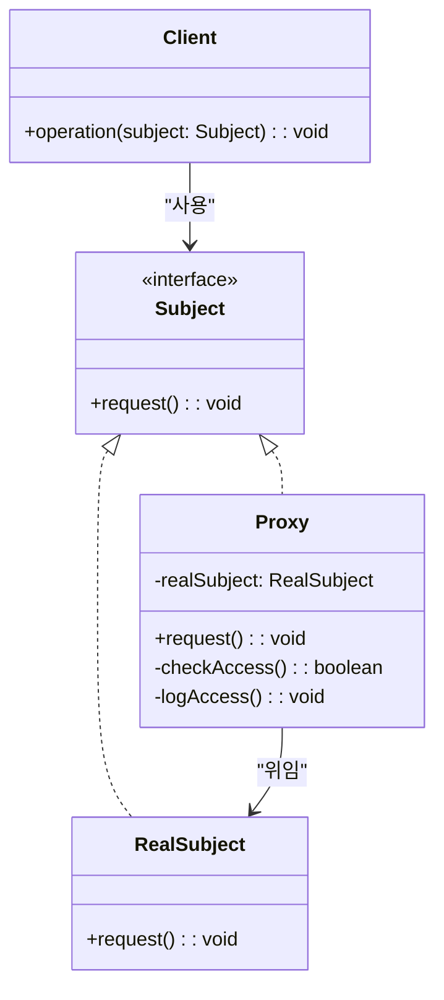
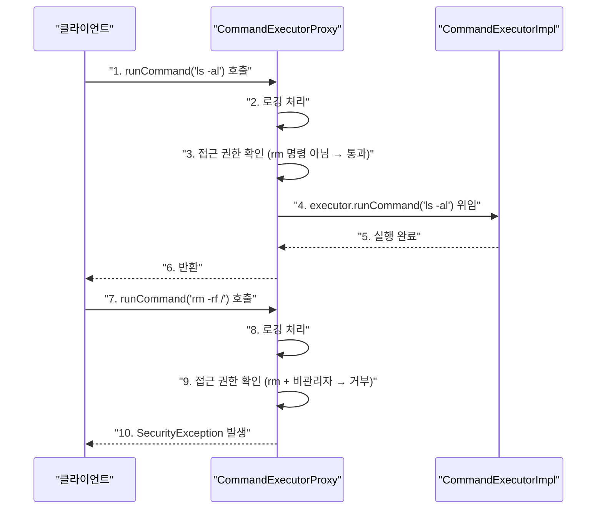

> **한 줄 요약:** 프록시 패턴은 실제 객체 앞에 대리자(Proxy)를 두어 접근을 통제하거나, 로깅·캐싱·지연 초기화 같은 부가 기능을 투명하게 추가하는 구조 패턴이다.

## 실생활 비유

**연예인 매니저**를 생각해보자. 연예인에게 직접 연락하는 것은 불가능하다. 모든 연락은 매니저를 통해 이루어진다. 매니저는 무리한 요청을 거절하고, 일정을 조율하고, 보고할 필요가 있는 요청만 연예인에게 전달한다.

소프트웨어 프록시도 동일하다. 클라이언트는 실제 객체 대신 프록시 객체와 통신한다. 프록시는 요청을 가로채어 추가 작업(로깅, 인증, 캐싱 등)을 수행하고, 필요한 경우에만 실제 객체에 위임한다.

---

## 패턴 개요

### 프록시의 주요 활용 유형

| 유형 | 설명 | 예시 |
|------|------|------|
| **보호 프록시** | 접근 권한 제어 | 관리자만 특정 기능 실행 가능 |
| **가상 프록시** | 비용이 큰 객체의 지연 초기화 | 이미지 뷰어에서 실제 이미지를 필요할 때만 로드 |
| **캐싱 프록시** | 결과를 캐싱해 성능 향상 | 같은 DB 쿼리 결과를 재사용 |
| **원격 프록시** | 원격 객체에 대한 로컬 대리자 | RPC, RMI에서 원격 서버 객체 대리 |
| **로깅 프록시** | 요청/응답 로깅 | 메서드 호출 이력 기록 |

---

## UML 다이어그램



---

## Java 코드 예제

### 예제 1: 보호 프록시 (접근 제어)

```java
// Subject 인터페이스
public interface CommandExecutor {
    void runCommand(String cmd) throws Exception;
}

// RealSubject: 실제 명령 실행
public class CommandExecutorImpl implements CommandExecutor {

    @Override
    public void runCommand(String cmd) throws Exception {
        Runtime.getRuntime().exec(cmd);
        System.out.println("명령 실행 완료: " + cmd);
    }
}

// Proxy: 접근 제어 + 로깅
public class CommandExecutorProxy implements CommandExecutor {

    private final boolean isAdmin;
    private final CommandExecutor executor;

    public CommandExecutorProxy(String user, String password) {
        // 관리자 인증
        this.isAdmin = "admin".equals(user) && "secret".equals(password);
        this.executor = new CommandExecutorImpl();
    }

    @Override
    public void runCommand(String cmd) throws Exception {
        // 로깅 (부가 기능)
        System.out.println("[로그] 명령 요청: " + cmd + ", 관리자=" + isAdmin);

        // 접근 제어
        if (cmd.trim().startsWith("rm")) {
            if (!isAdmin) {
                throw new SecurityException("rm 명령은 관리자만 실행할 수 있습니다.");
            }
        }

        // 실제 객체에 위임
        executor.runCommand(cmd);
    }
}

// 클라이언트
public class Main {
    public static void main(String[] args) {
        // 일반 사용자
        CommandExecutor userExecutor = new CommandExecutorProxy("user", "1234");
        try {
            userExecutor.runCommand("ls -al");         // 성공
            userExecutor.runCommand("rm -rf /tmp/a");  // SecurityException 발생
        } catch (Exception e) {
            System.out.println("오류: " + e.getMessage());
        }

        System.out.println("---");

        // 관리자
        CommandExecutor adminExecutor = new CommandExecutorProxy("admin", "secret");
        try {
            adminExecutor.runCommand("rm -rf /tmp/a"); // 성공
        } catch (Exception e) {
            System.out.println("오류: " + e.getMessage());
        }
    }
}
```

---

### 예제 2: 캐싱 프록시

```java
// Subject
public interface DataService {
    String getData(String key);
}

// RealSubject: 실제 DB 조회 (비용이 큼)
public class DatabaseService implements DataService {

    @Override
    public String getData(String key) {
        System.out.println("[DB] 데이터베이스에서 조회 중: " + key);
        try {
            Thread.sleep(100);  // DB 조회 지연 시뮬레이션
        } catch (InterruptedException e) {
            Thread.currentThread().interrupt();
        }
        return "데이터_" + key;
    }
}

// Proxy: 캐싱
public class CachingDataServiceProxy implements DataService {
    private final DataService realService = new DatabaseService();
    private final Map<String, String> cache = new HashMap<>();

    @Override
    public String getData(String key) {
        // 캐시에 있으면 DB 조회 없이 즉시 반환
        if (cache.containsKey(key)) {
            System.out.println("[캐시] 캐시에서 반환: " + key);
            return cache.get(key);
        }

        // 캐시 미스: 실제 DB 조회 후 캐시에 저장
        String data = realService.getData(key);
        cache.put(key, data);
        return data;
    }
}

// 클라이언트
public class Main {
    public static void main(String[] args) {
        DataService service = new CachingDataServiceProxy();

        service.getData("USER_001");  // [DB] 데이터베이스에서 조회 중: USER_001
        service.getData("USER_001");  // [캐시] 캐시에서 반환: USER_001  (빠름)
        service.getData("USER_002");  // [DB] 데이터베이스에서 조회 중: USER_002
        service.getData("USER_002");  // [캐시] 캐시에서 반환: USER_002  (빠름)
    }
}
```

---

### 예제 3: 가상 프록시 (지연 초기화)

```java
// 무거운 이미지 객체를 필요한 시점에만 로드
public interface Image {
    void display();
}

public class HighResolutionImage implements Image {
    private final String filename;

    public HighResolutionImage(String filename) {
        this.filename = filename;
        loadFromDisk();  // 생성 시 즉시 디스크에서 로드 (비용이 큼)
    }

    private void loadFromDisk() {
        System.out.println("[디스크] 이미지 로드 중: " + filename);
    }

    @Override
    public void display() {
        System.out.println("이미지 표시: " + filename);
    }
}

// 가상 프록시: 실제로 display()가 호출될 때까지 이미지 로드를 미룬다
public class ImageProxy implements Image {
    private final String filename;
    private HighResolutionImage realImage;  // 처음에는 null

    public ImageProxy(String filename) {
        this.filename = filename;
        // 이 시점에서 실제 이미지는 로드하지 않는다
        System.out.println("[프록시] 이미지 프록시 생성: " + filename);
    }

    @Override
    public void display() {
        // 실제로 필요한 시점에 최초 1회만 로드
        if (realImage == null) {
            realImage = new HighResolutionImage(filename);
        }
        realImage.display();
    }
}

// 클라이언트
public class Main {
    public static void main(String[] args) {
        Image image = new ImageProxy("large_photo.jpg");
        // [프록시] 이미지 프록시 생성: large_photo.jpg
        // → 이 시점엔 이미지가 로드되지 않는다

        System.out.println("다른 작업 수행 중...");

        image.display();
        // [디스크] 이미지 로드 중: large_photo.jpg  ← 최초 1회만
        // 이미지 표시: large_photo.jpg

        image.display();
        // 이미지 표시: large_photo.jpg  ← 이미 로드됨, 빠르게 표시
    }
}
```

---

## 동작 흐름



---

## Spring AOP와 프록시

Spring의 `@Transactional`, `@Cacheable`, `@Async` 등은 내부적으로 프록시 패턴으로 동작한다.

```java
@Service
public class UserService {

    // Spring이 내부적으로 프록시를 생성해 트랜잭션 처리
    @Transactional
    public void createUser(String name) {
        // 프록시가 트랜잭션 시작
        userRepository.save(new User(name));
        // 프록시가 트랜잭션 커밋/롤백
    }

    // 캐싱 프록시
    @Cacheable("users")
    public User findUser(Long id) {
        return userRepository.findById(id).orElseThrow();
    }
}
```

---

## 실무 적용 사례

| 분야 | 프록시 적용 예 |
|------|-------------|
| **Spring AOP** | `@Transactional`, `@Cacheable`, `@Async` |
| **Spring Security** | 메서드 수준 보안 (`@PreAuthorize`) |
| **JDK** | `java.lang.reflect.Proxy` — JDK 동적 프록시 |
| **Hibernate** | 지연 로딩(Lazy Loading) — 연관 엔티티 가상 프록시 |
| **MyBatis** | Mapper 인터페이스를 동적 프록시로 구현 |

---

## 장단점 비교

| 항목 | 내용 |
|------|------|
| **장점: 접근 제어** | 실제 객체에 대한 접근을 통제하고 보안을 강화할 수 있다 |
| **장점: 성능 최적화** | 지연 초기화, 캐싱으로 성능을 향상시킬 수 있다 |
| **장점: 부가 기능 분리** | 로깅, 인증 등 횡단 관심사를 비즈니스 로직과 분리한다 |
| **단점: 응답 지연** | 프록시를 통한 간접 호출로 미세한 지연이 발생할 수 있다 |
| **단점: 복잡도 증가** | 클래스가 늘어나고 코드 흐름이 복잡해진다 |

---

## 핵심 포인트 정리

- 프록시 패턴은 **실제 객체 앞에 대리자를 두어** 접근 제어, 로깅, 캐싱 등의 부가 기능을 추가한다.
- 클라이언트는 **프록시와 실제 객체를 동일한 인터페이스로** 사용하므로 내부 구조를 알 필요가 없다.
- **보호 프록시(접근 제어)**, **가상 프록시(지연 초기화)**, **캐싱 프록시(성능 최적화)** 가 가장 많이 쓰인다.
- Spring의 `@Transactional`, Hibernate의 Lazy Loading이 프록시 패턴의 대표적인 실무 예다.
- JDK의 `java.lang.reflect.Proxy`나 CGLIB를 사용하면 **런타임에 동적으로 프록시**를 생성할 수 있다.
