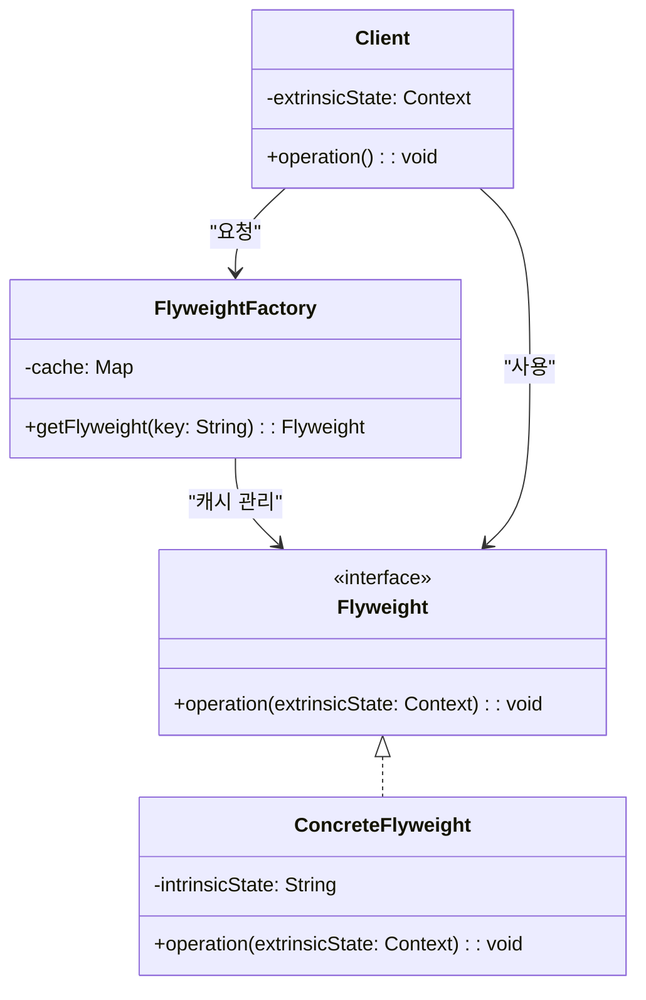
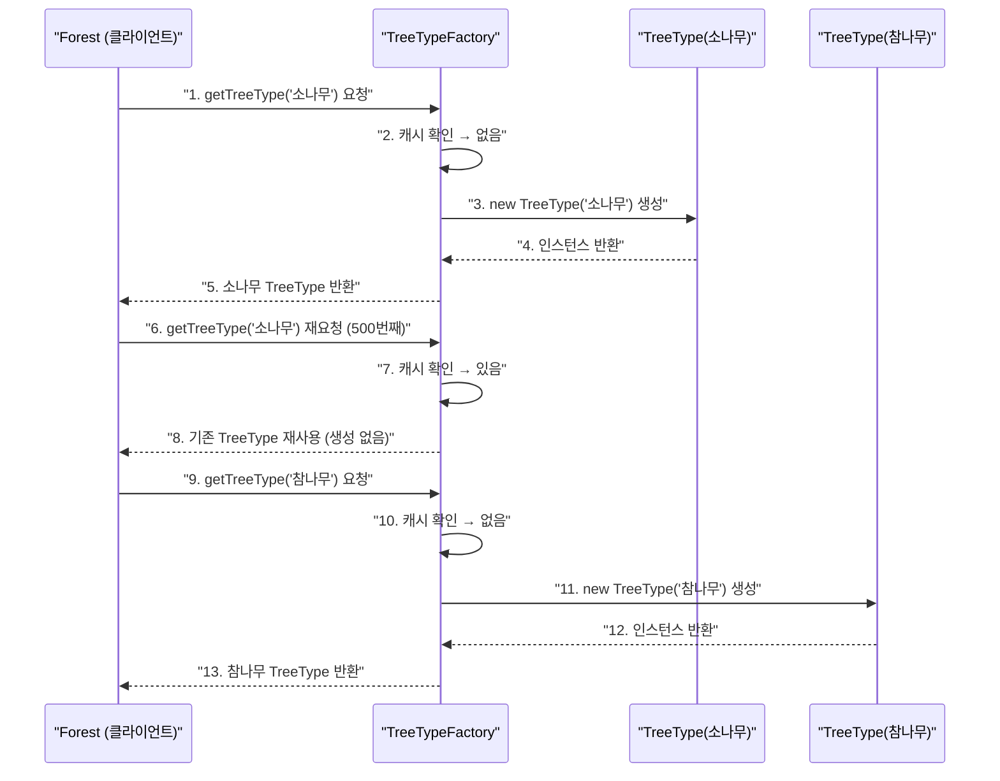

> **한 줄 요약:** 플라이웨이트 패턴은 공유(Sharing)를 통해 대량의 유사 객체를 효율적으로 관리해 메모리 사용을 크게 줄이는 구조 패턴이다.

## 실생활 비유

**폰트 시스템**을 생각해보자. 워드 프로세서에서 10만 글자가 적힌 문서를 열었다고 하자. 각 글자마다 폰트 정보(글꼴, 크기, 굵기) 객체를 따로 만든다면 10만 개의 객체가 생긴다. 그런데 사실 대부분의 글자는 같은 "맑은고딕 12pt 보통" 폰트를 사용한다.

플라이웨이트 패턴은 이 폰트 객체를 **단 하나만 만들어 공유**한다. 10만 글자가 하나의 폰트 객체를 참조하므로 메모리가 획기적으로 줄어든다.

---

## 패턴 개요

### 내적 상태 vs 외적 상태

플라이웨이트 패턴의 핵심은 객체의 속성을 두 가지로 분리하는 것이다.

| 구분 | 내적 상태 (Intrinsic State) | 외적 상태 (Extrinsic State) |
|------|---------------------------|---------------------------|
| 의미 | 객체를 고유하게 만드는 속성 | 문맥(Context)에 따라 달라지는 속성 |
| 저장 위치 | Flyweight 객체 내부 (공유) | 클라이언트가 전달 |
| 변경 여부 | 변경 불가 (불변) | 매 호출마다 달라짐 |
| 예시 (글자) | 폰트 종류, 크기, 색상 | 화면상의 x, y 좌표 |
| 예시 (나무) | 나무 종류, 텍스처 이미지 | 심은 위치(x, y) |

### 언제 사용하는가?

- 애플리케이션에서 생성하는 객체 수가 **매우 많아** 메모리 문제가 발생할 때
- 대부분의 객체 상태가 **외적 상태로 분리**될 수 있을 때
- 객체 제거 후에도 **많은 공유 객체로** 분류될 수 있을 때

---

## UML 다이어그램



---

## Java 코드 예제

### 예제 1: 나무 렌더링 (게임 맵)

숲에 수천 그루의 나무를 렌더링할 때 나무 종류(내적 상태)를 공유하는 예제다.

```java
// Flyweight: 공유할 내적 상태 (나무 종류, 텍스처)
public class TreeType {
    private final String name;        // 나무 이름 (소나무, 참나무 등)
    private final String color;       // 색상
    private final String texture;     // 텍스처 이미지 경로

    public TreeType(String name, String color, String texture) {
        this.name = name;
        this.color = color;
        this.texture = texture;
        System.out.println("[생성] TreeType 객체 생성: " + name);
    }

    // 외적 상태(위치)는 파라미터로 전달
    public void draw(int x, int y) {
        System.out.println(name + " (" + color + ") 을 (" + x + ", " + y + ")에 렌더링");
    }
}
```

```java
// Flyweight Factory: 캐시를 통해 공유 객체 관리
public class TreeTypeFactory {
    private static final Map<String, TreeType> cache = new HashMap<>();

    public static TreeType getTreeType(String name, String color, String texture) {
        String key = name + "_" + color;

        // 캐시에 없으면 새로 생성해서 저장, 있으면 기존 것 반환
        if (!cache.containsKey(key)) {
            cache.put(key, new TreeType(name, color, texture));
        } else {
            System.out.println("[캐시] 재사용: " + name);
        }
        return cache.get(key);
    }

    public static int getCacheSize() {
        return cache.size();
    }
}
```

```java
// Context: 외적 상태(위치)를 보유하는 개별 나무 객체
public class Tree {
    private final int x;
    private final int y;
    private final TreeType type;  // 공유 객체 참조

    public Tree(int x, int y, TreeType type) {
        this.x = x;
        this.y = y;
        this.type = type;
    }

    public void draw() {
        type.draw(x, y);  // 외적 상태를 전달
    }
}
```

```java
// 클라이언트: 수천 그루의 나무 생성
public class Forest {
    private final List<Tree> trees = new ArrayList<>();

    public void plantTree(int x, int y, String name, String color, String texture) {
        // TreeType은 공유되므로 실제 생성은 최초 1회만
        TreeType type = TreeTypeFactory.getTreeType(name, color, texture);
        trees.add(new Tree(x, y, type));
    }

    public void draw() {
        for (Tree tree : trees) {
            tree.draw();
        }
    }
}

public class Main {
    public static void main(String[] args) {
        Forest forest = new Forest();

        // 1000그루의 나무를 심어도 TreeType 객체는 3개만 생성됨
        for (int i = 0; i < 500; i++) {
            forest.plantTree(i * 2, i * 3, "소나무", "초록", "pine.png");
        }
        for (int i = 0; i < 300; i++) {
            forest.plantTree(i * 4, i * 5, "참나무", "갈색", "oak.png");
        }
        for (int i = 0; i < 200; i++) {
            forest.plantTree(i * 6, i * 7, "벚나무", "분홍", "cherry.png");
        }

        System.out.println("\nTreeType 캐시 크기: " + TreeTypeFactory.getCacheSize());
        // 출력: TreeType 캐시 크기: 3  (1000개가 아니라 3개!)

        System.out.println("Tree 객체 수: 1000");
        System.out.println("TreeType 공유 객체 수: " + TreeTypeFactory.getCacheSize());
    }
}
```

---

### 예제 2: 문자 렌더링

```java
// Flyweight: 글자 모양 정보 (내적 상태)
public class CharacterGlyph {
    private final char character;
    private final String fontFamily;
    private final int fontSize;

    public CharacterGlyph(char character, String fontFamily, int fontSize) {
        this.character = character;
        this.fontFamily = fontFamily;
        this.fontSize = fontSize;
    }

    // 외적 상태(위치, 색상)는 파라미터로 전달
    public void render(int x, int y, String color) {
        System.out.printf("글자 '%c' [%s %dpt] 를 (%d,%d) 위치에 %s 색으로 렌더링%n",
                character, fontFamily, fontSize, x, y, color);
    }
}

// Factory
public class GlyphFactory {
    private static final Map<String, CharacterGlyph> cache = new HashMap<>();

    public static CharacterGlyph getGlyph(char ch, String font, int size) {
        String key = ch + "_" + font + "_" + size;
        return cache.computeIfAbsent(key,
                k -> new CharacterGlyph(ch, font, size));
    }
}
```

---

## 동작 흐름



---

## 실무 적용 사례

| 분야 | 플라이웨이트 적용 예 |
|------|------------------|
| **JDK** | `Integer.valueOf(-128 ~ 127)` — 정수 캐시 풀 |
| **JDK** | `String.intern()` — String Pool |
| **JDK** | `Boolean.valueOf()`, `Byte.valueOf()` 등 래퍼 클래스 |
| **게임 엔진** | 수천 개의 나무, 적군, 파티클 객체 관리 |
| **브라우저** | 동일한 폰트, 색상 정보를 공유해 DOM 렌더링 최적화 |

### JDK Integer 캐싱 예

```java
// Integer.valueOf()는 -128 ~ 127 범위를 캐시한다 (플라이웨이트)
Integer a = Integer.valueOf(100);
Integer b = Integer.valueOf(100);
System.out.println(a == b);   // true  (동일 객체 공유)

Integer c = Integer.valueOf(200);
Integer d = Integer.valueOf(200);
System.out.println(c == d);   // false (범위 초과, 새 객체 생성)

// 래퍼 타입은 항상 equals()로 비교해야 하는 이유
System.out.println(c.equals(d)); // true
```

---

## 메모리 절약 효과 비교

```
[플라이웨이트 미적용]
나무 1,000그루 × TreeType 객체(텍스처 1MB) = 1,000MB

[플라이웨이트 적용]
TreeType 객체 3개 × 1MB = 3MB
Tree 객체 1,000개 × 위치 정보(int x, y) ≈ 수십 KB
총계 ≈ 3MB  (약 333배 절약)
```

---

## 장단점 비교

| 항목 | 내용 |
|------|------|
| **장점: 메모리 절약** | 수많은 객체를 공유 객체로 대체해 메모리 사용량을 크게 줄인다 |
| **장점: 성능 향상** | 객체 생성 횟수가 줄어 GC 부하가 감소한다 |
| **단점: 코드 복잡도** | 내적/외적 상태를 분리해야 하므로 설계가 복잡해진다 |
| **단점: 공유 상태 위험** | 플라이웨이트 객체가 변경되면 공유하는 모든 곳에 영향을 미친다. 반드시 불변이어야 한다 |
| **단점: CPU 트레이드오프** | 외적 상태를 매번 전달해야 하므로 메모리 절약 대신 CPU 비용이 증가할 수 있다 |

---

## 핵심 포인트 정리

- 플라이웨이트 패턴은 **공유(Sharing)를 통해 대량의 객체를 효율적으로 관리**하는 구조 패턴이다.
- 핵심은 객체 상태를 **내적 상태(공유, 불변)**와 **외적 상태(문맥마다 다름, 클라이언트 전달)**로 분리하는 것이다.
- JDK의 `Integer.valueOf()`, `String Pool`이 플라이웨이트 패턴의 대표적 내장 예다.
- 게임 개발에서 수천 개의 파티클, 나무, 적군 객체를 효율적으로 관리할 때 자주 활용된다.
- 공유 객체(플라이웨이트)는 반드시 **불변(Immutable)** 이어야 한다. 변경 가능하면 공유 중인 모든 객체에 영향을 준다.
