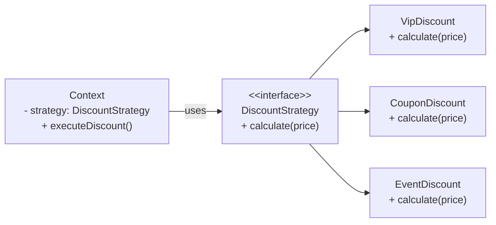
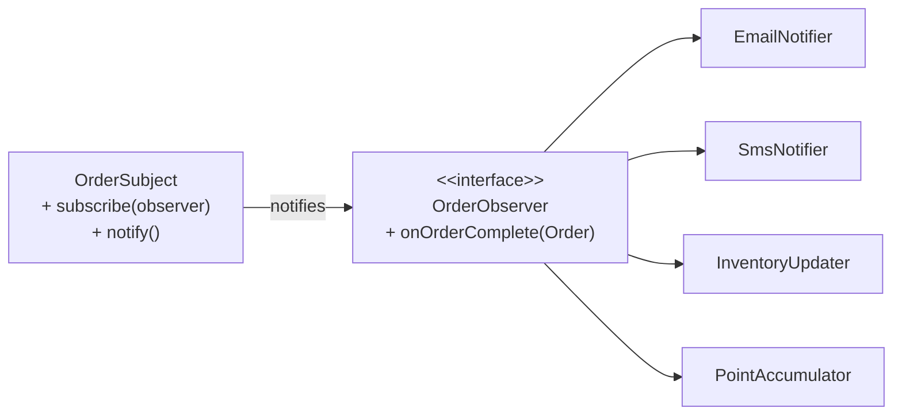
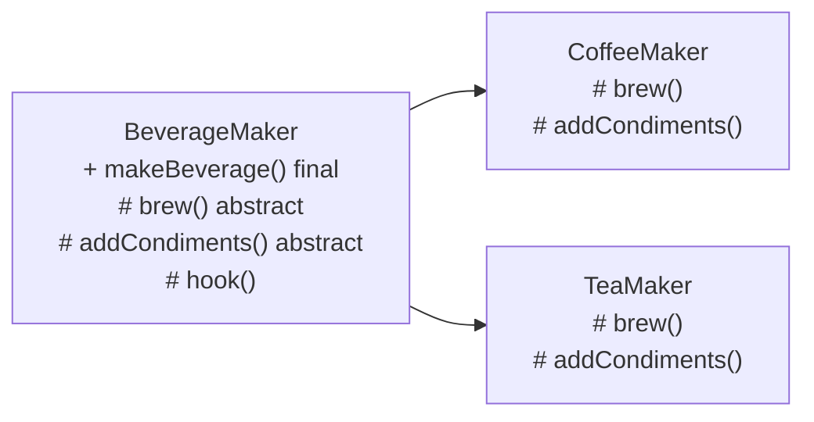
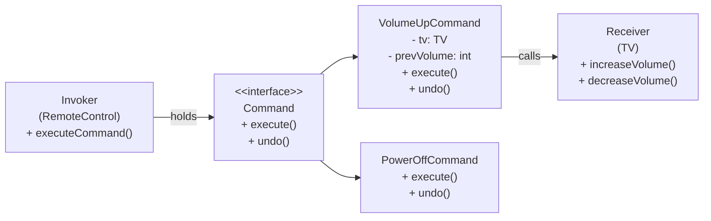
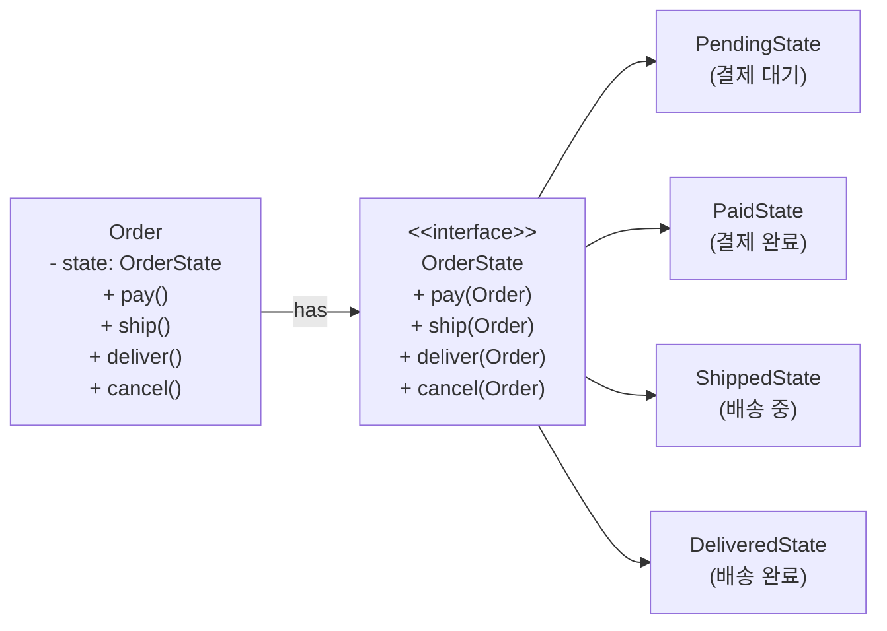
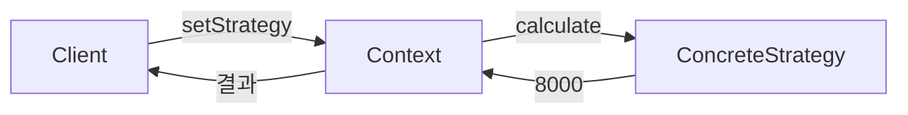
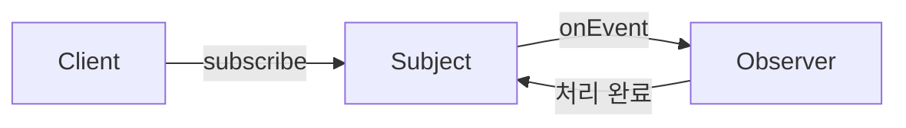
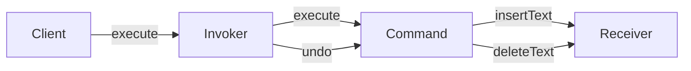

행동 패턴(Behavioral Pattern)은 객체 간의 **책임 분배와 알고리즘 교환**을 다루는 디자인 패턴 군입니다. 생성·구조 패턴이 "어떻게 만들고 조합하는가"를 다룬다면, 행동 패턴은 "어떻게 협력하고 소통하는가"에 집중합니다. 이번 포스트에서는 실무와 면접에서 가장 자주 등장하는 5가지 행동 패턴을 깊이 있게 파헤칩니다.

---

## 1. Strategy 패턴

### 왜 필요한가

택배 회사를 떠올려 보세요. 고객이 "빠른 배송", "일반 배송", "새벽 배송" 중 하나를 선택하면, 회사는 그에 맞는 **배송 방법**만 바꿔 실행합니다. 핵심 주문 처리 로직은 동일하지만, 알고리즘만 교체됩니다.

코드에서도 똑같은 문제가 생깁니다. 할인 정책을 조건문으로 처리하면 아래와 같은 코드가 됩니다.

```java
// Bad: 조건문이 쌓이는 구조
public double calculateDiscount(String type, double price) {
    if (type.equals("VIP")) {
        return price * 0.8;
    } else if (type.equals("COUPON")) {
        return price * 0.9;
    } else if (type.equals("EVENT")) {
        return price * 0.7;
    }
    return price;
}
```

새로운 할인 정책이 추가될 때마다 이 메서드를 수정해야 합니다. OCP(개방-폐쇄 원칙)를 정면으로 위반합니다.

### 구조



### Java 코드 — Spring 실전 예시

**전략 인터페이스 정의**

```java
public interface DiscountStrategy {
    double calculate(double price);
    String getStrategyName();
}
```

**각 전략 구현 — Spring Bean으로 등록**

```java
@Component("vipDiscount")
public class VipDiscount implements DiscountStrategy {

    @Override
    public double calculate(double price) {
        return price * 0.8; // 20% 할인
    }

    @Override
    public String getStrategyName() {
        return "VIP";
    }
}

@Component("couponDiscount")
public class CouponDiscount implements DiscountStrategy {

    @Override
    public double calculate(double price) {
        return price * 0.9; // 10% 할인
    }

    @Override
    public String getStrategyName() {
        return "COUPON";
    }
}

@Component("eventDiscount")
public class EventDiscount implements DiscountStrategy {

    @Override
    public double calculate(double price) {
        return price * 0.7; // 30% 할인
    }

    @Override
    public String getStrategyName() {
        return "EVENT";
    }
}
```

**Context — 전략을 주입받아 실행**

```java
@Service
public class OrderService {

    // Spring이 DiscountStrategy 타입의 Bean을 모두 주입
    private final Map<String, DiscountStrategy> strategyMap;

    public OrderService(List<DiscountStrategy> strategies) {
        this.strategyMap = strategies.stream()
            .collect(Collectors.toMap(
                DiscountStrategy::getStrategyName,
                Function.identity()
            ));
    }

    public double applyDiscount(String discountType, double price) {
        DiscountStrategy strategy = strategyMap.getOrDefault(
            discountType,
            price -> price  // 기본: 할인 없음 (람다로 처리)
        );
        return strategy.calculate(price);
    }
}
```

**새 할인 정책 추가는 Bean 하나 추가로 끝**

```java
@Component("seasonDiscount")
public class SeasonDiscount implements DiscountStrategy {
    @Override
    public double calculate(double price) {
        return price * 0.85;
    }

    @Override
    public String getStrategyName() {
        return "SEASON";
    }
}
// OrderService 코드 수정 없음. Bean이 자동 등록됨.
```

### 언제 쓰고 언제 쓰면 안 되는가

**쓸 때:** 알고리즘이 런타임에 교체되어야 할 때 / 동일한 문제를 해결하는 방법이 여러 개일 때 / 조건문이 3개 이상 쌓이기 시작할 때

**쓰면 안 될 때:** 전략이 단 하나뿐이고 앞으로도 늘어날 가능성이 없을 때 / 전략들 사이에 공유 상태가 많아 오히려 결합도가 높아질 때

---

## 2. Observer 패턴

### 왜 필요한가

유튜브 구독 버튼을 생각해 보세요. 채널이 영상을 올리면(이벤트 발생), 구독자 전원에게 알림이 갑니다. 채널은 구독자가 몇 명인지, 누구인지 몰라도 됩니다. 그냥 "영상 올렸음"을 선언하면 끝입니다.

이것이 Observer 패턴의 핵심입니다. **발행자(Subject)와 구독자(Observer) 사이의 느슨한 결합**.

주문 처리 시스템에서 주문이 완료되면 이메일 알림, SMS 알림, 재고 차감, 포인트 적립이 모두 일어나야 한다고 가정합니다. 이것들을 하나의 메서드에 직접 호출하면 주문 서비스가 이메일/SMS/재고/포인트 모든 것에 의존하게 됩니다.

### 구조



### Java 코드 — Spring Event 활용 실전 예시

Spring은 Observer 패턴을 내장하고 있습니다. `ApplicationEventPublisher`와 `@EventListener`가 그것입니다.

**이벤트 클래스 정의**

```java
// 이벤트는 불변 데이터 객체로 설계
public class OrderCompletedEvent {
    private final Long orderId;
    private final String customerId;
    private final double totalAmount;
    private final LocalDateTime completedAt;

    public OrderCompletedEvent(Long orderId, String customerId,
                               double totalAmount) {
        this.orderId = orderId;
        this.customerId = customerId;
        this.totalAmount = totalAmount;
        this.completedAt = LocalDateTime.now();
    }

    // getters
    public Long getOrderId() { return orderId; }
    public String getCustomerId() { return customerId; }
    public double getTotalAmount() { return totalAmount; }
    public LocalDateTime getCompletedAt() { return completedAt; }
}
```

**발행자(Subject) — 주문 서비스**

```java
@Service
@RequiredArgsConstructor
public class OrderService {

    private final OrderRepository orderRepository;
    private final ApplicationEventPublisher eventPublisher;

    @Transactional
    public Order completeOrder(Long orderId) {
        Order order = orderRepository.findById(orderId)
            .orElseThrow(() -> new OrderNotFoundException(orderId));

        order.complete();
        orderRepository.save(order);

        // 이벤트 발행 — 누가 처리하는지 알 필요 없음
        eventPublisher.publishEvent(
            new OrderCompletedEvent(
                order.getId(),
                order.getCustomerId(),
                order.getTotalAmount()
            )
        );

        return order;
    }
}
```

**구독자들(Observer) — 각자 독립적으로 처리**

```java
@Component
@RequiredArgsConstructor
public class EmailNotificationListener {

    private final EmailService emailService;

    @EventListener
    @Async  // 비동기 처리 — 이메일 발송이 주문 처리를 블로킹하지 않음
    public void handleOrderCompleted(OrderCompletedEvent event) {
        emailService.sendOrderConfirmation(
            event.getCustomerId(),
            event.getOrderId()
        );
    }
}

@Component
@RequiredArgsConstructor
public class InventoryListener {

    private final InventoryService inventoryService;

    @EventListener
    @Transactional(propagation = Propagation.REQUIRES_NEW)
    public void handleOrderCompleted(OrderCompletedEvent event) {
        // 주문 완료 트랜잭션과 별도 트랜잭션으로 처리
        inventoryService.decreaseStock(event.getOrderId());
    }
}

@Component
@RequiredArgsConstructor
public class PointAccumulationListener {

    private final PointService pointService;

    @EventListener
    public void handleOrderCompleted(OrderCompletedEvent event) {
        long points = (long) (event.getTotalAmount() / 100);
        pointService.addPoints(event.getCustomerId(), points);
    }
}
```

**트랜잭션 커밋 후 이벤트 발행이 필요한 경우**

```java
// @TransactionalEventListener: 트랜잭션이 커밋된 후 이벤트 처리
@TransactionalEventListener(phase = TransactionPhase.AFTER_COMMIT)
@Async
public void handleOrderCompleted(OrderCompletedEvent event) {
    // DB에 주문이 확정된 뒤 외부 시스템(이메일, SMS) 호출
    smsService.send(event.getCustomerId(), "주문 완료");
}
```

### 언제 쓰고 언제 쓰면 안 되는가

**쓸 때:** 한 객체의 상태 변화가 여러 객체에 영향을 줄 때 / 발행자와 구독자가 서로 독립적으로 확장되어야 할 때 / 이벤트 기반 아키텍처를 구성할 때

**쓰면 안 될 때:** 이벤트 순서가 보장되어야 하는데 비동기 처리를 남용할 때 / 구독자가 단 하나 고정되어 있을 때 / 이벤트 체인이 깊어져 "이 이벤트가 왜 발생했지?" 추적이 어려워질 때

---

## 3. Template Method 패턴

### 왜 필요한가

커피와 차를 만드는 과정을 비교합니다.

- 물 끓이기 → **음료 우리기(커피: 에스프레소, 차: 찻잎)** → 컵에 따르기 → **첨가물 넣기(커피: 설탕+크림, 차: 레몬)**

전체 흐름(알고리즘의 골격)은 동일하고, 특정 단계만 다릅니다. 이 공통 흐름을 부모 클래스에 두고, 가변 단계만 자식 클래스에서 구현하는 것이 Template Method 패턴입니다.

**할리우드 원칙(Hollywood Principle)** 이라고도 불립니다: "Don't call us, we'll call you." 자식 클래스가 부모를 호출하는 게 아니라, 부모의 템플릿 메서드가 자식의 훅을 호출합니다.

### 구조



### Java 코드 — Spring Batch ItemProcessor 실전 예시

```java
// 추상 클래스 — 알고리즘의 골격 정의
public abstract class DataExportTemplate<T, R> {

    // 템플릿 메서드 — final로 선언해 오버라이드 금지
    public final ExportResult export(List<T> data) {
        List<T> validData = validate(data);         // 1. 검증
        List<R> transformedData = transform(validData); // 2. 변환 (훅)
        beforeWrite(transformedData);               // 3. 쓰기 전 훅
        int count = write(transformedData);         // 4. 쓰기 (훅)
        afterWrite(count);                          // 5. 쓰기 후 훅
        return new ExportResult(count, LocalDateTime.now());
    }

    // 공통 구현 — 모든 하위 클래스가 동일하게 사용
    private List<T> validate(List<T> data) {
        return data.stream()
            .filter(Objects::nonNull)
            .collect(Collectors.toList());
    }

    // 추상 메서드 — 하위 클래스 필수 구현
    protected abstract List<R> transform(List<T> data);
    protected abstract int write(List<R> data);

    // 훅 메서드 — 필요한 경우에만 오버라이드
    protected void beforeWrite(List<R> data) { /* 기본: 아무것도 안 함 */ }
    protected void afterWrite(int count) {
        log.info("Export completed. count={}", count);
    }
}
```

**구체적인 구현 — CSV 내보내기**

```java
@Component
@RequiredArgsConstructor
public class CsvOrderExporter extends DataExportTemplate<Order, OrderCsvRow> {

    private final CsvWriter csvWriter;

    @Override
    protected List<OrderCsvRow> transform(List<Order> orders) {
        return orders.stream()
            .map(order -> new OrderCsvRow(
                order.getId(),
                order.getCustomerId(),
                order.getTotalAmount(),
                order.getCreatedAt().format(DateTimeFormatter.ISO_DATE)
            ))
            .collect(Collectors.toList());
    }

    @Override
    protected int write(List<OrderCsvRow> rows) {
        csvWriter.write("/exports/orders.csv", rows);
        return rows.size();
    }

    @Override
    protected void beforeWrite(List<OrderCsvRow> rows) {
        // CSV 특화 처리: 헤더 행 검증
        log.info("Writing {} orders to CSV", rows.size());
    }
}
```

**구체적인 구현 — Excel 내보내기**

```java
@Component
@RequiredArgsConstructor
public class ExcelOrderExporter extends DataExportTemplate<Order, OrderExcelRow> {

    private final ExcelWriter excelWriter;

    @Override
    protected List<OrderExcelRow> transform(List<Order> orders) {
        return orders.stream()
            .map(order -> new OrderExcelRow(
                order.getId(),
                order.getCustomerName(),  // Excel은 이름까지 포함
                order.getTotalAmount(),
                order.getStatus()
            ))
            .collect(Collectors.toList());
    }

    @Override
    protected int write(List<OrderExcelRow> rows) {
        excelWriter.write("/exports/orders.xlsx", rows);
        return rows.size();
    }
}
```

### 언제 쓰고 언제 쓰면 안 되는가

**쓸 때:** 여러 클래스가 동일한 알고리즘 골격을 공유하지만 일부 단계만 다를 때 / Spring Batch, HTTP Filter 같은 파이프라인 구조를 직접 설계할 때

**쓰면 안 될 때:** 상속 대신 구성(Composition)이 더 적합한 상황 / 변하는 단계가 너무 많아서 추상 메서드가 5개를 넘길 때 (이럴 땐 Strategy로 교체 고려) / Java에서 상속은 단일 상속만 가능하므로 이미 다른 클래스를 상속 중일 때

---

## 4. Command 패턴

### 왜 필요한가

TV 리모컨을 생각해 보세요. 리모컨의 "볼륨 업" 버튼을 누르면 TV에 명령이 전달됩니다. 리모컨은 TV 내부 구조를 모르고, TV도 어떤 리모컨이 있는지 모릅니다. 나중에 "실행 취소(Undo)" 기능을 추가하려면? TV는 이전 볼륨 상태를 기억하면 됩니다.

Command 패턴은 **요청 자체를 객체로 캡슐화**합니다. 이를 통해 실행 취소, 재실행, 큐잉, 로깅이 모두 가능해집니다.

### 구조



### Java 코드 — Spring에서 Undo/Redo 구현

**Command 인터페이스**

```java
public interface Command {
    void execute();
    void undo();
    String getDescription();
}
```

**Receiver — 실제 비즈니스 로직 보유**

```java
@Service
public class DocumentEditor {
    private StringBuilder content = new StringBuilder();

    public void insertText(int position, String text) {
        content.insert(position, text);
    }

    public void deleteText(int position, int length) {
        content.delete(position, position + length);
    }

    public String getContent() {
        return content.toString();
    }
}
```

**Concrete Command들**

```java
public class InsertTextCommand implements Command {
    private final DocumentEditor editor;
    private final int position;
    private final String text;

    public InsertTextCommand(DocumentEditor editor, int position, String text) {
        this.editor = editor;
        this.position = position;
        this.text = text;
    }

    @Override
    public void execute() {
        editor.insertText(position, text);
    }

    @Override
    public void undo() {
        editor.deleteText(position, text.length());
    }

    @Override
    public String getDescription() {
        return String.format("Insert '%s' at position %d", text, position);
    }
}
```

**Invoker — Command 히스토리 관리 (Undo/Redo 스택)**

```java
@Component
public class CommandInvoker {
    private final Deque<Command> undoStack = new ArrayDeque<>();
    private final Deque<Command> redoStack = new ArrayDeque<>();

    public void execute(Command command) {
        command.execute();
        undoStack.push(command);
        redoStack.clear(); // 새 명령 실행 시 redo 히스토리 초기화
        log.info("Executed: {}", command.getDescription());
    }

    public void undo() {
        if (undoStack.isEmpty()) {
            throw new IllegalStateException("Nothing to undo");
        }
        Command command = undoStack.pop();
        command.undo();
        redoStack.push(command);
        log.info("Undone: {}", command.getDescription());
    }

    public void redo() {
        if (redoStack.isEmpty()) {
            throw new IllegalStateException("Nothing to redo");
        }
        Command command = redoStack.pop();
        command.execute();
        undoStack.push(command);
        log.info("Redone: {}", command.getDescription());
    }
}
```

**Spring에서 Command 패턴 활용 — 배치 작업 큐잉**

```java
// Command를 DB에 저장해 재시도 가능하게 만드는 패턴
@Entity
public class CommandRecord {
    @Id @GeneratedValue
    private Long id;

    private String commandType;

    @Convert(converter = JsonConverter.class)
    private Map<String, Object> payload;

    private CommandStatus status; // PENDING, EXECUTING, DONE, FAILED
    private int retryCount;
    private LocalDateTime scheduledAt;
}

@Service
@RequiredArgsConstructor
public class AsyncCommandService {

    private final CommandRecordRepository repository;
    private final CommandFactory factory;

    @Scheduled(fixedDelay = 1000)
    @Transactional
    public void processPendingCommands() {
        List<CommandRecord> pending = repository.findByStatus(CommandStatus.PENDING);
        for (CommandRecord record : pending) {
            Command command = factory.create(record);
            try {
                command.execute();
                record.setStatus(CommandStatus.DONE);
            } catch (Exception e) {
                record.setRetryCount(record.getRetryCount() + 1);
                if (record.getRetryCount() >= 3) {
                    record.setStatus(CommandStatus.FAILED);
                }
            }
        }
    }
}
```

### 언제 쓰고 언제 쓰면 안 되는가

**쓸 때:** Undo/Redo 기능이 필요할 때 / 작업을 큐에 넣고 나중에 실행해야 할 때 / 매크로(여러 Command를 묶어 실행)가 필요할 때 / 작업 로그(Audit Log)를 남겨야 할 때

**쓰면 안 될 때:** 단순 메서드 호출에 Command 래퍼를 만드는 오버엔지니어링 / Undo가 불가능한 I/O 작업(파일 삭제, 외부 API 호출)에 Undo를 흉내 내려 할 때

---

## 5. State 패턴

### 왜 필요한가

자판기를 상상해 보세요. 동전이 없는 상태에서 음료를 선택하면 "동전을 넣어주세요"가 나옵니다. 동전이 있는 상태에서 음료를 선택하면 음료가 나옵니다. **상태에 따라 동일한 입력의 결과가 달라집니다.**

조건문으로 구현하면 이렇게 됩니다.

```java
// Bad: 상태를 if/else로 처리
public void selectBeverage() {
    if (state == State.NO_COIN) {
        System.out.println("동전을 넣어주세요");
    } else if (state == State.HAS_COIN) {
        dispenseBeverage();
        state = State.NO_COIN;
    } else if (state == State.SOLD_OUT) {
        System.out.println("품절입니다");
    }
    // 상태가 하나 추가될 때마다 모든 메서드에 if 절 추가...
}
```

State 패턴은 **각 상태를 별도 클래스로 분리**하고, 상태 전이 로직을 해당 상태 클래스 안에 캡슐화합니다.

### 구조



### Java 코드 — 주문 상태 머신 실전 예시

**State 인터페이스**

```java
public interface OrderState {
    void pay(Order order);
    void ship(Order order);
    void deliver(Order order);
    void cancel(Order order);
}
```

**각 상태 구현**

```java
public class PendingState implements OrderState {

    @Override
    public void pay(Order order) {
        System.out.println("결제 처리 완료");
        order.setState(new PaidState());
        order.setPaidAt(LocalDateTime.now());
    }

    @Override
    public void ship(Order order) {
        throw new IllegalStateException("결제 전 배송 불가");
    }

    @Override
    public void deliver(Order order) {
        throw new IllegalStateException("결제 전 배송완료 처리 불가");
    }

    @Override
    public void cancel(Order order) {
        System.out.println("주문 취소 완료");
        order.setState(new CancelledState());
    }
}

public class PaidState implements OrderState {

    @Override
    public void pay(Order order) {
        throw new IllegalStateException("이미 결제된 주문입니다");
    }

    @Override
    public void ship(Order order) {
        System.out.println("배송 시작");
        order.setState(new ShippedState());
        order.setShippedAt(LocalDateTime.now());
    }

    @Override
    public void deliver(Order order) {
        throw new IllegalStateException("배송 시작 전 배송완료 처리 불가");
    }

    @Override
    public void cancel(Order order) {
        System.out.println("결제 취소 및 환불 처리");
        order.setState(new CancelledState());
        // 환불 로직 실행
    }
}

public class ShippedState implements OrderState {

    @Override
    public void pay(Order order) {
        throw new IllegalStateException("이미 결제 완료");
    }

    @Override
    public void ship(Order order) {
        throw new IllegalStateException("이미 배송 중");
    }

    @Override
    public void deliver(Order order) {
        System.out.println("배송 완료 처리");
        order.setState(new DeliveredState());
        order.setDeliveredAt(LocalDateTime.now());
    }

    @Override
    public void cancel(Order order) {
        throw new IllegalStateException("배송 중 취소 불가. 반품 신청을 이용해주세요.");
    }
}
```

**Context — 상태를 위임받아 동작**

```java
@Entity
public class Order {

    @Id @GeneratedValue
    private Long id;

    @Transient // DB에는 상태명(String)만 저장
    private OrderState state;

    @Enumerated(EnumType.STRING)
    private OrderStatus status; // DB 저장용

    private LocalDateTime paidAt;
    private LocalDateTime shippedAt;
    private LocalDateTime deliveredAt;

    @PostLoad
    public void initState() {
        // DB에서 읽어온 status로 State 객체 초기화
        this.state = StateFactory.create(this.status);
    }

    public void pay() {
        state.pay(this);
        this.status = OrderStatus.PAID;
    }

    public void ship() {
        state.ship(this);
        this.status = OrderStatus.SHIPPED;
    }

    public void deliver() {
        state.deliver(this);
        this.status = OrderStatus.DELIVERED;
    }

    public void cancel() {
        state.cancel(this);
        this.status = OrderStatus.CANCELLED;
    }

    // package-private: State 클래스에서만 호출
    void setState(OrderState state) {
        this.state = state;
    }
}
```

### 언제 쓰고 언제 쓰면 안 되는가

**쓸 때:** 상태에 따라 동일한 메서드의 동작이 달라질 때 / 상태 전이 규칙이 복잡하고 자주 변경될 때 / 주문, 결제, 워크플로우처럼 명확한 상태 머신이 존재할 때

**쓰면 안 될 때:** 상태가 단 2~3개로 단순하고 전이 규칙도 고정된 경우 / 상태 클래스들이 서로 너무 많이 알아야 해서 결합도가 높아지는 경우

---

## 패턴 간 비교 — 헷갈리는 조합 정리

| 패턴 | 핵심 의도 | 변하는 것 | 관계 |
|---|---|---|---|
| Strategy | 알고리즘 교체 | 알고리즘(방법) | 구성(Composition) |
| Template Method | 알고리즘 골격 고정 | 알고리즘 일부 단계 | 상속(Inheritance) |
| State | 상태에 따른 행동 변화 | 행동(상태 따라) | 구성(Composition) |
| Command | 요청을 객체로 캡슐화 | 실행 가능한 요청 | 구성(Composition) |
| Observer | 이벤트 발행/구독 | 관심 대상 | 구성(Composition) |

**Strategy vs State:** Strategy는 클라이언트가 전략을 선택합니다. State는 상태 전이가 내부적으로 일어납니다.

**Strategy vs Template Method:** 둘 다 알고리즘의 일부를 교체하지만, Strategy는 구성(위임)을, Template Method는 상속을 사용합니다. 자바처럼 단일 상속만 허용되는 언어에서는 Strategy가 더 유연합니다.

---

## 극한 시나리오 3가지

### 시나리오 1: Observer 이벤트 폭풍

결제 완료 이벤트가 발행될 때, 이메일 리스너가 또 다른 이벤트를 발행하고, 그 이벤트가 다시 이메일 이벤트를 발생시키는 무한 루프.

```java
// 위험한 패턴
@EventListener
public void onOrderCompleted(OrderCompletedEvent e) {
    // 이 안에서 또 다른 이벤트 발행
    eventPublisher.publishEvent(new EmailSentEvent(...));
}

@EventListener
public void onEmailSent(EmailSentEvent e) {
    // 다시 OrderCompleted 발행? -> 무한 루프
}
```

해결책: 이벤트 계층을 명확히 정의하고, 한 리스너가 발행하는 이벤트 타입을 제한합니다. 또는 `@EventListener(condition = "...")` 로 조건을 걸어 반복 방지.

### 시나리오 2: State 패턴 + 분산 트랜잭션

주문이 `ShippedState`에서 `DeliveredState`로 전이될 때 외부 물류 API 호출이 실패하면? DB에는 `DELIVERED`로 저장됐지만 물류사에는 전달되지 않은 상태가 됩니다.

```java
@Transactional
public void deliver(Order order) {
    logisticsApiClient.confirm(order.getTrackingNumber()); // 실패 가능
    order.setState(new DeliveredState()); // DB 반영
    // API 실패 시 롤백되지만, 외부 시스템은 이미 호출됨
}
```

해결책: Outbox Pattern을 함께 적용합니다. 상태 전이와 함께 이벤트를 `outbox` 테이블에 저장하고, 별도 프로세스가 외부 API를 호출합니다.

### 시나리오 3: Strategy + Spring Bean 이름 충돌

두 팀이 각각 `@Component("discountStrategy")`를 붙인 빈을 만들면 컨텍스트 로딩 시 `BeanDefinitionOverrideException`이 발생합니다.

```java
// TeamA
@Component("discountStrategy")
public class VipDiscount implements DiscountStrategy { ... }

// TeamB - 같은 이름
@Component("discountStrategy")
public class EventDiscount implements DiscountStrategy { ... }
```

해결책: `getStrategyName()`처럼 메서드로 키를 관리하거나, `@Qualifier`를 활용해 빈 이름이 아닌 논리적 키로 전략 맵을 구성합니다.

---

## 실무 실수 Top 5

**1. Template Method를 Interface Default Method로 대체하려는 시도**

Java 8의 default method로 Template Method를 흉내 내면 `final`을 붙일 수 없어 하위 구현체가 골격 메서드를 오버라이드할 수 있습니다. 반드시 abstract class를 사용하세요.

**2. Observer에서 동기/비동기 혼용 실수**

```java
@EventListener // 동기
public void syncHandler(OrderEvent e) { ... }

@EventListener
@Async // 비동기
public void asyncHandler(OrderEvent e) { ... }
```

동기 리스너에서 예외가 나면 이벤트 발행 호출 자체가 실패합니다. 비동기 리스너 예외는 무시됩니다. 혼용 시 트랜잭션 경계를 반드시 명확히 해야 합니다.

**3. Command의 Undo를 I/O 작업에 적용**

파일 삭제나 이메일 발송은 진정한 Undo가 불가능합니다. Undo처럼 보이는 "복구 Command"를 별도로 만들고, Undo 스택에는 복구 Command를 쌓아야 합니다.

**4. State 클래스의 싱글톤 위험**

```java
// 위험: State 객체를 싱글톤 Bean으로 만들면 멀티스레드 문제
@Component // 잘못된 사용
public class PaidState implements OrderState {
    // 상태를 가진다면 공유 문제 발생
}
```

State 객체는 매번 새로 생성하거나, 상태 자체를 무상태(stateless)로 유지해야 합니다.

**5. Strategy 없이 람다로만 처리하다가 테스트 불가**

```java
// 람다로 전략을 인라인 정의 — 테스트 어려움
orderService.applyDiscount(price -> price * 0.8);
```

단순 계산이라면 람다가 좋지만, 전략이 복잡해지거나 별도 의존성을 주입받아야 한다면 반드시 클래스로 분리하세요.

---

## 면접 포인트 5가지

### Q1. Strategy와 Template Method의 차이는?

두 패턴 모두 알고리즘의 일부를 교체 가능하게 만들지만, 방식이 다릅니다. **Strategy는 구성(Composition)** 을 사용해 런타임에 알고리즘 전체를 교체할 수 있고, **Template Method는 상속(Inheritance)** 을 사용해 컴파일 타임에 알고리즘의 특정 단계만 오버라이드합니다. GoF는 "상속보다 구성을 선호하라"는 원칙을 내세우며, 현대 Java 코드에서는 Strategy가 더 많이 쓰입니다.

### Q2. Observer 패턴과 Pub/Sub 패턴의 차이는?

Observer는 Subject가 Observer 목록을 직접 관리합니다. 즉 발행자와 구독자가 서로를 알고 있습니다(느슨하지만 직접 참조). Pub/Sub은 **Message Broker(Kafka, RabbitMQ)** 라는 중간자가 있어 발행자와 구독자가 완전히 분리됩니다. Spring의 `ApplicationEventPublisher`는 Observer에 가깝고, Kafka를 쓰면 Pub/Sub입니다.

### Q3. Command 패턴에서 Undo가 불가능한 작업은 어떻게 처리하는가?

외부 API 호출, 이메일 발송처럼 되돌릴 수 없는 작업은 **보상 트랜잭션(Compensating Transaction)** 개념을 적용합니다. Undo 스택에 "원래 Command를 되돌리는 새 Command"를 넣습니다. 이메일 발송 Undo는 "취소 이메일 발송"이 됩니다. 완전한 되돌림이 아니라 비즈니스적 보상입니다.

### Q4. State 패턴에서 상태 전이 로직은 Context에 두어야 하는가, State에 두어야 하는가?

두 가지 방식 모두 유효합니다. **State에 전이 로직을 두면** 새 상태 추가 시 기존 State를 수정해야 할 수 있어 OCP 위반입니다. **Context에 전이 로직을 두면** 전이 규칙이 한 곳에 모여 추적이 쉽지만 Context가 무거워집니다. 실무에서는 Spring StateMachine 같은 프레임워크를 사용해 전이 규칙을 선언적으로 관리하는 경우가 많습니다.

### Q5. Spring에서 Observer 패턴을 사용할 때 @TransactionalEventListener와 @EventListener의 차이는?

`@EventListener`는 이벤트 발행 시점에 즉시 실행됩니다. 발행 코드와 **동일한 트랜잭션** 에 참여합니다. 따라서 리스너에서 예외가 나면 발행 측 트랜잭션도 롤백됩니다.

`@TransactionalEventListener`는 기본적으로 `AFTER_COMMIT` 단계에서 실행됩니다. 즉 주문 저장 트랜잭션이 **커밋된 후** 이메일을 발송합니다. 이렇게 하면 DB 롤백이 일어나도 이메일이 발송되는 일을 막을 수 있습니다. 외부 시스템 연동은 반드시 `@TransactionalEventListener(phase = AFTER_COMMIT)`을 사용하세요.

---

## 5가지 패턴 흐름 한눈에 보기







---

행동 패턴을 자유자재로 쓰려면 "어떤 것이 변하는가"에 집중하세요. **변하는 알고리즘 → Strategy**, **변하는 단계 → Template Method**, **변하는 상태 → State**, **요청 자체를 객체로 → Command**, **변화를 여러 곳에 전파 → Observer**. 이 다섯 가지 질문이 패턴 선택의 나침반입니다.
