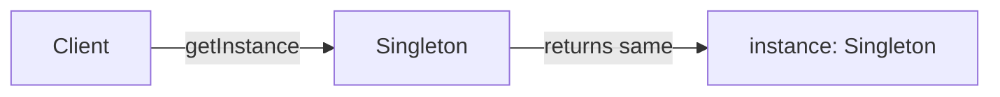
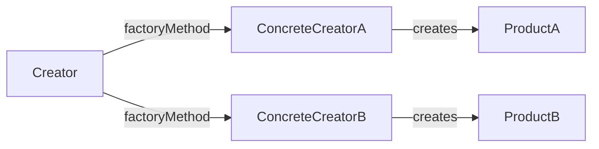
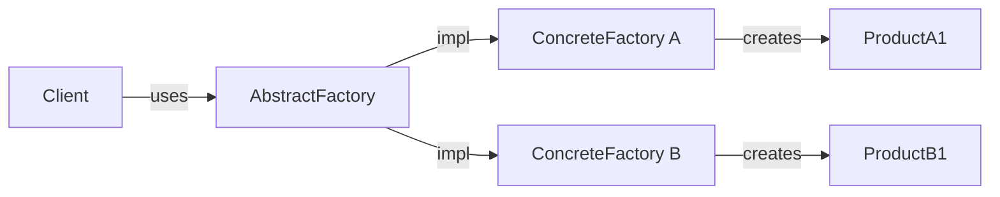
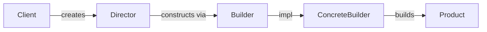
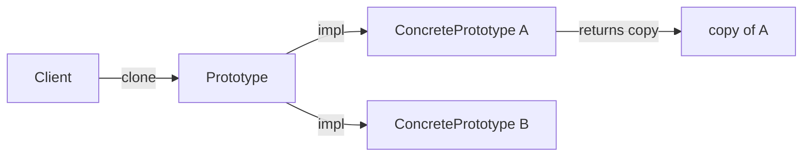

생성 패턴(Creational Pattern)은 객체를 **어떻게 만들 것인가**에 집중한다. `new` 키워드를 직접 쓰는 대신, 생성 로직을 캡슐화해서 코드가 구체 클래스에 의존하지 않도록 만드는 것이 핵심 목표다. GoF는 이 범주에 5개 패턴을 정의했다: Singleton, Factory Method, Abstract Factory, Builder, Prototype.

---

## 1. Singleton

### 의도

인스턴스를 딱 하나만 만들고, 전역에서 그 하나에 접근하게 한다.

### 비유

나라에 대통령이 한 명인 것과 같다. "대통령 자리"는 하나지만 누구나 그 자리를 통해 국정을 참조할 수 있다. 두 번째 대통령 인스턴스를 만들려 하면 같은 사람이 반환된다.

### 구조



### Java 구현

스레드 안전하게 만드는 방법은 여러 가지다. 실무에서 가장 권장되는 방식은 두 가지다.

**방법 1: 이중 검사 잠금(Double-Checked Locking)**

```java
public class DatabaseConnection {
    // volatile 없으면 명령어 재정렬(reordering)으로 반쪽짜리 인스턴스가 노출될 수 있다
    private static volatile DatabaseConnection instance;

    private DatabaseConnection() {
        // 리플렉션 공격 방어
        if (instance != null) {
            throw new RuntimeException("Use getInstance()");
        }
    }

    public static DatabaseConnection getInstance() {
        if (instance == null) {                    // 1차 검사 (잠금 없이)
            synchronized (DatabaseConnection.class) {
                if (instance == null) {            // 2차 검사 (잠금 후)
                    instance = new DatabaseConnection();
                }
            }
        }
        return instance;
    }
}
```

**방법 2: 정적 내부 클래스(Initialization-on-demand)**

```java
public class ConfigManager {
    private ConfigManager() {}

    // JVM 클래스 로딩 메커니즘이 스레드 안전성을 보장한다
    private static class Holder {
        static final ConfigManager INSTANCE = new ConfigManager();
    }

    public static ConfigManager getInstance() {
        return Holder.INSTANCE;
    }
}
```

정적 내부 클래스 방식은 `ConfigManager` 클래스가 로드될 때 `Holder`가 초기화되지 않는다. `getInstance()`가 처음 호출될 때 `Holder`가 로드되고, JVM 클래스 초기화 락이 동시성을 처리한다. `volatile`도 `synchronized`도 필요 없다.

**방법 3: Enum Singleton**

```java
public enum AppConfig {
    INSTANCE;

    private final Properties props = new Properties();

    public String get(String key) {
        return props.getProperty(key);
    }
}

// 사용
AppConfig.INSTANCE.get("db.url");
```

Enum 방식은 직렬화와 리플렉션 공격에도 안전하다. Joshua Bloch가 Effective Java에서 권장한 방식이다.

### Spring에서의 활용

Spring Bean의 기본 스코프가 `singleton`이다. `@Component`, `@Service`, `@Repository`로 등록된 빈은 ApplicationContext당 하나의 인스턴스를 유지한다.

```java
@Service
// 별도 설정 없으면 @Scope("singleton") 적용
public class OrderService {
    // Spring이 인스턴스 생성과 생명주기를 관리한다
}
```

### 함정

- **멀티스레드 환경에서 `volatile` 누락**: 명령어 재정렬로 인해 초기화되지 않은 인스턴스가 반환될 수 있다.
- **직렬화/역직렬화**: `Serializable`을 구현한 Singleton은 역직렬화할 때 새 인스턴스가 생성된다. `readResolve()` 메서드를 반드시 구현해야 한다.
- **테스트 격리 어려움**: 전역 상태를 공유하므로 단위 테스트에서 상태가 누적된다. 의존성 주입(DI)으로 추상화하는 것이 더 낫다.
- **클래스 로더**: 애플리케이션 서버처럼 클래스 로더가 여러 개인 환경에서는 Singleton이 여러 개 생길 수 있다.

---

## 2. Factory Method

### 의도

객체 생성을 서브클래스에 위임한다. 어떤 클래스를 만들지는 서브클래스가 결정한다.

### 비유

피자 프랜차이즈 본사는 "피자를 만들어라"는 절차를 정의한다. 구체적으로 뉴욕 스타일 피자를 만들지, 시카고 스타일 피자를 만들지는 각 지점(서브클래스)이 결정한다. 본사 코드는 어떤 지점인지 몰라도 `createPizza()`를 호출할 수 있다.

### 구조



### Java 구현

```java
// 추상 창조자
public abstract class LoggerFactory {
    // 팩토리 메서드 — 서브클래스가 오버라이드
    protected abstract Logger createLogger(String name);

    // 팩토리 메서드를 사용하는 템플릿 메서드
    public Logger getLogger(String name) {
        Logger logger = createLogger(name);
        logger.setLevel(Level.INFO);   // 공통 후처리
        return logger;
    }
}

// 구체 창조자 A
public class FileLoggerFactory extends LoggerFactory {
    @Override
    protected Logger createLogger(String name) {
        return new FileLogger(name, "/var/log/app.log");
    }
}

// 구체 창조자 B
public class ConsoleLoggerFactory extends LoggerFactory {
    @Override
    protected Logger createLogger(String name) {
    return new ConsoleLogger(name);
    }
}

// 클라이언트
LoggerFactory factory = new FileLoggerFactory();
Logger logger = factory.getLogger("order-service");
```

클라이언트는 `FileLogger`나 `ConsoleLogger`를 직접 참조하지 않는다. `LoggerFactory`라는 추상화만 안다.

### Spring에서의 활용

`FactoryBean<T>` 인터페이스가 Factory Method 패턴의 구현이다.

```java
@Component
public class DataSourceFactoryBean implements FactoryBean<DataSource> {
    @Override
    public DataSource getObject() throws Exception {
        HikariDataSource ds = new HikariDataSource();
        ds.setJdbcUrl("jdbc:postgresql://localhost/mydb");
        return ds;
    }

    @Override
    public Class<?> getObjectType() {
        return DataSource.class;
    }
}
```

`@Bean` 메서드도 개념적으로 Factory Method다. 스프링 컨테이너가 `@Bean` 메서드를 호출해서 인스턴스를 생성하고 관리한다.

### 함정

- **클래스 폭발**: 새 제품마다 새 Factory 서브클래스가 필요해서 클래스 수가 급증할 수 있다. 제품 종류가 많고 자주 바뀐다면 Abstract Factory나 전략 패턴이 더 적합하다.
- **단일 제품군 한계**: Factory Method는 제품 하나를 만든다. 연관된 여러 객체를 일관성 있게 만들어야 한다면 Abstract Factory로 가야 한다.

---

## 3. Abstract Factory

### 의도

구체 클래스를 지정하지 않고, 연관된 객체들의 **패밀리**를 생성하는 인터페이스를 제공한다.

### 비유

가구 공장이 있다. "북유럽 스타일 공장"은 북유럽 스타일 의자, 북유럽 스타일 소파, 북유럽 스타일 테이블을 만든다. "빅토리안 스타일 공장"은 빅토리안 의자, 빅토리안 소파, 빅토리안 테이블을 만든다. 클라이언트는 어떤 공장인지만 알고, 공장에 "의자 줘", "소파 줘"라고 요청한다. 스타일 일관성은 공장이 보장한다.

### 구조



### Java 구현

```java
// 추상 팩토리 인터페이스
public interface UIFactory {
    Button createButton();
    TextField createTextField();
    Dialog createDialog();
}

// 구체 팩토리 A: Windows 스타일
public class WindowsUIFactory implements UIFactory {
    @Override
    public Button createButton() {
        return new WindowsButton();
    }

    @Override
    public TextField createTextField() {
        return new WindowsTextField();
    }

    @Override
    public Dialog createDialog() {
        return new WindowsDialog();
    }
}

// 구체 팩토리 B: macOS 스타일
public class MacOSUIFactory implements UIFactory {
    @Override
    public Button createButton() {
        return new MacOSButton();
    }

    @Override
    public TextField createTextField() {
        return new MacOSTextField();
    }

    @Override
    public Dialog createDialog() {
        return new MacOSDialog();
    }
}

// 클라이언트 — 팩토리 구현체를 모른다
public class Application {
    private final UIFactory factory;

    public Application(UIFactory factory) {
        this.factory = factory;
    }

    public void render() {
        Button btn = factory.createButton();
        TextField tf = factory.createTextField();
        btn.render();
        tf.render();
    }
}

// 조합
UIFactory factory = System.getProperty("os.name").startsWith("Windows")
    ? new WindowsUIFactory()
    : new MacOSUIFactory();
new Application(factory).render();
```

### Factory Method vs Abstract Factory

| 구분 | Factory Method | Abstract Factory |
|---|---|---|
| 목적 | 단일 객체 생성 위임 | 연관 객체 패밀리 생성 |
| 확장 방식 | 서브클래싱 | 컴포지션 |
| 제품 수 | 1개 | N개 (관련 있는) |
| 새 제품 추가 | 팩토리 서브클래스 추가 | 모든 팩토리에 메서드 추가 필요 |

### Spring에서의 활용

데이터베이스 벤더별 방언(Dialect) 처리가 Abstract Factory 패턴에 가깝다. JPA의 `PersistenceProvider`는 `EntityManagerFactory`, `EntityManager` 등 연관 객체를 일관된 방식으로 생성한다.

### 함정

- **새 제품 추가의 어려움**: 팩토리 인터페이스에 메서드를 추가하면 모든 구체 팩토리를 수정해야 한다. 개방-폐쇄 원칙 위반이다.
- **팩토리 인터페이스 비대화**: 제품 종류가 많아질수록 팩토리 인터페이스가 수십 개 메서드를 가지게 된다.

---

## 4. Builder

### 의도

복잡한 객체를 단계별로 구성한다. 같은 구성 과정으로 다른 표현을 만들 수 있다.

### 비유

집을 지을 때 설계사(Director)가 공정 순서를 지시하고, 건축업자(Builder)가 실제로 각 단계를 구현한다. 나무집 건축업자와 콘크리트집 건축업자는 "기초 놓기 → 벽 세우기 → 지붕 올리기"라는 같은 순서를 따르지만 결과물이 다르다.

### 구조



### Java 구현

**GoF 원형 (Director + Builder)**

```java
public interface HouseBuilder {
    void buildFoundation();
    void buildWalls();
    void buildRoof();
    House getResult();
}

public class WoodenHouseBuilder implements HouseBuilder {
    private House house = new House();

    @Override public void buildFoundation() { house.setFoundation("나무 기초"); }
    @Override public void buildWalls()      { house.setWalls("목재 벽");    }
    @Override public void buildRoof()       { house.setRoof("목재 지붕");   }
    @Override public House getResult()      { return house;                 }
}

public class Director {
    public void construct(HouseBuilder builder) {
        builder.buildFoundation();
        builder.buildWalls();
        builder.buildRoof();
    }
}

// 사용
Director director = new Director();
HouseBuilder builder = new WoodenHouseBuilder();
director.construct(builder);
House house = builder.getResult();
```

**실무에서 자주 쓰는 Fluent Builder**

GoF 원형보다 이 형태가 더 일반적으로 쓰인다.

```java
public class HttpRequest {
    private final String method;
    private final String url;
    private final Map<String, String> headers;
    private final String body;
    private final int timeoutMillis;

    private HttpRequest(Builder builder) {
        this.method       = builder.method;
        this.url          = builder.url;
        this.headers      = Collections.unmodifiableMap(builder.headers);
        this.body         = builder.body;
        this.timeoutMillis = builder.timeoutMillis;
    }

    public static class Builder {
        private String method = "GET";
        private String url;
        private Map<String, String> headers = new HashMap<>();
        private String body;
        private int timeoutMillis = 5000;

        public Builder url(String url) {
            this.url = Objects.requireNonNull(url, "url must not be null");
            return this;
        }

        public Builder method(String method) {
            this.method = method;
            return this;
        }

        public Builder header(String key, String value) {
            this.headers.put(key, value);
            return this;
        }

        public Builder body(String body) {
            this.body = body;
            return this;
        }

        public Builder timeoutMillis(int timeout) {
            if (timeout <= 0) throw new IllegalArgumentException("timeout > 0");
            this.timeoutMillis = timeout;
            return this;
        }

        public HttpRequest build() {
            if (url == null) throw new IllegalStateException("url is required");
            return new HttpRequest(this);
        }
    }
}

// 사용 — 가독성이 높고 불변 객체가 된다
HttpRequest request = new HttpRequest.Builder()
    .url("https://api.example.com/orders")
    .method("POST")
    .header("Content-Type", "application/json")
    .header("Authorization", "Bearer token")
    .body("{\"id\":1}")
    .timeoutMillis(3000)
    .build();
```

### Lombok @Builder

```java
@Builder
@Value  // 불변 + getter 자동 생성
public class OrderCommand {
    String productId;
    int quantity;
    @Builder.Default
    String currency = "KRW";
}

// 사용
OrderCommand cmd = OrderCommand.builder()
    .productId("P001")
    .quantity(3)
    .build();
```

### Spring에서의 활용

`MockMvcRequestBuilders`, `ResponseEntity`, `UriComponentsBuilder`가 전형적인 Builder 패턴이다.

```java
// Spring MVC Test
mockMvc.perform(
    MockMvcRequestBuilders.post("/orders")
        .contentType(MediaType.APPLICATION_JSON)
        .content(json)
);

// ResponseEntity Builder
return ResponseEntity.status(HttpStatus.CREATED)
    .header("Location", "/orders/" + id)
    .body(response);
```

### 함정

- **필수 필드 누락 감지 시점**: Fluent Builder는 `build()` 시점에 검증하므로 컴파일 타임이 아닌 런타임에 오류가 난다. Step Builder 패턴을 쓰면 컴파일 타임에 강제할 수 있다.
- **Lombok @Builder와 상속**: `@Builder`는 상속과 궁합이 나쁘다. 부모 클래스 필드가 자식 Builder에 포함되지 않는다. `@SuperBuilder`를 써야 한다.
- **스레드 안전성**: Builder 객체 자체는 스레드 안전하지 않다. 한 Builder 인스턴스를 여러 스레드가 공유하면 안 된다.

---

## 5. Prototype

### 의도

기존 객체를 복사해서 새 객체를 만든다. 클래스를 직접 인스턴스화하는 대신 원형(prototype)을 복제한다.

### 비유

도장(stamp)과 같다. 도장 하나를 만들어두면 여러 장의 종이에 같은 모양을 찍어낼 수 있다. 매번 새 도장을 조각하는 것(비용이 큰 생성)보다 훨씬 빠르다.

### 구조



### Java 구현

Java는 `Cloneable` 인터페이스와 `Object.clone()`으로 Prototype을 지원한다. 하지만 `Cloneable`은 설계 결함이 있어서 복사 생성자 방식이 더 권장된다.

**Cloneable 방식 (얕은 복사 주의)**

```java
public class DocumentTemplate implements Cloneable {
    private String title;
    private List<String> sections;  // 참조 타입 주의
    private Map<String, String> metadata;

    @Override
    public DocumentTemplate clone() {
        try {
            DocumentTemplate copy = (DocumentTemplate) super.clone();
            // super.clone()은 얕은 복사 — 참조 타입은 직접 복사해야 한다
            copy.sections = new ArrayList<>(this.sections);
            copy.metadata = new HashMap<>(this.metadata);
            return copy;
        } catch (CloneNotSupportedException e) {
            throw new AssertionError("Cloneable 구현했는데 발생 불가", e);
        }
    }
}
```

**복사 생성자 방식 (권장)**

```java
public class GameCharacter {
    private String name;
    private int level;
    private List<String> skills;
    private Equipment equipment;  // 중첩 객체

    // 복사 생성자
    public GameCharacter(GameCharacter other) {
        this.name  = other.name;
        this.level = other.level;
        this.skills = new ArrayList<>(other.skills);
        // Equipment도 복사 생성자로 깊은 복사
        this.equipment = new Equipment(other.equipment);
    }

    // 팩토리 메서드로 감싸면 더 명확하다
    public GameCharacter copy() {
        return new GameCharacter(this);
    }
}

// 캐릭터 템플릿 레지스트리
public class CharacterRegistry {
    private final Map<String, GameCharacter> templates = new HashMap<>();

    public void register(String key, GameCharacter template) {
        templates.put(key, template);
    }

    public GameCharacter get(String key) {
        GameCharacter template = templates.get(key);
        if (template == null) throw new NoSuchElementException(key);
        return template.copy();  // 항상 복사본 반환
    }
}
```

### Spring에서의 활용

Spring의 `@Scope("prototype")`은 빈 이름과 같지만, 패턴 구현과는 다르다. 실질적인 Prototype 패턴 활용은 `BeanDefinition` 복제나 `ObjectFactory`를 통한 새 인스턴스 요청에서 볼 수 있다.

```java
// 매번 새 인스턴스가 필요한 경우 ObjectProvider 사용
@Service
public class ReportService {
    private final ObjectProvider<ReportBuilder> builderProvider;

    public ReportService(ObjectProvider<ReportBuilder> builderProvider) {
        this.builderProvider = builderProvider;
    }

    public Report createReport(ReportRequest req) {
        ReportBuilder builder = builderProvider.getObject();  // 새 인스턴스
        return builder.build(req);
    }
}
```

### 함정

- **깊은 복사(Deep Copy) vs 얕은 복사(Shallow Copy)**: `super.clone()`은 얕은 복사다. 참조 타입 필드가 있으면 원본과 복사본이 같은 객체를 공유한다. 반드시 명시적으로 깊은 복사를 구현해야 한다.
- **순환 참조**: 객체 그래프에 순환 참조가 있으면 깊은 복사 구현이 복잡해진다. 방문한 객체를 추적하는 `IdentityHashMap`이 필요하다.
- **`Cloneable`의 설계 결함**: `clone()` 메서드는 `Cloneable`이 아닌 `Object`에 선언되어 있다. 인터페이스를 구현해도 `clone()`을 오버라이드하지 않으면 `protected`라서 외부에서 호출 불가다.

---

## 패턴 간 비교표

| 패턴 | 핵심 질문 | 주요 수단 | 유연성 축 |
|---|---|---|---|
| Singleton | 몇 개? | 정적 메서드/필드 | 인스턴스 수 제어 |
| Factory Method | 무엇을? | 서브클래싱 | 어떤 클래스를 만들지 |
| Abstract Factory | 어떤 패밀리? | 컴포지션 | 어떤 제품군을 만들지 |
| Builder | 어떻게 조립? | 단계적 메서드 체인 | 조립 방법과 표현 분리 |
| Prototype | 복제? | clone/복사 생성자 | 생성 비용 절감 |

---

## 극한 시나리오

### 시나리오 1: 멀티 클래스로더 환경의 Singleton 붕괴

Java EE 애플리케이션 서버(Tomcat, JBoss)는 WAR 파일마다 독립된 클래스로더를 사용한다. 같은 JVM 위에서도 `static` 필드는 클래스로더 스코프에서 격리된다. 즉, WAR A의 `DatabaseConnection.instance`와 WAR B의 `DatabaseConnection.instance`는 서로 다른 인스턴스다.

**해결책**: 애플리케이션 서버 공유 라이브러리 영역의 클래스로더에 Singleton을 두거나, JNDI 레지스트리를 통해 공유한다. Spring ApplicationContext를 사용하면 컨테이너가 스코프를 관리한다.

### 시나리오 2: Abstract Factory에 새 제품 추가

운영 중인 `UIFactory`에 `Tooltip`을 새로 추가해야 한다. 인터페이스에 `createTooltip()`을 추가하는 순간, `WindowsUIFactory`, `MacOSUIFactory`, `LinuxUIFactory`, `MobileUIFactory` 모두 컴파일 에러가 난다.

**해결책 A**: 인터페이스에 `default` 메서드로 기본 구현을 제공한다(Java 8+). 기존 팩토리는 필요할 때만 오버라이드한다.
**해결책 B**: 팩토리를 추상 클래스로 바꾸고 `createTooltip()`에 기본 구현을 제공한다.

### 시나리오 3: Builder로 만든 불변 객체의 대량 복사

10만 개의 `OrderSnapshot` 객체를 Builder로 생성하는 배치 작업이 있다. 각 객체의 95%는 필드가 동일하고 5%만 다르다. Builder를 매번 새로 쓰는 것은 낭비다.

**해결책**: Builder에 `copy(T source)` 정적 팩토리 메서드를 추가해서 기존 객체의 필드를 가져온 Builder를 반환한다. Prototype과 Builder를 조합한 형태다.

```java
public static Builder copyOf(OrderSnapshot source) {
    return new Builder()
        .productId(source.productId)
        .currency(source.currency)
        .warehouse(source.warehouse);
        // 변경이 필요한 필드만 이후에 덮어쓴다
}
```

---

## 면접 포인트

### Singleton이 안티패턴으로 불리는 이유는?

전역 상태를 공유하기 때문이다. 테스트에서 Singleton의 상태가 테스트 간에 누적되어 격리성을 깨뜨린다. 의존성이 숨겨져서(생성자에 드러나지 않음) 코드 이해와 리팩토링이 어렵다. 그러나 진정한 전역 단일 자원(설정, 로거, 연결 풀)은 Singleton이 적합하다. Spring DI를 쓰면 빈의 생명주기를 컨테이너가 관리하므로 직접 Singleton을 구현하는 경우는 드물다.

### Factory Method와 Abstract Factory의 선택 기준은?

단일 제품 하나를 만드는 방법을 서브클래스에 위임하고 싶으면 Factory Method, 연관된 여러 제품을 일관된 스타일로 만들어야 하면 Abstract Factory를 쓴다. Factory Method는 상속 기반이고, Abstract Factory는 컴포지션 기반이다. Abstract Factory는 "스타일 일관성"이 중요한 UI 컴포넌트, 데이터베이스 드라이버 세트, 테마 패키지 등에 적합하다.

### Builder의 `build()` 메서드에서 유효성 검증을 해야 하는가?

해야 한다. Builder는 불완전한 상태의 객체가 외부로 나가는 것을 막는 마지막 관문이다. 필수 필드 누락, 상호 의존적 필드의 논리적 일관성(`startDate < endDate`), 범위 초과 등을 `build()`에서 검증한다. 검증 실패 시 `IllegalStateException`을 던진다. 최종 객체는 항상 유효한 상태여야 한다.

### `clone()`을 쓰지 말라는 이유는?

`Cloneable` 인터페이스는 설계가 잘못됐다. `clone()` 메서드가 `Cloneable`에 선언되지 않고 `Object`에 선언되어 있다. `Cloneable`을 구현해도 `clone()`은 기본적으로 `protected`이므로 외부에서 호출하려면 오버라이드가 필요하다. 얕은 복사가 기본이라 참조 타입 처리를 개발자가 직접 해야 한다. 복사 생성자나 정적 팩토리 메서드 `copy()`가 더 명확하고 안전하다.

### double-checked locking에서 `volatile`이 왜 필요한가?

`volatile` 없이는 CPU나 JIT 컴파일러가 명령어를 재정렬(reordering)할 수 있다. `instance = new Singleton()` 은 내부적으로 세 단계다: (1) 메모리 할당, (2) 생성자 호출, (3) 참조 할당. 재정렬이 일어나면 (3)이 (2)보다 먼저 실행될 수 있다. 다른 스레드가 1차 검사에서 `instance != null`을 보고 아직 초기화되지 않은 인스턴스를 반환받는다. `volatile`은 해당 변수의 쓰기/읽기에 happens-before 관계를 보장해서 이 문제를 막는다.
