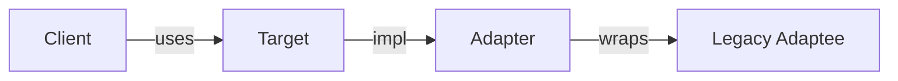
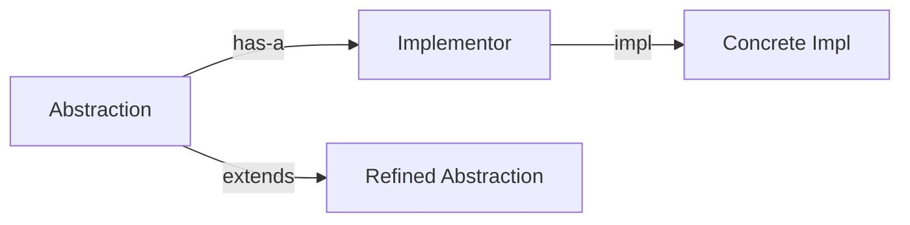
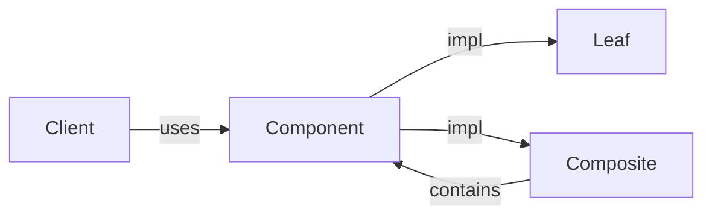
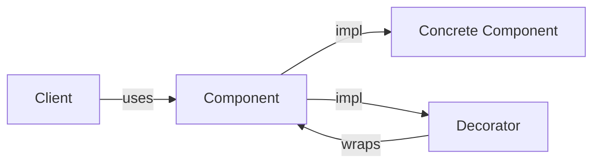
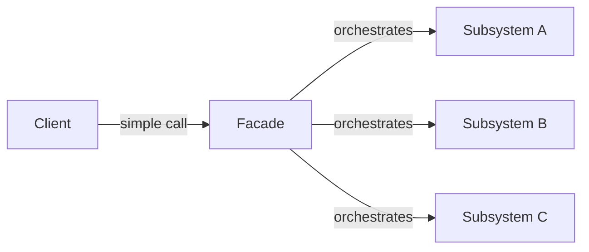
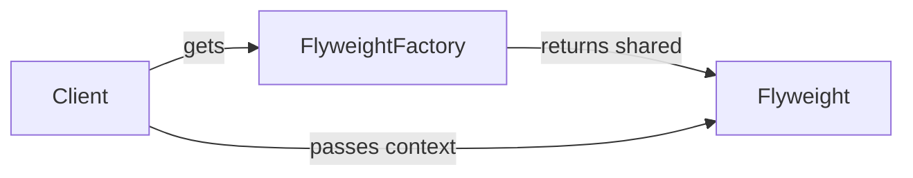
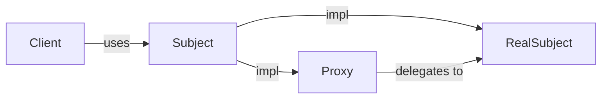

구조 패턴(Structural Pattern)은 클래스와 객체를 **어떻게 조합할 것인가**에 집중한다. 기존 코드를 건드리지 않고 새 인터페이스를 끼워 넣거나(Adapter), 기능을 동적으로 덧씌우거나(Decorator), 복잡한 서브시스템을 단순하게 감싸거나(Facade), 구현과 추상을 독립적으로 진화시키는(Bridge) 것이 이 패턴군의 핵심이다. GoF는 이 범주에 7개 패턴을 정의했다.

---

## 1. Adapter

### 의도

호환되지 않는 인터페이스를 가진 클래스들이 협력할 수 있도록 변환기 역할을 한다.

### 비유

해외 여행 시 멀티 어댑터를 쓰는 것과 같다. 한국 플러그(클라이언트)와 유럽 콘센트(레거시 시스템)는 모양이 다르지만 어댑터가 사이에서 변환해준다. 원래 플러그도, 원래 콘센트도 바꾸지 않는다.

### 구조



### Java 구현

**객체 어댑터 (컴포지션 — 권장)**

```java
// 클라이언트가 기대하는 인터페이스
public interface PaymentGateway {
    PaymentResult charge(String customerId, Money amount);
}

// 레거시 결제 시스템 — 변경 불가
public class LegacyPaymentSystem {
    public String processPayment(long accountId, double amountWon) {
        // 레거시 로직
        return "SUCCESS:" + accountId;
    }
}

// 어댑터
public class LegacyPaymentAdapter implements PaymentGateway {
    private final LegacyPaymentSystem legacy;

    public LegacyPaymentAdapter(LegacyPaymentSystem legacy) {
        this.legacy = legacy;
    }

    @Override
    public PaymentResult charge(String customerId, Money amount) {
        // 인터페이스 변환
        long accountId = Long.parseLong(customerId);
        double won     = amount.toWon();

        String result = legacy.processPayment(accountId, won);

        // 응답 변환
        return result.startsWith("SUCCESS")
            ? PaymentResult.success(result.split(":")[1])
            : PaymentResult.failure(result);
    }
}

// 클라이언트 — LegacyPaymentSystem을 모른다
PaymentGateway gateway = new LegacyPaymentAdapter(new LegacyPaymentSystem());
PaymentResult result = gateway.charge("12345", Money.won(50000));
```

**클래스 어댑터 (상속 — Java에서는 제한적)**

```java
// 다중 상속이 안 되므로 Adaptee를 상속하고 Target 인터페이스를 구현
public class ClassAdapter extends LegacyPaymentSystem implements PaymentGateway {
    @Override
    public PaymentResult charge(String customerId, Money amount) {
        String result = processPayment(Long.parseLong(customerId), amount.toWon());
        return result.startsWith("SUCCESS") ? PaymentResult.success(result) : PaymentResult.failure(result);
    }
}
```

클래스 어댑터는 Adaptee의 `protected` 메서드까지 접근할 수 있지만, 상속 때문에 Adaptee 구현에 강하게 결합된다. 객체 어댑터가 더 유연하다.

### Spring에서의 활용

`HandlerAdapter`는 Adapter 패턴의 교과서적 예다. `DispatcherServlet`은 `Handler`의 구체 타입을 모른다. `@Controller`, `HttpRequestHandler`, `Servlet` 등 다양한 핸들러 타입에 대해 각각의 `HandlerAdapter`가 공통 `handle()` 인터페이스로 변환해준다.

```java
// Spring MVC 내부 구조 (개념)
public interface HandlerAdapter {
    boolean supports(Object handler);
    ModelAndView handle(HttpServletRequest req, HttpServletResponse res, Object handler);
}

// @RequestMapping 메서드를 처리하는 어댑터
public class RequestMappingHandlerAdapter implements HandlerAdapter { ... }
// HttpRequestHandler를 처리하는 어댑터
public class HttpRequestHandlerAdapter implements HandlerAdapter { ... }
```

### 함정

- **어댑터 레이어 누적**: 레거시 시스템마다 어댑터를 만들다 보면 어댑터가 어댑터를 감싸는 구조가 생긴다. 근본적인 리팩토링이 필요한 신호다.
- **임피던스 불일치**: 두 인터페이스의 의미론(semantics)이 너무 다르면 어댑터가 비즈니스 로직을 담게 된다. 어댑터는 변환만 해야 한다.

---

## 2. Bridge

### 의도

추상화(Abstraction)와 구현(Implementation)을 분리해서 각각 독립적으로 확장할 수 있게 한다.

### 비유

리모컨(추상화)과 TV(구현)의 관계다. 리모컨 브랜드와 TV 브랜드는 독립적이다. 삼성 리모컨으로 LG TV를 켤 수도 있고, 범용 리모컨을 만들 수도 있다. 리모컨 로직과 TV 내부 회로를 따로 개선할 수 있다.

### 구조



### Java 구현

Bridge 없이 상속만 쓰면 클래스가 폭발한다. 알림 방식(이메일/SMS/푸시) × 알림 중요도(긴급/일반/정보) = 9개 클래스가 필요하다. Bridge를 쓰면 3 + 3 = 6개로 줄어든다.

```java
// 구현 인터페이스 (Implementation)
public interface NotificationChannel {
    void send(String recipient, String message);
}

// 구체 구현 A
public class EmailChannel implements NotificationChannel {
    @Override
    public void send(String recipient, String message) {
        System.out.printf("EMAIL to %s: %s%n", recipient, message);
    }
}

// 구체 구현 B
public class SmsChannel implements NotificationChannel {
    @Override
    public void send(String recipient, String message) {
        System.out.printf("SMS to %s: %s%n", recipient, message);
    }
}

// 추상화 (Abstraction) — 구현을 has-a로 보유
public abstract class Notification {
    protected final NotificationChannel channel;

    protected Notification(NotificationChannel channel) {
        this.channel = channel;
    }

    public abstract void notify(String recipient, String event);
}

// 정제된 추상화 A
public class UrgentNotification extends Notification {
    public UrgentNotification(NotificationChannel channel) {
        super(channel);
    }

    @Override
    public void notify(String recipient, String event) {
        channel.send(recipient, "[긴급] " + event + " — 즉시 확인 요망");
    }
}

// 정제된 추상화 B
public class InfoNotification extends Notification {
    public InfoNotification(NotificationChannel channel) {
        super(channel);
    }

    @Override
    public void notify(String recipient, String event) {
        channel.send(recipient, "[안내] " + event);
    }
}

// 조합 — 런타임에 결정 가능
Notification urgent = new UrgentNotification(new SmsChannel());
urgent.notify("010-1234-5678", "서버 장애 감지");

Notification info = new InfoNotification(new EmailChannel());
info.notify("admin@example.com", "배포 완료");
```

### Spring에서의 활용

`JdbcTemplate`과 `DataSource`의 관계가 Bridge에 가깝다. `JdbcTemplate`(추상화)은 SQL 실행 로직을 담고, `DataSource`(구현)는 물리적 연결을 담당한다. `HikariDataSource`, `TomcatDataSource` 등 어떤 `DataSource` 구현체를 주입해도 `JdbcTemplate`은 동일하게 동작한다.

### 함정

- **과도한 분리**: 추상화와 구현이 항상 독립적으로 변하지 않는다면 Bridge는 불필요한 복잡성만 더한다. 실제로 두 축이 독립적으로 성장할 것으로 예측될 때만 적용한다.
- **Factory와 결합 필요**: 어떤 구현체를 주입할지 결정하는 로직이 필요해서 보통 Factory 패턴과 함께 쓰인다.

---

## 3. Composite

### 의도

객체를 트리 구조로 구성해서 부분-전체 계층을 표현한다. 클라이언트가 개별 객체와 복합 객체를 동일하게 다룬다.

### 비유

파일 시스템과 같다. 파일과 폴더가 있고, 폴더는 파일과 다른 폴더를 담을 수 있다. "크기 계산"이라는 연산은 파일이든 폴더든 동일하게 호출한다. 폴더의 크기는 자식 크기의 합이다.

### 구조



### Java 구현

```java
// 컴포넌트 인터페이스 — Leaf와 Composite가 공유
public interface FileSystemNode {
    String getName();
    long getSize();
    void print(String indent);
}

// Leaf — 자식 없음
public class File implements FileSystemNode {
    private final String name;
    private final long size;

    public File(String name, long size) {
        this.name = name;
        this.size = size;
    }

    @Override public String getName() { return name; }
    @Override public long getSize()   { return size; }

    @Override
    public void print(String indent) {
        System.out.println(indent + "📄 " + name + " (" + size + "B)");
    }
}

// Composite — 자식을 가짐
public class Directory implements FileSystemNode {
    private final String name;
    private final List<FileSystemNode> children = new ArrayList<>();

    public Directory(String name) {
        this.name = name;
    }

    public void add(FileSystemNode node)    { children.add(node);    }
    public void remove(FileSystemNode node) { children.remove(node); }

    @Override public String getName() { return name; }

    @Override
    public long getSize() {
        // 자식의 크기를 재귀적으로 합산
        return children.stream().mapToLong(FileSystemNode::getSize).sum();
    }

    @Override
    public void print(String indent) {
        System.out.println(indent + "📁 " + name + "/");
        children.forEach(child -> child.print(indent + "  "));
    }
}

// 클라이언트 — File인지 Directory인지 신경 쓰지 않는다
Directory root = new Directory("root");
Directory src  = new Directory("src");
src.add(new File("Main.java", 1024));
src.add(new File("App.java",  2048));
root.add(src);
root.add(new File("README.md", 512));

root.print("");
System.out.println("Total: " + root.getSize() + "B");
```

### Spring에서의 활용

`CompositePropertySource`가 Composite 패턴이다. 여러 `PropertySource`(application.yml, system properties, environment variables)를 하나의 컴포지트로 묶어서 동일한 `getProperty()` 인터페이스로 우선순위에 따라 조회한다.

Spring Security의 `FilterChainProxy`도 개념적으로 Composite다. 여러 `SecurityFilterChain`을 담고, 요청이 들어오면 매칭되는 체인에 위임한다.

### 함정

- **인터페이스 설계 딜레마**: `add()`, `remove()` 같은 자식 관리 메서드를 컴포넌트 인터페이스에 넣으면 Leaf에서 의미가 없다. 인터페이스에서 빼면 클라이언트가 Composite를 구별해야 한다. 보통 컴포넌트 인터페이스에서 빼고 Composite 타입에만 두는 것이 타입 안전성 측면에서 낫다.
- **불변성**: Composite 구조를 불변으로 만들기 어렵다. 빌드 후 수정을 막으려면 방어적 복사와 불변 컬렉션이 필요하다.

---

## 4. Decorator

### 의도

객체에 동적으로 새 기능을 추가한다. 서브클래싱 없이 책임을 확장한다.

### 비유

커피숍의 음료 옵션과 같다. 아메리카노(기본 객체)에 샷 추가, 시럽 추가, 우유 추가를 순서대로 감싼다. 각 추가 옵션은 원래 음료를 감싸는 Decorator이고, 가격 계산은 겹겹이 위임된다.

### 구조



### Java 구현

```java
// 컴포넌트 인터페이스
public interface DataWriter {
    void write(byte[] data);
}

// 기본 구현
public class FileDataWriter implements DataWriter {
    private final String path;

    public FileDataWriter(String path) {
        this.path = path;
    }

    @Override
    public void write(byte[] data) {
        // 파일에 데이터 쓰기
        Files.write(Path.of(path), data);
    }
}

// 추상 데코레이터 — 공통 위임 로직
public abstract class DataWriterDecorator implements DataWriter {
    protected final DataWriter wrapped;

    protected DataWriterDecorator(DataWriter wrapped) {
        this.wrapped = wrapped;
    }

    @Override
    public void write(byte[] data) {
        wrapped.write(data);  // 기본 위임
    }
}

// 구체 데코레이터 A: 암호화
public class EncryptionDecorator extends DataWriterDecorator {
    private final Cipher cipher;

    public EncryptionDecorator(DataWriter wrapped, Cipher cipher) {
        super(wrapped);
        this.cipher = cipher;
    }

    @Override
    public void write(byte[] data) {
        byte[] encrypted = cipher.encrypt(data);
        wrapped.write(encrypted);  // 암호화 후 위임
    }
}

// 구체 데코레이터 B: 압축
public class CompressionDecorator extends DataWriterDecorator {
    @Override
    public void write(byte[] data) {
        byte[] compressed = Gzip.compress(data);
        wrapped.write(compressed);
    }

    public CompressionDecorator(DataWriter wrapped) {
        super(wrapped);
    }
}

// 구체 데코레이터 C: 로깅
public class LoggingDecorator extends DataWriterDecorator {
    public LoggingDecorator(DataWriter wrapped) {
        super(wrapped);
    }

    @Override
    public void write(byte[] data) {
        System.out.println("Writing " + data.length + " bytes");
        wrapped.write(data);
        System.out.println("Write complete");
    }
}

// 조합 — 런타임에 자유롭게 쌓는다
DataWriter writer = new LoggingDecorator(
    new EncryptionDecorator(
        new CompressionDecorator(
            new FileDataWriter("/data/output.bin")
        ),
        cipher
    )
);
writer.write(payload);
// 실행 순서: 로깅 → 암호화 → 압축 → 파일 쓰기
```

Java 표준 라이브러리의 `InputStream`/`OutputStream` 계층 구조가 Decorator 패턴의 대표적 구현이다.

```java
// 전형적인 Java IO Decorator 체인
InputStream is = new BufferedInputStream(
    new GZIPInputStream(
        new FileInputStream("data.gz")
    )
);
```

### Spring에서의 활용

Spring AOP가 Decorator 패턴을 프록시로 구현한다. `@Transactional`, `@Cacheable`, `@Async` 어노테이션은 런타임에 원본 빈을 감싸는 프록시(데코레이터)를 생성해서 부가 기능을 추가한다.

### 함정

- **데코레이터 순서 의존성**: 암호화 → 압축과 압축 → 암호화는 결과가 다르다. 순서가 중요한 경우 문서화가 필수다.
- **디버깅 어려움**: 스택 트레이스에 데코레이터 레이어가 겹쳐서 문제 추적이 복잡해진다.
- **equals/hashCode 문제**: 데코레이터로 감싼 객체는 원본과 `equals`가 다르다. 컬렉션에 담을 때 주의가 필요하다.

---

## 5. Facade

### 의도

서브시스템의 복잡한 인터페이스 집합에 단순한 통합 인터페이스를 제공한다.

### 비유

여행사와 같다. 비행기 예약, 호텔 예약, 렌터카 예약, 여행 보험 가입이라는 복잡한 서브시스템을 여행사 직원 한 명이 "패키지 여행 예약"이라는 단일 인터페이스로 처리해준다. 고객(클라이언트)은 내부 절차를 몰라도 된다.

### 구조



### Java 구현

```java
// 복잡한 서브시스템들
public class InventoryService {
    public boolean reserve(String productId, int qty) { /* ... */ return true; }
    public void release(String productId, int qty)    { /* ... */ }
}

public class PaymentService {
    public PaymentResult charge(String cardToken, Money amount) { /* ... */ return null; }
    public void refund(String paymentId)                        { /* ... */ }
}

public class ShippingService {
    public String createShipment(String orderId, Address addr) { /* ... */ return "SHIP-001"; }
    public void cancelShipment(String shipmentId)              { /* ... */ }
}

public class NotificationService {
    public void sendOrderConfirmation(String email, String orderId) { /* ... */ }
}

// 퍼사드 — 주문 처리 전체를 단순 인터페이스로 감싼다
public class OrderFacade {
    private final InventoryService  inventory;
    private final PaymentService    payment;
    private final ShippingService   shipping;
    private final NotificationService notification;

    public OrderFacade(InventoryService inventory,
                       PaymentService payment,
                       ShippingService shipping,
                       NotificationService notification) {
        this.inventory    = inventory;
        this.payment      = payment;
        this.shipping     = shipping;
        this.notification = notification;
    }

    // 클라이언트는 이 메서드 하나만 호출한다
    public OrderResult placeOrder(OrderRequest request) {
        // 1. 재고 예약
        if (!inventory.reserve(request.getProductId(), request.getQty())) {
            return OrderResult.failed("재고 부족");
        }

        // 2. 결제
        PaymentResult payResult = payment.charge(request.getCardToken(), request.getAmount());
        if (!payResult.isSuccess()) {
            inventory.release(request.getProductId(), request.getQty());
            return OrderResult.failed("결제 실패");
        }

        // 3. 배송 생성
        String shipmentId = shipping.createShipment(payResult.getOrderId(), request.getAddress());

        // 4. 알림
        notification.sendOrderConfirmation(request.getEmail(), payResult.getOrderId());

        return OrderResult.success(payResult.getOrderId(), shipmentId);
    }
}

// 클라이언트 — 서브시스템 복잡도를 모른다
OrderResult result = orderFacade.placeOrder(request);
```

### Spring에서의 활용

`JdbcTemplate`은 JDBC API(`Connection`, `PreparedStatement`, `ResultSet`, 예외 처리, 리소스 해제)라는 복잡한 서브시스템의 Facade다. Spring의 `@Service` 레이어 자체가 Repository, External API, Event Publisher 등을 조율하는 Facade 역할을 한다.

### 함정

- **Facade가 God Object가 되는 경우**: 서브시스템이 많아질수록 Facade가 비대해진다. Facade 안에서 비즈니스 로직이 쌓이기 시작하면 여러 Facade로 분리하거나 서비스 레이어를 재설계해야 한다.
- **서브시스템 직접 접근 허용 여부**: Facade는 서브시스템을 숨기지만 금지하지는 않는다. 고급 사용자가 서브시스템에 직접 접근할 수 있도록 열어두는 것이 일반적이다.

---

## 6. Flyweight

### 의도

수많은 유사 객체의 공유 가능한 상태(내재 상태, intrinsic state)를 공유해서 메모리 사용량을 줄인다.

### 비유

글꼴(font)과 같다. 문서에 "A"가 1만 번 나온다고 해서 "A"의 글리프(모양 데이터)를 1만 개 만들지 않는다. 글리프 하나를 공유하고, 각 "A"의 위치와 크기(외재 상태, extrinsic state)만 별도로 관리한다.

### 구조



### Java 구현

```java
// 내재 상태 (공유되는 불변 데이터)
public final class TreeType {
    private final String name;
    private final String texture;  // 큰 이미지 데이터
    private final Color  color;

    public TreeType(String name, String texture, Color color) {
        this.name    = name;
        this.texture = texture;
        this.color   = color;
    }

    // 외재 상태(x, y)는 파라미터로 받는다 — TreeType에 저장하지 않는다
    public void draw(Graphics g, int x, int y) {
        g.drawImage(texture, x, y);
    }
}

// Flyweight 팩토리 — 공유 인스턴스 관리
public class TreeTypeFactory {
    private static final Map<String, TreeType> cache = new HashMap<>();

    public static TreeType getOrCreate(String name, String texture, Color color) {
        String key = name + "_" + color.getRGB();
        return cache.computeIfAbsent(key, k -> {
            System.out.println("새 TreeType 생성: " + name);
            return new TreeType(name, texture, color);
        });
    }

    public static int getCacheSize() {
        return cache.size();
    }
}

// Tree — 외재 상태(x, y)를 보유. TreeType은 공유 참조
public class Tree {
    private final int      x, y;
    private final TreeType type;  // 공유 Flyweight

    public Tree(int x, int y, TreeType type) {
        this.x    = x;
        this.y    = y;
        this.type = type;
    }

    public void draw(Graphics g) {
        type.draw(g, x, y);  // 외재 상태를 전달
    }
}

// 사용 — 나무 100만 개, TreeType은 3개만 생성
public class Forest {
    private final List<Tree> trees = new ArrayList<>();

    public void plantTree(int x, int y, String name, String texture, Color color) {
        TreeType type = TreeTypeFactory.getOrCreate(name, texture, color);
        trees.add(new Tree(x, y, type));
    }
}

Forest forest = new Forest();
Random random = new Random();
for (int i = 0; i < 1_000_000; i++) {
    forest.plantTree(random.nextInt(2000), random.nextInt(2000),
        "Oak", "oak_texture.png", Color.GREEN);
}
// TreeType은 "Oak_Green" 하나만 생성됨
System.out.println("TreeType 캐시 크기: " + TreeTypeFactory.getCacheSize()); // 1
```

### Java 표준 라이브러리의 Flyweight

```java
// Integer 캐싱 (-128 ~ 127)
Integer a = Integer.valueOf(100);
Integer b = Integer.valueOf(100);
System.out.println(a == b);  // true — 같은 인스턴스 공유

Integer c = Integer.valueOf(200);
Integer d = Integer.valueOf(200);
System.out.println(c == d);  // false — 범위 초과, 새 인스턴스

// String Pool
String s1 = "hello";
String s2 = "hello";
System.out.println(s1 == s2);  // true — String Pool에서 공유
```

### Spring에서의 활용

Spring의 Bean 싱글턴이 개념적으로 Flyweight다. 상태가 없는(stateless) 서비스 빈은 모든 요청이 공유한다. `MessageSource`의 메시지 번들 캐싱, `ConversionService`의 컨버터 캐싱도 Flyweight 원리다.

### 함정

- **내재/외재 상태 분리 복잡성**: 어떤 상태가 공유 가능하고 어떤 상태가 컨텍스트 의존적인지 분석이 필요하다. 잘못 분류하면 공유 객체가 변경되어 모든 참조자에 영향을 준다.
- **동시성**: 공유된 Flyweight가 내부 상태를 가지면 스레드 안전성 문제가 생긴다. Flyweight는 반드시 불변(immutable)으로 만들어야 한다.
- **메모리 vs CPU 트레이드오프**: 외재 상태를 매번 계산하거나 전달하는 비용이 생긴다. 수천만 개 이상의 객체가 아니라면 Flyweight보다 단순한 설계가 낫다.

---

## 7. Proxy

### 의도

다른 객체에 대한 대리자 또는 자리표시자를 제공해서 접근을 제어한다.

### 비유

비서와 같다. 상사(실제 객체)에게 직접 연락하는 대신 비서(프록시)를 통한다. 비서는 사전 조건을 확인하고(접근 제어), 메시지를 기록하고(로깅), 간단한 질문은 직접 답하기도 한다(캐싱).

### 구조



### Java 구현

**정적 프록시**

```java
public interface ImageLoader {
    Image load(String url);
}

public class RealImageLoader implements ImageLoader {
    @Override
    public Image load(String url) {
        System.out.println("네트워크에서 이미지 로드: " + url);
        // 실제 네트워크 요청 (비용이 큼)
        return downloadImage(url);
    }
}

// 캐싱 프록시
public class CachingImageLoaderProxy implements ImageLoader {
    private final ImageLoader real;
    private final Map<String, Image> cache = new ConcurrentHashMap<>();

    public CachingImageLoaderProxy(ImageLoader real) {
        this.real = real;
    }

    @Override
    public Image load(String url) {
        return cache.computeIfAbsent(url, real::load);
    }
}

// 접근 제어 프록시
public class AccessControlImageLoaderProxy implements ImageLoader {
    private final ImageLoader real;
    private final SecurityContext security;

    public AccessControlImageLoaderProxy(ImageLoader real, SecurityContext security) {
        this.real     = real;
        this.security = security;
    }

    @Override
    public Image load(String url) {
        if (!security.hasPermission("IMAGE_READ")) {
            throw new AccessDeniedException("IMAGE_READ 권한 없음");
        }
        return real.load(url);
    }
}
```

**동적 프록시 (Java Reflection)**

```java
public class LoggingInvocationHandler implements InvocationHandler {
    private final Object target;

    public LoggingInvocationHandler(Object target) {
        this.target = target;
    }

    @Override
    public Object invoke(Object proxy, Method method, Object[] args) throws Throwable {
        long start = System.currentTimeMillis();
        System.out.println(">> " + method.getName() + " 호출");

        Object result = method.invoke(target, args);

        long elapsed = System.currentTimeMillis() - start;
        System.out.println("<< " + method.getName() + " 완료 (" + elapsed + "ms)");
        return result;
    }
}

// 동적 프록시 생성
ImageLoader real  = new RealImageLoader();
ImageLoader proxy = (ImageLoader) Proxy.newProxyInstance(
    real.getClass().getClassLoader(),
    new Class[]{ImageLoader.class},
    new LoggingInvocationHandler(real)
);

proxy.load("https://example.com/image.jpg");
```

### 프록시 종류 요약

| 종류 | 목적 | 예시 |
|---|---|---|
| 가상 프록시 | 지연 초기화(lazy init) | Hibernate의 지연 로딩 엔티티 |
| 보호 프록시 | 접근 제어 | Spring Security 인터셉터 |
| 원격 프록시 | 원격 객체 로컬 표현 | gRPC stub, RMI |
| 캐싱 프록시 | 결과 캐싱 | Spring @Cacheable |
| 로깅 프록시 | 모니터링/감사 | Spring AOP 어드바이스 |

### Spring에서의 활용

Spring AOP의 핵심이 동적 프록시다. `@Transactional`이 붙은 빈은 Spring이 런타임에 CGLIB이나 JDK 동적 프록시로 감싼다. 실제 빈 메서드 호출 전후에 트랜잭션 시작/커밋/롤백 로직이 삽입된다.

```java
@Service
public class OrderService {
    @Transactional  // Spring이 이 빈을 프록시로 감싼다
    public void createOrder(OrderRequest request) {
        // 실제 로직 — 트랜잭션 경계는 프록시가 관리한다
    }
}
```

`@Cacheable`도 마찬가지다. 프록시가 메서드 호출을 가로채서 캐시에 결과가 있으면 실제 메서드를 건너뛰고 캐시 값을 반환한다.

### 함정

- **Self-invocation 문제**: Spring AOP 프록시는 외부 호출만 가로챈다. 같은 클래스 내부에서 `this.method()`로 호출하면 프록시를 우회한다. `@Transactional` 메서드를 같은 클래스의 다른 메서드에서 호출하면 트랜잭션이 적용되지 않는다.
- **CGLIB vs JDK 동적 프록시**: `final` 클래스나 `final` 메서드는 CGLIB으로 프록시를 만들 수 없다. Spring 빈에 `final`을 붙이지 않도록 주의한다.
- **Proxy와 Decorator 구별**: 둘 다 객체를 감싸지만 의도가 다르다. Proxy는 접근 제어와 생명주기 관리에 집중하고, Decorator는 기능 추가에 집중한다.

---

## 패턴 간 비교표

| 패턴 | 핵심 관심사 | 관계 방식 | 대표 활용 |
|---|---|---|---|
| Adapter | 인터페이스 변환 | 감싸기 (변환) | 레거시 통합, HandlerAdapter |
| Bridge | 추상/구현 분리 | 컴포지션(has-a) | JdbcTemplate + DataSource |
| Composite | 트리 구조 통일 | 재귀 컴포지션 | 파일 시스템, UI 컴포넌트 |
| Decorator | 동적 기능 추가 | 감싸기 (확장) | Java IO, Spring AOP |
| Facade | 서브시스템 단순화 | 위임 | Service 레이어, JdbcTemplate |
| Flyweight | 메모리 절약 | 공유 | String Pool, Integer 캐시 |
| Proxy | 접근 제어/간접화 | 감싸기 (제어) | Spring AOP, Hibernate Lazy |

---

## 극한 시나리오

### 시나리오 1: Decorator 체인의 메모리 누수

대용량 파일 처리 서비스에서 `EncryptionDecorator(CompressionDecorator(BufferedDecorator(FileWriter)))` 체인을 만들고 `close()`를 호출하지 않았다. 바깥 Decorator에서만 `close()`를 호출하면 안에 있는 Decorator들도 연쇄적으로 닫혀야 한다.

**해결책**: `DataWriterDecorator`가 `Closeable`을 구현하고, `close()` 메서드에서 `wrapped.close()`를 호출한다. try-with-resources를 쓰면 자동으로 닫힌다. 체인의 가장 바깥 레이어만 `AutoCloseable`로 관리하면 내부가 연쇄적으로 닫힌다.

### 시나리오 2: Composite 트리의 순환 참조

디렉터리 A가 B를 포함하고, B가 다시 A를 포함하는 경우 `getSize()`가 무한 재귀에 빠진다. 파일 시스템의 심볼릭 링크 문제와 동일하다.

**해결책**: 방문한 노드를 `IdentityHashSet`으로 추적한다. 순환이 감지되면 예외를 던지거나 해당 노드를 건너뛴다.

```java
public long getSize(Set<FileSystemNode> visited) {
    if (!visited.add(this)) {
        throw new IllegalStateException("순환 참조 감지: " + name);
    }
    return children.stream()
        .mapToLong(child -> child instanceof Directory d
            ? d.getSize(visited)
            : child.getSize())
        .sum();
}
```

### 시나리오 3: Spring AOP Self-invocation 버그

`OrderService.createOrder()`가 내부적으로 `this.sendNotification()`을 호출하는데, `sendNotification()`에 `@Async`가 붙어 있다. 실제로 비동기로 실행되지 않고 동기로 실행되는 버그가 발생한다.

**원인**: Spring AOP 프록시는 외부에서 빈을 호출할 때만 가로챈다. `this`를 통한 내부 호출은 프록시를 우회한다.

**해결책 A**: `sendNotification()`을 별도 `NotificationService` 빈으로 분리하고 DI로 주입받는다. 외부 빈 호출이 되므로 프록시가 동작한다.
**해결책 B**: `ApplicationContext`에서 자신을 직접 꺼내서 프록시를 통해 호출한다(코드 냄새, 비권장).
**해결책 C**: `@EnableAspectJAutoProxy(exposeProxy = true)`와 `AopContext.currentProxy()`를 사용한다(복잡도 증가).

---

## 면접 포인트

### Adapter와 Decorator, Proxy의 차이는?

세 패턴 모두 객체를 감싸지만 의도가 다르다. Adapter는 인터페이스를 변환한다. 클라이언트가 기대하는 인터페이스와 실제 객체의 인터페이스가 다를 때 쓴다. Decorator는 같은 인터페이스를 유지하면서 기능을 추가한다. Proxy도 같은 인터페이스를 유지하지만 기능 추가보다는 접근 제어, 지연 초기화, 원격 접근 등에 집중한다.

### Facade와 Mediator의 차이는?

Facade는 단방향이다. 클라이언트 → Facade → 서브시스템으로 흐르고, 서브시스템끼리는 직접 통신하지 않는다. Mediator는 컴포넌트들이 서로 직접 참조하지 않고 Mediator를 통해 상호작용하도록 중재한다. 양방향 통신이 핵심이다. Facade는 외부에 단순한 인터페이스를 제공하고, Mediator는 내부 컴포넌트 간의 결합도를 낮춘다.

### Composite 패턴에서 자식 관리 메서드를 인터페이스에 두어야 하는가?

GoF는 투명성(transparency)과 안전성(safety) 사이의 트레이드오프를 제시한다. 인터페이스에 `add()`, `remove()`를 두면 클라이언트가 Leaf/Composite를 구별하지 않아도 된다(투명성). 하지만 Leaf에서 이 메서드는 의미가 없으므로 `UnsupportedOperationException`을 던져야 한다. 반대로 Composite 클래스에만 두면 타입 안전하지만 클라이언트가 캐스팅해야 한다. 실무에서는 보통 자식 관리 메서드를 인터페이스에서 제외하고 Composite 타입에만 두는 안전성 방식을 택한다.

### Flyweight의 내재 상태와 외재 상태를 어떻게 구분하는가?

내재 상태(intrinsic state)는 객체 자체의 본질적 속성으로, 어떤 컨텍스트에서든 변하지 않는다. 외재 상태(extrinsic state)는 사용 컨텍스트에 따라 달라진다. 나무의 예: 나무 종류, 텍스처, 색상은 내재 상태(공유 가능), 화면에서의 x/y 위치는 외재 상태(각 나무마다 다름). 분류 기준은 "이 상태가 이 객체를 사용하는 위치/방식과 무관하게 항상 같은가?"이다. 그렇다면 내재 상태다.

### Spring @Transactional이 동작하지 않는 상황은?

가장 흔한 원인은 self-invocation이다. 같은 클래스 내부에서 `@Transactional` 메서드를 `this`로 호출하면 Spring AOP 프록시를 우회한다. 두 번째는 `private` 메서드다. Spring AOP(CGLIB)는 `private` 메서드를 오버라이드할 수 없으므로 프록시가 생성되지 않는다. 세 번째는 `final` 메서드나 `final` 클래스다. 네 번째는 `@Transactional`을 인터페이스가 아닌 구현 클래스에만 붙이고 JDK 동적 프록시를 쓰는 경우다. JDK 동적 프록시는 인터페이스 기준이므로 구현 클래스 어노테이션을 인식하지 못한다.
