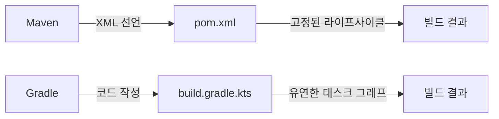
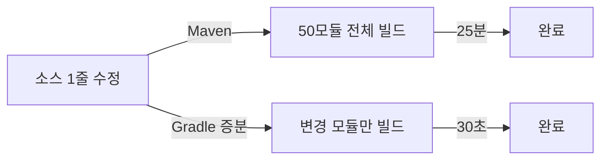

자바 프로젝트를 시작할 때 가장 먼저 만나는 선택지가 **빌드 도구**다. Maven은 2004년부터 자바 생태계의 표준이었고, Gradle은 2012년 이후 빠르게 점유율을 높이며 지금은 Android 공식 빌드 시스템이자 Spring Initializr의 기본값이 되었다. 이 포스트는 두 도구의 철학, 아키텍처, 의존성 관리, 빌드 성능, 멀티모듈 전략을 코드와 다이어그램으로 비교하고, 실무에서 빠지기 쉬운 함정과 면접 포인트까지 정리한다.

---

## 1. 한 줄 요약

**Maven은 "규칙을 따르면 빌드가 알아서 된다"는 선언적 철학이고, Gradle은 "빌드도 코드다"라는 프로그래밍 철학이다.** 둘 다 의존성 해결과 빌드 자동화라는 같은 문제를 풀지만, 접근 방식이 근본적으로 다르다.

> **비유**: Maven은 레시피북이다. 재료와 순서가 정해져 있고, 그대로 따르면 요리가 나온다. Gradle은 요리사에게 주방 전체를 맡기는 것이다. 레시피를 자유롭게 수정할 수 있고, 냉장고에 뭐가 있는지에 따라 즉석에서 메뉴를 바꿀 수도 있다.

---

## 2. 빌드 도구가 하는 일

빌드 도구가 없던 시절을 상상해보자. `javac`로 수백 개 파일을 컴파일하고, 외부 라이브러리 jar를 classpath에 일일이 넣고, 테스트를 수동으로 돌리고, jar로 패키징한 뒤 서버에 올린다. 한 사람이 이 과정을 실수 없이 반복하기란 불가능에 가깝다.

빌드 도구는 이 전체 과정을 자동화한다. 구체적으로 다섯 가지를 해결한다.

**첫째, 의존성 관리.** 프로젝트가 필요로 하는 외부 라이브러리를 원격 저장소에서 다운로드하고, 그 라이브러리가 또 의존하는 라이브러리(전이 의존성)까지 자동으로 해결한다.

**둘째, 컴파일.** 소스 코드를 바이트코드로 변환한다. 어떤 파일이 변경됐는지 추적해서 변경된 것만 다시 컴파일하는 것도 빌드 도구의 몫이다.

**셋째, 테스트 실행.** 단위 테스트, 통합 테스트를 자동으로 찾아 실행하고 결과를 보고한다.

**넷째, 패키징.** 컴파일된 코드와 리소스를 jar, war, fat-jar 등 배포 가능한 형태로 묶는다.

**다섯째, 배포.** 패키징된 결과물을 원격 저장소(Maven Central, Nexus)에 업로드하거나 서버에 전송한다.


> **비유**: 빌드 도구는 공장의 컨베이어 벨트다. 원재료(소스코드)가 투입되면 각 공정(컴파일, 테스트, 패키징)을 자동으로 거쳐 완제품(배포 가능 아티팩트)이 나온다. 컨베이어 벨트가 없으면 작업자가 재료를 들고 공정마다 뛰어다녀야 한다.

---

## 3. 아키텍처 비교 — 선언적 vs 프로그래밍

### Maven: XML 기반 선언적 모델

Maven의 핵심 철학은 **Convention over Configuration**이다. 디렉토리 구조, 빌드 순서, 기본 플러그인이 모두 정해져 있다. 개발자는 "내 프로젝트 정보와 의존성"만 선언하면 나머지는 Maven이 알아서 처리한다.

```xml
<!-- pom.xml — 선언적: "무엇"만 기술 -->
<project>
    <modelVersion>4.0.0</modelVersion>
    <groupId>com.example</groupId>
    <artifactId>my-service</artifactId>
    <version>1.0.0</version>
    <packaging>jar</packaging>

    <dependencies>
        <dependency>
            <groupId>org.springframework.boot</groupId>
            <artifactId>spring-boot-starter-web</artifactId>
            <version>3.3.0</version>
        </dependency>
    </dependencies>
</project>
```

장점은 명확하다. 어떤 Maven 프로젝트를 열어도 구조가 같다. `src/main/java`, `src/test/java`, `pom.xml`. 10년 전 프로젝트도 즉시 이해할 수 있다.

단점도 명확하다. **커스터마이징이 고통스럽다.** 빌드 과정에 조건 분기를 넣고 싶으면 Maven 플러그인을 직접 작성하거나, Ant 태스크를 끌어와야 한다. XML은 프로그래밍 언어가 아니기 때문이다.

### Gradle: 코드 기반 프로그래밍 모델

Gradle은 빌드 스크립트 자체가 프로그래밍 코드(Groovy 또는 Kotlin)다. 조건문, 반복문, 함수 추출이 자연스럽다.

```kotlin
// build.gradle.kts — 프로그래밍: "어떻게"도 기술 가능
plugins {
    id("org.springframework.boot") version "3.3.0"
    id("io.spring.dependency-management") version "1.1.5"
    kotlin("jvm") version "1.9.24"
}

group = "com.example"
version = "1.0.0"

dependencies {
    implementation("org.springframework.boot:spring-boot-starter-web")
    testImplementation("org.springframework.boot:spring-boot-starter-test")
}

// 조건 분기가 자연스럽다
tasks.jar {
    manifest {
        attributes["Build-Time"] = java.time.Instant.now().toString()
        if (project.hasProperty("release")) {
            attributes["Build-Type"] = "RELEASE"
        }
    }
}
```

**핵심 차이를 정리하면 다음과 같다.**

| 항목 | Maven | Gradle |
|------|-------|--------|
| 설정 언어 | XML | Groovy / Kotlin DSL |
| 철학 | 선언적 (무엇) | 프로그래밍 (무엇 + 어떻게) |
| 커스터마이징 | 플러그인 작성 필요 | 빌드 스크립트에서 직접 |
| 학습 곡선 | 낮음 (규칙만 따르면 됨) | 높음 (Groovy/Kotlin 이해 필요) |
| IDE 지원 | 성숙함 | Kotlin DSL은 자동완성 우수 |
| 가독성 | XML 장황함 | DSL 간결함 |



> **비유**: Maven은 정해진 코스 요리다. 전채, 수프, 메인, 디저트 순서가 바뀌지 않는다. Gradle은 뷔페다. 원하는 음식을 원하는 순서로 가져올 수 있고, 셰프에게 즉석 메뉴를 요청할 수도 있다. 대신 뷔페에서는 자기 절제력(빌드 스크립트 관리)이 필요하다.

---

## 4. 빌드 라이프사이클

### Maven의 라이프사이클 — 3개의 고정 사이클

Maven에는 세 개의 빌드 라이프사이클이 있다.

1. **default** — 프로젝트 빌드와 배포 (compile, test, package, install, deploy)
2. **clean** — 빌드 산출물 삭제
3. **site** — 프로젝트 문서 생성

각 라이프사이클은 **페이즈(phase)**로 구성되고, 페이즈는 순서대로 실행된다. `mvn package`를 실행하면 `validate` -> `compile` -> `test` -> `package`까지 순서대로 전부 실행된다. 중간 페이즈만 건너뛸 수 없다.

```
default 라이프사이클 주요 페이즈:

validate → compile → test → package → verify → install → deploy
   ↑                                                          ↑
   시작                                                      끝
```

각 페이즈에는 **플러그인 골(goal)**이 바인딩된다. 예를 들어 `compile` 페이즈에는 `maven-compiler-plugin:compile` 골이 기본으로 바인딩되어 있다. 개발자가 추가 플러그인을 바인딩할 수도 있다.

```xml
<!-- 특정 페이즈에 플러그인 골 바인딩 -->
<build>
    <plugins>
        <plugin>
            <groupId>org.apache.maven.plugins</groupId>
            <artifactId>maven-checkstyle-plugin</artifactId>
            <version>3.3.1</version>
            <executions>
                <execution>
                    <phase>validate</phase>
                    <goals>
                        <goal>check</goal>
                    </goals>
                </execution>
            </executions>
        </plugin>
    </plugins>
</build>
```

### Gradle의 라이프사이클 — 3단계 실행 모델

Gradle은 Maven처럼 고정된 페이즈가 없다. 대신 **태스크(task)**의 의존 관계로 방향성 비순환 그래프(DAG)를 만들고, 필요한 태스크만 실행한다.

Gradle의 빌드는 세 단계로 진행된다.

**1단계: 초기화(Initialization).** `settings.gradle.kts`를 읽어 어떤 프로젝트가 빌드에 포함되는지 결정한다. 멀티모듈이면 여기서 하위 프로젝트 목록이 확정된다.

**2단계: 구성(Configuration).** 모든 프로젝트의 `build.gradle.kts`를 실행하여 태스크 객체를 생성하고 의존 관계를 설정한다. 이 단계에서 실제 빌드 작업은 수행되지 않는다. 태스크 그래프만 완성된다.

**3단계: 실행(Execution).** 요청된 태스크와 그 의존 태스크를 DAG 순서대로 실행한다.


**Maven과 결정적 차이**: Maven은 `package`를 실행하면 앞의 모든 페이즈가 반드시 실행된다. Gradle은 요청한 태스크에 필요한 태스크만 실행한다. 이 차이가 빌드 속도에 직접적 영향을 미친다.

```kotlin
// 커스텀 태스크와 의존 관계
tasks.register("generateDocs") {
    description = "API 문서 생성"
    dependsOn("compileJava")
    doLast {
        println("문서 생성 완료")
    }
}

tasks.register("deployDocs") {
    description = "문서 배포"
    dependsOn("generateDocs")
    doLast {
        println("문서 배포 완료")
    }
}
```

> **비유**: Maven의 라이프사이클은 지하철 노선이다. 강남역에 가려면 반드시 이전 역을 전부 지나야 한다. Gradle의 태스크 그래프는 내비게이션이다. 목적지까지 최단 경로만 계산해서 필요한 도로만 지난다.

---

## 5. 의존성 관리 심화 — BOM, Version Catalog, Platform

### 전이 의존성과 충돌의 본질

의존성 A가 commons-lang3 3.12를 쓰고, 의존성 B가 commons-lang3 3.14를 쓴다. 이때 실제로 어떤 버전이 classpath에 올라갈까?

**Maven의 전략**: 가장 가까운 것이 이긴다(Nearest Definition). pom.xml에서 의존성 트리상 루트에 더 가까운 쪽이 선택된다. 거리가 같으면 먼저 선언된 쪽이 이긴다.

**Gradle의 전략**: 가장 높은 버전이 이긴다(Highest Version). 기본적으로 최신 버전을 선택한다. 이 전략이 더 안전한 경우가 많지만, 하위 호환성이 깨진 메이저 업그레이드에서는 오히려 위험할 수 있다.

```
의존성 트리 예시:

my-app
├── lib-A 1.0 → commons-lang3:3.12
└── lib-B 2.0 → commons-lang3:3.14

Maven:  commons-lang3:3.12 선택 (먼저 선언)
Gradle: commons-lang3:3.14 선택 (더 높은 버전)
```

### 극한 시나리오: 의존성 충돌 지옥

모듈 50개짜리 프로젝트를 상상하자. 각 모듈이 독립적으로 의존성을 선언한다. module-A는 Jackson 2.15.0을, module-B는 Jackson 2.17.0을, module-C는 Jackson 2.14.3을 쓴다. 전이 의존성까지 합치면 Jackson 관련 jar가 네 가지 버전으로 올라온다. 런타임에 `NoSuchMethodError`가 터진다. 어디서 터졌는지 찾는 데만 반나절이다.

이 지옥에서 벗어나는 방법이 **BOM(Bill of Materials)**이다.

### Maven BOM

BOM은 **버전을 한 곳에서 관리하는 특수한 pom**이다. `<dependencyManagement>`에 모든 라이브러리의 버전을 선언해두면, 각 모듈에서는 버전 없이 의존성을 선언할 수 있다.

```xml
<!-- parent-bom/pom.xml -->
<project>
    <groupId>com.example</groupId>
    <artifactId>parent-bom</artifactId>
    <version>1.0.0</version>
    <packaging>pom</packaging>

    <dependencyManagement>
        <dependencies>
            <!-- 모든 모듈이 이 버전을 사용 -->
            <dependency>
                <groupId>com.fasterxml.jackson.core</groupId>
                <artifactId>jackson-databind</artifactId>
                <version>2.17.0</version>
            </dependency>
            <dependency>
                <groupId>org.slf4j</groupId>
                <artifactId>slf4j-api</artifactId>
                <version>2.0.13</version>
            </dependency>
        </dependencies>
    </dependencyManagement>
</project>

<!-- module-A/pom.xml -->
<dependencies>
    <!-- 버전을 적지 않는다 — BOM에서 가져옴 -->
    <dependency>
        <groupId>com.fasterxml.jackson.core</groupId>
        <artifactId>jackson-databind</artifactId>
    </dependency>
</dependencies>
```

Spring Boot의 `spring-boot-dependencies`가 대표적인 BOM이다. Spring Boot를 parent로 쓰면 수백 개 라이브러리의 버전이 자동으로 맞춰진다.

### Gradle Platform과 Version Catalog

Gradle에서 BOM에 해당하는 기능이 **platform**이다.

```kotlin
// 외부 BOM 사용
dependencies {
    implementation(platform("org.springframework.boot:spring-boot-dependencies:3.3.0"))
    implementation("com.fasterxml.jackson.core:jackson-databind") // 버전 생략
}
```

Gradle 7.0부터는 **Version Catalog**라는 더 강력한 기능이 추가되었다. `gradle/libs.versions.toml` 파일에 모든 의존성과 버전을 선언한다.

```toml
# gradle/libs.versions.toml
[versions]
spring-boot = "3.3.0"
jackson = "2.17.0"
kotlin = "1.9.24"
junit = "5.10.2"

[libraries]
spring-boot-web = { module = "org.springframework.boot:spring-boot-starter-web", version.ref = "spring-boot" }
spring-boot-test = { module = "org.springframework.boot:spring-boot-starter-test", version.ref = "spring-boot" }
jackson-databind = { module = "com.fasterxml.jackson.core:jackson-databind", version.ref = "jackson" }

[bundles]
spring-web = ["spring-boot-web", "jackson-databind"]

[plugins]
spring-boot = { id = "org.springframework.boot", version.ref = "spring-boot" }
kotlin-jvm = { id = "org.jetbrains.kotlin.jvm", version.ref = "kotlin" }
```

```kotlin
// build.gradle.kts — 타입 세이프 접근
plugins {
    alias(libs.plugins.spring.boot)
    alias(libs.plugins.kotlin.jvm)
}

dependencies {
    implementation(libs.bundles.spring.web)  // 번들로 여러 의존성 한 번에
    testImplementation(libs.spring.boot.test)
}
```

Version Catalog의 결정적 장점은 **IDE 자동완성**이다. `libs.`을 타이핑하면 사용 가능한 모든 의존성이 자동완성으로 뜬다. 문자열 오타로 빌드가 깨지는 일이 사라진다.

> **비유**: BOM과 Version Catalog는 회사의 구매 목록이다. 각 부서가 제각각 사무용품을 구매하면 같은 볼펜을 다섯 가지 가격에 사게 된다. 구매부서가 통합 목록을 만들어두면 모든 부서가 같은 가격, 같은 제품을 쓴다. Version Catalog는 여기에 바코드 스캐너(타입 세이프)까지 추가된 것이다.

### 의존성 스코프 비교

| Maven Scope | Gradle Configuration | 의미 |
|------------|---------------------|------|
| compile | implementation | 컴파일 + 런타임 필요, 전이 노출 안 함 |
| compile (전이) | api | 컴파일 + 런타임 필요, 전이 노출 |
| provided | compileOnly | 컴파일에만 필요 (런타임은 컨테이너 제공) |
| runtime | runtimeOnly | 런타임에만 필요 |
| test | testImplementation | 테스트에만 필요 |

Gradle의 `implementation`과 `api` 구분이 중요하다. `implementation`으로 선언한 의존성은 이 모듈을 사용하는 다른 모듈에 노출되지 않는다. 이것이 **컴파일 격리**다. 모듈 A가 Jackson을 `implementation`으로 쓰면, 모듈 A에 의존하는 모듈 B의 코드에서 Jackson 클래스를 직접 참조할 수 없다.

```kotlin
// module-core/build.gradle.kts
dependencies {
    api("org.slf4j:slf4j-api:2.0.13")           // 외부에 노출
    implementation("ch.qos.logback:logback-classic:1.5.6")  // 내부에서만 사용
}

// module-web/build.gradle.kts
dependencies {
    implementation(project(":module-core"))
    // slf4j-api 사용 가능 (api로 노출됨)
    // logback-classic 사용 불가 (implementation으로 숨겨짐)
}
```

이 격리가 왜 중요한지는 모듈이 50개일 때 체감된다. `api`로 모든 의존성을 노출하면 하나의 라이브러리 버전을 올릴 때 50개 모듈 전부가 재컴파일된다. `implementation`으로 숨기면 해당 모듈과 직접 의존하는 모듈만 재컴파일된다.

---

## 6. Gradle Kotlin DSL

### Groovy DSL vs Kotlin DSL

Gradle은 원래 Groovy DSL로 시작했다. `build.gradle` 파일이 Groovy 코드다. 2016년부터 Kotlin DSL(`build.gradle.kts`)이 추가되었고, 현재는 Kotlin DSL이 권장 기본값이다.

```groovy
// build.gradle (Groovy DSL)
plugins {
    id 'org.springframework.boot' version '3.3.0'
    id 'java'
}

dependencies {
    implementation 'org.springframework.boot:spring-boot-starter-web'
    testImplementation 'org.springframework.boot:spring-boot-starter-test'
}

test {
    useJUnitPlatform()
}
```

```kotlin
// build.gradle.kts (Kotlin DSL)
plugins {
    id("org.springframework.boot") version "3.3.0"
    java
}

dependencies {
    implementation("org.springframework.boot:spring-boot-starter-web")
    testImplementation("org.springframework.boot:spring-boot-starter-test")
}

tasks.test {
    useJUnitPlatform()
}
```

차이가 미묘해 보이지만, 실제 개발에서는 큰 차이를 만든다.

**Kotlin DSL의 장점 세 가지:**

첫째, **컴파일 타임 타입 체크**. Groovy는 동적 타입 언어라서 오타가 있어도 빌드 스크립트를 실행할 때까지 모른다. Kotlin은 정적 타입이라서 IDE에서 즉시 빨간 줄이 뜬다.

둘째, **자동완성**. IntelliJ에서 `tasks.`을 치면 사용 가능한 모든 태스크가 뜬다. Groovy DSL에서는 이 자동완성이 불안정하다.

셋째, **리팩토링 안전성**. 함수 이름을 변경하면 참조하는 곳이 전부 자동으로 바뀐다. Groovy에서는 문자열 기반이라 놓치기 쉽다.

**Kotlin DSL의 단점:**

첫째, **초기 구성 속도가 느리다**. Kotlin DSL은 스크립트를 컴파일해야 하므로 최초 빌드 시 Groovy보다 수 초 더 걸린다. 캐시되면 이후에는 동일하다.

둘째, **Groovy 예제가 더 많다**. Stack Overflow, 블로그의 Gradle 예제 대부분이 아직 Groovy다. 변환이 필요하다.

### 커스텀 태스크 작성

Kotlin DSL에서 커스텀 태스크를 만드는 것은 일반 Kotlin 코드를 쓰는 것과 같다.

```kotlin
// 환경별 설정 파일 복사 태스크
abstract class CopyConfigTask : DefaultTask() {
    @get:Input
    abstract val environment: Property<String>

    @TaskAction
    fun execute() {
        val env = environment.get()
        val source = project.file("config/$env")
        val target = project.file("build/resources/main")

        project.copy {
            from(source)
            into(target)
        }
        logger.lifecycle("$env 환경 설정 복사 완료")
    }
}

tasks.register<CopyConfigTask>("copyConfig") {
    environment.set(project.findProperty("env")?.toString() ?: "local")
}

// 실행: ./gradlew copyConfig -Penv=production
```

### buildSrc와 Convention Plugin

모듈이 많아지면 각 `build.gradle.kts`에 중복 설정이 쌓인다. Java 버전, 인코딩, 테스트 설정, 코드 스타일 플러그인 등이 모듈마다 반복된다.

이때 사용하는 것이 **buildSrc**와 **Convention Plugin**이다. `buildSrc/` 디렉토리에 공통 빌드 로직을 Kotlin으로 작성하면, 모든 모듈에서 플러그인처럼 사용할 수 있다.

```kotlin
// buildSrc/src/main/kotlin/java-conventions.gradle.kts
plugins {
    java
    jacoco
}

java {
    sourceCompatibility = JavaVersion.VERSION_21
    targetCompatibility = JavaVersion.VERSION_21
}

tasks.test {
    useJUnitPlatform()
    finalizedBy(tasks.jacocoTestReport)
}

tasks.jacocoTestReport {
    dependsOn(tasks.test)
    reports {
        xml.required.set(true)
        html.required.set(true)
    }
}
```

```kotlin
// module-A/build.gradle.kts
plugins {
    id("java-conventions")  // buildSrc의 convention plugin 적용
}

dependencies {
    implementation(libs.spring.boot.web)
}
```

50개 모듈이 있어도 Java 버전 변경은 convention plugin 한 곳만 수정하면 된다.

> **비유**: Convention Plugin은 회사의 표준 운영 절차(SOP)다. 50개 부서가 각자 규칙을 만들면 혼란이지만, SOP를 한 번 만들어 전사에 적용하면 일관성이 유지된다. 새 부서가 생겨도 SOP를 참조하면 즉시 동일한 기준으로 운영할 수 있다.

---

## 7. 멀티모듈 프로젝트

### Maven 멀티모듈

Maven에서 멀티모듈은 부모 pom과 자식 모듈로 구성된다.

```xml
<!-- parent/pom.xml -->
<project>
    <groupId>com.example</groupId>
    <artifactId>my-platform</artifactId>
    <version>1.0.0</version>
    <packaging>pom</packaging>

    <modules>
        <module>core</module>
        <module>api</module>
        <module>batch</module>
    </modules>

    <dependencyManagement>
        <dependencies>
            <dependency>
                <groupId>org.springframework.boot</groupId>
                <artifactId>spring-boot-dependencies</artifactId>
                <version>3.3.0</version>
                <type>pom</type>
                <scope>import</scope>
            </dependency>
        </dependencies>
    </dependencyManagement>
</project>

<!-- core/pom.xml -->
<project>
    <parent>
        <groupId>com.example</groupId>
        <artifactId>my-platform</artifactId>
        <version>1.0.0</version>
    </parent>
    <artifactId>core</artifactId>

    <dependencies>
        <dependency>
            <groupId>com.fasterxml.jackson.core</groupId>
            <artifactId>jackson-databind</artifactId>
        </dependency>
    </dependencies>
</project>
```

### Gradle 멀티모듈

```kotlin
// settings.gradle.kts
rootProject.name = "my-platform"

include("core")
include("api")
include("batch")
```

```kotlin
// core/build.gradle.kts
plugins {
    id("java-conventions")
}

dependencies {
    api(libs.jackson.databind)
    implementation(libs.spring.boot.web)
}
```

```kotlin
// api/build.gradle.kts
plugins {
    id("java-conventions")
    alias(libs.plugins.spring.boot)
}

dependencies {
    implementation(project(":core"))
    implementation(libs.spring.boot.web)
}
```

### 극한 시나리오: 모듈 50개 빌드 시간

실무에서 마이크로서비스 모노레포를 운영하면 모듈 수가 50개를 넘기기도 한다. 이때 빌드 시간이 얼마나 걸리는지가 개발 생산성의 핵심이다.

**Maven으로 50개 모듈 빌드:**
- 기본 실행: 순차적. 모듈 하나당 평균 30초면 25분
- `-T 4` 옵션으로 병렬 빌드: 약 8~10분
- 모듈 하나의 소스를 1줄 수정해도 관련 모듈 전체를 다시 빌드

**Gradle로 50개 모듈 빌드:**
- 기본 실행: 병렬 빌드 기본 지원, 태스크 수준 병렬화
- 증분 빌드: 변경된 모듈만 재빌드
- 빌드 캐시: 이전 빌드 결과를 캐시에서 가져옴
- 동일 상황에서 3~5분



이 차이가 CI/CD 파이프라인에서 하루 수십 번 빌드가 돌 때 누적되면 엄청난 시간 차이가 된다.

---

## 8. 빌드 캐시와 증분 빌드

### Gradle의 증분 빌드 (Incremental Build)

Gradle은 각 태스크의 입력(input)과 출력(output)을 추적한다. 입력이 변경되지 않았으면 태스크를 건너뛴다. 이것이 **증분 빌드**다.

```
> Task :core:compileJava UP-TO-DATE    ← 입력 변경 없음, 건너뜀
> Task :core:processResources UP-TO-DATE
> Task :api:compileJava                ← 소스가 변경됨, 재실행
> Task :api:test                       ← 컴파일 결과 바뀜, 재실행
```

`UP-TO-DATE`가 보이면 해당 태스크가 건너뛰어진 것이다. 50개 모듈 중 1개만 수정하면 나머지 49개의 컴파일 태스크가 전부 `UP-TO-DATE`로 건너뛰어진다.

### 빌드 캐시 (Build Cache)

증분 빌드보다 더 강력한 것이 **빌드 캐시**다. 태스크의 입력을 해싱하여 캐시 키를 만들고, 같은 입력이면 이전 빌드 결과를 캐시에서 가져온다.

로컬 빌드 캐시는 기본으로 활성화되어 있다.

```properties
# gradle.properties
org.gradle.caching=true
```

**원격 빌드 캐시**를 사용하면 팀원이 이미 빌드한 결과를 다른 팀원이 재사용할 수 있다. CI 서버에서 빌드한 결과를 개발자 로컬에서 가져다 쓸 수도 있다.

```kotlin
// settings.gradle.kts
buildCache {
    local {
        directory = File(rootDir, ".gradle/build-cache")
    }
    remote<HttpBuildCache> {
        url = uri("https://cache.example.com/cache/")
        isPush = System.getenv("CI") != null  // CI에서만 푸시
    }
}
```

```
> Task :core:compileJava FROM-CACHE    ← 원격 캐시에서 가져옴
> Task :core:test FROM-CACHE
> Task :api:compileJava FROM-CACHE
```

### 극한 시나리오: 빌드 캐시가 깨질 때

빌드 캐시는 강력하지만, 깨지면 디버깅이 고통스럽다. 대표적인 깨짐 시나리오 세 가지다.

**시나리오 1: 절대 경로 오염.** 빌드 스크립트에서 절대 경로를 사용하면 개발자마다 경로가 달라 캐시 키가 일치하지 않는다.

```kotlin
// 나쁜 예 — 절대 경로가 캐시 키에 포함됨
tasks.compileJava {
    options.compilerArgs.add("-processorpath")
    options.compilerArgs.add("/Users/kim/tools/processor.jar")
}

// 좋은 예 — 상대 경로 사용
tasks.compileJava {
    options.compilerArgs.add("-processorpath")
    options.compilerArgs.add(configurations.annotationProcessor.get().asPath)
}
```

**시나리오 2: 비결정적 출력.** 빌드 결과에 타임스탬프나 랜덤 값이 포함되면 같은 입력이어도 출력이 달라져 캐시가 무효화된다.

```kotlin
// 나쁜 예 — 매 빌드마다 타임스탬프가 달라짐
tasks.jar {
    manifest {
        attributes["Build-Time"] = System.currentTimeMillis()
    }
}

// 좋은 예 — 재현 가능한 빌드
tasks.jar {
    manifest {
        attributes["Build-Version"] = project.version
    }
    isReproducibleFileOrder = true
    isPreserveFileTimestamps = false
}
```

**시나리오 3: Annotation Processor 미선언.** Lombok이나 MapStruct 같은 annotation processor를 `implementation`으로 선언하면 캐시 입력이 과도하게 잡혀 캐시 히트율이 떨어진다.

```kotlin
// 나쁜 예
dependencies {
    implementation("org.projectlombok:lombok:1.18.32")
}

// 좋은 예
dependencies {
    compileOnly("org.projectlombok:lombok:1.18.32")
    annotationProcessor("org.projectlombok:lombok:1.18.32")
}
```

빌드 캐시 디버깅 명령어:

```bash
# 캐시 키 차이 비교
./gradlew :core:compileJava --build-cache -Dorg.gradle.caching.debug=true

# 빌드 스캔으로 캐시 히트율 확인
./gradlew build --scan
```

> **비유**: 빌드 캐시는 시험공부 요약 노트다. 같은 단원을 다시 공부할 때 교과서를 처음부터 읽지 않고 노트만 보면 된다. 하지만 노트에 "2쪽 위에서 3번째 줄" 같은 절대 참조가 있으면, 교과서 판이 바뀌는 순간 노트가 무용지물이 된다.

---

## 9. CI/CD 최적화

### Maven CI 최적화

```yaml
# GitHub Actions — Maven
name: Maven CI
on: [push, pull_request]

jobs:
  build:
    runs-on: ubuntu-latest
    steps:
      - uses: actions/checkout@v4

      - uses: actions/setup-java@v4
        with:
          java-version: '21'
          distribution: 'temurin'
          cache: 'maven'    # ~/.m2/repository 캐시

      - name: Build
        run: mvn -B verify -T 4  # 배치모드 + 4스레드 병렬
```

Maven CI에서 빌드 시간을 줄이는 핵심 옵션:

```bash
# 병렬 빌드 (코어 수만큼)
mvn -T 1C verify

# 변경된 모듈만 빌드 (Git 기반)
mvn -pl module-api -am verify

# 테스트 건너뛰기 (PR 빌드용)
mvn verify -DskipTests

# 오프라인 모드 (의존성 이미 캐시됨)
mvn -o verify
```

### Gradle CI 최적화


```yaml
# GitHub Actions — Gradle
name: Gradle CI
on: [push, pull_request]

jobs:
  build:
    runs-on: ubuntu-latest
    steps:
      - uses: actions/checkout@v4

      - uses: actions/setup-java@v4
        with:
          java-version: '21'
          distribution: 'temurin'

      - uses: gradle/actions/setup-gradle@v3
        with:
          cache-read-only: ${{ github.ref != 'refs/heads/main' }}

      - name: Build
        run: ./gradlew build --parallel --build-cache
```


Gradle CI에서 빌드 시간을 줄이는 핵심 설정:

```properties
# gradle.properties
org.gradle.parallel=true         # 모듈 병렬 빌드
org.gradle.caching=true          # 빌드 캐시
org.gradle.daemon=false          # CI에서는 데몬 끄기
org.gradle.jvmargs=-Xmx2g       # 힙 메모리
org.gradle.workers.max=4         # 워커 스레드 수
```

### 빌드 시간 비교 — 실측 기반

동일한 50모듈 프로젝트에서 CI 빌드 시간을 비교하면 다음과 같다.

| 시나리오 | Maven | Gradle |
|---------|-------|--------|
| 클린 빌드 (캐시 없음) | 25분 | 12분 |
| 캐시 있는 클린 빌드 | 15분 | 3분 |
| 소스 1파일 변경 후 빌드 | 8분 | 45초 |
| 테스트만 재실행 | 12분 | 2분 |

Gradle이 빠른 이유는 세 가지다. 증분 빌드로 변경된 태스크만 실행한다. 빌드 캐시로 이전 결과를 재사용한다. 태스크 수준 병렬화로 CPU를 최대한 활용한다.

**하지만** Gradle이 항상 정답은 아니다. 빌드 스크립트가 복잡해지면 **구성 단계(Configuration Phase)** 자체가 느려진다. 50개 모듈의 `build.gradle.kts`를 파싱하는 데만 10초 이상 걸릴 수 있다. Gradle 8.x의 **Configuration Cache**가 이 문제를 해결한다.

```properties
# Configuration Cache 활성화
org.gradle.configuration-cache=true
```

Configuration Cache는 구성 단계의 결과를 캐시하여, 빌드 스크립트가 변경되지 않으면 구성 단계를 통째로 건너뛴다.

---

## 10. Gradle Wrapper

### Wrapper가 필요한 이유

팀원 5명이 각자 다른 Gradle 버전을 로컬에 설치했다. A는 8.5, B는 8.7, C는 7.6이다. B의 머신에서 빌드되는 코드가 C의 머신에서 안 된다. 이 문제를 **Gradle Wrapper**가 해결한다.

Wrapper는 프로젝트에 포함된 스크립트(`gradlew`, `gradlew.bat`)와 설정 파일(`gradle/wrapper/gradle-wrapper.properties`)이다. 이 파일들이 Git에 커밋되어 있으면, 누가 어디서 빌드하든 동일한 Gradle 버전이 사용된다.

```properties
# gradle/wrapper/gradle-wrapper.properties
distributionUrl=https\://services.gradle.org/distributions/gradle-8.8-bin.zip
distributionBase=GRADLE_USER_HOME
distributionPath=wrapper/dists
zipStoreBase=GRADLE_USER_HOME
zipStorePath=wrapper/dists
```

```bash
# Wrapper 생성 (최초 1회)
gradle wrapper --gradle-version 8.8

# 이후에는 항상 gradlew 사용
./gradlew build          # Unix/Mac
gradlew.bat build        # Windows
```

### Wrapper 업그레이드

```bash
# 버전 업그레이드
./gradlew wrapper --gradle-version 8.10

# 업그레이드 후 검증
./gradlew --version
```

**실무 규칙**: 절대로 `gradle` 명령을 직접 쓰지 말고 항상 `./gradlew`를 사용한다. CI/CD에서도 마찬가지다. 이것만 지켜도 "내 PC에서는 되는데" 문제의 80%가 사라진다.

> **비유**: Gradle Wrapper는 영화 촬영 시 카메라 세팅표다. 촬영감독이 바뀌어도 세팅표대로 카메라를 맞추면 같은 화면이 나온다. 각자 "내 경험상 이 렌즈가 좋다"며 다른 세팅을 쓰면 장면마다 톤이 달라진다.

---

## 11. 실무 실수 TOP 5

### 실수 1: implementation 대신 api를 남용

모든 의존성을 `api`로 선언하면 편하다. 어디서든 쓸 수 있으니까. 하지만 이렇게 하면 하나의 라이브러리 변경이 전체 모듈의 재컴파일을 유발한다.

```kotlin
// 나쁜 예 — 모든 것이 api
dependencies {
    api("com.fasterxml.jackson.core:jackson-databind:2.17.0")
    api("org.apache.commons:commons-lang3:3.14.0")
    api("com.google.guava:guava:33.2.0-jre")
}

// 좋은 예 — 외부에 노출할 것만 api
dependencies {
    api("com.fasterxml.jackson.core:jackson-databind:2.17.0")  // 공개 API에서 사용
    implementation("org.apache.commons:commons-lang3:3.14.0")  // 내부에서만 사용
    implementation("com.google.guava:guava:33.2.0-jre")        // 내부에서만 사용
}
```

**판단 기준**: 이 의존성의 클래스가 모듈의 public 메서드 시그니처(파라미터 타입, 리턴 타입)에 나타나면 `api`, 아니면 `implementation`.

### 실수 2: 의존성 버전을 각 모듈에 직접 기입

```kotlin
// 나쁜 예 — 50개 모듈에 버전이 흩어짐
// module-a/build.gradle.kts
implementation("com.fasterxml.jackson.core:jackson-databind:2.15.0")
// module-b/build.gradle.kts
implementation("com.fasterxml.jackson.core:jackson-databind:2.17.0")

// 좋은 예 — Version Catalog 사용
implementation(libs.jackson.databind)  // 버전은 libs.versions.toml 한 곳에
```

### 실수 3: Maven에서 dependencyManagement와 dependencies 혼동

```xml
<!-- dependencyManagement: 버전만 선언, 실제 의존성 추가 아님 -->
<dependencyManagement>
    <dependencies>
        <dependency>
            <groupId>com.fasterxml.jackson.core</groupId>
            <artifactId>jackson-databind</artifactId>
            <version>2.17.0</version>
        </dependency>
    </dependencies>
</dependencyManagement>

<!-- dependencies: 실제로 의존성 추가 -->
<dependencies>
    <dependency>
        <groupId>com.fasterxml.jackson.core</groupId>
        <artifactId>jackson-databind</artifactId>
        <!-- 버전 생략 가능 — dependencyManagement에서 가져옴 -->
    </dependency>
</dependencies>
```

`dependencyManagement`에만 넣고 `dependencies`에 안 넣으면 해당 라이브러리는 classpath에 추가되지 않는다. 반대로 `dependencies`에 넣으면서 `dependencyManagement`를 안 쓰면 버전이 각 모듈에 흩어진다.

### 실수 4: Gradle 구성 단계에서 무거운 작업 수행

```kotlin
// 나쁜 예 — 구성 단계에서 파일 I/O
val gitHash = "git rev-parse HEAD".execute()  // 매 빌드마다 실행
version = "1.0.0-$gitHash"

// 좋은 예 — 실행 단계로 지연
val gitHash = providers.exec {
    commandLine("git", "rev-parse", "HEAD")
}.standardOutput.asText.map { it.trim() }

version = "1.0.0-${gitHash.get()}"
```

구성 단계는 모든 태스크 그래프를 만드는 단계다. 여기서 외부 프로세스를 실행하거나 네트워크 호출을 하면 빌드가 시작되기도 전에 수 초가 낭비된다. 50개 모듈이면 50번 실행된다.

### 실수 5: Maven의 스냅샷 의존성을 프로덕션에 사용

```xml
<!-- 절대 프로덕션에서 쓰면 안 된다 -->
<dependency>
    <groupId>com.example</groupId>
    <artifactId>internal-lib</artifactId>
    <version>2.0.0-SNAPSHOT</version>
</dependency>
```

SNAPSHOT 버전은 같은 버전 번호로 내용이 계속 바뀐다. 어제 빌드와 오늘 빌드의 결과가 다를 수 있다. 재현 불가능한 빌드의 주범이다. 프로덕션 배포는 반드시 릴리즈 버전을 사용한다.

---

## 12. 어떤 도구를 선택해야 하는가

### Maven이 적합한 경우

- **소규모 팀, 단순 구조의 프로젝트.** 빌드 커스터마이징이 거의 필요 없고, Convention을 따르면 충분한 경우
- **레거시 시스템 유지보수.** 이미 Maven으로 잘 돌아가는 시스템을 굳이 Gradle로 마이그레이션할 이유가 없다
- **팀원의 빌드 도구 경험이 적을 때.** Maven의 학습 곡선이 더 낮다
- **표준화가 최우선일 때.** 어떤 Maven 프로젝트든 구조가 동일하므로 온보딩이 빠르다

### Gradle이 적합한 경우

- **멀티모듈 대규모 프로젝트.** 빌드 시간 최적화가 생산성에 직결되는 경우
- **Android 프로젝트.** Gradle이 공식 빌드 시스템이다. 선택의 여지가 없다
- **빌드 커스터마이징이 많은 경우.** 조건부 빌드, 커스텀 태스크, 코드 생성 등이 필요할 때
- **CI/CD 파이프라인 최적화가 중요할 때.** 빌드 캐시와 증분 빌드로 파이프라인 시간을 크게 줄일 수 있다
- **Kotlin 프로젝트.** Kotlin DSL과의 궁합이 완벽하다

### 마이그레이션 판단 기준

기존 Maven 프로젝트를 Gradle로 마이그레이션할 때 고려할 점:

1. **빌드 시간이 10분을 넘기는가?** 넘긴다면 Gradle의 캐시/증분 빌드가 큰 효과를 줄 수 있다
2. **모듈 수가 10개 이상인가?** 모듈이 많을수록 Gradle의 이점이 커진다
3. **팀이 Gradle을 배울 여력이 있는가?** 마이그레이션 자체보다 팀의 학습 비용이 더 크다
4. **커스텀 빌드 로직이 많은가?** Maven의 XML로 감당이 안 되는 복잡한 빌드 로직이 있다면 Gradle이 유리하다

```kotlin
// Maven → Gradle 마이그레이션 첫 단계
// Gradle이 Maven pom.xml을 읽어 build.gradle을 자동 생성
// 프로젝트 루트에서 실행:
// gradle init --type pom
```

---

## 13. 면접 포인트 5개

<details>
<summary><strong>Q1. Maven과 Gradle의 근본적 차이는 무엇인가요?</strong></summary>

**핵심 답변**: Maven은 XML 기반의 선언적 빌드 도구이고, Gradle은 Groovy/Kotlin 기반의 프로그래밍 가능한 빌드 도구입니다.

**깊이 있는 답변**: Maven은 "Convention over Configuration" 철학으로 정해진 라이프사이클(validate-compile-test-package-verify-install-deploy)을 순차 실행합니다. 커스터마이징은 플러그인 바인딩으로만 가능합니다. Gradle은 태스크의 DAG(방향성 비순환 그래프)를 구성하고 필요한 태스크만 실행합니다. 빌드 스크립트가 코드이므로 조건 분기, 반복, 함수 추출이 자연스럽습니다.

**성능 차이의 근본 원인**: Maven은 요청한 페이즈까지 이전 페이즈를 모두 실행하지만, Gradle은 입출력 추적 기반의 증분 빌드와 빌드 캐시로 변경된 부분만 재빌드합니다. 대규모 프로젝트에서 이 차이가 빌드 시간에 수배 차이를 만듭니다.

</details>

<details>
<summary><strong>Q2. Gradle의 implementation과 api 차이를 설명해주세요.</strong></summary>

**핵심 답변**: `api`로 선언한 의존성은 이 모듈에 의존하는 다른 모듈의 컴파일 classpath에 노출됩니다. `implementation`으로 선언하면 노출되지 않습니다.

**실무 영향**: 모듈 A가 Jackson을 `api`로 선언하면, 모듈 A에 의존하는 모듈 B에서도 Jackson 클래스를 직접 참조할 수 있습니다. `implementation`이면 모듈 B에서 Jackson을 쓰려면 직접 의존성을 선언해야 합니다.

**빌드 성능 영향**: `api`로 선언된 의존성의 버전이 바뀌면 그 모듈에 의존하는 모든 모듈이 재컴파일됩니다. `implementation`이면 해당 모듈만 재컴파일됩니다. 50개 모듈 프로젝트에서 이 차이는 전체 빌드와 부분 빌드의 차이입니다.

**판단 기준**: 해당 의존성의 타입이 public API(public 메서드의 파라미터 타입, 리턴 타입, 상속 관계)에 드러나면 `api`, 내부 구현에만 사용되면 `implementation`입니다.

</details>

<details>
<summary><strong>Q3. Gradle 빌드 캐시는 어떤 원리로 동작하나요?</strong></summary>

**핵심 답변**: 태스크의 입력(소스 파일, 의존성, 컴파일러 옵션 등)을 해싱하여 캐시 키를 만들고, 동일한 입력이면 이전 빌드의 출력을 캐시에서 가져옵니다.

**캐시 수준 두 가지**: 로컬 빌드 캐시는 개발자 머신의 이전 빌드 결과를 재사용합니다. 원격 빌드 캐시는 CI 서버에서 빌드한 결과를 팀원이 로컬에서 재사용하거나, 다른 CI 잡에서 재사용합니다.

**캐시가 깨지는 경우**: 빌드에 절대 경로, 타임스탬프, 랜덤 값 등 비결정적 요소가 포함되면 캐시 키가 매번 달라져 캐시 히트율이 떨어집니다. 재현 가능한 빌드(Reproducible Build) 설정이 캐시 효율의 핵심입니다.

**Configuration Cache와의 차이**: 빌드 캐시는 태스크 실행 결과를 캐시하고, Configuration Cache는 태스크 그래프 구성 결과를 캐시합니다. 둘은 독립적이며 함께 사용하면 시너지가 납니다.

</details>

<details>
<summary><strong>Q4. Maven의 의존성 충돌 해결 전략과 Gradle의 전략 차이는?</strong></summary>

**핵심 답변**: Maven은 "Nearest Definition"(의존성 트리에서 루트에 더 가까운 버전 선택), Gradle은 "Highest Version"(더 높은 버전 선택) 전략을 기본으로 사용합니다.

**Maven의 함정**: 루트에 가까운 것이 이기므로, 전이 의존성으로 들어온 최신 버전이 무시될 수 있습니다. 더 오래된 버전이 선택되어 런타임에 `NoSuchMethodError`가 터지는 원인이 됩니다. `mvn dependency:tree`로 실제 해결 결과를 확인해야 합니다.

**Gradle의 함정**: 최신 버전을 선택하므로 하위 호환성이 깨진 메이저 업그레이드에서 위험합니다. 예를 들어 라이브러리 A가 Guava 31을 사용하는데, 라이브러리 B가 Guava 33을 요구하면 Guava 33이 선택됩니다. Guava 31과 33 사이에 제거된 API가 있으면 라이브러리 A가 런타임에 실패합니다.

**해결 방법**: Maven은 `<dependencyManagement>` 또는 BOM으로 버전을 강제합니다. Gradle은 `strictly`, `require`, `prefer` 같은 세밀한 버전 제약을 설정하거나, Resolution Strategy로 충돌을 실패시킬 수 있습니다.

```kotlin
configurations.all {
    resolutionStrategy {
        failOnVersionConflict()  // 충돌 시 빌드 실패
    }
}
```

</details>

<details>
<summary><strong>Q5. 멀티모듈 프로젝트에서 빌드 시간을 최적화하는 전략은?</strong></summary>

**핵심 답변**: 의존성 스코프 최적화(`api` 최소화), 빌드 캐시 활용, 병렬 빌드, 증분 빌드, 모듈 경계 설계의 다섯 가지입니다.

**Gradle 전략**:
1. `implementation`을 기본으로 사용하여 불필요한 재컴파일 방지
2. `org.gradle.parallel=true`로 모듈 단위 병렬 빌드
3. 빌드 캐시(로컬 + 원격)로 이전 결과 재사용
4. Configuration Cache로 구성 단계 캐싱
5. 모듈 경계를 잘 설계하여 변경 전파 범위 최소화

**Maven 전략**:
1. `-T 1C`로 CPU 코어 수만큼 병렬 빌드
2. `-pl module-name -am`으로 변경 모듈과 의존 모듈만 빌드
3. `dependencyManagement`로 버전 통합 관리
4. 프로파일을 활용하여 환경별 불필요한 단계 건너뛰기

**모듈 설계 원칙**: 순환 의존성이 없어야 하고, 하위 모듈 변경이 상위 모듈에 최소한으로 전파되어야 합니다. core 모듈이 자주 바뀌면 전체 재빌드가 잦아집니다. 안정적인 API 모듈과 자주 바뀌는 구현 모듈을 분리하는 것이 핵심입니다.

</details>

---

## 정리

Maven과 Gradle은 같은 문제를 풀지만 철학이 다르다. Maven은 규칙 기반의 안정성을, Gradle은 코드 기반의 유연성을 추구한다. 소규모 단순 프로젝트에서는 Maven의 단순함이 장점이고, 대규모 멀티모듈에서는 Gradle의 캐시와 증분 빌드가 생산성을 좌우한다.

중요한 것은 **도구를 깊이 이해하는 것**이다. Maven을 쓰든 Gradle을 쓰든, 의존성 해결 전략을 이해하고, 빌드 최적화를 적용하고, 팀 전체가 일관된 빌드 환경을 유지하는 것이 핵심이다. 도구 자체보다 도구를 다루는 능력이 실력이다.
