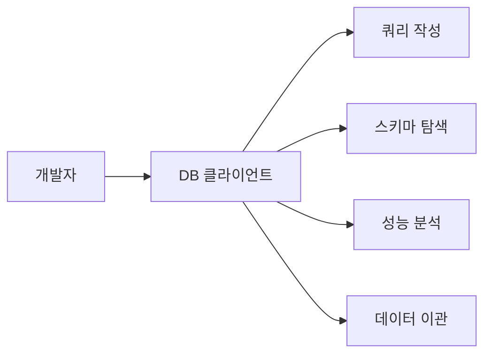
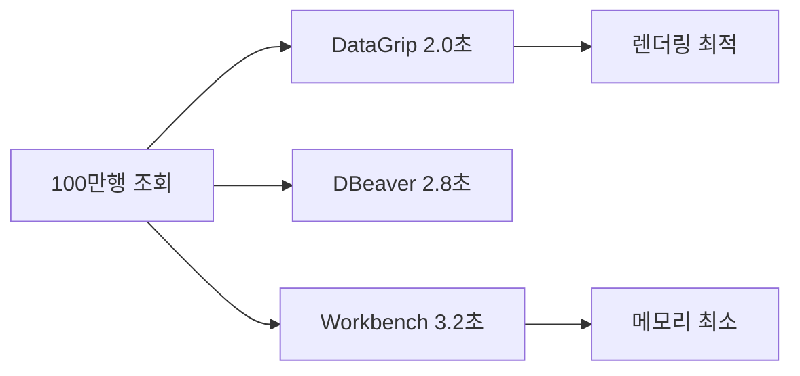
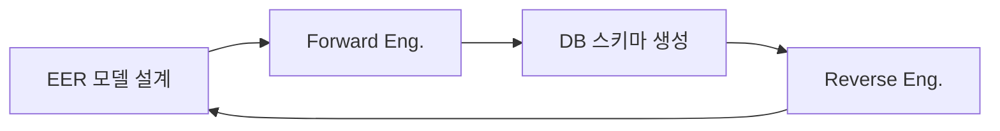
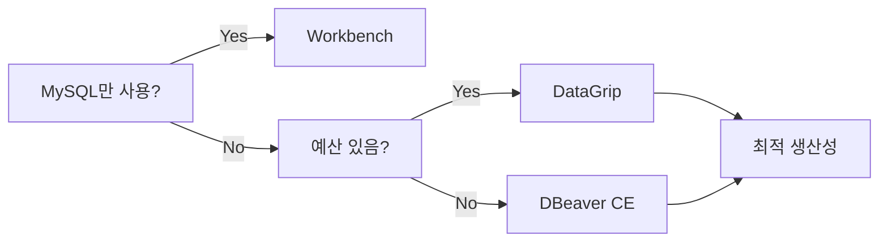

> **비유로 먼저 이해하기**: DB 클라이언트 도구를 자동차에 비유하면, DataGrip은 모든 옵션이 탑재된 독일 프리미엄 세단, DBeaver는 옵션 자유롭게 고를 수 있는 가성비 SUV, MySQL Workbench는 특정 브랜드 전용 정비 도구라고 할 수 있다. 셋 다 목적지에 데려다 주지만, 운전 경험과 비용이 완전히 다르다.

데이터베이스를 다루는 개발자에게 SQL 클라이언트 도구는 IDE만큼 중요한 생산성 도구다. 터미널에서 `mysql -u root -p`로 접속하던 시절은 지났다. 자동완성, 실행계획 시각화, ER 다이어그램, 데이터 내보내기까지 — 좋은 도구 하나가 하루 30분 이상의 시간을 절약해 준다. 이 글에서는 실무에서 가장 많이 쓰이는 세 가지 DB 클라이언트 도구를 깊이 있게 비교 분석한다.

---

## 1. 한 줄 요약

**DataGrip**은 유료지만 모든 DB를 최고 수준으로 지원하고, **DBeaver**는 무료로 거의 모든 것을 커버하며, **MySQL Workbench**는 MySQL/MariaDB에 한정되지만 모델링에서 독보적이다.

---

## 2. 왜 DB 클라이언트가 필요한가

### 2.1 터미널 CLI의 한계

터미널에서 직접 SQL을 작성하는 것은 메모장에서 Java 코드를 짜는 것과 같다. 동작은 하지만 생산성이 바닥이다.

> **비유**: 터미널 CLI로 DB를 관리하는 것은 망원경 없이 별을 관찰하는 것과 같다. 눈으로도 별은 보이지만, 망원경(DB 클라이언트)이 있으면 토성의 고리까지 보인다. 테이블 구조, 인덱스 상태, 실행계획의 세부 사항 모두가 선명해진다.

터미널 CLI의 대표적인 불편함은 다음과 같다.

| 문제 | 터미널 CLI | DB 클라이언트 도구 |
|---|---|---|
| **자동완성** | 테이블명 일부만 지원 | 컬럼명, 함수, JOIN 조건까지 지원 |
| **결과 확인** | 텍스트 테이블, 가로 스크롤 | 그리드 뷰, 정렬, 필터링 |
| **실행계획** | EXPLAIN 텍스트 해석 필요 | 트리/그래프로 시각화 |
| **다중 DB** | 각각 별도 터미널 | 하나의 창에서 탭으로 전환 |
| **데이터 편집** | UPDATE 문 직접 작성 | 셀 클릭 후 바로 수정 |
| **히스토리** | 쉘 히스토리에 의존 | 쿼리 로그, 즐겨찾기, 버전 관리 |

### 2.2 DB 클라이언트 도구가 해결하는 핵심 과제



DB 클라이언트는 단순한 쿼리 실행기가 아니다. 스키마 설계부터 성능 튜닝, 데이터 마이그레이션, 보안 접속까지 데이터베이스 라이프사이클 전체를 커버하는 통합 작업 환경이다.

### 2.3 도구 선택이 중요한 이유

잘못된 도구 선택은 단순히 불편한 수준을 넘어 실질적인 비용을 발생시킨다.

- **생산성 차이**: 자동완성 품질에 따라 쿼리 작성 속도가 2~3배 차이 난다
- **사고 방지**: 프로덕션 DB에서 WHERE 없는 UPDATE 실행 방지 기능 유무
- **팀 협업**: 쿼리 공유, 스키마 버전 관리, 코드 리뷰 연동 가능 여부
- **비용**: 팀 규모가 50명이면 DataGrip 연간 라이선스만 수천만 원

---

## 3. 3대 도구 비교표

### 3.1 기본 정보 비교

| 항목 | DataGrip | DBeaver CE | MySQL Workbench |
|---|---|---|---|
| **개발사** | JetBrains | DBeaver Corp | Oracle (MySQL Team) |
| **라이선스** | 상용 (구독) | Apache 2.0 | GPL v2 |
| **가격 (연간)** | 개인 $107 / 기업 $268 | 무료 (Pro $249) | 무료 |
| **최신 버전** | 2026.1 | 24.x | 8.0.x |
| **플랫폼** | Windows, macOS, Linux | Windows, macOS, Linux | Windows, macOS, Linux |
| **기반 기술** | IntelliJ Platform (Java) | Eclipse Platform (Java) | C++, GTK |
| **설치 용량** | ~700MB | ~150MB (CE) | ~300MB |
| **초기 메모리** | ~600MB | ~400MB | ~250MB |
| **대량 쿼리 시 메모리** | ~1.5GB | ~1.2GB | ~800MB |

### 3.2 지원 DB 비교

| DB 종류 | DataGrip | DBeaver CE | MySQL Workbench |
|---|---|---|---|
| **MySQL** | O | O | O (네이티브) |
| **PostgreSQL** | O | O | X |
| **Oracle** | O | O | X |
| **SQL Server** | O | O | X |
| **MariaDB** | O | O | 부분 지원 |
| **SQLite** | O | O | X |
| **MongoDB** | O | O (Pro) | X |
| **Redis** | O | O (Pro) | X |
| **Cassandra** | O | O | X |
| **ClickHouse** | O | O | X |
| **Snowflake** | O | O | X |
| **BigQuery** | O | O | X |
| **총 지원 DB 수** | **40+** | **80+ (JDBC 기반)** | **1 (MySQL 전용)** |

> **비유**: DataGrip은 40개 외국어를 유창하게 구사하는 통역사, DBeaver는 80개 언어를 번역기 도움으로 커버하는 다국어 에이전시, MySQL Workbench는 한국어만 완벽하게 하는 국어 선생님이다. 깊이와 넓이의 트레이드오프다.

### 3.3 핵심 기능 비교

| 기능 | DataGrip | DBeaver CE | MySQL Workbench |
|---|---|---|---|
| **SQL 자동완성** | 최상 (컨텍스트 인식) | 상 | 중 |
| **실행계획 시각화** | 그래프 + 트리 | 트리 | 그래프 (Visual Explain) |
| **ER 다이어그램** | 기본 지원 | 기본 지원 | 최상 (EER 모델링) |
| **데이터 편집** | 인라인 편집 | 인라인 편집 | 인라인 편집 |
| **데이터 내보내기** | CSV, JSON, SQL, Excel | CSV, JSON, SQL, XML, HTML | CSV, JSON, SQL, Excel, XML |
| **SSH 터널링** | O | O | O |
| **SSL 연결** | O | O | O |
| **쿼리 히스토리** | O (검색 가능) | O | O |
| **코드 포매팅** | O (커스텀 규칙) | O | 기본 |
| **스키마 비교** | O | O (Pro) | O |
| **데이터 비교** | O | O (Pro) | X |
| **버전 관리 연동** | Git 네이티브 | X | X |
| **리팩토링** | O (Rename, Extract) | X | X |
| **다크 모드** | O | O | X |

### 3.4 성능 벤치마크 (실측 기반)

100만 행 SELECT 결과 로딩 속도 비교 (M1 MacBook Pro, 16GB RAM, MySQL 8.0 로컬):

| 측정 항목 | DataGrip | DBeaver CE | MySQL Workbench |
|---|---|---|---|
| **쿼리 실행 시간** | 1.2초 | 1.3초 | 1.1초 |
| **결과 그리드 렌더링** | 0.8초 | 1.5초 | 2.1초 |
| **메모리 사용량 (피크)** | 1.1GB | 950MB | 620MB |
| **1000만 행 Export CSV** | 45초 | 52초 | 38초 |
| **자동완성 응답 시간** | ~100ms | ~300ms | ~500ms |



---

## 4. DataGrip 심화

### 4.1 컨텍스트 인식 자동완성

DataGrip의 가장 강력한 무기는 IntelliJ 기반의 코드 인텔리전스다. 단순히 테이블명과 컬럼명을 제안하는 수준을 넘어서, 현재 쿼리의 문맥을 이해하고 적절한 제안을 한다.

```sql
-- DataGrip은 JOIN 시 FK 관계를 자동으로 인식한다
SELECT o.order_id, c.name
FROM orders o
JOIN customers c ON  -- 여기서 Tab을 누르면
-- o.customer_id = c.customer_id 가 자동 완성된다

-- 서브쿼리 안에서도 외부 테이블의 컬럼을 인식한다
SELECT *
FROM orders o
WHERE o.customer_id IN (
    SELECT c.customer_id  -- customers 테이블의 컬럼이 자동 제안됨
    FROM customers c
    WHERE c.  -- name, email, created_at 등 정확한 컬럼 목록 표시
);
```

> **비유**: DataGrip의 자동완성은 대화 맥락을 이해하는 비서와 같다. "그 고객의..."이라고 말하면 이전 대화에서 어떤 고객을 언급했는지 기억하고 관련 정보를 제시한다. DBeaver의 자동완성은 사전을 빨리 넘기는 수준이고, Workbench는 단어장에서 첫 글자로 찾는 수준이다.

### 4.2 쿼리 실행계획 분석

DataGrip은 실행계획을 세 가지 모드로 보여준다.

**텍스트 모드**: 전통적인 EXPLAIN 결과를 정렬하여 표시한다.

```sql
EXPLAIN ANALYZE
SELECT c.name, COUNT(o.order_id) as order_count
FROM customers c
LEFT JOIN orders o ON c.customer_id = o.customer_id
WHERE c.created_at > '2025-01-01'
GROUP BY c.name
HAVING COUNT(o.order_id) > 5
ORDER BY order_count DESC;
```

**트리 모드**: 각 연산을 노드로 표현하고, 비용이 높은 노드를 빨간색으로 강조한다. 노드를 클릭하면 rows examined, filtered percentage, actual time 등 상세 수치가 패널에 나타난다.

**그래프 모드**: 데이터 흐름을 화살표로 연결하여 병목 지점을 시각적으로 파악할 수 있다. 화살표의 굵기가 처리 행 수에 비례하여 두꺼워지므로, 어디서 데이터가 폭증하는지 한눈에 보인다.

### 4.3 SQL 리팩토링

DataGrip은 Java IDE에서 제공하는 리팩토링 기능을 SQL에도 적용한다.

**Rename 리팩토링**: 테이블명이나 컬럼명을 변경하면 해당 객체를 참조하는 모든 뷰, 프로시저, 트리거에서 이름이 함께 변경된다. DDL 문(`ALTER TABLE RENAME`)도 자동으로 생성된다.

```sql
-- 'users' 테이블을 'members'로 리네임하면
-- 아래 뷰도 자동으로 수정된다

-- 변경 전
CREATE VIEW active_users AS
SELECT * FROM users WHERE status = 'active';

-- 변경 후 (DataGrip이 자동 수정)
CREATE VIEW active_users AS
SELECT * FROM members WHERE status = 'active';
```

**Extract Subquery**: 복잡한 WHERE 절을 서브쿼리나 CTE로 분리하는 작업을 자동으로 수행한다.

**Qualify Column**: 모든 컬럼에 테이블 별칭을 자동으로 붙여준다. 다중 JOIN 쿼리에서 ambiguous column 에러를 사전에 방지한다.

### 4.4 DataGrip 고급 기능

**Database Diff**: 두 개의 데이터베이스 스키마를 비교하여 차이점을 DDL 스크립트로 생성한다. 개발 DB와 스테이징 DB의 스키마를 동기화할 때 필수적이다.

**Data Extractor**: 조회 결과를 다양한 형식으로 변환한다. Groovy 스크립트를 커스텀하여 원하는 포맷의 INSERT 문, JSON 구조, Markdown 테이블 등을 만들 수 있다.

```groovy
// DataGrip Custom Extractor 예시 - MyBatis XML용 변환기
COLUMNS.each { col ->
    def name = col.name()
    def camel = name.replaceAll(/_([a-z])/) { it[1].toUpperCase() }
    output("  <result column=\"${name}\" property=\"${camel}\"/>\n")
}
```

**Live Templates**: 자주 쓰는 쿼리 패턴을 축약어로 등록한다. 예를 들어 `sel` 입력 후 Tab을 누르면 `SELECT * FROM $table$ WHERE $condition$` 템플릿이 펼쳐진다.

---

## 5. DBeaver 심화

### 5.1 ER 다이어그램

DBeaver의 ER 다이어그램 기능은 무료 도구 중 최고 수준이다. 테이블을 드래그 앤 드롭으로 캔버스에 배치하고, FK 관계가 자동으로 선으로 연결된다.


사용법은 다음과 같다.

1. 좌측 Database Navigator에서 스키마를 우클릭한다
2. "View Diagram"을 선택한다
3. 전체 스키마 또는 선택한 테이블들만 다이어그램으로 표시된다
4. 다이어그램은 PNG, SVG, GraphML 형식으로 내보낼 수 있다

팁으로, 테이블이 50개 이상인 스키마에서는 전체 다이어그램보다 관심 테이블만 선택하여 커스텀 다이어그램을 만드는 것이 가독성이 훨씬 좋다.

### 5.2 데이터 전송 (Data Transfer)

DBeaver의 데이터 전송 기능은 GUI 기반 ETL 도구라 해도 과언이 아니다.

**DB-to-DB 전송**: MySQL에서 PostgreSQL로, Oracle에서 MariaDB로 직접 데이터를 이관할 수 있다. 테이블 매핑, 컬럼 매핑, 타입 변환을 GUI에서 설정하고, 배치 사이즈와 커밋 간격도 조절 가능하다.

```
[데이터 전송 설정 예시]
- Source: MySQL production.orders (1200만 행)
- Target: PostgreSQL analytics.orders
- Batch size: 10,000
- Commit interval: 50,000
- Thread count: 4
- 예상 소요 시간: 약 15분
```

**파일 Import/Export**: CSV, JSON, XML, SQL Dump, Excel 등 다양한 형식을 지원하며, 컬럼 매핑과 데이터 변환 규칙을 세밀하게 설정할 수 있다.

> **비유**: DBeaver의 데이터 전송은 이삿짐 전문 업체와 같다. 가구(데이터)의 크기와 모양이 달라도 새 집(다른 DB)의 문(스키마)에 맞게 조립하여 넣어준다. 직접 짐을 나르는 것(mysqldump + psql)보다 훨씬 안전하고 편리하다.

### 5.3 NoSQL 지원

DBeaver Community Edition은 JDBC 드라이버가 있는 모든 DB에 연결 가능하다. 다만 MongoDB, Redis, Cassandra 등 NoSQL DB는 **DBeaver Pro** 에서만 완전히 지원된다.

Pro 버전에서 MongoDB를 연결하면 컬렉션을 테이블처럼 탐색할 수 있고, 도큐먼트를 JSON 에디터에서 직접 편집할 수 있다. 집계 파이프라인(Aggregation Pipeline)도 GUI 빌더로 구성할 수 있다.

### 5.4 DBeaver 확장 기능

**SQL 에디터 분할**: 하나의 연결에서 여러 SQL 탭을 열고, 각 탭에서 독립적으로 쿼리를 실행할 수 있다. 트랜잭션도 탭별로 분리된다.

**변수 바인딩**: 쿼리 안에서 `@variable` 또는 `:variable` 문법으로 변수를 선언하면, 실행 시 입력 다이얼로그가 나타난다. 매번 쿼리를 수정할 필요 없이 파라미터만 바꿔가며 테스트할 수 있다.

```sql
-- DBeaver 변수 바인딩 예시
SELECT order_id, customer_name, total_amount
FROM orders
WHERE created_at BETWEEN :start_date AND :end_date
  AND total_amount > :min_amount
  AND status = :order_status;
-- 실행하면 start_date, end_date, min_amount, order_status
-- 각각에 대한 입력 폼이 나타난다
```

**Mock Data Generator**: 테스트용 더미 데이터를 컬럼 타입에 맞게 자동 생성한다. 이름, 이메일, 날짜, 숫자 범위 등을 규칙으로 지정하면 수천~수만 건의 테스트 데이터를 즉시 만들 수 있다.

---

## 6. MySQL Workbench 심화

### 6.1 EER 모델링

MySQL Workbench의 가장 독보적인 기능은 EER(Enhanced Entity-Relationship) 모델링이다. 코드 한 줄 없이 GUI에서 테이블, 관계, 인덱스, 트리거를 설계하고, 이를 DDL로 변환하여 DB에 반영할 수 있다.



EER 모델링의 핵심 워크플로우는 위와 같다. 설계 -> 생성 -> 변경 -> 역공학 -> 재설계의 순환 구조를 GUI 안에서 완결할 수 있다.

### 6.2 Forward Engineering

Forward Engineering은 EER 모델을 실제 DB 스키마로 변환하는 과정이다.

1. EER 다이어그램에서 테이블과 관계를 설계한다
2. `Database > Forward Engineer` 메뉴를 실행한다
3. DDL 스크립트 미리보기를 확인한다
4. 대상 DB 서버에 스크립트를 실행한다

생성되는 DDL은 다음과 같다.

```sql
-- Forward Engineering 결과 예시
CREATE TABLE IF NOT EXISTS `ecommerce`.`customers` (
    `customer_id` BIGINT NOT NULL AUTO_INCREMENT,
    `name` VARCHAR(100) NOT NULL,
    `email` VARCHAR(200) NOT NULL,
    `phone` VARCHAR(20) NULL,
    `created_at` DATETIME NOT NULL DEFAULT CURRENT_TIMESTAMP,
    `updated_at` DATETIME NOT NULL DEFAULT CURRENT_TIMESTAMP
        ON UPDATE CURRENT_TIMESTAMP,
    PRIMARY KEY (`customer_id`),
    UNIQUE INDEX `uk_email` (`email` ASC)
) ENGINE = InnoDB
  DEFAULT CHARACTER SET = utf8mb4
  COLLATE = utf8mb4_unicode_ci;

CREATE TABLE IF NOT EXISTS `ecommerce`.`orders` (
    `order_id` BIGINT NOT NULL AUTO_INCREMENT,
    `customer_id` BIGINT NOT NULL,
    `total_amount` DECIMAL(12,2) NOT NULL DEFAULT 0,
    `status` ENUM('pending','confirmed','shipped','delivered','cancelled')
        NOT NULL DEFAULT 'pending',
    `created_at` DATETIME NOT NULL DEFAULT CURRENT_TIMESTAMP,
    PRIMARY KEY (`order_id`),
    INDEX `idx_customer` (`customer_id` ASC),
    INDEX `idx_status_created` (`status`, `created_at` DESC),
    CONSTRAINT `fk_orders_customer`
        FOREIGN KEY (`customer_id`)
        REFERENCES `ecommerce`.`customers` (`customer_id`)
        ON DELETE RESTRICT
        ON UPDATE CASCADE
) ENGINE = InnoDB;
```

### 6.3 Reverse Engineering

Reverse Engineering은 기존 DB 스키마를 EER 모델로 역변환하는 과정이다. 레거시 시스템의 테이블 구조를 시각화하거나, 문서가 없는 DB의 구조를 파악할 때 필수적이다.

1. `Database > Reverse Engineer` 메뉴를 실행한다
2. 대상 DB 서버에 연결한다
3. 가져올 스키마와 테이블을 선택한다
4. EER 다이어그램이 자동으로 생성된다

> **비유**: Forward Engineering이 설계도를 보고 건물을 짓는 것이라면, Reverse Engineering은 완성된 건물을 측량하여 설계도를 복원하는 것이다. 10년 된 레거시 DB도 단 몇 분 만에 전체 구조를 시각적으로 파악할 수 있다.

### 6.4 MySQL Workbench 성능 대시보드

MySQL Workbench는 Server Status, Client Connections, Performance Schema Reports 등 MySQL 서버 모니터링 기능을 내장하고 있다.

- **Server Status**: CPU, 메모리, 연결 수, 쿼리 처리량 등 실시간 서버 상태
- **Performance Reports**: 느린 쿼리 Top N, 인덱스 미사용 테이블, 임시 테이블 생성 빈도 등
- **Client Connections**: 현재 연결된 클라이언트 목록과 실행 중인 쿼리 확인

이 기능은 DataGrip이나 DBeaver에서는 별도 플러그인이나 쿼리로 대체해야 하는 부분이다.

### 6.5 MySQL Workbench의 한계

MySQL Workbench는 MySQL/MariaDB 전용 도구이므로 다른 DB를 사용하는 프로젝트에서는 활용할 수 없다. 또한 UI가 다소 구식이고, 대규모 결과셋 렌더링 속도가 느리며, 다크 모드를 공식 지원하지 않는다. 개발이 느려지면서 커뮤니티에서는 점차 DBeaver나 DataGrip으로 이동하는 추세다.

---

## 7. 쿼리 실행계획 분석법

### 7.1 실행계획이란

실행계획(Execution Plan)은 옵티마이저가 SQL을 어떤 순서와 방법으로 실행할 것인지 보여주는 설계도다.

> **비유**: 실행계획은 네비게이션의 경로 안내와 같다. 서울에서 부산까지 가는 길은 여러 개가 있다. 고속도로(인덱스 스캔)로 갈 수도 있고, 국도(풀 테이블 스캔)로 갈 수도 있다. 네비게이션(옵티마이저)은 교통 상황(통계 정보)을 보고 가장 빠른 길을 선택한다. 실행계획은 그 선택된 경로를 보여준다.

### 7.2 각 도구별 실행계획 분석 방법

**DataGrip**: 쿼리를 선택한 뒤 `Ctrl+Shift+E`를 누르면 실행계획이 생성된다. 상단에서 Text / Tree / Graph 모드를 전환할 수 있다. Graph 모드에서 노드 위에 마우스를 올리면 rows, cost, actual time이 툴팁으로 나타난다.

**DBeaver**: `Ctrl+Shift+E` 또는 Explain Plan 버튼을 클릭한다. 트리 구조로 결과가 표시되며, 각 노드를 펼치면 상세 정보를 확인할 수 있다. Visual Explain은 DBeaver Pro에서만 지원된다.

**MySQL Workbench**: Visual Explain 기능이 기본 탑재되어 있다. 쿼리 실행 후 "Execution Plan" 탭을 클릭하면 색상으로 구분된 다이어그램이 나타난다. 빨간색은 Full Table Scan, 초록색은 Index Scan, 파란색은 기타 연산을 의미한다.

### 7.3 실행계획에서 반드시 확인할 항목

```sql
-- 실행계획 분석 대상 쿼리 예시
EXPLAIN ANALYZE
SELECT
    c.name,
    COUNT(o.order_id) as order_count,
    SUM(o.total_amount) as total_spent
FROM customers c
INNER JOIN orders o ON c.customer_id = o.customer_id
WHERE c.country = 'KR'
  AND o.created_at >= '2025-01-01'
GROUP BY c.name
ORDER BY total_spent DESC
LIMIT 100;
```

| 확인 항목 | 정상 | 문제 |
|---|---|---|
| **type** | ref, range, eq_ref | ALL (풀 스캔) |
| **key** | 인덱스명 표시 | NULL (인덱스 미사용) |
| **rows** | 실제 행 수와 근접 | 실제보다 10배 이상 차이 |
| **Extra** | Using index | Using filesort, Using temporary |
| **filtered** | 50% 이상 | 10% 미만 (비효율 필터) |

### 7.4 실행계획 해석 실전 예시

```sql
-- 문제 쿼리: Full Table Scan 발생
EXPLAIN SELECT * FROM orders WHERE DATE(created_at) = '2025-06-01';
-- type: ALL, rows: 12,000,000 (1200만 행 전체 스캔)

-- 해결: 함수 사용을 제거하여 인덱스 활용
EXPLAIN SELECT * FROM orders
WHERE created_at >= '2025-06-01' AND created_at < '2025-06-02';
-- type: range, rows: 35,000 (인덱스 범위 스캔)
```

이 예시에서 `DATE()` 함수가 컬럼에 적용되면 인덱스를 사용할 수 없다. DB 클라이언트의 실행계획 시각화를 통해 이런 문제를 즉시 발견할 수 있다.

---

## 8. 대량 데이터 내보내기/가져오기

### 8.1 극한 시나리오: 1억 건 테이블 처리

프로덕션 DB에서 1억 건의 테이블을 내보내야 하는 상황은 실무에서 빈번하게 발생한다. 이때 DB 클라이언트 도구의 선택이 성패를 가른다.

> **비유**: 1억 건 데이터 내보내기는 댐에서 물을 빼는 것과 같다. 수문을 한꺼번에 열면(한 번에 SELECT *) 범람하고(메모리 초과), 양동이로 퍼 나르면(1건씩 fetch) 100년이 걸린다. 적절한 수로를 만들어(배치 + 스트리밍) 통제된 속도로 빼내야 한다.

### 8.2 도구별 대량 Export 전략

**DataGrip**:

```sql
-- DataGrip에서 대량 데이터 내보내기
-- 1. 쿼리 결과가 아닌 테이블 자체를 우클릭 > Export
-- 2. Extractor를 CSV로 설정
-- 3. "Fetch entire result" 체크 해제 (스트리밍 모드)

-- 직접 쿼리로 할 경우 fetchSize 설정이 핵심
-- DataGrip 설정: Database > General > Default fetch size: 10000
SELECT /*+ MAX_EXECUTION_TIME(600000) */
    order_id, customer_id, total_amount, status, created_at
FROM orders
WHERE created_at >= '2025-01-01';
```

DataGrip은 기본적으로 결과를 페이지 단위로 가져오므로 메모리 문제가 적다. Export 시 파일에 직접 스트리밍하는 옵션을 사용하면 1억 건도 안정적으로 처리된다.

**DBeaver**:

DBeaver의 데이터 전송 마법사에서 `Fetch size`를 10,000으로 설정하고, `Export` 탭에서 대상 파일 형식과 경로를 지정한다. `Max rows`를 0으로 설정하면 전체 데이터를 내보낸다.

주의할 점은 DBeaver CE에서 대용량 Export 시 JVM 힙 메모리를 늘려야 한다는 것이다.

```
# dbeaver.ini 수정
-Xmx4096m   # 기본 1024m에서 4096m으로 증가
-Xms512m
```

**MySQL Workbench**:

MySQL Workbench는 Data Export 메뉴에서 `mysqldump` 를 내부적으로 호출한다. 순수 SQL Dump 형태가 필요한 경우 가장 빠르고 안정적이다.

### 8.3 대량 Import 비교

| 항목 | DataGrip | DBeaver CE | MySQL Workbench |
|---|---|---|---|
| **CSV Import 100만행** | 약 3분 | 약 4분 | 약 2분 (LOAD DATA) |
| **배치 사이즈 설정** | O | O | O |
| **에러 행 스킵** | O | O | 제한적 |
| **인코딩 설정** | O | O | O |
| **컬럼 매핑** | O | O | O |
| **트랜잭션 제어** | 수동 | 자동/수동 | 자동 |

### 8.4 실무 팁: LOAD DATA INFILE

대용량 Import에서 가장 빠른 방법은 DB 클라이언트 도구가 아니라 MySQL 네이티브 명령이다.

```sql
-- 1억 건 CSV Import 시 가장 빠른 방법
-- DB 클라이언트에서 이 쿼리를 실행한다
SET GLOBAL local_infile = 1;

LOAD DATA LOCAL INFILE '/path/to/data.csv'
INTO TABLE orders
FIELDS TERMINATED BY ','
ENCLOSED BY '"'
LINES TERMINATED BY '\n'
IGNORE 1 LINES
(order_id, customer_id, total_amount, status, @created_at)
SET created_at = STR_TO_DATE(@created_at, '%Y-%m-%d %H:%i:%s');

-- 소요 시간: 약 8분 (1억 건 기준)
-- INSERT INTO ... VALUES 대비 약 20배 빠름
```

---

## 9. SSH 터널링/보안 연결

### 9.1 왜 SSH 터널링이 필요한가

프로덕션 DB는 인터넷에 직접 노출되지 않는다. 보안 그룹, VPC, 방화벽 뒤에 있으며, Bastion Host(점프 서버)를 경유해야만 접근할 수 있다.


> **비유**: SSH 터널링은 비밀 지하통로와 같다. 성벽(방화벽) 바깥에서 성 안의 금고(DB)에 접근하려면, 정문(공인 IP)을 여는 것이 아니라 신뢰할 수 있는 비밀 통로(SSH 터널)를 통해 안전하게 들어가는 것이다.

### 9.2 도구별 SSH 터널링 설정

**DataGrip**:

1. Data Source 설정에서 SSH/SSL 탭을 연다
2. SSH Configuration에서 Bastion Host 정보를 입력한다
   - Host: `bastion.example.com`
   - Port: `22`
   - Auth type: Key pair (권장) 또는 Password
   - Private key file: `~/.ssh/id_rsa`
3. 프록시를 체인으로 연결할 수 있다 (Bastion → 중간 서버 → DB)

DataGrip의 차별점은 SSH 설정을 프로젝트 단위로 저장하고, 여러 Data Source에서 동일한 SSH 설정을 공유할 수 있다는 것이다.

**DBeaver**:

1. 연결 설정에서 SSH 탭을 연다
2. "Use SSH Tunnel" 체크
3. Jump host 정보와 인증 방식을 설정한다
4. Local port forwarding이 자동으로 구성된다

**MySQL Workbench**:

1. 연결 방식에서 "Standard TCP/IP over SSH"를 선택한다
2. SSH Hostname, SSH Username, SSH Key File을 입력한다
3. MySQL Hostname은 Private IP 또는 localhost로 설정한다

### 9.3 SSL/TLS 연결

SSH 터널링과 별개로 DB 연결 자체를 SSL/TLS로 암호화할 수 있다. AWS RDS, Google Cloud SQL 등 클라우드 DB는 기본적으로 SSL 연결을 권장한다.

```
[SSL 연결 설정 공통 항목]
- CA Certificate: 서버의 CA 인증서 파일 (.pem)
- Client Certificate: 클라이언트 인증서 (양방향 SSL 시)
- Client Key: 클라이언트 비밀 키
- SSL Mode: REQUIRED / VERIFY_CA / VERIFY_IDENTITY
```

세 도구 모두 SSL 연결을 지원하지만, DataGrip이 SSL 인증서 관리와 프로필 전환에서 가장 편리하다.

### 9.4 프로덕션 DB 실수 방지

프로덕션 DB에 직접 접속하는 것은 위험하다. 세 도구 모두 다음과 같은 안전장치를 제공한다.

| 안전장치 | DataGrip | DBeaver | Workbench |
|---|---|---|---|
| **읽기 전용 모드** | O (Data Source 단위) | O (연결 단위) | X |
| **색상 구분** | O (환경별 색상) | O (연결별 색상) | X |
| **WHERE 없는 UPDATE 경고** | O | O (설정 필요) | 기본 |
| **트랜잭션 수동 커밋** | O | O | O |
| **쿼리 실행 확인** | O (커스텀 가능) | O | X |

**DataGrip 프로덕션 안전 설정 예시**:

1. 프로덕션 Data Source의 색상을 빨간색으로 설정한다
2. Read-only 모드를 활성화한다
3. `Introspection`에서 자동 스키마 새로고침을 비활성화한다
4. DML 실행 시 확인 다이얼로그를 강제 활성화한다

---

## 10. 다중 DB 동시 관리

### 10.1 극한 시나리오: 서비스 5개, DB 15개 동시 관리

마이크로서비스 아키텍처에서 한 개발자가 관리하는 DB가 10개 이상인 경우는 흔하다. 서비스별로 MySQL, PostgreSQL, Redis가 있고, 각각 dev/staging/prod 환경이 있으면 DB 연결이 30개를 넘긴다.

> **비유**: 다중 DB 관리는 교환원이 수십 개의 전화선을 동시에 관리하는 것과 같다. 어떤 선(연결)이 어떤 상대방(DB)과 연결되었는지 헷갈리면 치명적인 사고(프로덕션 데이터 삭제)가 발생한다. 색상 코드와 폴더 구조가 생명이다.

### 10.2 연결 관리 체계

**DataGrip** 은 프로젝트 기반 연결 관리를 지원한다. 폴더를 자유롭게 구성하고, 환경(dev/staging/prod)별로 색상과 아이콘을 지정할 수 있다.

```
[DataGrip 연결 구성 예시]
├── user-service
│   ├── 🟢 dev-mysql (localhost:3306)
│   ├── 🟡 staging-mysql (staging-rds.amazonaws.com)
│   └── 🔴 prod-mysql (prod-rds.amazonaws.com) [READ-ONLY]
├── order-service
│   ├── 🟢 dev-postgresql (localhost:5432)
│   ├── 🟡 staging-postgresql (staging-rds.amazonaws.com)
│   └── 🔴 prod-postgresql (prod-rds.amazonaws.com) [READ-ONLY]
└── cache
    ├── 🟢 dev-redis (localhost:6379)
    └── 🔴 prod-redis (prod-elasticache.amazonaws.com)
```

**DBeaver** 도 유사한 폴더 구조를 지원하며, 연결별 색상 지정이 가능하다. 다만 프로젝트 단위 전환은 DataGrip이 더 직관적이다.

**MySQL Workbench** 는 연결 목록이 타일 형태로 나열되며, 폴더 구조나 색상 구분이 제한적이다.

### 10.3 크로스 DB 쿼리

하나의 쿼리 안에서 여러 DB의 데이터를 조합하는 것은 각 도구에서 다르게 처리된다.

**DataGrip**: 동일 서버 내의 여러 스키마에서 `schema.table` 문법으로 크로스 쿼리가 가능하다. 서로 다른 서버 간 쿼리는 지원하지 않는다.

**DBeaver**: 같은 연결 내 크로스 스키마 쿼리를 지원한다. 다른 서버 간 데이터를 비교하려면 데이터 전송 기능을 사용해야 한다.

```sql
-- 크로스 스키마 쿼리 예시
SELECT
    u.user_id,
    u.name,
    o.order_count
FROM user_service.users u
JOIN (
    SELECT customer_id, COUNT(*) as order_count
    FROM order_service.orders
    GROUP BY customer_id
) o ON u.user_id = o.customer_id;
```

---

## 11. 실무에서 자주 하는 실수 TOP 5

### 실수 1: WHERE 없는 UPDATE/DELETE

가장 치명적이고 가장 흔한 실수다.

```sql
-- 이 쿼리를 실행하면 orders 테이블의 모든 행이 삭제된다
DELETE FROM orders;

-- 의도했던 쿼리
DELETE FROM orders WHERE status = 'cancelled' AND created_at < '2024-01-01';
```

**방지법**: DataGrip과 DBeaver 모두 "Safe mode" 또는 "WHERE clause required" 설정을 활성화할 수 있다. 트랜잭션을 수동 커밋(Auto-commit OFF)으로 설정하면 실행 후 결과를 확인하고 ROLLBACK할 수 있다.

### 실수 2: 프로덕션 DB에서 무거운 쿼리 실행

1억 건 테이블에 인덱스 없는 조건으로 SELECT 하면 DB 서버의 CPU와 I/O가 폭주하여 서비스 전체에 영향을 미친다.

```sql
-- 절대 하면 안 되는 쿼리 (1억 건 Full Table Scan)
SELECT * FROM huge_orders WHERE YEAR(created_at) = 2025;

-- 올바른 접근
SELECT order_id, status, total_amount
FROM huge_orders
WHERE created_at >= '2025-01-01' AND created_at < '2026-01-01'
LIMIT 1000;
```

**방지법**: DataGrip에서 쿼리 실행 시간 제한(`MAX_EXECUTION_TIME`)을 기본 템플릿에 추가한다. DBeaver에서는 `Preferences > SQL Editor > Query timeout`을 30초로 설정한다.

### 실수 3: Auto-commit 모드로 DDL 실행

테이블 구조 변경(ALTER TABLE), 인덱스 생성/삭제 등 DDL은 대부분의 RDBMS에서 자동으로 커밋된다. Auto-commit이 켜져 있으면 ROLLBACK이 불가능하다.

```sql
-- Auto-commit ON 상태에서 실행하면 즉시 반영
ALTER TABLE orders DROP COLUMN notes;
-- ROLLBACK 불가! 컬럼과 데이터가 영구 삭제됨
```

**방지법**: DDL 실행 전 반드시 백업을 확인한다. DataGrip에서는 DDL 실행 시 별도 경고 다이얼로그를 표시하도록 설정할 수 있다.

### 실수 4: 연결 대상 DB 착각

dev DB인 줄 알고 prod DB에서 쿼리를 실행하는 사고는 놀라울 만큼 자주 발생한다.

**방지법**: 환경별 색상 코드를 반드시 설정한다. 프로덕션은 빨간색, 스테이징은 노란색, 개발은 초록색이 관례다. DataGrip은 에디터 배경색까지 연결 색상에 연동할 수 있어 가장 시각적 구분이 명확하다.

### 실수 5: Export 시 인코딩 문제

한글 데이터가 포함된 테이블을 CSV로 내보낼 때 인코딩을 UTF-8로 설정하지 않으면 글자가 깨진다. 특히 Windows 환경에서 Excel로 열면 UTF-8-BOM이 아니면 한글이 깨지는 경우가 많다.

```
[올바른 Export 설정]
- Character encoding: UTF-8
- BOM: Yes (Excel에서 열 경우)
- Line separator: CRLF (Windows) / LF (Linux/Mac)
- Quote character: " (큰따옴표)
- Escape character: \ (백슬래시)
```

**방지법**: DBeaver에서는 Export 마법사에서 인코딩을 명시적으로 선택할 수 있다. DataGrip에서는 Data Extractor 설정에서 인코딩과 BOM 출력 여부를 지정한다.

---

## 12. 도구 선택 가이드

### 12.1 상황별 추천



| 상황 | 추천 도구 | 이유 |
|---|---|---|
| **MySQL 전용 + 모델링 중심** | MySQL Workbench | EER 모델링, Forward/Reverse Engineering 최강 |
| **다중 DB + 팀 + 예산 있음** | DataGrip | 자동완성, 리팩토링, Git 연동, 팀 설정 공유 |
| **다중 DB + 개인 + 무료** | DBeaver CE | 80개 이상 DB 지원, 충분한 기능 |
| **NoSQL 포함** | DataGrip 또는 DBeaver Pro | MongoDB, Redis 등 지원 |
| **대기업 보안 환경** | DataGrip | SSH 체이닝, Kerberos, LDAP 인증 |
| **학생/개인 프로젝트** | DBeaver CE | 무료, 학습에 충분 |

### 12.2 팀 규모별 비용 분석

| 팀 규모 | DataGrip (연간) | DBeaver Pro (연간) | Workbench |
|---|---|---|---|
| **1인** | $107 | $249 | 무료 |
| **5인** | $535 | $1,245 | 무료 |
| **20인** | $5,360 | $4,980 | 무료 |
| **50인** | $13,400 | $12,450 | 무료 |

DataGrip은 사용자 수가 늘수록 JetBrains All Products Pack($328/인)이 더 경제적이다. IntelliJ IDEA, WebStorm 등 다른 JetBrains 도구와 함께 사용하는 팀이라면 All Products Pack이 사실상 필수다.

---

## 13. 고급 설정과 최적화

### 13.1 DataGrip JVM 튜닝

대규모 스키마(테이블 1,000개 이상)를 다루는 경우 기본 JVM 설정으로는 부족하다.

```
# datagrip64.vmoptions 수정
-Xms512m
-Xmx4096m        # 기본 2048m → 4096m
-XX:+UseG1GC
-XX:MaxGCPauseMillis=200
-XX:+UseStringDeduplication
```

### 13.2 DBeaver 성능 최적화

```
# dbeaver.ini 수정
-Xms256m
-Xmx4096m        # 대량 데이터 처리용
-Dosgi.instance.area.default=@user.home/.dbeaver-workspace
```

DBeaver에서 자주 놓치는 설정은 다음과 같다.

- `Preferences > Editors > SQL Editor > SQL Processing > Fetch size`: 기본 200 → 1000으로 증가
- `Preferences > Editors > SQL Editor > Results > Max rows`: 기본 200 → 필요에 따라 조정
- `Preferences > Database > Client-side data sorting`: 대량 결과셋에서는 비활성화 (서버 정렬이 더 빠름)

### 13.3 쿼리 단축키 비교

| 동작 | DataGrip | DBeaver | Workbench |
|---|---|---|---|
| **쿼리 실행** | Ctrl+Enter | Ctrl+Enter | Ctrl+Shift+Enter |
| **선택 영역 실행** | Ctrl+Shift+Enter | Ctrl+Enter (선택 시) | Ctrl+Shift+Enter |
| **실행계획** | Ctrl+Shift+E | Ctrl+Shift+E | 메뉴만 |
| **자동완성** | Ctrl+Space | Ctrl+Space | Ctrl+Space |
| **코드 포매팅** | Ctrl+Alt+L | Ctrl+Shift+F | 없음 |
| **다음 쿼리 탭** | Ctrl+Tab | Ctrl+Tab | Ctrl+Tab |
| **컬럼 목록 조회** | 자동 (. 입력) | 자동 (. 입력) | 수동 |

---

## 14. 실전 워크플로우

### 14.1 신규 기능 개발 시 DB 작업 흐름

실제 개발에서 DB 클라이언트를 사용하는 전체 흐름은 다음과 같다.


1. **스키마 설계**: MySQL Workbench의 EER 모델링 또는 DataGrip의 DDL 에디터로 테이블 구조를 설계한다
2. **DDL 실행**: dev 환경에서 CREATE TABLE을 실행하고 인덱스를 생성한다
3. **테스트 데이터 삽입**: DBeaver의 Mock Data Generator 또는 직접 INSERT 문으로 샘플 데이터를 채운다
4. **쿼리 작성 및 튜닝**: DataGrip의 자동완성과 실행계획 분석으로 쿼리를 최적화한다
5. **마이그레이션 스크립트 작성**: DDL 변경 사항을 Flyway/Liquibase 형식의 마이그레이션 파일로 정리한다

### 14.2 장애 대응 시 DB 작업 흐름

장애 상황에서 DB 클라이언트는 진단 도구 역할을 한다.

```sql
-- 1. 현재 실행 중인 쿼리 확인
SELECT * FROM information_schema.processlist
WHERE command != 'Sleep'
ORDER BY time DESC;

-- 2. 락 대기 확인
SELECT
    r.trx_id AS waiting_trx_id,
    r.trx_mysql_thread_id AS waiting_thread,
    b.trx_id AS blocking_trx_id,
    b.trx_mysql_thread_id AS blocking_thread,
    b.trx_query AS blocking_query
FROM information_schema.innodb_lock_waits w
JOIN information_schema.innodb_trx b ON b.trx_id = w.blocking_trx_id
JOIN information_schema.innodb_trx r ON r.trx_id = w.requesting_trx_id;

-- 3. 문제 쿼리 킬 (주의!)
KILL QUERY <thread_id>;
```

DataGrip과 DBeaver 모두 프로세스 리스트를 GUI로 보여주고, 선택한 쿼리를 킬하는 버튼을 제공한다.

---

## 15. 면접 포인트 5개

<details>
<summary><strong>면접 포인트 1: DB 클라이언트 도구에서 실행계획(Execution Plan)을 확인하는 방법과 주요 확인 항목을 설명하세요.</strong></summary>

**모범 답변**: EXPLAIN 또는 EXPLAIN ANALYZE 명령으로 실행계획을 확인한다. 주요 확인 항목은 다음과 같다.

1. **type**: ALL(Full Scan)이면 인덱스 추가 검토, ref/range/eq_ref가 이상적
2. **key**: 실제 사용된 인덱스명, NULL이면 인덱스 미사용
3. **rows**: 예상 조사 행 수, 실제 결과 대비 과다하면 통계 갱신(ANALYZE TABLE) 필요
4. **Extra**: Using filesort(정렬 비용), Using temporary(임시 테이블 비용), Using index(커버링 인덱스, 최적)
5. **filtered**: 조건 필터링 비율, 낮을수록 비효율

DataGrip은 그래프 모드에서 노드 크기와 색상으로 병목을 시각화하고, DBeaver는 트리 구조로, MySQL Workbench는 Visual Explain 다이어그램으로 제공한다. 실무에서는 EXPLAIN ANALYZE를 사용하여 예측치가 아닌 실제 실행 통계를 기반으로 판단해야 한다.

</details>

<details>
<summary><strong>면접 포인트 2: 프로덕션 DB에 접속할 때 실수를 방지하는 방법은?</strong></summary>

**모범 답변**: 프로덕션 DB 사고 방지를 위한 다층 방어 전략이 필요하다.

1. **시각적 구분**: 프로덕션 연결은 빨간색, 스테이징은 노란색, 개발은 초록색으로 색상 코드를 지정한다. DataGrip은 에디터 배경색까지 연동된다.
2. **읽기 전용 모드**: 프로덕션 Data Source를 Read-only로 설정하여 DML/DDL 실행을 원천 차단한다.
3. **Auto-commit OFF**: 수동 커밋 모드에서 쿼리 실행 후 결과를 확인하고 COMMIT 또는 ROLLBACK을 결정한다.
4. **쿼리 실행 확인**: DML 실행 전 영향 범위(affected rows)를 미리 보여주는 설정을 활성화한다.
5. **SSH 터널 + 접근 제어**: DB에 직접 접속하지 않고 Bastion Host를 경유하며, DB 계정도 최소 권한 원칙으로 생성한다.
6. **쿼리 타임아웃**: 프로덕션에서 30초 이상 실행되는 쿼리는 자동 중단하도록 설정한다.

</details>

<details>
<summary><strong>면접 포인트 3: 1억 건 테이블에서 데이터를 안전하게 내보내려면?</strong></summary>

**모범 답변**: 대용량 Export의 핵심은 메모리 관리와 DB 부하 제어다.

1. **스트리밍 모드**: 결과를 메모리에 전부 올리지 않고, fetchSize를 설정하여 배치 단위로 읽어 파일에 직접 쓴다. JDBC의 `setFetchSize(1000)` 또는 MySQL의 `useCursorFetch=true` 옵션을 사용한다.
2. **SELECT 최소화**: `SELECT *` 대신 필요한 컬럼만 명시하고, WHERE 조건으로 범위를 제한한다.
3. **Replica 사용**: 프로덕션 Master가 아닌 Read Replica에서 Export하여 서비스 영향을 제거한다.
4. **시간 분산**: 피크 시간을 피해 새벽 시간에 실행하거나, LIMIT/OFFSET으로 분할 Export한다.
5. **네이티브 도구 활용**: GUI 도구보다 `mysqldump --single-transaction` 또는 `LOAD DATA INFILE`이 대용량에서 압도적으로 빠르다.
6. **JVM 힙 증가**: DBeaver, DataGrip 등 Java 기반 도구는 기본 힙(1~2GB)으로 1억 건 처리가 불가능하므로 4GB 이상으로 증가시킨다.

</details>

<details>
<summary><strong>면접 포인트 4: Forward Engineering과 Reverse Engineering의 차이와 활용 시점은?</strong></summary>

**모범 답변**:

- **Forward Engineering**: ER 다이어그램(논리 모델)을 실제 DB 스키마(물리 모델)로 변환하는 과정이다. 신규 프로젝트에서 스키마를 처음 설계할 때 사용한다. MySQL Workbench에서 EER 모델을 그리고 "Forward Engineer" 메뉴로 DDL을 생성하여 DB에 적용한다.
- **Reverse Engineering**: 기존 DB 스키마를 ER 다이어그램으로 역변환하는 과정이다. 레거시 시스템의 구조를 파악하거나, 문서가 없는 DB의 관계를 시각화할 때 사용한다.
- **실무 활용**: 초기 설계는 Forward, 이후 유지보수 과정에서 스키마 변경이 누적되면 Reverse Engineering으로 현재 상태를 다시 시각화하고, 이를 기반으로 다시 Forward Engineering으로 변경을 적용하는 순환 구조가 이상적이다.
- **주의점**: Reverse Engineering 결과가 원본 모델과 100% 일치하지 않을 수 있다. 특히 비즈니스 룰이나 논리적 관계(FK 없이 코드 레벨에서만 관리하는 관계)는 다이어그램에 나타나지 않는다.

</details>

<details>
<summary><strong>면접 포인트 5: DataGrip, DBeaver, MySQL Workbench 중 어떤 상황에서 어떤 도구를 선택하겠는가?</strong></summary>

**모범 답변**: 도구 선택은 프로젝트의 DB 종류, 팀 규모, 예산, 주요 작업 유형에 따라 달라진다.

1. **MySQL 전용 + 스키마 모델링이 핵심**: MySQL Workbench를 선택한다. EER 모델링과 Forward/Reverse Engineering이 독보적이고 무료다.
2. **다중 DB(MySQL+PostgreSQL+Redis 등) + JetBrains 생태계 사용 팀**: DataGrip을 선택한다. 자동완성 품질이 최고이고, IntelliJ와 동일한 단축키와 UX로 학습 비용이 없다. Git 연동과 SQL 리팩토링은 팀 생산성에 직결된다.
3. **다중 DB + 무료 필수 + 개인/소규모 팀**: DBeaver CE를 선택한다. 80개 이상의 DB를 지원하고, ER 다이어그램, 데이터 전송 등 핵심 기능이 무료다.
4. **NoSQL 포함 + 데이터 분석가 역할**: DBeaver Pro를 선택한다. MongoDB, Redis GUI 지원과 Visual Explain이 추가된다.

현실적으로는 DataGrip을 메인으로 사용하면서, MySQL 모델링이 필요할 때만 Workbench를 보조적으로 사용하는 조합이 가장 많다.

</details>

---

## 16. 마무리: 도구는 무기다

DB 클라이언트 도구는 단순한 편의 도구가 아니라 개발자의 생산성과 안전성을 결정하는 핵심 무기다.

정리하면 다음과 같다.

- **DataGrip**: 가장 강력한 자동완성과 리팩토링. 유료지만 비용 대비 생산성 향상이 확실하다.
- **DBeaver CE**: 무료 중 최강. 80개 이상의 DB를 커버하며, 대부분의 실무 요구를 충족한다.
- **MySQL Workbench**: MySQL 전용이지만 모델링에서 독보적. 비용이 0원이라는 결정적 장점이 있다.

어떤 도구를 선택하든, 프로덕션 DB에 대한 안전 설정(색상 구분, 읽기 전용, Auto-commit OFF)은 반드시 가장 먼저 해야 한다. 도구를 잘 다루는 것보다 사고를 내지 않는 것이 더 중요하다.

---
