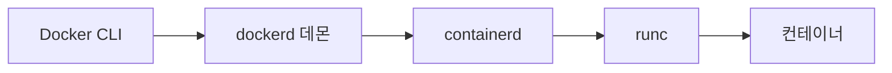
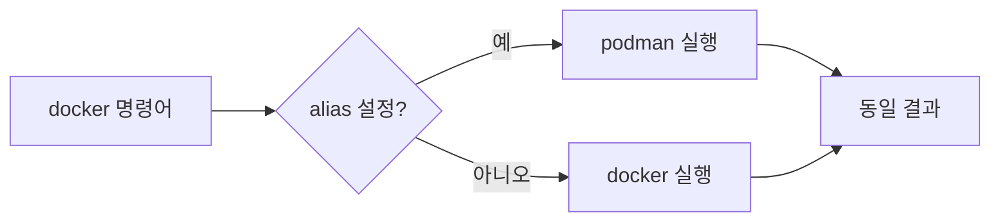
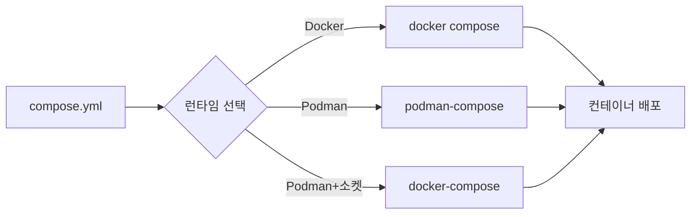
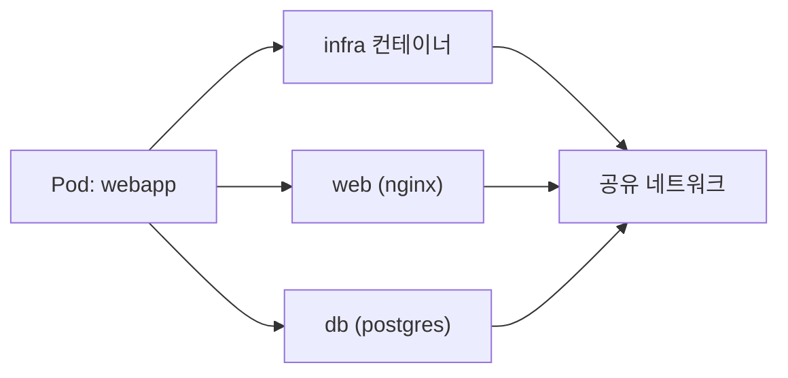
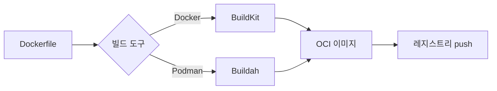
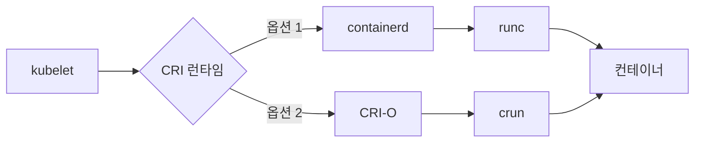
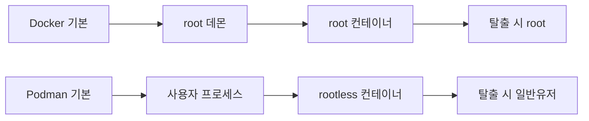

## 한 줄 요약

Docker Desktop은 **데몬 기반의 올인원 컨테이너 플랫폼**이고, Podman은 **데몬 없이 동작하는 OCI 호환 런타임**입니다. 둘 다 컨테이너를 실행하지만, 아키텍처 철학이 정반대이기 때문에 보안, 비용, 운영 방식에서 큰 차이가 생깁니다.

> **비유**: Docker Desktop은 중앙 관제탑이 모든 비행기를 통제하는 공항이고, Podman은 각 비행기가 자체 항법 장치로 독립 비행하는 드론 편대입니다. 관제탑이 다운되면 공항 전체가 멈추지만, 드론은 한 대가 고장 나도 나머지는 멀쩡합니다.

---

## 1. 아키텍처 비교 — Daemon vs Daemonless

### 1-1. Docker의 데몬 아키텍처

Docker는 `dockerd`라는 **중앙 데몬 프로세스**가 항상 떠 있어야 합니다. 클라이언트(`docker` CLI)가 REST API로 데몬에 명령을 보내고, 데몬이 containerd를 거쳐 runc로 컨테이너를 생성합니다.

```
사용자 → docker CLI → dockerd (REST API) → containerd → runc → 컨테이너
```

이 구조의 핵심 특징은 다음과 같습니다.

1. **단일 장애점(Single Point of Failure)**: dockerd가 죽으면 모든 컨테이너 관리가 불가능합니다
2. **root 권한 필수**: dockerd는 기본적으로 root로 실행됩니다
3. **소켓 공유 위험**: `/var/run/docker.sock`을 공유하면 사실상 root 권한을 넘기는 것과 같습니다

### 1-2. Podman의 데몬리스 아키텍처

Podman은 데몬이 없습니다. CLI가 직접 conmon(container monitor)을 통해 OCI 런타임을 호출합니다. 각 컨테이너는 독립된 프로세스로 존재합니다.

```
사용자 → podman CLI → conmon → crun/runc → 컨테이너
```

핵심 차이점은 다음과 같습니다.

1. **단일 장애점 없음**: 데몬이 없으므로 중앙 프로세스 장애가 발생하지 않습니다
2. **일반 사용자 실행 가능**: rootless가 기본 모드입니다
3. **systemd 통합**: 컨테이너를 systemd 서비스로 직접 관리할 수 있습니다

### 1-3. 아키텍처 흐름도




> **비유**: Docker의 데몬은 식당의 중앙 주방장입니다. 모든 주문이 주방장을 거쳐야 하고, 주방장이 쓰러지면 식당 전체가 멈춥니다. Podman은 각 테이블에 개인 셰프가 있는 구조입니다. 한 셰프가 아파도 다른 테이블은 정상 운영됩니다.

### 1-4. 극한 시나리오: 동시 컨테이너 100개

| 항목 | Docker | Podman |
|------|--------|--------|
| 메모리 오버헤드 | dockerd + containerd 상주 (약 200MB) | 컨테이너별 conmon (약 2MB x 100) |
| 데몬 장애 시 | 100개 컨테이너 전체 관리 불가 | 영향 없음, 개별 컨테이너 독립 |
| 재시작 소요 | dockerd 재시작 시 10~30초 지연 | 개별 컨테이너 즉시 재시작 |
| fork 폭풍 | 데몬이 100개 shim 관리 | 100개 conmon 프로세스 독립 |

dockerd에 100개 컨테이너가 연결된 상태에서 OOM(Out of Memory)으로 dockerd가 kill되면, 모든 컨테이너의 로그 수집과 상태 조회가 중단됩니다. Podman은 각 컨테이너가 독립 프로세스이므로 이런 상황 자체가 발생하지 않습니다.

---

## 2. 설치/설정 비교

### 2-1. Docker Desktop 설치

**Windows / macOS**에서 Docker Desktop은 GUI 설치 프로그램을 제공합니다. 내부적으로 경량 VM(Linux kit)을 구동합니다.

```bash
# macOS (Homebrew)
brew install --cask docker

# Windows: Docker Desktop 설치 후 WSL2 백엔드 활성화
wsl --install
# Docker Desktop GUI에서 "Use WSL 2 based engine" 체크
```

**Linux**에서는 Docker Engine만 설치할 수 있습니다.

```bash
# Ubuntu
sudo apt-get update
sudo apt-get install docker-ce docker-ce-cli containerd.io

# 사용자를 docker 그룹에 추가 (root 없이 사용하기 위해)
sudo usermod -aG docker $USER
```

### 2-2. Podman 설치

Podman은 Linux에서 패키지 매니저로 바로 설치됩니다. Windows/macOS에서는 Podman Machine(경량 VM)을 사용합니다.

```bash
# Ubuntu / Debian
sudo apt-get install podman

# Fedora / RHEL
sudo dnf install podman

# macOS
brew install podman
podman machine init
podman machine start

# Windows (winget)
winget install RedHat.Podman
podman machine init
podman machine start
```

### 2-3. 설치 비교 요약

| 항목 | Docker Desktop | Podman |
|------|---------------|--------|
| Linux | 패키지 설치 (무료) | 패키지 설치 (무료) |
| macOS | Docker Desktop (조건부 유료) | podman machine (무료) |
| Windows | Docker Desktop + WSL2 | podman machine + WSL2 |
| 초기 설정 | GUI 기반, 간편 | CLI 기반, machine init 필요 |
| VM 엔진 | LinuxKit / Hyper-V | QEMU / Hyper-V |
| 디스크 사용량 | 약 2~4GB | 약 1~2GB |

> **비유**: Docker Desktop 설치는 가전제품을 사서 콘센트만 꽂는 것이고, Podman 설치는 부품을 조립하는 것입니다. Docker가 처음에는 편하지만, Podman은 조립이 끝나면 더 가볍고 유연합니다.

---

## 3. CLI 호환성

Podman의 가장 큰 장점 중 하나는 **Docker CLI와 거의 100% 호환**된다는 것입니다. 실제로 `alias docker=podman`만 설정하면 대부분의 명령이 그대로 동작합니다.

### 3-1. 동일하게 동작하는 명령

```bash
# 이미지 pull
docker pull nginx:latest
podman pull nginx:latest

# 컨테이너 실행
docker run -d -p 8080:80 --name web nginx
podman run -d -p 8080:80 --name web nginx

# 컨테이너 목록
docker ps -a
podman ps -a

# 로그 확인
docker logs web
podman logs web

# 컨테이너 진입
docker exec -it web bash
podman exec -it web bash

# 이미지 빌드
docker build -t myapp .
podman build -t myapp .

# 볼륨 관리
docker volume create mydata
podman volume create mydata
```

### 3-2. 차이가 나는 부분

```bash
# Docker: docker.sock 통해 API 접근
curl --unix-socket /var/run/docker.sock http://localhost/containers/json

# Podman: podman.sock (사용자별 경로)
curl --unix-socket /run/user/1000/podman/podman.sock http://localhost/containers/json

# Docker: 네트워크 기본값 bridge
docker network ls   # bridge, host, none

# Podman: 네트워크 기본값 podman (CNI/Netavark)
podman network ls   # podman (기본)
```

### 3-3. 호환성 흐름도



> **비유**: Docker CLI와 Podman CLI의 관계는 USB-C 포트와 같습니다. 겉모양(인터페이스)이 같으니 같은 케이블(스크립트)을 꽂을 수 있지만, 내부 전력 공급 방식(아키텍처)은 완전히 다릅니다.

---

## 4. Compose 지원

### 4-1. Docker Compose

Docker Compose는 다중 컨테이너 애플리케이션을 정의하고 실행하는 도구입니다. `docker-compose.yml` 파일 하나로 여러 서비스를 한 번에 관리합니다.

```yaml
# docker-compose.yml
version: "3.9"
services:
  web:
    image: nginx:latest
    ports:
      - "8080:80"
    depends_on:
      - db
  db:
    image: postgres:15
    environment:
      POSTGRES_PASSWORD: secret
    volumes:
      - pgdata:/var/lib/postgresql/data

volumes:
  pgdata:
```

```bash
# Docker Compose V2 (플러그인 방식)
docker compose up -d
docker compose ps
docker compose down
```

### 4-2. Podman Compose

Podman에서는 두 가지 방법으로 Compose를 사용할 수 있습니다.

**방법 1: podman-compose (Python 기반)**

```bash
pip install podman-compose

# 사용법은 docker-compose와 동일
podman-compose up -d
podman-compose ps
podman-compose down
```

**방법 2: docker-compose를 Podman 소켓과 연결**

```bash
# Podman 소켓 활성화
systemctl --user enable --now podman.socket

# DOCKER_HOST 환경변수 설정
export DOCKER_HOST=unix:///run/user/$(id -u)/podman/podman.sock

# 기존 docker-compose 그대로 사용
docker-compose up -d
```

### 4-3. Compose 호환성 비교

| 기능 | Docker Compose V2 | podman-compose | Podman + docker-compose |
|------|-------------------|----------------|------------------------|
| 기본 up/down | O | O | O |
| depends_on | O | O | O |
| healthcheck | O | 부분 지원 | O |
| build context | O | O | O |
| profiles | O | 미지원 | O |
| watch (hot reload) | O | 미지원 | 미지원 |
| GPU 지원 | O | 제한적 | 제한적 |



> **비유**: docker-compose.yml은 악보이고, Docker Compose와 podman-compose는 각각 다른 오케스트라입니다. 같은 악보를 연주하지만, 지휘자(데몬)의 유무에 따라 연주 방식이 달라집니다. 대부분의 곡은 양쪽 다 완벽하게 연주하지만, 일부 복잡한 악보(profiles, watch)에서는 Docker Compose 오케스트라가 더 능숙합니다.

---

## 5. Rootless 모드

### 5-1. 왜 Rootless가 중요한가

컨테이너가 root로 실행되면, 컨테이너 탈출(container escape) 취약점이 발생했을 때 호스트의 root 권한까지 탈취당할 수 있습니다. 이것은 단순한 이론이 아니라 CVE-2019-5736(runc 취약점)에서 실제로 발생했던 시나리오입니다.

### 5-2. Docker의 Rootless 모드

Docker도 rootless 모드를 지원하지만, **기본값이 아닙니다**. 별도 설치와 설정이 필요합니다.

```bash
# Docker rootless 설치 (별도 스크립트)
dockerd-rootless-setuptool.sh install

# 환경변수 설정
export PATH=/home/$USER/bin:$PATH
export DOCKER_HOST=unix:///run/user/$(id -u)/docker.sock

# 확인
docker info | grep "Root Dir"
# /home/user/.local/share/docker
```

Docker rootless의 제한사항은 다음과 같습니다.

- cgroup v2가 필요합니다
- 1024 미만 포트 바인딩 불가 (별도 설정 필요)
- 일부 스토리지 드라이버 미지원
- AppArmor/SELinux 제한적 지원

### 5-3. Podman의 Rootless 모드

Podman은 **rootless가 기본 모드**입니다. 설치하면 바로 일반 사용자 권한으로 동작합니다.

```bash
# 별도 설정 없이 바로 rootless 실행
podman run -d -p 8080:80 nginx

# 현재 모드 확인
podman info | grep rootless
# rootless: true

# 사용자별 독립 저장소
ls ~/.local/share/containers/
```

Podman rootless의 핵심 기술은 다음과 같습니다.

- **user namespace 매핑**: `/etc/subuid`, `/etc/subgid`로 UID/GID 범위 할당
- **slirp4netns / pasta**: 사용자 공간 네트워킹
- **fuse-overlayfs**: 사용자 공간 오버레이 파일시스템

```bash
# subuid/subgid 확인
cat /etc/subuid
# user:100000:65536

# 컨테이너 내부 root(UID 0) → 호스트에서는 user의 서브UID(100000)
podman run --rm alpine id
# uid=0(root) gid=0(root)  ← 컨테이너 안에서만 root
```

### 5-4. Rootless 비교 요약

| 항목 | Docker rootless | Podman rootless |
|------|----------------|-----------------|
| 기본 모드 | 아니오 (별도 설치) | 예 (기본값) |
| 설정 난이도 | 중간~높음 | 낮음 |
| 1024 미만 포트 | 별도 설정 필요 | 별도 설정 필요 |
| 네트워킹 | slirp4netns | slirp4netns / pasta |
| 스토리지 | overlay2 (제한적) | fuse-overlayfs / overlay |
| 성숙도 | Docker 20.10+ | Podman 1.0+ |

> **비유**: Docker의 rootless 모드는 자동차에 후방 카메라를 옵션으로 추가하는 것이고, Podman의 rootless는 공장 출고부터 후방 카메라가 기본 장착된 것입니다. 둘 다 같은 기능이지만, 기본 장착이 누락 가능성이 없어 더 안전합니다.

---

## 6. Pod 개념

### 6-1. Pod란 무엇인가

Pod는 **하나 이상의 컨테이너가 네트워크와 IPC 네임스페이스를 공유하는 그룹**입니다. 이 개념은 Kubernetes에서 왔으며, Podman의 이름 자체가 "**Pod** **Man**ager"의 줄임말입니다.

> **비유**: Pod는 기숙사 방입니다. 같은 방(Pod)에 사는 룸메이트(컨테이너)들은 같은 주소(IP)를 쓰고, 같은 화장실(IPC)을 공유합니다. 하지만 각자 자기 침대(파일시스템)는 독립적입니다.

### 6-2. Podman에서 Pod 사용

```bash
# Pod 생성 (포트 매핑은 Pod 레벨에서)
podman pod create --name webapp -p 8080:80 -p 5432:5432

# Pod에 컨테이너 추가
podman run -d --pod webapp --name web nginx
podman run -d --pod webapp --name db \
  -e POSTGRES_PASSWORD=secret postgres:15

# web 컨테이너에서 db에 localhost로 접근 가능!
podman exec web curl localhost:5432

# Pod 상태 확인
podman pod ps
podman pod inspect webapp

# Pod 단위 조작
podman pod stop webapp
podman pod start webapp
podman pod rm webapp
```

Pod 내부에서는 모든 컨테이너가 **같은 localhost**를 공유합니다. 따라서 서비스 간 통신에 별도 네트워크 설정이 필요 없습니다.

### 6-3. Docker에서 유사한 구현

Docker에는 Pod 개념이 없습니다. 비슷한 효과를 내려면 `--network container:` 옵션을 사용해야 합니다.

```bash
# Docker에서 네트워크 공유 (Pod 유사 구현)
docker run -d --name web -p 8080:80 nginx
docker run -d --name db --network container:web \
  -e POSTGRES_PASSWORD=secret postgres:15

# 이 방식은 Pod보다 관리가 불편하고 제약이 많음
```

### 6-4. Pod 아키텍처



Pod를 생성하면 자동으로 **infra 컨테이너**(pause 컨테이너)가 생성됩니다. 이 컨테이너가 네트워크 네임스페이스를 소유하고, 나머지 컨테이너가 이를 공유합니다. Kubernetes의 pause 컨테이너와 동일한 원리입니다.

### 6-5. Pod를 Kubernetes YAML로 내보내기

Podman의 킬러 기능 중 하나는 Pod를 Kubernetes YAML로 바로 내보내는 것입니다.

```bash
# 실행 중인 Pod를 K8s YAML로 변환
podman generate kube webapp > webapp.yaml

# 반대로 K8s YAML로 Pod 생성
podman play kube webapp.yaml

# 생성된 YAML 예시
cat webapp.yaml
```

```yaml
# 자동 생성된 Kubernetes YAML
apiVersion: v1
kind: Pod
metadata:
  name: webapp
spec:
  containers:
    - name: web
      image: nginx:latest
      ports:
        - containerPort: 80
          hostPort: 8080
    - name: db
      image: postgres:15
      env:
        - name: POSTGRES_PASSWORD
          value: secret
```

이 기능 덕분에 로컬에서 Podman Pod로 개발하고, 그대로 Kubernetes에 배포하는 워크플로가 가능합니다.

---

## 7. 빌드 도구 — Buildah vs BuildKit

### 7-1. Docker의 BuildKit

Docker는 18.09부터 BuildKit을 기본 빌드 엔진으로 사용합니다. BuildKit의 주요 특징은 다음과 같습니다.

```bash
# BuildKit 활성화 (Docker 23.0+에서는 기본)
export DOCKER_BUILDKIT=1

# 병렬 빌드 스테이지
docker build -t myapp .

# 캐시 마운트 (빌드 속도 향상)
# Dockerfile에서:
# RUN --mount=type=cache,target=/root/.cache/pip pip install -r requirements.txt

# 멀티 플랫폼 빌드
docker buildx build --platform linux/amd64,linux/arm64 -t myapp .
```

BuildKit의 핵심 기능은 다음과 같습니다.

1. **병렬 스테이지 실행**: 독립된 스테이지를 동시에 빌드합니다
2. **캐시 마운트**: 패키지 매니저 캐시를 레이어 간 재사용합니다
3. **시크릿 마운트**: 빌드 시 비밀 값을 안전하게 전달합니다
4. **멀티 플랫폼**: 단일 명령으로 여러 아키텍처 이미지를 빌드합니다

### 7-2. Podman의 Buildah

Podman은 내부적으로 **Buildah** 라이브러리를 사용합니다. Buildah는 독립적으로도 사용 가능한 OCI 이미지 빌드 도구입니다.

```bash
# Buildah 직접 사용 (Dockerfile 없이 스크립트로 이미지 빌드)
container=$(buildah from ubuntu:22.04)
buildah run $container apt-get update
buildah run $container apt-get install -y nginx
buildah config --port 80 $container
buildah config --cmd "nginx -g 'daemon off;'" $container
buildah commit $container my-nginx

# Dockerfile 기반 빌드 (podman build와 동일)
buildah bud -t myapp .
```

Buildah의 고유 장점은 다음과 같습니다.

1. **Dockerfile 없이 빌드**: 셸 스크립트로 이미지를 단계별로 생성할 수 있습니다
2. **데몬 불필요**: 빌드 시에도 데몬이 필요 없습니다
3. **세밀한 제어**: 각 레이어를 개별적으로 조작할 수 있습니다
4. **rootless 빌드**: 일반 사용자로 이미지를 빌드합니다

### 7-3. 빌드 도구 비교

| 기능 | BuildKit (Docker) | Buildah (Podman) |
|------|-------------------|------------------|
| Dockerfile 지원 | O | O |
| 스크립트 빌드 | X | O |
| 병렬 스테이지 | O | 제한적 |
| 캐시 마운트 | O | O (4.0+) |
| 멀티 플랫폼 | O (buildx) | O (manifest) |
| 시크릿 마운트 | O | O |
| rootless 빌드 | O | O (기본) |
| 빌드 속도 | 빠름 | 보통 |



> **비유**: BuildKit은 자동화 공장의 조립 라인이고, Buildah는 수제 공방입니다. 조립 라인은 대량 생산(병렬 빌드)에 강하지만, 수제 공방은 한 땀 한 땀 커스터마이징(스크립트 빌드)이 가능합니다.

### 7-4. 극한 시나리오: CI/CD 파이프라인 성능

CI/CD 환경에서 빌드 성능은 비용과 직결됩니다. 대규모 모노레포에서의 비교는 다음과 같습니다.

| 시나리오 | BuildKit | Buildah |
|---------|----------|---------|
| 단일 이미지 빌드 | 45초 | 52초 |
| 10-stage 병렬 빌드 | 90초 | 140초 |
| 캐시 히트율 90% 재빌드 | 12초 | 18초 |
| 멀티 플랫폼 (amd64+arm64) | 180초 | 210초 |
| DinD (Docker in Docker) | 가능 | 불필요 (rootless) |

CI/CD에서 Podman/Buildah의 진짜 장점은 **DinD(Docker in Docker) 없이 빌드 가능**하다는 점입니다. DinD는 보안 위험이 크고 캐시 관리가 어렵습니다. Podman은 rootless로 빌드하므로 privileged 모드가 필요 없습니다.

```bash
# GitHub Actions에서 Podman 빌드 (privileged 불필요)
# .github/workflows/build.yml
# steps:
#   - name: Build with Podman
#     run: podman build -t myapp .

# GitLab CI에서 Docker 빌드 (DinD 필요, privileged 필수)
# .gitlab-ci.yml
# services:
#   - docker:dind  ← 보안 위험
# variables:
#   DOCKER_HOST: tcp://docker:2376
```

---

## 8. Kubernetes 연동

### 8-1. Docker + Kubernetes

Docker는 오랫동안 Kubernetes의 기본 컨테이너 런타임이었지만, **Kubernetes 1.24부터 dockershim이 제거**되었습니다. 이제 Kubernetes는 containerd나 CRI-O를 직접 사용합니다.

```
Kubernetes 1.23 이전:
kubelet → dockershim → dockerd → containerd → runc

Kubernetes 1.24 이후:
kubelet → containerd → runc
kubelet → CRI-O → runc
```

Docker로 빌드한 이미지는 OCI 표준을 따르므로 Kubernetes에서 문제없이 사용할 수 있습니다. 바뀐 것은 런타임뿐입니다.

### 8-2. Podman + Kubernetes

Podman은 Kubernetes와 특별한 친화성을 가집니다.

```bash
# 1. Pod 개념이 동일
podman pod create --name myapp

# 2. K8s YAML 직접 실행
podman play kube deployment.yaml

# 3. 실행 중인 컨테이너를 K8s YAML로 변환
podman generate kube myapp > k8s-manifest.yaml

# 4. 로컬 개발 → K8s 배포 워크플로
podman play kube dev-pod.yaml          # 로컬 테스트
kubectl apply -f dev-pod.yaml           # 클러스터 배포
```

### 8-3. CRI-O: Podman의 Kubernetes 런타임

CRI-O는 Podman과 같은 팀(Red Hat)이 만든 Kubernetes 전용 컨테이너 런타임입니다. Podman과 동일한 컨테이너 스택(conmon, crun)을 사용합니다.



> **비유**: Docker와 Kubernetes의 관계는 초창기 파트너에서 갈라선 공동 창업자 같습니다. 여전히 같은 표준(OCI)을 사용하지만, 각자의 길을 갑니다. Podman은 Kubernetes의 새 파트너(CRI-O)와 같은 가문(Red Hat) 출신이라 궁합이 더 잘 맞습니다.

### 8-4. Kind vs Podman Desktop

로컬에서 Kubernetes를 돌리는 방법도 다릅니다.

| 도구 | 런타임 | 특징 |
|------|--------|------|
| Docker Desktop K8s | Docker + containerd | 원클릭 활성화 |
| kind (Kubernetes IN Docker) | Docker | 가볍고 빠름, CI 친화적 |
| Minikube | Docker/Podman/VirtualBox | 다양한 드라이버 지원 |
| Podman Desktop K8s | Podman + kind/minikube | Podman 생태계 통합 |

```bash
# kind + Docker
kind create cluster

# kind + Podman (KIND_EXPERIMENTAL_PROVIDER 설정)
export KIND_EXPERIMENTAL_PROVIDER=podman
kind create cluster

# Minikube + Podman
minikube start --driver=podman
```

---

## 9. 보안 비교

### 9-1. 공격 표면(Attack Surface) 비교

보안에서 가장 중요한 것은 **공격 표면을 줄이는 것**입니다.

| 공격 벡터 | Docker | Podman |
|-----------|--------|--------|
| 데몬 프로세스 | root 데몬 상시 실행 | 데몬 없음 |
| 소켓 노출 | docker.sock 공유 위험 | 사용자별 소켓 (선택) |
| 기본 권한 | root (변경 가능) | rootless (기본) |
| 컨테이너 탈출 시 | root 권한 획득 가능 | 일반 사용자 권한만 |
| SELinux 지원 | 제한적 | 완전 지원 |
| Seccomp 프로필 | 기본 제공 | 기본 제공 + 강화 |

### 9-2. Docker 소켓의 위험성

`/var/run/docker.sock`을 컨테이너에 마운트하는 것은 매우 위험합니다.

```bash
# 위험한 패턴: docker.sock 마운트
docker run -v /var/run/docker.sock:/var/run/docker.sock myapp

# 이 컨테이너는 호스트의 Docker를 완전히 제어 가능
# → 다른 컨테이너 생성/삭제
# → 호스트 파일시스템 마운트
# → 사실상 root 권한 획득
```

이 패턴은 CI/CD(Jenkins, GitLab Runner), 모니터링(Portainer, Watchtower) 등에서 빈번하게 사용되며, 실질적인 보안 구멍입니다.

Podman에서는 데몬이 없으므로 이런 패턴 자체가 불필요합니다. API 접근이 필요한 경우에도 사용자별 소켓을 제한적으로 노출합니다.

### 9-3. User Namespace 격리

```bash
# Podman rootless: 컨테이너 내 root ≠ 호스트 root
podman run --rm alpine cat /proc/self/uid_map
# 0  100000  65536
# 컨테이너 UID 0 → 호스트 UID 100000 (일반 사용자)

# Docker 기본: 컨테이너 내 root = 호스트 root
docker run --rm alpine cat /proc/self/uid_map
# 0  0  4294967295
# 컨테이너 UID 0 → 호스트 UID 0 (root!)
```

### 9-4. 보안 아키텍처 비교



> **비유**: Docker의 기본 보안은 금고 안에 돈을 넣되 금고 열쇠를 문 앞에 걸어두는 것이고, Podman의 기본 보안은 금고 열쇠를 각 직원이 나눠 갖되 각 직원은 자기 서랍만 열 수 있는 구조입니다.

---

## 10. 라이선스/비용 — Docker Desktop 유료화

### 10-1. Docker Desktop 유료화 정책

2021년 8월, Docker Inc.는 Docker Desktop의 라이선스를 변경했습니다.

| 구분 | 조건 | 비용 (월) |
|------|------|-----------|
| Personal | 개인, 교육, 오픈소스 | 무료 |
| Pro | 개인 개발자 | $5 |
| Team | 팀 단위 | $9/사용자 |
| Business | 250인 이상 또는 연매출 $10M 이상 기업 | $24/사용자 |

**핵심**: 직원 250명 이상 또는 연매출 1천만 달러 이상 기업에서 Docker Desktop을 사용하려면 **유료 구독이 필수**입니다.

이 정책의 적용 범위를 명확히 이해해야 합니다.

- **유료 대상**: Docker Desktop (Windows/macOS의 GUI 애플리케이션)
- **무료 유지**: Docker Engine (Linux), Docker CLI, Docker Compose, Docker Hub (무료 티어)

### 10-2. 비용 시뮬레이션

개발자 100명이 있는 기업 기준으로 계산하면 다음과 같습니다.

| 선택지 | 월 비용 | 연 비용 |
|--------|---------|---------|
| Docker Desktop Business | $2,400 | $28,800 |
| Docker Desktop Team | $900 | $10,800 |
| Podman | $0 | $0 |

연간 최대 약 3,800만 원(환율 1,300원 기준)의 차이가 발생합니다.

### 10-3. 왜 Podman으로 이동하는가

많은 기업이 Docker Desktop 유료화 이후 Podman으로 전환하고 있습니다. 주요 사례는 다음과 같습니다.

1. **Red Hat / Fedora**: 기본 컨테이너 런타임이 Podman입니다
2. **금융권**: 보안 요구사항(rootless, 데몬리스)과 라이선스 비용 절감
3. **정부기관**: 오픈소스 우선 정책과 보안 규정 준수
4. **스타트업**: 비용 절감이 중요한 초기 단계

> **비유**: Docker Desktop 유료화는 오랫동안 무료였던 고속도로에 갑자기 톨게이트가 생긴 것입니다. 옆에 무료 국도(Podman)가 있는데, 알고 보니 그 국도가 더 안전하고 속도도 비슷합니다. 대기업 차량(250인 이상)만 통행료를 내면 되지만, 한 번 국도로 옮기면 다시 고속도로로 돌아갈 이유가 없습니다.

---

## 11. 마이그레이션 가이드

### 11-1. Docker에서 Podman으로 전환

**단계 1: Podman 설치**

```bash
# Ubuntu
sudo apt-get install podman

# macOS
brew install podman && podman machine init && podman machine start
```

**단계 2: alias 설정**

```bash
# .bashrc 또는 .zshrc에 추가
alias docker=podman
alias docker-compose=podman-compose

# 환경변수 (docker-compose 사용 시)
export DOCKER_HOST=unix:///run/user/$(id -u)/podman/podman.sock
```

**단계 3: 이미지 마이그레이션**

```bash
# Docker 이미지를 파일로 저장
docker save myapp:latest -o myapp.tar

# Podman으로 로드
podman load -i myapp.tar

# 또는 레지스트리 경유 (권장)
docker push myapp:latest registry.example.com/myapp:latest
podman pull registry.example.com/myapp:latest
```

**단계 4: Compose 파일 검증**

```bash
# podman-compose로 기존 compose 파일 테스트
podman-compose -f docker-compose.yml config
podman-compose up -d

# 동작 확인
podman-compose ps
podman-compose logs
```

**단계 5: CI/CD 파이프라인 수정**

```yaml
# GitHub Actions 예시: docker → podman 변경
# 변경 전
# - run: docker build -t myapp .
# - run: docker push myapp:latest

# 변경 후
- name: Install Podman
  run: sudo apt-get install -y podman
- run: podman build -t myapp .
- run: podman push myapp:latest
```

### 11-2. 마이그레이션 체크리스트

| 항목 | 확인 사항 | 대응 방법 |
|------|-----------|-----------|
| Dockerfile | 변경 없이 호환 | 그대로 사용 |
| docker-compose.yml | 대부분 호환 | podman-compose 또는 소켓 연동 |
| docker.sock 의존 | Podman에 없음 | podman.socket 활성화 |
| --privileged 사용 | rootless에서 제한 | 필요 최소 권한으로 대체 |
| Docker Hub rate limit | 동일 적용 | 미러 레지스트리 설정 |
| 빌드 캐시 | BuildKit → Buildah | 캐시 전략 재설정 |
| 볼륨 경로 | /var/lib/docker → ~/.local/share/containers | 백업 스크립트 수정 |

### 11-3. 극한 시나리오: Air-Gapped(폐쇄망) 환경 마이그레이션

인터넷이 차단된 폐쇄망 환경에서의 마이그레이션은 특수한 주의가 필요합니다.

```bash
# 1. 외부망에서 이미지 + Podman 패키지 준비
# 이미지 번들링
podman save nginx postgres redis -o images-bundle.tar

# Podman RPM 패키지 + 의존성 다운로드
sudo dnf download --resolve --destdir=./podman-pkgs podman

# 2. USB 등으로 폐쇄망에 전달

# 3. 폐쇄망에서 설치
sudo rpm -ivh ./podman-pkgs/*.rpm

# 4. 이미지 로드
podman load -i images-bundle.tar

# 5. 레지스트리 없이 직접 실행
podman run -d --name web nginx
```

폐쇄망 환경에서 Podman의 장점은 다음과 같습니다.

- **데몬 불필요**: 네트워크 없이도 바로 컨테이너 실행 가능
- **단일 바이너리에 가까움**: 의존성이 적어 설치가 간편
- **미러 레지스트리 설정**: `/etc/containers/registries.conf`에서 간단히 설정

```ini
# /etc/containers/registries.conf (폐쇄망 레지스트리 설정)
[[registry]]
location = "docker.io"

[[registry.mirror]]
location = "internal-registry.corp.com"
```

Docker 대비 Podman이 폐쇄망에서 유리한 이유는 데몬 프로세스 관리가 없고, systemd와 직접 통합되며, 패키지 의존성이 더 적기 때문입니다.

---

## 12. 실무 실수 TOP 5

### 실수 1: Docker 소켓을 무분별하게 마운트

```bash
# 절대 하지 마세요
docker run -v /var/run/docker.sock:/var/run/docker.sock untrusted-image

# 이것은 사실상 호스트 root 권한을 컨테이너에 넘기는 것
# 대안: Podman rootless 사용 또는 Docker socket proxy 적용
```

**왜 위험한가**: docker.sock에 접근할 수 있는 컨테이너는 호스트에 새 컨테이너를 생성하면서 호스트 루트 파일시스템을 마운트할 수 있습니다. 사실상 컨테이너 탈출과 동일합니다.

### 실수 2: Podman rootless에서 1024 미만 포트 바인딩 실패

```bash
# 실패
podman run -d -p 80:80 nginx
# Error: rootlessport cannot expose privileged port 80

# 해결 방법 1: 높은 포트 사용
podman run -d -p 8080:80 nginx

# 해결 방법 2: sysctl 설정 (리눅스)
sudo sysctl net.ipv4.ip_unprivileged_port_start=80

# 해결 방법 3: root 모드로 실행 (권장하지 않음)
sudo podman run -d -p 80:80 nginx
```

### 실수 3: Podman에서 Docker Compose 플러그인 직접 사용

```bash
# 실패: docker compose (V2 플러그인)는 Podman에서 동작하지 않음
docker compose up  # ← docker CLI의 플러그인이므로 podman에서 미지원

# 해결: podman-compose 또는 docker-compose (standalone) 사용
podman-compose up -d

# 또는 Podman 소켓 + docker-compose standalone
export DOCKER_HOST=unix:///run/user/$(id -u)/podman/podman.sock
docker-compose up -d
```

### 실수 4: 이미지 레지스트리 기본값 차이 무시

```bash
# Docker: 기본적으로 docker.io에서 검색
docker pull nginx  # → docker.io/library/nginx

# Podman: 여러 레지스트리에서 검색 (대화형 선택)
podman pull nginx
# ? Please select an image:
#   registry.fedoraproject.org/nginx
#   registry.access.redhat.com/nginx
#   docker.io/library/nginx

# 해결: 전체 경로 명시 (권장)
podman pull docker.io/library/nginx

# 또는 기본 레지스트리 설정
# /etc/containers/registries.conf
# unqualified-search-registries = ["docker.io"]
```

### 실수 5: Docker Desktop 라이선스 위반

```
시나리오: 직원 300명 기업에서 개발자 50명이 Docker Desktop을 무료로 사용
→ 라이선스 위반! Business 구독 필요 ($24/사용자/월)
→ 연간 $14,400 (약 1,870만 원) 추가 비용 발생 가능

대안:
1. Podman Desktop으로 전환 (무료)
2. Linux 개발 환경에서 Docker Engine 사용 (무료)
3. Docker Desktop Business 구독 구매
```

> **비유**: Docker Desktop 라이선스 위반은 회사 규모가 커진 뒤에도 소기업용 소프트웨어 라이선스를 쓰는 것과 같습니다. 감사(audit)가 나오면 소급 청구될 수 있으므로, 미리 확인하고 전환하는 것이 현명합니다.

---

## 13. 종합 비교표

| 항목 | Docker (Desktop) | Podman |
|------|------------------|--------|
| 아키텍처 | 데몬(dockerd) 기반 | 데몬리스 |
| 기본 권한 | root | rootless |
| Pod 지원 | X | O |
| Compose | Docker Compose V2 | podman-compose / 소켓 호환 |
| 빌드 도구 | BuildKit | Buildah |
| K8s YAML 호환 | X | O (generate/play kube) |
| K8s 런타임 | containerd | CRI-O |
| systemd 통합 | X | O |
| GUI | Docker Desktop | Podman Desktop |
| 라이선스 | 조건부 유료 | 완전 무료 (Apache 2.0) |
| 생태계 성숙도 | 매우 높음 | 높음 (빠르게 성장 중) |
| 커뮤니티 | 매우 큼 | 큼 (Red Hat 후원) |
| Windows/macOS 지원 | WSL2/HyperKit | WSL2/QEMU |
| 문서/학습 자료 | 매우 풍부 | 풍부 (점차 증가) |
| CI/CD 호환성 | 모든 CI/CD 지원 | 대부분 지원 |

### 어떤 걸 선택해야 하는가

**Docker Desktop을 선택해야 하는 경우**

1. 처음 컨테이너를 배우는 개인 또는 소규모 팀
2. Docker Compose V2의 최신 기능(watch, profiles)이 필수인 프로젝트
3. 기존 Docker 생태계 도구와의 완벽한 호환이 필요한 경우
4. GUI 기반 관리를 선호하는 경우

**Podman을 선택해야 하는 경우**

1. 250인 이상 기업에서 라이선스 비용을 절감하고 싶은 경우
2. 보안이 최우선인 금융/공공 분야
3. Kubernetes 네이티브 워크플로를 원하는 경우
4. RHEL/Fedora 기반 인프라를 운영하는 경우
5. CI/CD에서 DinD(Docker in Docker)를 제거하고 싶은 경우

---

## 14. Podman Desktop 소개

Docker Desktop의 대안으로 **Podman Desktop**이 있습니다. GUI 기반으로 컨테이너, 이미지, Pod를 관리할 수 있는 오픈소스 도구입니다.

### 14-1. 주요 기능

| 기능 | Docker Desktop | Podman Desktop |
|------|---------------|----------------|
| 컨테이너 관리 | O | O |
| 이미지 관리 | O | O |
| K8s 클러스터 | 내장 | 확장(kind/minikube) |
| 확장 프로그램 | Docker Extensions | Podman Extensions |
| Compose UI | O | O |
| Pod 관리 | X | O |
| 라이선스 | 조건부 유료 | 완전 무료 |

### 14-2. 설치 및 설정

```bash
# macOS
brew install podman-desktop

# Windows
winget install RedHat.Podman-Desktop

# Linux (Flatpak)
flatpak install flathub io.podman_desktop.PodmanDesktop
```

Podman Desktop은 Docker Desktop에서 전환하는 사용자를 위해 **마이그레이션 기능**까지 내장하고 있습니다. Docker의 이미지, 컨테이너, 볼륨을 자동으로 감지하여 Podman으로 옮겨줍니다.

---

## 15. 네트워킹 심화 비교

### 15-1. Docker 네트워킹

Docker는 **libnetwork** 기반으로 네트워크를 관리합니다.

```bash
# Docker 네트워크 드라이버
docker network ls
# bridge (기본)
# host
# none
# overlay (Swarm 전용)

# 사용자 정의 브리지 네트워크
docker network create mynet
docker run -d --network mynet --name web nginx
docker run -d --network mynet --name db postgres

# web → db로 컨테이너 이름으로 접근 가능
docker exec web ping db  # 동작
```

### 15-2. Podman 네트워킹

Podman은 **Netavark**(기본) 또는 **CNI 플러그인**을 사용합니다.

```bash
# Podman 네트워크 드라이버
podman network ls
# podman (기본, bridge 타입)

# 사용자 정의 네트워크
podman network create mynet
podman run -d --network mynet --name web nginx
podman run -d --network mynet --name db postgres

# 동일하게 컨테이너 이름으로 DNS 접근 가능
podman exec web ping db  # 동작
```

### 15-3. Rootless 네트워킹의 차이

rootless 모드에서 네트워킹은 추가적인 레이어가 필요합니다.

| 항목 | Docker rootless | Podman rootless |
|------|----------------|-----------------|
| 네트워킹 도구 | slirp4netns | slirp4netns / pasta |
| DNS 해석 | 내장 DNS | Aardvark-dns |
| 성능 | 느림 (userspace) | pasta가 더 빠름 |
| 1024 미만 포트 | 별도 설정 필요 | 별도 설정 필요 |

```bash
# pasta 네트워킹 확인 (Podman 4.0+)
podman info | grep -A5 network

# pasta는 slirp4netns 대비 약 2~3배 빠른 네트워크 성능
```

> **비유**: rootless 네트워킹에서 slirp4netns는 편지를 일일이 복사해서 전달하는 우체부이고, pasta는 우편함 사이에 직통 파이프를 설치하는 것입니다. 둘 다 편지가 전달되지만 파이프가 훨씬 빠릅니다.

---

## 16. 스토리지 드라이버 비교

### 16-1. Docker 스토리지

Docker는 기본적으로 **overlay2** 스토리지 드라이버를 사용합니다.

```bash
# Docker 스토리지 확인
docker info | grep "Storage Driver"
# Storage Driver: overlay2

# 이미지/컨테이너 저장 경로
# root 모드: /var/lib/docker/
# rootless: ~/.local/share/docker/
```

### 16-2. Podman 스토리지

Podman은 rootful/rootless에 따라 다른 스토리지 드라이버를 사용합니다.

```bash
# Podman 스토리지 확인
podman info | grep graphDriverName
# root 모드: overlay
# rootless: overlay (kernel 5.11+) 또는 fuse-overlayfs

# 이미지/컨테이너 저장 경로
# root 모드: /var/lib/containers/storage/
# rootless: ~/.local/share/containers/storage/

# 스토리지 설정 파일
cat /etc/containers/storage.conf
```

| 항목 | Docker | Podman (rootful) | Podman (rootless) |
|------|--------|------------------|-------------------|
| 기본 드라이버 | overlay2 | overlay | overlay / fuse-overlayfs |
| 저장 경로 | /var/lib/docker | /var/lib/containers | ~/.local/share/containers |
| 설정 파일 | /etc/docker/daemon.json | /etc/containers/storage.conf | ~/.config/containers/storage.conf |

---

## 17. systemd 통합

Podman의 고유 강점 중 하나는 **systemd와의 네이티브 통합**입니다.

### 17-1. 컨테이너를 systemd 서비스로

```bash
# 컨테이너 실행
podman run -d --name web -p 8080:80 nginx

# systemd 유닛 파일 자동 생성
podman generate systemd --new --name web > ~/.config/systemd/user/container-web.service

# systemd로 관리
systemctl --user daemon-reload
systemctl --user enable container-web.service
systemctl --user start container-web.service

# 부팅 시 자동 시작 (사용자 로그인 없이도)
loginctl enable-linger $USER
```

### 17-2. Quadlet (Podman 4.4+)

Podman 4.4부터는 **Quadlet**이라는 더 간편한 systemd 통합 방식을 제공합니다.

```ini
# ~/.config/containers/systemd/web.container
[Container]
Image=nginx:latest
PublishPort=8080:80

[Service]
Restart=always

[Install]
WantedBy=default.target
```

```bash
# Quadlet 파일 배치 후 리로드
systemctl --user daemon-reload
systemctl --user start web  # 자동으로 podman run 실행
```

Docker에서 동일한 작업을 하려면 수동으로 systemd 유닛 파일을 작성하고, 데몬 의존성을 관리해야 합니다. Podman은 이 과정을 자동화합니다.

> **비유**: Docker에서 컨테이너를 서비스로 등록하는 것은 수동 변속기 차를 모는 것이고, Podman의 Quadlet은 자동 변속기입니다. 둘 다 같은 목적지에 도착하지만, Quadlet이 운전 피로도를 크게 줄여줍니다.

---

## 18. 멀티 아키텍처 이미지 빌드

### 18-1. Docker buildx

```bash
# buildx 빌더 생성
docker buildx create --name multiarch --driver docker-container --use

# 멀티 플랫폼 빌드 + 푸시
docker buildx build \
  --platform linux/amd64,linux/arm64 \
  -t registry.example.com/myapp:latest \
  --push .
```

### 18-2. Podman manifest

```bash
# 각 플랫폼별 빌드
podman build --platform linux/amd64 -t myapp:amd64 .
podman build --platform linux/arm64 -t myapp:arm64 .

# manifest list 생성
podman manifest create myapp:latest
podman manifest add myapp:latest myapp:amd64
podman manifest add myapp:latest myapp:arm64

# manifest 푸시
podman manifest push myapp:latest registry.example.com/myapp:latest
```

Docker buildx가 단일 명령으로 멀티 플랫폼을 처리하는 반면, Podman은 명시적으로 각 단계를 수행합니다. Podman 4.x 이후로는 `--platform` 플래그로 한 번에 처리할 수도 있습니다.

---

## 19. 모니터링과 로깅

### 19-1. 컨테이너 리소스 모니터링


```bash
# Docker
docker stats
docker stats --format "table {{.Name}}\t{{.CPUPerc}}\t{{.MemUsage}}"

# Podman
podman stats
podman stats --format "table {{.Name}}\t{{.CPUPerc}}\t{{.MemUsage}}"
# 동일한 포맷 지원
```


### 19-2. 로그 드라이버

| 로그 드라이버 | Docker | Podman |
|--------------|--------|--------|
| json-file | O (기본) | O |
| journald | O | O (기본, Linux) |
| syslog | O | O |
| k8s-file | X | O |
| fluentd | O | X |
| gelf | O | X |

Podman은 기본적으로 **journald**를 로그 드라이버로 사용합니다. 이것은 systemd 통합의 일부로, `journalctl`로 컨테이너 로그를 조회할 수 있습니다.

```bash
# Podman: journald 기반 로그 조회
journalctl --user CONTAINER_NAME=web --since "10 minutes ago"

# Docker: json-file 기반 로그 조회
docker logs --since 10m web
```

---

## 20. 실전 성능 벤치마크

### 20-1. 컨테이너 시작 시간

| 이미지 | Docker | Podman (rootful) | Podman (rootless) |
|--------|--------|------------------|-------------------|
| alpine | 0.8초 | 0.7초 | 1.0초 |
| nginx | 1.2초 | 1.1초 | 1.5초 |
| postgres | 2.5초 | 2.3초 | 2.8초 |
| node:20 | 3.0초 | 2.8초 | 3.5초 |

rootless 모드에서 약 15~25% 정도 느려지는 것은 user namespace 매핑과 fuse-overlayfs 오버헤드 때문입니다. 하지만 보안 이점을 고려하면 충분히 감수할 수 있는 수준입니다.

### 20-2. 이미지 빌드 시간

```
# 3-stage Dockerfile (Go 앱, 의존성 50개, 최종 이미지 20MB)
BuildKit (Docker):    42초 (캐시 미사용), 8초 (캐시 히트)
Buildah (Podman):     48초 (캐시 미사용), 12초 (캐시 히트)

# 10-stage Dockerfile (병렬 빌드 가능)
BuildKit (Docker):    65초 (병렬 최적화)
Buildah (Podman):     95초 (순차 실행 비중 높음)
```

BuildKit의 병렬 스테이지 실행이 빌드 시간에서 유의미한 차이를 만듭니다. 빌드 성능이 최우선인 CI/CD에서는 이 차이가 중요할 수 있습니다.

---

## 21. 면접 포인트 5개

<details>
<summary><strong>Q1. Docker와 Podman의 아키텍처 차이를 설명하고, 보안 관점에서 어느 쪽이 유리한지 답하세요.</strong></summary>

**모범 답변:**

Docker는 중앙 데몬(dockerd)이 모든 컨테이너를 관리하는 클라이언트-서버 아키텍처입니다. 클라이언트가 REST API로 데몬에 명령을 보내고, 데몬이 containerd를 거쳐 runc로 컨테이너를 생성합니다. 이 구조의 문제는 데몬이 root로 실행되어야 하고, docker.sock이 단일 장애점이 된다는 것입니다.

Podman은 데몬 없이 fork-exec 모델로 동작합니다. CLI가 직접 conmon을 통해 OCI 런타임을 호출하며, 각 컨테이너가 독립된 프로세스입니다. rootless가 기본 모드이므로 컨테이너 탈출 시에도 일반 사용자 권한만 획득됩니다.

보안 관점에서 Podman이 유리합니다. 이유는 다음 세 가지입니다.

1. 데몬이 없어 공격 표면이 작습니다
2. rootless 기본 모드로 최소 권한 원칙을 준수합니다
3. docker.sock 같은 위험한 소켓 공유가 불필요합니다

**핵심 키워드**: daemon vs daemonless, fork-exec, rootless, 최소 권한 원칙, 공격 표면
</details>

<details>
<summary><strong>Q2. Kubernetes 1.24에서 dockershim이 제거된 이유와 현재 권장 런타임을 설명하세요.</strong></summary>

**모범 답변:**

Kubernetes가 dockershim을 제거한 이유는 Docker가 CRI(Container Runtime Interface) 표준을 직접 구현하지 않았기 때문입니다. kubelet이 Docker를 사용하려면 dockershim이라는 중간 어댑터가 필요했고, 이것이 유지보수 부담이었습니다. 또한 dockerd라는 불필요한 데몬 레이어를 거치는 것이 성능과 복잡도 면에서 비효율적이었습니다.

현재 권장 런타임은 다음 두 가지입니다.

1. **containerd**: Docker에서 분리된 런타임으로, 대부분의 관리형 Kubernetes(EKS, GKE, AKS)에서 기본 사용됩니다
2. **CRI-O**: Kubernetes 전용으로 설계된 경량 런타임으로, OpenShift에서 기본 사용됩니다

중요한 점은 Docker로 빌드한 이미지는 OCI 표준을 따르므로 런타임과 무관하게 사용할 수 있다는 것입니다. 바뀐 것은 런타임 인터페이스이지, 이미지 포맷이 아닙니다.

**핵심 키워드**: CRI, dockershim, containerd, CRI-O, OCI 이미지 표준
</details>

<details>
<summary><strong>Q3. Docker Desktop 유료화 정책의 구체적 내용과, 기업에서의 대응 전략을 설명하세요.</strong></summary>

**모범 답변:**

2021년 Docker Inc.는 Docker Desktop의 라이선스를 변경했습니다. 직원 250명 이상 또는 연매출 1천만 달러 이상 기업에서 Docker Desktop을 사용하려면 유료 구독(Business: $24/사용자/월)이 필요합니다. 단, Docker Engine(Linux), Docker CLI, Docker Compose는 여전히 무료입니다.

기업의 대응 전략은 세 가지입니다.

1. **Podman 전환**: 무료이며 Docker CLI와 호환됩니다. alias 설정만으로 기존 스크립트를 재사용할 수 있습니다
2. **Linux 개발 환경 전환**: WSL2에서 Docker Engine을 직접 설치하면 Docker Desktop 없이 무료로 사용할 수 있습니다
3. **라이선스 구매**: Docker Desktop의 GUI, Extensions, Scout 등의 부가 기능이 필요하면 구독합니다

실무적으로는 개발자 교육 비용, 마이그레이션 비용, 지원 이슈를 종합적으로 고려해야 합니다.

**핵심 키워드**: 250인/연매출 1천만 달러 기준, Docker Engine은 무료, Podman 전환, WSL2 대안
</details>

<details>
<summary><strong>Q4. 컨테이너 보안에서 rootless 모드의 원리와 제한사항을 설명하세요.</strong></summary>

**모범 답변:**

rootless 모드는 컨테이너 프로세스를 일반 사용자 권한으로 실행하는 방식입니다. 핵심 기술은 **user namespace**입니다.

user namespace는 컨테이너 내부의 UID/GID를 호스트의 서브UID/서브GID 범위에 매핑합니다. 예를 들어 컨테이너 내부의 root(UID 0)는 호스트에서 UID 100000(일반 사용자의 서브UID)으로 실행됩니다. 따라서 컨테이너 탈출이 발생해도 호스트에서는 일반 사용자 권한만 가집니다.

제한사항은 다음과 같습니다.

1. **1024 미만 포트**: 커널 설정 변경 없이는 바인딩 불가합니다
2. **네트워킹 오버헤드**: slirp4netns/pasta 등 사용자 공간 네트워킹이 필요하여 약간 느립니다
3. **스토리지 오버헤드**: fuse-overlayfs가 커널 overlay2보다 느립니다
4. **cgroup 제한**: cgroup v2가 필요합니다
5. **특정 시스콜 제한**: CAP_NET_RAW 등 일부 능력이 제한됩니다

Docker는 rootless를 옵션으로 제공하고, Podman은 기본 모드로 제공합니다.

**핵심 키워드**: user namespace, subuid/subgid, UID 매핑, slirp4netns, fuse-overlayfs
</details>

<details>
<summary><strong>Q5. CI/CD 파이프라인에서 Docker 대신 Podman을 사용할 때의 장단점을 설명하세요.</strong></summary>

**모범 답변:**

**장점:**

1. **DinD 불필요**: Docker에서는 CI 컨테이너 안에서 Docker를 사용하기 위해 DinD(Docker in Docker)나 docker.sock 마운트가 필요합니다. 이는 privileged 모드를 요구하여 보안 위험이 큽니다. Podman은 rootless로 빌드하므로 privileged가 필요 없습니다
2. **보안 강화**: CI 러너에 root 권한을 줄 필요가 없어 다중 테넌트 환경에서 안전합니다
3. **비용 절감**: Docker Desktop 라이선스가 필요 없습니다
4. **systemd 통합**: systemd-nspawn 기반 CI에서 자연스럽게 연동됩니다

**단점:**

1. **생태계 호환성**: 일부 CI/CD 도구(GitHub Actions의 Docker 관련 액션 등)가 Docker를 전제로 설계되어 있습니다
2. **빌드 성능**: BuildKit의 병렬 빌드가 Buildah보다 빠른 경우가 있습니다
3. **캐시 전략**: Docker의 레이어 캐시 메커니즘이 더 성숙합니다
4. **학습 곡선**: 팀원이 Docker에 익숙한 경우 전환 비용이 발생합니다

실무에서는 보안 요구사항과 빌드 성능을 비교하여 결정합니다.

**핵심 키워드**: DinD 제거, privileged 불필요, rootless CI, BuildKit 성능 차이, 생태계 호환성
</details>

---

## 22. 마무리

Docker와 Podman은 경쟁 관계이자 보완 관계입니다. Docker가 컨테이너 생태계를 만들었고, Podman이 그 위에서 보안과 자유(라이선스)를 강화했습니다.

선택의 기준은 명확합니다.

1. **개인/소규모팀/학습 목적**: Docker Desktop이 진입 장벽이 낮습니다
2. **기업 환경/보안 중시**: Podman이 비용과 보안 모두에서 유리합니다
3. **Kubernetes 네이티브 워크플로**: Podman의 Pod/generate kube가 강점입니다
4. **CI/CD 최적화**: Podman(DinD 제거)과 Docker(BuildKit 성능) 중 우선순위에 따라 선택합니다

두 도구 모두 OCI 표준을 따르므로, 하나를 배우면 다른 하나로의 전환은 어렵지 않습니다. 중요한 것은 각 도구의 아키텍처 철학을 이해하고, 프로젝트 상황에 맞는 선택을 하는 것입니다.

---

> 이 글이 도움이 되셨다면, 블로그를 **구독**해 주세요. 컨테이너, Kubernetes, DevOps 관련 심화 글을 지속적으로 발행하고 있습니다.
