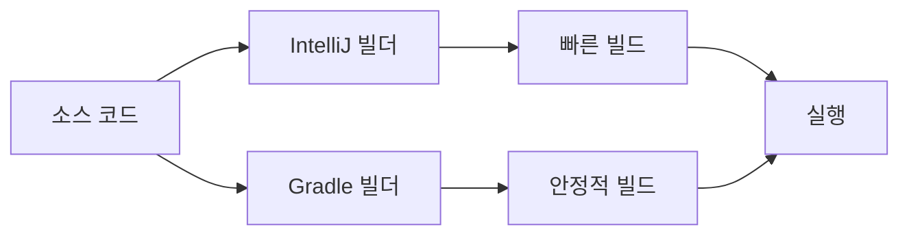
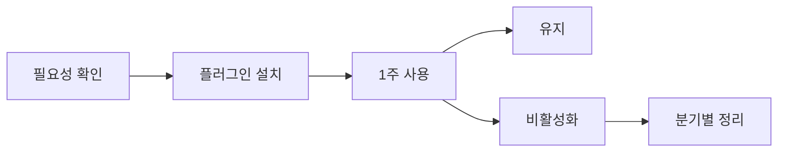
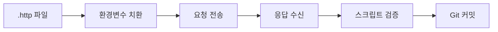
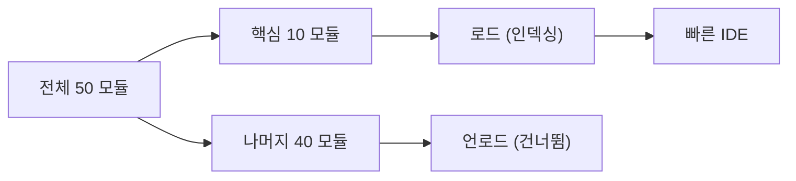

> **한 줄 요약:** IntelliJ IDEA는 코드를 이해하는 IDE다. 단순 텍스트 편집기가 아니라 AST 기반 분석 엔진 위에 디버깅·프로파일링·리팩토링·DB 연동까지 올린 백엔드 개발자의 종합 작전실이다.

---

## 1. 왜 IntelliJ인가

백엔드 개발자가 하루 8시간 이상 마주하는 도구가 IDE다. Eclipse, VS Code, NetBeans 등 선택지가 많지만, Java/Kotlin 백엔드 생태계에서 IntelliJ IDEA가 사실상 표준이 된 이유는 명확하다.

첫째, **AST(Abstract Syntax Tree) 기반 코드 분석**이다. IntelliJ는 파일을 단순 텍스트가 아니라 구문 트리로 해석한다. 그래서 "이 메서드를 호출하는 모든 곳"을 정확하게 찾고, 리팩토링할 때 관련 코드를 빠짐없이 변경한다. Eclipse의 텍스트 기반 검색과는 차원이 다르다.

둘째, **Spring/JPA/Gradle/Maven 네이티브 지원**이다. Spring Bean 간 의존관계를 그래프로 보여주고, JPA 엔티티의 테이블 매핑을 자동 검증하며, Gradle 빌드 스크립트 안에서도 자동완성이 작동한다.

셋째, **통합 도구 체인**이다. 터미널, Git, Docker, Database, HTTP Client, Profiler가 하나의 창에 들어 있다. 창 전환 없이 "코드 작성 → 디버깅 → DB 확인 → API 호출 → 성능 분석"을 할 수 있다.

> **비유:** Eclipse가 공구 세트라면, IntelliJ는 스위스 군용 칼이다. 공구 세트는 각 도구가 독립적이라 작업할 때마다 꺼내야 하지만, 스위스 군용 칼은 한 손에 쥔 채로 칼·가위·드라이버를 전환할 수 있다. IDE 전환 비용이 0에 가까운 것이 생산성의 핵심이다.


IntelliJ의 에디션은 두 가지다. **Community Edition**은 무료이며 Java/Kotlin/Gradle/Maven을 지원한다. **Ultimate Edition**은 유료이며 Spring, JPA, Database, HTTP Client, Docker, Kubernetes 지원이 추가된다. 백엔드 개발자라면 Ultimate이 사실상 필수다.

| 기능 | Community | Ultimate |
|------|-----------|----------|
| Java/Kotlin 편집 | O | O |
| Spring 지원 | X | O |
| JPA/Hibernate | X | O |
| Database Tool | X | O |
| HTTP Client | X | O |
| Docker/K8s | X | O |
| 가격(개인) | 무료 | $169/년 |

---

## 2. 필수 설정

IntelliJ를 설치하고 바로 쓰면 절반만 활용하는 것이다. 아래 설정들은 프로젝트를 열기 전에 반드시 잡아야 한다.

### 2.1 메모리 설정 (JVM Heap)

IntelliJ는 JVM 위에서 동작한다. 기본 힙 메모리는 2048MB인데, 모듈이 10개 이상인 프로젝트에서는 부족하다. 인덱싱 중 IDE가 멈추거나, GC(Garbage Collection) 때문에 타이핑이 끊긴다면 메모리 부족이 원인이다.

**설정 방법:**
`Help` → `Change Memory Settings` 또는 `idea.vmoptions` 파일을 직접 수정한다.

```
# idea64.vmoptions
-Xms1024m
-Xmx4096m
-XX:ReservedCodeCacheSize=512m
-XX:+UseG1GC
-XX:SoftRefLRUPolicyMSPerMB=50
```

`-Xmx`는 최대 힙 크기다. 16GB RAM 머신이면 4096m, 32GB면 6144m~8192m까지 설정할 수 있다. `ReservedCodeCacheSize`는 JIT 컴파일된 코드 캐시 크기로, 플러그인이 많을수록 늘려야 한다.

> **비유:** JVM 힙은 IDE의 작업 책상 크기다. 책상이 좁으면(기본 2GB) 파일을 열 때마다 이전 파일을 치워야(GC) 하고, 그동안 손이 멈춘다. 책상을 넓히면(4~8GB) 여러 파일을 동시에 펼쳐놓고 작업할 수 있다.

### 2.2 인코딩 설정

한글 깨짐을 방지하려면 프로젝트 전체를 UTF-8로 통일한다.

`Settings` → `Editor` → `File Encodings`에서 다음 세 항목을 모두 **UTF-8**로 설정한다.

```
Global Encoding:    UTF-8
Project Encoding:   UTF-8
Default encoding for properties files: UTF-8
  ✅ Transparent native-to-ascii conversion 체크
```

Properties 파일의 `Transparent native-to-ascii conversion`을 체크하면, `\uAC00` 같은 유니코드 이스케이프 대신 한글 원문이 에디터에 표시된다. 실제 파일에는 이스케이프가 저장되므로 호환성 문제도 없다.

### 2.3 Auto Import

`Settings` → `Editor` → `General` → `Auto Import`에서 두 옵션을 모두 켠다.

```
✅ Add unambiguous imports on the fly
✅ Optimize imports on the fly
```

`Add unambiguous imports on the fly`는 import 후보가 하나뿐일 때 자동으로 추가한다. `Optimize imports on the fly`는 사용하지 않는 import를 자동으로 제거한다. 이 두 설정만으로 `Alt+Enter` → import 선택을 하루에 수십 번 줄일 수 있다.

### 2.4 코드 스타일 & 저장 시 포맷팅

팀 프로젝트에서 코드 스타일이 제각각이면 PR 리뷰가 지옥이 된다. IntelliJ의 저장 시 액션으로 자동화한다.

`Settings` → `Tools` → `Actions on Save`에서 다음을 활성화한다.

```
✅ Reformat code
✅ Optimize imports
✅ Rearrange code (선택)
✅ Run code cleanup (선택)
```

코드 스타일 자체는 `Settings` → `Editor` → `Code Style` → `Java`에서 설정한다. Google Java Style이나 팀 컨벤션을 XML로 import하면 전체 팀이 동일한 포맷을 사용할 수 있다.

### 2.5 Annotation Processor

Lombok, MapStruct 등 컴파일 타임 어노테이션 프로세서를 사용한다면 반드시 활성화해야 한다.

`Settings` → `Build, Execution, Deployment` → `Compiler` → `Annotation Processors`

```
✅ Enable annotation processing
```

이 설정이 꺼져 있으면 Lombok의 `@Getter`, `@Builder`가 인식되지 않아 빨간 줄이 가득 찬다. 프로젝트를 처음 열 때 가장 흔한 실수다.

### 2.6 빌드 위임 (Build Delegation)

Gradle 프로젝트에서 빌드를 IntelliJ 내부 빌더로 할지, Gradle로 위임할지 결정한다.

`Settings` → `Build, Execution, Deployment` → `Build Tools` → `Gradle`

```
Build and run using:          IntelliJ IDEA
Run tests using:              IntelliJ IDEA
Gradle JVM:                   프로젝트와 동일한 JDK
```

IntelliJ 내부 빌더가 Gradle보다 빠르다. 단, 멀티모듈 프로젝트에서 Gradle 플러그인 의존성이 복잡하면 Gradle 위임이 안정적이다. 빌드가 이상하면 이 설정을 먼저 확인한다.



> **비유:** IntelliJ 빌더는 직통 고속도로이고, Gradle 빌더는 모든 정류장에 서는 시내버스다. 고속도로가 빠르지만, 경유지(플러그인 태스크)가 중요한 상황이면 시내버스가 정확하게 목적지에 도착한다.

---

## 3. 생산성 단축키 TOP 20

단축키를 외우는 것은 투자 대비 수익률이 가장 높은 학습이다. 하루에 1000번 마우스로 하던 작업을 키보드로 바꾸면, 일주일에 수 시간을 절약한다.

> **비유:** 단축키는 요리사의 칼 기술이다. 초보 요리사는 양파 하나 까는 데 2분 걸리지만, 숙련된 요리사는 10초 만에 다진다. 같은 레시피(코드)라도 칼 기술(단축키) 차이가 완성 시간을 결정한다.

| 순번 | 기능 | Windows/Linux | macOS | 설명 |
|------|------|---------------|-------|------|
| 1 | Search Everywhere | Shift × 2 | Shift × 2 | 파일, 클래스, 심볼, 액션 통합 검색 |
| 2 | Find Action | Ctrl+Shift+A | Cmd+Shift+A | IDE의 모든 명령을 이름으로 실행 |
| 3 | Go to Class | Ctrl+N | Cmd+O | 클래스 이름으로 바로 이동 |
| 4 | Go to File | Ctrl+Shift+N | Cmd+Shift+O | 파일 이름으로 이동 |
| 5 | Find Usages | Alt+F7 | Opt+F7 | 심볼의 모든 사용처 검색 |
| 6 | Go to Declaration | Ctrl+B | Cmd+B | 선언부로 이동 |
| 7 | Go to Implementation | Ctrl+Alt+B | Cmd+Opt+B | 인터페이스의 구현체로 이동 |
| 8 | Quick Fix | Alt+Enter | Opt+Enter | 경고/에러 자동 수정 제안 |
| 9 | Refactor This | Ctrl+Alt+Shift+T | Ctrl+T | 리팩토링 메뉴 |
| 10 | Rename | Shift+F6 | Shift+F6 | 이름 변경 (모든 참조 포함) |
| 11 | Extract Method | Ctrl+Alt+M | Cmd+Opt+M | 선택 영역을 메서드로 추출 |
| 12 | Extract Variable | Ctrl+Alt+V | Cmd+Opt+V | 선택 영역을 변수로 추출 |
| 13 | Generate | Alt+Insert | Cmd+N | 생성자, getter, equals 등 생성 |
| 14 | Reformat Code | Ctrl+Alt+L | Cmd+Opt+L | 코드 포맷팅 |
| 15 | Optimize Imports | Ctrl+Alt+O | Ctrl+Opt+O | 미사용 import 정리 |
| 16 | Comment Line | Ctrl+/ | Cmd+/ | 줄 주석 토글 |
| 17 | Duplicate Line | Ctrl+D | Cmd+D | 현재 줄 복제 |
| 18 | Delete Line | Ctrl+Y | Cmd+Delete | 현재 줄 삭제 |
| 19 | Move Line Up/Down | Alt+Shift+↑/↓ | Opt+Shift+↑/↓ | 줄 이동 |
| 20 | Recent Files | Ctrl+E | Cmd+E | 최근 열었던 파일 목록 |

**핵심 3개만 먼저 외우자:** `Shift Shift`(통합 검색), `Alt+Enter`(퀵 픽스), `Ctrl+B`(선언부 이동). 이 세 개만으로도 생산성이 50% 이상 올라간다.

### 단축키 충돌 해결

한글 IME가 활성화된 상태에서 `Shift Shift`가 한/영 전환으로 먹힐 수 있다. Windows의 경우 `설정` → `시간 및 언어` → `입력` → `고급 키보드 설정`에서 한/영 전환 키를 `우Alt`로 변경하면 충돌을 피할 수 있다.

---

## 4. 필수 플러그인 10선

IntelliJ의 플러그인 생태계는 방대하다. 하지만 모든 플러그인을 설치하면 IDE가 무거워진다. 백엔드 개발자에게 실질적으로 도움이 되는 10개를 엄선했다.

| 순번 | 플러그인 | 핵심 기능 | 무료 여부 | 추천 이유 |
|------|----------|-----------|-----------|-----------|
| 1 | Lombok | @Getter 등 인식 | 무료 (내장) | Lombok 없는 Java 프로젝트는 없다 |
| 2 | SonarLint | 정적 분석 | 무료 | 커밋 전에 코드 냄새를 잡아준다 |
| 3 | GitToolBox | Git 상태 표시 | 무료 | 에디터에서 blame, 브랜치 상태 확인 |
| 4 | Key Promoter X | 단축키 학습 | 무료 | 마우스 사용 시 단축키 알려줌 |
| 5 | Rainbow Brackets | 괄호 색상 구분 | 무료 | 중첩 괄호 가독성 향상 |
| 6 | String Manipulation | 문자열 변환 | 무료 | camelCase↔snake_case 등 변환 |
| 7 | JPA Buddy | JPA 엔티티 관리 | 부분 유료 | 엔티티 생성, DDL, Flyway 연동 |
| 8 | MapStruct Support | 매핑 자동완성 | 무료 | DTO 매핑 코드 네비게이션 |
| 9 | Docker | 컨테이너 관리 | 무료 (내장) | Dockerfile, Compose 지원 |
| 10 | .env files | 환경변수 지원 | 무료 | .env 파일 구문 강조, 자동완성 |

### 플러그인 설치 원칙

플러그인은 **필요할 때만** 설치한다. 설치된 플러그인이 많을수록 IDE 시작 시간이 길어지고, 메모리 사용량이 증가하며, 플러그인 간 충돌 가능성이 높아진다. 분기별로 `Settings` → `Plugins`에서 사용하지 않는 플러그인을 비활성화하거나 삭제하는 것을 권장한다.



> **비유:** 플러그인은 스마트폰 앱과 같다. 설치할 때는 "이거 꼭 써야지"라고 생각하지만, 3개월 후에는 대부분 열지 않는다. 백그라운드에서 배터리(메모리)만 잡아먹는 앱은 과감하게 삭제해야 폰(IDE)이 빨라진다.

<details><summary><strong>면접 포인트 1️⃣ IntelliJ의 코드 분석 방식</strong></summary>

Q. IntelliJ가 Eclipse보다 정확한 리팩토링을 제공하는 기술적 이유는 무엇인가?

A. IntelliJ는 소스 코드를 텍스트가 아니라 **PSI(Program Structure Interface)** 트리로 파싱한다. PSI는 AST의 IntelliJ 확장판으로, 주석·공백까지 포함한 완전한 구문 트리다. 리팩토링 시 PSI 트리를 순회하면서 의미적으로 동일한 참조를 식별하므로, 같은 이름의 다른 심볼을 잘못 변경하는 오류가 발생하지 않는다. Eclipse의 JDT(Java Development Tools)도 AST를 사용하지만, IntelliJ의 PSI는 증분 파싱(incremental parsing)이 더 정교하여 대규모 프로젝트에서 성능 우위를 보인다.

</details>

---

## 5. 디버깅 심화

`System.out.println`으로 디버깅하는 시대는 끝났다. IntelliJ의 디버거는 실행 중인 프로그램의 내부 상태를 실시간으로 관찰하고, 조건부로 멈추고, 값을 즉석에서 변경할 수 있는 강력한 도구다.

### 5.1 Conditional Breakpoint

특정 조건일 때만 멈추는 브레이크포인트다. 반복문에서 10000번째 반복만 확인하고 싶을 때, 일반 브레이크포인트를 걸면 9999번 Resume을 눌러야 한다. Conditional Breakpoint는 조건식이 true일 때만 멈춘다.

**설정 방법:** 브레이크포인트를 우클릭하고 `Condition` 필드에 Java 표현식을 입력한다.

```java
// 예: i == 9999 일 때만 멈춤
for (int i = 0; i < 10000; i++) {
    processItem(items.get(i));  // 브레이크포인트 + Condition: i == 9999
}

// 예: 특정 사용자일 때만 멈춤
public void handleRequest(User user) {
    // Condition: "admin".equals(user.getRole())
    processUser(user);
}
```

### 5.2 Evaluate Expression

디버그 모드에서 멈춘 상태에서 임의의 Java 표현식을 실행할 수 있다. `Alt+F8`을 누르면 Evaluate 창이 열린다.

```java
// 현재 스코프의 변수를 활용한 표현식
user.getOrders().stream()
    .filter(o -> o.getAmount() > 10000)
    .collect(Collectors.toList())

// 메서드 호출도 가능
userRepository.findById(userId)

// 값 변경도 가능 (주의: 실행 중인 프로그램에 영향)
user.setName("테스트")
```

> **비유:** Evaluate Expression은 수술 중 내시경이다. 환자(프로그램)를 열어놓은(멈춘) 상태에서, 원하는 부위(변수)를 카메라(표현식)로 들여다보고, 필요하면 조직(값)을 즉석에서 제거하거나 교체할 수 있다.

### 5.3 Non-Suspending Breakpoint (Logging Breakpoint)

프로그램을 멈추지 않고, 브레이크포인트에 도달할 때마다 콘솔에 로그를 출력한다. `println` 디버깅을 코드 수정 없이 할 수 있다.

**설정 방법:** 브레이크포인트 우클릭 → `Suspend` 체크 해제 → `Log` 섹션에서 `"Breakpoint hit"` 또는 `Evaluate and log` 활성화

```java
// 브레이크포인트에 Evaluate and log: "userId=" + userId + ", amount=" + order.getAmount()
public void processOrder(Long userId, Order order) {
    // ... 로직
}
// 콘솔 출력: userId=42, amount=15000
```

### 5.4 Remote Debug

운영 서버가 아닌 개발/스테이징 서버에서 실행 중인 애플리케이션에 원격으로 디버거를 연결한다. Docker 컨테이너 안의 Spring Boot 앱도 디버깅할 수 있다.

**대상 서버 JVM 옵션:**

```bash
java -agentlib:jdwp=transport=dt_socket,server=y,suspend=n,address=*:5005 \
     -jar myapp.jar
```

**Docker Compose 예시:**

```yaml
services:
  app:
    image: myapp:latest
    ports:
      - "8080:8080"
      - "5005:5005"    # 디버그 포트 노출
    environment:
      JAVA_TOOL_OPTIONS: "-agentlib:jdwp=transport=dt_socket,server=y,suspend=n,address=*:5005"
```

**IntelliJ 설정:** `Run` → `Edit Configurations` → `+` → `Remote JVM Debug` → Host: `localhost`, Port: `5005`


> **비유:** Remote Debug는 원격 진료다. 의사(개발자)가 환자(서버) 옆에 없어도, 화상 연결(JDWP 프로토콜)로 환자의 상태(변수, 스택)를 실시간으로 보고 처방(값 변경)을 내릴 수 있다.

### 5.5 Watch & Stream Debugger

**Watch**는 특정 변수나 표현식을 디버그 패널에 고정해서 계속 추적하는 기능이다. `Variables` 패널에서 `+` 버튼으로 표현식을 추가하면, 스텝을 밟을 때마다 값이 자동 갱신된다.

**Stream Debugger**는 Java Stream 파이프라인의 각 단계별 데이터 흐름을 시각화한다. `filter` → `map` → `collect` 과정에서 어떤 요소가 걸러지고, 변환되는지를 표 형태로 보여준다.

```java
List<String> names = users.stream()
    .filter(u -> u.getAge() > 20)       // 몇 명이 통과?
    .map(User::getName)                  // 이름이 뭐로 변환?
    .sorted()                            // 정렬 결과는?
    .collect(Collectors.toList());       // 여기에 브레이크포인트
// 디버그 시 "Trace Current Stream Chain" 버튼 클릭
```

<details><summary><strong>면접 포인트 2️⃣ JDWP 프로토콜과 보안</strong></summary>

Q. Remote Debug를 프로덕션 환경에서 사용하면 안 되는 이유는?

A. JDWP(Java Debug Wire Protocol)는 인증/암호화 메커니즘이 없다. 디버그 포트가 열려 있으면 누구나 연결하여 변수 값을 읽거나, 임의 코드를 실행(Evaluate Expression)할 수 있다. 이는 **원격 코드 실행(RCE) 취약점**과 동일하다. 또한 `suspend=y` 옵션이 설정되면 디버거가 연결될 때까지 JVM이 멈추므로, 서비스 장애를 유발한다. 개발/스테이징 환경에서만 사용하고, 방화벽으로 디버그 포트를 차단해야 한다.

</details>

---

## 6. 프로파일링

코드가 느리다면, 어디가 느린지 알아야 고칠 수 있다. 감이 아니라 데이터로 병목을 찾는 것이 프로파일링이다.

### 6.1 내장 Profiler

IntelliJ Ultimate 2024.1부터 **내장 프로파일러**를 제공한다. 별도 도구 설치 없이 `Run` → `Run with Profiler`로 실행하면, CPU/메모리 사용량을 Flame Graph로 시각화한다.

**사용 방법:**
1. 실행 구성 옆의 드롭다운에서 `Profile` 선택
2. 애플리케이션 실행 후 문제 시나리오 재현
3. 프로파일링 종료 → Flame Graph 자동 표시

**Flame Graph 읽는 법:**
- 가로 축: CPU 점유 시간 비율
- 세로 축: 콜 스택 깊이 (아래가 진입점, 위가 실제 실행 메서드)
- 넓은 막대: 해당 메서드가 오래 걸렸다는 의미
- 같은 색상: 같은 패키지

```java
// 프로파일링으로 발견하는 전형적인 병목
public List<OrderDto> getOrders(Long userId) {
    List<Order> orders = orderRepository.findByUserId(userId); // DB 호출
    return orders.stream()
        .map(order -> {
            // N+1 문제: 주문마다 추가 쿼리 발생
            User user = userRepository.findById(order.getUserId());
            return OrderDto.from(order, user);
        })
        .collect(Collectors.toList());
}
```

> **비유:** Flame Graph는 건물의 열화상 카메라 영상이다. 벽(콜 스택) 어디에서 열(CPU 시간)이 새는지 색깔로 한눈에 보인다. 빨간 부분(넓은 막대)을 단열(최적화)하면 전체 온도(응답 시간)가 내려간다.

### 6.2 Async Profiler

IntelliJ의 내장 프로파일러 엔진은 **Async Profiler**다. 이 도구는 JVM의 safepoint bias 문제를 회피하는 **async-safe 샘플링** 방식을 사용한다.

기존 JVM 프로파일러(`-agentlib:hprof`)는 safepoint에서만 스택을 수집하므로, GC나 락 대기 시간이 실제보다 과소평가된다. Async Profiler는 OS 시그널(`SIGPROF`)을 사용해 임의 시점에 스택을 수집하므로 더 정확하다.

**CLI에서 직접 사용하기:**

```bash
# 프로파일링 시작 (30초)
./profiler.sh -d 30 -f /tmp/flamegraph.html -o flamegraph <PID>

# 메모리 할당 프로파일링
./profiler.sh -d 30 -e alloc -f /tmp/alloc.html <PID>

# Wall-clock 프로파일링 (I/O 대기 시간 포함)
./profiler.sh -d 30 -e wall -f /tmp/wall.html <PID>
```

| 이벤트 타입 | 용도 | 설명 |
|-------------|------|------|
| cpu | CPU 병목 | 실제 CPU를 사용하는 시간만 측정 |
| wall | I/O 병목 | 대기 시간 포함한 전체 시간 측정 |
| alloc | 메모리 병목 | 힙 할당이 많은 메서드 식별 |
| lock | 락 경합 | 모니터 락 대기가 긴 구간 식별 |


<details><summary><strong>면접 포인트 3️⃣ Safepoint Bias</strong></summary>

Q. 전통적인 JVM 프로파일러의 safepoint bias 문제란 무엇이며, Async Profiler는 이를 어떻게 해결하는가?

A. JVM은 GC, 디옵티마이제이션 등을 위해 모든 스레드가 안전한 지점(safepoint)에 도달할 때까지 기다린다. 전통적인 프로파일러(`JVisualVM`, `hprof`)는 safepoint에서만 스택 트레이스를 수집하므로, safepoint 사이의 핫 루프가 샘플에 잡히지 않는 **bias** 문제가 있다. Async Profiler는 `perf_events`(Linux) 또는 `SIGPROF`를 사용해 safepoint와 무관하게 스택을 수집한다. 이를 통해 JIT 컴파일된 핫 루프 내부의 실제 CPU 사용 분포를 정확하게 측정할 수 있다.

</details>

---

## 7. Database 연동

IntelliJ Ultimate의 Database Tool은 별도 DB 클라이언트(DBeaver, DataGrip)가 필요 없을 정도로 강력하다. 코드를 작성하면서 바로 옆 패널에서 쿼리를 실행하고, 결과를 확인하고, 스키마를 탐색할 수 있다.

### 7.1 데이터소스 설정

`View` → `Tool Windows` → `Database` → `+` → `Data Source` → 원하는 DB 선택

```
Host:     localhost
Port:     3306
Database: mydb
User:     root
Password: ****
URL:      jdbc:mysql://localhost:3306/mydb
```

드라이버는 IntelliJ가 자동 다운로드한다. `Test Connection` 버튼으로 연결을 확인한다.

### 7.2 SQL 자동완성

JPA 엔티티의 `@Table`, `@Column` 어노테이션과 실제 DB 스키마를 매핑하여, JPQL/Native Query 안에서 테이블명·컬럼명 자동완성을 제공한다.

```java
@Query("SELECT u FROM User u WHERE u.email = :email")
// "u." 입력 시 User 엔티티의 필드명 자동완성
// "User" 입력 시 @Entity(name) 또는 클래스명 자동완성
```

### 7.3 콘솔에서 쿼리 실행

Database 패널에서 테이블을 더블클릭하면 데이터 뷰어가 열리고, 콘솔에서 SQL을 직접 작성·실행할 수 있다. `Ctrl+Enter`로 현재 문장을 실행하고, `Ctrl+Shift+Enter`로 전체 스크립트를 실행한다.

```sql
-- 실행 계획 확인 (MySQL)
EXPLAIN ANALYZE
SELECT u.name, COUNT(o.id)
FROM users u
LEFT JOIN orders o ON u.id = o.user_id
WHERE u.created_at > '2026-01-01'
GROUP BY u.name
HAVING COUNT(o.id) > 5;
```

결과는 테이블 형태로 표시되며, CSV/JSON/SQL INSERT 등으로 내보내기가 가능하다. 스키마 다이어그램도 자동 생성되므로, ERD 도구 없이 테이블 간 관계를 시각적으로 파악할 수 있다.

> **비유:** IntelliJ의 Database Tool은 요리사의 주방에 설치된 냉장고 내부 카메라다. 요리(코딩) 중에 자리를 옮기지 않고도 냉장고(DB) 안에 뭐가 있는지 화면으로 확인하고, 재료(데이터)를 꺼내올 수 있다.

---

## 8. HTTP Client

Postman 대신 IntelliJ 내장 HTTP Client를 사용하면, API 테스트 코드를 `.http` 파일로 관리하고 Git에 커밋할 수 있다. 팀원 전체가 같은 API 테스트 세트를 공유하게 된다.

### 8.1 기본 사용법

프로젝트 루트에 `http` 디렉토리를 만들고 `.http` 파일을 생성한다.

```http
### 사용자 조회
GET http://localhost:8080/api/users/1
Accept: application/json

### 사용자 생성
POST http://localhost:8080/api/users
Content-Type: application/json

{
  "name": "김철수",
  "email": "kim@example.com",
  "age": 30
}

### 토큰 발급 후 인증 API 호출
POST http://localhost:8080/api/auth/login
Content-Type: application/json

{
  "username": "admin",
  "password": "1234"
}

> 

### 인증이 필요한 API
GET http://localhost:8080/api/admin/dashboard
Authorization: Bearer {{token}}
```

### 8.2 환경 변수

`http-client.env.json` 파일로 환경별 변수를 관리한다.

```json
{
  "dev": {
    "host": "http://localhost:8080",
    "token": "dev-token-123"
  },
  "staging": {
    "host": "https://staging-api.example.com",
    "token": "stg-token-456"
  }
}
```

```http
### 환경 변수 사용
GET {{host}}/api/users
Authorization: Bearer {{token}}
```

실행 시 상단에서 환경(dev/staging)을 선택하면 해당 변수가 치환된다.

### 8.3 응답 검증 스크립트

HTTP Client는 JavaScript 기반 테스트 스크립트를 지원한다.

```http
### 사용자 조회 + 응답 검증
GET http://localhost:8080/api/users/1

> 
```

> **비유:** Postman이 독립된 실험실이라면, IntelliJ HTTP Client는 연구실 옆에 붙은 미니 실험대다. 코드를 고치자마자(연구) 바로 옆에서 API를 쏘고(실험) 결과를 확인한다. 실험실까지 걸어가는(앱 전환) 시간이 사라진다.



---

## 9. 리팩토링 기능

IntelliJ의 리팩토링은 단순 텍스트 치환이 아니다. PSI 트리를 기반으로 의미론적 변환을 수행하므로, 이름이 같지만 다른 스코프의 심볼을 구분하고, 관련 import·JavaDoc·테스트 코드까지 함께 변경한다.

### 9.1 주요 리팩토링 기능

| 기능 | 단축키 | 설명 |
|------|--------|------|
| Rename | Shift+F6 | 변수, 메서드, 클래스 이름 변경 |
| Extract Method | Ctrl+Alt+M | 코드 블록을 메서드로 추출 |
| Extract Variable | Ctrl+Alt+V | 표현식을 변수로 추출 |
| Extract Constant | Ctrl+Alt+C | 매직 넘버를 상수로 추출 |
| Extract Field | Ctrl+Alt+F | 로컬 변수를 필드로 승격 |
| Extract Interface | - | 클래스에서 인터페이스 추출 |
| Inline | Ctrl+Alt+N | 변수/메서드를 인라인화 |
| Move | F6 | 클래스/메서드를 다른 패키지로 이동 |
| Change Signature | Ctrl+F6 | 메서드 시그니처 변경 |
| Safe Delete | Alt+Delete | 사용처 확인 후 안전 삭제 |

### 9.2 실전 리팩토링 시나리오

**시나리오: 서비스 메서드가 100줄이 넘어 가독성이 떨어질 때**

```java
// Before: 100줄짜리 메서드
public OrderResponse createOrder(OrderRequest request) {
    // 1. 입력 검증 (20줄)
    if (request.getItems() == null || request.getItems().isEmpty()) {
        throw new IllegalArgumentException("주문 항목이 비어있습니다");
    }
    // ... 검증 로직 20줄

    // 2. 재고 확인 (25줄)
    for (OrderItem item : request.getItems()) {
        Stock stock = stockRepository.findByProductId(item.getProductId());
        if (stock.getQuantity() < item.getQuantity()) {
            throw new OutOfStockException(item.getProductId());
        }
    }
    // ... 재고 로직 25줄

    // 3. 주문 생성 (30줄)
    // ... 주문 생성 로직 30줄

    // 4. 알림 발송 (25줄)
    // ... 알림 로직 25줄
}
```

각 블록을 선택하고 `Ctrl+Alt+M`(Extract Method)을 적용한다.

```java
// After: 각 책임이 분리된 메서드
public OrderResponse createOrder(OrderRequest request) {
    validateRequest(request);
    checkStock(request.getItems());
    Order order = buildOrder(request);
    sendNotification(order);
    return OrderResponse.from(order);
}
```

> **비유:** Extract Method는 긴 편지를 목차가 있는 보고서로 바꾸는 것이다. 편지는 처음부터 끝까지 읽어야 내용을 파악하지만, 보고서는 목차(메서드 이름)만 봐도 전체 흐름이 보인다. 세부 내용이 궁금하면 해당 장(메서드)만 펼치면 된다.

### 9.3 Safe Delete 활용

코드를 삭제할 때 `Delete` 키 대신 `Alt+Delete`(Safe Delete)를 사용하면, IntelliJ가 해당 심볼의 사용처를 검색하여 안전하게 삭제할 수 있는지 확인한다. 다른 곳에서 참조 중이면 경고를 표시하고, 사용처 목록을 보여준다.

---

## 10. 실무에서 자주 하는 실수 TOP 5

### 실수 1: Gradle 캐시 꼬임을 코드 문제로 착각

**증상:** 코드는 맞는데 빌드가 실패한다. 클래스를 못 찾거나, 이미 수정한 에러가 계속 나온다.

**원인:** Gradle의 빌드 캐시나 IntelliJ의 인덱스 캐시가 꼬인 상태다.

**해결:**

```
1. File → Invalidate Caches → Invalidate and Restart
2. 그래도 안 되면:
   - .idea 디렉토리 삭제
   - .gradle 디렉토리 삭제
   - 프로젝트 다시 열기 (Import)
```

이 순서를 외워두면 "잘 되던 게 갑자기 안 될 때" 90%를 해결할 수 있다.

### 실수 2: JDK 버전 불일치

**증상:** 터미널에서는 빌드되지만, IntelliJ에서는 "language level is not supported" 에러가 난다.

**원인:** IntelliJ의 프로젝트 JDK와 시스템 JDK가 다르다.

**해결:**

```
1. File → Project Structure → Project → SDK → 올바른 JDK 선택
2. File → Project Structure → Modules → 각 모듈의 Language Level 확인
3. Settings → Build → Gradle → Gradle JVM → 동일 JDK 지정
```

세 곳의 JDK 설정이 모두 일치해야 한다. 멀티모듈 프로젝트에서는 모듈마다 다를 수 있으므로 하나씩 확인한다.

### 실수 3: Annotation Processor 미활성화

**증상:** Lombok의 `@Getter`, `@Builder`에 빨간 줄이 뜨고, 컴파일 시 "cannot find symbol" 에러가 난다.

**원인:** 섹션 2.5에서 설명한 Annotation Processor가 꺼져 있다.

**해결:** `Settings` → `Build, Execution, Deployment` → `Compiler` → `Annotation Processors` → `Enable annotation processing` 체크. 프로젝트를 Clone 받을 때마다 확인해야 하는 필수 설정이다.

### 실수 4: Git 브랜치 전환 후 인덱스 오류

**증상:** 브랜치를 전환하면 존재하지 않는 파일에서 에러가 발생하거나, 새 파일이 인식되지 않는다.

**원인:** IntelliJ의 파일 인덱스가 브랜치 전환 전 상태를 유지하고 있다.

**해결:** IntelliJ 내에서 `VCS` → `Git` → `Checkout`으로 브랜치를 전환하면 인덱스가 자동 갱신된다. 터미널에서 `git checkout`으로 전환했다면, `File` → `Reload All from Disk` (`Ctrl+Alt+Y`)를 실행한다.

### 실수 5: 느린 IDE를 기능 끄기로 해결하려 함

**증상:** IDE가 느려서 Code Inspection, Auto Import, Background Compilation을 모두 끈다.

**원인:** 메모리 부족이 근본 원인인데, 증상(기능)을 끄고 있다.

**해결:**

```
1. Help → Diagnostic Tools → Activity Monitor 확인
2. 힙 사용량 확인: 우하단 메모리 표시기 활성화
   Settings → Appearance → Show memory indicator
3. -Xmx 값을 물리 메모리의 1/4~1/3 수준으로 증가
4. 불필요한 플러그인 비활성화
5. 대규모 프로젝트: Power Save Mode 활용 (File → Power Save Mode)
```

> **비유:** IDE가 느리다고 기능을 끄는 것은, 차가 느리다고 에어컨·라디오·조명을 끄는 것과 같다. 진짜 원인은 엔진(메모리)이 작은 것이다. 엔진을 키우면 에어컨을 켜도 잘 달린다.

---

## 11. 극한 시나리오 대처법

### 11.1 대규모 프로젝트 (모듈 50개 이상)

모듈이 50개를 넘는 모놀리식 프로젝트에서는 IDE가 전체 프로젝트를 인덱싱하는 데 수 분이 걸리고, 메모리 사용량이 6~8GB에 달한다.

**대처법:**

```
1. 메모리 확장: -Xmx8192m 이상
2. 불필요한 모듈 언로드:
   File → Project Structure → Modules → 불필요 모듈 우클릭 → Unload
3. Custom Scope 활용:
   Settings → Appearance → Scopes → 작업 중인 모듈만 포함하는 Scope 생성
4. Shared Index (IDE 설정):
   Settings → Tools → Shared Indexes → Download shared indexes
5. .idea/modules.xml에서 불필요 모듈 제거
```

모듈 50개 중 실제로 자주 수정하는 것은 5~10개다. 나머지 40개를 Unload하면 인덱싱 시간이 70% 이상 줄어든다.



### 11.2 메모리 부족 (OutOfMemoryError)

IntelliJ 자체가 OOME를 발생시키면 IDE가 멈추거나 강제 종료된다.

**즉시 대응:**

```
1. 우하단 메모리 바 더블클릭 → 강제 GC 실행
2. File → Invalidate Caches (캐시 초기화)
3. idea64.vmoptions에서 -Xmx 증가
```

**구조적 해결:**

```
1. 열린 탭 수 제한: Settings → Editor → General → Editor Tabs
   → Tab limit: 15 (기본 무제한은 메모리 낭비)
2. 코드 분석 범위 축소:
   Settings → Editor → Inspections → Profile: Syntax Only
3. Large File 제외:
   .idea/misc.xml에 대용량 생성 파일 패턴 추가
```

### 11.3 느린 인덱싱

프로젝트를 열 때마다 인덱싱이 5분 이상 걸린다면, 다음을 확인한다.

**원인 진단:**
`Help` → `Diagnostic Tools` → `Activity Monitor`에서 어떤 작업이 CPU를 점유하는지 확인한다.

```
흔한 원인:
1. node_modules, build, .gradle 등 생성 디렉토리가 인덱싱 대상에 포함
2. 대용량 로그 파일이 프로젝트 안에 존재
3. 심볼릭 링크가 순환 참조
```

**해결:**

```
1. 디렉토리 제외:
   프로젝트 트리에서 node_modules 우클릭 → Mark Directory as → Excluded
2. .idea/misc.xml에 제외 패턴 추가
3. Shared Indexes 활성화 (JDK/라이브러리 인덱스 다운로드)
4. SSD 사용 (HDD에서는 인덱싱이 5~10배 느림)
```

> **비유:** 인덱싱은 도서관의 목록 카드 작성이다. 도서관(프로젝트)에 잡지·전단지·쓰레기(node_modules, 로그 파일)까지 섞여 있으면, 사서(인덱서)가 모든 것을 일일이 분류해야 하므로 시간이 오래 걸린다. 잡지와 쓰레기를 별도 창고(Excluded)로 옮기면 사서는 진짜 책(소스 코드)만 분류하면 된다.

### 11.4 원격 개발 환경 (Gateway)

로컬 머신의 성능이 부족하면 IntelliJ **Gateway**를 사용하여 원격 서버에서 코드를 빌드·인덱싱하고, 로컬에는 UI만 표시할 수 있다.

```
로컬 (IntelliJ Gateway Client)
    ↕ SSH Tunnel
원격 서버 (IntelliJ Backend + 프로젝트 코드)
```

원격 서버에 32GB RAM, 16 코어가 있다면 모듈 50개짜리 프로젝트도 쾌적하게 작업할 수 있다. 네트워크 지연(latency)이 50ms 이하여야 타이핑이 자연스럽다.

---

## 12. 유용한 숨은 기능

### 12.1 Local History

Git 커밋 없이도 IntelliJ가 자동으로 파일 변경 이력을 저장한다. 실수로 코드를 날렸을 때 생명줄이 된다.

`파일 우클릭` → `Local History` → `Show History`

최대 5일간의 변경 이력을 보여주며, 특정 시점으로 되돌릴 수 있다. Git과 달리 커밋하지 않은 변경사항도 추적한다.

### 12.2 Scratch File

임시로 코드를 테스트하고 싶을 때 `Ctrl+Alt+Shift+Insert`로 Scratch 파일을 만든다. Java, SQL, JSON, HTTP 등 모든 형식을 지원한다. 프로젝트에 영향을 주지 않으면서 코드 조각을 실행할 수 있다.

```java
// Scratch 파일에서 빠르게 정규식 테스트
public class Scratch {
    public static void main(String[] args) {
        String pattern = "\\d{3}-\\d{4}-\\d{4}";
        System.out.println("010-1234-5678".matches(pattern)); // true
        System.out.println("01012345678".matches(pattern));   // false
    }
}
```

### 12.3 Postfix Completion

변수 뒤에 `.`을 찍고 키워드를 입력하면 코드 템플릿이 적용된다.

```java
// "user.null" + Tab → if (user == null) { }
// "user.notnull" + Tab → if (user != null) { }
// "items.for" + Tab → for (Item item : items) { }
// "items.fori" + Tab → for (int i = 0; i < items.size(); i++) { }
// "value.sout" + Tab → System.out.println(value);
// "value.return" + Tab → return value;
// "expression.var" + Tab → var result = expression;
```

### 12.4 Live Templates

자주 쓰는 코드 패턴을 약어로 등록한다. `Settings` → `Editor` → `Live Templates`에서 커스텀 템플릿을 추가할 수 있다.

```java
// 기본 제공 템플릿
// "psvm" + Tab → public static void main(String[] args) { }
// "sout" + Tab → System.out.println();
// "psfs" + Tab → public static final String

// 커스텀 템플릿 예시 (slf4j 로거 선언)
// 약어: "log"
// 템플릿: private static final Logger log = LoggerFactory.getLogger($CLASS$.class);
// $CLASS$ → className() 함수 바인딩
```

> **비유:** Live Template은 요리의 밀키트(Meal Kit)다. 매번 재료를 하나씩 사서 손질(타이핑)하는 대신, 미리 손질된 재료(템플릿)를 꺼내 바로 조리(코딩)한다. 반복 작업이 많은 백엔드 코드(Controller, Service, DTO)에서 특히 효과적이다.

---

## 13. Git 통합 활용

IntelliJ의 Git 통합은 커맨드라인 Git보다 시각적이고 실수가 적다.

### 13.1 Interactive Rebase

`Git` → `Log` 탭에서 커밋 히스토리를 시각적으로 보고, 커밋을 드래그해서 순서를 변경하거나, squash/fixup/drop을 적용할 수 있다.

### 13.2 Partial Commit (Changelist)

하나의 파일에서 특정 줄만 커밋하고 나머지는 남겨둘 수 있다. `Commit` 창에서 변경된 줄 옆의 체크박스로 커밋할 hunk를 선택한다. CLI에서 `git add -p`에 해당하는 기능이지만, GUI로 훨씬 직관적이다.

### 13.3 Shelve & Stash

작업 중인 변경사항을 임시로 보관하는 두 가지 방법이다.

| 기능 | Shelve | Stash |
|------|--------|-------|
| 저장 위치 | IntelliJ 내부 | Git 저장소 |
| 팀 공유 | 불가 | 가능 (push 시) |
| 부분 선택 | 가능 | 제한적 |
| 다른 IDE | 불가 | 가능 |

---

## 14. 면접 포인트

<details><summary><strong>면접 포인트 4️⃣ IntelliJ의 인덱싱 메커니즘</strong></summary>

Q. IntelliJ가 프로젝트를 열 때 인덱싱을 하는 이유는 무엇이며, 인덱싱이 제공하는 기능은?

A. IntelliJ는 프로젝트의 모든 파일을 파싱하여 **역 인덱스(inverted index)**를 구축한다. 이 인덱스는 "심볼 → 해당 심볼이 선언/사용된 위치" 매핑이다. 인덱싱 덕분에 `Go to Class`(Ctrl+N)로 수만 개 클래스 중 하나를 밀리초 만에 찾고, `Find Usages`(Alt+F7)로 메서드의 모든 호출처를 즉시 나열할 수 있다. 인덱스가 없다면 매번 전체 파일을 grep해야 하므로 대규모 프로젝트에서는 수십 초가 걸릴 것이다. 인덱스는 파일 변경 시 **증분 갱신(incremental update)**되므로, 최초 인덱싱 이후에는 빠르게 유지된다.

</details>

<details><summary><strong>면접 포인트 5️⃣ IDE와 빌드 도구의 관계</strong></summary>

Q. IntelliJ에서 "Build and run using: IntelliJ IDEA"와 "Build and run using: Gradle"의 차이는?

A. IntelliJ 내부 빌더는 **변경된 파일만 증분 컴파일**하므로 속도가 빠르다. 하지만 Gradle 빌드 스크립트의 커스텀 태스크(코드 생성, 리소스 처리 등)는 실행하지 않는다. Gradle 위임은 `build.gradle`에 정의된 모든 태스크를 순서대로 실행하므로 결과가 CI/CD 환경과 동일하지만, Gradle 데몬 기동과 태스크 그래프 해석에 오버헤드가 있다. 실무에서는 **개발 중에는 IntelliJ 빌더**로 빠르게 반복하고, **최종 확인과 CI에서는 Gradle 빌드**를 사용하여 두 방식의 장점을 취하는 것이 일반적이다.

</details>

---

## 15. 정리

IntelliJ IDEA는 설치 직후가 아니라, 설정을 마친 후부터 진짜 힘을 발휘한다. 메모리를 충분히 할당하고, 인코딩을 통일하고, Auto Import와 Actions on Save를 켜는 것은 5분이면 끝나지만, 그 5분이 앞으로 수천 시간의 개발 경험을 바꾼다.

단축키는 한 번에 외우지 않아도 된다. **Key Promoter X** 플러그인이 마우스를 쓸 때마다 단축키를 알려주므로, 자연스럽게 몸에 익힌다. 디버거와 프로파일러는 평소에 익혀두어야 장애 상황에서 당황하지 않는다. `println` 디버깅과 감에 의존한 최적화에서 벗어나, 데이터 기반으로 문제를 해결하는 습관을 기르자.


IDE는 도구이고, 도구는 익숙해질수록 투명해진다. IntelliJ가 투명해지면, 개발자는 도구가 아니라 문제 자체에 집중할 수 있다. 그것이 IDE 숙련의 궁극적 목표다.
