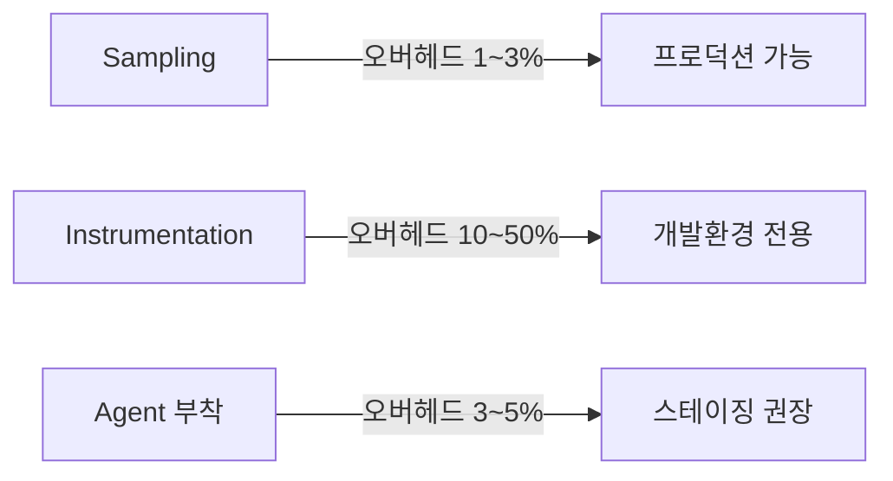
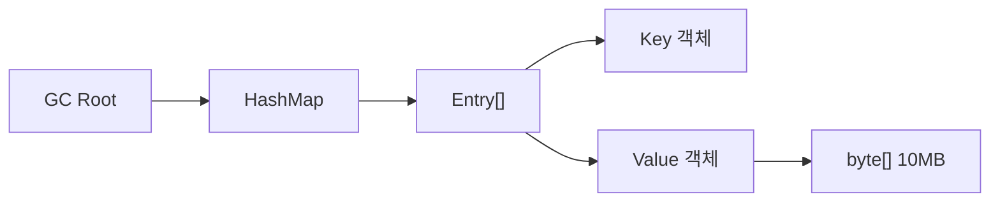
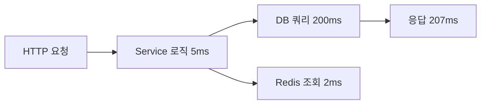
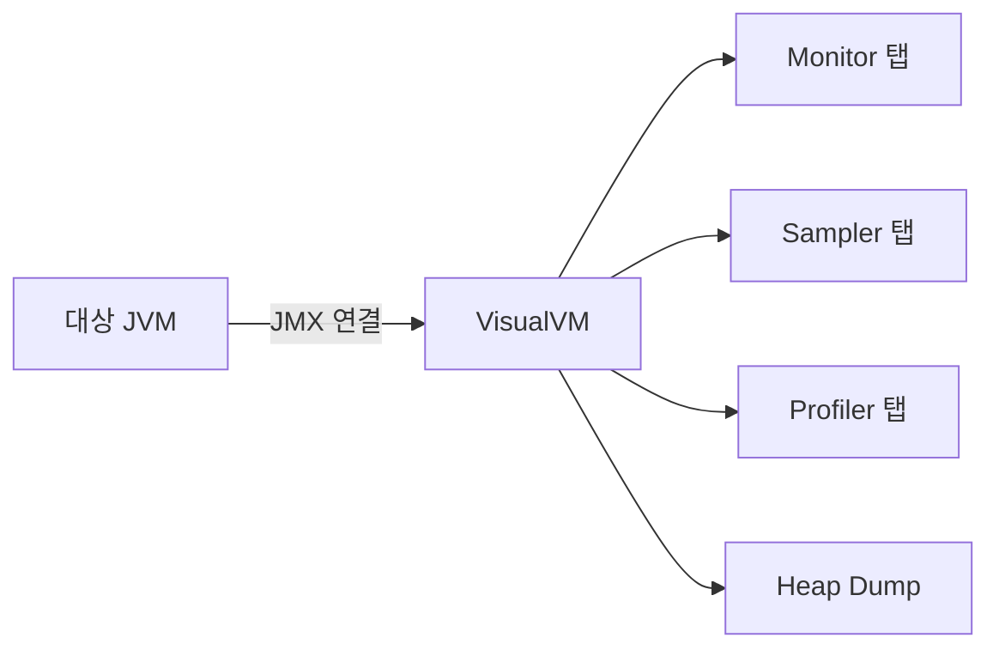
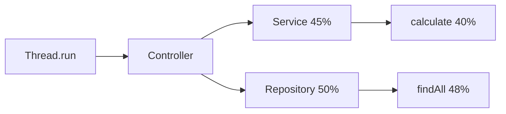
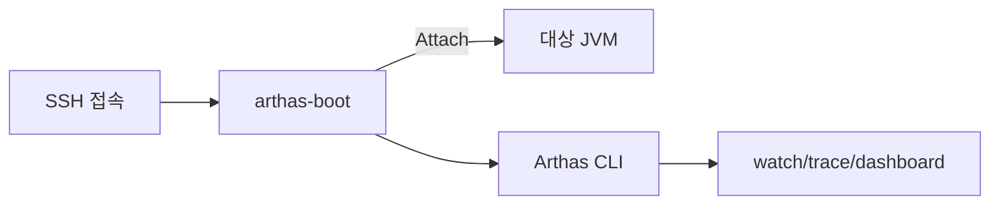
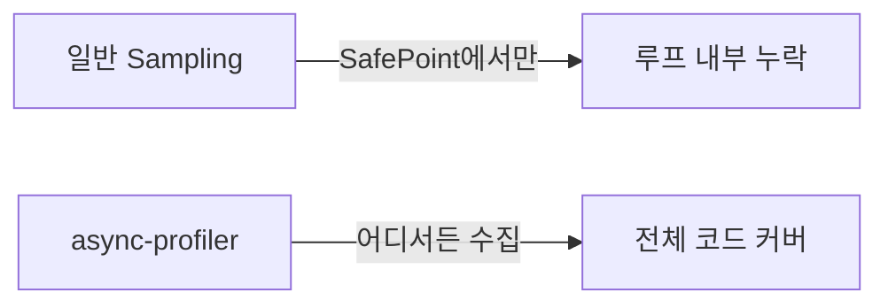
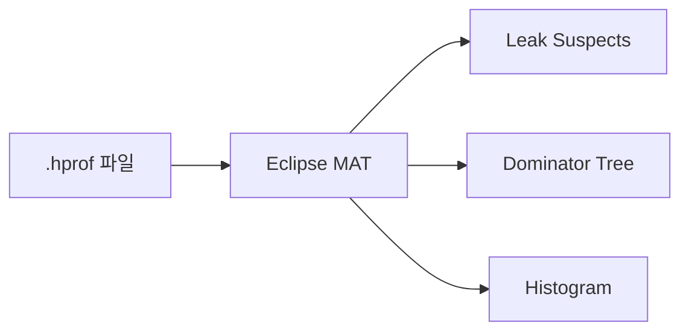
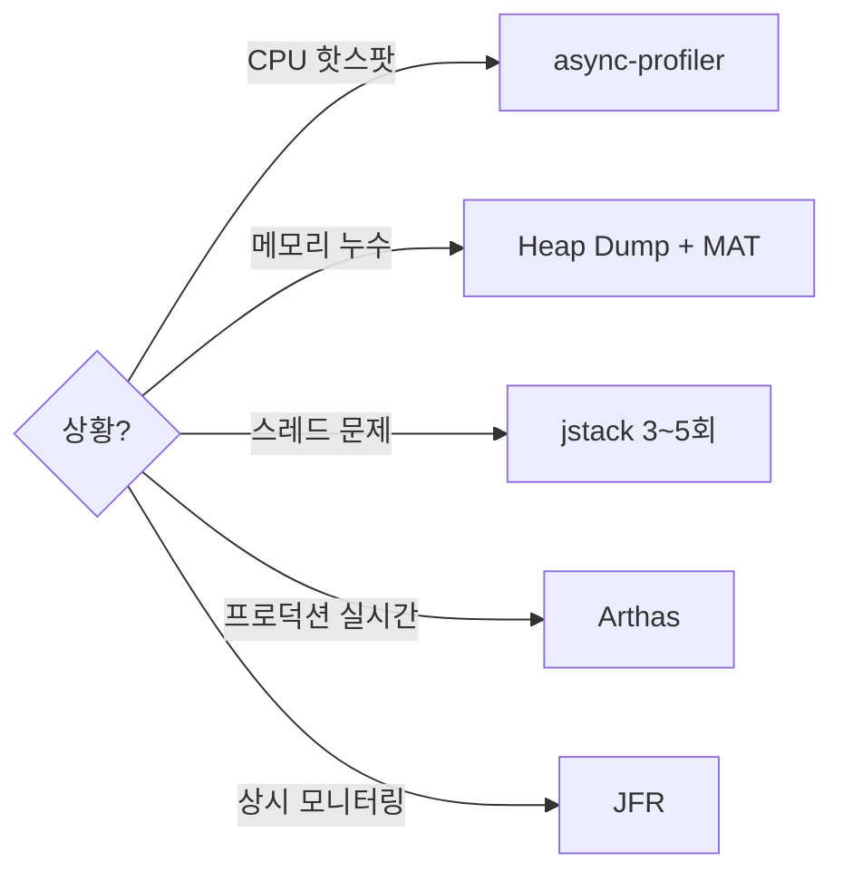
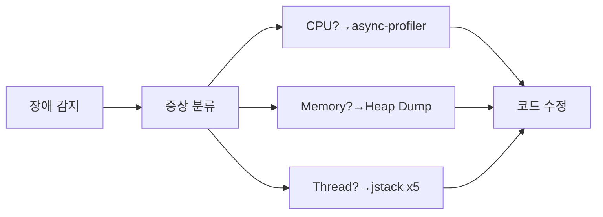

JVM 애플리케이션이 느려졌을 때 "어디서 시간을 잡아먹는지", "메모리를 누가 쓰는지", "스레드가 왜 멈췄는지"를 정확히 짚어내는 기술이 프로파일링이다. 감으로 튜닝하면 90%는 엉뚱한 곳을 고치게 된다 — 도구가 보여주는 숫자만이 진실이다.

> **비유로 먼저 이해하기**: 프로파일링은 자동차 계기판이다. 엔진이 과열되면(CPU 스파이크) 온도계를 보고, 연료가 새면(메모리 누수) 연료 게이지를 보고, 바퀴가 잠기면(데드락) 경고등을 본다. 계기판 없이 "아마 여기가 문제일 거야"라고 후드를 여는 정비사에게 차를 맡기겠는가?

---

## 1. 왜 프로파일링이 필요한가

### 감(感)이 아니라 데이터가 필요하다

개발자들이 성능 병목을 직감으로 찾으려 할 때 가장 흔한 실수는 **"이 for 루프가 느린 것 같다"** 식의 추측이다. Donald Knuth는 "조기 최적화는 만악의 근원"이라 했지만, 그 반대도 마찬가지다 — **측정 없는 최적화는 시간 낭비**다.

프로파일링이 없으면 다음 상황에서 속수무책이 된다.

| 상황 | 증상 | 프로파일링이 보여주는 것 |
|-----|------|----------------------|
| CPU 스파이크 | 응답시간 급증, 서버 부하 100% | 어떤 메서드가 CPU를 독점하는지 |
| 메모리 누수 | Old Gen 우상향, 결국 OOM | 어떤 객체가 GC 되지 않는지 |
| 스레드 데드락 | 요청이 멈추고 타임아웃 | 어떤 스레드가 어떤 락을 기다리는지 |
| GC 지옥 | Stop-the-World 수십 초 | GC 빈도, 회수량, Promotion 패턴 |

> **비유**: 병원에서 "배가 아파요"라고 하면 의사가 혈액검사, CT, 초음파를 하듯이, JVM도 증상만으로는 원인을 알 수 없다. 프로파일링 도구는 JVM의 CT 스캐너다.

### 프로파일링의 비용

프로파일링 자체도 성능에 영향을 준다. 이것을 **관측자 효과(Observer Effect)** 라고 한다. 어떤 도구를 쓰느냐에 따라 오버헤드가 달라진다.



- **Sampling**: 주기적으로(예: 10ms마다) 스레드의 스택 트레이스를 찍어 통계를 낸다. 오버헤드가 낮아서 프로덕션에서도 쓸 수 있다.
- **Instrumentation**: 바이트코드를 조작해 모든 메서드 진입/탈출에 측정 코드를 삽입한다. 정확도는 높지만 오버헤드가 커서 개발 단계에서만 쓴다.
- **Agent 방식**: JVM에 에이전트를 붙여서 필요한 부분만 선택적으로 계측한다. Arthas, async-profiler가 이 방식이다.

> **비유**: Sampling은 1시간에 한 번 CCTV를 캡처하는 것이고, Instrumentation은 모든 출입문에 센서를 달아 사람 하나하나의 동선을 전부 기록하는 것이다. 전자는 놓치는 것이 있을 수 있지만 건물 운영에 방해가 안 되고, 후자는 완벽하지만 출입문마다 줄이 길어진다.

---

## 2. 프로파일링 종류

### 2-1. CPU 프로파일링

CPU 프로파일링은 **어떤 메서드가 얼마나 오래 실행되는지**를 측정한다. 크게 두 가지 관점이 있다.

- **Wall Clock Time**: 메서드가 시작부터 끝까지 걸린 실제 시간. I/O 대기도 포함된다.
- **CPU Time**: 실제 CPU를 점유한 시간만 측정. I/O 대기는 제외된다.

네트워크 호출이나 DB 쿼리가 병목이면 Wall Clock이 길고 CPU Time은 짧다. 순수 연산이 병목이면 둘 다 길다. **두 지표의 차이**가 곧 I/O 병목의 크기다.

> **비유**: 음식점에서 주문하고 20분 기다렸다면 Wall Clock은 20분이다. 하지만 주방에서 실제 조리한 시간(CPU Time)은 8분이고, 나머지 12분은 재료 배달을 기다린 시간(I/O Wait)이다.

### 2-2. 메모리 프로파일링

메모리 프로파일링은 **힙에 어떤 객체가 얼마나 있는지, 누가 참조를 잡고 있어서 GC가 안 되는지**를 분석한다. 핵심 개념은 다음과 같다.

- **Shallow Size**: 객체 자체의 크기. `int[]` 배열이면 헤더 + 요소 수 x 4바이트.
- **Retained Size**: 이 객체가 GC되면 함께 해제되는 전체 크기. 누수 분석의 핵심 지표다.
- **Dominator Tree**: 객체 참조 그래프에서 "이 객체를 제거하면 도달 불가능해지는 객체들"의 트리 구조.



위 그래프에서 HashMap의 Retained Size는 자기 자신 + Entry[] + Key + Value + byte[] 전부를 합한 크기다. HashMap 하나를 제거하면 10MB가 통째로 해제된다.

> **비유**: Retained Size는 팀장이 퇴사하면 따라 나가는 팀원 수다. 팀장(HashMap) 한 명이 나가면 밑에 달린 팀원(Entry, Key, Value, byte[]) 전원이 같이 사라진다. 팀장의 "영향력 크기"가 곧 Retained Size다.

### 2-3. 스레드 프로파일링

스레드 프로파일링은 **스레드가 어떤 상태(RUNNABLE, BLOCKED, WAITING, TIMED_WAITING)인지, 어떤 락을 기다리는지**를 분석한다.

| 상태 | 의미 | 주요 원인 |
|-----|------|----------|
| RUNNABLE | CPU를 쓰고 있거나 쓸 준비가 됨 | 정상 실행, 또는 CPU 바운드 루프 |
| BLOCKED | synchronized 락 대기 | 다른 스레드가 모니터를 잡고 있음 |
| WAITING | notify/signal 대기 | Object.wait(), LockSupport.park() |
| TIMED_WAITING | 시간 제한 대기 | Thread.sleep(), Future.get(timeout) |

데드락은 두 스레드가 서로의 락을 기다리는 순환 의존이다. `jstack`이나 VisualVM의 Thread Dump에서 "Found one Java-level deadlock" 메시지가 뜨면 즉시 확인해야 한다.

> **비유**: 좁은 복도에서 두 사람이 마주보고 "당신이 먼저 비키세요"라고 하는 것이 데드락이다. 둘 다 한 발짝도 안 물러나면 영원히 지나갈 수 없다.

### 2-4. I/O 프로파일링

I/O 프로파일링은 **디스크 읽기/쓰기, 네트워크 호출, DB 쿼리에 시간이 얼마나 걸리는지**를 분석한다. JVM 자체보다는 외부 시스템과의 상호작용이 병목일 때 중요하다.

async-profiler의 `--event wall` 옵션이나 Arthas의 `trace` 명령으로 I/O 대기 시간을 포함한 전체 호출 시간을 측정할 수 있다.



위 흐름에서 전체 207ms 중 DB 쿼리가 200ms를 차지한다. CPU 프로파일링만 보면 Service 로직 5ms만 잡히고 진짜 병목인 DB는 안 보인다. **Wall Clock 프로파일링을 해야 I/O 병목이 드러난다.**

> **비유**: 택배 배송에서 포장(CPU 작업)은 3분이고 배송(I/O)은 3시간이다. 포장 속도만 측정하면 "우리 시스템은 빠르다"는 착각에 빠진다.

---

## 3. 도구 비교표

| 도구 | 유형 | 오버헤드 | 프로덕션 사용 | 가격 | 핵심 기능 |
|-----|------|---------|-------------|------|----------|
| **VisualVM** | GUI, Sampling/Profiling | 중 | 제한적 | 무료 | Heap Dump, 스레드, Sampler |
| **JProfiler** | GUI, 에이전트 기반 | 중~높 | 비권장 | 유료($599~) | Call Tree, Allocation, DB 프로파일링 |
| **Arthas** | CLI, 에이전트 부착 | 낮~중 | 가능 | 무료 | watch, trace, dashboard, 핫픽스 |
| **async-profiler** | CLI, perf_events 기반 | 매우 낮(1~3%) | 적극 권장 | 무료 | Flame Graph, alloc 프로파일링 |
| **jcmd** | CLI, JVM 내장 | 매우 낮 | 가능 | 무료(JDK 포함) | JFR, Heap Dump, GC 트리거 |
| **jmap/jstack** | CLI, JVM 내장 | 낮 | 긴급 시 사용 | 무료(JDK 포함) | Heap Dump, Thread Dump |

> **비유**: VisualVM은 종합병원(모든 검사 가능하지만 대기시간이 있다), Arthas는 119 응급대원(현장에서 즉시 진단), async-profiler는 웨어러블 심박 센서(24시간 부담 없이 모니터링), jcmd는 가정용 체온계(항상 옆에 있고 바로 쓸 수 있다).

---

## 4. VisualVM

### 4-1. 개요와 설치

VisualVM은 Oracle이 제공하던 공식 프로파일링 도구로, 현재는 독립 프로젝트(visualvm.github.io)로 운영된다. JDK 8까지는 `jvisualvm`이 JDK에 포함되어 있었고, JDK 9부터는 별도 다운로드가 필요하다.

**핵심 기능 세 가지:**
1. **Sampler**: 주기적으로 스택 트레이스를 수집해 CPU 핫스팟과 메모리 할당 현황을 보여준다.
2. **Profiler**: 바이트코드 인스트루멘테이션으로 정밀 측정한다. 오버헤드가 커서 개발 전용.
3. **Heap Dump**: 특정 시점의 힙 메모리 스냅샷을 떠서 어떤 객체가 얼마나 있는지 분석한다.



> **비유**: VisualVM은 자동차의 OBD-II 진단기다. 차(JVM)에 케이블(JMX)을 꽂으면 엔진 회전수(CPU), 연료 잔량(힙 메모리), 배기가스(GC 로그)를 한 화면에 볼 수 있다.

### 4-2. Sampler 사용법

Sampler는 프로파일링의 첫 단추다. CPU Sampling을 켜면 기본 100ms 간격으로 모든 스레드의 스택 트레이스를 수집하고, 각 메서드가 스택 최상단에 몇 번 나타났는지를 세서 **Self Time(자체 시간)** 을 추정한다.

Self Time이 높은 메서드가 CPU 핫스팟이다. 하지만 주의점이 있다 — Sampling은 **통계적 추정**이기 때문에 짧은 시간 동안만 돌리면 오차가 크다. 최소 30초~1분 이상 수집해야 신뢰할 수 있는 결과가 나온다.

**CPU Sampler 결과 읽는 법:**

```
Hot Spots (Self Time):
  com.example.service.OrderService.calculateTotal()  — 42.3%
  java.util.HashMap.resize()                         — 18.7%
  com.example.repository.OrderRepo.findByDate()      — 12.1%
```

위 결과에서 `calculateTotal()`이 CPU의 42%를 소비하고 있다. 이 메서드 내부를 들여다보면 된다. `HashMap.resize()`가 18%라면 초기 capacity를 적절히 설정해서 리사이징 횟수를 줄이면 된다.

> **비유**: Sampler는 교실에서 5분마다 "지금 뭐 하고 있어?"라고 묻는 선생님이다. 한 학생(메서드)이 매번 "계산 중이요"라고 대답한다면, 그 학생이 가장 오래 계산하고 있는 것이다.

### 4-3. Profiler (Instrumentation) 사용법

Profiler는 Sampler보다 정밀하지만 무겁다. **바이트코드 인스트루멘테이션**을 통해 지정한 패키지의 모든 메서드 진입/탈출에 타이머를 삽입한다.

실무에서는 Profiler를 쓸 때 반드시 **패키지 필터**를 설정해야 한다. `com.example.**`만 계측하고 `java.**`, `org.springframework.**` 같은 프레임워크 코드는 제외하지 않으면 오버헤드가 50% 이상 될 수 있다.

```
Settings > CPU > Profile only classes:
  com.example.**

Do not profile classes:
  java.**
  sun.**
  org.springframework.**
```

**Profiler가 보여주는 핵심 지표:**
- **Invocations**: 메서드 호출 횟수. 1만 번 호출되는 메서드가 각각 0.1ms라도 총 1초다.
- **Total Time**: 자기 자신 + 하위 메서드 호출 시간 합산.
- **Self Time**: 순수 자기 자신의 실행 시간만. 병목 지점은 Self Time이 큰 메서드다.

> **비유**: Profiler는 공장의 모든 공정에 타이머를 달아 "이 공정이 정확히 몇 초 걸렸다"를 기록하는 것이다. 정밀하지만 타이머를 설치하는 시간 자체가 생산성을 떨어뜨린다.

### 4-4. Heap Dump 분석

Heap Dump는 특정 시점에 JVM 힙 메모리에 존재하는 **모든 객체의 스냅샷**이다. OOM이 발생하거나 메모리 사용량이 비정상적으로 증가할 때 반드시 떠야 하는 증거물이다.

**VisualVM에서 Heap Dump 뜨는 방법:**
1. Monitor 탭 > "Heap Dump" 버튼 클릭
2. 또는 `jcmd <pid> GC.heap_dump /tmp/heapdump.hprof` 명령어 사용

Heap Dump를 열면 **Summary** 화면에서 가장 많은 메모리를 차지하는 클래스 목록이 보인다. `byte[]`가 1위인 경우가 많은데, 이때 "누가 이 byte[]를 참조하는가"를 추적해야 한다. **Retained Size 기준으로 정렬**하고, 최상위 객체의 참조 체인(Nearest GC Root)을 따라가면 누수 원인을 찾을 수 있다.

```
Classes by Retained Size:
  1. byte[]                — 512 MB (80%)
  2. java.lang.String      — 45 MB
  3. com.example.CacheEntry — 38 MB
  4. java.util.HashMap$Node — 22 MB
```

이 결과에서 `byte[]` 512MB가 문제라면, 이 byte[]를 참조하는 객체를 역추적한다. `CacheEntry`가 잡고 있다면 캐시 만료 정책을 점검해야 한다.

> **비유**: Heap Dump는 냉장고(힙) 문을 열어 사진을 찍는 것이다. "유통기한 지난 음식(GC 안 된 객체)이 얼마나 있는지, 누가 넣었는지(참조 체인)"를 한눈에 볼 수 있다.

---

## 5. JProfiler

### 5-1. 개요

JProfiler는 ej-technologies가 만든 **상용 JVM 프로파일러**다. 유료($599 개인, $2,999 기업)지만, GUI가 직관적이고 Call Tree, Allocation Tracking, DB 쿼리 프로파일링까지 한 도구에서 처리할 수 있어 대기업에서 많이 사용한다.

JProfiler는 에이전트(`-agentpath`)를 JVM에 붙여서 동작한다. 에이전트 부착 시점에 따라 두 가지 모드가 있다.

- **Attach on startup**: JVM 시작 시 `-agentpath` 옵션으로 에이전트를 미리 로드. 모든 기능 사용 가능.
- **Attach to running JVM**: 이미 돌고 있는 JVM에 나중에 부착. 일부 기능(Allocation Hot Spots 등)이 제한된다.

```
# JVM 시작 시 에이전트 부착
java -agentpath:/opt/jprofiler/bin/linux-x64/libjprofilerti.so=port=8849 \
     -jar myapp.jar
```

### 5-2. Call Tree와 Hot Spot

**Call Tree**는 메서드 호출 관계를 트리 형태로 보여준다. 루트 노드가 Thread.run()이고, 하위로 내려가면서 각 메서드의 Total Time과 Self Time을 확인할 수 있다.



Call Tree에서는 **백분율이 큰 가지**를 따라가면 된다. 위 예에서 Repository > findAll이 48%를 차지하므로 DB 쿼리가 병목이다.

**Hot Spot**은 Call Tree를 뒤집어서, Self Time 기준으로 가장 많은 시간을 소비한 메서드를 상위에 보여준다. Call Tree는 "어디서 호출됐는가"를, Hot Spot은 "누가 가장 느린가"를 대답한다.

> **비유**: Call Tree는 회사 조직도에서 "어느 부서 라인을 따라가면 예산이 많이 쓰이는지" 보는 것이고, Hot Spot은 "개인별 경비 지출 순위"를 보는 것이다.

### 5-3. Allocation Tracking

JProfiler의 Allocation Tracking은 **어떤 코드에서 어떤 객체를 얼마나 생성하는지**를 추적한다. GC 부하가 높을 때 원인을 찾는 데 핵심적이다.

Allocation Hot Spots를 열면 "가장 많은 객체를 할당하는 메서드"가 정렬되어 나온다. 예를 들어 `String.substring()`이 초당 100만 개의 `String` 객체를 만들고 있다면, `StringBuilder`로 교체하거나 로직을 개선해야 한다.

**핵심 지표:**
- **Live Objects**: 현재 힙에 살아 있는 객체 수. 시간이 지나도 안 줄면 누수 의심.
- **Garbage Collected Objects**: GC된 객체 수. 이것이 비정상적으로 많으면 과도한 임시 객체 생성.
- **Allocation Call Tree**: 할당이 일어난 호출 경로. "누가 이 객체를 만들었는가"의 답.

```java
// 안티패턴: 루프마다 String 연결 → 대량의 임시 String 생성
String result = "";
for (int i = 0; i < 100000; i++) {
    result += items.get(i);  // 매번 새 String 객체 생성
}

// 개선: StringBuilder 사용
StringBuilder sb = new StringBuilder(100000 * 20);
for (int i = 0; i < 100000; i++) {
    sb.append(items.get(i));
}
String result = sb.toString();
```

이 코드의 핵심은 루프 내 `+=`가 매 반복마다 새로운 `String`과 내부 `char[]`(또는 `byte[]`)을 생성한다는 점이다. 10만 번 반복이면 10만 개의 쓰레기 객체가 생긴다. Allocation Tracking이 이 패턴을 즉시 잡아준다.

> **비유**: Allocation Tracking은 공장의 불량품 추적 시스템이다. "3번 라인에서 분당 100개의 불량품(임시 객체)이 나온다"는 것을 알아야 공정을 개선할 수 있다.

---

## 6. Arthas — 프로덕션 진단의 스위스 아미 나이프

### 6-1. 개요

Arthas(알타스)는 Alibaba가 만든 **프로덕션 환경용 Java 진단 도구**다. 가장 큰 장점은 **JVM을 재시작하지 않고, 실행 중인 프로세스에 붙어서 실시간으로 진단**할 수 있다는 것이다.

프로덕션에서 CPU가 치솟거나 특정 API가 갑자기 느려졌을 때, VisualVM이나 JProfiler를 연결하기 어려운 환경(컨테이너, 보안 제약 등)에서 Arthas는 **SSH 접속만 되면** 바로 진단을 시작할 수 있다.

```bash
# 설치 및 실행 (한 줄이면 된다)
curl -O https://arthas.aliyun.com/arthas-boot.jar
java -jar arthas-boot.jar
# 실행 중인 Java 프로세스 목록이 나오면 번호 선택
```



> **비유**: Arthas는 소방관의 열화상 카메라다. 건물(서버)에 진입해서 화재 현장(CPU 스파이크)의 열원(병목 메서드)을 실시간으로 찾아낸다. 건물을 비울(재시작) 필요가 없다.

### 6-2. dashboard — 한눈에 보는 JVM 상태

`dashboard` 명령은 **CPU 사용률, 스레드 상태, 힙 메모리, GC 통계**를 터미널에서 실시간으로 보여준다.

```bash
[arthas@12345]$ dashboard
```

출력에서 중요한 부분:

- **THREAD**: 각 스레드의 CPU 사용률. 특정 스레드가 90% 이상이면 그 스레드를 집중 분석한다.
- **MEMORY**: Eden, Old, Metaspace 사용량. Old가 계속 차면 누수 의심.
- **GC**: Young GC/Full GC 횟수와 소요 시간. Full GC가 자주 발생하면 힙 크기나 GC 알고리즘 점검.

### 6-3. watch — 메서드 입출력 실시간 관찰

`watch`는 **특정 메서드의 파라미터, 리턴값, 예외를 실시간으로 출력**한다. 로그를 추가하지 않고도 메서드의 동작을 관찰할 수 있다.

```bash
# OrderService.createOrder의 파라미터와 리턴값 관찰
[arthas@12345]$ watch com.example.service.OrderService createOrder \
    '{params, returnObj, throwExp}' -x 3

# 조건 필터링: 실행시간 500ms 이상인 호출만
[arthas@12345]$ watch com.example.service.OrderService createOrder \
    '{params, returnObj}' '#cost > 500' -x 2
```

`-x 3`은 객체 출력 깊이를 3단계까지 펼치라는 의미다. 너무 깊으면 출력이 폭발하므로 2~3이 적절하다. `#cost > 500` 조건은 실행 시간이 500ms를 넘는 호출만 필터링한다 — 프로덕션에서 느린 요청만 골라 분석할 때 핵심이다.

> **비유**: watch는 택배 분류센터의 검수대다. 특정 라인(메서드)을 지나는 택배(요청)만 열어보고, 내용물(파라미터)과 배송 결과(리턴값)를 확인한다. 모든 택배를 열어볼 필요 없이, "무게 5kg 이상(500ms 이상)"인 것만 골라본다.

### 6-4. trace — 메서드 내부 호출 시간 분해

`trace`는 **한 메서드 내부에서 호출하는 하위 메서드들의 각각의 실행 시간**을 트리 형태로 보여준다. "이 메서드가 느린데, 내부에서 정확히 어느 줄이 느린 건지"를 알 수 있다.

```bash
[arthas@12345]$ trace com.example.service.OrderService createOrder '#cost > 200'
```

출력 예시:

```
`---ts=2026-05-16 10:23:45;thread=http-nio-8080-exec-3;cost=523ms
    +---[3ms] com.example.service.OrderService:validateOrder()
    +---[2ms] com.example.service.OrderService:calculatePrice()
    +---[510ms] com.example.repository.OrderRepository:save()
    `---[5ms] com.example.event.OrderEventPublisher:publish()
```

이 결과에서 `save()`가 510ms로 전체 523ms의 대부분을 차지한다. DB 저장이 병목이므로 쿼리 최적화나 인덱스 추가를 검토해야 한다.

> **비유**: trace는 요리 레시피의 각 단계에 타이머를 붙이는 것이다. "재료 손질 3분, 양념 2분, 오븐 30분"처럼 어느 단계가 오래 걸리는지 한눈에 보인다.

### 6-5. stack — 호출자 역추적

`stack`은 `trace`의 반대 방향이다. "이 메서드를 **누가** 호출했는지"를 보여준다.

```bash
[arthas@12345]$ stack com.example.repository.OrderRepository save
```

이 명령은 `save()` 메서드가 호출될 때마다 스택 트레이스를 출력한다. 예상치 못한 곳에서 호출되고 있다면 즉시 발견할 수 있다.

### 6-6. 프로덕션 안전 수칙

Arthas는 강력하지만, 프로덕션에서 잘못 쓰면 장애를 유발할 수 있다. 반드시 지켜야 할 수칙:

1. **watch/trace에 조건 필터 필수**: 조건 없이 트래픽이 많은 메서드를 watch하면 출력 폭주로 CPU가 올라간다.
2. **`-n` 옵션으로 횟수 제한**: `-n 10`이면 10번만 관찰하고 자동 종료.
3. **redefine/retransform 금지**: 프로덕션에서 바이트코드 변경은 사고를 부른다.
4. **사용 후 반드시 `stop`**: Arthas 세션을 닫아야 에이전트가 분리된다.

```bash
# 안전한 사용 패턴: 조건 + 횟수 제한
[arthas@12345]$ trace com.example.service.OrderService createOrder \
    '#cost > 500' -n 20

# 사용 완료 후 반드시 종료
[arthas@12345]$ stop
```

---

## 7. async-profiler — Flame Graph의 정석

### 7-1. 개요

async-profiler는 **리눅스의 perf_events와 JVM의 AsyncGetCallTrace API**를 조합한 저오버헤드 프로파일러다. 핵심 특징은 다음과 같다.

- **SafePoint 편향 없음**: JVM의 일반적인 프로파일링은 SafePoint에서만 스택을 수집하기 때문에 SafePoint가 아닌 곳에서 시간을 쓰는 코드를 놓친다. async-profiler는 이 한계를 극복한다.
- **오버헤드 1~3%**: 프로덕션에서 상시 사용 가능한 수준.
- **Flame Graph 출력**: 병목 지점을 직관적으로 시각화한다.

```bash
# 설치 (Linux)
wget https://github.com/async-profiler/async-profiler/releases/download/v3.0/async-profiler-3.0-linux-x64.tar.gz
tar xzf async-profiler-3.0-linux-x64.tar.gz

# CPU 프로파일링 (30초간 수집 후 Flame Graph 생성)
./asprof -d 30 -f /tmp/flamegraph.html <pid>

# 메모리 할당 프로파일링
./asprof -d 30 -e alloc -f /tmp/alloc.html <pid>

# Wall Clock 프로파일링 (I/O 대기 포함)
./asprof -d 30 -e wall -f /tmp/wall.html <pid>
```

> **비유**: async-profiler는 투명인간 관찰자다. 직원(스레드)이 SafePoint(화장실 휴식)에 갈 때만 관찰하는 기존 방식과 달리, 업무 중(SafePoint가 아닌 시점)에도 조용히 관찰해서 진짜 업무 패턴을 기록한다.

### 7-2. SafePoint 편향이란

이 개념은 async-profiler를 이해하는 데 핵심이다. JVM은 GC, 코드 최적화 등을 위해 모든 스레드가 **안전 지점(SafePoint)** 에 도달하길 기다린다. 일반적인 JVM 프로파일러(`jstack`, VisualVM의 Sampler 등)는 SafePoint에서만 스택을 수집한다.

문제는 **SafePoint 사이의 긴 루프**나 **JIT 컴파일된 코드**에서 시간을 많이 쓰는 메서드가 프로파일 결과에 잘 안 잡힌다는 것이다. 이것을 **SafePoint Bias**라고 한다.

async-profiler는 OS 레벨의 시그널(SIGPROF)을 사용해서 SafePoint와 무관하게 스택을 수집하기 때문에 이 편향이 없다.



### 7-3. Flame Graph 읽는 법

Flame Graph(불꽃 그래프)는 **스택 트레이스를 시각화**한 것이다. 읽는 규칙은 단순하다.

1. **X축**: 알파벳 순서로 정렬된 스택 프레임. X축 위치는 의미 없다(시간순이 아니다).
2. **Y축**: 호출 깊이. 아래가 스택 바닥(main/Thread.run), 위가 실제 실행 중인 메서드.
3. **넓이**: 해당 메서드가 스택 최상단에 있었던 시간 비율. **넓을수록 CPU를 많이 썼다.**
4. **색상**: 보통 랜덤. 의미 없다(특수 색상 체계 적용 시 달라질 수 있음).

**병목을 찾는 방법**: 그래프 위쪽에서 **넓은 평탄 구간(plateau)** 을 찾는다. 이것이 CPU를 가장 많이 소비하는 메서드다.

```
|                                                              |
|  ┌──────────── calculateTotal ────────────┐                  |
|  │  ┌─── multiply ───┐  ┌── validate ──┐ │                  |
|  │  │                 │  │              │ │                  |
|──┴──┴─────────────────┴──┴──────────────┴─┴──────────────────|
|                    main / Thread.run                          |
```

위 그림에서 `calculateTotal`이 가장 넓으므로 CPU 핫스팟이다. 그 안에서 `multiply`와 `validate`가 시간을 나눠 쓴다.

> **비유**: Flame Graph는 지출 내역서의 파이 차트를 세로로 쌓은 것이다. "총예산(main) 중에서 인건비(Service) 안에 개발팀(calculate)이 가장 큰 비중"이라면, 개발팀 예산을 먼저 들여다보는 것이 맞다.

### 7-4. 메모리 할당 프로파일링

async-profiler의 `-e alloc` 옵션은 **객체 할당이 일어나는 호출 경로**를 Flame Graph로 보여준다. GC 부하가 높을 때 "어디서 대량으로 객체를 만드는가"를 찾는 핵심 도구다.

```bash
# 할당 프로파일링 (512KB 이상 할당만 수집)
./asprof -d 60 -e alloc --alloc 524288 -f /tmp/alloc.html <pid>
```

`--alloc 524288`은 512KB 이상의 대형 할당만 수집하라는 의미다. 작은 객체까지 전부 수집하면 오버헤드가 올라가므로, 필요에 따라 임계값을 조절한다.

---

## 8. jcmd / jmap / jstack — JVM 기본기

### 8-1. jcmd — 만능 스위스 칼

jcmd는 JDK에 포함된 **만능 JVM 진단 도구**다. JDK 7부터 사용 가능하며, 기존의 jmap, jstack, jinfo의 기능을 통합한다.

```bash
# 실행 중인 Java 프로세스 목록
jcmd -l

# JVM 정보 확인
jcmd <pid> VM.info

# Heap Dump
jcmd <pid> GC.heap_dump /tmp/heapdump.hprof

# Thread Dump
jcmd <pid> Thread.print

# GC 실행
jcmd <pid> GC.run

# JFR(Java Flight Recorder) 시작
jcmd <pid> JFR.start duration=60s filename=/tmp/recording.jfr

# JFR 종료 및 덤프
jcmd <pid> JFR.dump name=1 filename=/tmp/recording.jfr
```

**jcmd의 핵심 장점:**
1. JDK에 기본 포함 — 별도 설치 불필요.
2. 타겟 JVM과 같은 사용자 권한만 있으면 동작.
3. JFR을 CLI에서 제어 가능 — 프로덕션에서 경량 프로파일링.

> **비유**: jcmd는 멀티툴(레더맨)이다. 칼(Thread.print), 드라이버(GC.heap_dump), 가위(JFR.start)가 하나에 다 들어 있다. 전문 도구만큼 정교하진 않지만, 항상 주머니에 있어서 즉시 쓸 수 있다.

### 8-2. jmap — 힙 메모리 분석

jmap은 **힙 메모리의 통계와 덤프**를 제공한다. jcmd로 대체 가능하지만, 레거시 환경에서는 여전히 많이 쓰인다.

```bash
# 힙 히스토그램 (클래스별 객체 수와 크기)
jmap -histo <pid> | head -20

# 힙 히스토그램 (살아있는 객체만 — GC 후 수집)
jmap -histo:live <pid> | head -20

# Heap Dump
jmap -dump:live,format=b,file=/tmp/heapdump.hprof <pid>
```

**주의**: `jmap -histo:live`와 `jmap -dump:live`는 **Full GC를 트리거**한다. 프로덕션에서 응답 지연을 유발할 수 있으므로 신중히 사용해야 한다.

힙 히스토그램 결과 읽기:

```
 num     #instances    #bytes  class name
   1:      5842381   467390480  [B       (byte[])
   2:      3241877   103740064  java.lang.String
   3:       892341    71387280  com.example.dto.OrderDTO
```

`[B`는 `byte[]`를 의미한다. 인스턴스 수 대비 바이트 크기가 비정상적으로 큰 클래스를 찾는 것이 핵심이다.

### 8-3. jstack — 스레드 덤프

jstack은 **모든 스레드의 현재 스택 트레이스**를 출력한다. 데드락 감지, 스레드 상태 분석에 사용한다.

```bash
# Thread Dump
jstack <pid> > /tmp/threaddump.txt

# 강제 덤프 (프로세스가 응답 안 할 때)
jstack -F <pid> > /tmp/threaddump.txt

# 데드락이 있으면 마지막에 이런 메시지가 나온다:
# Found one Java-level deadlock:
# =============================
# "Thread-1":
#   waiting to lock monitor 0x00007f... (object 0x00000..., a java.lang.Object)
#   which is held by "Thread-2"
# "Thread-2":
#   waiting to lock monitor 0x00007f... (object 0x00000..., a java.lang.Object)
#   which is held by "Thread-1"
```

**실무 팁**: 스레드 덤프는 **최소 3~5회, 3~5초 간격**으로 연속 수집해야 한다. 한 장의 스냅샷으로는 "일시적 상태"인지 "영구적 병목"인지 구분할 수 없다. 여러 장에서 같은 스택이 반복되면 그것이 진짜 병목이다.

```bash
# 3초 간격으로 5회 연속 수집 스크립트
for i in 1 2 3 4 5; do
    jstack <pid> > /tmp/threaddump_$i.txt
    sleep 3
done
```

> **비유**: 스레드 덤프 한 장은 러시아워 교차로의 스냅샷 한 장이다. "지금 막혀 있네"만 알 수 있다. 5초 간격으로 5장을 찍으면 "이 교차로는 항상 막히는 구간"인지 "잠깐 빨간불이었던 것"인지 구분할 수 있다.

### 8-4. JFR (Java Flight Recorder)

JFR은 **JVM에 내장된 경량 이벤트 레코더**다. JDK 11부터 무료로 사용 가능하며(JDK 8u262 이상에서도 사용 가능), 오버헤드가 1% 미만이라 프로덕션에서 상시 사용할 수 있다.

JFR이 수집하는 이벤트:

| 카테고리 | 이벤트 예시 |
|---------|-----------|
| CPU | CPU Load, Thread CPU Load |
| 메모리 | GC Pause, Heap Summary, Object Allocation |
| I/O | File Read/Write, Socket Read/Write |
| 스레드 | Thread Sleep, Thread Park, Monitor Enter |
| 코드 | Method Profiling, Compilation |

```bash
# JFR 녹화 시작 (60초)
jcmd <pid> JFR.start duration=60s filename=/tmp/flight.jfr

# 지속적 녹화 (수동 종료 전까지)
jcmd <pid> JFR.start name=continuous maxage=1h maxsize=500m disk=true

# 녹화 중 덤프
jcmd <pid> JFR.dump name=continuous filename=/tmp/snapshot.jfr

# JDK Mission Control(JMC)로 분석
jmc -open /tmp/flight.jfr
```

> **비유**: JFR은 비행기의 블랙박스(Flight Recorder)다. 평소에는 조용히 데이터를 기록하고, 사고(장애)가 나면 기록을 열어 원인을 분석한다. 비행에 영향을 주지 않을 정도로 가볍다.

---

## 9. GC 로그 분석 — GCEasy, GCViewer

### 9-1. GC 로그 활성화

GC 로그는 **프로덕션에서 반드시 켜둬야 하는** 설정이다. 오버헤드가 거의 없고, 장애 시 원인 분석의 핵심 자료가 된다.

```bash
# JDK 8 GC 로그 설정
java -XX:+PrintGCDetails \
     -XX:+PrintGCDateStamps \
     -XX:+PrintGCTimeStamps \
     -Xloggc:/var/log/app/gc.log \
     -XX:+UseGCLogFileRotation \
     -XX:NumberOfGCLogFiles=5 \
     -XX:GCLogFileSize=20M \
     -jar myapp.jar

# JDK 11+ Unified Logging
java -Xlog:gc*:file=/var/log/app/gc.log:time,uptime,level,tags:filecount=5,filesize=20M \
     -jar myapp.jar
```

### 9-2. GC 로그에서 봐야 할 것

GC 로그를 분석할 때 핵심 지표는 다음과 같다.

| 지표 | 정상 범위 | 위험 신호 |
|-----|----------|----------|
| Young GC 빈도 | 수 초 간격 | 초당 여러 번 |
| Young GC 시간 | 10~50ms | 100ms 초과 |
| Full GC 빈도 | 시간당 0~1회 | 분당 1회 이상 |
| Full GC 시간 | 100~500ms | 1초 초과 |
| GC 후 Old Gen 사용률 | 30~60% | Full GC 후에도 80% 이상 |
| Promotion Rate | 낮고 안정적 | 급증 패턴 |

**Full GC 후에도 Old Gen 사용률이 높다**면 메모리 누수 가능성이 매우 높다. 이때 Heap Dump를 떠서 Eclipse MAT으로 분석해야 한다.


> **비유**: GC 로그는 화장실 이용 기록이다. "몇 시에 몇 명이 화장실(GC)을 썼고, 각각 몇 분 걸렸는지"를 기록한다. 화장실 사용 시간(STW Pause)이 점점 길어지면, 화장실을 늘리거나(힙 증가) 이용 규칙(GC 알고리즘)을 바꿔야 한다.

### 9-3. GCEasy (gceasy.io)

GCEasy는 **웹 기반 GC 로그 분석 도구**다. GC 로그 파일을 업로드하면 자동으로 파싱해서 시각화된 리포트를 생성한다.

**GCEasy가 제공하는 분석:**
- GC Pause 분포 히스토그램
- 힙 사용량 추이 (Young/Old/Metaspace)
- Allocation Rate와 Promotion Rate
- 메모리 누수 감지 (Old Gen 우상향 패턴)
- GC 알고리즘 튜닝 권장사항

무료 버전에서도 핵심 분석은 모두 제공되며, 팀 공유가 필요하면 유료 플랜을 쓰면 된다.

### 9-4. GCViewer

GCViewer는 **오프라인 GC 로그 분석 도구**(Java 데스크톱 앱)다. 보안상 외부 서비스에 로그를 업로드할 수 없는 환경에서 유용하다.

```bash
# GCViewer 실행
java -jar gcviewer-1.36.jar /var/log/app/gc.log
```

GCViewer는 GC Pause Time, Throughput(GC가 아닌 시간의 비율), 힙 사용량 그래프를 시각적으로 보여준다. Throughput이 95% 이하로 떨어지면 GC 튜닝이 필요한 신호다.

---

## 10. Heap Dump 분석 — Eclipse MAT

### 10-1. Eclipse MAT 개요

Eclipse Memory Analyzer Tool(MAT)은 **Heap Dump(.hprof) 파일을 분석하는 최강의 무료 도구**다. 수 GB 크기의 Heap Dump도 분석할 수 있으며, 자동으로 메모리 누수 의심 객체를 찾아준다.



### 10-2. Leak Suspects 리포트

MAT을 열면 자동으로 **Leak Suspects** 리포트를 생성한다. "이 객체가 힙의 X%를 차지하며, GC Root까지의 참조 경로가 이렇다"는 분석을 보여준다.

**Leak Suspects를 읽는 순서:**
1. **Problem Suspect 1**: 가장 큰 메모리 점유 객체
2. **Shortest Paths to GC Root**: 이 객체가 왜 GC 안 되는지의 참조 경로
3. **Accumulated Objects**: 이 객체가 붙잡고 있는 하위 객체들

### 10-3. Dominator Tree

Dominator Tree는 **Retained Size 기준으로 정렬한 객체 트리**다. 최상위 객체가 곧 "가장 많은 메모리를 잡고 있는 주범"이다.

실무에서 가장 흔한 누수 패턴:

| 패턴 | Dominator Tree에서 보이는 모습 | 원인 |
|-----|------------------------------|------|
| 캐시 미만료 | ConcurrentHashMap이 Retained 60% | 캐시 eviction 정책 미설정 |
| 리스너 미해제 | ArrayList(리스너)이 계속 증가 | removeListener() 호출 누락 |
| 세션 누수 | HttpSession이 Retained 40% | 세션 타임아웃 미설정 |
| 로그 버퍼 | StringBuilder가 Retained 30% | 무한 append, clear 안 함 |

> **비유**: Dominator Tree는 회사의 예산 지출 트리다. "전체 예산(힙) 중에서 마케팅팀(HashMap)이 60%를 쓰고, 그 안에서 광고비(byte[])가 대부분"이라면, 마케팅팀의 광고 예산 정책(eviction)을 점검해야 한다.

### 10-4. OQL (Object Query Language)

MAT에서는 SQL과 유사한 **OQL**로 객체를 쿼리할 수 있다. 특정 조건의 객체를 찾을 때 강력하다.

```sql
-- 크기가 1MB 이상인 byte[] 찾기
SELECT * FROM byte[] s WHERE s.@length > 1048576

-- 특정 클래스의 인스턴스 수
SELECT count(*) FROM com.example.dto.OrderDTO

-- 특정 필드값으로 필터링
SELECT * FROM com.example.cache.CacheEntry c WHERE c.expireTime < 1715800000000
```

---

## 11. 극한 시나리오

### 11-1. OOM 원인 추적

**시나리오**: 프로덕션 서버가 `java.lang.OutOfMemoryError: Java heap space`로 죽었다. 원인을 찾아야 한다.

**진단 순서:**

**1단계 — OOM 시 자동 Heap Dump 설정 확인**

```bash
# 이 옵션이 JVM 시작 시 있어야 한다 (사후 설정 불가)
-XX:+HeapDumpOnOutOfMemoryError
-XX:HeapDumpPath=/var/log/app/heapdump.hprof
```

이 옵션이 없었다면 OOM 시점의 힙 상태를 알 수 없다. **반드시 모든 프로덕션 JVM에 설정해둬야 한다.** 설정 비용은 0이고, OOM이 발생하지 않으면 아무 동작도 하지 않는다.

**2단계 — Eclipse MAT로 Heap Dump 분석**

```
1. MAT으로 .hprof 파일 열기
2. Leak Suspects 리포트 확인
3. Dominator Tree에서 Retained Size 최상위 객체 확인
4. Shortest Paths to GC Root로 참조 체인 추적
5. 코드에서 해당 참조를 해제하는 로직 확인
```

**3단계 — 흔한 OOM 원인과 해결**

| 원인 | MAT에서 보이는 증거 | 해결 |
|-----|-------------------|------|
| 캐시 무한 증가 | HashMap/ConcurrentHashMap이 Retained 1위 | TTL, maxSize 설정 |
| 대용량 쿼리 결과 | ArrayList에 수백만 Row | 페이징, 스트림 처리 |
| 스레드 로컬 누수 | ThreadLocal이 Entry 수천 개 | remove() 호출, try-finally |
| 커넥션 풀 누수 | Connection 객체 수백 개 | close() 보장, leak detection 설정 |

> **비유**: OOM은 물탱크(힙)가 넘치는 것이다. 수도꼭지(객체 할당)를 찾아 잠그거나, 배수구(GC)가 막힌 곳을 뚫어야 한다. Heap Dump는 물탱크를 비우기 전에 "어떤 물(객체)이 차 있었는지" 사진을 찍는 것이다.

### 11-2. 스레드 데드락 진단

**시나리오**: 특정 API 호출이 타임아웃으로 실패한다. 서버 CPU는 낮고, DB도 정상인데 요청이 처리 안 된다.

**진단 순서:**

**1단계 — Thread Dump 수집 (3회, 5초 간격)**

```bash
for i in 1 2 3; do
    jcmd <pid> Thread.print > /tmp/td_$i.txt
    sleep 5
done
```

**2단계 — 데드락 확인**

Thread Dump 하단에 "Found one Java-level deadlock" 메시지가 있는지 확인한다. 데드락이 있으면 JVM이 자동으로 감지해서 관련 스레드와 락 정보를 출력한다.

**3단계 — BLOCKED 스레드 분석**

데드락은 아니지만 BLOCKED 스레드가 많다면, 특정 synchronized 블록에 병목이 있는 것이다.

```
"http-nio-8080-exec-15" #45 daemon prio=5
   java.lang.Thread.State: BLOCKED (on object monitor)
    at com.example.service.LegacyService.process(LegacyService.java:42)
    - waiting to lock <0x000000076ab00208> (a java.lang.Object)
    - locked by "http-nio-8080-exec-3"
```

위 덤프에서 exec-15가 exec-3이 잡고 있는 락을 기다리고 있다. `LegacyService.java:42`에 있는 synchronized 블록을 `ReentrantLock` + `tryLock(timeout)` 으로 교체하거나, 락 범위를 좁히는 것이 해결책이다.

> **비유**: 데드락 진단은 교통 경찰이 꼬인 교차로를 정리하는 것이다. 어느 차(스레드)가 어떤 차선(락)을 점유하고 있고, 누구를 기다리는지 파악한 뒤 한 쪽을 양보시키면(락 순서 통일) 풀린다.

### 11-3. GC 튜닝

**시나리오**: 평소 응답시간 50ms인 API가 주기적으로 2~3초씩 걸린다. GC Pause가 의심된다.

**진단 순서:**

**1단계 — GC 로그 확인**

```bash
# GC 로그에서 Full GC 찾기
grep "Full GC" /var/log/app/gc.log | tail -20
```

**2단계 — GCEasy로 시각화 분석**

GC 로그를 gceasy.io에 업로드하면 다음이 보인다.
- GC Pause Time 분포 — 2초 이상 Pause가 있는지
- Old Gen 사용량 추이 — 계단식 증가(누수) vs 톱니 모양(정상)
- Promotion Rate — Young에서 Old로 너무 많이 넘어가는지

**3단계 — 튜닝 방향**

| 문제 | 해결 방향 |
|-----|----------|
| Young GC가 너무 자주 | Young Gen 크기 늘리기 (-Xmn) |
| Full GC Pause가 김 | G1GC/ZGC로 전환 |
| Old Gen이 계속 차오름 | 메모리 누수 → Heap Dump 분석 |
| Promotion Rate 높음 | Young Gen 크기 늘리거나 객체 생명주기 검토 |

```bash
# G1GC 설정 예시 (JDK 11+)
java -XX:+UseG1GC \
     -XX:MaxGCPauseMillis=200 \
     -Xms4g -Xmx4g \
     -XX:G1HeapRegionSize=8m \
     -jar myapp.jar

# ZGC 설정 (JDK 17+, Pause 1ms 이하 목표)
java -XX:+UseZGC \
     -Xms4g -Xmx4g \
     -jar myapp.jar
```

`MaxGCPauseMillis=200`은 "GC Pause를 200ms 이하로 유지해달라"는 **목표값**이다. G1GC는 이 목표를 달성하기 위해 Region 단위로 부분 수집을 한다. ZGC는 더 극단적으로, TB 단위 힙에서도 Pause를 1ms 이하로 유지한다.

> **비유**: GC 튜닝은 식당의 설거지(GC) 전략이다. 영업 중에 30분간 문 닫고 설거지(Full GC STW)하면 손님이 떠난다. 접시 몇 개씩 틈틈이 닦는 전략(G1GC)이 낫고, 로봇이 접시를 쓰는 즉시 닦는 전략(ZGC)이 가장 이상적이다.

### 11-4. 프로덕션 CPU 스파이크 진단

**시나리오**: 프로덕션 서버의 CPU가 갑자기 100%로 치솟는다. 어떤 스레드가 CPU를 잡아먹는지 찾아야 한다.

**진단 순서:**

**1단계 — CPU를 많이 쓰는 스레드 찾기 (OS 레벨)**

```bash
# Linux: CPU 사용률 높은 스레드의 LWP(경량 프로세스) ID 확인
top -H -p <pid>

# 결과 예:
# PID   USER   PR  NI  VIRT   RES   %CPU
# 12847 app    20   0  8.2g  4.1g   98.5
```

**2단계 — LWP ID를 16진수로 변환하여 Thread Dump에서 매칭**

```bash
# LWP 12847 → 0x3230f (16진수 변환)
printf '0x%x\n' 12847
# 0x323f

# Thread Dump에서 nid=0x323f인 스레드 찾기
jstack <pid> | grep -A 20 "nid=0x323f"
```

**3단계 — async-profiler로 Flame Graph 생성**

```bash
./asprof -d 30 -f /tmp/cpu-spike.html <pid>
```

Flame Graph에서 가장 넓은 plateau를 찾으면 CPU를 잡아먹는 메서드를 특정할 수 있다. 무한 루프, 정규식 백트래킹(ReDoS), 대량 직렬화 등이 흔한 원인이다.

**4단계 — Arthas로 실시간 확인**

```bash
[arthas@12345]$ thread -n 5   # CPU 상위 5개 스레드 출력
[arthas@12345]$ thread 12847  # 특정 스레드의 스택 트레이스
```

> **비유**: CPU 스파이크 진단은 소음 민원 처리다. 먼저 소음계(top -H)로 어느 층(스레드)에서 소리가 나는지 찾고, 문을 열어(jstack) 안에서 뭘 하는지 확인하고, 녹화(Flame Graph)를 해서 패턴을 분석한다.

---

## 12. 실무 실수 TOP 5

### 실수 1: Heap Dump 자동 생성 미설정

**증상**: OOM으로 서버가 죽었는데 원인 분석 자료가 없다.

**원인**: `-XX:+HeapDumpOnOutOfMemoryError` 옵션을 안 넣었다. OOM 발생 시점의 힙 상태가 유실되면, 재현 가능한 환경을 만들어 다시 OOM을 유발해야 하는데 이것이 매우 어렵다.

**해결**: 모든 프로덕션 JVM에 다음을 기본 설정으로 넣는다.

```bash
-XX:+HeapDumpOnOutOfMemoryError
-XX:HeapDumpPath=/var/log/app/
```

> **비유**: 화재 현장에서 CCTV가 꺼져 있었던 것과 같다. 불이 나기 전에 항상 CCTV(HeapDump 설정)를 켜두면 원인 분석이 수십 배 쉬워진다.

### 실수 2: 프로덕션에서 Instrumentation 프로파일러 사용

**증상**: 프로파일링을 켰더니 응답 시간이 5배 늘어나고 서비스 장애가 발생했다.

**원인**: VisualVM Profiler나 JProfiler의 Instrumentation 모드를 프로덕션에서 사용했다. 모든 메서드에 측정 코드가 삽입되면서 오버헤드가 50% 이상 올라갔다.

**해결**: 프로덕션에서는 **Sampling 방식**(async-profiler, JFR, VisualVM Sampler)만 사용한다. Instrumentation은 개발/스테이징 환경 전용이다.

### 실수 3: Thread Dump 한 장만 수집

**증상**: Thread Dump를 떠봤는데, BLOCKED 스레드가 있었지만 "일시적인 건지 영구적인 건지" 판단할 수 없었다.

**원인**: 스냅샷 한 장으로는 시간 흐름에 따른 변화를 알 수 없다.

**해결**: **최소 3~5장, 3~5초 간격**으로 수집한다. 여러 장에서 같은 스레드가 같은 스택에 머물러 있으면 영구적 병목이다.

### 실수 4: GC 로그를 안 켜둠

**증상**: 주기적 지연이 발생하는데 원인을 모른다. 나중에 GC Pause였다는 것을 알았지만, 이미 로그가 없어 상세 분석이 불가능하다.

**원인**: GC 로그의 오버헤드는 거의 0인데도 불구하고 설정하지 않은 경우가 많다.

**해결**: GC 로그는 **무조건 켜둔다**. 파일 롤링 설정을 해두면 디스크 공간 문제도 없다.

### 실수 5: jmap -histo:live를 프로덕션에서 무심코 실행

**증상**: jmap 명령을 실행한 직후 응답 지연이 발생했다.

**원인**: `:live` 옵션은 **Full GC를 트리거**한다. 힙이 큰 JVM(8GB+)에서는 Full GC가 수 초 이상 걸릴 수 있다.

**해결**: 프로덕션에서 힙 분석이 필요하면 `-histo`(live 없이)를 쓰거나, `jcmd <pid> GC.heap_dump`로 덤프를 떠서 별도 머신에서 분석한다.

> **비유**: 실수 5는 교통량 조사한다고 고속도로(프로덕션)의 차선을 막는(Full GC) 것과 같다. 조사(분석)는 다른 도로(별도 머신)에서 하고, 고속도로는 내비 카메라(jstack, JFR)로 간접 관찰해야 한다.

---

## 13. 도구 선택 가이드

어떤 상황에서 어떤 도구를 써야 하는지 정리한다.



**환경별 추천:**

| 환경 | 추천 도구 | 이유 |
|-----|----------|------|
| 로컬 개발 | VisualVM, JProfiler | GUI로 편하게 탐색 |
| 스테이징/QA | async-profiler, JProfiler | 부하 테스트 중 Flame Graph 수집 |
| 프로덕션 (일상) | JFR + GC 로그 | 오버헤드 최소, 상시 수집 |
| 프로덕션 (장애) | Arthas + jstack + async-profiler | 즉시 부착, 실시간 진단 |
| 프로덕션 (OOM) | Heap Dump + Eclipse MAT | 사후 분석 |

---

## 14. 프로파일링 워크플로우 통합

실제 장애 대응에서 도구를 어떤 순서로 사용하는지 워크플로우로 정리한다.



**단계별 체크리스트:**

1. **장애 감지**: 모니터링 알림(Prometheus, Grafana 등)으로 이상 감지
2. **1차 진단 (30초)**: `jcmd <pid> VM.info`, Arthas `dashboard`로 CPU/Memory/Thread 개요 확인
3. **증상 분류**: CPU 높음 / 메모리 증가 / 스레드 멈춤 / 응답 지연 중 어느 것인가
4. **정밀 진단 (5~10분)**: 분류에 맞는 전문 도구 사용
5. **증거 수집**: Heap Dump, Thread Dump, Flame Graph, GC 로그를 저장
6. **원인 분석 + 수정**: 증거 기반으로 코드/설정 변경
7. **검증**: 변경 후 같은 도구로 개선 확인

> **비유**: 이 워크플로우는 응급실 프로토콜이다. 환자(서버)가 들어오면 먼저 활력징후(dashboard)를 체크하고, 증상에 따라 CT(Heap Dump), MRI(Flame Graph), 혈액검사(GC 로그)를 진행한다. 감으로 수술하지 않는다.

---

## 15. 핵심 명령어 치트시트

빠른 참조를 위한 명령어 모음이다.

```bash
# ===== jcmd =====
jcmd -l                                          # 프로세스 목록
jcmd <pid> VM.info                               # JVM 정보
jcmd <pid> GC.heap_dump /tmp/heap.hprof          # Heap Dump
jcmd <pid> Thread.print                          # Thread Dump
jcmd <pid> JFR.start duration=60s filename=r.jfr # JFR 녹화

# ===== jstack =====
jstack <pid> > /tmp/td.txt                       # Thread Dump
jstack -l <pid>                                  # 락 정보 포함

# ===== jmap =====
jmap -histo <pid> | head -30                     # 힙 히스토그램
jmap -dump:format=b,file=/tmp/heap.hprof <pid>   # Heap Dump

# ===== async-profiler =====
./asprof -d 30 -f flame.html <pid>               # CPU Flame Graph
./asprof -d 30 -e alloc -f alloc.html <pid>      # 할당 프로파일링
./asprof -d 30 -e wall -f wall.html <pid>        # Wall Clock

# ===== Arthas =====
dashboard                                         # 종합 대시보드
thread -n 5                                       # CPU 상위 5 스레드
watch <class> <method> '{params,returnObj}' -x 2  # 메서드 관찰
trace <class> <method> '#cost > 200' -n 10        # 호출 시간 분해
stack <class> <method>                            # 호출자 역추적
```

---

<details>
<summary><strong>면접 포인트 5개</strong></summary>

### Q1. Sampling과 Instrumentation 프로파일링의 차이를 설명하세요.

**A**: Sampling은 주기적으로 스택 트레이스를 캡처해서 통계적으로 CPU 사용 분포를 추정한다. 오버헤드가 1~3%로 낮아 프로덕션에서 사용 가능하지만, 짧은 메서드 호출을 놓칠 수 있다. Instrumentation은 바이트코드에 측정 코드를 삽입해서 모든 메서드의 정확한 실행 시간을 측정한다. 정밀하지만 오버헤드가 10~50%로 높아 개발 환경 전용이다.

핵심 차이는 **정확도 vs 오버헤드**의 트레이드오프다. async-profiler는 SafePoint 편향 없는 Sampling으로 둘의 장점을 결합했다.

---

### Q2. SafePoint Bias란 무엇이고, 왜 문제가 되나요?

**A**: JVM의 일반적인 프로파일러(JVM TI 기반)는 모든 스레드가 SafePoint에 도달했을 때만 스택을 수집한다. SafePoint는 GC나 코드 최적화를 위해 JVM이 모든 스레드를 일시 중지하는 지점이다.

문제는 **JIT 컴파일된 긴 루프** 내부에서는 SafePoint가 루프 백엣지(back-edge)에만 삽입되기 때문에, 루프 내부에서 시간을 많이 쓰는 메서드가 프로파일 결과에서 과소 측정된다는 것이다. 이것이 SafePoint Bias다. async-profiler는 OS 시그널(SIGPROF)을 사용해서 SafePoint와 무관하게 수집하므로 이 편향이 없다.

---

### Q3. OOM이 발생했을 때 원인을 어떻게 추적하나요?

**A**: 사전에 `-XX:+HeapDumpOnOutOfMemoryError`를 설정해두면 OOM 시점의 Heap Dump가 자동 생성된다. 이 파일을 Eclipse MAT으로 열어서:

1. **Leak Suspects**: 자동 분석으로 메모리 최대 점유 객체 확인
2. **Dominator Tree**: Retained Size 기준 정렬로 주범 식별
3. **Path to GC Root**: 왜 GC가 안 되는지 참조 경로 추적

흔한 원인은 캐시 무한 증가(eviction 미설정), 대용량 쿼리 결과를 List에 전부 담기, ThreadLocal 미정리, 커넥션 풀 누수 등이다.

---

### Q4. 프로덕션에서 CPU 스파이크가 발생하면 어떤 순서로 진단하나요?

**A**: 4단계 순서를 따른다.

1. **`top -H -p <pid>`**: OS 레벨에서 CPU를 가장 많이 쓰는 스레드(LWP)의 ID를 찾는다.
2. **`printf '0x%x' <lwp_id>`**: LWP ID를 16진수로 변환한다.
3. **`jstack <pid>`**: Thread Dump에서 `nid=0x<hex>`에 해당하는 스레드의 스택 트레이스를 확인한다.
4. **`async-profiler`**: Flame Graph를 생성해서 CPU 핫스팟을 시각적으로 확인한다.

또는 Arthas의 `thread -n 5` 명령으로 1~3단계를 한 번에 수행할 수도 있다.

---

### Q5. G1GC와 ZGC의 차이를 설명하고, 각각 언제 사용하나요?

**A**: G1GC(Garbage-First)는 힙을 Region 단위로 나누고, GC 효과가 큰 Region을 먼저 수집한다. `MaxGCPauseMillis` 목표에 맞춰 수집 범위를 조절하므로 Pause를 수백 ms 이하로 유지할 수 있다. JDK 9부터 기본 GC이며, 대부분의 서버 애플리케이션에 적합하다.

ZGC는 모든 GC 작업을 애플리케이션 스레드와 **동시(concurrent)** 에 수행해서, TB 단위 힙에서도 Pause를 1ms 이하로 유지한다. 대신 CPU 오버헤드가 G1GC보다 약간 높다.

**선택 기준:**
- 힙 8GB 이하, Pause 200ms 허용 → G1GC
- 힙 수십 GB 이상, Pause 10ms 미만 필요 → ZGC
- 레거시 JDK 8 → CMS 또는 G1GC(JDK 8u40+)

</details>

---

## 정리

| 기억할 것 | 한 줄 요약 |
|----------|-----------|
| 프로파일링 | 감이 아닌 데이터로 병목을 찾는 기술 |
| Sampling vs Instrumentation | 오버헤드 vs 정확도 트레이드오프 |
| VisualVM | GUI 기반 올인원, 개발 환경에서 첫 진단 |
| JProfiler | 상용, Call Tree + Allocation이 강점 |
| Arthas | 프로덕션 실시간 진단, watch/trace 핵심 |
| async-profiler | SafePoint 편향 없는 Flame Graph, 프로덕션 권장 |
| jcmd | JDK 내장 만능 도구, JFR 제어 |
| GC 로그 | 무조건 켜두고, GCEasy로 시각화 |
| Eclipse MAT | Heap Dump 분석의 표준, Leak Suspects 자동 탐지 |
| HeapDumpOnOOM | 모든 프로덕션 JVM에 필수 설정 |

프로파일링은 "문제가 생기면 하는 것"이 아니라 **"항상 준비해두는 것"** 이다. GC 로그, JFR, HeapDump 자동 생성은 비용이 0이다. 장애가 터진 뒤에야 "왜 안 켜놨지"라고 후회하지 말고, 지금 당장 프로덕션 JVM 옵션을 확인하자.
