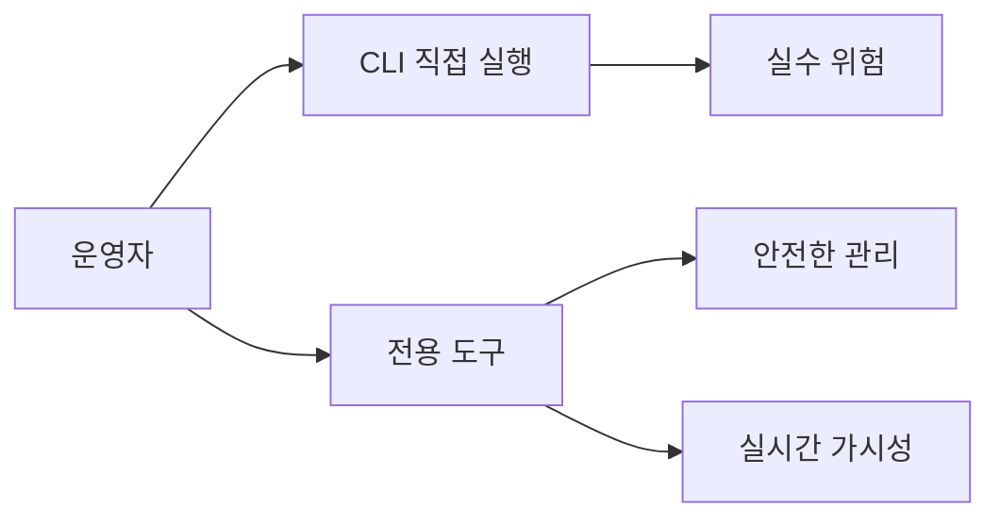
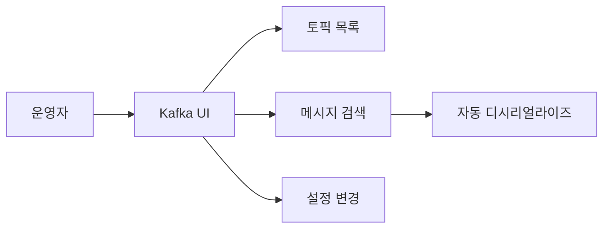
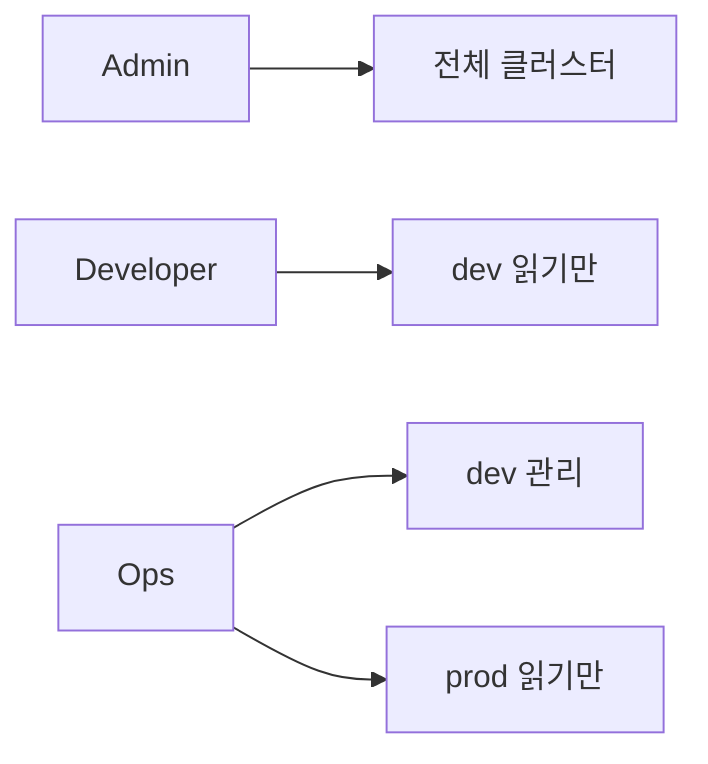
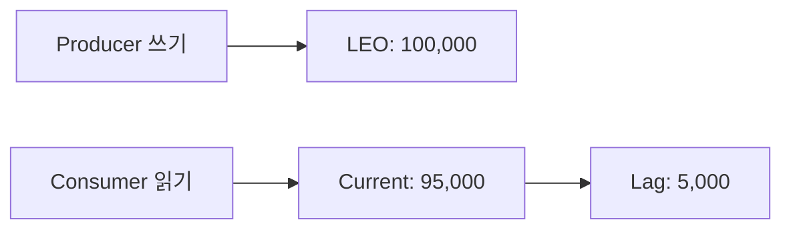
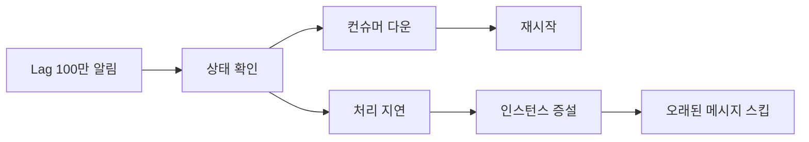
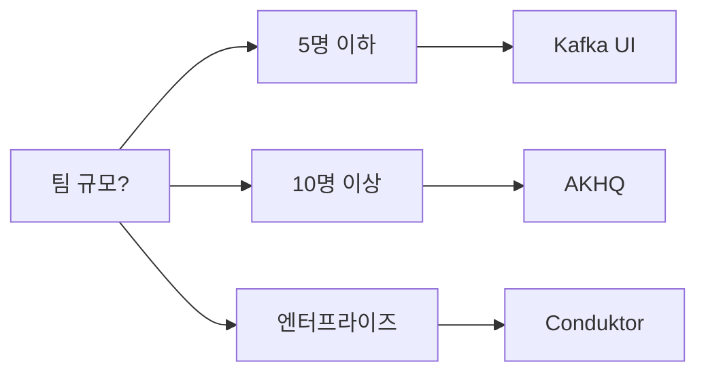

Kafka 클러스터를 운영하면 토픽 수백 개, 컨슈머 그룹 수십 개, 파티션 수천 개가 눈앞에 펼쳐진다. CLI만으로 관리하면 실수 한 번에 프로덕션 토픽이 날아간다. 이 글에서는 Kafka 전용 관리/모니터링 도구 5가지를 비교하고, 각 도구의 심화 기능과 실무 극한 시나리오까지 다룬다.

---

## 한 줄 요약

**Kafka 운영의 80%는 "보는 것"이다** — Consumer Lag, 파티션 분포, 스키마 호환성을 실시간으로 볼 수 있는 도구를 갖추면 장애 대응 시간이 절반으로 줄어든다.

---

## 왜 Kafka 전용 도구가 필요한가

Kafka는 일반적인 데이터베이스와 다르다. MySQL Workbench처럼 "테이블 열어서 데이터 확인"하는 단순한 구조가 아니다. 브로커, 토픽, 파티션, 컨슈머 그룹, 오프셋, 스키마 레지스트리까지 계층이 깊다.

> **비유**: Kafka 클러스터를 맨눈으로 운영하는 건, 계기판 없이 비행기를 조종하는 것과 같다. 고도(Consumer Lag), 속도(Throughput), 연료(디스크 사용량), 엔진 상태(브로커 health)를 계기판으로 한눈에 봐야 안전하게 착륙할 수 있다.

### CLI만으로 운영할 때 생기는 문제

1. **가시성 부족**: `kafka-consumer-groups.sh --describe`를 매번 쳐야 Lag을 볼 수 있다
2. **실수 위험**: `kafka-topics.sh --delete --topic` 명령어에 와일드카드를 잘못 넣으면 복구 불가
3. **멀티 클러스터 관리 불가**: dev/staging/prod 클러스터를 CLI로 전환하며 관리하면 환경을 착각해서 사고 발생
4. **메시지 디버깅 지옥**: Avro/Protobuf로 직렬화된 메시지를 CLI로 읽으려면 별도 디시리얼라이저 설정 필요
5. **히스토리 추적 불가**: 누가 언제 토픽을 생성했는지, 설정을 변경했는지 기록이 없다



### 전용 도구가 제공하는 핵심 가치

| 가치 | 설명 |
|------|------|
| **실시간 모니터링** | Consumer Lag, Throughput, 브로커 상태를 대시보드로 확인 |
| **안전한 조작** | 토픽 삭제 시 확인 단계, 권한 제어 |
| **메시지 검색** | Avro/JSON/Protobuf 메시지를 GUI에서 디코딩하며 검색 |
| **멀티 클러스터** | 하나의 화면에서 dev/staging/prod 전환 |
| **감사 로그** | 누가 무엇을 변경했는지 추적 |

---

## 도구 비교표

5가지 주요 도구를 한눈에 비교한다.

| 항목 | Kafka UI | AKHQ | Conduktor | Offset Explorer | kafka CLI |
|------|----------|------|-----------|-----------------|-----------|
| **유형** | 오픈소스 Web | 오픈소스 Web | 상용 Desktop/Web | 상용 Desktop | 내장 CLI |
| **가격** | 무료 | 무료 | 무료/유료 | $50~ | 무료 |
| **설치 난이도** | Docker 1줄 | Docker 1줄 | 설치파일 | 설치파일 | Kafka 번들 |
| **멀티 클러스터** | O | O | O | O | X |
| **메시지 검색** | O | O | O (고급) | O | 기본 |
| **컨슈머 그룹** | O | O | O | O | O |
| **스키마 레지스트리** | O | O | O (고급) | X | X |
| **ACL 관리** | 기본 | O | O | X | O |
| **데이터 마스킹** | X | X | O (유료) | X | X |
| **실시간 Lag 차트** | O | O | O | 제한적 | X |
| **추천 환경** | 소/중규모 팀 | 중/대규모 팀 | 엔터프라이즈 | 개인/소규모 | 스크립트 자동화 |

> **비유**: Kafka UI는 가성비 좋은 국산차, AKHQ는 튜닝된 수입차, Conduktor는 풀옵션 벤츠, Offset Explorer는 정비사 전용 진단기, CLI는 렌치와 드라이버 세트다. 목적에 맞는 도구를 고르면 된다.

---

## Kafka UI 심화

[Kafka UI](https://github.com/provectus/kafka-ui)는 Provectus에서 개발한 오픈소스 웹 기반 Kafka 관리 도구다. Docker 한 줄이면 바로 사용 가능하고, 기능 대비 진입 장벽이 가장 낮다.

### 설치와 기본 설정

```yaml
# docker-compose.yml
version: '3'
services:
  kafka-ui:
    image: provectuslabs/kafka-ui:latest
    container_name: kafka-ui
    ports:
      - "8080:8080"
    environment:
      KAFKA_CLUSTERS_0_NAME: local-dev
      KAFKA_CLUSTERS_0_BOOTSTRAPSERVERS: kafka:9092
      KAFKA_CLUSTERS_0_SCHEMAREGISTRY: http://schema-registry:8081
      KAFKA_CLUSTERS_0_KAFKACONNECT_0_NAME: connect
      KAFKA_CLUSTERS_0_KAFKACONNECT_0_ADDRESS: http://connect:8083
      # 멀티 클러스터 설정
      KAFKA_CLUSTERS_1_NAME: staging
      KAFKA_CLUSTERS_1_BOOTSTRAPSERVERS: kafka-staging:9092
```

환경 변수 네이밍 규칙이 핵심이다. `KAFKA_CLUSTERS_{인덱스}_{설정}`으로 클러스터를 여러 개 등록할 수 있다.

### 토픽 관리

Kafka UI에서 토픽 관리는 크게 세 가지 작업으로 나뉜다.

**1) 토픽 생성**

GUI에서 토픽 이름, 파티션 수, 레플리케이션 팩터, 그리고 추가 설정(retention.ms, cleanup.policy 등)을 입력한다. CLI에서는 실수하기 쉬운 설정값을 드롭다운으로 선택할 수 있어 안전하다.

**2) 토픽 설정 변경**

```bash
# CLI로 하면 이런 명령어를 직접 쳐야 한다
kafka-configs.sh --bootstrap-server localhost:9092 \
  --entity-type topics --entity-name order-events \
  --alter --add-config retention.ms=604800000

# Kafka UI에서는 토픽 → Settings 탭에서 클릭 몇 번이면 끝
```

**3) 토픽 메시지 확인**

토픽의 메시지를 실시간으로 확인할 수 있다. JSON, Avro, Protobuf 모두 자동 디시리얼라이즈된다.



### 컨슈머 그룹 모니터링

Kafka UI의 가장 강력한 기능 중 하나다. 컨슈머 그룹 화면에서 다음을 확인할 수 있다.

| 항목 | 설명 |
|------|------|
| **State** | Stable, Rebalancing, Empty, Dead 상태 |
| **Members** | 현재 연결된 컨슈머 인스턴스 목록 |
| **Topic Lag** | 토픽별 총 Lag |
| **Partition Lag** | 파티션별 Current Offset vs End Offset |

특히 **파티션별 Lag 분포**를 한눈에 볼 수 있다. 특정 파티션만 Lag이 쌓이고 있다면 Hot Partition 문제를 즉시 발견할 수 있다.

```yaml
# Kafka UI에서 RBAC(역할 기반 접근 제어) 설정
# application.yml 방식
auth:
  type: LOGIN_FORM
spring:
  security:
    user:
      name: admin
      password: admin-secret
```

### 메시지 검색

Kafka UI의 메시지 검색은 세 가지 모드를 지원한다.

1. **Offset 기반**: 특정 파티션의 특정 오프셋부터 읽기
2. **Timestamp 기반**: 특정 시간 이후의 메시지만 조회
3. **필터 기반**: JavaScript 표현식으로 메시지 내용 필터링

```javascript
// Kafka UI 메시지 필터 예시
// 주문 금액이 100만원 이상인 메시지만 필터링
record.value.orderAmount > 1000000

// 특정 사용자의 이벤트만 검색
record.value.userId === 'user-12345'

// 키 기반 필터링
record.key === 'ORDER-2026-001'
```

> **비유**: Kafka UI의 메시지 검색은 CCTV 녹화 영상을 돌려보는 것과 같다. 시간대를 지정해서 찾을 수도 있고(Timestamp), 프레임 번호로 찾을 수도 있고(Offset), 특정 인물이 나오는 장면만 필터링할 수도 있다(JavaScript 필터).

### Kafka UI의 한계

- **대규모 클러스터 성능**: 파티션 10,000개 이상이면 UI 로딩이 느려진다
- **세밀한 권한 관리**: Enterprise 기능은 유료 버전에서만 제공
- **알림 기능 부재**: Lag 임계치 초과 시 알림 발송 기능이 없다 (별도 모니터링 도구 필요)

---

## AKHQ 심화

[AKHQ](https://github.com/tchiotludo/akhq)(구 KafkaHQ)는 멀티 클러스터 관리와 세밀한 보안 설정에 강한 오픈소스 도구다. Java/Micronaut 기반으로 만들어져 성능이 좋고, Kafka Streams 상태 저장소까지 확인할 수 있다.

### 설치

```yaml
# docker-compose.yml
version: '3'
services:
  akhq:
    image: tchiotludo/akhq:latest
    container_name: akhq
    ports:
      - "8080:8080"
    volumes:
      - ./akhq-config.yml:/app/application.yml
```

### 멀티 클러스터 설정

AKHQ의 설정 파일은 YAML 기반이며, 클러스터별로 상세한 설정이 가능하다.

```yaml
# application.yml
akhq:
  connections:
    dev-cluster:
      properties:
        bootstrap.servers: "dev-kafka-1:9092,dev-kafka-2:9092"
      schema-registry:
        url: "http://dev-schema-registry:8081"
      connect:
        - name: "dev-connect"
          url: "http://dev-connect:8083"

    prod-cluster:
      properties:
        bootstrap.servers: "prod-kafka-1:9092,prod-kafka-2:9092"
        security.protocol: SASL_SSL
        sasl.mechanism: SCRAM-SHA-256
        sasl.jaas.config: >
          org.apache.kafka.common.security.scram.ScramLoginModule
          required username="admin" password="prod-secret";
      schema-registry:
        url: "http://prod-schema-registry:8081"
        properties:
          basic.auth.credentials.source: USER_INFO
          basic.auth.user.info: "admin:schema-secret"
```

프로덕션 클러스터는 SASL_SSL로 보호하고, 스키마 레지스트리도 별도 인증을 거는 것이 모범 사례다.

### ACL 관리

AKHQ에서는 Kafka의 ACL(Access Control List)을 GUI로 관리할 수 있다. CLI로 ACL을 설정하면 실수가 잦고, 현재 어떤 ACL이 적용되어 있는지 파악하기 어렵다.

```bash
# CLI로 ACL을 확인하려면 이런 명령을 쳐야 한다
kafka-acls.sh --bootstrap-server localhost:9092 \
  --command-config admin.properties \
  --list

# 결과가 수백 줄로 쏟아진다 - AKHQ에서는 테이블로 정리되어 나온다
```

AKHQ의 ACL 관리 화면에서 할 수 있는 것들:

| 기능 | 설명 |
|------|------|
| **ACL 조회** | 리소스 타입(토픽/그룹/클러스터)별 필터링 |
| **ACL 생성** | Principal, Operation, Permission을 GUI로 설정 |
| **ACL 삭제** | 개별 ACL 선택 삭제 (실수 방지 확인 단계 포함) |
| **ACL 검색** | 특정 사용자나 토픽에 적용된 ACL 검색 |

### AKHQ RBAC 설정

AKHQ는 자체적인 역할 기반 접근 제어를 지원한다.

```yaml
# application.yml - RBAC 설정
akhq:
  security:
    default-group: no-roles
    basic-auth:
      - username: admin
        password: "$2a$10$hashvalue"  # bcrypt 해시
        groups:
          - admin
      - username: developer
        password: "$2a$10$hashvalue"
        groups:
          - reader
      - username: ops
        password: "$2a$10$hashvalue"
        groups:
          - topic-admin

    groups:
      admin:
        - role: admin
      reader:
        - role: reader
          attributes:
            topics-filter-regexp: "^(dev-|test-).*"
      topic-admin:
        - role: admin
          attributes:
            topics-filter-regexp: ".*"
          clusters:
            - dev-cluster
        - role: reader
          clusters:
            - prod-cluster
```

핵심은 **클러스터별로 다른 권한**을 부여할 수 있다는 점이다. ops 팀에게 dev 클러스터는 admin 권한을, prod 클러스터는 읽기 전용 권한을 주는 것이 가능하다.



### AKHQ vs Kafka UI 선택 기준

| 상황 | 추천 도구 |
|------|-----------|
| 빠르게 시작하고 싶다 | Kafka UI |
| ACL/보안이 중요하다 | AKHQ |
| Kafka Streams 사용 | AKHQ |
| Connect 관리 중심 | Kafka UI |
| LDAP/OAuth 연동 필요 | AKHQ |
| 팀 규모 5명 이하 | Kafka UI |
| 팀 규모 10명 이상 | AKHQ |

---

## Conduktor — 엔터프라이즈 솔루션

[Conduktor](https://www.conduktor.io/)는 Kafka 전용 관리 도구 중 가장 기능이 풍부한 상용 솔루션이다. 데스크톱 앱과 웹 플랫폼 두 가지 형태로 제공된다.

### 스키마 레지스트리 관리

Conduktor의 스키마 레지스트리 관리는 다른 도구보다 한 단계 앞선다.

**1) 스키마 시각화**

Avro, Protobuf, JSON Schema를 시각적으로 보여주며, 필드 간 관계를 그래프로 표현한다.

**2) 호환성 검증**

스키마를 수정하기 전에 기존 버전과의 호환성을 미리 검증할 수 있다.

```json
// Avro 스키마 예시 - 주문 이벤트
{
  "type": "record",
  "name": "OrderEvent",
  "namespace": "com.example.kafka",
  "fields": [
    {"name": "orderId", "type": "string"},
    {"name": "userId", "type": "string"},
    {"name": "amount", "type": "long"},
    {"name": "status", "type": {
      "type": "enum",
      "name": "OrderStatus",
      "symbols": ["CREATED", "PAID", "SHIPPED", "DELIVERED"]
    }},
    // 새 필드 추가 시 default 값 필수 (BACKWARD 호환)
    {"name": "couponCode", "type": ["null", "string"], "default": null}
  ]
}
```

**3) 스키마 버전 비교**

버전 간 diff를 제공한다. 어떤 필드가 추가/삭제/변경되었는지 한눈에 파악할 수 있다.

### 데이터 마스킹 (유료 기능)

Conduktor Gateway를 통해 실시간 데이터 마스킹이 가능하다. 개인정보 보호 규정(GDPR, 개인정보보호법)을 준수해야 하는 환경에서 핵심 기능이다.

```yaml
# Conduktor Gateway 데이터 마스킹 설정
interceptors:
  - name: mask-personal-data
    pluginClass: io.conduktor.gateway.interceptor.FieldLevelEncryptionPlugin
    priority: 100
    config:
      topic: user-events
      fields:
        - fieldName: email
          algorithm: MASK
          maskChar: "*"
          preserveLength: true
        - fieldName: phoneNumber
          algorithm: MASK
          maskChar: "X"
          showLastN: 4
        - fieldName: ssn
          algorithm: FULL_HASH
```

적용 결과:

| 원본 | 마스킹 후 |
|------|-----------|
| `kim@example.com` | `***@*******.***` |
| `010-1234-5678` | `XXX-XXXX-5678` |
| `900101-1234567` | `a3f2b1c9e8d7...` (해시) |

> **비유**: Conduktor의 데이터 마스킹은 은행 창구의 칸막이와 같다. 데이터(고객)는 정상적으로 흘러가지만, 민감한 부분(얼굴)은 가려진 채로 전달된다. 원본 데이터를 건드리지 않고 소비자에게는 마스킹된 데이터만 보여주는 것이 핵심이다.

### Conduktor의 강점과 약점

**강점:**
- 스키마 레지스트리 관리 최고 수준
- 데이터 마스킹, 감사 로그 등 엔터프라이즈 기능
- Kafka Connect, ksqlDB 통합 관리
- 직관적인 UI/UX

**약점:**
- 유료 (팀 규모에 따라 비용 증가)
- 오픈소스가 아니어서 커스터마이징 불가
- 소규모 팀에는 과한 기능

---

## Offset Explorer (구 Kafka Tool)

[Offset Explorer](https://www.kafkatool.com/)는 오랫동안 "Kafka Tool"이라는 이름으로 사랑받아온 데스크톱 GUI 도구다. 2021년에 Offset Explorer로 이름이 바뀌었다.

### 특징

Offset Explorer는 다른 웹 기반 도구와 다르게 **데스크톱 앱**이다. 설치만 하면 별도 서버 없이 로컬에서 직접 Kafka 클러스터에 연결한다.

**주요 기능:**
- 브로커, 토픽, 파티션, 컨슈머 그룹을 트리 구조로 탐색
- 메시지 조회 (String, Avro, Long 등 디시리얼라이저 선택)
- 파티션별 오프셋 확인 및 수동 조정
- 토픽 생성/삭제/설정 변경

### 연결 설정

```text
# Offset Explorer 연결 설정 항목
Cluster Name: production-kafka
Kafka Cluster Version: 3.6
Zookeeper Host: zk1:2181,zk2:2181,zk3:2181   (레거시)
Bootstrap Servers: kafka1:9092,kafka2:9092      (추천)

# SASL 인증
Security Protocol: SASL_PLAINTEXT
SASL Mechanism: PLAIN
JAAS Config: org.apache.kafka.common.security.plain.PlainLoginModule
             required username="user" password="pass";
```

### 실무 활용 팁

**1) 파티션 오프셋 리셋**

개발 환경에서 컨슈머 그룹의 오프셋을 특정 시점으로 되돌려야 할 때, Offset Explorer에서 GUI로 바로 수행할 수 있다.

**2) 메시지 프로듀싱**

테스트용 메시지를 GUI에서 직접 프로듀싱할 수 있다. CLI의 `kafka-console-producer.sh`보다 편리하다.

**3) 파티션 데이터 분포 확인**

각 파티션에 메시지가 얼마나 들어있는지 시각적으로 확인할 수 있어, 파티셔너의 키 분배가 균등한지 빠르게 점검 가능하다.

### Offset Explorer의 한계

- 웹 기반이 아니라서 팀 공유 어려움
- 스키마 레지스트리 미지원
- ACL 관리 불가
- 대규모 메시지 검색 시 속도 저하
- 라이선스 비용 발생 (개인: $50, 팀: $100+)

---

## kafka CLI 고급

Kafka에 기본 포함된 CLI 도구는 자동화 스크립트와 CI/CD 파이프라인에서 여전히 필수적이다. GUI 도구가 아무리 좋아도 CLI를 대체할 수 없는 영역이 있다.

### kafka-consumer-groups.sh

컨슈머 그룹 관리의 핵심 도구다.

```bash
# 1. 모든 컨슈머 그룹 목록
kafka-consumer-groups.sh --bootstrap-server localhost:9092 --list

# 2. 특정 그룹의 상세 정보 (가장 자주 쓰는 명령)
kafka-consumer-groups.sh --bootstrap-server localhost:9092 \
  --group order-processor --describe

# 출력 예시:
# GROUP           TOPIC          PARTITION  CURRENT-OFFSET  LOG-END-OFFSET  LAG
# order-processor order-events   0          15234           15240           6
# order-processor order-events   1          14890           24890           10000
# order-processor order-events   2          16001           16005           4
# → 파티션 1에 Lag 10,000 집중! Hot Partition 의심

# 3. 오프셋 리셋 (컨슈머 그룹 중지 상태에서만 가능)
# 3-1) 가장 최신으로 리셋
kafka-consumer-groups.sh --bootstrap-server localhost:9092 \
  --group order-processor --reset-offsets \
  --to-latest --topic order-events --execute

# 3-2) 특정 시간으로 리셋
kafka-consumer-groups.sh --bootstrap-server localhost:9092 \
  --group order-processor --reset-offsets \
  --to-datetime 2026-05-15T09:00:00.000 \
  --topic order-events --execute

# 3-3) 특정 오프셋으로 리셋
kafka-consumer-groups.sh --bootstrap-server localhost:9092 \
  --group order-processor --reset-offsets \
  --to-offset 15000 --topic order-events:1 --execute

# 4. 컨슈머 그룹 삭제
kafka-consumer-groups.sh --bootstrap-server localhost:9092 \
  --group old-consumer --delete
```

> **비유**: `kafka-consumer-groups.sh`는 택배 추적 시스템이다. 어떤 트럭(컨슈머)이 어디까지 배송했는지(Current Offset), 물류창고에 몇 개나 쌓여있는지(Lag)를 보여준다. Lag이 높다는 건 "배송 지연"이다.

### kafka-reassign-partitions.sh

파티션을 브로커 간에 재배치하는 도구다. 브로커 추가/제거 시, 또는 디스크 사용량 불균형 해소 시 사용한다.

```bash
# 1단계: 재배치 계획 생성
# topics-to-move.json
cat > /tmp/topics-to-move.json << 'EOF'
{
  "topics": [
    {"topic": "order-events"},
    {"topic": "payment-events"}
  ],
  "version": 1
}
EOF

# 2단계: 재배치 계획 생성 (브로커 1,2,3으로 분배)
kafka-reassign-partitions.sh --bootstrap-server localhost:9092 \
  --topics-to-move-json-file /tmp/topics-to-move.json \
  --broker-list "1,2,3" \
  --generate

# 3단계: 생성된 계획을 파일로 저장 후 실행
kafka-reassign-partitions.sh --bootstrap-server localhost:9092 \
  --reassignment-json-file /tmp/reassignment-plan.json \
  --execute

# 4단계: 진행 상황 확인
kafka-reassign-partitions.sh --bootstrap-server localhost:9092 \
  --reassignment-json-file /tmp/reassignment-plan.json \
  --verify
```

**주의사항:** 재배치 중에는 브로커 간 대량의 데이터 복사가 발생한다. 프로덕션에서는 **throttle** 설정이 필수다.

```bash
# 네트워크 대역폭 제한 (50MB/s)
kafka-reassign-partitions.sh --bootstrap-server localhost:9092 \
  --reassignment-json-file /tmp/reassignment-plan.json \
  --execute \
  --throttle 52428800
```

### kafka-configs.sh 고급 사용법

```bash
# 토픽의 동적 설정 변경
kafka-configs.sh --bootstrap-server localhost:9092 \
  --entity-type topics --entity-name order-events \
  --alter --add-config \
  'retention.ms=259200000,max.message.bytes=10485760,cleanup.policy=compact'

# 브로커의 동적 설정 변경 (재시작 불필요!)
kafka-configs.sh --bootstrap-server localhost:9092 \
  --entity-type brokers --entity-name 1 \
  --alter --add-config \
  'log.cleaner.threads=4,num.io.threads=16'

# 설정 확인
kafka-configs.sh --bootstrap-server localhost:9092 \
  --entity-type topics --entity-name order-events \
  --describe
```

### CLI 자동화 스크립트 예시

```bash
#!/bin/bash
# lag-alert.sh - Consumer Lag 모니터링 스크립트

BOOTSTRAP="localhost:9092"
THRESHOLD=10000
ALERT_WEBHOOK="https://hooks.slack.com/services/xxx/yyy/zzz"

kafka-consumer-groups.sh --bootstrap-server $BOOTSTRAP --list | while read group; do
  kafka-consumer-groups.sh --bootstrap-server $BOOTSTRAP \
    --group "$group" --describe 2>/dev/null | \
  awk -v threshold=$THRESHOLD -v group="$group" '
    NR > 1 && $6 > threshold {
      printf "[ALERT] Group=%s Topic=%s Partition=%s Lag=%s\n",
        group, $2, $3, $6
    }
  '
done | while read alert; do
  curl -s -X POST "$ALERT_WEBHOOK" \
    -H 'Content-Type: application/json' \
    -d "{\"text\": \"$alert\"}"
done
```

---

## Consumer Lag 모니터링

Consumer Lag은 Kafka 운영에서 가장 중요한 지표다. Lag이 계속 증가하면 데이터 처리가 지연되고 있다는 뜻이고, 결국 서비스 장애로 이어진다.

### Consumer Lag이란?

```
Log End Offset (LEO) = Producer가 쓴 마지막 메시지 위치
Current Offset       = Consumer가 읽은 마지막 메시지 위치
Consumer Lag         = LEO - Current Offset
```



### 극한 시나리오: Consumer Lag 100만

어느 날 아침, 모니터링 대시보드에 Consumer Lag 1,000,000이 찍혀 있다. 이것은 **빨간불**이다.

**원인 분석 순서:**

1. **컨슈머가 죽었는가?** — 컨슈머 그룹 상태 확인
2. **처리 속도가 느려졌는가?** — 컨슈머 로그에서 처리 시간 확인
3. **갑자기 트래픽이 폭증했는가?** — Producer 메트릭 확인
4. **특정 파티션에 집중되었는가?** — 파티션별 Lag 분포 확인

```bash
# 1단계: 컨슈머 그룹 상태 확인
kafka-consumer-groups.sh --bootstrap-server localhost:9092 \
  --group order-processor --describe --state

# STATE: Empty → 컨슈머가 모두 죽어있다!
# STATE: Stable, 하지만 Lag 100만 → 처리 속도 < 생산 속도

# 2단계: 파티션별 Lag 분포 확인
kafka-consumer-groups.sh --bootstrap-server localhost:9092 \
  --group order-processor --describe

# 3단계: 긴급 대응 - 컨슈머 인스턴스 증설
# (파티션 수만큼 컨슈머를 늘릴 수 있다)

# 4단계: 이미 처리 불가능한 오래된 메시지는 스킵
# (비즈니스 판단 후)
kafka-consumer-groups.sh --bootstrap-server localhost:9092 \
  --group order-processor --reset-offsets \
  --to-latest --topic order-events --execute
```

**Lag 100만 대응 플로우:**



> **비유**: Consumer Lag 100만은 택배 물류센터에 상자 100만 개가 쌓인 상황이다. 배달 트럭(컨슈머)이 고장 났거나, 주문이 갑자기 폭증했거나, 도로가 막힌(외부 API 지연) 것이다. 해결책은 트럭 수리(재시작), 트럭 증차(스케일 아웃), 또는 오래된 택배 폐기(오프셋 스킵)다.

### Lag 모니터링 도구 비교

| 도구 | 방식 | 장점 | 단점 |
|------|------|------|------|
| **Burrow** (LinkedIn) | 독립 데몬 | Lag 증가 추세 분석, 상태 판정 | 별도 설치 필요 |
| **Kafka Exporter** | Prometheus 연동 | Grafana 대시보드 | 메트릭만 수집 |
| **Kafka UI/AKHQ** | 내장 기능 | 별도 설치 불필요 | 알림 기능 제한 |
| **Datadog/NewRelic** | SaaS | 풍부한 알림, 대시보드 | 유료 |

### Prometheus + Grafana 설정

```yaml
# docker-compose.yml - Kafka Exporter
kafka-exporter:
  image: danielqsj/kafka-exporter:latest
  command:
    - '--kafka.server=kafka:9092'
    - '--topic.filter=.*'
    - '--group.filter=.*'
  ports:
    - "9308:9308"

# prometheus.yml
scrape_configs:
  - job_name: 'kafka-exporter'
    static_configs:
      - targets: ['kafka-exporter:9308']
    scrape_interval: 15s
```

```yaml
# Grafana Alert Rule (PromQL)
# Consumer Lag이 10,000 초과 시 알림
# kafka_consumergroup_lag_sum{consumergroup="order-processor"} > 10000
# for: 5m  (5분 이상 지속 시)
```

### Lag 예방 전략

| 전략 | 설명 |
|------|------|
| **파티션 수 적절히 설계** | 예상 TPS / 단일 컨슈머 처리량 = 최소 파티션 수 |
| **컨슈머 처리 비동기화** | DB 쓰기 등 무거운 작업은 별도 스레드풀로 분리 |
| **배치 처리** | `max.poll.records`를 늘려 한 번에 많이 가져오기 |
| **컨슈머 헬스체크** | Lag 증가 추세를 감지해 자동 스케일 |
| **Dead Letter Topic** | 처리 실패 메시지를 별도 토픽으로 격리 |

---

## Schema Registry 도구

스키마 레지스트리는 Kafka에서 Avro, Protobuf, JSON Schema를 중앙 관리하는 컴포넌트다. 스키마 진화(evolution)를 관리하지 않으면 Producer와 Consumer 사이의 계약이 깨져서 역직렬화 실패가 발생한다.

### 스키마 호환성 모드

| 모드 | 설명 | 허용 | 금지 |
|------|------|------|------|
| **BACKWARD** | 새 스키마로 이전 데이터 읽기 가능 | 필드 삭제, default 있는 필드 추가 | default 없는 필드 추가 |
| **FORWARD** | 이전 스키마로 새 데이터 읽기 가능 | default 없는 필드 추가 | 필드 삭제 |
| **FULL** | 양방향 호환 | default 있는 필드 추가/삭제 | 타입 변경 |
| **NONE** | 호환성 검사 없음 | 모두 허용 | - |

```bash
# Schema Registry REST API로 호환성 검사
# 스키마 등록
curl -X POST http://localhost:8081/subjects/order-events-value/versions \
  -H "Content-Type: application/vnd.schemaregistry.v1+json" \
  -d '{
    "schema": "{\"type\":\"record\",\"name\":\"Order\",\"fields\":[{\"name\":\"orderId\",\"type\":\"string\"},{\"name\":\"amount\",\"type\":\"long\"}]}"
  }'

# 호환성 검사 (등록 전 미리 확인)
curl -X POST http://localhost:8081/compatibility/subjects/order-events-value/versions/latest \
  -H "Content-Type: application/vnd.schemaregistry.v1+json" \
  -d '{
    "schema": "{\"type\":\"record\",\"name\":\"Order\",\"fields\":[{\"name\":\"orderId\",\"type\":\"string\"},{\"name\":\"amount\",\"type\":\"long\"},{\"name\":\"currency\",\"type\":[\"null\",\"string\"],\"default\":null}]}"
  }'
# 결과: {"is_compatible": true}

# 모든 스키마 Subject 조회
curl http://localhost:8081/subjects

# 특정 Subject의 버전 목록
curl http://localhost:8081/subjects/order-events-value/versions
```

### GUI 도구에서 스키마 관리

| 도구 | 스키마 조회 | 호환성 검사 | 버전 비교 | 스키마 등록 |
|------|-------------|-------------|-----------|-------------|
| Kafka UI | O | O | 기본 | O |
| AKHQ | O | O | O | O |
| Conduktor | O | O | 고급(시각화) | O |
| Offset Explorer | X | X | X | X |

---

## 극한 시나리오: 파티션 리밸런싱

### 시나리오: 리밸런싱 폭풍

컨슈머 인스턴스가 불안정하게 죽었다 살았다를 반복하면 **리밸런싱 폭풍(Rebalancing Storm)**이 발생한다. 리밸런싱 동안 모든 컨슈머가 메시지 처리를 멈추므로, 빈번한 리밸런싱은 곧 서비스 장애다.

```text
09:00:01 Consumer-3 heartbeat timeout → 리밸런싱 시작
09:00:15 리밸런싱 완료, 파티션 재배치
09:00:18 Consumer-3 다시 연결 → 리밸런싱 시작
09:00:32 리밸런싱 완료
09:00:35 Consumer-2 GC pause → heartbeat 실패 → 리밸런싱 시작
... (무한 반복)
```

**진단 방법 (도구별):**

```bash
# CLI로 확인
kafka-consumer-groups.sh --bootstrap-server localhost:9092 \
  --group order-processor --describe --state
# STATE가 계속 "Rebalancing"으로 나타남

# Kafka UI: Consumer Groups 화면에서 State 칼럼이 빨간색으로 깜빡임
# AKHQ: Consumer Groups → State History에서 리밸런싱 빈도 확인
```

**해결책:**

```properties
# 1. session.timeout.ms 늘리기 (기본 45초 → 분석 후 조정)
session.timeout.ms=60000

# 2. heartbeat.interval.ms 조정 (session.timeout의 1/3)
heartbeat.interval.ms=20000

# 3. max.poll.interval.ms 늘리기 (처리가 오래 걸리는 경우)
max.poll.interval.ms=600000

# 4. Static Group Membership 사용 (Kafka 2.3+)
# 컨슈머 재시작 시 리밸런싱 방지
group.instance.id=consumer-host-1
```

> **비유**: 리밸런싱 폭풍은 회의실에서 자리 배치를 하는데, 한 명이 자리에서 일어날 때마다 모든 사람이 일어나서 자리를 다시 정하는 상황이다. Static Group Membership은 "네 이름표가 붙은 자리"를 만들어주는 것이다. 잠깐 화장실에 갔다 와도 자리는 그대로 남아있다.

---

## 극한 시나리오: 토픽 데이터 복구

### 시나리오: 실수로 토픽 삭제

```bash
# 개발자가 prod 클러스터에서 실수로 토픽 삭제
kafka-topics.sh --bootstrap-server prod-kafka:9092 \
  --delete --topic order-events
# "이거 dev 클러스터 아니었어?!"
```

**Kafka에서 삭제된 토픽은 복구가 불가능하다.** 이것이 GUI 도구를 써야 하는 가장 큰 이유 중 하나다.

### 사전 방지 전략

```bash
# 1. 토픽 삭제 비활성화 (브로커 설정)
# server.properties
delete.topic.enable=false

# 2. ACL로 삭제 권한 제한
kafka-acls.sh --bootstrap-server localhost:9092 \
  --add --deny-principal User:developer \
  --operation Delete --topic '*' \
  --command-config admin.properties
```

```yaml
# 3. Kafka UI에서 읽기 전용 모드 설정
# docker-compose.yml
environment:
  KAFKA_CLUSTERS_0_READONLY: "true"  # prod는 읽기 전용
```

### 데이터 복구 방법 (토픽이 아직 retention 내인 경우)

토픽 자체는 삭제되었지만, 다른 시스템에 데이터가 남아있을 수 있다.

| 복구 소스 | 방법 |
|-----------|------|
| **Kafka MirrorMaker** | 미러링 클러스터에서 복사 |
| **Kafka Connect S3 Sink** | S3 백업에서 재프로듀싱 |
| **Consumer 애플리케이션 DB** | 이미 처리된 데이터는 DB에 있음 |
| **CDC (Debezium)** | DB에서 다시 이벤트 생성 |

```bash
# S3 백업에서 복구하는 예시
# 1. 토픽 재생성
kafka-topics.sh --bootstrap-server localhost:9092 \
  --create --topic order-events \
  --partitions 12 --replication-factor 3

# 2. S3에서 데이터를 읽어 다시 프로듀싱
# (Kafka Connect S3 Source Connector 사용)
curl -X POST http://connect:8083/connectors -H "Content-Type: application/json" \
  -d '{
    "name": "s3-order-events-restore",
    "config": {
      "connector.class": "io.confluent.connect.s3.source.S3SourceConnector",
      "s3.bucket.name": "kafka-backup",
      "s3.region": "ap-northeast-2",
      "topics.dir": "topics",
      "topics": "order-events",
      "format.class": "io.confluent.connect.s3.format.avro.AvroFormat"
    }
  }'
```

---

## 실무 실수 TOP 5

### 1. 프로덕션에서 오프셋을 --to-earliest로 리셋

```bash
# 절대 하면 안 되는 것
kafka-consumer-groups.sh --bootstrap-server prod:9092 \
  --group payment-processor --reset-offsets \
  --to-earliest --all-topics --execute

# 결과: 수년간의 모든 메시지를 처음부터 재처리
# → 중복 결제 발생, 고객에게 이중 청구
```

**교훈:** `--to-earliest`는 반드시 `--dry-run`으로 먼저 확인하고, 영향 범위를 파악한 후 실행한다.

### 2. partition 수를 줄이려고 시도

```bash
# Kafka는 파티션 수를 줄일 수 없다!
kafka-topics.sh --bootstrap-server localhost:9092 \
  --alter --topic order-events --partitions 6
# 현재 12개 → 6개로 줄이려 하면:
# Error: The number of partitions for a topic can only be increased
```

**교훈:** 파티션 수는 처음에 신중하게 결정해야 한다. 줄여야 한다면 새 토픽을 만들어 데이터를 마이그레이션하는 수밖에 없다.

### 3. retention.ms를 0으로 설정

```bash
# "디스크 정리 좀 하자"고 하다가...
kafka-configs.sh --bootstrap-server localhost:9092 \
  --entity-type topics --entity-name order-events \
  --alter --add-config retention.ms=0

# 결과: 모든 메시지가 즉시 삭제됨!
# 의도: retention.ms=-1 (무기한 보관)이었을 수도 있음
```

**교훈:** retention 설정 변경은 `--describe`로 현재 값을 먼저 확인하고, 변경 후 즉시 재확인한다.

### 4. 컨슈머 그룹 ID 충돌

```yaml
# 서로 다른 애플리케이션이 같은 group.id를 사용
# payment-service의 application.yml
spring:
  kafka:
    consumer:
      group-id: event-processor  # 이름이 너무 일반적!

# notification-service의 application.yml
spring:
  kafka:
    consumer:
      group-id: event-processor  # 같은 이름! 파티션을 나눠 가짐
```

**결과:** 두 서비스가 같은 컨슈머 그룹으로 인식되어, payment-service가 받아야 할 메시지를 notification-service가 가져간다.

**교훈:** group.id는 반드시 `{서비스명}-{용도}` 형태로 고유하게 지정한다. 예: `payment-service-order-processor`

### 5. throttle 없이 파티션 재배치

```bash
# throttle 없이 실행
kafka-reassign-partitions.sh --bootstrap-server localhost:9092 \
  --reassignment-json-file plan.json --execute
# throttle 파라미터 누락!

# 결과: 브로커 간 네트워크 대역폭 100% 사용
# → 프로듀서/컨슈머 요청 타임아웃
# → 서비스 전체 장애
```

**교훈:** `--throttle` 옵션을 반드시 사용한다. 일반적으로 네트워크 대역폭의 20~30%를 상한으로 설정한다.

---

## 도구 선택 가이드



| 상황 | 추천 도구 조합 |
|------|---------------|
| **스타트업, 소규모 팀** | Kafka UI + CLI + Kafka Exporter |
| **중규모 팀, 보안 중요** | AKHQ + Prometheus + Grafana |
| **대기업, 규제 산업** | Conduktor + AKHQ(백업) + Datadog |
| **개인 학습/개발** | Offset Explorer + CLI |
| **CI/CD 파이프라인** | CLI 스크립트 전용 |

### 도구 조합 모범 사례

실무에서는 하나의 도구만 쓰지 않는다. 목적에 따라 조합한다.

```yaml
# 실무 도구 스택 예시
일상 운영:
  - Kafka UI (토픽/메시지 조회, 간단한 설정 변경)
  - Grafana (Consumer Lag 대시보드, 알림)

심층 분석:
  - AKHQ (ACL 감사, 멀티 클러스터 비교)
  - CLI (스크립트 자동화, 파티션 재배치)

긴급 대응:
  - CLI (오프셋 리셋, 토픽 설정 긴급 변경)
  - Kafka UI (실시간 메시지 확인)

스키마 관리:
  - Conduktor (스키마 진화 시각화, 호환성 검증)
  - Schema Registry REST API (CI/CD 연동)
```

---

## 면접 포인트

<details>
<summary><strong>Q1. Consumer Lag이 지속적으로 증가할 때 어떻게 대응하나요?</strong></summary>

**단계별 대응:**

1. `kafka-consumer-groups.sh --describe`로 파티션별 Lag 분포를 확인한다
2. 특정 파티션에 Lag이 집중되었다면 Hot Partition 문제 — 키 분배 전략을 검토한다
3. 모든 파티션에 Lag이 고르게 쌓인다면 처리 속도 문제 — 컨슈머 로직의 병목(DB 쓰기, 외부 API 호출 등)을 확인한다
4. 단기 대응: 컨슈머 인스턴스를 파티션 수까지 증설한다
5. 중기 대응: 컨슈머 로직을 비동기화하거나 배치 처리로 전환한다
6. 장기 대응: 파티션 수를 늘려 병렬 처리 용량을 확장한다

**핵심 키워드:** Hot Partition, max.poll.records, 배치 처리, 수평 확장

</details>

<details>
<summary><strong>Q2. Kafka 클러스터에 브로커를 추가한 후 해야 할 작업은 무엇인가요?</strong></summary>

브로커를 추가하는 것만으로는 기존 파티션이 자동으로 재배치되지 않는다. 명시적으로 파티션을 재배치해야 한다.

1. `kafka-reassign-partitions.sh --generate`로 재배치 계획을 생성한다
2. 계획을 검토하여 데이터 이동량을 확인한다
3. `--throttle` 옵션과 함께 `--execute`로 실행한다
4. `--verify`로 완료를 확인한다
5. 새 토픽은 자동으로 새 브로커에도 분배된다

**주의:** throttle 없이 실행하면 브로커 간 네트워크 대역폭을 모두 소비하여 서비스 장애가 발생할 수 있다.

</details>

<details>
<summary><strong>Q3. Schema Registry에서 BACKWARD 호환성과 FORWARD 호환성의 차이는?</strong></summary>

- **BACKWARD**: 새 스키마(v2)로 이전 데이터(v1)를 읽을 수 있다. Consumer를 먼저 업데이트하는 전략에 적합하다. 필드 추가 시 default 값이 필수이고, 필드 삭제는 허용된다.
- **FORWARD**: 이전 스키마(v1)로 새 데이터(v2)를 읽을 수 있다. Producer를 먼저 업데이트하는 전략에 적합하다. 필드 추가는 자유롭지만, 필드 삭제 시 default 값이 필수이다.
- **FULL**: BACKWARD + FORWARD. 양방향 호환이 보장되어 가장 안전하지만, 제약이 가장 크다.

**실무 추천:** BACKWARD가 가장 널리 쓰인다. Consumer를 먼저 배포하고, 이후 Producer를 배포하는 롤링 업데이트 전략과 맞기 때문이다.

</details>

<details>
<summary><strong>Q4. 리밸런싱 폭풍(Rebalancing Storm)이 발생하면 어떻게 해결하나요?</strong></summary>

**즉시 대응:**
1. `kafka-consumer-groups.sh --describe --state`로 상태를 확인한다
2. 불안정한 컨슈머 인스턴스의 로그에서 GC pause, OOM, 네트워크 문제를 확인한다

**설정 튜닝:**
1. `session.timeout.ms`를 늘린다 (기본 45초 → 60~120초)
2. `max.poll.interval.ms`를 처리 시간에 맞게 늘린다
3. `max.poll.records`를 줄여 한 번에 가져오는 양을 줄인다

**근본적 해결:**
1. **Static Group Membership** 사용 (`group.instance.id` 설정) — 재시작 시 리밸런싱 방지
2. **CooperativeStickyAssignor** 사용 — 전체 중단 없이 증분 리밸런싱

</details>

<details>
<summary><strong>Q5. Kafka 관리 도구를 프로덕션에 도입할 때 보안 고려사항은?</strong></summary>

1. **네트워크 격리**: 관리 도구는 내부 네트워크에서만 접근 가능하게 배치한다. 외부 인터넷 노출은 절대 금지다.
2. **RBAC 적용**: AKHQ/Conduktor의 역할 기반 접근 제어를 활용한다. 개발자에게 prod 클러스터는 읽기 전용으로 제한한다.
3. **SASL/SSL 연결**: 관리 도구와 Kafka 브로커 간 통신도 암호화한다.
4. **감사 로그**: 누가 언제 어떤 작업을 했는지 기록한다. Conduktor는 내장 감사 로그를 제공한다.
5. **토픽 삭제 방지**: `delete.topic.enable=false` 또는 ACL로 삭제 권한을 제한한다.
6. **데이터 마스킹**: 개인정보가 포함된 토픽은 Conduktor Gateway의 마스킹 기능으로 보호한다.

</details>

---

## 마무리

Kafka 관리 도구 선택은 팀 규모, 보안 요구사항, 예산에 따라 달라진다. 하지만 어떤 도구를 선택하든 **CLI 기본기는 필수**다. GUI 도구가 다운되었을 때, 장애 상황에서 빠르게 대응하려면 CLI 명령어가 손에 익어 있어야 한다.

핵심 정리:

| 구분 | 요약 |
|------|------|
| **빠른 시작** | Kafka UI — Docker 한 줄이면 시작 |
| **보안/ACL** | AKHQ — 멀티 클러스터 RBAC 지원 |
| **엔터프라이즈** | Conduktor — 스키마 관리, 데이터 마스킹 |
| **데스크톱** | Offset Explorer — 서버 없이 로컬에서 |
| **자동화** | kafka CLI — 스크립트, CI/CD 필수 |
| **모니터링** | Prometheus + Grafana + Kafka Exporter |

도구는 도구일 뿐이다. **Consumer Lag의 의미를 이해하고, 파티션 전략을 설계하고, 스키마 호환성을 관리하는 것**은 도구가 아닌 엔지니어의 역량이다.
