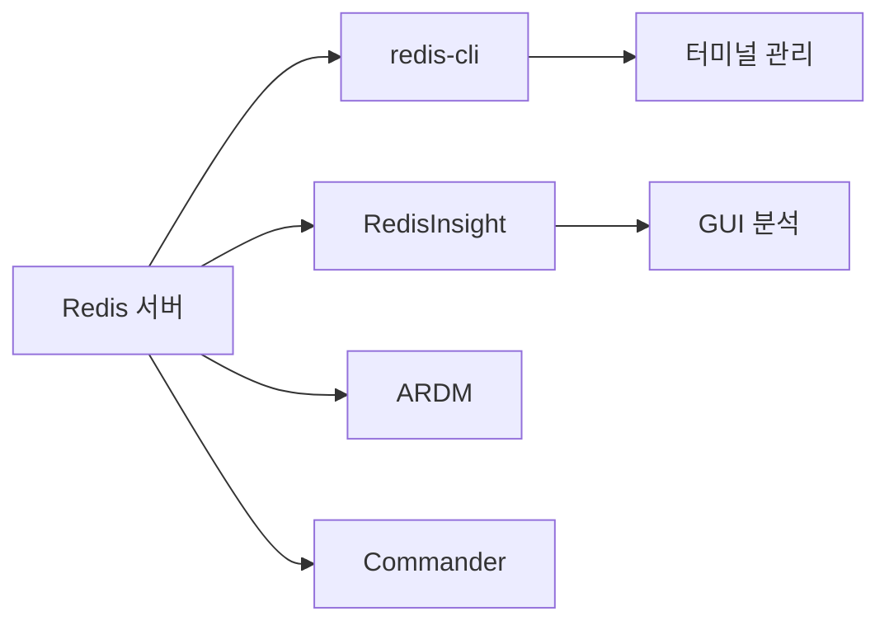
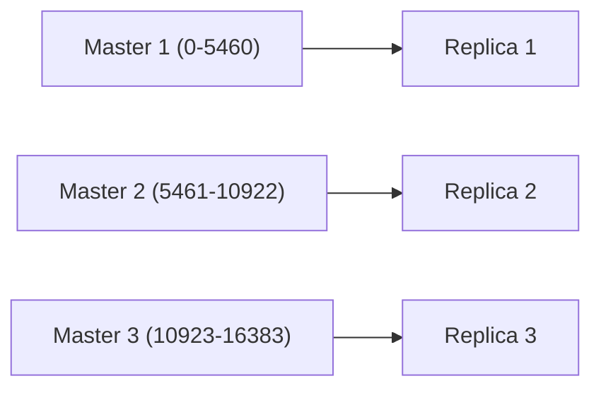
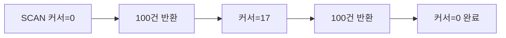
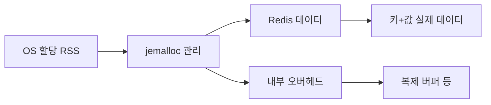
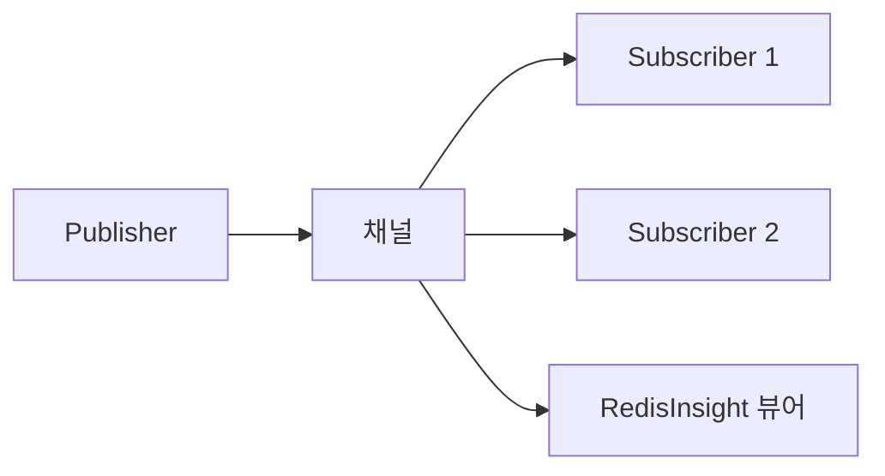
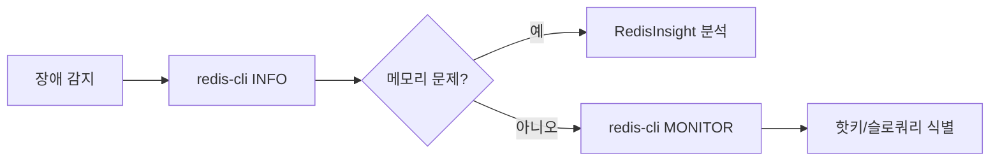
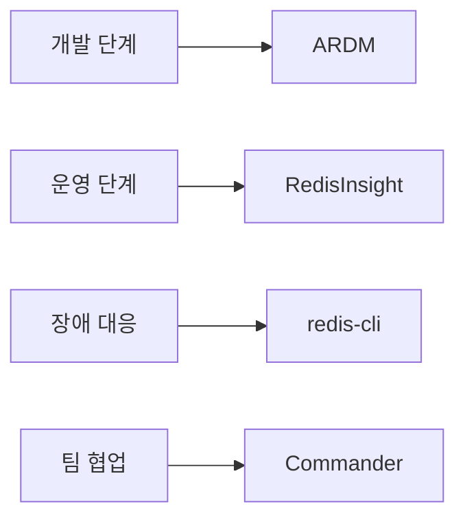

> **한 줄 요약**: Redis는 빠르지만 눈에 보이지 않습니다. RedisInsight는 종합 병원의 MRI, ARDM은 동네 의원의 초음파, redis-cli는 청진기 — 상황에 맞는 도구를 골라야 Redis의 심장 박동을 제대로 읽을 수 있습니다.

---

## 왜 Redis 전용 도구가 필요한가

Redis를 운영하면서 가장 많이 듣는 말이 있습니다. "Redis는 그냥 캐시잖아, 뭘 모니터링해?" 이 말은 "자동차에 기름만 넣으면 되지, 계기판이 왜 필요해?"와 같습니다.

Redis는 **초당 수십만 건의 명령**을 처리합니다. 그런데 이 명령들이 어디서 오는지, 메모리를 얼마나 쓰는지, 어떤 키가 병목인지 — 도구 없이는 알 수 없습니다.

### 일반 DB 도구로는 안 되는 이유

MySQL Workbench나 pgAdmin 같은 관계형 DB 도구는 **테이블 구조를 전제**로 설계되어 있습니다. Redis는 테이블이 없습니다. Key-Value, Hash, Set, Sorted Set, Stream 등 **5가지 이상의 자료구조**가 뒤섞여 있습니다.

> **비유**: 일반 DB 도구로 Redis를 관리하는 건, 한국어 사전으로 중국어를 찾는 것과 같습니다. 둘 다 "글자"라는 공통점은 있지만, 구조 자체가 다릅니다. Redis에는 Redis 전용 사전이 필요합니다.

### 도구 없이 겪는 실무 문제들

실제 운영 환경에서 도구 없이 부딪히는 상황들입니다.

1. **메모리가 갑자기 16GB를 다 씀** — 어떤 키가 얼마나 먹고 있는지 모릅니다
2. **응답 시간이 갑자기 느려짐** — Slow Log를 확인할 방법이 없습니다
3. **클러스터 노드 하나가 죽음** — 슬롯 재분배 상황을 시각적으로 파악할 수 없습니다
4. **Pub/Sub 메시지가 유실됨** — 실시간으로 채널을 모니터링할 수 없습니다
5. **특정 키에 트래픽이 몰림** — 핫키를 찾을 방법이 없습니다

이런 문제들을 해결하려면 **전용 도구**가 필수입니다. 이제 각 도구를 비교하고, 어떤 상황에 어떤 도구를 써야 하는지 살펴보겠습니다.



---

## 도구 비교표

5가지 주요 Redis 관리 도구를 한눈에 비교합니다.

| 항목 | **RedisInsight** | **ARDM** | **redis-cli** | **Commander** | **Medis** |
|------|-----------------|----------|--------------|---------------|-----------|
| **유형** | GUI (데스크톱/웹) | GUI (데스크톱) | CLI | 웹 기반 | GUI (macOS) |
| **가격** | 무료 | 무료/유료 | 무료 (내장) | 무료 (OSS) | 유료 ($4.99) |
| **클러스터 지원** | 완전 지원 | 기본 지원 | 완전 지원 | 미지원 | 미지원 |
| **메모리 분석** | 상세 분석 | 기본 조회 | MEMORY 명령 | 미지원 | 미지원 |
| **Slow Log** | GUI 시각화 | 미지원 | SLOWLOG 명령 | 미지원 | 미지원 |
| **Streams 뷰어** | 전용 UI | 기본 조회 | XRANGE 명령 | 미지원 | 미지원 |
| **Pub/Sub 디버깅** | GUI 모니터링 | 기본 지원 | SUBSCRIBE 명령 | 미지원 | 미지원 |
| **OS 지원** | Win/Mac/Linux | Win/Mac/Linux | 모든 플랫폼 | 웹 브라우저 | macOS 전용 |
| **학습 곡선** | 중간 | 낮음 | 높음 | 낮음 | 낮음 |
| **추천 대상** | 운영 엔지니어 | 개발자 | DevOps/SRE | 소규모 팀 | macOS 개인 |

### 도구 선택 기준

> **비유**: 도구 선택은 카메라 선택과 같습니다. 일상 스냅샷에는 스마트폰(ARDM), 전문 촬영에는 DSLR(RedisInsight), 빠른 장면에는 액션캠(redis-cli), 팀 공유에는 웹캠(Commander)이 적합합니다.

**상황별 추천**:

- **개발 환경에서 키 값 확인**: ARDM (가볍고 직관적)
- **운영 환경 모니터링**: RedisInsight (메모리 분석, Slow Log, 클러스터 시각화)
- **장애 대응 / 스크립트 자동화**: redis-cli (SSH 접속만 되면 바로 사용)
- **팀 공유 대시보드**: Redis Commander (브라우저만 있으면 됨)

---

## RedisInsight 심화

RedisInsight는 Redis Labs(현 Redis Inc.)에서 공식으로 제공하는 **무료 GUI 도구**입니다. 2023년에 v2로 전면 재작성되면서, 단순 키 브라우저에서 **종합 분석 플랫폼**으로 진화했습니다.

### 설치와 연결

```bash
# Docker로 설치 (가장 간편)
docker run -d --name redisinsight \
  -p 5540:5540 \
  redis/redisinsight:latest

# 브라우저에서 접속
# http://localhost:5540
```

데스크톱 버전은 [공식 사이트](https://redis.io/insight/)에서 다운로드할 수 있습니다. 설치 후 Redis 서버 주소를 입력하면 바로 연결됩니다.

```bash
# 연결 테스트 (RedisInsight 연결 전 서버 확인)
redis-cli -h 127.0.0.1 -p 6379 ping
# PONG 이 나오면 정상
```

### 클러스터 시각화

RedisInsight의 가장 강력한 기능 중 하나는 **클러스터 토폴로지 시각화**입니다. Redis Cluster는 16,384개의 해시 슬롯을 여러 노드에 분배합니다. 이 분배 상태를 한눈에 볼 수 있습니다.



**RedisInsight에서 확인할 수 있는 클러스터 정보:**

- **노드별 슬롯 분배 현황**: 어느 마스터가 어느 범위를 담당하는지
- **노드별 메모리/CPU/연결 수**: 특정 노드에 부하가 쏠리는지
- **페일오버 이력**: 마스터-레플리카 전환이 언제 발생했는지
- **리밸런싱 진행 상황**: 슬롯 마이그레이션이 진행 중인지

**극한 시나리오 — 클러스터 리밸런싱 모니터링**:

6개 노드 클러스터에서 Master 2가 메모리 사용량 90%에 도달했습니다. 슬롯 일부를 Master 1로 옮겨야 합니다.

```bash
# redis-cli로 슬롯 마이그레이션 시작
redis-cli --cluster reshard 127.0.0.1:7000 \
  --cluster-from <master2-id> \
  --cluster-to <master1-id> \
  --cluster-slots 1000

# RedisInsight에서는 이 과정을 실시간으로 시각화합니다:
# - 이동 중인 슬롯이 하이라이트됨
# - 마이그레이션 속도와 남은 시간 표시
# - 에러 발생 시 즉시 알림
```

RedisInsight의 클러스터 뷰에서는 이 과정이 **애니메이션으로 표시**됩니다. 슬롯이 한 노드에서 다른 노드로 이동하는 것을 실시간으로 볼 수 있어서, 리밸런싱이 정상적으로 진행되는지 한눈에 파악할 수 있습니다.

### Slow Log 분석

Redis는 설정된 시간(기본 10ms)보다 오래 걸린 명령을 **Slow Log**에 기록합니다. RedisInsight에서는 이 로그를 **테이블 형태**로 정렬하고 필터링할 수 있습니다.

```bash
# redis.conf 설정 (또는 CONFIG SET으로 런타임 변경)
slowlog-log-slower-than 10000  # 10ms 이상 걸린 명령 기록
slowlog-max-len 128            # 최대 128건 보관

# redis-cli에서 확인
redis-cli SLOWLOG GET 10
# 1) 1) (integer) 14               # 고유 ID
#    2) (integer) 1715900000         # 타임스탬프 (Unix)
#    3) (integer) 13250              # 소요 시간 (마이크로초)
#    4) 1) "KEYS"                    # 실행된 명령
#       2) "user:*"
```

**RedisInsight Slow Log 화면에서 제공하는 정보:**

| 컬럼 | 설명 |
|------|------|
| Timestamp | 명령 실행 시각 |
| Duration | 소요 시간 (ms) |
| Command | 실행된 명령 전문 |
| Client | 명령을 보낸 클라이언트 IP:Port |

> **비유**: Slow Log는 병원의 진료 기록과 같습니다. "이 환자(명령)가 응급실(Redis)에서 얼마나 오래 있었는지"를 기록합니다. RedisInsight는 이 기록을 차트와 표로 보여주는 **전자 의무 기록 시스템(EMR)**입니다.

**실무 팁**: `KEYS *` 명령은 프로덕션에서 절대 사용하면 안 됩니다. 키가 100만 개면 Redis가 수 초간 블로킹됩니다. Slow Log에서 `KEYS` 명령이 보이면 즉시 `SCAN`으로 교체해야 합니다.

### Memory Analysis

RedisInsight의 **Memory Analysis** 기능은 Redis 메모리 사용량을 키 패턴별, 자료구조별, TTL별로 분석합니다.

**분석 결과에서 확인할 수 있는 항목:**

1. **Top Key Namespaces**: `user:*`가 전체 메모리의 40%, `session:*`이 30% 등
2. **자료구조별 분포**: String 60%, Hash 25%, Sorted Set 10%, 기타 5%
3. **TTL 분포**: TTL 없는 키가 전체의 15% (메모리 누수 의심)
4. **Big Key 탐지**: 10MB 이상인 키 목록

```bash
# RedisInsight 없이 redis-cli로 메모리 분석하는 방법
# 특정 키의 메모리 사용량 확인
redis-cli MEMORY USAGE user:12345
# (integer) 72  # 72 바이트

# 전체 메모리 통계
redis-cli INFO memory
# used_memory_human:1.50G
# used_memory_peak_human:2.10G
# mem_fragmentation_ratio:1.12
```

**극한 시나리오 — 메모리 16GB 가득 참:**

운영 중인 Redis 서버의 `maxmemory`가 16GB로 설정되어 있고, `used_memory`가 15.8GB에 도달했습니다. RedisInsight의 Memory Analysis로 원인을 추적하는 과정입니다.

```bash
# 1단계: 현재 상태 확인
redis-cli INFO memory | grep used_memory_human
# used_memory_human:15.80G

# 2단계: eviction 정책 확인
redis-cli CONFIG GET maxmemory-policy
# "allkeys-lru"

# 3단계: 메모리 많이 쓰는 키 패턴 찾기 (redis-cli)
redis-cli --bigkeys
# [00.00%] Biggest string found so far 'cache:product:catalog'
#          with 52428800 bytes (50MB!)
# [15.33%] Biggest hash found so far 'user:sessions:active'
#          with 1048576 fields
```

RedisInsight에서는 이 분석이 **원형 차트와 트리맵**으로 시각화됩니다. "아, `cache:product:catalog`라는 50MB짜리 키 하나가 범인이구나"를 3초 만에 파악할 수 있습니다. redis-cli로는 `--bigkeys` 스캔이 수 분 걸릴 수 있습니다.

### Streams 뷰어

Redis Streams는 Kafka처럼 메시지를 순서대로 저장하는 자료구조입니다. RedisInsight는 Streams 전용 UI를 제공합니다.

**Streams 뷰어에서 확인할 수 있는 정보:**

- **메시지 타임라인**: 시간 순서대로 메시지를 스크롤하며 확인
- **Consumer Group 상태**: 각 그룹이 어디까지 읽었는지 (last-delivered-id)
- **PEL (Pending Entries List)**: 읽었지만 ACK하지 않은 메시지 목록
- **Consumer별 처리 속도**: 어떤 Consumer가 느린지

```bash
# Stream에 메시지 추가
redis-cli XADD orders * user_id 1001 product "laptop" price 1500000

# Consumer Group 생성
redis-cli XGROUP CREATE orders payment-group $ MKSTREAM

# 메시지 읽기
redis-cli XREADGROUP GROUP payment-group consumer-1 \
  COUNT 10 BLOCK 5000 STREAMS orders >

# Pending 메시지 확인 (ACK 안 된 것)
redis-cli XPENDING orders payment-group - + 10
```

RedisInsight에서는 이 모든 것이 **GUI 테이블**로 표시됩니다. XPENDING 결과를 표로 보면서 "consumer-3이 30분째 ACK 안 한 메시지가 15개 있다" 같은 문제를 즉시 발견할 수 있습니다.

---

## ARDM (Another Redis Desktop Manager)

ARDM은 원래 "Redis Desktop Manager"라는 이름으로 시작했지만, 유료화 이후 커뮤니티에서 포크한 **무료 버전**이 ARDM입니다. 가볍고 빠르며, 개발 환경에서 키 값을 빠르게 확인하는 데 최적화되어 있습니다.

### 설치

```bash
# macOS (Homebrew)
brew install --cask another-redis-desktop-manager

# Windows
# GitHub Releases에서 .exe 다운로드
# https://github.com/qishibo/AnotherRedisDesktopManager/releases

# Linux (AppImage)
chmod +x AnotherRedisDesktopManager-*.AppImage
./AnotherRedisDesktopManager-*.AppImage
```

### 핵심 기능

**1. 키 브라우저**

ARDM의 키 브라우저는 **트리 구조**로 키를 표시합니다. `user:1001:profile`, `user:1001:cart`, `user:1002:profile` 같은 키가 있으면, `user` > `1001` > `profile/cart` 형태로 폴더처럼 보여줍니다.

구분자는 기본값이 `:`이고, 설정에서 변경할 수 있습니다.

**2. 자료구조별 전용 편집기**

| 자료구조 | ARDM에서의 편집 방식 |
|---------|---------------------|
| String | 텍스트 입력/수정 |
| Hash | 필드-값 테이블 (행 추가/삭제) |
| List | 순서가 있는 목록 (위/아래 이동) |
| Set | 중복 없는 목록 (추가/삭제) |
| Sorted Set | 점수-멤버 테이블 (점수 수정) |
| Stream | 메시지 타임라인 (읽기 전용) |

**3. 터미널 내장**

ARDM 안에서 redis-cli 명령을 직접 실행할 수 있습니다. GUI와 CLI를 왔다갔다할 필요가 없습니다.

```bash
# ARDM 내장 터미널에서 실행
> INFO server
> DBSIZE
> CLIENT LIST
```

### ARDM vs RedisInsight

> **비유**: ARDM은 동네 카페의 아메리카노, RedisInsight는 호텔 라운지의 핸드드립입니다. 빠르게 키 값을 확인하고 수정하려면 ARDM이 낫고, 깊이 있는 분석이 필요하면 RedisInsight가 낫습니다.

| 비교 항목 | ARDM | RedisInsight |
|----------|------|--------------|
| 시작 속도 | 2초 이내 | 5~10초 |
| 메모리 사용량 | 약 150MB | 약 400MB |
| 키 검색 속도 | 빠름 | 보통 |
| 메모리 분석 | 없음 | 상세 |
| Slow Log | 없음 | GUI 제공 |
| 클러스터 시각화 | 기본 | 상세 |
| SSH 터널 | 지원 | 지원 |

**결론**: 개발 환경에서는 ARDM, 운영 환경에서는 RedisInsight를 쓰는 것이 가장 효율적입니다.

---

## redis-cli 고급

redis-cli는 Redis에 기본 내장된 CLI 도구입니다. SSH만 가능하면 어디서든 사용할 수 있고, **자동화 스크립트**에서 빠질 수 없는 도구입니다.

### MONITOR — 실시간 명령 도청

`MONITOR`는 Redis 서버에 들어오는 **모든 명령을 실시간으로 출력**합니다.

```bash
redis-cli MONITOR
# 1715900123.456789 [0 127.0.0.1:52345] "GET" "user:1001:profile"
# 1715900123.457012 [0 127.0.0.1:52346] "SET" "cache:product:42" "..."
# 1715900123.457234 [0 127.0.0.1:52345] "HGETALL" "user:1001:cart"
```

**출력 형식 해석:**

- `1715900123.456789`: Unix 타임스탬프
- `[0 127.0.0.1:52345]`: DB 번호와 클라이언트 IP:Port
- `"GET" "user:1001:profile"`: 실행된 명령과 인자

**주의사항**: MONITOR는 **프로덕션에서 절대 장시간 사용하면 안 됩니다.** 모든 명령을 캡처하므로 Redis 성능이 최대 50%까지 떨어집니다. 문제 추적 시 10~30초만 켜고 끄는 것이 원칙입니다.

```bash
# 10초만 모니터링하고 파일로 저장
timeout 10 redis-cli MONITOR > /tmp/redis_monitor.log 2>&1

# 특정 패턴만 필터링
redis-cli MONITOR | grep "user:1001"
```

### SCAN — 안전한 키 탐색

`KEYS *`는 Redis를 블로킹하지만, `SCAN`은 **커서 기반으로 조금씩** 탐색합니다.

```bash
# SCAN 기본 사용법
redis-cli SCAN 0 MATCH "user:*" COUNT 100
# 1) "17"          # 다음 커서 (0이면 탐색 완료)
# 2) 1) "user:1001"
#    2) "user:1002"
#    3) "user:1003"

# 커서 17부터 이어서 탐색
redis-cli SCAN 17 MATCH "user:*" COUNT 100

# 모든 키를 순회하는 스크립트
cursor=0
while true; do
  result=$(redis-cli SCAN $cursor MATCH "session:*" COUNT 1000)
  cursor=$(echo "$result" | head -1)
  keys=$(echo "$result" | tail -n +2)
  echo "$keys"
  if [ "$cursor" == "0" ]; then
    break
  fi
done
```

> **비유**: `KEYS *`는 도서관의 모든 책을 바닥에 쏟아놓고 찾는 것이고, `SCAN`은 서가를 한 칸씩 훑으면서 찾는 것입니다. 결과는 같지만, 도서관(Redis)이 멈추지 않습니다.



### MEMORY DOCTOR — 메모리 건강 진단

Redis 4.0부터 제공되는 `MEMORY DOCTOR`는 메모리 상태를 **자연어로 진단**해줍니다.

```bash
redis-cli MEMORY DOCTOR
# Sam, I have a few reports for you.

# 정상일 때:
# "Sam, I have no memory problems to report."

# 문제가 있을 때:
# "Sam, I have a few reports for you.
#  - High fragmentation: RSS is 2.1x the used memory.
#    Consider restarting Redis or using MEMORY PURGE.
#  - Peak memory usage is much higher than current usage.
#    This might indicate expired keys not being reclaimed."
```

**함께 쓰면 유용한 MEMORY 명령들:**

```bash
# 특정 키가 차지하는 메모리 (바이트 단위)
redis-cli MEMORY USAGE user:1001:profile
# (integer) 128

# 메모리 할당자 통계
redis-cli MEMORY STATS
# 1) "peak.allocated"
# 2) (integer) 2147483648
# 3) "total.allocated"
# 4) (integer) 1610612736

# 메모리 단편화 수동 정리 (Redis 4.0+)
redis-cli MEMORY PURGE
# OK
```

### DEBUG OBJECT — 키 내부 정보 확인

`DEBUG OBJECT`는 특정 키의 **인코딩 방식, 직렬화 크기, LRU 정보** 등 내부 정보를 보여줍니다.

```bash
redis-cli DEBUG OBJECT user:1001:profile
# Value at:0x7f1234567890 refcount:1 encoding:ziplist
# serializedlength:89 lru:12345678 lru_seconds_idle:120

# encoding: 내부 인코딩 (ziplist, hashtable, intset 등)
# serializedlength: RDB 직렬화 시 크기
# lru_seconds_idle: 마지막 접근 후 경과 시간 (초)
```

**실무 활용**: encoding이 `ziplist`에서 `hashtable`으로 바뀌면 메모리 사용량이 급증합니다. Hash의 field 수가 `hash-max-ziplist-entries`(기본 128)를 초과하면 이런 현상이 발생합니다.

```bash
# 인코딩 전환 임계치 확인
redis-cli CONFIG GET hash-max-ziplist-entries
# 1) "hash-max-ziplist-entries"
# 2) "128"

redis-cli CONFIG GET hash-max-ziplist-value
# 1) "hash-max-ziplist-value"
# 2) "64"
```

### 실전 redis-cli 원라이너 모음

```bash
# 1. 만료 시간 없는 키 개수 세기 (메모리 누수 탐지)
redis-cli --scan --pattern "*" | while read key; do
  ttl=$(redis-cli TTL "$key")
  if [ "$ttl" == "-1" ]; then echo "$key"; fi
done | wc -l

# 2. 특정 패턴의 키 일괄 삭제 (주의: 프로덕션에서는 UNLINK 사용)
redis-cli --scan --pattern "temp:*" | xargs -L 100 redis-cli UNLINK

# 3. 연결된 클라이언트 수와 메모리 한 번에 확인
redis-cli INFO clients | grep connected_clients
redis-cli INFO memory | grep used_memory_human

# 4. 현재 초당 처리량 확인
redis-cli INFO stats | grep instantaneous_ops_per_sec
```

---

## Redis 메모리 분석

Redis 성능 문제의 80%는 **메모리 문제**입니다. 메모리 분석을 체계적으로 하는 방법을 도구별로 정리합니다.

### 메모리 구조 이해

Redis 메모리는 단순히 "키-값 저장 공간"이 아닙니다. 여러 계층으로 나뉩니다.



**핵심 지표 해석:**

```bash
redis-cli INFO memory
```

| 지표 | 의미 | 정상 범위 |
|------|------|----------|
| `used_memory` | Redis가 할당한 총 메모리 | maxmemory의 80% 이하 |
| `used_memory_rss` | OS가 실제 할당한 메모리 | used_memory의 1.0~1.5배 |
| `mem_fragmentation_ratio` | RSS / used_memory | 1.0~1.5 (1.5 초과 시 단편화) |
| `used_memory_lua` | Lua 스크립트 메모리 | 수 MB 이하 |
| `used_memory_peak` | 최대 메모리 사용량 | 현재의 1.2배 이내 |

**`mem_fragmentation_ratio` 해석:**

- **1.0~1.5**: 정상. 약간의 단편화는 자연스럽습니다.
- **1.5 이상**: 단편화 심각. `MEMORY PURGE` 실행하거나, 최악의 경우 Redis 재시작이 필요합니다.
- **1.0 미만**: Redis가 스왑을 사용 중. 디스크로 메모리가 밀려나고 있어서 **즉시 조치**가 필요합니다.

> **비유**: 단편화는 옷장 정리와 같습니다. 옷(데이터)을 넣고 빼다 보면 빈 공간이 중간중간 생깁니다. 옷장(RSS)은 꽉 찬 것 같은데, 실제 옷(used_memory) 양은 적습니다. `MEMORY PURGE`는 옷장을 한 번 정리하는 것입니다.

### 핫키 탐지

**극한 시나리오 — 핫키 탐지:**

초당 10만 건의 요청 중 30%가 단 하나의 키(`cache:main_page`)에 집중되고 있습니다. 이 키를 찾아내는 방법입니다.

**방법 1: redis-cli --hotkeys (Redis 4.0+)**

```bash
# maxmemory-policy가 LFU 계열이어야 작동
redis-cli CONFIG SET maxmemory-policy allkeys-lfu

# 핫키 스캔
redis-cli --hotkeys
# [00.00%] Hot key 'cache:main_page' found so far
#          with counter 89234
# [25.00%] Hot key 'user:session:active' found so far
#          with counter 45123
# [50.00%] Hot key 'rate:limit:api' found so far
#          with counter 23456
```

**방법 2: MONITOR + 집계**

```bash
# 10초간 모니터링하고 가장 많이 호출된 키 Top 10 추출
timeout 10 redis-cli MONITOR | \
  awk '{print $NF}' | \
  sort | uniq -c | sort -rn | head -10
```

**방법 3: RedisInsight의 Profiler**

RedisInsight의 Profiler 탭에서 실시간으로 명령 빈도를 시각화합니다. 특정 키에 트래픽이 몰리면 **빨간색으로 하이라이트**됩니다. 가장 직관적이지만, 프로덕션에서는 MONITOR와 마찬가지로 성능에 영향을 줍니다.

**핫키 해결 방법:**

```bash
# 1. 로컬 캐시 적용 (애플리케이션 레벨)
# Spring Boot 예시: @Cacheable에 Caffeine 로컬 캐시 추가

# 2. 키 분산 (읽기 레플리카 활용)
# 레플리카에서 읽기 수행
redis-cli -h replica1 -p 6380 GET cache:main_page

# 3. 키 샤딩 (해시태그 활용)
# cache:main_page:1, cache:main_page:2, ... 으로 분산
# 클라이언트에서 랜덤하게 선택
```

### RDB 오프라인 분석

운영 Redis에 직접 붙지 않고 **RDB 파일을 분석**하는 방법도 있습니다.

```bash
# rdb-tools 설치
pip install rdbtools python-lzf

# RDB 파일에서 메모리 보고서 생성
rdb -c memory /var/lib/redis/dump.rdb > memory_report.csv

# CSV에서 메모리 많이 쓰는 키 Top 20
sort -t, -k4 -rn memory_report.csv | head -20

# 키 패턴별 메모리 집계
rdb -c memory /var/lib/redis/dump.rdb \
  --bytes 1024 \
  -f memory_over_1kb.csv
```

이 방법의 장점은 **프로덕션에 영향을 주지 않는다**는 것입니다. RDB 파일만 복사해오면 로컬에서 분석할 수 있습니다.

---

## Pub/Sub 디버깅

Redis Pub/Sub는 발행-구독 메시징 패턴을 지원합니다. 하지만 **메시지가 저장되지 않기 때문에**, 디버깅이 어렵습니다.

### 기본 Pub/Sub 모니터링

```bash
# 터미널 1: 채널 구독
redis-cli SUBSCRIBE order-events
# Reading messages... (press Ctrl-C to quit)
# 1) "subscribe"
# 2) "order-events"
# 3) (integer) 1

# 터미널 2: 메시지 발행
redis-cli PUBLISH order-events '{"orderId":1001,"status":"paid"}'
# (integer) 1  # 1명의 구독자에게 전달됨

# 패턴 구독 (와일드카드)
redis-cli PSUBSCRIBE "order-*"
# order-events, order-cancels, order-refunds 모두 수신
```

### Pub/Sub 활성 채널 확인

```bash
# 현재 활성화된 Pub/Sub 채널 목록
redis-cli PUBSUB CHANNELS
# 1) "order-events"
# 2) "notification-push"
# 3) "cache-invalidation"

# 특정 패턴의 채널만 조회
redis-cli PUBSUB CHANNELS "order-*"
# 1) "order-events"

# 채널별 구독자 수
redis-cli PUBSUB NUMSUB order-events notification-push
# 1) "order-events"
# 2) (integer) 3
# 3) "notification-push"
# 4) (integer) 1

# 패턴 구독자 수
redis-cli PUBSUB NUMPAT
# (integer) 2
```

### RedisInsight에서 Pub/Sub 디버깅

RedisInsight의 Pub/Sub 탭에서는 다음을 할 수 있습니다:

- **채널 목록**: 현재 활성 채널과 구독자 수를 한눈에 확인
- **실시간 메시지 뷰어**: 특정 채널의 메시지를 실시간으로 스크롤
- **메시지 발행**: GUI에서 직접 메시지를 보내 테스트
- **JSON 포매팅**: JSON 메시지를 예쁘게 표시



### Pub/Sub의 한계와 대안

Pub/Sub의 가장 큰 문제는 **메시지가 저장되지 않는다**는 것입니다. 구독자가 연결이 끊겼다가 다시 연결하면, 그 사이의 메시지는 영원히 사라집니다.

**Pub/Sub가 적합한 경우:**

- 캐시 무효화 알림 (놓쳐도 다음에 다시 캐시됨)
- 실시간 알림 (놓쳐도 치명적이지 않음)

**Pub/Sub가 부적합한 경우 (Streams 사용):**

- 주문 처리 (메시지 유실 불가)
- 이벤트 소싱 (과거 이벤트 재처리 필요)

```bash
# Pub/Sub 대신 Streams 사용 (메시지 보존)
# 발행
redis-cli XADD order-stream * orderId 1001 status paid

# 구독 (Consumer Group)
redis-cli XREADGROUP GROUP order-processors worker-1 \
  COUNT 10 BLOCK 5000 STREAMS order-stream >

# ACK (처리 완료 확인)
redis-cli XACK order-stream order-processors 1715900000000-0
```

---

## Cluster 관리 도구

Redis Cluster는 **16,384개 해시 슬롯**을 여러 노드에 분배해서 수평 확장합니다. 클러스터를 관리하려면 전용 명령과 도구가 필요합니다.

### redis-cli --cluster

Redis 5.0부터 `redis-cli --cluster` 서브커맨드로 클러스터를 관리합니다. 이전의 `redis-trib.rb`를 대체합니다.

```bash
# 클러스터 상태 확인
redis-cli --cluster info 127.0.0.1:7000
# 127.0.0.1:7000 (abc12345...) -> 15234 keys | 5461 slots | 1 slaves
# 127.0.0.1:7001 (def67890...) -> 14891 keys | 5462 slots | 1 slaves
# 127.0.0.1:7002 (ghi24680...) -> 15102 keys | 5461 slots | 1 slaves

# 클러스터 노드 상태 상세 확인
redis-cli -c -h 127.0.0.1 -p 7000 CLUSTER NODES
# abc12345 127.0.0.1:7000@17000 myself,master - 0 0 1 connected 0-5460
# def67890 127.0.0.1:7001@17001 master - 0 1715900000 2 connected 5461-10922
# ghi24680 127.0.0.1:7002@17002 master - 0 1715900000 3 connected 10923-16383

# 클러스터 헬스체크
redis-cli --cluster check 127.0.0.1:7000
# [OK] All nodes agree about slots configuration.
# [OK] All 16384 slots covered.
```

### 노드 추가와 리밸런싱

```bash
# 새 마스터 노드 추가
redis-cli --cluster add-node 127.0.0.1:7003 127.0.0.1:7000

# 새 노드에 슬롯 자동 리밸런싱
redis-cli --cluster rebalance 127.0.0.1:7000 \
  --cluster-use-empty-masters

# 레플리카 추가
redis-cli --cluster add-node 127.0.0.1:7004 127.0.0.1:7000 \
  --cluster-slave \
  --cluster-master-id abc12345...
```

### 페일오버 관리

```bash
# 수동 페일오버 (레플리카를 마스터로 승격)
# 레플리카에 접속해서 실행
redis-cli -h 127.0.0.1 -p 7004 CLUSTER FAILOVER

# 강제 페일오버 (마스터가 응답 불가일 때)
redis-cli -h 127.0.0.1 -p 7004 CLUSTER FAILOVER FORCE

# 페일오버 후 상태 확인
redis-cli -h 127.0.0.1 -p 7000 CLUSTER INFO
# cluster_state:ok
# cluster_slots_assigned:16384
# cluster_slots_ok:16384
# cluster_known_nodes:6
```

### RedisInsight의 클러스터 관리 UI

RedisInsight에서는 위의 모든 작업을 **GUI로 수행**할 수 있습니다:

- **토폴로지 뷰**: 마스터-레플리카 관계를 그래프로 표시
- **슬롯 맵**: 16,384개 슬롯의 분배 상태를 히트맵으로 시각화
- **노드 상태 대시보드**: 각 노드의 CPU, 메모리, 연결 수를 실시간 표시
- **원클릭 페일오버**: 버튼 하나로 수동 페일오버 실행

---

## Redis Commander

Redis Commander는 **Node.js 기반의 웹 UI**입니다. 별도 설치 없이 브라우저에서 접속할 수 있어서, 팀 공유 대시보드로 적합합니다.

### 설치와 실행

```bash
# npm으로 전역 설치
npm install -g redis-commander

# 기본 실행 (포트 8081)
redis-commander --redis-host 127.0.0.1 --redis-port 6379

# 인증 추가
redis-commander \
  --redis-host 127.0.0.1 \
  --redis-port 6379 \
  --redis-password your_password \
  --http-auth-username admin \
  --http-auth-password admin123

# Docker로 실행
docker run -d --name redis-commander \
  -p 8081:8081 \
  -e REDIS_HOSTS=local:127.0.0.1:6379 \
  rediscommander/redis-commander:latest
```

### 여러 Redis 인스턴스 연결

Redis Commander의 장점은 **여러 Redis 인스턴스를 동시에 관리**할 수 있다는 것입니다.

```bash
# 여러 인스턴스 동시 연결
redis-commander \
  --redis-hosts \
  "dev:127.0.0.1:6379,staging:10.0.1.100:6379:1:password123"

# 환경 변수로 설정
export REDIS_HOSTS="dev:localhost:6379,prod:prod-redis:6379:0:prodpass"
redis-commander
```

### 제한사항

Redis Commander는 가볍지만 **제한이 많습니다:**

- 클러스터 모드 미지원
- 메모리 분석 기능 없음
- Slow Log 조회 불가
- 대용량 키(수만 건 이상) 로딩 시 브라우저가 느려짐
- 보안 기능이 기본적 (HTTP Basic Auth만)

소규모 개발팀에서 공유 Redis를 간단히 관리하는 용도로만 사용하는 것을 권장합니다.

---

## 실무 실수 TOP 5

실제 운영 환경에서 Redis 관리 도구를 쓰면서 가장 많이 하는 실수 5가지입니다.

### 실수 1: 프로덕션에서 KEYS * 실행

```bash
# 절대 하면 안 되는 것
redis-cli KEYS *
# 키가 1000만 개면 Redis가 수 초간 멈춤 (Single-threaded!)

# 올바른 방법
redis-cli --scan --pattern "user:*" | head -100
# SCAN은 커서 기반이라 Redis를 블로킹하지 않음
```

**왜 위험한가**: Redis는 **싱글 스레드**입니다. `KEYS *`가 실행되는 동안 다른 모든 명령이 대기합니다. 키가 수백만 개면 수 초간 Redis가 완전히 멈추고, 이 시간 동안 애플리케이션 전체가 타임아웃됩니다.

### 실수 2: MONITOR를 켜놓고 잊어버리기

```bash
# 디버깅하려고 MONITOR 켬
redis-cli MONITOR
# ... 문제 해결 후 터미널을 닫는 것을 깜빡함

# 결과: Redis 성능이 50% 하락
# 원인: MONITOR 클라이언트가 모든 명령을 복사해서 보내고 있음
```

**예방법**: MONITOR는 항상 `timeout`과 함께 사용합니다.

```bash
timeout 30 redis-cli MONITOR > /tmp/monitor.log 2>&1
```

### 실수 3: FLUSHALL을 실수로 실행

```bash
# 의도: 개발 DB만 초기화
redis-cli -n 1 FLUSHDB

# 실수: 전체 DB 초기화 (모든 데이터 삭제!)
redis-cli FLUSHALL
```

**예방법**: Redis 설정에서 위험한 명령을 비활성화합니다.

```bash
# redis.conf
rename-command FLUSHALL ""
rename-command FLUSHDB ""
rename-command DEBUG ""
rename-command KEYS ""

# 또는 ACL로 특정 사용자만 허용 (Redis 6.0+)
ACL SETUSER admin on >strongpass ~* +@all
ACL SETUSER readonly on >readpass ~* +@read -@dangerous
```

### 실수 4: Big Key를 DEL로 삭제

```bash
# 100만 개 필드를 가진 Hash를 DEL로 삭제
redis-cli DEL huge:hash:key
# Redis가 수 초간 블로킹됨 (메모리 해제가 동기적)

# 올바른 방법: UNLINK 사용 (Redis 4.0+)
redis-cli UNLINK huge:hash:key
# 백그라운드에서 비동기로 메모리 해제
```

**DEL vs UNLINK:**

| | DEL | UNLINK |
|--|-----|--------|
| 동작 | 동기 삭제 | 비동기 삭제 |
| 블로킹 | O(N) 블로킹 | O(1) 즉시 반환 |
| 적합 대상 | 작은 키 | 큰 키 (1MB 이상) |
| Redis 버전 | 1.0+ | 4.0+ |

### 실수 5: TTL 없는 캐시 키 방치

```bash
# TTL 없는 키 비율 확인
total=$(redis-cli DBSIZE | awk '{print $2}')
no_ttl=$(redis-cli --scan | while read key; do
  ttl=$(redis-cli TTL "$key")
  [ "$ttl" = "-1" ] && echo 1
done | wc -l)
echo "TTL 없는 키: $no_ttl / 전체: $total"

# 메모리 누수 방지: 모든 캐시 키에 TTL 설정
redis-cli SET cache:product:42 "..." EX 3600   # 1시간
redis-cli HSET user:1001 name "Kim"
redis-cli EXPIRE user:1001 86400                # 24시간
```

---

## 도구 조합 워크플로우

실무에서는 하나의 도구만 쓰지 않습니다. **상황에 따라 도구를 조합**합니다.

### 장애 대응 워크플로우

장애가 발생했을 때 도구를 어떤 순서로 사용하는지 정리합니다.



**1단계: 빠른 상태 확인 (redis-cli)**

```bash
# 5초 안에 전체 상태 파악
redis-cli INFO server | grep redis_version
redis-cli INFO memory | grep -E "used_memory_human|mem_fragmentation"
redis-cli INFO stats | grep -E "instantaneous_ops|rejected_connections"
redis-cli INFO clients | grep connected_clients
redis-cli SLOWLOG LEN
```

**2단계: 원인 분석 (RedisInsight)**

- Memory Analysis로 빅키 탐지
- Slow Log로 느린 명령 확인
- Profiler로 명령 패턴 분석

**3단계: 조치 (redis-cli)**

```bash
# 빅키 비동기 삭제
redis-cli UNLINK problematic:big:key

# 메모리 단편화 정리
redis-cli MEMORY PURGE

# 문제 클라이언트 킬
redis-cli CLIENT KILL ADDR 10.0.1.50:52345

# 연결 수 제한
redis-cli CONFIG SET maxclients 5000
```

### 일상 모니터링 워크플로우

매일 확인해야 하는 항목과 도구를 정리합니다.

| 점검 항목 | 도구 | 명령/화면 | 기준 |
|----------|------|----------|------|
| 메모리 사용률 | redis-cli | `INFO memory` | maxmemory의 80% 이하 |
| 연결 수 | redis-cli | `INFO clients` | maxclients의 70% 이하 |
| Slow Log | RedisInsight | Slow Log 탭 | 10ms 이상 명령 0건 |
| 키 증가 추세 | RedisInsight | Overview | 비정상 증가 없음 |
| 클러스터 상태 | redis-cli | `CLUSTER INFO` | cluster_state:ok |
| 복제 지연 | redis-cli | `INFO replication` | lag 0~1 |

```bash
# 일일 점검 스크립트 예시
#!/bin/bash
echo "=== Redis Daily Health Check ==="
echo "--- Memory ---"
redis-cli INFO memory | grep -E "used_memory_human|mem_fragmentation_ratio"
echo "--- Clients ---"
redis-cli INFO clients | grep connected_clients
echo "--- Slow Log (최근 5건) ---"
redis-cli SLOWLOG GET 5
echo "--- Keyspace ---"
redis-cli INFO keyspace
echo "--- Replication ---"
redis-cli INFO replication | grep -E "role|connected_slaves|master_repl_offset"
```

---

## 도구별 보안 설정

Redis 관리 도구를 사용할 때 **보안**은 필수입니다. 특히 GUI 도구를 외부에 노출하면 치명적입니다.

### redis-cli 보안

```bash
# 비밀번호 인증
redis-cli -a your_password INFO server
# 경고: 명령줄에 비밀번호가 남으므로 환경변수 사용 권장

# 환경변수로 비밀번호 전달
export REDISCLI_AUTH=your_password
redis-cli INFO server

# TLS 연결
redis-cli --tls \
  --cert /path/to/client.crt \
  --key /path/to/client.key \
  --cacert /path/to/ca.crt \
  -h redis.example.com -p 6380
```

### RedisInsight 보안

```bash
# Docker에서 특정 네트워크에만 바인딩
docker run -d --name redisinsight \
  -p 127.0.0.1:5540:5540 \
  redis/redisinsight:latest
# 127.0.0.1만 바인딩 → 로컬에서만 접속 가능

# Nginx 리버스 프록시 + 인증
# /etc/nginx/conf.d/redisinsight.conf
# location /redisinsight/ {
#     auth_basic "RedisInsight";
#     auth_basic_user_file /etc/nginx/.htpasswd;
#     proxy_pass http://127.0.0.1:5540/;
# }
```

### Redis Commander 보안

```bash
# HTTP Basic Auth 필수
redis-commander \
  --http-auth-username admin \
  --http-auth-password $(openssl rand -hex 16)

# 절대 0.0.0.0으로 바인딩하지 않기
# 기본값이 0.0.0.0이므로 반드시 변경
redis-commander --address 127.0.0.1
```

---

## 면접 포인트 5개

<details>
<summary><strong>Q1. Redis에서 KEYS 명령이 위험한 이유와 대안을 설명하세요.</strong></summary>

**핵심 답변:**

`KEYS *`는 O(N) 시간 복잡도로 **모든 키를 한 번에 스캔**합니다. Redis는 싱글 스레드이므로, 이 명령이 실행되는 동안 다른 모든 명령이 블로킹됩니다. 키가 1000만 개면 수 초간 Redis가 완전히 멈추고, 이 시간 동안 연결된 모든 애플리케이션이 타임아웃됩니다.

**대안은 `SCAN`입니다.** SCAN은 커서 기반으로 조금씩(기본 10건) 키를 반환합니다. 각 SCAN 호출 사이에 다른 명령이 처리될 수 있어서 블로킹이 발생하지 않습니다.

```bash
# 위험: O(N) 블로킹
KEYS user:*

# 안전: 커서 기반, 비블로킹
SCAN 0 MATCH user:* COUNT 100
```

추가로, `KEYS` 명령은 프로덕션에서 `rename-command`로 비활성화하는 것이 모범 사례입니다.

</details>

<details>
<summary><strong>Q2. Redis 메모리 단편화(fragmentation)란 무엇이고, 어떻게 진단하나요?</strong></summary>

**핵심 답변:**

메모리 단편화란 **OS가 할당한 메모리(RSS)와 Redis가 실제 사용하는 메모리(used_memory) 사이의 차이**입니다. 키를 반복적으로 생성하고 삭제하면, 메모리 할당자(jemalloc)가 해제한 공간을 OS에 바로 반환하지 않아서 발생합니다.

**진단 방법:**

```bash
redis-cli INFO memory | grep mem_fragmentation_ratio
```

- **1.0~1.5**: 정상
- **1.5 초과**: 단편화 심각, `MEMORY PURGE` 또는 Redis 재시작 필요
- **1.0 미만**: 스왑 사용 중, 즉시 메모리 증설 필요

**해결 방법:**
1. `MEMORY PURGE` (Redis 4.0+) — jemalloc에 더티 페이지 반환 요청
2. `activedefrag yes` 설정 — 자동 단편화 정리 활성화
3. Redis 재시작 — 최후의 수단, RDB/AOF에서 데이터를 다시 로드하면 단편화가 해소됨

</details>

<details>
<summary><strong>Q3. 핫키(Hot Key)를 탐지하는 방법 3가지를 설명하세요.</strong></summary>

**핵심 답변:**

**방법 1 — redis-cli --hotkeys:**
`maxmemory-policy`가 LFU 계열일 때 사용 가능합니다. 각 키의 접근 빈도(LFU counter)를 기반으로 핫키를 보고합니다.

**방법 2 — MONITOR + 집계:**
MONITOR 명령으로 짧은 시간(10~30초) 동안 모든 명령을 캡처하고, `awk | sort | uniq -c`로 가장 많이 접근된 키를 집계합니다. 프로덕션에서는 성능 영향이 크므로 짧게만 사용합니다.

**방법 3 — 프록시 레벨 모니터링:**
Envoy, Twemproxy 같은 Redis 프록시에서 키별 접근 빈도를 측정합니다. Redis 자체에 부하를 주지 않는 장점이 있습니다.

**핫키 해결 방법:**
- 로컬 캐시(Caffeine, Guava) 추가
- 읽기 레플리카 분산
- 키 샤딩 (key:1, key:2, ... 로 분산)

</details>

<details>
<summary><strong>Q4. DEL과 UNLINK의 차이를 설명하고, 언제 UNLINK를 써야 하는지 설명하세요.</strong></summary>

**핵심 답변:**

**DEL은 동기 삭제**입니다. 키를 삭제하고 메모리를 해제하는 작업이 메인 스레드에서 실행됩니다. 작은 키(수 KB)는 문제없지만, 100만 개 필드를 가진 Hash나 수십 MB String을 DEL로 삭제하면 Redis가 수 초간 블로킹됩니다.

**UNLINK는 비동기 삭제**입니다 (Redis 4.0+). 키를 keyspace에서 즉시 제거(O(1))하고, 실제 메모리 해제는 백그라운드 스레드에서 수행합니다. 메인 스레드가 블로킹되지 않습니다.

**UNLINK를 사용해야 하는 경우:**
- Hash에 필드가 1만 개 이상
- Set/Sorted Set에 멤버가 1만 개 이상
- String이 1MB 이상
- List에 요소가 1만 개 이상

**추가 팁**: Redis 6.0+에서는 `lazyfree-lazy-user-del yes` 설정으로 DEL 명령을 자동으로 UNLINK처럼 동작하게 할 수 있습니다.

</details>

<details>
<summary><strong>Q5. Redis Cluster에서 노드 장애 시 자동 페일오버 과정을 설명하세요.</strong></summary>

**핵심 답변:**

Redis Cluster의 자동 페일오버는 **3단계**로 진행됩니다.

**1단계 — 장애 감지 (Failure Detection):**
각 노드는 다른 노드에 주기적으로 PING을 보냅니다. `cluster-node-timeout`(기본 15초) 동안 응답이 없으면 해당 노드를 **PFAIL (Probable Fail)**로 표시합니다.

**2단계 — 합의 (Consensus):**
과반수 이상의 마스터가 특정 노드를 PFAIL로 표시하면, 그 노드는 **FAIL** 상태가 됩니다. 이것은 Gossip 프로토콜로 전파됩니다.

**3단계 — 레플리카 승격 (Replica Promotion):**
FAIL이 된 마스터의 레플리카 중 하나가 선거(election)를 시작합니다. 다른 마스터들의 투표를 받아 과반수 이상 동의하면, 레플리카가 새 마스터로 승격되고 해당 슬롯을 인계받습니다.

**모니터링 도구 활용:**
- `redis-cli CLUSTER INFO`에서 `cluster_state`가 `fail`로 변경되는지 확인
- RedisInsight의 클러스터 뷰에서 노드 상태 색상이 빨간색으로 바뀌는지 확인
- `redis-cli CLUSTER NODES`에서 `fail` 플래그 확인

```bash
redis-cli CLUSTER NODES | grep fail
# abc12345 127.0.0.1:7001@17001 master,fail - 1715900000 ...
```

</details>

---

## 정리

Redis 관리 도구는 **상황에 맞게 선택**하는 것이 핵심입니다.

| 상황 | 추천 도구 | 이유 |
|------|----------|------|
| 개발 중 키 확인 | ARDM | 가볍고 빠름 |
| 운영 모니터링 | RedisInsight | 메모리/Slow Log/클러스터 분석 |
| 장애 대응 | redis-cli | SSH만 되면 즉시 사용 |
| 팀 공유 | Redis Commander | 브라우저 접속 |
| 자동화 스크립트 | redis-cli | 파이프라인과 조합 가능 |



도구를 잘 쓰는 것만으로는 부족합니다. **무엇을 봐야 하는지**를 아는 것이 진짜 실력입니다. 메모리 단편화 비율, Slow Log의 KEYS 명령, TTL 없는 키 비율 — 이 세 가지만 매일 확인해도 Redis 운영의 90%는 커버됩니다.

마지막으로, 가장 좋은 모니터링은 **문제가 발생하기 전에 감지하는 것**입니다. RedisInsight의 알림 설정, Prometheus + Grafana 연동, 또는 간단한 쉘 스크립트 크론잡이라도 설정해두면, 새벽 3시에 장애 전화를 받는 일을 줄일 수 있습니다.
