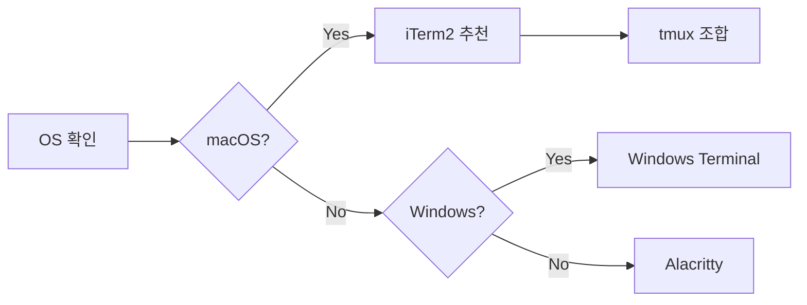
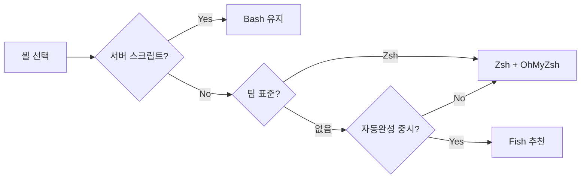
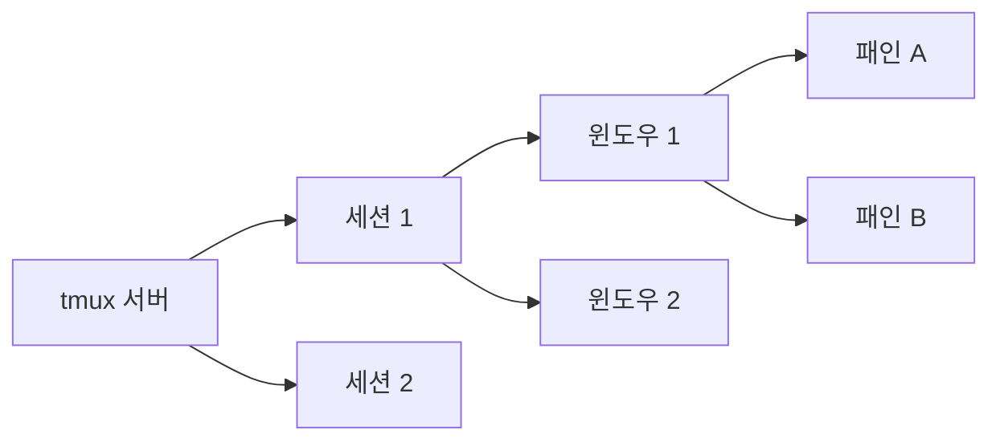
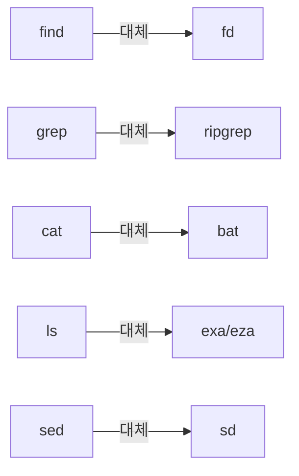
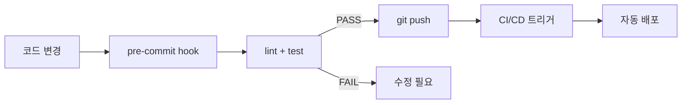
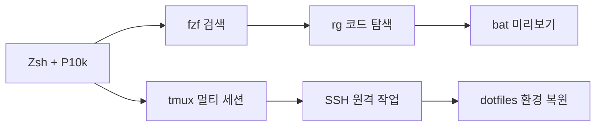

## 한 줄 요약

터미널은 개발자의 **조종석(cockpit)**이며, 잘 세팅된 터미널 환경 하나가 마우스 클릭 수백 번을 대체합니다.

이 글에서는 터미널 에뮬레이터 선택부터 셸 설정, tmux 멀티플렉서, 필수 CLI 유틸리티, 점파일 관리, SSH 최적화, 셸 스크립트 자동화까지 — 실무에서 바로 쓸 수 있는 **개발 환경 구축의 모든 것**을 다룹니다.

> **비유**: 터미널은 자동차의 **계기판 + 핸들 + 기어**입니다. 아무리 좋은 엔진(코드)이 있어도 핸들이 뻑뻑하면 목적지에 늦게 도착합니다. 터미널 최적화는 핸들에 파워스티어링을 다는 것과 같습니다.

---

## 1. 터미널 에뮬레이터 비교

터미널 에뮬레이터는 셸과 사용자 사이의 **창문** 역할을 합니다. 어떤 창문을 고르느냐에 따라 작업 효율이 크게 달라집니다.

### 1-1. 주요 터미널 에뮬레이터 한눈에 보기

| 항목 | iTerm2 | Windows Terminal | Alacritty | Warp |
|------|--------|-----------------|-----------|------|
| **플랫폼** | macOS 전용 | Windows 전용 | 크로스플랫폼 | macOS (Win 베타) |
| **GPU 가속** | 부분 지원 | 완전 지원 | 완전 지원 | 완전 지원 |
| **분할 화면** | 네이티브 지원 | 네이티브 지원 | 미지원 (tmux 필요) | 네이티브 지원 |
| **설정 방식** | GUI | JSON | TOML | GUI + AI |
| **속도** | 보통 | 빠름 | 매우 빠름 | 빠름 |
| **커스터마이징** | 높음 | 높음 | 높음 | 중간 |
| **가격** | 무료 | 무료 | 무료 | 프리미엄 |

> **비유**: 터미널 에뮬레이터는 **자동차 브랜드**와 같습니다. iTerm2는 BMW(macOS 특화 고급), Alacritty는 경주용 카트(가볍고 빠름), Windows Terminal은 현대차(실용적이고 대중적), Warp는 테슬라(AI 내장, 새로운 경험)입니다.

### 1-2. 터미널 에뮬레이터 선택 흐름



### 1-3. iTerm2 핵심 설정

macOS 사용자라면 iTerm2는 사실상 표준입니다. 핵심 설정 몇 가지만 잡아도 체감 속도가 올라갑니다.

```bash
# iTerm2 셸 통합 설치
curl -L https://iterm2.com/shell_integration/zsh \
  -o ~/.iterm2_shell_integration.zsh
source ~/.iterm2_shell_integration.zsh
```

**추천 설정 포인트:**

- **Hotkey Window**: `Option + Space`로 어디서든 터미널 토글
- **Natural Text Editing**: `Preferences → Profiles → Keys → Presets → Natural Text Editing` 적용
- **Unlimited Scrollback**: `Preferences → Profiles → Terminal → Unlimited scrollback` 활성화
- **Trigger 기능**: 특정 문자열(ERROR, WARN 등) 출현 시 자동 하이라이트

### 1-4. Windows Terminal 핵심 설정

Windows 개발자라면 Windows Terminal + WSL2 조합이 가장 강력합니다.

```json
{
  "profiles": {
    "defaults": {
      "font": {
        "face": "MesloLGS NF",
        "size": 12
      },
      "opacity": 90,
      "useAcrylic": true,
      "colorScheme": "One Half Dark"
    }
  },
  "actions": [
    { "command": "togglePaneZoom", "keys": "alt+z" },
    { "command": { "action": "splitPane", "split": "horizontal" }, "keys": "alt+shift+-" },
    { "command": { "action": "splitPane", "split": "vertical" }, "keys": "alt+shift+|" }
  ]
}
```

### 1-5. Alacritty — 속도가 생명일 때

Alacritty는 Rust로 작성된 GPU 가속 터미널입니다. 설정 파일 하나로 모든 것을 제어합니다.

```toml
# ~/.config/alacritty/alacritty.toml
[font]
size = 13.0

[font.normal]
family = "MesloLGS NF"

[window]
opacity = 0.95
padding = { x = 8, y = 8 }

[colors.primary]
background = "#1e1e2e"
foreground = "#cdd6f4"
```

**극한 시나리오 — 서버 20대 동시 관리 상황:**

서버 20대에 동시에 SSH 접속해서 로그를 실시간으로 모니터링해야 한다고 가정합시다. 이때 iTerm2나 Windows Terminal의 내장 분할 화면만으로는 한계가 있습니다. Alacritty + tmux 조합이 가장 가볍고 안정적입니다. GPU 가속 덕분에 20개 pane에서 동시에 로그가 쏟아져도 프레임 드롭이 거의 없습니다.

### 1-6. Warp — AI 시대의 터미널

Warp는 커맨드 입력부가 **에디터처럼** 동작하며, AI 기반 명령어 추천을 제공합니다.

- **Block 단위 출력**: 각 명령어 결과가 블록으로 구분
- **AI 명령어 검색**: 자연어로 "디스크 사용량 큰 파일 찾기" → `du -sh * | sort -rh | head -20` 변환
- **Workflow 공유**: 팀원과 자주 쓰는 명령어 세트를 공유

---

## 2. Shell 비교 — Bash vs Zsh vs Fish

셸은 터미널 안에서 실제로 명령을 해석하고 실행하는 **엔진**입니다.

### 2-1. 3대 셸 비교표

| 기능 | Bash | Zsh | Fish |
|------|------|-----|------|
| **기본 탑재** | 거의 모든 리눅스 | macOS 기본 | 별도 설치 |
| **자동 완성** | 기본 | 강력 (플러그인) | 기본 내장 (최강) |
| **문법 하이라이트** | 없음 | 플러그인 | 기본 내장 |
| **POSIX 호환** | 완전 | 거의 완전 | 비호환 |
| **플러그인 생태계** | 적음 | 거대 (Oh My Zsh) | 중간 |
| **스크립트 호환성** | 표준 | Bash 호환 | 독자 문법 |
| **학습 곡선** | 낮음 | 낮음 | 중간 |

> **비유**: Bash는 **국어사전**(어디에나 있고 표준), Zsh는 **전자사전**(기능이 풍부하고 확장 가능), Fish는 **AI 번역기**(스마트하지만 독자적인 체계)입니다.

### 2-2. 셸 선택 의사결정 흐름



### 2-3. Zsh가 실무 표준인 이유

2019년부터 macOS의 기본 셸이 Zsh로 변경되었고, 리눅스에서도 Zsh 채택률이 꾸준히 올라가고 있습니다.

**Zsh만의 강점:**

1. **글로빙 확장**: `**/*.py`처럼 재귀 탐색이 기본
2. **스펠링 교정**: 오타를 자동으로 감지하고 제안
3. **경로 확장**: `cd /u/l/b` → `cd /usr/local/bin`으로 자동 확장
4. **공유 히스토리**: 여러 터미널 세션 간 명령어 히스토리 공유

```bash
# Zsh 설치 (Ubuntu/Debian)
sudo apt update && sudo apt install -y zsh

# 기본 셸 변경
chsh -s $(which zsh)

# 버전 확인
zsh --version
```

### 2-4. Fish — 설정 없이 바로 쓰는 스마트 셸

Fish는 "out of the box" 철학을 따릅니다. 설치 즉시 자동 완성, 문법 하이라이트, 히스토리 기반 추천이 동작합니다.

```fish
# Fish 설치
sudo apt install -y fish

# Fish 특유의 문법 — 변수 설정
set -x MY_VAR "hello"

# 함수 정의 (Bash와 다름)
function greet
    echo "Hello, $argv[1]!"
end
```

**주의**: Fish는 POSIX 비호환이므로 `#!/bin/bash`로 작성된 스크립트를 Fish에서 직접 실행하면 문법 오류가 발생합니다. 서버 운영 스크립트는 반드시 Bash로 유지하세요.

---

## 3. Oh My Zsh + Powerlevel10k

Oh My Zsh는 Zsh 설정 관리 프레임워크이고, Powerlevel10k는 가장 인기 있는 Zsh 테마입니다.

### 3-1. Oh My Zsh 설치 및 구조

```bash
# Oh My Zsh 설치
sh -c "$(curl -fsSL https://raw.githubusercontent.com/ohmyzsh/ohmyzsh/master/tools/install.sh)"
```

설치 후 `~/.zshrc` 파일이 자동 생성되며, 이 파일 하나로 셸의 모든 동작을 제어합니다.

> **비유**: Oh My Zsh는 **스마트폰의 앱스토어**입니다. 기본 기능(셸)만으로도 쓸 수 있지만, 플러그인(앱)을 설치하면 생산성이 폭발적으로 늘어납니다.

### 3-2. 필수 플러그인 TOP 7

```bash
# ~/.zshrc에서 plugins 배열 수정
plugins=(
  git                    # git 별칭 (gst, gco, gp 등)
  zsh-autosuggestions    # 히스토리 기반 자동 추천
  zsh-syntax-highlighting # 실시간 문법 하이라이트
  z                      # 자주 가는 디렉토리로 점프
  docker                 # docker 자동 완성
  kubectl                # k8s 자동 완성
  fzf                    # fuzzy finder 통합
)
```

**각 플러그인 상세 설명:**

| 플러그인 | 효과 | 체감 속도 향상 |
|---------|------|--------------|
| `git` | `git status` → `gst`, `git checkout` → `gco` | 타이핑 40% 감소 |
| `zsh-autosuggestions` | 과거 명령어 기반 회색 텍스트 추천 | → 키 한 번으로 완성 |
| `zsh-syntax-highlighting` | 유효한 명령은 초록, 잘못된 명령은 빨강 | 오타 사전 방지 |
| `z` | `z project` → 가장 자주 방문한 project 디렉토리로 이동 | cd 체인 제거 |

### 3-3. 외부 플러그인 설치

`zsh-autosuggestions`와 `zsh-syntax-highlighting`은 별도 설치가 필요합니다.

```bash
# zsh-autosuggestions 설치
git clone https://github.com/zsh-users/zsh-autosuggestions \
  ${ZSH_CUSTOM:-~/.oh-my-zsh/custom}/plugins/zsh-autosuggestions

# zsh-syntax-highlighting 설치
git clone https://github.com/zsh-users/zsh-syntax-highlighting \
  ${ZSH_CUSTOM:-~/.oh-my-zsh/custom}/plugins/zsh-syntax-highlighting
```

### 3-4. Powerlevel10k 테마 설정

Powerlevel10k는 **속도**와 **정보 밀도**가 최고인 Zsh 프롬프트 테마입니다.

```bash
# Powerlevel10k 설치
git clone --depth=1 https://github.com/romkatv/powerlevel10k.git \
  ${ZSH_CUSTOM:-$HOME/.oh-my-zsh/custom}/themes/powerlevel10k

# ~/.zshrc에서 테마 변경
ZSH_THEME="powerlevel10k/powerlevel10k"
```

설치 후 터미널을 재시작하면 설정 마법사가 실행됩니다. 마법사에서 선택할 추천 옵션:

1. **프롬프트 스타일**: Rainbow (정보가 가장 풍부)
2. **시간 표시**: 24시간 형식
3. **Git 상태**: Verbose (변경 파일 수 표시)
4. **줄바꿈**: Two lines (명령어 입력 공간 확보)

### 3-5. 프롬프트에 표시되는 정보

Powerlevel10k는 현재 컨텍스트에 따라 프롬프트 세그먼트가 동적으로 변합니다.

```
┌ ~/projects/myapp main ✚3 ⬆1  node:18.17  docker:running  10:35:42
└ ❯
```

위 프롬프트에서 한눈에 파악 가능한 정보:
- **현재 디렉토리**: `~/projects/myapp`
- **Git 브랜치**: `main`, 수정 3개, 푸시 대기 1개
- **Node 버전**: 18.17
- **Docker 상태**: running
- **현재 시간**: 10:35:42

---

## 4. tmux 핵심 사용법

tmux(Terminal Multiplexer)는 하나의 터미널 안에서 **여러 세션, 창, 패인**을 관리하는 도구입니다. SSH 연결이 끊겨도 작업이 유지되는 것이 가장 큰 장점입니다.

> **비유**: tmux는 **가상 데스크톱 관리자**입니다. 물리적 모니터(터미널 창)는 하나지만, 그 안에서 여러 개의 가상 작업 공간을 자유롭게 오가며 사용할 수 있습니다.

### 4-1. tmux 핵심 개념 구조



- **세션(Session)**: 프로젝트 단위의 최상위 컨테이너
- **윈도우(Window)**: 세션 안의 탭 (브라우저 탭과 유사)
- **패인(Pane)**: 윈도우 안의 분할 화면

### 4-2. 설치 및 기본 명령어

```bash
# 설치
sudo apt install -y tmux   # Ubuntu/Debian
brew install tmux           # macOS

# 새 세션 생성
tmux new -s myproject

# 세션 분리 (detach)
# Ctrl+b → d

# 세션 목록 확인
tmux ls

# 세션 재접속
tmux attach -t myproject

# 세션 종료
tmux kill-session -t myproject
```

### 4-3. 필수 단축키 정리

tmux의 기본 프리픽스 키는 `Ctrl+b`입니다. 모든 명령은 프리픽스를 먼저 누른 후 실행합니다.

| 동작 | 단축키 | 설명 |
|------|--------|------|
| 수평 분할 | `Ctrl+b "` | 위아래로 패인 분할 |
| 수직 분할 | `Ctrl+b %` | 좌우로 패인 분할 |
| 패인 이동 | `Ctrl+b 화살표` | 방향키로 패인 전환 |
| 패인 줌 | `Ctrl+b z` | 현재 패인 전체화면 토글 |
| 윈도우 생성 | `Ctrl+b c` | 새 윈도우 추가 |
| 윈도우 이동 | `Ctrl+b 번호` | 해당 번호 윈도우로 전환 |
| 세션 분리 | `Ctrl+b d` | 세션에서 나오기 (작업 유지) |
| 스크롤 모드 | `Ctrl+b [` | 스크롤 (q로 종료) |
| 패인 닫기 | `Ctrl+b x` | 현재 패인 종료 |

### 4-4. tmux 설정 최적화 — .tmux.conf

기본 설정을 그대로 쓰면 불편한 점이 많습니다. 아래 설정을 `~/.tmux.conf`에 추가하세요.

```bash
# 프리픽스를 Ctrl+a로 변경 (더 편한 위치)
unbind C-b
set -g prefix C-a
bind C-a send-prefix

# 마우스 지원 활성화
set -g mouse on

# 패인 분할을 직관적 키로 변경
bind | split-window -h -c "#{pane_current_path}"
bind - split-window -v -c "#{pane_current_path}"

# 패인 이동을 vim 스타일로
bind h select-pane -L
bind j select-pane -D
bind k select-pane -U
bind l select-pane -R

# 패인 크기 조절 (Shift+방향키)
bind -r H resize-pane -L 5
bind -r J resize-pane -D 5
bind -r K resize-pane -U 5
bind -r L resize-pane -R 5

# 윈도우 번호를 1부터 시작
set -g base-index 1
setw -g pane-base-index 1

# 상태바 커스터마이징
set -g status-style bg=colour235,fg=colour136
set -g status-left "#[fg=green]#S "
set -g status-right "#[fg=yellow]%Y-%m-%d %H:%M"

# 256색 지원
set -g default-terminal "screen-256color"

# 히스토리 크기 증가
set -g history-limit 50000

# ESC 지연 제거 (vim 사용자 필수)
set -sg escape-time 0

# 설정 즉시 적용 단축키
bind r source-file ~/.tmux.conf \; display "Config Reloaded!"
```

### 4-5. 극한 시나리오 — 서버 20대 동시 관리

운영팀에서 서버 20대에 동시에 명령을 보내야 하는 상황을 생각해 봅시다.

```bash
#!/bin/bash
# 서버 20대에 동시 접속하는 tmux 스크립트
SESSION="multi-server"

tmux new-session -d -s $SESSION

# 서버 목록
SERVERS=(
  "web-01" "web-02" "web-03" "web-04" "web-05"
  "api-01" "api-02" "api-03" "api-04" "api-05"
  "db-01"  "db-02"  "db-03"  "worker-01" "worker-02"
  "cache-01" "cache-02" "queue-01" "queue-02" "monitor-01"
)

# 첫 번째 서버는 이미 생성된 패인에서 접속
tmux send-keys -t $SESSION "ssh ${SERVERS[0]}" C-m

# 나머지 서버는 새 윈도우 또는 패인으로 분할
for i in $(seq 1 $((${#SERVERS[@]} - 1))); do
  if (( i % 4 == 0 )); then
    tmux new-window -t $SESSION
    tmux send-keys "ssh ${SERVERS[$i]}" C-m
  else
    tmux split-window -t $SESSION
    tmux send-keys "ssh ${SERVERS[$i]}" C-m
    tmux select-layout tiled
  fi
done

tmux attach -t $SESSION
```

**동기화 모드로 20대에 동시 명령 전송:**

```bash
# 모든 패인에 동일한 키 입력 전송
# Ctrl+a → :setw synchronize-panes on

# 이제 입력하는 모든 명령이 20개 패인에 동시 전달
tail -f /var/log/syslog    # 20대 서버 로그 실시간 확인
```

### 4-6. tmux Plugin Manager (TPM)

```bash
# TPM 설치
git clone https://github.com/tmux-plugins/tpm ~/.tmux/plugins/tpm

# ~/.tmux.conf에 추가
set -g @plugin 'tmux-plugins/tpm'
set -g @plugin 'tmux-plugins/tmux-sensible'
set -g @plugin 'tmux-plugins/tmux-resurrect'    # 세션 저장/복원
set -g @plugin 'tmux-plugins/tmux-continuum'     # 자동 저장

# 자동 저장 간격 (분)
set -g @continuum-save-interval '15'

# TPM 초기화 (반드시 .tmux.conf 맨 아래에 위치)
run '~/.tmux/plugins/tpm/tpm'
```

`tmux-resurrect`는 시스템이 재부팅되어도 tmux 세션 레이아웃과 실행 중이던 명령을 복원할 수 있게 해 줍니다. `tmux-continuum`은 이를 자동으로 15분마다 저장합니다.

---

## 5. 필수 CLI 도구

현대 개발에서 전통적인 Unix 도구만 쓰는 것은 **수동 변속기 자동차**를 모는 것과 같습니다. Rust/Go로 작성된 차세대 CLI 도구들은 속도와 사용성 모두 압도적입니다.

### 5-1. 도구 대체 관계도



### 5-2. fzf — 퍼지 파인더의 왕

fzf는 **모든 텍스트 목록에 대한 실시간 퍼지 검색**을 제공합니다. 파일, 명령어 히스토리, Git 브랜치, 프로세스 등 뭐든 검색 가능합니다.

> **비유**: fzf는 **구글 검색의 터미널 버전**입니다. 정확한 키워드를 몰라도 대충 입력하면 원하는 결과가 나옵니다.

```bash
# 설치
sudo apt install -y fzf     # Ubuntu
brew install fzf             # macOS

# Zsh 키 바인딩 활성화
# Ctrl+R: 히스토리 퍼지 검색
# Ctrl+T: 파일 퍼지 검색
# Alt+C:  디렉토리 퍼지 이동

# fzf 기본 옵션 설정 (~/.zshrc)
export FZF_DEFAULT_OPTS="
  --height 40%
  --layout=reverse
  --border
  --preview 'bat --color=always --line-range :100 {}'
"

# fd를 fzf 기본 검색기로 설정 (훨씬 빠름)
export FZF_DEFAULT_COMMAND='fd --type f --hidden --exclude .git'
export FZF_CTRL_T_COMMAND="$FZF_DEFAULT_COMMAND"
```

**fzf 실전 활용 패턴:**


```bash
# Git 브랜치를 퍼지 검색으로 전환
git checkout $(git branch | fzf)

# 프로세스를 퍼지 검색으로 찾아서 종료
kill -9 $(ps aux | fzf | awk '{print $2}')

# 파일을 찾아서 vim으로 열기
vim $(fzf)

# Docker 컨테이너 로그 보기
docker logs $(docker ps --format '{{.Names}}' | fzf) -f
```


### 5-3. ripgrep (rg) — grep의 진화

ripgrep은 `.gitignore`를 자동으로 존중하고, 바이너리 파일을 건너뛰며, grep보다 **2~5배 빠릅니다**.

```bash
# 설치
sudo apt install -y ripgrep
brew install ripgrep

# 기본 사용
rg "TODO" --type py                  # Python 파일에서만 검색
rg "function" -g "*.js" -g "!*.min.js"  # JS에서 검색 (min.js 제외)
rg -i "error" --count                # 대소문자 무시, 파일별 매칭 수
rg "pattern" -A 3 -B 3              # 전후 3줄 컨텍스트
rg "import.*from" --stats           # 통계 정보 포함
```

**극한 시나리오 — 로그 실시간 분석:**

수 GB 규모의 로그 파일에서 특정 에러 패턴을 찾아야 할 때 grep은 수 분이 걸리지만, ripgrep은 수 초 안에 완료합니다.

```bash
# 10GB 로그 파일에서 특정 에러 패턴 검색
rg "OutOfMemoryError|StackOverflow" /var/log/app/ \
  --glob "*.log" \
  -c \
  --sort path

# 실시간 로그 모니터링 + 패턴 매칭
tail -f /var/log/app/production.log | rg --line-buffered "5\d{2}\s"
```

### 5-4. bat — cat의 상위 호환

bat은 **문법 하이라이트, 줄 번호, Git 변경 표시**가 기본 내장된 cat 대체 도구입니다.

```bash
# 설치
sudo apt install -y bat
brew install bat

# 기본 사용
bat README.md                 # 문법 하이라이트 + 줄 번호
bat -p README.md              # 플레인 모드 (번호 없음)
bat --diff file.py            # Git diff 하이라이트
bat -l python script.sh       # 강제 언어 지정

# cat을 bat으로 대체 (~/.zshrc)
alias cat='bat --paging=never'
```

### 5-5. exa/eza — ls의 진화

exa(현재는 eza로 포크)는 **컬러, 아이콘, Git 상태, 트리 뷰**를 제공하는 ls 대체 도구입니다.

```bash
# 설치
sudo apt install -y eza
brew install eza

# 추천 별칭 (~/.zshrc)
alias ls='eza --icons'
alias ll='eza -la --icons --git'
alias lt='eza --tree --level=2 --icons'

# Git 상태 포함 출력
eza -la --git --icons
# 결과 예시:
# .rw-r--r--  M 1.2k kim 16 May 10:30 server.py
# M = Modified (Git에서 수정됨)
```

### 5-6. jq — JSON 처리의 스위스 칼

REST API 응답이나 설정 파일을 다룰 때 jq는 필수입니다.

```bash
# 설치
sudo apt install -y jq

# API 응답에서 필요한 필드만 추출
curl -s https://api.github.com/users/octocat | jq '{
  name: .name,
  repos: .public_repos,
  followers: .followers
}'

# 배열 필터링
echo '[{"name":"a","age":20},{"name":"b","age":30}]' | \
  jq '.[] | select(.age > 25)'

# 로그 파일 (JSON Lines) 분석
cat app.log | jq -r 'select(.level == "ERROR") | .message'
```

### 5-7. sd — sed의 직관적 대체

sd는 정규표현식을 사용한 문자열 치환 도구입니다. sed보다 문법이 직관적입니다.

```bash
# 설치
cargo install sd
brew install sd

# sed vs sd 비교
# sed: sed -i 's/before/after/g' file.txt
# sd:  sd 'before' 'after' file.txt

# 실전 예시
sd 'localhost:3000' 'api.example.com' config/*.json
sd 'TODO' 'DONE' $(rg -l 'TODO' --type py)   # rg와 조합
```

### 5-8. fd — find의 현대판

```bash
# 설치
sudo apt install -y fd-find
brew install fd

# 사용 예시
fd "\.py$"                    # Python 파일 찾기
fd -e log -S +100M            # 100MB 이상 로그 파일
fd -e tmp --exec rm {}        # tmp 파일 모두 삭제
fd --changed-within 1h        # 1시간 이내 변경된 파일
```

### 5-9. 도구 일괄 설치 스크립트

```bash
#!/bin/bash
# 차세대 CLI 도구 일괄 설치 (Ubuntu/Debian)
sudo apt update
sudo apt install -y \
  zsh \
  tmux \
  fzf \
  ripgrep \
  bat \
  fd-find \
  jq \
  eza

# Rust 기반 도구 (sd)
cargo install sd

echo "모든 CLI 도구 설치 완료!"
```

---

## 6. 점파일 관리 (Dotfiles)

점파일(dotfiles)은 `.zshrc`, `.tmux.conf`, `.gitconfig` 등 설정 파일을 통칭합니다. 새 컴퓨터나 서버를 세팅할 때 점파일이 잘 관리되어 있으면 **5분 안에 익숙한 환경을 복원**할 수 있습니다.

> **비유**: 점파일은 **게임의 세이브 파일**입니다. 새 기기를 사도 세이브 파일만 옮기면 이전에 깬 스테이지부터 이어서 플레이할 수 있습니다.

### 6-1. 점파일 관리 전략

점파일 관리에는 크게 3가지 전략이 있습니다.

| 전략 | 도구 | 난이도 | 유연성 |
|------|------|--------|--------|
| 심볼릭 링크 | GNU stow | 낮음 | 높음 |
| Git bare repo | git 직접 | 중간 | 최고 |
| 전용 도구 | chezmoi | 낮음 | 높음 |

### 6-2. GNU Stow를 이용한 관리

GNU Stow는 **심볼릭 링크를 자동으로 생성**해 주는 도구입니다.

```bash
# 디렉토리 구조
~/dotfiles/
├── zsh/
│   └── .zshrc
├── tmux/
│   └── .tmux.conf
├── git/
│   └── .gitconfig
└── vim/
    └── .vimrc

# Stow로 심볼릭 링크 생성
cd ~/dotfiles
stow zsh      # ~/.zshrc → ~/dotfiles/zsh/.zshrc
stow tmux     # ~/.tmux.conf → ~/dotfiles/tmux/.tmux.conf
stow git
stow vim

# 링크 제거
stow -D zsh
```

### 6-3. Git Bare Repository 방식

Git bare repo 방식은 별도 도구 없이 Git만으로 점파일을 관리합니다.

```bash
# 초기 설정
git init --bare $HOME/.dotfiles
alias dotfiles='git --git-dir=$HOME/.dotfiles/ --work-tree=$HOME'
dotfiles config --local status.showUntrackedFiles no

# 파일 추가 및 커밋
dotfiles add ~/.zshrc
dotfiles add ~/.tmux.conf
dotfiles commit -m "Add shell and tmux config"
dotfiles push origin main

# 새 머신에서 복원
git clone --bare <repo-url> $HOME/.dotfiles
alias dotfiles='git --git-dir=$HOME/.dotfiles/ --work-tree=$HOME'
dotfiles checkout
```

### 6-4. chezmoi — 점파일 관리의 끝판왕

chezmoi는 **템플릿, 암호화, 머신별 분기**를 지원하는 전용 점파일 관리 도구입니다.

```bash
# 설치
sh -c "$(curl -fsLS get.chezmoi.io)"

# 초기화
chezmoi init

# 파일 추가
chezmoi add ~/.zshrc
chezmoi add ~/.tmux.conf

# 변경 사항 적용
chezmoi apply

# 다른 머신에서 복원
chezmoi init --apply <github-username>
```

**chezmoi 템플릿 활용 — 머신별 분기:**


```bash
# ~/.local/share/chezmoi/dot_zshrc.tmpl
export EDITOR="vim"

{{ if eq .chezmoi.os "darwin" -}}
# macOS 전용 설정
export PATH="/opt/homebrew/bin:$PATH"
alias tailscale="/Applications/Tailscale.app/Contents/MacOS/Tailscale"
{{ else if eq .chezmoi.os "linux" -}}
# Linux 전용 설정
export PATH="$HOME/.local/bin:$PATH"
{{ end -}}
```


---

## 7. SSH 설정 최적화

SSH는 원격 서버 작업의 근간입니다. 잘 설정하면 매번 IP와 사용자명을 입력하는 수고를 없앨 수 있습니다.

> **비유**: SSH 설정은 **전화기의 단축번호**입니다. 11자리 전화번호를 매번 누르는 대신, `1번`만 누르면 바로 연결되는 것과 같습니다.

### 7-1. SSH 키 생성 및 등록

```bash
# Ed25519 키 생성 (현재 권장 알고리즘)
ssh-keygen -t ed25519 -C "your@email.com"

# ssh-agent에 키 등록
eval "$(ssh-agent -s)"
ssh-add ~/.ssh/id_ed25519

# 원격 서버에 공개키 복사
ssh-copy-id user@server-ip
```

### 7-2. SSH Config 파일 작성

`~/.ssh/config` 파일로 서버별 접속 정보를 관리합니다.

```bash
# ~/.ssh/config

# 전역 설정
Host *
    ServerAliveInterval 60
    ServerAliveCountMax 3
    AddKeysToAgent yes
    IdentitiesOnly yes

# 개발 서버
Host dev
    HostName 10.0.1.100
    User deploy
    Port 2222
    IdentityFile ~/.ssh/id_ed25519

# 운영 서버 (배스천 호스트 경유)
Host prod
    HostName 172.16.0.50
    User admin
    ProxyJump bastion

# 배스천 호스트
Host bastion
    HostName bastion.example.com
    User jump
    IdentityFile ~/.ssh/id_bastion

# 다중 서버 패턴
Host web-*
    User deploy
    IdentityFile ~/.ssh/id_web
```

이제 `ssh dev`만 입력하면 모든 옵션이 자동 적용됩니다.

### 7-3. SSH 멀티플렉싱 — 연결 재사용

SSH 접속을 매번 새로 하면 TCP 핸드셰이크 + 키 교환이 반복됩니다. 멀티플렉싱을 설정하면 기존 연결을 재사용합니다.

```bash
# ~/.ssh/config에 추가
Host *
    ControlMaster auto
    ControlPath ~/.ssh/sockets/%r@%h-%p
    ControlPersist 600
```

```bash
# 소켓 디렉토리 생성
mkdir -p ~/.ssh/sockets

# 효과: 두 번째 SSH 접속부터 즉시 연결 (0.5초 → 0.05초)
```

### 7-4. 극한 시나리오 — 원격 개발 환경 구축

로컬 머신의 성능이 부족하거나 특수한 환경이 필요할 때, 원격 서버를 개발 환경으로 사용하는 전략입니다.

```bash
# 1. SSH 터널로 원격 서버의 포트를 로컬에 매핑
ssh -L 8080:localhost:8080 -L 3000:localhost:3000 dev

# 2. VS Code Remote SSH 설정 (~/.ssh/config)
Host dev-vscode
    HostName 10.0.1.100
    User deploy
    ForwardAgent yes
    LocalForward 8080 localhost:8080

# 3. rsync로 파일 동기화 (양방향)
rsync -avz --exclude '.git' ./project/ dev:~/project/

# 4. SSH + tmux 조합으로 끊김 없는 개발
ssh dev -t "tmux attach -t work || tmux new -s work"
```

---

## 8. 셸 스크립트 자동화

반복 작업을 자동화하는 셸 스크립트는 개발자의 **가장 강력한 무기** 중 하나입니다.

### 8-1. 스크립트 작성 기본 규칙

```bash
#!/bin/bash
set -euo pipefail  # 에러 발생 시 즉시 중단, 미정의 변수 에러, 파이프 에러 전파

# 색상 정의
RED='\033[0;31m'
GREEN='\033[0;32m'
YELLOW='\033[1;33m'
NC='\033[0m' # No Color

# 로그 함수
log_info()  { echo -e "${GREEN}[INFO]${NC} $1"; }
log_warn()  { echo -e "${YELLOW}[WARN]${NC} $1"; }
log_error() { echo -e "${RED}[ERROR]${NC} $1" >&2; }
```

**`set -euo pipefail` 해설:**

| 옵션 | 의미 | 없으면 일어나는 일 |
|------|------|-------------------|
| `-e` | 에러 시 중단 | 에러를 무시하고 다음 줄 실행 |
| `-u` | 미정의 변수 에러 | 빈 문자열로 치환되어 예기치 않은 동작 |
| `-o pipefail` | 파이프 에러 전파 | 파이프 마지막 명령만 체크 |

### 8-2. 실전 자동화 스크립트 — 프로젝트 초기화

```bash
#!/bin/bash
set -euo pipefail

PROJECT_NAME=${1:?"Usage: $0 <project-name>"}

log_info() { echo -e "\033[0;32m[INFO]\033[0m $1"; }

# 프로젝트 디렉토리 생성
mkdir -p "$PROJECT_NAME"/{src,tests,docs,scripts}
cd "$PROJECT_NAME"

# Git 초기화
git init
cat > .gitignore << 'EOF'
node_modules/
__pycache__/
*.pyc
.env
.venv/
dist/
build/
EOF

# README 생성
cat > README.md << EOF
# $PROJECT_NAME

## Setup
\`\`\`bash
./scripts/setup.sh
\`\`\`
EOF

# 설정 스크립트 생성
cat > scripts/setup.sh << 'SETUP'
#!/bin/bash
set -euo pipefail
echo "Setting up development environment..."
python3 -m venv .venv
source .venv/bin/activate
pip install -r requirements.txt
echo "Setup complete!"
SETUP
chmod +x scripts/setup.sh

git add -A
git commit -m "Initial project setup"

log_info "프로젝트 '$PROJECT_NAME' 초기화 완료!"
```

### 8-3. 자동화 스크립트 — 배포 전 체크리스트

```bash
#!/bin/bash
set -euo pipefail

RED='\033[0;31m'
GREEN='\033[0;32m'
NC='\033[0m'

PASS=0
FAIL=0

check() {
  local description=$1
  shift
  if "$@" > /dev/null 2>&1; then
    echo -e "${GREEN}[PASS]${NC} $description"
    ((PASS++))
  else
    echo -e "${RED}[FAIL]${NC} $description"
    ((FAIL++))
  fi
}

echo "=== 배포 전 체크리스트 ==="

check "테스트 통과" python -m pytest tests/
check "린트 통과" python -m flake8 src/
check "타입 체크 통과" python -m mypy src/
check "Git 워킹트리 클린" git diff --quiet
check "main 브랜치" test "$(git branch --show-current)" = "main"
check "원격과 동기화" git diff --quiet origin/main

echo ""
echo "결과: ${PASS} PASS / ${FAIL} FAIL"

if [ $FAIL -gt 0 ]; then
  echo -e "${RED}배포를 중단합니다.${NC}"
  exit 1
fi

echo -e "${GREEN}배포 준비 완료!${NC}"
```

### 8-4. 자동화 흐름도



### 8-5. 유용한 셸 함수 모음

```bash
# ~/.zshrc에 추가할 유용한 함수들

# 포트를 사용하는 프로세스 찾기
port() {
  lsof -i :"$1" | grep LISTEN
}

# 디렉토리 생성 + 이동
mkcd() {
  mkdir -p "$1" && cd "$1"
}

# Git 로그를 그래프로 보기
glog() {
  git log --oneline --graph --decorate --all | head -20
}

# 파일 백업 (타임스탬프 추가)
backup() {
  cp "$1" "$1.bak.$(date +%Y%m%d%H%M%S)"
}

# JSON 파일 예쁘게 보기
jsonview() {
  cat "$1" | jq '.' | bat -l json
}

# 지정한 디렉토리의 디스크 사용량 TOP 10
dusort() {
  du -sh "${1:-.}"/* 2>/dev/null | sort -rh | head -10
}

# 특정 확장자 파일 수 세기
count_files() {
  fd -e "$1" | wc -l
}
```

---

## 9. 실무 실수 TOP 5

현업에서 가장 자주 발생하는 터미널 관련 실수와 방지법을 정리합니다.

### 실수 1: rm -rf의 오작동

```bash
# 절대 하면 안 되는 것
rm -rf /$HOME    # $HOME이 비어있으면 rm -rf / 가 됨!

# 안전한 방법
rm -rf "${HOME:?Variable not set}/"

# 더 안전한 방법: trash-cli 사용
sudo apt install trash-cli
alias rm='trash-put'    # rm을 휴지통으로 대체
```

> **비유**: `rm -rf`는 **핵무기 발사 버튼**입니다. 한 번 누르면 되돌릴 수 없습니다. trash-cli는 이 버튼에 **안전 잠금장치**를 다는 것입니다.

### 실수 2: 환경 변수가 적용 안 되는 문제

```bash
# .zshrc를 수정했는데 적용이 안 되는 경우
# 원인: 새 터미널을 열지 않았거나 source를 안 함

# 해결
source ~/.zshrc    # 현재 세션에 즉시 적용

# 주의: export를 빼먹으면 자식 프로세스에 전달 안 됨
MY_VAR="hello"        # 현재 셸에서만 유효
export MY_VAR="hello" # 자식 프로세스에도 전달
```

### 실수 3: 권한 문제로 스크립트 실행 불가

```bash
# 'Permission denied' 에러
bash: ./deploy.sh: Permission denied

# 해결
chmod +x deploy.sh

# 또는 bash를 명시적으로 호출
bash deploy.sh

# 주의: chmod 777은 보안상 위험
# 올바른 권한: 실행 파일은 755, 일반 파일은 644
chmod 755 deploy.sh
```

### 실수 4: 파이프라인에서 에러 무시

```bash
# 문제: 첫 번째 명령이 실패해도 두 번째가 실행됨
cat nonexistent.log | grep "error" | wc -l
# 결과: 0 (에러가 아닌 것처럼 보임)

# 해결: pipefail 사용
set -o pipefail
cat nonexistent.log | grep "error" | wc -l
# 결과: 에러 발생 → 스크립트 중단
```

### 실수 5: SSH 세션에서 장시간 작업 시 끊김

```bash
# 문제: SSH 연결이 끊기면 실행 중이던 작업도 종료됨

# 해결 1: tmux 사용 (최선)
ssh server
tmux new -s long-task
./heavy-process.sh
# Ctrl+b → d 로 분리 → 연결 끊겨도 계속 실행

# 해결 2: nohup 사용
nohup ./heavy-process.sh > output.log 2>&1 &

# 해결 3: screen 사용
screen -S mytask
./heavy-process.sh
# Ctrl+a → d 로 분리
```

### 실수 방지 체크리스트

| 순번 | 체크 항목 | 방지 방법 |
|------|----------|----------|
| 1 | `rm` 전에 경로 확인 | trash-cli 별칭 설정 |
| 2 | `.zshrc` 수정 후 source | auto-source 플러그인 |
| 3 | 스크립트 실행 전 권한 확인 | `ls -la` 습관화 |
| 4 | 파이프라인 에러 처리 | `set -euo pipefail` 필수 |
| 5 | 원격 장시간 작업 | tmux 필수 사용 |

---

## 10. 종합 워크플로우

지금까지 다룬 도구들을 조합한 실전 워크플로우입니다.

### 10-1. 아침 업무 시작 루틴 스크립트

```bash
#!/bin/bash
# morning.sh — 매일 아침 실행하는 개발 환경 초기화

SESSION="work"

# 이미 세션이 있으면 접속, 없으면 생성
tmux has-session -t $SESSION 2>/dev/null
if [ $? != 0 ]; then
  # 윈도우 1: 에디터
  tmux new-session -d -s $SESSION -n "editor"
  tmux send-keys -t $SESSION:editor "cd ~/project && vim" C-m

  # 윈도우 2: 서버
  tmux new-window -t $SESSION -n "server"
  tmux send-keys -t $SESSION:server "cd ~/project && npm run dev" C-m

  # 윈도우 3: Git + 터미널
  tmux new-window -t $SESSION -n "git"
  tmux send-keys -t $SESSION:git "cd ~/project && gst" C-m

  # 윈도우 4: 로그 모니터링
  tmux new-window -t $SESSION -n "logs"
  tmux send-keys -t $SESSION:logs "tail -f ~/project/logs/app.log | bat -l log --paging=never" C-m
fi

tmux attach -t $SESSION
```

### 10-2. 디버깅 세션 스크립트

```bash
#!/bin/bash
# debug.sh — 문제 발생 시 빠른 디버깅 환경 구성
set -euo pipefail

KEYWORD=${1:?"Usage: $0 <error-keyword>"}

echo "=== 에러 키워드: $KEYWORD ==="

echo ""
echo "--- 최근 로그에서 검색 ---"
rg "$KEYWORD" /var/log/app/ --glob "*.log" -c 2>/dev/null || echo "매칭 없음"

echo ""
echo "--- 소스 코드에서 검색 ---"
rg "$KEYWORD" ~/project/src/ --type py -l 2>/dev/null || echo "매칭 없음"

echo ""
echo "--- 관련 프로세스 ---"
ps aux | grep -i "$KEYWORD" | grep -v grep || echo "관련 프로세스 없음"

echo ""
echo "--- 최근 Git 커밋 (관련 키워드) ---"
cd ~/project
git log --oneline --all --grep="$KEYWORD" | head -5 || echo "관련 커밋 없음"
```

### 10-3. 전체 도구 연계 흐름

지금까지 다룬 모든 도구가 어떻게 유기적으로 연결되는지 한눈에 정리합니다.



### 10-4. 도구별 설치 우선순위

새 머신을 세팅할 때 추천하는 설치 순서입니다.

| 순서 | 도구 | 이유 |
|------|------|------|
| 1 | Zsh + Oh My Zsh | 셸 환경의 기반 |
| 2 | Powerlevel10k | 프롬프트 정보 밀도 확보 |
| 3 | tmux | 세션 관리와 분할 화면 |
| 4 | fzf | 모든 검색의 기반 |
| 5 | ripgrep + fd | 파일/텍스트 검색 가속 |
| 6 | bat + eza | 일상 명령어 품질 향상 |
| 7 | jq + sd | 데이터 처리 효율화 |
| 8 | chezmoi | 점파일 백업과 동기화 |

### 10-5. 일괄 설치 + 설정 원라이너

```bash
# macOS (Homebrew 기준)
brew install zsh tmux fzf ripgrep bat eza fd jq sd chezmoi

# Ubuntu/Debian
sudo apt install -y zsh tmux fzf ripgrep bat fd-find eza jq && \
  cargo install sd && \
  sh -c "$(curl -fsLS get.chezmoi.io)"
```

---

## 11. 면접 포인트 5개

터미널과 생산성 도구에 관한 면접 질문은 **실무 역량**을 직접적으로 보여줍니다.

<details>
<summary><strong>Q1. tmux에서 세션이 유지되는 원리를 설명해 주세요.</strong></summary>

tmux는 **클라이언트-서버 아키텍처**를 사용합니다.

- `tmux` 명령을 실행하면 백그라운드에 **tmux 서버 프로세스**가 생성됩니다.
- 사용자가 보는 터미널은 **tmux 클라이언트**입니다.
- `detach`하면 클라이언트만 종료되고, 서버와 그 안의 셸 프로세스는 계속 실행됩니다.
- `attach`하면 새 클라이언트가 기존 서버에 연결됩니다.
- 이 구조 덕분에 SSH 연결이 끊겨도 서버 프로세스가 살아있어 작업이 유지됩니다.

**핵심**: tmux 서버는 커널의 프로세스 트리에서 독립적으로 동작하며, `init` (PID 1) 또는 `systemd`의 자식 프로세스로 재부모화(reparenting)됩니다.

</details>

<details>
<summary><strong>Q2. Bash와 Zsh의 기술적 차이점을 3가지 이상 말해 주세요.</strong></summary>

1. **글로빙(Globbing)**: Zsh는 `**/*.py` 같은 재귀 글로빙을 네이티브 지원합니다. Bash는 `shopt -s globstar`를 활성화해야 합니다.

2. **배열**: Zsh 배열은 1부터 시작하고, Bash 배열은 0부터 시작합니다. Zsh는 연관 배열도 더 자연스럽게 지원합니다.

3. **프롬프트 확장**: Zsh는 `%~`(축약 경로), `%F{color}`(색상) 등 독자적인 프롬프트 이스케이프를 제공하며, 오른쪽 프롬프트(`RPROMPT`)를 기본 지원합니다.

4. **자동 교정**: Zsh는 `setopt CORRECT`로 명령어 오타를 자동으로 감지하고 제안합니다.

5. **플러그인 로딩**: Zsh는 `autoload` 메커니즘으로 함수를 지연 로딩할 수 있어 시작 시간을 최적화합니다.

</details>

<details>
<summary><strong>Q3. SSH 터널링의 종류와 사용 사례를 설명해 주세요.</strong></summary>

SSH 터널링은 3가지 유형이 있습니다.

**1. 로컬 포워딩 (`-L`)**: 로컬 포트를 원격 서버의 포트에 연결합니다.
```bash
ssh -L 3306:localhost:3306 db-server
# 로컬의 3306으로 접속하면 원격 DB에 연결됨
```
사용 사례: 방화벽 뒤의 데이터베이스에 접근

**2. 리모트 포워딩 (`-R`)**: 원격 서버의 포트를 로컬 포트에 연결합니다.
```bash
ssh -R 8080:localhost:3000 remote-server
# 원격 서버의 8080으로 접속하면 로컬의 3000에 연결됨
```
사용 사례: 로컬 개발 서버를 외부에 노출 (ngrok 대안)

**3. 동적 포워딩 (`-D`)**: SOCKS 프록시를 생성합니다.
```bash
ssh -D 1080 proxy-server
# 브라우저 프록시를 localhost:1080으로 설정하면 모든 트래픽이 서버 경유
```
사용 사례: 지역 제한 콘텐츠 접근, 네트워크 분석

</details>

<details>
<summary><strong>Q4. 셸 스크립트에서 <code>set -euo pipefail</code>의 역할과 한계를 설명해 주세요.</strong></summary>

**역할:**
- `-e`: 명령어가 0이 아닌 종료 코드를 반환하면 스크립트를 즉시 중단합니다.
- `-u`: 정의되지 않은 변수를 참조하면 에러를 발생시킵니다.
- `-o pipefail`: 파이프라인에서 **마지막 명령어가 아닌**, 실패한 명령어의 종료 코드를 파이프라인의 종료 코드로 사용합니다.

**한계:**
1. `-e`는 `if`, `while`, `||`, `&&` 안에서는 동작하지 않습니다. `if command_that_fails; then` 구문에서는 `-e`가 무시됩니다.
2. 서브셸(`$(...)`) 안의 에러는 외부 스크립트를 종료시키지 않을 수 있습니다.
3. `grep`이 매칭 결과가 없을 때 종료 코드 1을 반환하므로, `-e` 환경에서 의도치 않게 스크립트가 중단될 수 있습니다.

**대응**: `grep "pattern" file || true` 패턴으로 의도적 실패를 허용합니다.

</details>

<details>
<summary><strong>Q5. 서버 20대를 동시에 관리할 때의 전략을 설명해 주세요.</strong></summary>

**단계별 접근:**

1. **소규모 (5대 이하)**: tmux의 `synchronize-panes` 기능으로 동시 명령 전송
2. **중규모 (5~20대)**: SSH config + tmux 자동화 스크립트로 배치 관리
3. **대규모 (20대 이상)**: 전용 도구 사용 권장
   - **Ansible**: 에이전트리스(agentless) 구성 관리, YAML 기반 플레이북
   - **pssh (parallel-ssh)**: 병렬 SSH 명령 실행
   - **csshX/tmux-cssh**: 시각적 동시 SSH

**핵심 원칙:**
- 수동 SSH 접속은 5대가 한계입니다. 그 이상은 반드시 자동화 도구를 사용하세요.
- 모든 서버 변경은 **멱등성(idempotent)**을 보장하는 스크립트로 실행해야 합니다.
- 롤링 업데이트 전략으로 한 번에 모든 서버를 변경하지 않아야 합니다.

```bash
# parallel-ssh 예시
pssh -h servers.txt -l deploy -i "systemctl status nginx"

# Ansible 예시
ansible all -m shell -a "df -h" -i inventory.ini
```

</details>

---

## 마무리

터미널 환경 최적화는 **한 번 투자하면 매일 복리로 돌아오는** 생산성 향상 전략입니다.

정리하면:

1. **터미널 에뮬레이터**: 플랫폼에 맞는 최적의 도구를 선택하세요.
2. **Zsh + Oh My Zsh + Powerlevel10k**: 셸 환경의 기본 세팅입니다.
3. **tmux**: SSH 끊김 방지와 멀티태스킹의 핵심입니다.
4. **차세대 CLI 도구**: fzf, ripgrep, bat, eza로 일상 명령어를 업그레이드하세요.
5. **점파일 관리**: chezmoi나 stow로 환경을 백업하고 동기화하세요.
6. **SSH 최적화**: config 파일과 멀티플렉싱으로 원격 작업을 가속하세요.
7. **셸 스크립트**: 반복 작업은 반드시 자동화하세요.

가장 중요한 것은 **매일 조금씩** 자신의 터미널 환경을 개선하는 습관입니다. 오늘 10분을 투자해서 별칭 하나를 추가하면, 내일부터 매일 1분씩 절약됩니다. 1년이면 365분, 약 6시간을 벌 수 있습니다.
