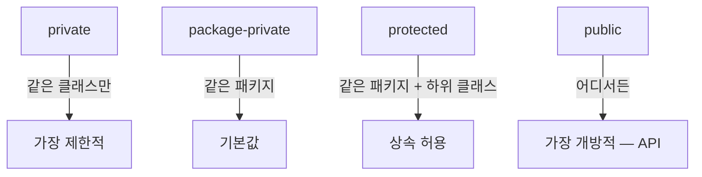
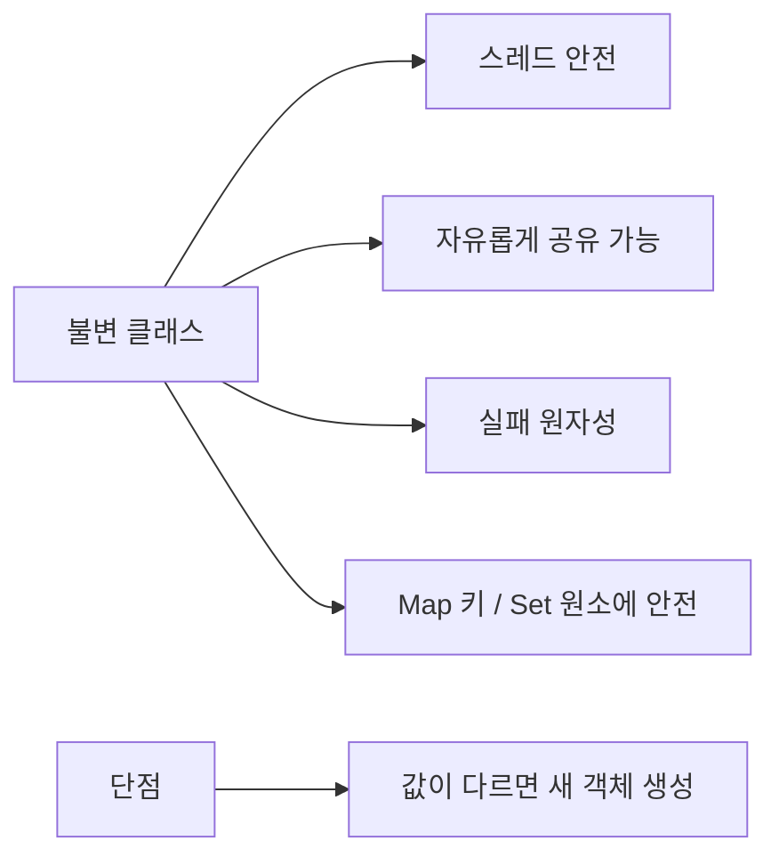
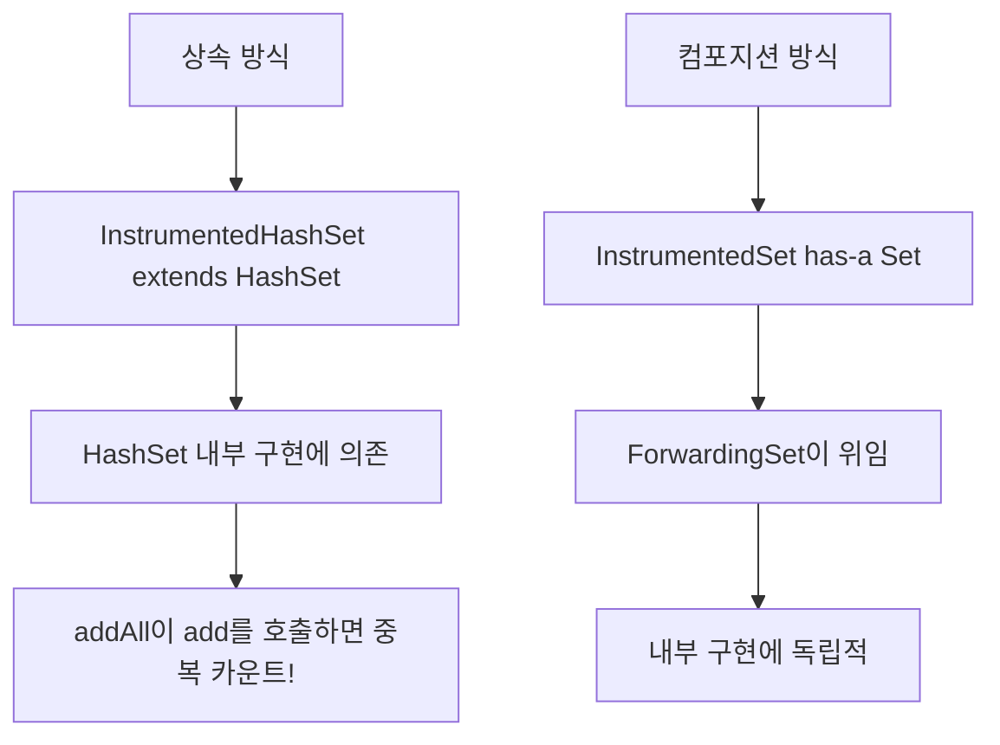
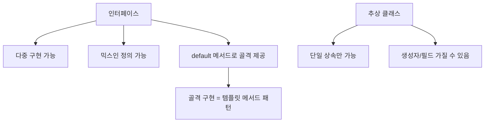
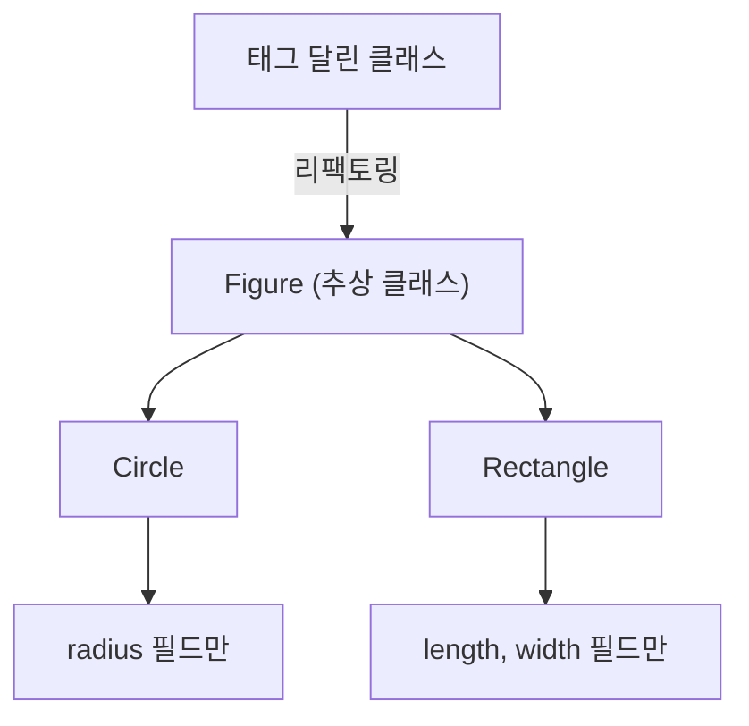
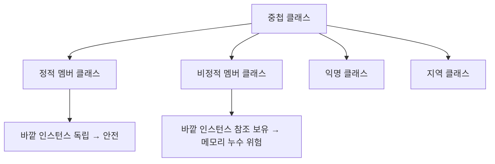

## 한 줄 요약

**클래스와 인터페이스를 쓸모 있고, 견고하고, 유연하게 설계하는 것이 자바 프로그래밍의 핵심이다.**

> **비유:** 집을 설계할 때, **벽(접근 제한)**이 공간을 나누고, **설계도(인터페이스)**가 구조를 정의하며, **내진 설계(불변성)**가 안전을 보장합니다. 벽 없이 탁 트인 집은 프라이버시가 없고, 설계도 없이 짓는 집은 증축이 불가능합니다.

---

## 아이템 15: 클래스와 멤버의 접근 권한을 최소화하라

### 개념 설명

잘 설계된 컴포넌트는 **내부 구현을 완벽히 숨기고**, 구현과 API를 깔끔히 분리합니다. 이것이 바로 **정보 은닉(information hiding)** 또는 **캡슐화(encapsulation)**입니다.

> **비유:** 자동차를 운전할 때 엔진 내부 구조를 알 필요가 없습니다. 핸들, 페달, 기어만 알면 됩니다. 엔진(내부 구현)이 바뀌어도 운전 방법(API)은 같습니다. 접근 제한자는 **엔진 후드 잠금장치**입니다.

접근 수준은 네 가지가 있으며, **가능한 한 가장 낮은 수준**을 사용해야 합니다.



핵심 원칙은 다음과 같습니다.

1. **톱레벨 클래스/인터페이스:** `public` 또는 `package-private`만 가능. 한 클래스에서만 사용하면 `private static` 중첩 클래스로.
2. **멤버(필드, 메서드):** `private` → `package-private` → `protected` → `public` 순서로 최소한의 접근 수준 부여.
3. **public 클래스의 인스턴스 필드는 public이면 안 된다.** 불변식을 보장할 수 없기 때문입니다.
4. **public static final 배열은 보안 허점이다.** 클라이언트가 배열 내용을 수정할 수 있습니다.

배열 필드를 `public static final`로 선언하면, 배열 자체는 불변이지만 **내부 원소는 변경 가능**합니다. 아래 두 가지 해결 방법을 사용해야 합니다.

```java
// 문제: 배열 내용을 외부에서 변경 가능!
public static final Thing[] VALUES = { ... };

// 해결 1: 불변 리스트 반환
private static final Thing[] PRIVATE_VALUES = { ... };
public static final List<Thing> VALUES =
    Collections.unmodifiableList(Arrays.asList(PRIVATE_VALUES));

// 해결 2: 방어적 복사
private static final Thing[] PRIVATE_VALUES = { ... };
public static final Thing[] values() {
    return PRIVATE_VALUES.clone();
}
```

**이 코드의 핵심:** `public static final` 배열은 절대 두지 말고, **불변 리스트로 감싸거나 방어적 복사**를 반환합니다.

---

## 아이템 16: public 클래스에서는 public 필드가 아닌 접근자 메서드를 사용하라

`public` 클래스가 필드를 직접 노출하면, 나중에 내부 표현을 바꿀 수 없고, 불변식을 보장할 수 없으며, 부수 작업(로깅, 검증)을 수행할 수 없습니다.

> **비유:** 은행 금고가 열린 채로 있으면 누구나 돈을 꺼낼 수 있습니다. **창구 직원(getter/setter)**을 통해야 입출금 기록도 남고, 한도 초과도 방지합니다.

필드를 직접 노출하면 세 가지 심각한 문제가 발생합니다. 첫째, **내부 표현을 바꿀 수 없습니다.** 예를 들어 `x`, `y` 좌표를 극좌표(`r`, `theta`)로 바꾸고 싶어도, 이미 `point.x`로 직접 접근하는 외부 코드가 있으면 변경이 불가능합니다. 접근자 메서드가 있었다면 내부 표현을 바꾸되 `getX()`가 `r * cos(theta)`를 반환하도록 수정하면 됩니다.

둘째, **불변식을 강제할 수 없습니다.** `public double x`에는 음수든, `NaN`이든 어떤 값이든 대입할 수 있습니다. 접근자를 통하면 `setX(double x) { if (x < 0) throw ...; }` 같은 검증 로직을 삽입할 수 있습니다. 셋째, **필드 접근 시 부수 작업(로깅, 감사, 캐시 갱신)을 수행할 수 없습니다.** 실무에서는 특정 필드의 변경 이력을 추적해야 하는 경우가 많은데, `public` 필드로는 이를 구현할 방법이 없습니다.

```java
// 나쁜 예: 데이터 필드 직접 노출
class Point {
    public double x;
    public double y;
}

// 좋은 예: 접근자/변경자 메서드 제공
class Point {
    private double x;
    private double y;

    public double getX() { return x; }
    public double getY() { return y; }
    public void setX(double x) { this.x = x; }
    public void setY(double y) { this.y = y; }
}
```

**이 코드의 핵심:** `package-private` 클래스나 `private` 중첩 클래스라면 필드 노출이 허용됩니다. 하지만 `public` 클래스에서는 반드시 접근자를 사용합니다.

---

## 아이템 17: 변경 가능성을 최소화하라

### 개념 설명

**불변 클래스(immutable class)**는 인스턴스의 내부 값을 수정할 수 없는 클래스입니다. `String`, `BigInteger`, `BigDecimal`이 대표적입니다. 불변 클래스는 설계, 구현, 사용이 쉽고, 오류가 적습니다.

> **비유:** 돌에 새긴 글자는 지울 수 없습니다. 내용을 바꾸려면 **새 돌**에 새로 새겨야 합니다. 불변 객체가 바로 이 **돌에 새긴 글자**입니다 — 한번 만들면 영원히 변하지 않으므로, 여러 사람이 동시에 읽어도 안전합니다.

불변 클래스를 만드는 다섯 가지 규칙은 다음과 같습니다.

1️⃣ 객체의 상태를 변경하는 메서드(setter)를 제공하지 않는다.
2️⃣ 클래스를 확장할 수 없게 한다 (`final` 클래스 또는 `private` 생성자).
3️⃣ 모든 필드를 `final`로 선언한다.
4️⃣ 모든 필드를 `private`으로 선언한다.
5️⃣ 자신 외에는 가변 컴포넌트에 접근할 수 없게 한다 (방어적 복사).



불변 복소수 클래스의 예시를 보겠습니다. 사칙연산이 인스턴스 자체를 수정하지 않고 **새 인스턴스를 반환**하는 함수형 프로그래밍 방식입니다. 메서드 이름도 `add`가 아니라 전치사 `plus`를 사용하여 객체를 변경하지 않음을 암시합니다.

```java
public final class Complex {
    private final double re;
    private final double im;

    public Complex(double re, double im) {
        this.re = re;
        this.im = im;
    }

    // 함수형 접근: 자신을 수정하지 않고 새 인스턴스 반환
    public Complex plus(Complex c) {
        return new Complex(re + c.re, im + c.im);
    }

    public Complex minus(Complex c) {
        return new Complex(re - c.re, im - c.im);
    }
}
```

**이 코드의 핵심:** `final` 클래스 + `private final` 필드 + 피연산자를 수정하지 않는 메서드 = 완벽한 불변 클래스. 멀티스레드 환경에서도 동기화 없이 안전하게 공유할 수 있습니다.

---

## 아이템 18: 상속보다는 컴포지션을 사용하라

### 개념 설명

상속은 코드를 재사용하는 강력한 수단이지만, **잘못 사용하면 소프트웨어를 깨지기 쉽게 만듭니다.** 상위 클래스의 구현이 바뀌면 하위 클래스가 오동작할 수 있습니다. 이를 **취약한 기반 클래스 문제(fragile base class problem)**라고 합니다.

> **비유:** 레고 블록(컴포지션)은 조각을 자유롭게 붙였다 뗐다 할 수 있습니다. 반면 **접착제로 붙인 블록(상속)**은 한 조각을 바꾸려면 전체를 부숴야 합니다.

컴포지션(composition)은 기존 클래스를 **필드로 참조**하고, 새 클래스의 메서드에서 기존 클래스의 메서드를 호출(forwarding)하는 방식입니다.



아래는 상속의 위험성을 보여주는 고전적인 사례입니다. `HashSet.addAll()`은 내부적으로 `add()`를 호출하는데, 이를 모르고 `addAll()`과 `add()` 모두에서 카운트를 증가시키면 **이중 계산**이 됩니다.

```java
// 상속의 함정 — addAll 내부에서 add를 호출하므로 카운트가 이중 증가
public class InstrumentedHashSet<E> extends HashSet<E> {
    private int addCount = 0;

    @Override
    public boolean add(E e) {
        addCount++;
        return super.add(e);
    }

    @Override
    public boolean addAll(Collection<? extends E> c) {
        addCount += c.size();
        return super.addAll(c); // 내부에서 add()를 호출 → 이중 카운트!
    }
}
```

**이 코드의 핵심:** 3개 원소를 `addAll`하면 `addCount`가 6이 됩니다 (`addAll`에서 +3, 내부 `add` 호출에서 +3).

컴포지션으로 해결하면 내부 구현에 독립적이 됩니다. 전달(forwarding) 클래스를 재사용할 수 있어, 여러 종류의 `Set` 구현체를 감쌀 수 있습니다.

```java
// 컴포지션 + 전달 — 안전하고 유연
public class ForwardingSet<E> implements Set<E> {
    private final Set<E> s;
    public ForwardingSet(Set<E> s) { this.s = s; }

    public boolean add(E e)           { return s.add(e); }
    public boolean addAll(Collection<? extends E> c) { return s.addAll(c); }
    // ... 나머지 Set 메서드도 전달
}

public class InstrumentedSet<E> extends ForwardingSet<E> {
    private int addCount = 0;

    public InstrumentedSet(Set<E> s) { super(s); }

    @Override
    public boolean add(E e) {
        addCount++;
        return super.add(e);
    }

    @Override
    public boolean addAll(Collection<? extends E> c) {
        addCount += c.size();
        return super.addAll(c); // ForwardingSet.addAll → s.addAll (add를 호출 안 함)
    }
}
```

**이 코드의 핵심:** `InstrumentedSet`은 어떤 `Set` 구현체든 감쌀 수 있는 **데코레이터(Decorator)**입니다. `HashSet`의 내부 구현 변경에 영향받지 않습니다.

---

## 아이템 19: 상속을 고려해 설계하고 문서화하라. 그러지 않았다면 상속을 금지하라

상속용 클래스는 **재정의 가능 메서드를 내부적으로 어떻게 이용하는지** 문서로 남겨야 합니다. `@implSpec` 태그를 사용합니다.

> **비유:** 건물을 증축 가능하게 설계하려면 **기둥 위치, 하중 한계** 등을 도면에 명시해야 합니다. 문서 없이 증축하면 건물이 무너집니다.

`@implSpec`의 동작 원리를 구체적으로 살펴보겠습니다. 자바독(Javadoc)에서 `@implSpec` 태그는 **"Implementation Requirements"** 섹션을 생성하며, 이 섹션에는 메서드가 내부적으로 다른 재정의 가능 메서드를 어떤 순서로, 어떤 조건에서 호출하는지를 기술합니다. 예를 들어 `AbstractCollection.remove(Object)`의 `@implSpec`에는 "이 구현은 `iterator()`를 호출하여 컬렉션을 순회하며, `Iterator.remove()`로 원소를 제거한다"라고 명시되어 있습니다. 이 문서가 없으면 하위 클래스 작성자는 `remove()`를 재정의할 때 `iterator()`가 호출된다는 사실을 모르고, `iterator()`를 함께 재정의했을 때 **교차 호출(cross-invocation)** 무한 루프가 발생할 수 있습니다.

내부 호출 순서 문서화가 중요한 구체적 메커니즘은 다음과 같습니다. 상위 클래스의 `public` 메서드 A가 내부적으로 `protected` 메서드 B를 호출하고, 하위 클래스가 B를 재정의하면, A의 동작이 하위 클래스의 B에 의해 바뀝니다. 이것이 **자기 사용(self-use)** 패턴이며, 이 패턴이 문서화되지 않으면 상위 클래스의 구현 변경이 하위 클래스를 예고 없이 파괴합니다. `@implSpec`은 이 자기 사용 관계를 **공식 계약**으로 만들어, 상위 클래스 작성자가 함부로 내부 호출 구조를 변경할 수 없게 합니다.

상속을 금지하는 두 가지 방법:
- 클래스를 `final`로 선언
- 생성자를 `private`으로 만들고 정적 팩터리 제공

---

## 아이템 20: 추상 클래스보다는 인터페이스를 우선하라

### 개념 설명

자바는 단일 상속만 지원하므로, 추상 클래스를 사용하면 **타입 계층에 제약**이 생깁니다. 인터페이스는 다중 구현이 가능하고, **믹스인(mixin)** 정의에 이상적입니다.

> **비유:** 추상 클래스는 **혈통(가문)**과 같습니다 — 하나만 선택할 수 있습니다. 인터페이스는 **자격증**과 같습니다 — 운전면허, 조리사 자격증, TOEIC 점수를 동시에 가질 수 있습니다.



**골격 구현(skeletal implementation)** 클래스는 인터페이스와 추상 클래스의 장점을 결합합니다. 관례적으로 `Abstract-`를 접두어로 붙입니다 (`AbstractList`, `AbstractSet` 등).

```java
// 골격 구현을 활용한 정적 팩터리
static List<Integer> intArrayAsList(int[] a) {
    Objects.requireNonNull(a);
    return new AbstractList<Integer>() {
        @Override
        public Integer get(int i) { return a[i]; }

        @Override
        public Integer set(int i, Integer val) {
            int oldVal = a[i];
            a[i] = val;
            return oldVal;
        }

        @Override
        public int size() { return a.length; }
    };
}
```

**이 코드의 핵심:** `AbstractList` 골격 구현 덕분에, `get()`, `set()`, `size()`만 구현하면 완전한 `List`가 됩니다. 나머지 메서드(`indexOf`, `iterator` 등)는 골격이 제공합니다.

---

## 아이템 21: 인터페이스는 구현하는 쪽을 생각해 설계하라

자바 8의 `default` 메서드는 기존 인터페이스에 메서드를 추가할 수 있게 했지만, **모든 구현체에서 올바르게 동작하는 것은 보장하지 않습니다.**

> **비유:** 아파트 관리사무소에서 **전 세대에 일괄 적용되는 새 규칙**을 만들었는데, 일부 세대에는 맞지 않을 수 있습니다. 하지만 개별 세대에 물어보지 않고 적용합니다.

대표적인 사례로 `Collection.removeIf()`가 있습니다. 이 `default` 메서드는 `SynchronizedCollection`에서 동기화를 깨뜨렸습니다. 구체적인 흐름은 다음과 같습니다.

`SynchronizedCollection`은 내부에 `mutex` 객체를 두고, `add()`, `remove()`, `iterator()` 등 모든 메서드에서 `synchronized(mutex) { ... }` 블록으로 감싸 스레드 안전성을 보장합니다. 그런데 자바 8에서 `Collection` 인터페이스에 `removeIf(Predicate)` `default` 메서드가 추가되었을 때, 이 메서드의 기본 구현은 `iterator()`를 호출하고 `Iterator.remove()`로 원소를 제거하는데, **`mutex`에 대한 동기화 없이** 수행됩니다. `SynchronizedCollection`이 `removeIf`를 재정의하지 않았기 때문에, `default` 구현이 그대로 실행되어 다른 스레드가 동시에 `add()`나 `remove()`를 호출하면 **ConcurrentModificationException**이 발생하거나 데이터가 손상됩니다.

이 문제는 자바 8 이후 `Collections.SynchronizedCollection`에서 `removeIf`를 `synchronized(mutex)` 블록으로 감싸 재정의함으로써 수정되었습니다. 하지만 이 사례는 **default 메서드가 기존 구현체의 불변식을 깨뜨릴 수 있다**는 근본적 위험을 보여줍니다.

---

## 아이템 22: 인터페이스는 타입을 정의하는 용도로만 사용하라

인터페이스는 자신을 구현한 클래스의 인스턴스를 참조할 수 있는 **타입** 역할을 합니다. **상수 인터페이스(constant interface)**는 이 목적에 위배됩니다.

> **비유:** 명함(인터페이스)에는 **직함과 연락처**(타입 정보)를 적어야지, 메모장처럼 **공식이나 숫자**(상수)를 적으면 안 됩니다.

상수 인터페이스가 안티패턴인 이유는 **내부 구현의 외부 누출** 때문입니다. 클래스가 상수 인터페이스를 `implements`하면, 그 클래스의 모든 하위 클래스에도 인터페이스의 상수가 노출됩니다. 이는 순전히 구현 세부사항인 상수가 **공개 API**로 영구 노출되는 것을 의미합니다. 나중에 상수를 사용하지 않게 되어도, 하위 호환성을 위해 인터페이스를 계속 구현해야 합니다.

상수를 공개하는 올바른 방법은 세 가지입니다. 특정 클래스/인터페이스와 강하게 연관된 상수라면 **해당 클래스에 직접 추가**(예: `Integer.MAX_VALUE`)합니다. 열거 타입으로 표현이 적합하면 **enum**을 사용합니다. 그 외에는 **유틸리티 클래스**에 `private` 생성자와 함께 `public static final` 필드로 선언합니다. `static import`를 활용하면 클래스 이름 없이 상수를 사용할 수 있어 코드도 깔끔해집니다.

```java
// 안티패턴: 상수 인터페이스
public interface PhysicalConstants {
    double AVOGADROS_NUMBER = 6.022_140_857e23;
    double BOLTZMANN_CONSTANT = 1.380_648_52e-23;
}

// 올바른 방법: 유틸리티 클래스
public final class PhysicalConstants {
    private PhysicalConstants() {} // 인스턴스화 방지
    public static final double AVOGADROS_NUMBER = 6.022_140_857e23;
    public static final double BOLTZMANN_CONSTANT = 1.380_648_52e-23;
}
```

**이 코드의 핵심:** 상수는 **유틸리티 클래스** 또는 관련 클래스/인터페이스에 직접 추가합니다. 상수 인터페이스를 구현하면 내부 구현이 외부 API로 노출됩니다.

---

## 아이템 23: 태그 달린 클래스보다는 클래스 계층구조를 활용하라

### 개념 설명

하나의 클래스에 `shape` 필드로 "원"인지 "사각형"인지 구분하는 **태그 달린 클래스**는 장황하고 오류를 내기 쉬우며 비효율적입니다.

> **비유:** 한 명이 의사/변호사/교사 역할을 태그로 구분하면서 모두 수행하면 혼란스럽습니다. **각 역할을 전문가에게 맡기는 것**(클래스 계층구조)이 훨씬 깔끔합니다.



태그 달린 클래스에서는 원에 불필요한 `length`, `width` 필드가 존재하고, 사각형에 불필요한 `radius` 필드가 존재합니다. `switch`문으로 분기하므로 새 도형을 추가할 때마다 모든 `switch`를 수정해야 합니다.

```java
// 태그 달린 클래스 → 클래스 계층으로 변환
abstract class Figure {
    abstract double area();
}

class Circle extends Figure {
    final double radius;
    Circle(double radius) { this.radius = radius; }

    @Override
    double area() { return Math.PI * radius * radius; }
}

class Rectangle extends Figure {
    final double length;
    final double width;
    Rectangle(double length, double width) {
        this.length = length;
        this.width = width;
    }

    @Override
    double area() { return length * width; }
}
```

**이 코드의 핵심:** 각 도형이 자신에게 필요한 필드만 가지고, `area()` 구현도 자기 클래스에 캡슐화됩니다. 새 도형 추가 시 기존 코드를 수정할 필요가 없습니다 (OCP).

---

## 아이템 24: 멤버 클래스는 되도록 static으로 만들라

중첩 클래스(nested class)에는 네 가지 종류가 있습니다. 각각 쓰임이 다릅니다.



**비정적 멤버 클래스**는 바깥 클래스의 인스턴스에 대한 **숨은 참조(hidden reference)**를 가집니다. 이 참조는 메모리를 차지하고, GC가 바깥 인스턴스를 수거하지 못하게 합니다.

> **비유:** 비정적 멤버 클래스는 **부모님 집 열쇠**를 가진 자녀와 같습니다. 자녀가 있는 한 부모님 집(바깥 인스턴스)은 팔 수 없습니다(GC 불가). 정적 멤버 클래스는 **독립한 자녀** — 부모님 집과 무관합니다.

**원칙:** 멤버 클래스가 바깥 인스턴스에 접근할 일이 없다면 무조건 `static`을 붙입니다.

---

## 아이템 25: 톱레벨 클래스는 한 파일에 하나만 담으라

소스 파일 하나에 톱레벨 클래스를 여러 개 넣으면, **컴파일 순서에 따라** 동작이 달라질 수 있습니다. 이것은 심각한 비결정적 동작입니다.

> **비유:** 한 장의 주민등록증에 두 사람 정보가 적혀 있으면 혼란이 생깁니다. **한 파일에 한 클래스**가 원칙입니다.

컴파일 순서 의존의 구체적 메커니즘을 살펴보겠습니다. `Utensil.java`와 `Dessert.java`에 각각 같은 이름의 톱레벨 클래스 `Utensil`과 `Dessert`가 정의되어 있다고 가정합니다. 만약 누군가 `Utensil.java`에도 `Dessert` 클래스를 정의하면, `javac Main.java Utensil.java`는 `Utensil.java`의 `Dessert`를 사용하고, `javac Main.java Dessert.java`는 `Dessert.java`의 `Dessert`를 사용합니다. 이는 자바 컴파일러가 소스 파일을 **명령줄에 지정된 순서대로** 처리하면서, 이미 컴파일된 클래스와 같은 이름의 클래스를 만나면 **먼저 처리된 것을 우선**하기 때문입니다. IDE에서는 보통 이런 중복 정의를 컴파일 에러로 잡아주지만, 빌드 스크립트에서 파일 순서가 달라지면 **빌드 환경에 따라 다른 바이너리**가 생성되는 재현하기 어려운 버그가 됩니다.

```java
// Utensil.java — 한 파일에 하나씩
class Utensil {
    static final String NAME = "pot";
}

// Dessert.java — 한 파일에 하나씩
class Dessert {
    static final String NAME = "pie";
}
```

---

<details class="extreme-scenario-details">
<summary class="extreme-scenario-summary">
<span class="extreme-scenario-icon">🔥</span>
<span class="extreme-scenario-label">극한 시나리오 — 클릭하여 펼치기</span>
<span class="extreme-scenario-toggle"></span>
</summary>
<div class="extreme-scenario-body">

<div class="extreme-scenario-content" markdown="1">

### 시나리오 1: 불변 클래스의 성능 함정

> **비유:** 편지 한 글자를 고치려면 **전체 원고를 새로 베껴 쓰는 필사 수도승**을 상상해 보세요. 불변 객체는 이 필사 수도승과 같습니다 — 수정할 때마다 전체를 복사합니다.

`BigInteger`에서 백만 자리 수의 한 비트를 바꾸면, **전체 백만 자리를 복사한 새 인스턴스**가 만들어집니다. 내부적으로 `BigInteger`는 `int[]` 배열에 값을 저장하므로, 비트 하나를 바꾸려면 전체 배열을 복사한 새 `BigInteger`를 생성해야 합니다. 다단계 연산에서는 중간 객체가 대량 생성되어, 매 단계마다 수 MB의 배열 복사가 발생합니다. 해결책은 **가변 동반 클래스(mutable companion class)**입니다 (`String` ↔ `StringBuilder`). `BigInteger`의 경우 내부적으로 가변 동반 클래스를 사용하여 다단계 연산을 최적화합니다.

### 시나리오 2: 상속에서 equals 대칭성 파괴

> **비유:** "당신은 저와 같은 팀인가요?"라는 질문에, A는 **유니폼 색상만** 보고 "예"라고 하고, B는 **유니폼 색상 + 등번호**를 보고 "아니오"라고 합니다. 서로 다른 기준으로 비교하면 대칭성이 깨집니다.

```java
class Point { int x, y; }
class ColorPoint extends Point { Color color; }
```

`Point.equals(ColorPoint)`는 색상을 무시하고 `true`를 반환하고, `ColorPoint.equals(Point)`는 색상까지 비교하여 `false`를 반환합니다. 대칭성이 깨집니다. 이 문제는 객체 지향 언어의 **근본적 한계**로, 구체 클래스를 상속하여 새 값 필드를 추가하면 `equals` 규약을 지킬 수 없습니다. 리스코프 치환 원칙을 깨뜨리지 않는 유일한 해결책은 상속 대신 **컴포지션**으로 `ColorPoint`가 `Point`를 필드로 가지게 하는 것입니다.

### 시나리오 3: 비정적 멤버 클래스의 메모리 누수

> **비유:** 렌터카를 반납했는데, 차 안에 **집 열쇠(바깥 인스턴스 참조)**를 두고 왔습니다. 열쇠가 차 안에 있는 한 집(바깥 인스턴스)을 팔 수 없고(GC 불가), 렌터카 회사도 열쇠가 있어 차를 다른 사람에게 빌려줄 수 없습니다.

`Map.Entry`를 비정적으로 만들면, 엔트리 하나당 바깥 `Map` 인스턴스에 대한 참조를 가집니다. 이 숨은 참조는 컴파일러가 비정적 멤버 클래스의 생성자에 `Outer.this`를 매개변수로 자동 삽입하여 만들어집니다. 엔트리를 외부에 저장하면(예: 다른 컬렉션에 넣거나 캐시에 보관하면), 해당 엔트리가 살아 있는 한 바깥 `Map` 전체가 GC되지 못해 **메모리 누수**가 발생합니다. `Map` 자체는 이미 필요 없어졌는데, 엔트리 하나가 잡고 있는 참조 때문에 수 GB의 데이터가 메모리에 잔류할 수 있습니다.

### 시나리오 4: default 메서드 충돌

> **비유:** 두 회사에서 동시에 **같은 직함의 명함**을 받으면, 어느 회사 소속인지 스스로 밝혀야 합니다. 컴파일러도 마찬가지로, 두 인터페이스의 동일 시그니처 `default` 메서드 중 어느 것을 사용할지 **구현 클래스가 명시**해야 합니다.

두 인터페이스가 같은 시그니처의 `default` 메서드를 제공하면 **컴파일 에러**가 발생합니다. 이는 자바의 **다이아몬드 문제** 방지 메커니즘입니다. 구현 클래스에서 해당 메서드를 재정의하고, `InterfaceA.super.method()` 형태로 원하는 인터페이스의 구현을 명시적으로 선택해야 합니다. 만약 인터페이스 하나가 `default`이고 다른 하나가 `abstract`라면, `abstract`가 우선하여 구현 클래스에서 반드시 구현해야 합니다. 이 규칙을 모르면 라이브러리 업그레이드 시 **기존에 컴파일되던 코드가 갑자기 에러**를 내는 상황을 만나게 됩니다.

---
</div>
</div>
</details>

## 실무에서 자주 하는 실수

| 실수 | 올바른 방법 |
|------|------------|
| 모든 필드를 `public`으로 선언 | 필드는 `private`, 필요시 getter 제공 |
| `public static final` 배열 노출 | 불변 리스트 또는 방어적 복사 |
| 상속으로 코드 재사용 시도 | **컴포지션 + 전달** 패턴 사용 |
| 중첩 클래스에 `static` 미사용 | 바깥 참조 불필요 시 반드시 `static` |
| 태그 필드로 타입 구분 | **클래스 계층구조**로 리팩토링 |
| 상수를 인터페이스에 정의 | 유틸리티 클래스에 정의 |
| setter가 있는 클래스를 Map 키로 사용 | **불변 클래스**만 Map 키로 |
| `default` 메서드 무분별 추가 | 기존 구현체 호환성 반드시 검증 |

---

## 면접 포인트

1. **Q: 상속보다 컴포지션을 사용해야 하는 이유는?**
   - A: 상속은 캡슐화를 깨뜨립니다. 상위 클래스의 내부 구현이 변경되면 하위 클래스가 오동작합니다 (`InstrumentedHashSet` 사례). 컴포지션은 기존 클래스를 필드로 참조하므로 내부 구현에 독립적입니다.

2. **Q: 불변 클래스의 장단점은?**
   - A: **장점** — 스레드 안전, 자유로운 공유, 실패 원자성. **단점** — 값이 다르면 반드시 새 객체 생성 (다단계 연산 시 성능 저하). 가변 동반 클래스(`StringBuilder`)로 보완합니다.

3. **Q: 인터페이스와 추상 클래스의 선택 기준은?**
   - A: **인터페이스** — 다중 구현, 믹스인, 타입 정의. **추상 클래스** — 상태(필드)나 `protected` 메서드가 필요할 때. 보통 인터페이스 + 골격 구현(AbstractXxx) 조합이 최선입니다.

4. **Q: `public static final Thing[] VALUES`는 왜 위험한가?**
   - A: 배열의 참조는 불변이지만, **내용은 변경 가능**합니다. 외부에서 `VALUES[0] = null`로 배열을 오염시킬 수 있습니다.

5. **Q: 비정적 멤버 클래스가 메모리 누수를 일으키는 원리는?**
   - A: 비정적 멤버 클래스는 바깥 인스턴스에 대한 **숨은 참조**를 자동으로 가집니다. 이 내부 객체가 바깥 객체보다 오래 살면, 바깥 객체가 GC되지 못합니다.

---

## 핵심 정리

| 아이템 | 핵심 |
|--------|------|
| 15 | 접근 권한은 **가능한 한 좁게** |
| 16 | `public` 클래스의 필드는 **접근자로** |
| 17 | 변경 가능성을 **최소화** (불변 클래스) |
| 18 | 상속보다 **컴포지션** |
| 19 | 상속 설계 아니면 **상속 금지** |
| 20 | 추상 클래스보다 **인터페이스** 우선 |
| 21 | `default` 메서드는 **기존 구현체 고려** |
| 22 | 인터페이스는 **타입 정의 용도**만 |
| 23 | 태그 클래스 대신 **클래스 계층** |
| 24 | 멤버 클래스는 **static** 우선 |
| 25 | 톱레벨 클래스는 **파일당 하나** |
