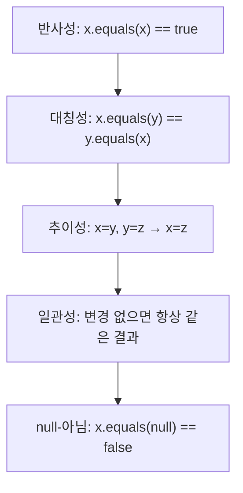
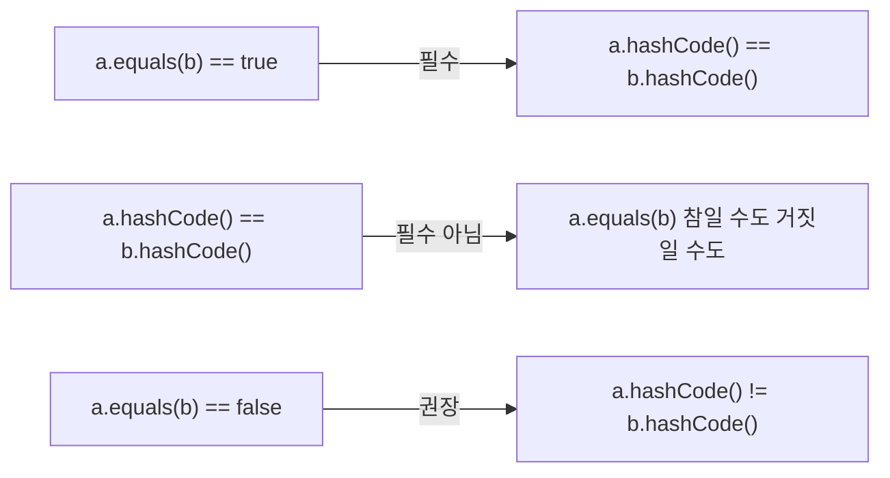
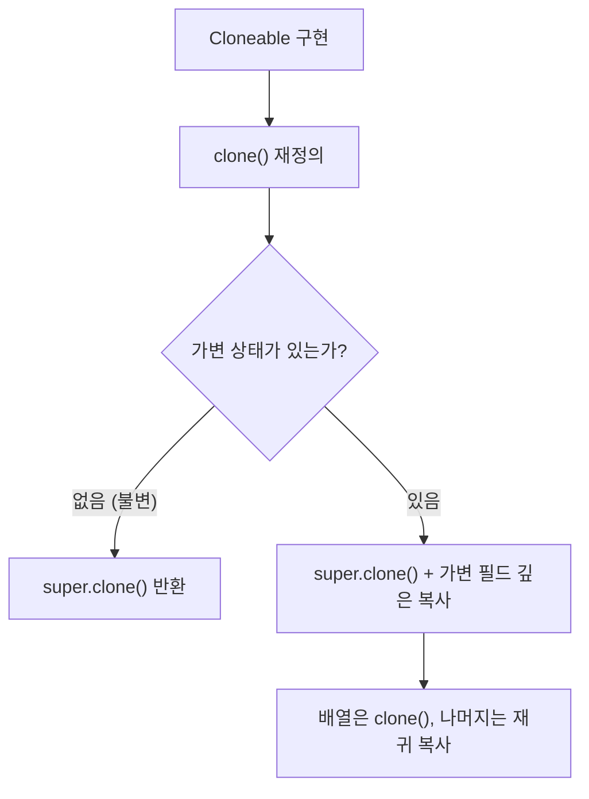
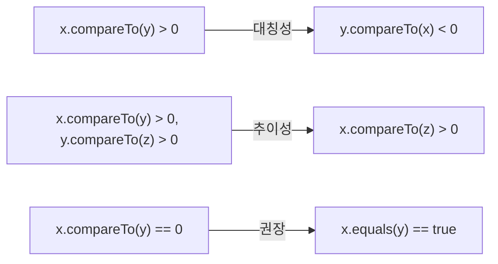

## 한 줄 요약

**`Object`의 `equals`, `hashCode`, `toString`, `clone`, `compareTo`를 올바르게 재정의하지 않으면 컬렉션이 오동작하고 디버깅이 지옥이 된다.**

> **비유:** 모든 시민은 주민등록번호(`hashCode`), 본인 확인 절차(`equals`), 신분증 표시(`toString`)를 가집니다. 이 세 가지가 엉망이면 은행에서 본인 인증이 실패하고, 경찰서에서 신원 조회가 불가능하며, 택배가 엉뚱한 곳으로 갑니다.

---

## 아이템 10: equals는 일반 규약을 지켜 재정의하라

### 개념 설명

`equals`를 재정의하지 않으면 각 인스턴스는 오직 자기 자신과만 같습니다. 논리적 동치성(logical equality)을 검사해야 하는 **값 클래스**(예: `Integer`, `String`, `Point`)에서만 재정의합니다.

> **비유:** 택배 두 개가 있을 때, **박스가 같은 박스인가**(물리적 동일성 `==`)와 **내용물이 같은가**(논리적 동치성 `equals`)는 다른 질문입니다. 값 클래스에서는 내용물이 같으면 같다고 판단해야 합니다.

### equals 재정의 규약

`equals` 메서드는 **동치 관계(equivalence relation)**를 구현해야 하며, 다섯 가지 속성을 만족해야 합니다.



각 속성을 자세히 살펴보겠습니다.

**1️⃣ 반사성(Reflexivity)** — 객체는 자기 자신과 같아야 합니다. `x.equals(x)`는 항상 `true`입니다. 이 속성을 위반하면 컬렉션에 넣은 객체를 `contains()`로 찾을 수 없습니다.

**2️⃣ 대칭성(Symmetry)** — `x.equals(y)`가 `true`이면 `y.equals(x)`도 `true`여야 합니다. 가장 흔한 위반 사례는 자기 클래스와 다른 타입을 비교할 때 발생합니다.

**3️⃣ 추이성(Transitivity)** — `x.equals(y)`이고 `y.equals(z)`이면 `x.equals(z)`도 `true`여야 합니다. **구체 클래스를 상속하여 값 필드를 추가하면 추이성을 깨뜨리지 않고 equals를 재정의할 수 없습니다.** 이것은 객체 지향 언어의 근본적 한계입니다.

**4️⃣ 일관성(Consistency)** — 객체가 변경되지 않았다면, `equals` 호출 결과는 항상 같아야 합니다. `java.net.URL`은 IP 주소로 비교하므로 네트워크 상태에 따라 결과가 달라질 수 있는데, 이는 설계 실수입니다.

**5️⃣ null-아님** — 모든 객체는 `null`과 같지 않아야 합니다. `x.equals(null)`은 항상 `false`를 반환해야 합니다.

### 대칭성 위반 예시

아래 코드는 `CaseInsensitiveString`이 `String`과의 비교를 시도하면서 대칭성을 깨뜨리는 전형적인 실수를 보여줍니다. `CaseInsensitiveString.equals(String)`은 `true`를 반환할 수 있지만, `String.equals(CaseInsensitiveString)`은 항상 `false`를 반환합니다.

```java
public final class CaseInsensitiveString {
    private final String s;

    // 잘못된 equals — 대칭성 위반!
    @Override
    public boolean equals(Object o) {
        if (o instanceof CaseInsensitiveString)
            return s.equalsIgnoreCase(((CaseInsensitiveString) o).s);
        if (o instanceof String) // 한 방향 비교 — 문제의 원인
            return s.equalsIgnoreCase((String) o);
        return false;
    }
}
```

**이 코드의 핵심:** `String`은 `CaseInsensitiveString`의 존재를 모르므로, `"hello".equals(cis)`는 `false`를 반환합니다. 해결책은 `String`과의 비교를 포기하는 것입니다.

### 올바른 equals 구현 레시피

아래는 `equals`를 올바르게 구현하는 단계별 레시피입니다. 모든 단계를 빠짐없이 거쳐야 규약을 만족합니다.

1️⃣ `==` 연산자로 자기 자신 참조인지 확인 (성능 최적화)
2️⃣ `instanceof`로 타입 확인
3️⃣ 올바른 타입으로 형변환
4️⃣ 핵심 필드를 하나씩 비교

```java
@Override
public boolean equals(Object o) {
    if (this == o) return true;                         // 1️⃣
    if (!(o instanceof PhoneNumber)) return false;      // 2️⃣
    PhoneNumber pn = (PhoneNumber) o;                   // 3️⃣
    return areaCode == pn.areaCode                      // 4️⃣
        && prefix == pn.prefix
        && lineNum == pn.lineNum;
}
```

**이 코드의 핵심:** `instanceof` 검사가 `null` 체크를 겸하므로 별도의 null 검사가 불필요합니다. 기본형은 `==`, 참조형은 `equals()`, `float`/`double`은 `Float.compare()`/`Double.compare()`를 사용합니다.

---

## 아이템 11: equals를 재정의하려면 hashCode도 재정의하라

### 개념 설명

`equals`를 재정의하고 `hashCode`를 재정의하지 않으면 **HashMap, HashSet이 정상 동작하지 않습니다.** 이것은 `Object` 명세의 규약입니다.

> **비유:** 도서관에서 책을 찾을 때, 먼저 **서가 번호**(hashCode)로 구역을 찾고, 그 안에서 **제목**(equals)으로 정확한 책을 찾습니다. 서가 번호가 잘못되면 아무리 제목이 맞아도 **영원히 책을 찾을 수 없습니다.**

### hashCode 계약



핵심 규칙을 정리하면 다음과 같습니다.

| 규칙 | 설명 |
|------|------|
| **필수** | `equals`가 `true`인 두 객체의 `hashCode`는 반드시 같아야 한다 |
| **필수** | 같은 객체에 여러 번 호출해도 값이 일관되어야 한다 |
| **권장** | `equals`가 `false`인 두 객체의 `hashCode`는 다른 것이 좋다 (성능) |

### hashCode 미재정의 시 HashMap 버그

아래 시나리오는 `hashCode`를 재정의하지 않았을 때 발생하는 전형적인 버그입니다. 논리적으로 같은 두 객체가 서로 다른 해시 버킷에 들어가므로, `get()`이 `null`을 반환합니다.

```java
Map<PhoneNumber, String> map = new HashMap<>();
map.put(new PhoneNumber(707, 867, 5309), "제니");

// hashCode 미재정의 → 다른 버킷에서 찾음 → null 반환!
String name = map.get(new PhoneNumber(707, 867, 5309));
// name == null (기대값: "제니")
```

### 좋은 hashCode 작성법

좋은 해시 함수는 서로 다른 인스턴스에 대해 다른 해시코드를 반환해야 합니다. 아래 코드는 핵심 필드를 조합하여 해시코드를 생성하는 전형적인 패턴입니다. `31`을 곱하는 이유는 홀수이면서 소수이고, JIT가 `31 * i`를 `(i << 5) - i`로 최적화할 수 있기 때문입니다.

```java
@Override
public int hashCode() {
    int result = Short.hashCode(areaCode);
    result = 31 * result + Short.hashCode(prefix);
    result = 31 * result + Short.hashCode(lineNum);
    return result;
}

// 또는 Objects.hash() 사용 (성능은 약간 느림)
@Override
public int hashCode() {
    return Objects.hash(areaCode, prefix, lineNum);
}
```

**이 코드의 핵심:** `31`을 곱하면서 필드를 하나씩 누적합니다. 불변 클래스라면 해시코드를 **지연 초기화(lazy initialization)**하여 캐싱할 수도 있습니다.

---

## 아이템 12: toString을 항상 재정의하라

### 개념 설명

`Object`의 기본 `toString()`은 `클래스이름@16진수해시코드`를 반환합니다. 이는 디버깅에 전혀 도움이 되지 않습니다.

> **비유:** 친구에게 "너 누구야?"라고 물었을 때 "사람@1a2b3c"라고 대답하면 황당합니다. **이름, 나이, 직업** 정도는 말해 줘야 합니다. `toString`은 객체의 **자기소개**입니다.

`toString`은 **그 객체가 가진 주요 정보를 모두 반환하는 것이 좋습니다.** 특히 로깅, 디버깅, 에러 메시지에서 자동으로 호출되므로, 유익한 정보를 담아야 합니다.

`toString`이 자동으로 호출되는 상황은 생각보다 많습니다. `System.out.println(object)`, 문자열 연결 연산(`"값: " + object`), `String.format("%s", object)`, `assert` 실패 메시지, 디버거의 객체 표시, 로깅 프레임워크의 `{}` 치환 등이 모두 내부적으로 `toString()`을 호출합니다. 만약 기본 구현인 `클래스이름@해시코드`가 반환된다면, 이 모든 장소에서 의미 없는 문자열을 보게 됩니다.

포맷을 명시할지 여부도 중요한 설계 결정입니다. 포맷을 명시하면 해당 문자열을 파싱하여 객체를 복원하는 정적 팩터리(`fromString`)를 제공할 수 있지만, 한번 공개한 포맷은 **사실상 영구 API**가 됩니다. 포맷을 명시하지 않으면 향후 정보를 추가하거나 순서를 바꿀 유연성이 생기지만, 파싱에 의존하는 외부 코드가 깨질 수 있습니다. 어느 쪽이든 의도를 문서에 분명히 밝혀야 합니다.

```java
// 나쁜 예
// PhoneNumber@163b91 — 아무 정보도 없음

// 좋은 예
@Override
public String toString() {
    return String.format("%03d-%03d-%04d", areaCode, prefix, lineNum);
}
// 출력: 707-867-5309
```

**이 코드의 핵심:** 포맷을 명시하면 파싱이 가능해지지만, 한번 명시하면 변경하기 어렵습니다. 포맷 명시 여부는 문서에 분명히 밝혀야 합니다.

---

## 아이템 13: clone 재정의는 주의해서 진행하라

### 개념 설명

`Cloneable`은 자바의 가장 이상한 인터페이스 중 하나입니다. 메서드가 하나도 없으면서, `Object.clone()`의 동작을 변경하는 **마커 인터페이스**입니다.

> **비유:** 복사기로 서류를 복사할 때, 서류 안에 **USB가 꽂혀 있으면** USB 안의 파일까지 복사해야 할까요? 얕은 복사(shallow copy)는 USB를 공유하고, 깊은 복사(deep copy)는 USB 안 파일까지 따로 복사합니다. `clone`의 핵심 딜레마가 바로 이것입니다.

`clone` 메서드를 올바르게 구현하려면 다음 규칙을 따라야 합니다.



배열을 가진 Stack 클래스의 `clone`을 올바르게 구현하려면 배열 필드도 별도로 복제해야 합니다. `super.clone()`만 호출하면 원본과 복제본이 같은 배열을 참조하게 되어, 한쪽을 수정하면 다른 쪽도 영향받습니다.

```java
@Override
public Stack clone() {
    try {
        Stack result = (Stack) super.clone();
        result.elements = elements.clone(); // 배열의 clone은 런타임/컴파일 타입 모두 정확
        return result;
    } catch (CloneNotSupportedException e) {
        throw new AssertionError(); // Cloneable 구현했으므로 발생 안 함
    }
}
```

**이 코드의 핵심:** `elements.clone()`으로 배열을 깊은 복사합니다. 만약 배열 원소가 가변 객체라면 원소까지 재귀적으로 복사해야 합니다.

### 더 나은 대안: 복사 생성자 / 복사 팩터리

`clone`의 복잡함 대신, **복사 생성자**나 **복사 팩터리 메서드**를 사용하는 것이 더 낫습니다.

```java
// 복사 생성자
public Yum(Yum yum) { ... }

// 복사 팩터리
public static Yum newInstance(Yum yum) { ... }
```

**이 코드의 핵심:** `Cloneable`/`clone` 방식보다 명확하고, 형변환이 필요 없으며, 불필요한 `checked exception`을 던지지 않습니다. 인터페이스 타입의 인스턴스를 인수로 받을 수도 있어 더 유연합니다.

---

## 아이템 14: Comparable을 구현할지 고려하라

### 개념 설명

`Comparable`을 구현하면 그 클래스의 인스턴스들에 **자연적 순서(natural ordering)**가 생깁니다. `Arrays.sort()`, `TreeSet`, `TreeMap` 등이 이를 활용합니다.

> **비유:** 마라톤 참가자에게 **번호표**를 달아주면 자연스럽게 순서가 정해집니다. `compareTo`는 이 **번호표 비교 규칙**입니다. 번호표가 없으면(Comparable 미구현) 줄 세울 수 없습니다.

`compareTo`의 규약은 `equals`와 유사하며, **반사성, 대칭성, 추이성**을 만족해야 합니다.



자바 8부터는 **비교자 생성 메서드(Comparator construction methods)**를 사용하면 `compareTo`를 간결하게 구현할 수 있습니다. 약간의 성능 저하가 있지만, 가독성이 크게 향상됩니다.

전통적 방식에서는 가장 핵심적인 필드부터 비교하고, 그 결과가 0(동일)이면 다음 필드로 넘어가는 **단락 평가(short-circuit evaluation)** 구조를 취합니다. 이 순서가 중요한 이유는 성능과 정렬 안정성 때문입니다. 가장 차이가 잘 나는 필드를 먼저 비교하면 대부분의 경우 첫 번째 비교에서 결과가 결정되어 불필요한 비교를 건너뛸 수 있습니다. 또한 `compareTo`는 `int`를 반환하므로, 비교 결과를 직접 `return`하거나 다음 단계로 넘기는 흐름이 자연스럽습니다.

주의할 점은 **정수 오버플로우**입니다. 두 값의 뺄셈으로 비교하면 `Integer.MIN_VALUE - 1`이 양수가 되어 순서가 뒤집힙니다. 반드시 `Integer.compare()`, `Short.compare()` 등의 정적 비교 메서드를 사용해야 합니다. 이 메서드들은 내부적으로 삼항 연산자로 부호만 판별하므로 오버플로우가 발생하지 않습니다.

```java
// 전통적 방식
public int compareTo(PhoneNumber pn) {
    int result = Short.compare(areaCode, pn.areaCode);
    if (result == 0) {
        result = Short.compare(prefix, pn.prefix);
        if (result == 0)
            result = Short.compare(lineNum, pn.lineNum);
    }
    return result;
}

// 자바 8 비교자 생성 메서드 — 깔끔하지만 약간 느림
private static final Comparator<PhoneNumber> COMPARATOR =
    comparingInt((PhoneNumber pn) -> pn.areaCode)
        .thenComparingInt(pn -> pn.prefix)
        .thenComparingInt(pn -> pn.lineNum);

public int compareTo(PhoneNumber pn) {
    return COMPARATOR.compare(this, pn);
}
```

**이 코드의 핵심:** 비교자 체이닝으로 **다중 필드 비교**를 선언적으로 표현합니다. `comparingInt`에서 타입 추론을 위해 첫 번째 람다에만 타입 매개변수 `(PhoneNumber pn)`을 명시합니다.

### compareTo에서 절대 하면 안 되는 것

정수 필드를 비교할 때 **뺄셈을 사용하면 안 됩니다.** 정수 오버플로우로 잘못된 결과가 나올 수 있습니다.

```java
// 절대 금지! 오버플로우 위험
public int compareTo(Other o) {
    return this.value - o.value; // Integer.MIN_VALUE - 1 = 양수!
}

// 올바른 방법
public int compareTo(Other o) {
    return Integer.compare(this.value, o.value);
}
```

---

<details class="extreme-scenario-details">
<summary class="extreme-scenario-summary">
<span class="extreme-scenario-icon">🔥</span>
<span class="extreme-scenario-label">극한 시나리오 — 클릭하여 펼치기</span>
<span class="extreme-scenario-toggle"></span>
</summary>
<div class="extreme-scenario-body">

<div class="extreme-scenario-content" markdown="1">

### 시나리오 1: equals는 같은데 hashCode가 다를 때

```java
Set<PhoneNumber> set = new HashSet<>();
PhoneNumber p1 = new PhoneNumber(707, 867, 5309);
PhoneNumber p2 = new PhoneNumber(707, 867, 5309);
set.add(p1);

// hashCode 미재정의 → p1과 p2가 다른 버킷
set.contains(p2); // false! (기대값: true)
set.size();       // 1이지만, add(p2) 후 size는 2가 됨
```

논리적으로 같은 객체가 `HashSet`에 중복 저장되고, 검색도 실패합니다. 운영 환경에서 이런 버그가 발생하면 **데이터 정합성**이 깨집니다.

### 시나리오 2: 추이성 위반 + TreeMap

`compareTo`의 추이성이 깨지면 `TreeMap`의 레드-블랙 트리 구조가 무한 루프에 빠질 수 있습니다. 실제로 `BigDecimal`은 `equals`와 `compareTo`가 일관되지 않아, `HashSet`과 `TreeSet`에 같은 값을 넣으면 크기가 다릅니다.

```java
Set<BigDecimal> hashSet = new HashSet<>();
Set<BigDecimal> treeSet = new TreeSet<>();

hashSet.add(new BigDecimal("1.0"));
hashSet.add(new BigDecimal("1.00"));
treeSet.add(new BigDecimal("1.0"));
treeSet.add(new BigDecimal("1.00"));

hashSet.size(); // 2 (equals로 비교 → 스케일이 다르므로 다른 객체)
treeSet.size(); // 1 (compareTo로 비교 → 값이 같으므로 같은 객체)
```

### 시나리오 3: clone의 얕은 복사 재앙

> **비유:** 사무실을 복사한다고 해서 **건물 도면만 복사**하면, 원본 사무실과 복사본 사무실이 **같은 회의실을 공유**합니다. 한쪽에서 회의실 가구를 옮기면 다른 쪽에서도 가구가 사라집니다.

`HashMap<String, List<String>>`을 가진 객체를 `clone`할 때, Map은 복사했지만 내부 `List`를 복사하지 않으면 원본과 복제본이 같은 `List`를 공유합니다. 한쪽에서 `List`에 원소를 추가하면 다른 쪽에도 반영됩니다. 이 문제의 근본 원인은 `super.clone()`이 수행하는 **비트 단위 복사(bitwise copy)**에 있습니다. 참조형 필드의 경우 참조 값(메모리 주소)만 복사하므로, 원본과 복제본의 참조가 같은 힙 객체를 가리킵니다. 해결하려면 가변 컬렉션 필드마다 재귀적으로 깊은 복사를 수행해야 하는데, 중첩 깊이가 깊으면 스택 오버플로우 위험도 있으므로 **복사 생성자/복사 팩터리** 방식이 더 안전합니다.

### 시나리오 4: toString 미구현 + 장애 대응

> **비유:** 119에 전화해서 "환자가 아파요"라고만 말하면 **어디가 어떻게 아픈지** 알 수 없어 올바른 응급 처치를 할 수 없습니다. `toString`이 없는 객체는 **증상을 말하지 못하는 환자**와 같습니다.

새벽 3시에 장애가 발생했는데, 로그에 `Order@3f2a1c`만 찍혀 있다면 어떤 주문인지 알 수 없습니다. `toString`이 `Order{id=12345, status=PAYMENT_FAILED, amount=50000}`을 반환했다면 즉시 원인을 파악할 수 있습니다. 실무에서 이 문제가 치명적인 이유는, 장애 발생 시 로그가 유일한 단서인 경우가 대부분이기 때문입니다. 특히 분산 시스템에서 객체가 여러 서비스를 거치면서 직렬화/역직렬화되면, 중간 로그에 찍힌 `toString` 출력이 **트랜잭션 추적의 핵심 단서**가 됩니다. 주문 ID, 상태, 금액 같은 정보가 없으면 수천 건의 로그 속에서 문제 주문을 특정하기 위해 DB 쿼리를 반복해야 하며, 이로 인해 MTTR(평균 복구 시간)이 수십 분에서 수 시간으로 늘어납니다.

---
</div>
</div>
</details>

## 실무에서 자주 하는 실수

| 실수 | 올바른 방법 |
|------|------------|
| `equals`만 재정의하고 `hashCode` 누락 | **반드시 함께** 재정의 |
| `equals`에서 `getClass()` 대신 `instanceof` 미사용 | 리스코프 치환 원칙을 위해 `instanceof` 사용 |
| `hashCode`에서 핵심 필드 누락 | `equals`에 사용된 **모든 필드** 포함 |
| `toString`에 민감 정보(비밀번호) 포함 | 보안 관련 필드는 마스킹 |
| `clone`에서 가변 필드 깊은 복사 누락 | 가변 객체는 재귀적으로 복사 |
| `compareTo`에서 뺄셈으로 비교 | `Integer.compare()` 등 정적 비교 메서드 사용 |
| `equals`에서 `Float.NaN`, `-0.0` 처리 누락 | `Float.compare()`, `Double.compare()` 사용 |

---

## 면접 포인트

1. **Q: equals와 == 의 차이는?**
   - A: `==`는 **참조 비교**(같은 메모리 주소인지), `equals`는 **논리적 동치성 비교**(같은 값인지)입니다. 기본형은 `==`으로, 참조형은 `equals`로 비교합니다.

2. **Q: hashCode 계약을 위반하면 어떤 일이 일어나는가?**
   - A: `HashMap`/`HashSet`에서 논리적으로 같은 객체를 찾지 못합니다. `put`과 `get`에서 다른 버킷을 탐색하기 때문입니다. 데이터 유실, 중복 저장, `contains()` 실패 등이 발생합니다.

3. **Q: 구체 클래스를 상속하면서 equals 규약을 지킬 수 있는가?**
   - A: **불가능합니다.** 값 필드를 추가하면 대칭성 또는 추이성을 깨뜨리지 않고는 `equals`를 재정의할 수 없습니다. 해결책은 **상속 대신 컴포지션**을 사용하는 것입니다.

4. **Q: Comparable과 Comparator의 차이는?**
   - A: `Comparable`은 클래스에 **자연적 순서**를 부여하는 인터페이스(`compareTo`), `Comparator`는 **외부에서 비교 전략**을 제공하는 인터페이스(`compare`)입니다. 정렬 기준이 하나면 `Comparable`, 여러 개면 `Comparator`를 추가합니다.

5. **Q: clone 대신 무엇을 사용해야 하는가?**
   - A: **복사 생성자** `public Yum(Yum yum)` 또는 **복사 팩터리** `public static Yum newInstance(Yum yum)`을 사용합니다. `Cloneable`의 허술한 규약과 `checked exception` 문제를 피할 수 있습니다.

6. **Q: compareTo와 equals의 일관성이 왜 중요한가?**
   - A: `TreeSet`은 `compareTo`로, `HashSet`은 `equals`로 동치성을 판단합니다. 두 메서드가 일관되지 않으면 같은 원소를 넣어도 컬렉션마다 크기가 달라집니다 (`BigDecimal` 사례).

---

## 핵심 정리

| 아이템 | 핵심 |
|--------|------|
| 10 | `equals`는 **반사성/대칭성/추이성/일관성/null-아님** 규약 준수 |
| 11 | `equals` 재정의 시 **hashCode도 반드시** 재정의 |
| 12 | `toString`은 **유익한 정보**를 반환하도록 재정의 |
| 13 | `clone`보다 **복사 생성자/복사 팩터리**가 낫다 |
| 14 | 순서가 있는 값 클래스는 **Comparable 구현** 고려 |
