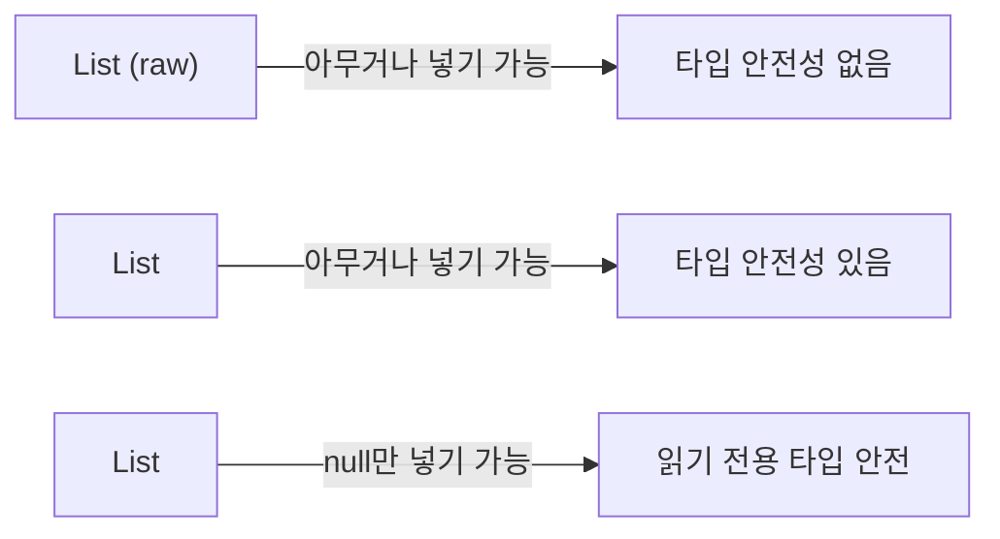
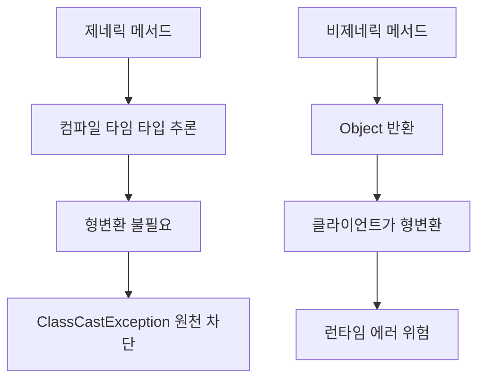
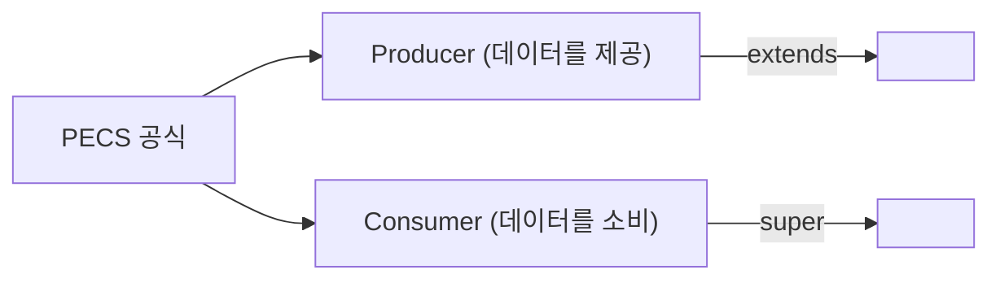
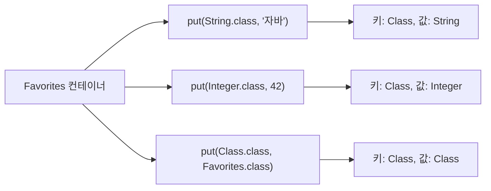
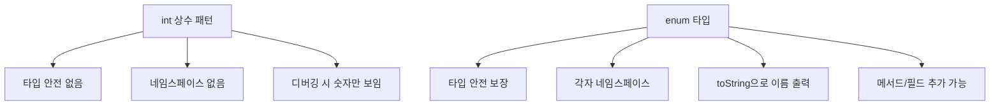
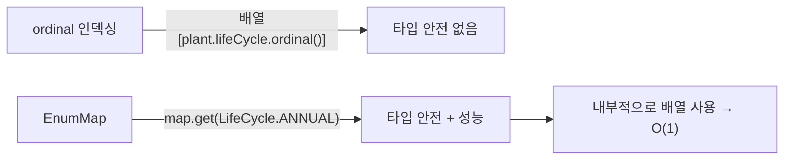

## 한 줄 요약

**제네릭으로 컴파일 타임에 타입 안전성을 확보하고, 열거형으로 상수 집합을 안전하게 관리하면 런타임 오류와 비트 조작의 함정에서 벗어난다.**

> **비유:** 제네릭은 **라벨이 붙은 서랍장**입니다 — "양말 서랍"에 양말만 넣을 수 있고, 잘못 넣으면 서랍이 안 닫힙니다(컴파일 에러). Raw type은 **라벨 없는 서랍장** — 무엇이든 들어가지만, 꺼낼 때 양말 대신 칼이 나올 수 있습니다(ClassCastException).

---

## 아이템 26: 로 타입(raw type)은 사용하지 말라

### 개념 설명

제네릭 타입에서 타입 매개변수를 사용하지 않은 것을 **로 타입(raw type)**이라 합니다. `List<String>` 대신 `List`를 쓰는 것입니다. 로 타입은 자바 5 이전 코드와의 호환성을 위해 존재하지만, **절대 새 코드에서 사용하면 안 됩니다.**

> **비유:** 공항 보안검색대(제네릭)를 통과하면 무기 반입이 차단됩니다. 보안검색을 건너뛰는 것(raw type)은 비행기 안에서 무엇이 나올지 모르는 위험을 감수하는 것입니다.

로 타입을 사용하면 **컴파일 타임에 타입 검사가 무력화**됩니다. 아래 코드에서 `Stamp` 컬렉션에 `Coin`을 넣어도 컴파일러가 경고만 하고 통과시킵니다. 실제 오류는 꺼내는 시점에 `ClassCastException`으로 터집니다.

```java
// 로 타입 — 컴파일은 되지만 런타임에 폭발
List stamps = new ArrayList();
stamps.add(new Coin()); // 경고만 발생, 에러 아님!

// 꺼낼 때 ClassCastException
Stamp s = (Stamp) stamps.get(0); // 💥 런타임 에러

// 제네릭 — 컴파일 타임에 차단
List<Stamp> stamps = new ArrayList<>();
stamps.add(new Coin()); // 컴파일 에러! 즉시 발견
```

**이 코드의 핵심:** `List<Stamp>`로 선언하면 `Coin`을 넣는 코드가 **컴파일 자체가 안 됩니다.** 오류를 발견하는 시점이 런타임에서 컴파일 타임으로 앞당겨집니다.

### raw type vs 와일드카드 vs Object

세 가지를 혼동하기 쉬우므로 차이를 명확히 정리합니다.

| 선언 | 의미 | 안전성 |
|------|------|--------|
| `List` (raw type) | 타입 검사 없음 | 위험 |
| `List<Object>` | 모든 타입의 객체를 담겠다는 의도 | 안전 |
| `List<?>` | 어떤 타입인지 모르지만 타입 안전하게 | 안전 (원소 추가 불가) |



---

## 아이템 27: 비검사 경고를 제거하라

제네릭을 사용하면 다양한 **비검사 경고(unchecked warning)**가 발생합니다. 할 수 있는 한 모든 비검사 경고를 제거해야 합니다. 제거할 수 없다면, **타입 안전함을 확인한 후** `@SuppressWarnings("unchecked")`를 가능한 **좁은 범위**에 적용합니다.

> **비유:** 자동차 계기판의 경고등을 테이프로 가리면 눈에 보이지 않지만 문제는 사라지지 않습니다. 경고의 원인을 해결해야 합니다. 정말 문제가 없을 때만 **최소한의 범위**에서 테이프를 붙입니다.

`@SuppressWarnings` 애너테이션을 사용할 때는 반드시 그 경고를 무시해도 안전한 이유를 **주석으로 남겨야 합니다.**

```java
public <T> T[] toArray(T[] a) {
    if (a.length < size) {
        // 이 형변환은 안전함: 배열 생성 시 T[]로 만들어지므로
        @SuppressWarnings("unchecked")
        T[] result = (T[]) Arrays.copyOf(elements, size, a.getClass());
        return result;
    }
    System.arraycopy(elements, 0, a, 0, size);
    if (a.length > size)
        a[size] = null;
    return a;
}
```

**이 코드의 핵심:** `@SuppressWarnings`를 메서드 전체가 아닌 **지역변수 선언**에만 적용했습니다. 범위를 최소화하여 다른 경고가 가려지는 것을 방지합니다.

---

## 아이템 28: 배열보다는 리스트를 사용하라

### 개념 설명

배열과 제네릭에는 근본적인 차이가 두 가지 있습니다.

**첫째, 배열은 공변(covariant)이고 제네릭은 불공변(invariant)입니다.** `Sub`가 `Super`의 하위 타입이면 `Sub[]`도 `Super[]`의 하위 타입이지만, `List<Sub>`는 `List<Super>`의 하위 타입이 아닙니다.

**둘째, 배열은 실체화(reify)되고 제네릭은 소거(erasure)됩니다.** 배열은 런타임에 원소 타입을 인지하지만, 제네릭은 컴파일 타임에만 타입을 검사하고 런타임에는 소거합니다.

> **비유:** 배열은 **투명한 유리 상자** — 안에 뭐가 들었는지 런타임에 보입니다. 제네릭은 **불투명 상자에 라벨** — 넣을 때 라벨을 확인하고, 상자를 닫으면 안이 안 보입니다.

```java
// 배열 — 런타임에 실패 (ArrayStoreException)
Object[] objectArray = new Long[1];
objectArray[0] = "문자열"; // 런타임 에러!

// 리스트 — 컴파일 타임에 실패
List<Object> ol = new ArrayList<Long>(); // 컴파일 에러!
ol.add("문자열");
```

**이 코드의 핵심:** 배열은 잘못된 타입을 넣어도 **런타임까지 가야** 발견되지만, 리스트는 **컴파일 시점**에 즉시 차단합니다.

---

## 아이템 29~30: 이왕이면 제네릭 타입/메서드로 만들라

클라이언트에서 직접 형변환해야 하는 타입보다 **제네릭 타입이 더 안전하고 편합니다.** 마찬가지로 **제네릭 메서드**가 형변환 없이 사용할 수 있어 더 안전합니다.

> **비유:** 만능 리모컨(제네릭)은 TV든 에어컨이든 **어떤 기기와도 페어링**됩니다. 기기별 전용 리모컨(형변환)을 따로 들고 다닐 필요가 없습니다.



아래는 제네릭 스택 클래스의 예입니다. `Object[]`로 저장하되 `push`와 `pop`에서 타입 매개변수 `E`를 사용하여 타입 안전성을 보장합니다.

```java
public class Stack<E> {
    private E[] elements;
    private int size = 0;

    @SuppressWarnings("unchecked")
    public Stack() {
        // E[]로 직접 생성 불가 → Object[]를 생성 후 형변환
        elements = (E[]) new Object[16];
    }

    public void push(E e) {
        ensureCapacity();
        elements[size++] = e;
    }

    public E pop() {
        if (size == 0) throw new EmptyStackException();
        E result = elements[--size];
        elements[size] = null;
        return result;
    }
}
```

**이 코드의 핵심:** 내부적으로 `Object[]`를 사용하지만, 외부 API는 `E` 타입만 노출합니다. `push(E)`가 타입 가드 역할을 하므로 `pop()`의 형변환은 안전합니다.

---

## 아이템 31: 한정적 와일드카드를 사용해 API 유연성을 높여라

### 개념 설명

매개변수화 타입은 **불공변(invariant)**이므로, `List<String>`은 `List<Object>`의 하위 타입이 아닙니다. 하지만 API의 유연성을 위해 **한정적 와일드카드**가 필요합니다.

> **비유:** "과일 바구니"에 사과만 담을 수 있다면 불편합니다. **"과일의 하위 타입(사과, 배, 포도)이면 뭐든 담을 수 있는 바구니"**가 `<? extends 과일>`입니다. 반대로 **"과일의 상위 타입(음식, Object)이면 뭐든 꺼낼 수 있는 바구니"**가 `<? super 과일>`입니다.

핵심 공식은 **PECS: Producer-Extends, Consumer-Super**입니다.



1️⃣ 매개변수가 **생산자(producer)** 역할이면 `<? extends T>` — 데이터를 꺼내 읽기만 함
2️⃣ 매개변수가 **소비자(consumer)** 역할이면 `<? super T>` — 데이터를 넣기만 함
3️⃣ 매개변수가 생산자이면서 소비자이면 와일드카드 불필요 — 정확한 타입 사용

아래 `pushAll` 메서드는 `Iterable<E>` 대신 `Iterable<? extends E>`를 받아서, `Stack<Number>`에 `Iterable<Integer>`를 넣을 수 있게 합니다. `popAll`은 `Collection<? super E>`를 받아서, `Stack<Number>`의 원소를 `Collection<Object>`에 넣을 수 있게 합니다.

```java
// Producer — 원소를 생산(제공)하므로 extends
public void pushAll(Iterable<? extends E> src) {
    for (E e : src) push(e);
}

// Consumer — 원소를 소비(받아들이)므로 super
public void popAll(Collection<? super E> dst) {
    while (!isEmpty()) dst.add(pop());
}
```

**이 코드의 핵심:** PECS를 적용하면 `Stack<Number>`에 `Integer`, `Double` 등 하위 타입 컬렉션을 자유롭게 넣고, `Object` 컬렉션으로 꺼낼 수 있습니다.

---

## 아이템 32: 제네릭과 가변인수를 함께 쓸 때는 신중하라

가변인수(varargs)와 제네릭을 함께 사용하면 **힙 오염(heap pollution)**이 발생할 수 있습니다. 가변인수 메서드를 호출하면 가변인수를 담기 위한 **배열**이 만들어지는데, 이 배열의 타입이 실체화 불가 타입(제네릭)이면 경고가 발생합니다.

> **비유:** 라벨이 "사과 상자"인 박스(제네릭 배열)가 만들어지는데, 실제로는 과일 상자(Object[])입니다. 누군가 배를 넣어도 상자는 거부하지 못합니다.

자바 7의 `@SafeVarargs`는 메서드 작성자가 "이 메서드는 타입 안전합니다"라고 선언하는 것입니다. 두 가지 조건을 만족해야 합니다.

1. 가변인수 배열에 아무것도 **저장하지 않는다.**
2. 가변인수 배열의 참조가 **외부로 노출되지 않는다.**

```java
@SafeVarargs
static <T> List<T> flatten(List<? extends T>... lists) {
    List<T> result = new ArrayList<>();
    for (List<? extends T> list : lists)
        result.addAll(list);
    return result;
}
```

**이 코드의 핵심:** 가변인수 배열에 저장하지 않고, 배열 참조를 외부에 노출하지 않으므로 `@SafeVarargs`를 적용할 수 있습니다.

---

## 아이템 33: 타입 안전 이종 컨테이너를 고려하라

### 개념 설명

일반적인 제네릭 컨테이너는 타입 매개변수 수가 고정되어 있습니다 (`Set<E>`, `Map<K,V>`). 하지만 **키를 타입으로 사용**하면 여러 다른 타입의 값을 안전하게 저장할 수 있습니다. 이를 **타입 안전 이종 컨테이너(typesafe heterogeneous container)**라 합니다.

> **비유:** 일반 사물함은 한 종류의 물건만 넣지만, **스마트 사물함**은 칸마다 "신발칸", "책칸", "노트북칸"이라고 적혀 있어서, 넣고 꺼낼 때 올바른 물건인지 자동으로 확인합니다.



아래 코드에서 `Class<T>` 객체를 키로 사용합니다. `String.class`의 타입은 `Class<String>`이므로, `put`과 `get`에서 타입 안전성이 자연스럽게 보장됩니다.

```java
public class Favorites {
    private Map<Class<?>, Object> favorites = new HashMap<>();

    public <T> void putFavorite(Class<T> type, T instance) {
        favorites.put(Objects.requireNonNull(type), type.cast(instance));
    }

    public <T> T getFavorite(Class<T> type) {
        return type.cast(favorites.get(type));
    }
}

// 사용
Favorites f = new Favorites();
f.putFavorite(String.class, "자바");
f.putFavorite(Integer.class, 42);

String s = f.getFavorite(String.class);  // "자바" — 형변환 불필요
Integer i = f.getFavorite(Integer.class); // 42
```

**이 코드의 핵심:** `Map<Class<?>, Object>`에서 와일드카드가 중첩된 위치에 주목합니다. 맵의 키가 **서로 다른 타입**을 가질 수 있으므로, 다양한 타입의 값을 하나의 맵에 안전하게 저장합니다.

---

## 아이템 34: int 상수 대신 열거 타입을 사용하라

### 개념 설명

정수 열거 패턴(`public static final int APPLE_FUJI = 0`)은 타입 안전을 보장하지 못하고, 표현력도 떨어집니다. 자바 열거 타입(`enum`)은 완전한 클래스이며, **상수 하나당 인스턴스 하나**를 보장합니다.

> **비유:** 정수 상수는 **번호표** — 3번이 "오렌지"인지 "행성 수성"인지 구분할 수 없습니다. 열거 타입은 **이름표** — "ORANGE"는 과일이고 "MERCURY"는 행성임이 명확합니다.



열거 타입은 메서드와 필드를 가질 수 있어, **상수별 동작(constant-specific method)**을 구현할 수 있습니다. 아래 `Operation` 열거 타입은 각 연산자가 자신의 `apply` 메서드를 구현합니다.

```java
public enum Operation {
    PLUS("+")   { public double apply(double x, double y) { return x + y; } },
    MINUS("-")  { public double apply(double x, double y) { return x - y; } },
    TIMES("*")  { public double apply(double x, double y) { return x * y; } },
    DIVIDE("/") { public double apply(double x, double y) { return x / y; } };

    private final String symbol;

    Operation(String symbol) { this.symbol = symbol; }

    @Override
    public String toString() { return symbol; }

    public abstract double apply(double x, double y);
}

// 사용
double result = Operation.PLUS.apply(1, 2); // 3.0
```

**이 코드의 핵심:** `abstract` 메서드를 선언하면 새 상수 추가 시 `apply` 구현을 **강제**합니다. `switch`문 없이 다형성으로 동작합니다.

---

## 아이템 35: ordinal 메서드 대신 인스턴스 필드를 사용하라

`ordinal()`은 열거 타입 상수가 **선언된 순서**를 반환합니다. 이 값에 의존하면 상수 순서를 바꿀 때 코드가 깨집니다.

> **비유:** 학생을 **출석 번호**(ordinal)로 관리하면, 전학생이 오면 모든 번호가 밀립니다. **학번**(인스턴스 필드)을 사용하면 전학생과 무관합니다.

`ordinal()`이 위험한 이유를 구체적으로 살펴보겠습니다. `ordinal()`은 열거 상수가 `enum` 선언에서 몇 번째 위치에 있는지를 0부터 반환합니다. 문제는 이 값이 **선언 순서에 완전히 종속**된다는 점입니다. 누군가 상수 사이에 새 상수를 추가하거나, 알파벳 순서로 정렬하거나, 사용하지 않는 상수를 제거하면 기존 상수들의 `ordinal` 값이 모두 변합니다. 이 값에 의존하는 로직이 있다면 **조용히 잘못된 결과**를 반환하며, 컴파일러 경고도 없습니다.

또한 `ordinal`에 의존하면 상수 사이에 값을 건너뛸 수 없습니다. 예를 들어 8중주(OCTET) 다음에 12명으로 구성된 합주단을 추가하려면, 9~11인에 해당하는 사용하지 않는 더미 상수를 강제로 추가해야 합니다. 인스턴스 필드를 사용하면 이런 제약이 없습니다.

```java
// 나쁜 예: ordinal에 의존
public enum Ensemble {
    SOLO, DUET, TRIO; // 순서 변경 시 파괴
    public int numberOfMusicians() { return ordinal() + 1; } // 위험!
}

// 좋은 예: 인스턴스 필드
public enum Ensemble {
    SOLO(1), DUET(2), TRIO(3), QUARTET(4);
    private final int numberOfMusicians;
    Ensemble(int size) { this.numberOfMusicians = size; }
    public int numberOfMusicians() { return numberOfMusicians; }
}
```

**이 코드의 핵심:** `ordinal()`은 `EnumSet`/`EnumMap` 같은 열거 타입 기반 자료구조에서 내부적으로만 사용됩니다. 프로그래머가 직접 사용하면 안 됩니다.

---

## 아이템 36: 비트 필드 대신 EnumSet을 사용하라

### 개념 설명

예전에는 상수 집합을 표현할 때 **비트 필드**(`STYLE_BOLD | STYLE_ITALIC`)를 사용했습니다. 하지만 비트 필드는 정수 열거 상수의 단점을 그대로 가지며, **해석하기도 어렵습니다.**

> **비유:** 비트 필드는 **모스 부호** — 전문가만 읽을 수 있습니다. `EnumSet`은 **체크리스트** — 누구나 무엇이 선택되었는지 한눈에 알 수 있습니다.

```java
// 비트 필드 — 해석 어렵고 타입 안전하지 않음
text.applyStyles(STYLE_BOLD | STYLE_ITALIC); // 3 — 무슨 뜻?

// EnumSet — 명확하고 타입 안전
text.applyStyles(EnumSet.of(Style.BOLD, Style.ITALIC)); // {BOLD, ITALIC}
```

`EnumSet`은 내부적으로 비트 벡터를 사용하므로 **성능도 비트 필드에 필적**합니다. 원소가 64개 이하면 `long` 하나로 표현하여 비트 연산을 수행합니다.

```java
public enum Style { BOLD, ITALIC, UNDERLINE, STRIKETHROUGH }

public void applyStyles(Set<Style> styles) {
    // EnumSet이 아닌 Set<Style>로 받아 유연성 확보
    if (styles.contains(Style.BOLD)) { /* 볼드 적용 */ }
    if (styles.contains(Style.ITALIC)) { /* 이탤릭 적용 */ }
}
```

**이 코드의 핵심:** 매개변수를 `Set<Style>`로 선언하여 `EnumSet` 외의 구현체도 받을 수 있습니다. 하지만 실제로는 거의 항상 `EnumSet`을 넘깁니다.

---

## 아이템 37: ordinal 인덱싱 대신 EnumMap을 사용하라

### 개념 설명

열거 타입을 키로 사용하는 맵이 필요하면 `EnumMap`을 사용합니다. `ordinal()`로 배열 인덱스를 직접 관리하면 `ArrayIndexOutOfBoundsException` 위험이 있고, 의미를 알 수 없는 정수 인덱싱이 됩니다.

> **비유:** 옷장에서 "0번 칸"(ordinal)이 아니라 **"봄옷 칸"**(EnumMap)으로 찾는 것이 자연스럽고 안전합니다.



`EnumMap`은 내부적으로 배열을 사용하므로 `HashMap`보다 빠르고, 키가 열거 타입임이 보장되므로 타입 안전합니다. `ordinal()` 인덱싱은 배열과 열거 타입의 관계를 프로그래머가 직접 관리해야 하므로 오류가 발생하기 쉽습니다.

```java
// ordinal 인덱싱 — 위험하고 못생긴 코드
Set<Plant>[] plantsByLifeCycle = (Set<Plant>[]) new Set[LifeCycle.values().length];
for (Plant p : garden)
    plantsByLifeCycle[p.lifeCycle.ordinal()].add(p);

// EnumMap — 안전하고 깔끔
Map<LifeCycle, Set<Plant>> plantsByLifeCycle = new EnumMap<>(LifeCycle.class);
for (LifeCycle lc : LifeCycle.values())
    plantsByLifeCycle.put(lc, new HashSet<>());
for (Plant p : garden)
    plantsByLifeCycle.get(p.lifeCycle).add(p);

// 스트림 + EnumMap — 가장 간결
Map<LifeCycle, List<Plant>> result = garden.stream()
    .collect(groupingBy(p -> p.lifeCycle,
        () -> new EnumMap<>(LifeCycle.class), toList()));
```

**이 코드의 핵심:** `EnumMap` 생성자에 키 타입의 `Class` 객체(`LifeCycle.class`)를 넘겨 런타임 제네릭 타입 정보를 제공합니다.

---

## 아이템 38: 확장할 수 있는 열거 타입이 필요하면 인터페이스를 사용하라

열거 타입은 확장(상속)할 수 없지만, **인터페이스를 구현**하면 확장과 유사한 효과를 얻을 수 있습니다. 연산 코드(operation code) 같은 경우에 유용합니다.

> **비유:** 열거 타입은 **밀봉된 상자** — 열 수 없습니다. 하지만 **공통 규격(인터페이스)**을 정해두면, 같은 규격의 새 상자를 만들 수 있습니다.

열거 타입이 확장 불가능한 이유는 `enum`이 암묵적으로 `java.lang.Enum`을 상속하며, 자바는 다중 상속을 허용하지 않기 때문입니다. 하지만 인터페이스를 구현하면 **타입 수준의 확장**이 가능해집니다. 기본 연산(`+`, `-`)은 `BasicOperation` enum에, 확장 연산(`^`, `%`)은 `ExtendedOperation` enum에 정의하되, 둘 다 `Operation` 인터페이스를 구현합니다. 클라이언트 코드에서는 `Operation` 타입으로 받으므로 어떤 enum이든 동일하게 사용할 수 있습니다.

이 패턴을 활용할 때 주의할 점은, 열거 타입끼리 **구현을 공유할 수 없다**는 것입니다. 공통 로직이 많다면 별도의 헬퍼 클래스나 정적 메서드로 추출하여 중복을 제거해야 합니다.

```java
public interface Operation {
    double apply(double x, double y);
}

public enum BasicOperation implements Operation {
    PLUS("+")  { public double apply(double x, double y) { return x + y; } },
    MINUS("-") { public double apply(double x, double y) { return x - y; } };
    // ...
}

// 확장: 새 연산 추가
public enum ExtendedOperation implements Operation {
    EXP("^")  { public double apply(double x, double y) { return Math.pow(x, y); } },
    MOD("%")  { public double apply(double x, double y) { return x % y; } };
    // ...
}
```

**이 코드의 핵심:** `BasicOperation`과 `ExtendedOperation`은 모두 `Operation` 인터페이스를 구현하므로, `Operation` 타입으로 통일되게 사용할 수 있습니다.

---

## 아이템 39~41: 명명 패턴 대신 애너테이션, @Override, 마커 인터페이스

### 아이템 39: 명명 패턴보다 애너테이션을 사용하라

JUnit 3은 테스트 메서드 이름을 `testXxx`로 시작해야 했습니다. 오타(`tsetXxx`)가 나면 테스트가 조용히 무시됩니다. **애너테이션(`@Test`)으로 대체**하면 컴파일러가 오류를 잡아줍니다.

애너테이션이 동작하는 메커니즘을 구체적으로 살펴보겠습니다. 애너테이션 자체는 **프로그램의 동작을 직접 바꾸지 않습니다.** 대신 애너테이션 정보를 읽어 처리하는 **두 가지 소비자**가 존재합니다. 첫째, **애너테이션 프로세서(annotation processor)**는 컴파일 타임에 `javax.annotation.processing.Processor`를 구현하여 동작하며, 소스 코드를 분석하고 새 소스 파일을 생성하거나 컴파일 에러를 발생시킵니다. Lombok의 `@Getter`, Dagger의 `@Inject` 등이 이 방식입니다. 둘째, **리플렉션 기반 처리기**는 런타임에 `Method.getAnnotation(Test.class)`로 애너테이션을 조회하고, 해당 메서드를 `Method.invoke()`로 실행합니다. JUnit 4/5의 `@Test`가 이 방식이며, 테스트 러너가 클래스의 모든 메서드를 순회하면서 `@Test` 애너테이션이 붙은 메서드만 골라 실행합니다.

`@Retention(RetentionPolicy.RUNTIME)`을 지정하면 애너테이션 정보가 바이트코드에 보존되어 런타임 리플렉션으로 읽을 수 있고, `@Target(ElementType.METHOD)`는 적용 대상을 메서드로 한정하여 클래스에 붙이면 컴파일 에러를 발생시킵니다. 이처럼 **메타 애너테이션**이 적용 범위와 생존 범위를 제어합니다.

### 아이템 40: @Override를 일관되게 사용하라

> **비유:** `@Override`는 **"나는 부모 메서드를 재정의합니다"라는 선언서**입니다. 선언서 없이 재정의하면, 실수로 **오버로딩(overloading)**을 할 수 있습니다.

`@Override`가 중요한 이유는 **재정의(override)와 오버로딩(overload)의 차이가 매개변수 타입 하나**에 달려 있기 때문입니다. `equals(Object o)`는 재정의이지만, `equals(Bigram other)`는 매개변수 타입이 다르므로 **별개의 새 메서드(오버로딩)**입니다. 이 실수를 하면 `HashSet`, `HashMap` 등이 내부적으로 `equals(Object)`를 호출하므로 재정의한 로직이 전혀 실행되지 않습니다.

`@Override`를 붙이면 컴파일러가 상위 타입에 해당 시그니처의 메서드가 존재하는지 확인합니다. `equals(Bigram)`에 `@Override`를 붙이면 `Object`에 `equals(Bigram)` 메서드가 없으므로 **컴파일 에러**로 즉시 발견됩니다. 상위 클래스의 추상 메서드를 구현하는 경우에는 `@Override`가 없어도 컴파일러가 미구현을 잡아주지만, 일관성을 위해 항상 붙이는 것이 좋습니다.

```java
// @Override 없이 — equals를 오버로딩 (재정의 아님!)
public boolean equals(Bigram other) { // Object가 아닌 Bigram 매개변수
    return first == other.first && second == other.second;
}

// @Override 사용 — 컴파일러가 매개변수 타입 오류를 잡아줌
@Override
public boolean equals(Object o) { // 올바른 시그니처
    if (!(o instanceof Bigram)) return false;
    Bigram b = (Bigram) o;
    return first == b.first && second == b.second;
}
```

**이 코드의 핵심:** `@Override`가 없으면 `equals(Bigram)`은 `equals(Object)`를 재정의한 것이 아니라 **별개의 메서드(오버로딩)**입니다. `HashSet` 등에서 의도대로 동작하지 않습니다.

### 아이템 41: 정의하려는 것이 타입이라면 마커 인터페이스를 사용하라

마커 인터페이스(`Serializable`, `Cloneable`)는 아무 메서드도 없지만 **타입 역할**을 합니다. 마커 애너테이션(`@SafeVarargs`)은 클래스 외의 프로그래밍 요소에도 적용할 수 있습니다.

두 가지의 동작 차이를 구체적으로 살펴보겠습니다. **마커 인터페이스**는 컴파일 타임에 타입 체크가 가능합니다. 예를 들어 `ObjectOutputStream.writeObject(Object)`는 인수가 `Serializable`을 구현했는지 런타임에 검사하는데, 만약 매개변수 타입이 `Serializable`이었다면 컴파일 타임에 잡을 수 있었을 것입니다. 마커 인터페이스를 구현한 클래스의 인스턴스는 **해당 인터페이스 타입으로 참조**할 수 있으므로, 메서드 매개변수나 제네릭 바운드(`<T extends Serializable>`)로 사용하면 잘못된 타입이 전달되는 것을 컴파일러가 차단합니다.

반면 **마커 애너테이션**은 타입 시스템과 무관하게 동작합니다. 리플렉션(`Class.isAnnotationPresent()`)으로만 확인할 수 있으며, 컴파일 타임 타입 검사의 이점이 없습니다. 대신 애너테이션은 클래스뿐 아니라 **메서드, 필드, 패키지, 모듈** 등 다양한 프로그래밍 요소에 적용할 수 있고, 애너테이션 프로세서를 통해 컴파일 타임 코드 생성이 가능합니다. 선택 기준은 명확합니다: **마킹된 객체를 매개변수로 받는 메서드를 작성할 일이 있다면** 마커 인터페이스, 그렇지 않다면 마커 애너테이션을 사용합니다.

---

<details class="extreme-scenario-details">
<summary class="extreme-scenario-summary">
<span class="extreme-scenario-icon">🔥</span>
<span class="extreme-scenario-label">극한 시나리오 — 클릭하여 펼치기</span>
<span class="extreme-scenario-toggle"></span>
</summary>
<div class="extreme-scenario-body">

<div class="extreme-scenario-content" markdown="1">

### 시나리오 1: raw type으로 인한 운영 장애

> **비유:** 공항 수화물 벨트에서 **이름표 없는 가방**(raw type)을 아무나 집어가면, 남의 짐을 열었을 때 폭발물이 나올 수 있습니다. 이름표(제네릭 타입)가 있어야 자기 가방만 가져갑니다.

```java
List rawList = getLegacyData(); // raw type
List<Order> orders = rawList;   // 비검사 경고 무시
Order o = orders.get(0);        // ClassCastException — 실은 String이었음
```

컴파일러 경고를 무시하고 배포한 코드가 운영 환경에서 `ClassCastException`을 터뜨리면, **주문 처리가 중단**됩니다. 구체적 메커니즘은 다음과 같습니다. 제네릭의 타입 소거(erasure)에 의해 런타임에는 `List<Order>`와 `List<String>`이 모두 `List`로 동작합니다. 컴파일러가 삽입한 `(Order)` 형변환 코드가 `get()` 반환 시점에 실행되는데, 실제 원소가 `String`이면 이 형변환이 실패합니다. 문제는 **넣는 시점과 터지는 시점이 완전히 분리**되어 있다는 것입니다. `getLegacyData()`가 반환한 데이터를 수십 개 메서드가 넘겨받다가, 한참 뒤에 꺼내는 곳에서 예외가 터지면 원인 추적에 막대한 시간이 소모됩니다.

### 시나리오 2: PECS 미적용으로 API 사용 불가

> **비유:** 주차장 입구에 **"정확히 2톤 차량만 입장 가능"**이라고 써 놓으면, 1.5톤 승용차도 3톤 트럭도 들어갈 수 없습니다. **"2톤 이하 차량 입장 가능"**(`<? extends E>`)이라고 써야 승용차도 경차도 입장할 수 있습니다.

```java
// PECS 미적용
public void pushAll(Iterable<E> src) { ... }

Stack<Number> stack = new Stack<>();
List<Integer> ints = List.of(1, 2, 3);
stack.pushAll(ints); // 컴파일 에러! Iterable<Integer> ≠ Iterable<Number>
```

`<? extends E>`를 쓰지 않으면 하위 타입 컬렉션을 넘길 수 없어 **API가 쓸모없어**집니다. 이 문제의 근본 원인은 제네릭의 **불공변(invariant)** 특성입니다. `Integer`가 `Number`의 하위 타입이더라도 `Iterable<Integer>`는 `Iterable<Number>`의 하위 타입이 아닙니다. 컴파일러 입장에서는 `Iterable<Number>`에 `Double`을 넣을 수 있는데, `Iterable<Integer>`를 허용하면 `Integer` 컬렉션에 `Double`이 들어갈 위험이 있기 때문입니다. `<? extends Number>`를 사용하면 "Number의 하위 타입이면 무엇이든 **꺼내기(읽기)**만 허용"이라는 계약이 성립하여, 컴파일러가 안전하게 하위 타입 컬렉션을 수용합니다.

### 시나리오 3: EnumMap 미사용으로 상태 전이 버그

> **비유:** 지하철 노선도에서 역 이름 대신 **"1번역→3번역"처럼 번호**로 환승 안내를 한다고 상상해 보세요. 새 역이 중간에 개통되면 번호가 전부 밀려서 환승 안내가 엉뚱한 역을 가리킵니다. **역 이름(EnumMap)**으로 안내하면 신설역과 무관하게 정확합니다.

ordinal로 2차원 배열을 만들어 상태 전이 테이블을 구성하면, 열거 상수 순서를 변경할 때 전이 매핑이 **조용히 깨집니다.** 예를 들어 `Phase` 열거 타입에 `SOLID`, `LIQUID`, `GAS` 순서로 정의하고, `TRANSITIONS[0][1] = MELT`처럼 ordinal 인덱스로 전이를 매핑했다면, 누군가 `PLASMA`를 `GAS` 뒤에 추가하는 것은 괜찮지만 `SOLID` 앞에 추가하면 모든 인덱스가 1씩 밀려 `MELT`가 `FREEZE`로 바뀌는 등 **논리적으로 완전히 다른 전이 테이블**이 됩니다. 컴파일러 경고는 없으므로 운영 환경에서 상태 머신이 잘못된 전이를 수행하고, 원인을 찾기까지 상당한 시간이 걸립니다. `EnumMap<Phase, EnumMap<Phase, Transition>>`으로 구성하면 상수 이름으로 매핑하므로, 상수 추가/삭제/순서 변경에도 안전합니다.

### 시나리오 4: 비트 필드의 64비트 초과

> **비유:** 64칸짜리 주차장(long 비트 필드)이 꽉 차면 65번째 차는 세울 곳이 없습니다. **자동으로 증축되는 입체 주차장**(EnumSet/JumboEnumSet)은 차가 늘어도 알아서 층을 올립니다.

비트 필드로 권한을 관리하던 시스템에서 권한 수가 64개를 초과하면, `long` 하나로 표현이 불가능해집니다. 실무에서 이런 상황은 마이크로서비스의 권한 체계가 점진적으로 확장될 때 흔히 발생합니다. 처음에는 `READ`, `WRITE`, `DELETE` 등 10여 개로 시작하지만, 서비스가 성장하면서 리소스별 세분화 권한이 추가되어 64개를 넘기게 됩니다. 이 시점에서 `long` 비트 필드는 **설계 한계에 도달**하며, `long[]` 배열로 확장하려면 모든 비트 연산 코드를 수정해야 합니다. `EnumSet`은 내부적으로 원소가 64개 이하일 때 `RegularEnumSet`(long 하나), 초과 시 `JumboEnumSet`(long 배열)으로 자동 전환하므로, 클라이언트 코드 변경 없이 원소 수에 제한 없이 확장됩니다.

---
</div>
</div>
</details>

## 실무에서 자주 하는 실수

| 실수 | 올바른 방법 |
|------|------------|
| raw type(`List`, `Map`) 사용 | `List<String>`, `Map<K,V>` 사용 |
| `@SuppressWarnings`를 메서드/클래스 전체에 적용 | **가능한 좁은 범위**에 적용 + 주석 |
| 배열로 제네릭 컬렉션 구현 | `List`나 `ArrayList` 사용 |
| `ordinal()`로 배열 인덱싱 | `EnumMap` 사용 |
| 비트 연산으로 옵션 조합 | `EnumSet` 사용 |
| `@Override` 누락 | 재정의 메서드에 **항상** `@Override` |
| 와일드카드 없이 제네릭 API 설계 | PECS 원칙 적용 |
| `enum` 상수에 값을 부여할 때 `ordinal()` 사용 | 인스턴스 필드 사용 |

---

## 면접 포인트

1. **Q: raw type과 `List<Object>`의 차이는?**
   - A: `List<Object>`는 "모든 타입을 담겠다"는 **의도적 선언**이며 타입 안전합니다. `List`(raw type)는 타입 검사를 **완전히 포기**한 것으로, 제네릭 이전 코드와의 호환성을 위해서만 존재합니다.

2. **Q: PECS가 무엇인가?**
   - A: **Producer-Extends, Consumer-Super.** 데이터를 꺼내기만 하는 매개변수는 `<? extends T>`, 데이터를 넣기만 하는 매개변수는 `<? super T>`를 사용합니다. `Collections.copy(List<? super T> dest, List<? extends T> src)`가 대표적입니다.

3. **Q: 제네릭 타입 소거(erasure)란?**
   - A: 컴파일러가 제네릭 타입 정보를 컴파일 타임에 검사하고, **바이트코드에서는 제거**하는 것입니다. 런타임에 `List<String>`과 `List<Integer>`는 동일한 `List`입니다. 이 때문에 `new T[]`, `instanceof T` 등이 불가능합니다.

4. **Q: EnumSet이 비트 필드보다 나은 이유는?**
   - A: **타입 안전**, **가독성**, **자동 확장**(64개 초과 시 `JumboEnumSet`), **`Set` 인터페이스 구현**(컬렉션 API 활용 가능). 성능은 비트 필드에 필적합니다.

5. **Q: 타입 안전 이종 컨테이너의 제한사항은?**
   - A: ① 악의적 클라이언트가 `Class` 객체를 raw type으로 넘기면 타입 안전이 깨집니다. ② 실체화 불가 타입(`List<String>.class`)은 키로 사용할 수 없습니다 — `List<String>`과 `List<Integer>`가 같은 `List.class`를 공유하기 때문입니다.

6. **Q: enum이 int 상수보다 나은 점은?**
   - A: **타입 안전**, **네임스페이스 분리**, **메서드/필드 추가 가능**, **상수별 동작(abstract method)**, **싱글턴 보장**, **직렬화 안전**, **toString/values() 기본 제공**.

---

## 핵심 정리

| 아이템 | 핵심 |
|--------|------|
| 26 | **raw type 금지** — `List<?>` 또는 `List<Object>` 사용 |
| 27 | 비검사 경고는 **최대한 제거**, 불가능하면 최소 범위로 억제 |
| 28 | 배열 대신 **리스트** — 공변 vs 불공변 |
| 29~30 | 가능하면 **제네릭 타입/메서드**로 |
| 31 | **PECS** — Producer-Extends, Consumer-Super |
| 32 | 제네릭 + 가변인수 → `@SafeVarargs` 신중히 |
| 33 | `Class<T>` 키 → **타입 안전 이종 컨테이너** |
| 34 | int 상수 대신 **enum** |
| 35 | `ordinal()` 대신 **인스턴스 필드** |
| 36 | 비트 필드 대신 **EnumSet** |
| 37 | ordinal 인덱싱 대신 **EnumMap** |
| 38 | 확장 가능 열거 → **인터페이스** 구현 |
| 39 | 명명 패턴 대신 **애너테이션** |
| 40 | **@Override** 일관 사용 |
| 41 | 타입이 필요하면 **마커 인터페이스** |
