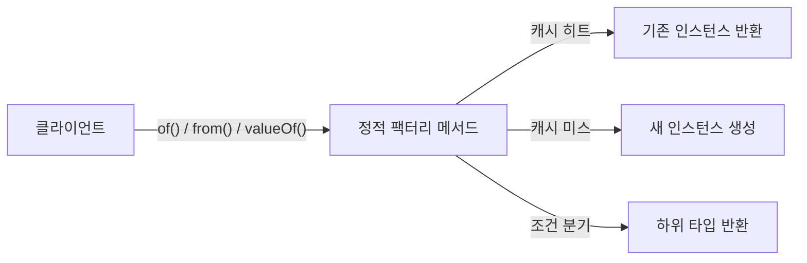
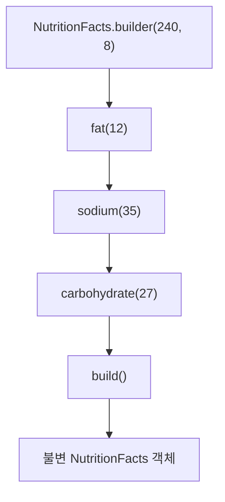
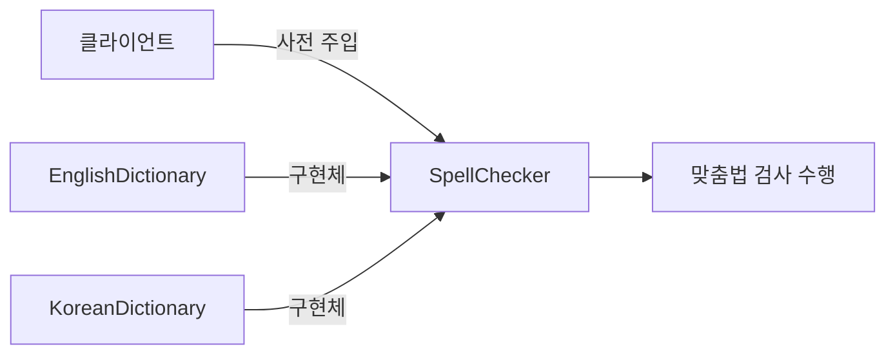
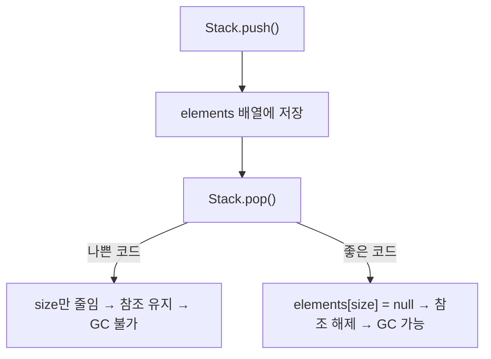
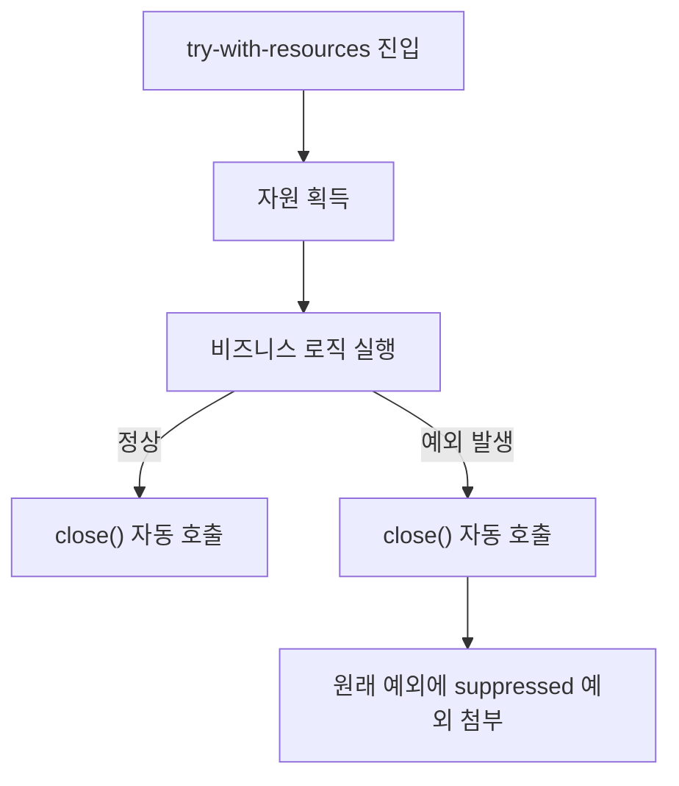

## 한 줄 요약

**객체를 "언제, 어떻게 만들고" "언제, 어떻게 버리느냐"가 자바 프로그램의 안정성과 성능을 결정한다.**

> **비유:** 객체 생성은 **공장에서 제품을 찍어내는 공정**과 같습니다. 원재료(파라미터)를 넣고, 조립 라인(생성자/빌더)을 거쳐, 완성품(인스턴스)이 나옵니다. 공정이 비효율적이면 불량품이 나오고, 폐기(GC) 처리를 잘못하면 공장 바닥에 쓰레기가 쌓입니다.

---

## 아이템 1: 생성자 대신 정적 팩터리 메서드를 고려하라

### 개념 설명

클래스의 인스턴스를 얻는 전통적인 방법은 `public` 생성자입니다. 하지만 **정적 팩터리 메서드(static factory method)**를 사용하면 이름을 통해 의도를 드러내고, 호출할 때마다 새 객체를 만들지 않을 수도 있으며, 반환 타입의 하위 타입 객체를 반환할 수도 있습니다.

> **비유:** 카페에서 "아메리카노 한 잔 주세요"라고 하면 바리스타가 알아서 만들어 줍니다. 손님은 원두를 직접 갈고 물을 끓일 필요가 없습니다. 정적 팩터리 메서드는 **바리스타** 역할입니다 — 내부 공정을 숨기고, 이름(`of`, `from`, `valueOf`)으로 주문을 받습니다.

정적 팩터리 메서드에는 다섯 가지 주요 장점이 있습니다.

1. **이름을 가질 수 있다** — `BigInteger.probablePrime()`은 생성자 `BigInteger(int, int, Random)`보다 의미가 명확합니다.
2. **호출할 때마다 새 인스턴스를 만들지 않아도 된다** — `Boolean.valueOf(boolean)`은 캐싱된 객체를 반환합니다.
3. **반환 타입의 하위 타입 객체를 반환할 수 있다** — `Collections.unmodifiableList()`는 내부 구현 클래스를 반환합니다.
4. **입력 매개변수에 따라 매번 다른 클래스를 반환할 수 있다** — `EnumSet.of()`는 원소 수에 따라 `RegularEnumSet` 또는 `JumboEnumSet`을 반환합니다.
5. **정적 팩터리 메서드를 작성하는 시점에는 반환할 객체의 클래스가 존재하지 않아도 된다** — SPI(Service Provider Interface) 프레임워크의 핵심입니다.



아래 코드는 정적 팩터리 메서드의 전형적인 패턴입니다. `from`, `of`, `valueOf` 같은 네이밍 컨벤션을 따르면 API 사용자가 직관적으로 이해할 수 있습니다.

```java
public class Color {
    private final int r, g, b;

    private Color(int r, int g, int b) {
        this.r = r; this.g = g; this.b = b;
    }

    // 정적 팩터리 메서드 — 이름으로 의도를 드러냄
    public static Color of(int r, int g, int b) {
        return new Color(r, g, b);
    }

    public static Color fromHex(String hex) {
        int r = Integer.parseInt(hex.substring(1, 3), 16);
        int g = Integer.parseInt(hex.substring(3, 5), 16);
        int b = Integer.parseInt(hex.substring(5, 7), 16);
        return new Color(r, g, b);
    }
}
```

**이 코드의 핵심:** 생성자를 `private`으로 숨기고, `of()`와 `fromHex()`라는 의미 있는 이름으로 객체 생성 경로를 제공합니다. 클라이언트는 `new Color(...)` 대신 `Color.of(255, 0, 0)` 또는 `Color.fromHex("#FF0000")`을 호출합니다.

---

## 아이템 2: 생성자에 매개변수가 많으면 빌더를 고려하라

### 개념 설명

매개변수가 4개 이상이면 **점층적 생성자 패턴(telescoping constructor)**은 읽기 어렵고, **자바빈즈 패턴(setter)**은 일관성이 깨집니다. **빌더 패턴**은 두 방식의 장점만 취합니다.

> **비유:** 지하철 샌드위치 가게를 생각해 보세요. 빵 종류, 고기, 채소, 소스를 **순서대로 하나씩 선택**하고, 마지막에 "완성!"하면 샌드위치가 나옵니다. 빌더 패턴이 바로 이 주문 과정입니다 — 각 단계에서 원하는 옵션을 설정하고, `build()`로 완성합니다.

빌더 패턴의 핵심은 **불변 객체를 단계적으로 조립**할 수 있다는 점입니다. 필수 매개변수는 빌더 생성자에서, 선택 매개변수는 메서드 체이닝으로 설정합니다.



아래 코드에서 `NutritionFacts`는 필수 매개변수 `servingSize`와 `servings`를 빌더 생성자로 받고, 나머지는 선택적으로 메서드 체이닝합니다. `build()` 호출 시점에 유효성 검사를 수행하므로 불완전한 객체가 만들어질 수 없습니다.

```java
public class NutritionFacts {
    private final int servingSize;
    private final int servings;
    private final int calories;
    private final int fat;

    public static class Builder {
        // 필수
        private final int servingSize;
        private final int servings;
        // 선택 — 기본값 초기화
        private int calories = 0;
        private int fat = 0;

        public Builder(int servingSize, int servings) {
            this.servingSize = servingSize;
            this.servings = servings;
        }

        public Builder calories(int val) { calories = val; return this; }
        public Builder fat(int val)      { fat = val;      return this; }

        public NutritionFacts build() {
            return new NutritionFacts(this);
        }
    }

    private NutritionFacts(Builder builder) {
        servingSize = builder.servingSize;
        servings    = builder.servings;
        calories    = builder.calories;
        fat         = builder.fat;
    }
}
```

**이 코드의 핵심:** `Builder` 내부 클래스가 단계적 조립을 담당하고, `NutritionFacts` 생성자는 `private`이므로 빌더를 통해서만 객체를 만들 수 있습니다. 메서드 체이닝(`return this`)으로 유창한 API를 제공합니다.

---

## 아이템 3: private 생성자나 열거 타입으로 싱글턴임을 보증하라

### 개념 설명

싱글턴(singleton)은 인스턴스를 오직 하나만 만들 수 있는 클래스입니다. 전형적인 예로 무상태 객체나 설계상 유일해야 하는 시스템 컴포넌트가 있습니다.

> **비유:** 대한민국 대통령은 한 명뿐입니다. 아무리 "새 대통령 만들어 주세요"라고 해도 현직 대통령이 반환됩니다. 싱글턴 객체가 바로 이 **유일한 대통령**입니다.

싱글턴을 만드는 세 가지 방법이 있습니다.

1. **public static final 필드** — 간결하고 API에 싱글턴임이 명백히 드러남
2. **정적 팩터리 메서드** — 유연성 확보 (나중에 싱글턴이 아니게 바꿀 수 있음)
3. **열거 타입(enum)** — 직렬화/리플렉션 공격에 완벽 방어, **가장 좋은 방법**

방법 1과 2는 리플렉션 API(`AccessibleObject.setAccessible`)를 사용하면 `private` 생성자를 호출할 수 있다는 허점이 있습니다. 이를 방어하려면 생성자에서 두 번째 인스턴스 생성 시도 시 예외를 던지는 방어 코드를 넣어야 합니다. 또한 직렬화할 때 `readResolve()` 메서드를 제공하지 않으면 역직렬화 시 새 인스턴스가 생성되어 싱글턴이 깨집니다.

반면 `enum` 방식은 JVM 수준에서 인스턴스가 단 하나임을 보장합니다. `enum` 상수는 클래스 로딩 시점에 단 한 번 초기화되며, `Enum` 클래스의 직렬화 메커니즘이 역직렬화 시에도 동일한 인스턴스를 반환합니다. 리플렉션으로 `enum` 생성자를 호출하려 하면 `IllegalArgumentException`이 발생합니다. 유일한 단점은 `Enum` 외의 클래스를 상속할 수 없다는 것인데, 인터페이스는 구현할 수 있으므로 대부분의 경우 문제가 되지 않습니다.

구체적으로 `enum` 싱글턴이 안전한 이유를 JVM 내부 동작으로 살펴보겠습니다. JVM은 `enum` 클래스를 로딩할 때 `<clinit>` (클래스 초기화 메서드)에서 각 상수를 `new` 연산으로 생성하고, 이 과정은 **클래스 로딩 락(class loading lock)**에 의해 스레드 안전하게 보호됩니다. 즉, 멀티스레드 환경에서 두 스레드가 동시에 `Elvis.INSTANCE`에 접근해도 초기화는 단 한 번만 발생합니다. `java.lang.Enum`의 직렬화는 `Enum.valueOf()`를 통해 이름으로 기존 상수를 찾아 반환하므로, `readObject()`가 새 인스턴스를 만드는 일반 직렬화와 근본적으로 다릅니다.

또한 `Constructor.newInstance()` 내부에서 대상 클래스가 `enum`인지 확인하는 코드가 명시적으로 존재하여, 리플렉션 우회를 시도하면 `IllegalArgumentException("Cannot reflectively create enum objects")`가 던져집니다. 이렇게 **직렬화, 리플렉션, 멀티스레드** 세 방향 모두에서 JVM 수준의 보장이 있기 때문에, `enum`이 싱글턴 구현의 최선이라 할 수 있습니다.

```java
// 방법 3: 열거 타입 싱글턴 — 가장 바람직
public enum Elvis {
    INSTANCE;

    public void leaveTheBuilding() { /* ... */ }
}
```

**이 코드의 핵심:** `enum`은 JVM이 인스턴스가 하나임을 보장하므로, 직렬화나 리플렉션으로 두 번째 인스턴스를 만드는 것이 원천 차단됩니다.

---

## 아이템 4: 인스턴스화를 막으려면 private 생성자를 사용하라

유틸리티 클래스(`java.util.Collections`, `java.util.Arrays` 등)는 인스턴스를 만들 이유가 없습니다. 하지만 생성자를 명시하지 않으면 컴파일러가 기본 생성자를 만들어 버립니다.

> **비유:** 건물의 비상구가 아닌 벽에 문을 달아놓으면 사람들이 들어갑니다. **문을 잠가 놓는 것**이 `private` 생성자입니다.

자바 컴파일러는 생성자가 하나도 없는 클래스에 기본 public 생성자를 자동 생성합니다. 사용자는 이 생성자가 의도적으로 제공된 것인지 구분할 수 없으므로, API 문서만 보고 인스턴스를 만들어 버릴 수 있습니다. 실제로 `java.awt.Color`나 `java.lang.Math`처럼 유틸리티 목적인 클래스도 생성자를 통해 무의미한 인스턴스를 만들 수 있었던 시절이 있었습니다.

`private` 생성자를 명시하면 컴파일러가 기본 생성자를 생성하지 않습니다. 여기에 `AssertionError`를 던지는 방어 코드를 추가하면, 클래스 내부에서 실수로 생성자를 호출하는 것까지 차단할 수 있습니다. 부수 효과로 상속도 불가능해지는데, 모든 생성자가 `private`이면 하위 클래스가 상위 생성자를 호출할 수 없기 때문입니다.

이 기법이 단순해 보이지만, 적용하지 않으면 예상치 못한 부작용이 생깁니다. 예를 들어 누군가 `Collections`를 `new Collections()`로 인스턴스화하면 해당 객체는 아무런 상태도 행위도 없는 "유령 객체"가 되고, 이것이 `HashMap`의 키로 들어가거나 `equals` 비교에 사용되면 의미 없는 버그가 발생합니다. `private` 생성자는 이런 실수를 **설계 수준에서 원천 차단**하는 가드레일입니다.

```java
public class UtilityClass {
    private UtilityClass() {
        throw new AssertionError(); // 클래스 내부에서도 실수로 호출 방지
    }
}
```

**이 코드의 핵심:** `private` 생성자 + `AssertionError`로 이중 방어합니다.

---

## 아이템 5: 자원을 직접 명시하지 말고 의존 객체 주입을 사용하라

### 개념 설명

클래스가 내부적으로 하나 이상의 자원에 의존한다면, 해당 자원을 클래스가 직접 만들게 하지 말고 **생성자(또는 정적 팩터리, 빌더)에 필요한 자원을 넘겨주는 것**이 유연하고 테스트하기 쉽습니다.

> **비유:** 레스토랑 셰프가 매번 농장에 가서 직접 재료를 가져오면 비효율적입니다. **식자재 공급업체(외부)**가 재료를 배달해 주면 셰프는 요리에만 집중할 수 있습니다. 의존 객체 주입은 이 **배달 시스템**입니다.



의존 객체 주입의 변형으로 **팩터리 메서드 패턴**이 있습니다. `Supplier<T>`를 매개변수로 받아 팩터리를 주입하면, 호출 시점마다 다른 인스턴스를 만들 수 있습니다.

```java
public class SpellChecker {
    private final Lexicon dictionary;

    // 의존 객체 주입 — 생성자에 자원을 넘긴다
    public SpellChecker(Lexicon dictionary) {
        this.dictionary = Objects.requireNonNull(dictionary);
    }

    public boolean isValid(String word) {
        return dictionary.contains(word);
    }
}
```

**이 코드의 핵심:** `SpellChecker`는 어떤 `Lexicon` 구현체가 들어오든 동작합니다. 테스트 시 Mock 사전을 주입할 수 있고, 운영 시 실제 사전을 주입합니다.

---

## 아이템 6: 불필요한 객체 생성을 피하라

### 개념 설명

동일한 기능의 객체를 매번 새로 만들면 메모리와 CPU를 낭비합니다. 특히 `String`, `Boolean`, 정규표현식 `Pattern`, 오토박싱은 대표적인 함정입니다.

> **비유:** 매일 출근할 때 새 차를 사서 타고, 퇴근하면 폐차하는 사람은 없습니다. **한 번 산 차를 계속 타는 것**이 객체 재사용입니다.

```java
// 나쁜 예 — 호출할 때마다 Pattern 컴파일
static boolean isRomanNumeralBad(String s) {
    return s.matches("^(?=.)M*(C[MD]|D?C{0,3})...");
}

// 좋은 예 — Pattern을 한 번만 컴파일
private static final Pattern ROMAN = Pattern.compile("^(?=.)M*(C[MD]|D?C{0,3})...");
static boolean isRomanNumeral(String s) {
    return ROMAN.matcher(s).matches();
}
```

**이 코드의 핵심:** `Pattern.compile()`은 비용이 높으므로 `static final`로 한 번만 생성합니다. `String.matches()`는 내부에서 매번 `Pattern`을 컴파일하므로 반복 호출 시 성능이 크게 저하됩니다.

### 오토박싱 함정

오토박싱(autoboxing)은 기본형(`int`, `long`)과 래퍼 타입(`Integer`, `Long`) 사이의 자동 변환 기능입니다. 자바 5에서 도입된 이 기능은 코드를 간결하게 만들지만, 반복문 안에서 의도치 않게 발생하면 성능에 치명적입니다. 래퍼 타입은 힙에 객체를 할당하므로, 반복마다 새 객체가 생성되고 GC 부담까지 가중됩니다.

> **비유:** 매번 편지를 보낼 때마다 새 봉투를 사서 접어 넣고, 받는 쪽에서 봉투를 뜯어 편지만 꺼내는 과정을 상상해 보세요. 봉투(래퍼 객체)를 만들고 뜯는 비용이 편지(기본형 값) 자체보다 훨씬 비쌉니다. 21억 통의 편지를 보내면 봉투 공장이 터집니다.

오토박싱이 위험한 이유는 **코드상으로 전혀 눈에 띄지 않기 때문**입니다. `Long sum = 0L`과 `long sum = 0L`은 대문자 하나 차이지만, 성능은 6배 이상 벌어집니다. 컴파일러는 이 변환을 `Long.valueOf(long)` 호출로 바꾸는데, 이 메서드는 `-128~127` 범위만 캐싱하고 나머지는 매번 `new Long()`을 호출합니다. 결과적으로 반복문의 누적 합계처럼 범위를 벗어나는 값이 반복 생성되면, GC가 수십억 개의 단명 객체를 처리해야 하므로 **Young GC 빈도가 폭증**하고 전체 처리량이 급감합니다.

아래 코드에서 `sum`을 `Long`(래퍼)으로 선언했기 때문에, `sum += i` 연산마다 `long` 값이 `Long` 객체로 오토박싱됩니다. 약 21억 번의 불필요한 `Long` 인스턴스 생성이 발생하여, `long`으로 선언할 때보다 약 6배 느려집니다. 이런 실수는 컴파일러 경고도 없어 발견이 어렵습니다.

```java
// 끔찍한 성능 — Long을 long으로 바꾸면 6배 빨라짐
Long sum = 0L;
for (long i = 0; i <= Integer.MAX_VALUE; i++) {
    sum += i; // 약 2^31개의 Long 인스턴스가 불필요하게 생성됨
}
```

**이 코드의 핵심:** `Long`(래퍼)과 `long`(기본형)을 혼용하면 반복마다 오토박싱이 발생합니다. **기본형을 우선 사용하고, 의도치 않은 오토박싱을 주의**해야 합니다.

---

## 아이템 7: 다 쓴 객체 참조를 해제하라

### 개념 설명

자바는 가비지 컬렉터가 있지만, **메모리 누수(memory leak)**에서 자유롭지 않습니다. 스택, 캐시, 리스너/콜백이 대표적인 누수 원인입니다.

> **비유:** 냉장고에 음식을 넣고 잊어버리면 유통기한이 지나도 공간을 차지합니다. **안 먹을 음식은 꺼내서 버려야** 냉장고(메모리)에 공간이 생깁니다.



스택 클래스에서 `pop()` 시 단순히 `size`만 줄이면, 꺼낸 객체의 참조가 배열에 남아 GC가 수거하지 못합니다. 명시적으로 `null` 처리를 해야 합니다.

```java
public Object pop() {
    if (size == 0) throw new EmptyStackException();
    Object result = elements[--size];
    elements[size] = null; // 다 쓴 참조 해제!
    return result;
}
```

**이 코드의 핵심:** `elements[size] = null`이 핵심입니다. 이 한 줄이 없으면 스택이 줄어들어도 GC가 옛 객체를 수거하지 못해 **은닉 메모리 누수**가 발생합니다.

---

## 아이템 8: finalizer와 cleaner 사용을 피하라

### 개념 설명

`finalizer`와 `cleaner`는 C++의 소멸자와 다릅니다. **실행 시점이 보장되지 않고**, 심지어 **실행 여부도 보장되지 않습니다.** 성능도 심각하게 저하됩니다.

> **비유:** "나중에 치울게"라고 약속하는 룸메이트를 생각해 보세요. 언제 치울지, 정말 치울지 알 수 없습니다. `finalizer`가 바로 이 **신뢰할 수 없는 룸메이트**입니다.

`finalizer`의 문제점을 정리하면 다음과 같습니다.

| 문제 | 설명 |
|------|------|
| 실행 시점 불확실 | GC 알고리즘에 의존, 즉시 실행 안 됨 |
| 실행 보장 안 됨 | `System.runFinalization()`도 보장하지 않음 |
| 성능 저하 | `try-with-resources` 대비 50배 느림 (아래 원인 참조) |
| 보안 취약 | finalizer 공격으로 불완전 객체 접근 가능 |

**왜 50배 느린가?** `finalizer`가 있는 객체는 GC가 즉시 수거하지 못합니다. GC는 해당 객체를 **F-Queue(Finalizer Queue)**에 넣고, JVM 내부의 **Finalizer 스레드**(우선순위가 낮은 데몬 스레드)가 큐에서 꺼내 `finalize()` 메서드를 호출합니다. 이 Finalizer 스레드는 애플리케이션 스레드와 CPU를 경쟁하며, 큐 처리 속도가 객체 생성 속도를 따라가지 못하면 큐가 쌓여 메모리 압박이 가중됩니다. 또한 `finalize()` 실행 후에도 객체가 바로 수거되지 않고 **다음 GC 사이클**까지 기다려야 하므로, 일반 객체 대비 최소 2번의 GC 사이클을 소모합니다. 이 모든 과정(큐 삽입, 스레드 스케줄링, 2차 GC)이 합쳐져 `try-with-resources` 방식 대비 약 50배의 성능 저하가 발생합니다.

**대안:** `AutoCloseable`을 구현하고 `try-with-resources`를 사용합니다.

---

## 아이템 9: try-finally보다는 try-with-resources를 사용하라

### 개념 설명

`InputStream`, `OutputStream`, `Connection` 등 닫아야 하는 자원은 `try-with-resources`로 관리해야 합니다. `try-finally`는 자원이 둘 이상이면 코드가 지저분해지고, 예외가 삼켜질 수 있습니다.

> **비유:** 호텔 체크아웃 시 프론트에서 **자동으로 방 청소 요청**이 가는 시스템과, 손님이 **직접 전화해서 청소를 부탁**하는 시스템의 차이입니다. 자동 시스템(`try-with-resources`)이 훨씬 신뢰할 수 있습니다.



`try-finally`에서는 `finally` 블록의 예외가 `try` 블록의 예외를 덮어쓰는 문제가 있었습니다. `try-with-resources`는 `close()`에서 발생한 예외를 **suppressed exception**으로 첨부하므로 원래 예외 정보가 보존됩니다.

```java
// try-with-resources — 깔끔하고 안전
static String firstLineOfFile(String path) throws IOException {
    try (BufferedReader br = new BufferedReader(new FileReader(path))) {
        return br.readLine();
    }
}

// 자원이 둘 이상이어도 깔끔
static void copy(String src, String dst) throws IOException {
    try (InputStream in = new FileInputStream(src);
         OutputStream out = new FileOutputStream(dst)) {
        byte[] buf = new byte[1024];
        int n;
        while ((n = in.read(buf)) >= 0)
            out.write(buf, 0, n);
    }
}
```

**이 코드의 핵심:** `try ()` 괄호 안에 자원을 선언하면, 블록을 벗어날 때 자동으로 `close()`가 호출됩니다. 자원이 여러 개여도 세미콜론으로 구분하면 됩니다.

---

<details class="extreme-scenario-details">
<summary class="extreme-scenario-summary">
<span class="extreme-scenario-icon">🔥</span>
<span class="extreme-scenario-label">극한 시나리오 — 클릭하여 펼치기</span>
<span class="extreme-scenario-toggle"></span>
</summary>
<div class="extreme-scenario-body">

<div class="extreme-scenario-content" markdown="1">

### 시나리오 1: 빌더에 필수 필드 누락

빌더 패턴에서 `build()` 호출 전에 필수 값을 설정하지 않으면 어떻게 될까요? **컴파일 타임에 잡히지 않습니다.** `build()` 내부에서 유효성 검사를 반드시 수행해야 합니다.

```java
public NutritionFacts build() {
    if (servingSize <= 0) throw new IllegalStateException("servingSize는 양수여야 합니다");
    return new NutritionFacts(this);
}
```

### 시나리오 2: 싱글턴 + 직렬화

> **비유:** 팩스로 계약서를 보내면, 받는 쪽에서 **원본이 아닌 복사본**이 만들어집니다. 싱글턴을 직렬화하면 네트워크 너머에서 "복제 대통령"이 탄생하는 것과 같습니다.

`enum` 방식이 아닌 싱글턴을 직렬화하면, 역직렬화 시 **새로운 인스턴스**가 생성됩니다. 이는 자바 직렬화 메커니즘이 `ObjectInputStream.readObject()`에서 리플렉션으로 새 객체를 생성하기 때문입니다. `readResolve()` 메서드를 추가하면 역직렬화 시 기존 인스턴스를 반환할 수 있지만, `readResolve()` 호출 전에 이미 새 인스턴스가 생성되므로 직렬화 과정에서 참조를 가로채는 공격(gadget chain)이나 리플렉션으로 `setAccessible(true)`를 사용해 `private` 생성자를 직접 호출하는 공격에는 여전히 취약합니다. **enum 싱글턴만이 JVM 수준에서 인스턴스 유일성을 보장**하므로 완벽하게 방어합니다.

### 시나리오 3: finalizer 공격

> **비유:** 공항 보안검색에서 탈락한 승객이 **"나 짐 챙길게"라며 게이트 안으로 다시 들어가는 것**과 같습니다. 이미 거부된 객체가 `finalize()`를 통해 시스템 내부에 발을 들여놓습니다.

악의적인 하위 클래스가 생성자에서 예외를 던지더라도, GC는 생성이 실패한 객체의 `finalize()` 메서드를 여전히 호출합니다. 공격자는 이 `finalize()` 안에서 `this` 참조를 정적 필드에 저장하여 GC가 수거하지 못하게 만듭니다. 이렇게 살아남은 불완전한 객체는 생성자의 보안 검사(예: 권한 확인, 입력 검증)를 통과하지 못했지만, 메서드 호출은 가능한 상태이므로 **보안 우회 통로**가 됩니다. 방어 방법은 클래스를 `final`로 선언하거나, 아무것도 하지 않는 `final finalize()` 메서드를 정의하여 하위 클래스가 오버라이드하지 못하게 하는 것입니다.

### 시나리오 4: 메모리 누수가 OOM으로

> **비유:** 호텔에서 체크아웃한 손님의 방 열쇠를 회수하지 않으면, 키 보관함이 가득 차서 새 손님에게 줄 열쇠가 없어집니다. `HashMap` 캐시에 참조를 쌓아두고 제거하지 않는 것은 **열쇠를 영원히 보관하는 호텔**과 같습니다.

캐시에 `HashMap`으로 객체를 저장하고 제거하지 않으면, 서비스가 며칠 동안 동작하다가 갑자기 `OutOfMemoryError`로 죽습니다. 이 현상의 메커니즘은 다음과 같습니다. `HashMap`은 키-값 쌍에 대한 **강한 참조(strong reference)**를 유지하므로, 맵에 엔트리가 존재하는 한 GC가 해당 객체를 수거할 수 없습니다. 서비스가 며칠간 운영되면서 캐시 엔트리가 누적되면, Old Generation 영역이 가득 차고 Full GC가 반복 발생합니다. Full GC로도 메모리를 확보하지 못하면 최종적으로 `OutOfMemoryError`가 던져지며, 이 시점에서 서비스는 복구 불가 상태에 빠집니다.

방어 방법으로는 `WeakHashMap`(키가 더 이상 참조되지 않으면 엔트리 자동 제거), `LinkedHashMap.removeEldestEntry()`(가장 오래된 엔트리 자동 퇴출), 또는 `Caffeine` 같은 캐시 라이브러리의 TTL/최대 크기 설정이 있습니다.

---
</div>
</div>
</details>

## 실무에서 자주 하는 실수

| 실수 | 올바른 방법 |
|------|------------|
| 정규식을 `String.matches()`로 반복 호출 | `Pattern`을 `static final`로 캐싱 |
| `Long` + `long` 혼용으로 오토박싱 폭탄 | 기본형 우선 사용 |
| `try-finally`에서 자원 닫기 | `try-with-resources` 사용 |
| 캐시에 넣고 제거 안 함 | `WeakHashMap` 또는 TTL 설정 |
| 빌더 없이 생성자 매개변수 6개 이상 | 빌더 패턴 도입 |
| `finalize()` 오버라이드 | `AutoCloseable` + `try-with-resources` |
| DI 없이 내부에서 의존 객체 직접 생성 | 생성자 주입으로 교체 |

---

## 면접 포인트

1. **Q: 정적 팩터리 메서드의 단점은?**
   - A: 상속하려면 `public`/`protected` 생성자가 필요하므로, 정적 팩터리만 제공하면 하위 클래스를 만들 수 없습니다. 또한 API 문서에서 생성자처럼 명확히 드러나지 않아 찾기 어렵습니다.

2. **Q: 빌더 패턴과 자바빈즈 패턴의 차이는?**
   - A: 자바빈즈는 setter로 값을 설정하므로 **객체가 일관성 없는 중간 상태**에 놓일 수 있고, 불변으로 만들 수 없습니다. 빌더는 `build()` 시점에 완전한 객체를 만들므로 **불변성 보장**이 가능합니다.

3. **Q: `try-with-resources`에서 예외가 두 개 발생하면?**
   - A: `try` 블록의 예외가 기본 예외로 전파되고, `close()`의 예외는 **suppressed exception**으로 첨부됩니다. `Throwable.getSuppressed()`로 확인할 수 있습니다.

4. **Q: 왜 enum 싱글턴이 최선인가?**
   - A: 직렬화/역직렬화 시 새 인스턴스 생성 불가, 리플렉션으로 생성자 호출 불가, `clone()` 불가. JVM 수준에서 단일 인스턴스를 보장합니다.

5. **Q: 메모리 누수를 의심해야 하는 세 가지 패턴은?**
   - A: ① 자체 메모리를 관리하는 클래스(스택, 캐시), ② 리스너/콜백 등록 후 해지 안 함, ③ `Map`에 넣고 제거하지 않는 캐시.

---

## 핵심 정리

| 아이템 | 핵심 |
|--------|------|
| 1 | 생성자 대신 **정적 팩터리 메서드** 고려 |
| 2 | 매개변수 많으면 **빌더 패턴** |
| 3 | 싱글턴은 **enum**으로 |
| 4 | 유틸리티 클래스는 **private 생성자** |
| 5 | 의존 객체는 **주입** |
| 6 | 불필요한 객체 생성 **피하기** |
| 7 | 다 쓴 참조는 **null 처리** |
| 8 | finalizer/cleaner **쓰지 마라** |
| 9 | 자원 닫기는 **try-with-resources** |
