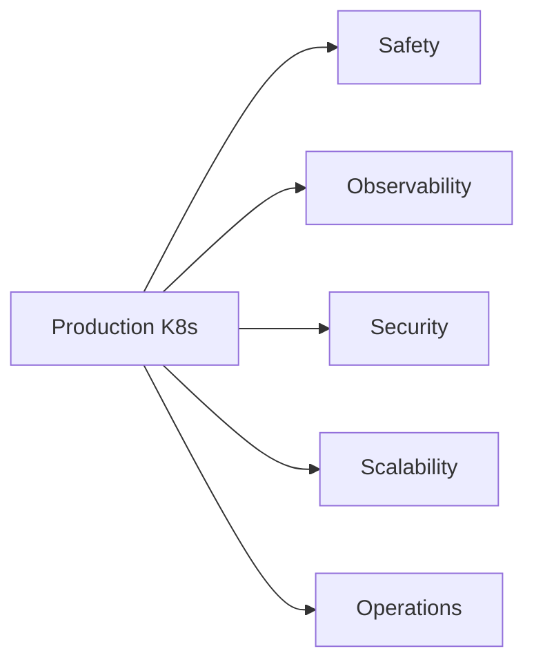

Running Kubernetes in production is not the same as running it in a tutorial. A tutorial cluster forgives mistakes — wrong resource limits, missing health probes, no RBAC. A production cluster does not. Real traffic, real users, and real money are involved. This guide covers 20 practices that separate a cluster that works from a cluster that works reliably at 3 AM.

> **Analogy**: Kubernetes is like a commercial aircraft autopilot. Powerful and capable, but it requires careful configuration, continuous monitoring, and thorough pre-flight checks before trusting it with passengers. The 20 practices below are your pre-flight checklist.

---

## Practice 1 — Always Set Resource Requests and Limits

This is the most common mistake in Kubernetes deployments. Without resource requests and limits, you have no guarantees and no protections.

**Requests** tell the scheduler how much CPU and memory your pod needs. The scheduler uses this to find a node with sufficient capacity. A pod without a CPU request can be scheduled onto an already-overloaded node.

**Limits** cap how much CPU and memory a pod can use. Without limits, a memory leak in one service can kill every other pod on the same node by exhausting node memory (OOMKilled).

```yaml
resources:
  requests:
    memory: "256Mi"
    cpu: "100m"       # 100 millicores = 0.1 CPU core
  limits:
    memory: "512Mi"
    cpu: "500m"
```

**Sizing guidance:**
- Set requests based on observed p50 usage from Prometheus metrics
- Set memory limit to 2x the request (headroom for spikes)
- Set CPU limit to 5x the request (CPU throttling is less dangerous than OOMKill)
- Never set CPU limit equal to request (tight CPU limits cause severe throttling even when the node has spare capacity)

**Quality of Service classes** are determined by requests/limits:
- **Guaranteed**: requests == limits for all containers. Pod is never evicted under memory pressure.
- **Burstable**: requests < limits. Pod can be evicted if the node is under pressure.
- **BestEffort**: no requests or limits set. First to be evicted. Never use in production.

For production, always use Guaranteed or Burstable. Never BestEffort.

---

## Practice 2 — Configure Liveness and Readiness Probes

Without probes, Kubernetes cannot distinguish a running container from a healthy one. A Spring Boot application may be running (the JVM is alive) but in a broken state (database connection pool exhausted). Without probes, Kubernetes keeps sending traffic to it.

**Readiness probe**: "Is this pod ready to serve traffic?" Kubernetes removes unhealthy pods from Service endpoints. Use for: startup not yet complete, temporarily overloaded, dependency unavailable.

**Liveness probe**: "Is this pod in a unrecoverable state?" Kubernetes restarts unhealthy pods. Use for: deadlock, memory corruption, infinite loop with no progress.

**Startup probe**: "Has this pod finished initializing?" Prevents liveness probe from killing a slow-starting pod.

```yaml
startupProbe:
  httpGet:
    path: /actuator/health/liveness
    port: 8080
  failureThreshold: 30       # Allow up to 30 × 10s = 5 minutes to start
  periodSeconds: 10

readinessProbe:
  httpGet:
    path: /actuator/health/readiness
    port: 8080
  initialDelaySeconds: 0
  periodSeconds: 10
  failureThreshold: 3        # Remove from LB after 3 consecutive failures

livenessProbe:
  httpGet:
    path: /actuator/health/liveness
    port: 8080
  initialDelaySeconds: 0
  periodSeconds: 15
  failureThreshold: 5        # Restart after 5 consecutive failures (75s)
```

**Common mistake**: using the same endpoint for readiness and liveness. Readiness checks transient state (database reachable? → yes/no). Liveness checks permanent state (is the JVM stuck in a deadlock? → restart). Mixing them causes cascading restarts when a database is temporarily unreachable.

Spring Boot provides separate endpoints out of the box:
- `/actuator/health/liveness` — JVM health only
- `/actuator/health/readiness` — JVM + dependencies

---

## Practice 3 — Use Horizontal Pod Autoscaler (HPA)

Static replica counts cannot handle traffic variability. An e-commerce service needs 3 pods at 2 AM and 30 pods during a flash sale. HPA scales automatically based on observed metrics.

```yaml
apiVersion: autoscaling/v2
kind: HorizontalPodAutoscaler
metadata:
  name: order-service-hpa
spec:
  scaleTargetRef:
    apiVersion: apps/v1
    kind: Deployment
    name: order-service
  minReplicas: 2
  maxReplicas: 30
  metrics:
    - type: Resource
      resource:
        name: cpu
        target:
          type: Utilization
          averageUtilization: 60
    - type: Pods
      pods:
        metric:
          name: http_requests_per_second
        target:
          type: AverageValue
          averageValue: "100"
  behavior:
    scaleUp:
      stabilizationWindowSeconds: 30    # React quickly to traffic spikes
      policies:
        - type: Pods
          value: 4
          periodSeconds: 60
    scaleDown:
      stabilizationWindowSeconds: 300   # Be conservative when scaling down
      policies:
        - type: Pods
          value: 1
          periodSeconds: 120
```

**Scaling behavior tuning:**
- Scale-up should be aggressive (traffic spikes are fast)
- Scale-down should be conservative (scaling down too fast during a brief lull causes thrashing)
- The `stabilizationWindowSeconds` on scale-down prevents yo-yo scaling

**HPA + VPA**: Vertical Pod Autoscaler (VPA) adjusts CPU/memory requests based on actual usage. Do not run HPA and VPA on the same metric — they conflict. Use HPA for replica count (CPU/custom metrics), VPA in recommendation mode only to tune your resource requests.

---

## Practice 4 — PodDisruptionBudget for Zero-Downtime Operations

Node drains (during upgrades, maintenance, or spot instance termination) can evict all pods of a deployment simultaneously. A PodDisruptionBudget (PDB) guarantees minimum availability during voluntary disruptions.

```yaml
apiVersion: policy/v1
kind: PodDisruptionBudget
metadata:
  name: order-service-pdb
spec:
  minAvailable: 2      # At least 2 pods must remain available at all times
  selector:
    matchLabels:
      app: order-service
```

Alternatively, use `maxUnavailable`:

```yaml
spec:
  maxUnavailable: 1    # At most 1 pod can be unavailable at any time
```

With a PDB of `minAvailable: 2` and a deployment of 3 replicas, `kubectl drain <node>` will wait for new pods to be scheduled on other nodes before evicting pods on the draining node. Node upgrades become zero-downtime events.

**Critical**: Set `minReplicas` in HPA to at least `minAvailable + 1`. If HPA scales down to 2 replicas and your PDB requires 2 available, any disruption blocks node maintenance indefinitely.

---

## Practice 5 — Graceful Shutdown with PreStop Hook

When Kubernetes terminates a pod (scaling down, rolling update), it:
1. Removes the pod from Service endpoints
2. Sends SIGTERM to the container
3. Waits `terminationGracePeriodSeconds` (default 30s)
4. Sends SIGKILL if still running

The problem: there is a propagation delay between step 1 (endpoint removed) and step 2 (SIGTERM received). During this window, the load balancer may still route traffic to the pod being terminated, causing failed requests.

The fix: a `preStop` hook that adds a sleep delay before SIGTERM propagates to the application:

```yaml
lifecycle:
  preStop:
    exec:
      command: ["/bin/sh", "-c", "sleep 15"]

terminationGracePeriodSeconds: 75  # 15s preStop + 60s for in-flight requests
```

With this configuration:
1. Pod is removed from endpoints
2. `preStop` runs (15 seconds) — load balancer finishes routing new requests away
3. SIGTERM sent to application — Spring Boot starts graceful shutdown
4. Application finishes in-flight requests (up to 60 seconds)
5. Application exits cleanly
6. `terminationGracePeriodSeconds` expires only as a last resort

Spring Boot graceful shutdown configuration:

```yaml
server:
  shutdown: graceful
spring:
  lifecycle:
    timeout-per-shutdown-phase: 60s
```

---

## Practice 6 — Never Use the `latest` Tag

```yaml
# WRONG
image: myapp:latest

# CORRECT
image: myapp:1.4.2
# Or use SHA digest for true immutability
image: myapp@sha256:a1b2c3d4e5f6...
```

The `latest` tag is a moving target. On a rolling update, different nodes may pull different versions if `latest` was re-tagged between pulls. Kubernetes also cannot detect that a new version is available (the tag has not changed), so `imagePullPolicy: IfNotPresent` (the default) will not pull the new image.

Use semantic versioning or commit SHA tags. Every CI pipeline should tag images with both `git-<sha>` (immutable, for deployments) and `v1.4.2` (human-readable, for documentation).

---

## Practice 7 — Use Rolling Updates with Proper Strategy

Kubernetes default rolling update settings are too aggressive for many production workloads.

```yaml
strategy:
  type: RollingUpdate
  rollingUpdate:
    maxSurge: 1          # Allow 1 extra pod above desired count during update
    maxUnavailable: 0    # Never reduce below desired count during update
```

With `maxUnavailable: 0`, Kubernetes creates a new pod first, waits for it to pass readiness checks, then terminates an old pod. This is conservative but ensures no reduction in serving capacity.

With `maxSurge: 25%` and `maxUnavailable: 25%` (Kubernetes defaults), up to 25% of pods can be unavailable during an update — acceptable for background workers, risky for latency-sensitive APIs.

For large deployments, consider Blue-Green deployment (switch all traffic at once) or Canary deployments (route 5% of traffic to new version, monitor, then roll out) using Argo Rollouts or Flagger.

---

## Practice 8 — Network Policies for Zero-Trust Networking

By default, every pod in a Kubernetes cluster can communicate with every other pod. This violates the principle of least privilege. A compromised payment service should not be able to query the user profile service directly.

Network policies define allow-rules for pod-to-pod and pod-to-external communication.

```yaml
apiVersion: networking.k8s.io/v1
kind: NetworkPolicy
metadata:
  name: order-service-netpol
  namespace: production
spec:
  podSelector:
    matchLabels:
      app: order-service
  policyTypes:
    - Ingress
    - Egress
  ingress:
    - from:
        - podSelector:
            matchLabels:
              app: api-gateway      # Only API gateway can call order-service
      ports:
        - protocol: TCP
          port: 8080
  egress:
    - to:
        - podSelector:
            matchLabels:
              app: postgres         # Can only reach its own database
      ports:
        - protocol: TCP
          port: 5432
    - to:
        - podSelector:
            matchLabels:
              app: kafka            # And Kafka
      ports:
        - protocol: TCP
          port: 9092
```

**Start with a default-deny policy** for each namespace, then add explicit allow rules:

```yaml
apiVersion: networking.k8s.io/v1
kind: NetworkPolicy
metadata:
  name: default-deny-all
  namespace: production
spec:
  podSelector: {}      # Applies to all pods in namespace
  policyTypes:
    - Ingress
    - Egress
```

Network policies require a CNI plugin that supports them (Calico, Cilium, Weave Net). The default Flannel CNI does not enforce network policies.

---

## Practice 9 — RBAC: Least-Privilege Access Control

Every service account should have only the permissions it needs — nothing more. A compromised pod with cluster-admin access can delete all namespaces, steal secrets, and exfiltrate data.

```yaml
# Create a dedicated service account for each deployment
apiVersion: v1
kind: ServiceAccount
metadata:
  name: order-service-sa
  namespace: production

---
# Define minimal permissions
apiVersion: rbac.authorization.k8s.io/v1
kind: Role
metadata:
  name: order-service-role
  namespace: production
rules:
  - apiGroups: [""]
    resources: ["configmaps"]
    resourceNames: ["order-service-config"]
    verbs: ["get", "watch"]         # Read-only access to its own config

---
# Bind the role to the service account
apiVersion: rbac.authorization.k8s.io/v1
kind: RoleBinding
metadata:
  name: order-service-rolebinding
  namespace: production
subjects:
  - kind: ServiceAccount
    name: order-service-sa
roleRef:
  kind: Role
  name: order-service-role
  apiGroup: rbac.authorization.k8s.io
```

**Audit regularly**: `kubectl auth can-i --list --as=system:serviceaccount:production:order-service-sa` shows what a service account can do. Use tools like `rbac-police` or `rakkess` to visualize permissions across the cluster.

---

## Practice 10 — Secrets Management: Never Store Secrets in YAML

Plain Kubernetes Secrets are base64-encoded, not encrypted. Anyone with read access to the namespace can decode them. They also get stored in etcd, often unencrypted.

**Production approach: External Secrets Operator + HashiCorp Vault or AWS Secrets Manager**

```yaml
apiVersion: external-secrets.io/v1beta1
kind: ExternalSecret
metadata:
  name: order-service-secrets
spec:
  refreshInterval: 1h
  secretStoreRef:
    name: vault-backend
    kind: ClusterSecretStore
  target:
    name: order-service-db-secret
    creationPolicy: Owner
  data:
    - secretKey: db-password
      remoteRef:
        key: production/order-service
        property: db_password
```

The secret is fetched from Vault at deploy time and injected as a Kubernetes Secret. The actual password never appears in Git or any YAML manifest.

**Minimum viable improvement** if you cannot use Vault: enable etcd encryption at rest and use Sealed Secrets (Bitnami) to encrypt secrets before storing them in Git.

---

## Practice 11 — Multi-Container Patterns: Init Containers and Sidecars

**Init containers** run and complete before the main container starts. Use them for:
- Waiting for a dependency (database, cache) to be ready before starting
- Running database migrations before the new application version starts serving traffic
- Downloading configuration from an external source

```yaml
initContainers:
  - name: wait-for-db
    image: busybox:1.36
    command:
      - sh
      - -c
      - |
        until nc -z postgres-service 5432; do
          echo "Waiting for PostgreSQL..."
          sleep 2
        done
        echo "PostgreSQL is ready"
  - name: run-migrations
    image: myapp:1.4.2
    command: ["java", "-jar", "app.jar", "--spring.batch.job.enabled=true",
              "--job=schema-migration"]
    env:
      - name: DB_URL
        valueFrom:
          secretKeyRef:
            name: order-service-secrets
            key: db-url
```

**Sidecar containers** run alongside the main container, sharing the pod's network and volumes:
- Log forwarding (Fluent Bit reads app logs, ships to Elasticsearch)
- Service mesh proxy (Envoy/Istio sidecar handles mTLS and traffic management)
- Secret refresh (Vault agent injects renewed secrets without pod restart)

---

## Practice 12 — Configure Topology Spread Constraints

Without spread constraints, the scheduler may place all pods on the same node or availability zone. A single node failure takes down your entire service.

```yaml
topologySpreadConstraints:
  - maxSkew: 1                            # At most 1 pod difference between zones
    topologyKey: topology.kubernetes.io/zone
    whenUnsatisfiable: DoNotSchedule      # Hard constraint
    labelSelector:
      matchLabels:
        app: order-service
  - maxSkew: 2
    topologyKey: kubernetes.io/hostname   # Also spread across nodes
    whenUnsatisfiable: ScheduleAnyway     # Soft constraint
    labelSelector:
      matchLabels:
        app: order-service
```

This ensures that with 6 pods across 3 availability zones, you get 2 pods per zone — tolerating any single zone failure while maintaining 4 out of 6 pods running.

---

## Practice 13 — Image Security and Vulnerability Scanning

Every container image is a potential attack surface. Minimize and scan.

**Use minimal base images:**
```dockerfile
# Instead of ubuntu:22.04 (77MB attack surface)
FROM eclipse-temurin:21-jre-alpine    # 190MB, minimal attack surface
# Or for statically compiled binaries
FROM scratch                          # Empty image, zero attack surface
```

**Non-root user:**
```dockerfile
RUN addgroup -S appgroup && adduser -S appuser -G appgroup
USER appuser
```

**Read-only root filesystem:**
```yaml
securityContext:
  readOnlyRootFilesystem: true
  runAsNonRoot: true
  runAsUser: 1000
  allowPrivilegeEscalation: false
  capabilities:
    drop:
      - ALL
```

**Vulnerability scanning in CI/CD:**

```yaml
# GitHub Actions example
- name: Scan image with Trivy
  uses: aquasecurity/trivy-action@master
  with:
    image-ref: myapp:${{ github.sha }}
    format: sarif
    exit-code: 1              # Fail the build on HIGH/CRITICAL CVEs
    severity: HIGH,CRITICAL
    ignore-unfixed: true      # Do not fail on CVEs with no patch yet
```

Integrate scanning into your CI pipeline — gate merges on zero critical CVEs. Re-scan images weekly even without code changes (new CVEs are discovered against existing images daily).

---

## Practice 14 — Structured Logging and Log Aggregation

Kubernetes pod logs are ephemeral — they are lost when a pod is evicted or restarted. Aggregate logs to a persistent store.

**The EFK stack (Elasticsearch + Fluent Bit + Kibana)** or **Grafana Loki** (cheaper, purpose-built for log aggregation) are the two dominant options.

Deploy Fluent Bit as a DaemonSet (one instance per node):

```yaml
apiVersion: apps/v1
kind: DaemonSet
metadata:
  name: fluent-bit
  namespace: logging
spec:
  selector:
    matchLabels:
      app: fluent-bit
  template:
    spec:
      containers:
        - name: fluent-bit
          image: fluent/fluent-bit:2.2
          volumeMounts:
            - name: varlog
              mountPath: /var/log
            - name: varlibdockercontainers
              mountPath: /var/lib/docker/containers
              readOnly: true
      volumes:
        - name: varlog
          hostPath:
            path: /var/log
        - name: varlibdockercontainers
          hostPath:
            path: /var/lib/docker/containers
```

Applications must log to stdout/stderr in JSON format. Fluent Bit reads these logs, enriches them with pod metadata (namespace, deployment, node), and ships to the backend.

```java
// Logback JSON configuration
// logback-spring.xml
// Use LogstashEncoder for structured JSON output
```

Key fields every log entry should include: `timestamp`, `level`, `service`, `traceId`, `spanId`, `message`, `exception` (if any).

---

## Practice 15 — Prometheus + Grafana Monitoring Stack

Every production Kubernetes cluster needs metrics. The de facto standard is kube-prometheus-stack (Prometheus Operator + Grafana + AlertManager).

**Install with Helm:**

```bash
helm repo add prometheus-community https://prometheus-community.github.io/helm-charts
helm install monitoring prometheus-community/kube-prometheus-stack \
  --namespace monitoring \
  --create-namespace \
  --set prometheus.prometheusSpec.retention=30d \
  --set prometheus.prometheusSpec.storageSpec.volumeClaimTemplate.spec.resources.requests.storage=100Gi
```

**Essential alerts to configure:**

```yaml
groups:
  - name: production-alerts
    rules:
      - alert: PodCrashLooping
        expr: rate(kube_pod_container_status_restarts_total[5m]) > 0
        for: 5m
        labels:
          severity: critical
        annotations:
          summary: "Pod {{ $labels.pod }} is crash looping"

      - alert: HighMemoryUsage
        expr: |
          container_memory_working_set_bytes
          / container_spec_memory_limit_bytes > 0.85
        for: 5m
        labels:
          severity: warning
        annotations:
          summary: "Container using > 85% of memory limit"

      - alert: DeploymentReplicasMismatch
        expr: |
          kube_deployment_spec_replicas
          != kube_deployment_status_available_replicas
        for: 10m
        labels:
          severity: critical
        annotations:
          summary: "Deployment {{ $labels.deployment }} replicas not matching desired"
```

**Golden Signal dashboards** — for each service, monitor:
1. **Latency**: p50, p95, p99 request duration
2. **Traffic**: requests per second
3. **Errors**: 4xx and 5xx error rates
4. **Saturation**: CPU and memory utilization vs limits

---

## Practice 16 — GitOps with ArgoCD or Flux

Manual `kubectl apply` in production is an antipattern. It is not auditable, not repeatable, and one typo can bring down a service. GitOps treats Git as the single source of truth for cluster state.

**ArgoCD** watches a Git repository and continuously reconciles the cluster state to match. Every deployment is a Git commit — fully auditable, instantly rollbackable.

```yaml
apiVersion: argoproj.io/v1alpha1
kind: Application
metadata:
  name: order-service
  namespace: argocd
spec:
  project: production
  source:
    repoURL: https://github.com/mycompany/k8s-manifests
    targetRevision: HEAD
    path: apps/order-service/production
  destination:
    server: https://kubernetes.default.svc
    namespace: production
  syncPolicy:
    automated:
      prune: true          # Delete resources removed from Git
      selfHeal: true       # Revert manual kubectl changes automatically
    syncOptions:
      - CreateNamespace=true
      - PrunePropagationPolicy=foreground
```

With `selfHeal: true`, any manual `kubectl edit` or `kubectl delete` on a managed resource is automatically reverted within minutes. This enforces GitOps discipline across the team.

**Deployment workflow with GitOps:**
1. Developer merges PR with code change
2. CI pipeline builds image, tags with `git-sha`, pushes to registry
3. CI pipeline updates the image tag in the Git manifest repo
4. ArgoCD detects the manifest change, applies it to the cluster
5. Rolling update proceeds with health checks

---

## Practice 17 — Node Affinity and Taints for Workload Isolation

Not all workloads belong on all nodes. ML inference jobs need GPU nodes. Cost-sensitive batch jobs belong on spot instances. Critical API services should never share nodes with batch jobs.

**Node affinity** (soft preference):

```yaml
affinity:
  nodeAffinity:
    preferredDuringSchedulingIgnoredDuringExecution:
      - weight: 100
        preference:
          matchExpressions:
            - key: node-type
              operator: In
              values:
                - compute-optimized
```

**Taints and tolerations** (hard isolation):

```bash
# Taint spot instance nodes
kubectl taint nodes spot-node-1 spot=true:NoSchedule
```

```yaml
# Only pods with this toleration can be scheduled on spot nodes
tolerations:
  - key: spot
    operator: Equal
    value: "true"
    effect: NoSchedule
```

Production recommendation:
- Taint spot nodes — only batch jobs tolerate them
- Taint GPU nodes — only ML workloads tolerate them
- Reserve dedicated node pools for critical services (use `requiredDuringScheduling` hard affinity)

---

## Practice 18 — Limit Ranges and Resource Quotas per Namespace

HPA and resource limits protect individual pods. Namespace-level controls protect the cluster from a single team consuming all resources.

**LimitRange** sets default and maximum resource requests/limits for all pods in a namespace:

```yaml
apiVersion: v1
kind: LimitRange
metadata:
  name: production-limit-range
  namespace: production
spec:
  limits:
    - type: Container
      default:
        cpu: "200m"
        memory: "256Mi"
      defaultRequest:
        cpu: "100m"
        memory: "128Mi"
      max:
        cpu: "4"
        memory: "8Gi"
      min:
        cpu: "50m"
        memory: "64Mi"
```

**ResourceQuota** caps total resource consumption per namespace:

```yaml
apiVersion: v1
kind: ResourceQuota
metadata:
  name: production-quota
  namespace: production
spec:
  hard:
    requests.cpu: "40"          # Total CPU requests across all pods
    requests.memory: "80Gi"
    limits.cpu: "80"
    limits.memory: "160Gi"
    pods: "100"
    services.loadbalancers: "5"
    persistentvolumeclaims: "20"
```

This prevents a misconfigured HPA from scaling a deployment to 1,000 replicas and consuming all cluster resources.

---

## Practice 19 — Cost Optimization: Request Right-Sizing and Spot Instances

Kubernetes clusters are expensive. Over-provisioned resource requests waste money; under-provisioned requests degrade performance.

**Right-sizing with VPA recommendations:**

Deploy VPA in recommendation mode (does not automatically change resources):

```yaml
apiVersion: autoscaling.k8s.io/v1
kind: VerticalPodAutoscaler
metadata:
  name: order-service-vpa
spec:
  targetRef:
    apiVersion: apps/v1
    kind: Deployment
    name: order-service
  updatePolicy:
    updateMode: "Off"       # Recommendation only, do not auto-update
```

Check recommendations weekly:
```bash
kubectl describe vpa order-service-vpa
# Shows: Recommended CPU: 120m, Recommended Memory: 210Mi
```

Adjust your resource requests based on the recommendation. Even a 20% reduction in requests across 50 pods translates to meaningful cost savings.

**Spot/Preemptible instances for batch workloads:**

Use Cluster Autoscaler with mixed node groups: on-demand nodes for critical services, spot nodes (70% cheaper) for batch processing and background workers. Spot nodes can be reclaimed in 2 minutes — use PodDisruptionBudgets and checkpointing to handle interruptions gracefully.

**Cluster Autoscaler** scales the node pool itself (not just pods within a node). Combine with HPA: HPA scales pods, Cluster Autoscaler scales nodes to fit the pods.

---

## Practice 20 — Chaos Engineering: Verify Your Assumptions

> **Analogy**: A fire drill is not evidence that the building is fireproof. It is evidence that people know how to evacuate. Chaos engineering tests whether your system actually recovers when things break — not whether you think it will.

Regular chaos experiments validate that your resilience configurations actually work:

**Pod failure**: Kill random pods and verify the service remains available.
```bash
# Using Chaos Mesh
kubectl apply -f - <<EOF
apiVersion: chaos-mesh.org/v1alpha1
kind: PodChaos
metadata:
  name: order-service-pod-kill
spec:
  action: pod-kill
  mode: one
  selector:
    namespaces:
      - production
    labelSelectors:
      app: order-service
  scheduler:
    cron: "@every 30m"
EOF
```

**Network partition**: Simulate a downstream service being unreachable. Verify circuit breakers open and fallbacks activate.

**Node drain**: Drain a node during business hours. Verify PDBs prevent service disruption and pods reschedule successfully.

**Resource exhaustion**: Inject CPU throttling and memory pressure. Verify HPA scales up before users notice degradation.

Keep a chaos experiment runbook. Each experiment should document: hypothesis, blast radius, expected behavior, success criteria, and rollback procedure. Start small (staging environment, limited blast radius) and graduate to production only when confidence is high.

---

## Summary

These 20 practices fall into five themes:



**Safety**: Resource limits (1), health probes (2), graceful shutdown (5), PodDisruptionBudget (4), topology spread (12), chaos engineering (20).

**Observability**: Prometheus monitoring (15), structured logging (14), and naming/tagging conventions that make metrics queryable.

**Security**: RBAC (9), network policies (8), secrets management (10), image security (13), read-only filesystems (13).

**Scalability**: HPA (3), node affinity (17), resource quotas (18), topology spread constraints (12).

**Operations**: GitOps (16), rolling updates (7), init containers (11), image tagging (6), cost optimization (19).

No single practice is sufficient. A pod with correct resource limits but no readiness probe will serve traffic while broken. A pod with correct probes but no PDB will be evicted during node maintenance. Production Kubernetes is a system — these practices work together as a whole. Implement them incrementally, verify each one with real failure scenarios, and build the operational confidence that comes only from watching your system recover gracefully at 3 AM.
