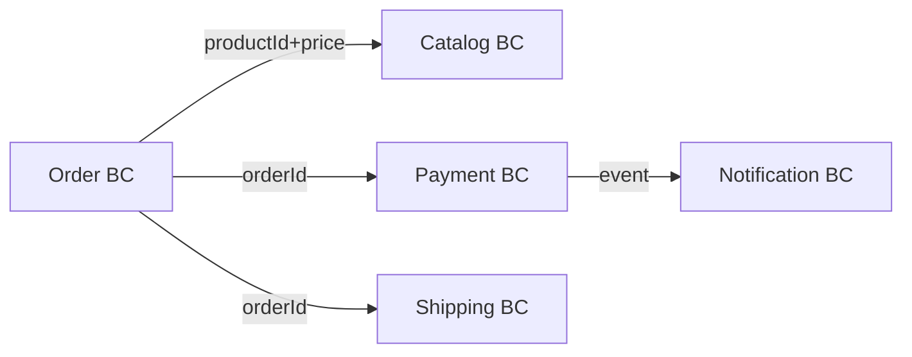
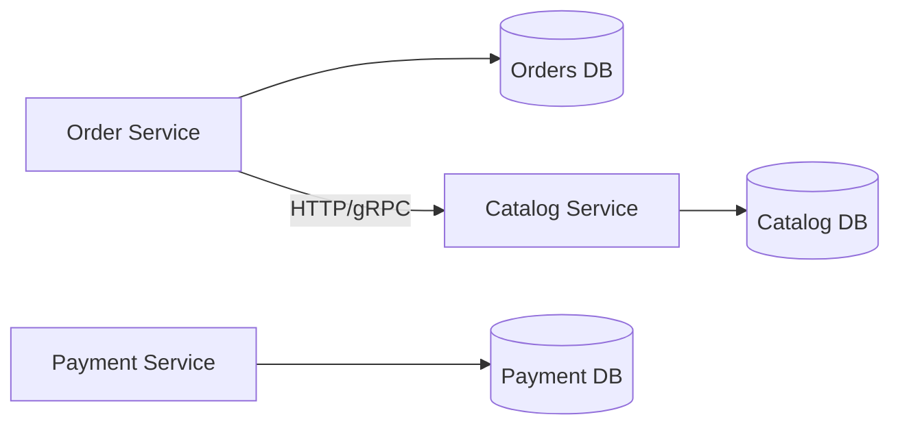

Building production-ready microservices is like constructing a city instead of a single building. Each service is an independent building with its own purpose, connected to others through roads (APIs), utilities (message buses), and emergency systems (circuit breakers). This guide walks you through every layer of that city — from blueprint to running infrastructure.

---

## 1. Why Microservices? The Honest Trade-off

Before writing a single line of code, you need to understand what you are trading. Microservices are not free.

**What you gain:**
- Independent deployability — deploy the payment service without touching the catalog service
- Technology heterogeneity — use Python for ML, Java for business logic, Go for high-throughput gateways
- Fault isolation — one service crashing does not take the entire system down
- Team autonomy — Conway's Law working in your favor: small teams own small services

**What you pay:**
- Distributed system complexity (network failures, partial failures, eventual consistency)
- Operational overhead (dozens of services to monitor, deploy, and debug)
- Latency introduced by inter-service HTTP/gRPC calls
- Data consistency challenges (no ACID transactions across service boundaries)

> **Analogy**: Microservices are like a restaurant kitchen divided into stations — grill, salad, dessert, drinks. Each station works independently, output is coordinated by the expediter (API gateway). But coordinating five stations is harder than one chef doing everything. Do not break up the kitchen until you have enough staff and volume to justify it.

The decision heuristic: if your team is fewer than 10 engineers, start with a modular monolith. Extract services when a specific module has a different scaling profile, release cadence, or team ownership than the rest.

---

## 2. Service Decomposition Strategies

### 2.1 Decompose by Business Capability

The most reliable strategy. Identify what your business does, not how the code is currently organized.

An e-commerce platform has these capabilities:
- Product Catalog
- Inventory Management
- Order Processing
- Payment
- Shipping
- Notification
- User Identity

Each becomes a candidate service. The test: could a separate team own this end-to-end without coordinating with other teams for day-to-day changes? If yes, it is a good service boundary.

### 2.2 Decompose by Subdomain (Domain-Driven Design)

DDD introduces bounded contexts — explicit boundaries within which a domain model is consistent. Each bounded context maps naturally to a microservice.

Inside the Order bounded context, "Product" means an order line item with price and quantity at time of purchase. Inside the Catalog bounded context, "Product" means a rich entity with descriptions, images, and categories. These are different things with the same name — a classic DDD signal that two bounded contexts exist.



### 2.3 The Strangler Fig Pattern

For legacy monoliths, do not rewrite everything at once. Use the Strangler Fig pattern: route specific functionality through a facade, implement it in a new service, then strangle the old code path.

Step 1: Put a routing proxy in front of the monolith.
Step 2: Implement the new service for one feature (e.g., product search).
Step 3: Route product search traffic to the new service.
Step 4: Remove the feature from the monolith.
Step 5: Repeat for the next feature.

Over months, the monolith shrinks and the microservices ecosystem grows — like a fig tree slowly replacing a dead tree host.

---

## 3. Inter-Service Communication

Three primary patterns exist, each appropriate for different scenarios.

### 3.1 Synchronous REST

The simplest approach. Service A calls Service B over HTTP and waits for a response.

```java
@Service
public class OrderService {

    private final RestTemplate restTemplate;
    private final String catalogBaseUrl;

    public OrderService(RestTemplate restTemplate,
                        @Value("${catalog.service.url}") String catalogBaseUrl) {
        this.restTemplate = restTemplate;
        this.catalogBaseUrl = catalogBaseUrl;
    }

    public ProductDto fetchProduct(String productId) {
        return restTemplate.getForObject(
            catalogBaseUrl + "/api/products/" + productId,
            ProductDto.class
        );
    }
}
```

Use REST when:
- The caller needs an immediate response to proceed
- The interaction is a query (not a command that changes state)
- Latency requirements are loose (100ms+ acceptable)

### 3.2 gRPC for High-Performance RPC

gRPC uses Protocol Buffers (binary serialization) over HTTP/2. It is roughly 5-10x faster than JSON REST for equivalent payloads and generates type-safe client/server stubs from a `.proto` contract.

Define the contract first:

```protobuf
syntax = "proto3";
package catalog;

service CatalogService {
  rpc GetProduct (GetProductRequest) returns (Product);
  rpc ListProducts (ListProductsRequest) returns (stream Product);
}

message GetProductRequest {
  string product_id = 1;
}

message Product {
  string id = 1;
  string name = 2;
  double price = 3;
  int32 stock = 4;
}
```

Spring Boot gRPC server implementation:

```java
@GrpcService
public class CatalogGrpcService extends CatalogServiceGrpc.CatalogServiceImplBase {

    private final ProductRepository productRepository;

    @Override
    public void getProduct(GetProductRequest request,
                           StreamObserver<Product> responseObserver) {
        productRepository.findById(request.getProductId())
            .map(p -> Product.newBuilder()
                .setId(p.getId())
                .setName(p.getName())
                .setPrice(p.getPrice())
                .setStock(p.getStock())
                .build())
            .ifPresentOrElse(
                product -> {
                    responseObserver.onNext(product);
                    responseObserver.onCompleted();
                },
                () -> responseObserver.onError(
                    Status.NOT_FOUND
                        .withDescription("Product not found: " + request.getProductId())
                        .asRuntimeException()
                )
            );
    }
}
```

Use gRPC when:
- Internal service-to-service calls with high throughput (order processing pipelines)
- Streaming is needed (real-time price feeds, log streaming)
- Strongly typed contracts are mandatory

### 3.3 Asynchronous Messaging with Kafka

When Service A does not need to wait for Service B, use a message broker. Kafka is the industry standard for high-throughput event streaming.

> **Analogy**: REST is a phone call — both parties must be available simultaneously. Kafka is a postal system — the sender drops a letter, the recipient reads it when available. Neither party needs to be online at the same time.

```java
// Publisher: OrderService publishes an event after creating an order
@Service
public class OrderService {

    private final KafkaTemplate<String, OrderCreatedEvent> kafkaTemplate;

    public Order createOrder(CreateOrderCommand cmd) {
        Order order = buildOrder(cmd);
        orderRepository.save(order);

        OrderCreatedEvent event = new OrderCreatedEvent(
            order.getId(),
            order.getUserId(),
            order.getItems(),
            order.getTotalAmount()
        );
        kafkaTemplate.send("order.created", order.getId(), event);
        return order;
    }
}
```

```java
// Consumer: PaymentService reacts to the event
@Service
public class PaymentConsumer {

    private final PaymentService paymentService;

    @KafkaListener(topics = "order.created", groupId = "payment-service")
    public void handleOrderCreated(OrderCreatedEvent event) {
        paymentService.initiatePayment(
            event.getOrderId(),
            event.getUserId(),
            event.getTotalAmount()
        );
    }
}
```

Kafka's key production settings:

```yaml
spring:
  kafka:
    producer:
      acks: all                    # Wait for all replicas to acknowledge
      retries: 3
      properties:
        enable.idempotence: true   # Exactly-once producer semantics
        max.in.flight.requests.per.connection: 5
    consumer:
      auto-offset-reset: earliest
      enable-auto-commit: false    # Manual commit for at-least-once processing
      properties:
        isolation.level: read_committed
```

---

## 4. API Gateway

All external traffic enters through an API gateway. Think of it as the reception desk of your office building — every visitor is directed to the right department, security checks happen here, and the building's internal layout is never exposed.

The gateway handles:
- **Routing**: map `/api/products/**` to the catalog service
- **Authentication**: validate JWT tokens before forwarding
- **Rate limiting**: protect downstream services from traffic spikes
- **Request aggregation**: combine multiple service responses for mobile clients

Spring Cloud Gateway example:

```yaml
spring:
  cloud:
    gateway:
      routes:
        - id: catalog-service
          uri: lb://catalog-service
          predicates:
            - Path=/api/products/**
          filters:
            - StripPrefix=1
            - name: CircuitBreaker
              args:
                name: catalogCB
                fallbackUri: forward:/fallback/catalog
            - name: RequestRateLimiter
              args:
                redis-rate-limiter.replenishRate: 100
                redis-rate-limiter.burstCapacity: 200
                redis-rate-limiter.requestedTokens: 1

        - id: order-service
          uri: lb://order-service
          predicates:
            - Path=/api/orders/**
          filters:
            - AuthenticationFilter
```

---

## 5. Resilience Patterns

A microservices system is only as resilient as its weakest link. Network calls fail. Services restart. Databases go slow. You must design for failure as the default, not the exception.

### 5.1 Circuit Breaker

The circuit breaker pattern is named after electrical circuit breakers. When a downstream service is failing, stop sending it requests. Give it time to recover. Periodically probe whether it has recovered.

Three states:
- **Closed**: requests flow normally, failures are counted
- **Open**: requests are blocked immediately (fail fast), fallback is used
- **Half-Open**: a few test requests flow through to check recovery

Resilience4j configuration:

```java
@Configuration
public class ResilienceConfig {

    @Bean
    public CircuitBreakerConfig circuitBreakerConfig() {
        return CircuitBreakerConfig.custom()
            .failureRateThreshold(50)           // Open when 50% of calls fail
            .slowCallRateThreshold(80)          // Open when 80% of calls are slow
            .slowCallDurationThreshold(Duration.ofSeconds(2))
            .waitDurationInOpenState(Duration.ofSeconds(30))
            .permittedNumberOfCallsInHalfOpenState(5)
            .slidingWindowSize(10)
            .build();
    }
}
```

```java
@Service
public class CatalogClient {

    private final CircuitBreaker circuitBreaker;
    private final RestTemplate restTemplate;

    public ProductDto getProduct(String productId) {
        return circuitBreaker.executeSupplier(() ->
            restTemplate.getForObject(
                "/api/products/" + productId,
                ProductDto.class
            )
        );
    }

    // Fallback: return cached or default data when circuit is open
    public ProductDto getProductFallback(String productId, Exception ex) {
        return ProductDto.unknown(productId);
    }
}
```

### 5.2 Retry with Exponential Backoff

Transient failures (brief network hiccup, GC pause) often resolve on retry. But naive immediate retry amplifies the problem — hundreds of services all retrying simultaneously creates a "retry storm."

Exponential backoff with jitter: each retry waits 2^n * (1 + random) seconds. The randomness (jitter) spreads the retry load across time.

```java
@Bean
public RetryConfig retryConfig() {
    return RetryConfig.custom()
        .maxAttempts(3)
        .waitDuration(Duration.ofMillis(500))
        .intervalFunction(IntervalFunction.ofExponentialRandomBackoff(
            Duration.ofMillis(500),   // initial interval
            2.0,                      // multiplier
            Duration.ofSeconds(10)    // max interval
        ))
        .retryOnException(ex ->
            ex instanceof ConnectException ||
            ex instanceof SocketTimeoutException
        )
        .build();
}
```

### 5.3 Bulkhead

The bulkhead pattern isolates failures by limiting concurrent access to a resource. Named after ship compartments: if one compartment floods, the others remain watertight.

```java
@Bean
public BulkheadConfig bulkheadConfig() {
    return BulkheadConfig.custom()
        .maxConcurrentCalls(20)       // Max 20 concurrent calls to catalog service
        .maxWaitDuration(Duration.ofMillis(100))
        .build();
}
```

Thread pool bulkhead (preferred for blocking I/O):

```java
@Bean
public ThreadPoolBulkheadConfig threadPoolBulkheadConfig() {
    return ThreadPoolBulkheadConfig.custom()
        .maxThreadPoolSize(10)
        .coreThreadPoolSize(5)
        .queueCapacity(20)
        .keepAliveDuration(Duration.ofMillis(100))
        .build();
}
```

### 5.4 Timeout

Every network call must have a timeout. Without timeouts, a slow downstream service holds threads indefinitely, eventually exhausting the thread pool.

```java
@Bean
public TimeLimiterConfig timeLimiterConfig() {
    return TimeLimiterConfig.custom()
        .timeoutDuration(Duration.ofSeconds(3))
        .cancelRunningFuture(true)
        .build();
}
```

Combining all four patterns with Resilience4j's decorator chain:

```java
Supplier<ProductDto> decoratedSupplier = Decorators
    .ofSupplier(() -> catalogClient.getProduct(productId))
    .withCircuitBreaker(circuitBreaker)
    .withBulkhead(bulkhead)
    .withTimeLimiter(timeLimiter, scheduledExecutorService)
    .withRetry(retry)
    .withFallback(
        List.of(CallNotPermittedException.class, TimeoutException.class),
        ex -> ProductDto.unknown(productId)
    )
    .decorate();
```

---

## 6. Service Discovery and Load Balancing

In Kubernetes, service discovery is handled by DNS and kube-proxy. In a Spring Cloud stack (non-Kubernetes), you use Eureka or Consul.

### Kubernetes Service Discovery

Each service gets a stable DNS name: `catalog-service.default.svc.cluster.local`. Spring Boot apps call each other by service name — Kubernetes routes to a healthy pod.

```yaml
apiVersion: v1
kind: Service
metadata:
  name: catalog-service
spec:
  selector:
    app: catalog-service
  ports:
    - port: 8080
      targetPort: 8080
  type: ClusterIP
```

Spring Boot application.yml:

```yaml
catalog:
  service:
    url: http://catalog-service:8080
```

### Client-Side Load Balancing with Spring Cloud LoadBalancer

```java
@Configuration
public class WebClientConfig {

    @Bean
    @LoadBalanced
    public WebClient.Builder webClientBuilder() {
        return WebClient.builder();
    }
}

@Service
public class CatalogClient {

    private final WebClient webClient;

    public CatalogClient(WebClient.Builder builder) {
        this.webClient = builder.baseUrl("http://catalog-service").build();
    }

    public Mono<ProductDto> getProduct(String productId) {
        return webClient.get()
            .uri("/api/products/{id}", productId)
            .retrieve()
            .bodyToMono(ProductDto.class);
    }
}
```

---

## 7. Distributed Tracing and Observability

When a request touches 5 services, you need to trace the entire journey. Without distributed tracing, debugging production issues is like solving a murder mystery without being able to interview witnesses.

### 7.1 Distributed Tracing with Micrometer Tracing + Zipkin

Every request gets a `traceId`. Each service adds a `spanId`. The full trace shows exactly which service was slow.

```xml
<dependency>
    <groupId>io.micrometer</groupId>
    <artifactId>micrometer-tracing-bridge-brave</artifactId>
</dependency>
<dependency>
    <groupId>io.zipkin.reporter2</groupId>
    <artifactId>zipkin-reporter-brave</artifactId>
</dependency>
```

```yaml
management:
  tracing:
    sampling:
      probability: 0.1    # Sample 10% of traces in production
  zipkin:
    tracing:
      endpoint: http://zipkin:9411/api/v2/spans
```

Trace IDs flow automatically through HTTP headers (`b3` propagation format) and Kafka message headers. Logs automatically include `traceId` and `spanId` when the dependency is on the classpath.

### 7.2 Structured Logging

```java
@Slf4j
@RestController
public class OrderController {

    @PostMapping("/api/orders")
    public ResponseEntity<OrderDto> createOrder(@RequestBody CreateOrderRequest req) {
        log.info("Creating order for user={} items={} total={}",
            req.getUserId(), req.getItems().size(), req.getTotalAmount());

        Order order = orderService.createOrder(req);

        log.info("Order created orderId={} userId={} status={}",
            order.getId(), order.getUserId(), order.getStatus());

        return ResponseEntity.status(201).body(OrderDto.from(order));
    }
}
```

Logback JSON encoder for structured logs (parseable by Elasticsearch/Loki):

```xml
<encoder class="net.logstash.logback.encoder.LogstashEncoder">
    <includeMdcKeyName>traceId</includeMdcKeyName>
    <includeMdcKeyName>spanId</includeMdcKeyName>
</encoder>
```

### 7.3 Metrics with Micrometer + Prometheus

```java
@Service
public class OrderService {

    private final Counter orderCreatedCounter;
    private final Timer orderProcessingTimer;

    public OrderService(MeterRegistry registry) {
        this.orderCreatedCounter = Counter.builder("orders.created")
            .description("Total orders created")
            .register(registry);

        this.orderProcessingTimer = Timer.builder("orders.processing.time")
            .description("Order processing latency")
            .register(registry);
    }

    public Order createOrder(CreateOrderCommand cmd) {
        return orderProcessingTimer.record(() -> {
            Order order = processOrder(cmd);
            orderCreatedCounter.increment();
            return order;
        });
    }
}
```

Prometheus scrape config in Kubernetes:

```yaml
management:
  endpoints:
    web:
      exposure:
        include: health,info,prometheus,metrics
  endpoint:
    prometheus:
      enabled: true
  metrics:
    export:
      prometheus:
        enabled: true
```

Key metrics to track per service:
- `http_server_requests_seconds` — latency histogram (p50, p95, p99)
- `http_server_requests_seconds_count` — request rate (RPS)
- `jvm_memory_used_bytes` — heap usage
- `hikaricp_connections_active` — database connection pool utilization
- Custom business metrics (orders_created, payments_processed)

---

## 8. Data Management in Microservices

### 8.1 Database per Service

Each service owns its own database schema. No service queries another service's database directly. This is the most important data principle in microservices.

Why: if Service A can query Service B's database, they are coupled at the data layer even if the API boundary is clean. Any schema change in B breaks A.



### 8.2 Saga Pattern for Distributed Transactions

You cannot use ACID transactions across service boundaries. The Saga pattern replaces them with a sequence of local transactions, each publishing an event that triggers the next step.

**Choreography-based saga** (event-driven, no central coordinator):

```
OrderService: creates order (PENDING) → publishes OrderCreated
PaymentService: receives OrderCreated → charges card → publishes PaymentCompleted
InventoryService: receives PaymentCompleted → reserves stock → publishes StockReserved
OrderService: receives StockReserved → updates order (CONFIRMED)
```

If payment fails:
```
PaymentService: payment fails → publishes PaymentFailed
OrderService: receives PaymentFailed → cancels order (CANCELLED)
```

**Orchestration-based saga** (central saga orchestrator):

```java
@Service
public class OrderSagaOrchestrator {

    public void execute(String orderId) {
        sagaStateMachine
            .step("charge-payment",
                () -> paymentClient.charge(orderId),
                () -> paymentClient.refund(orderId))      // compensating transaction
            .step("reserve-inventory",
                () -> inventoryClient.reserve(orderId),
                () -> inventoryClient.release(orderId))
            .step("schedule-shipping",
                () -> shippingClient.schedule(orderId),
                () -> shippingClient.cancel(orderId))
            .run();
    }
}
```

### 8.3 CQRS: Separate Read and Write Models

Command Query Responsibility Segregation splits the model into:
- **Write side**: handles commands, updates the primary database
- **Read side**: handles queries, reads from a denormalized read model (often Elasticsearch or a Redis cache)

```java
// Write side: Order aggregate
@Aggregate
public class OrderAggregate {

    @CommandHandler
    public void handle(CreateOrderCommand cmd) {
        apply(new OrderCreatedEvent(cmd.getOrderId(), cmd.getItems()));
    }

    @EventSourcingHandler
    public void on(OrderCreatedEvent event) {
        this.id = event.getOrderId();
        this.status = OrderStatus.PENDING;
    }
}

// Read side: denormalized view for queries
@EventHandler
public class OrderProjection {

    @EventHandler
    public void on(OrderCreatedEvent event) {
        OrderView view = new OrderView(
            event.getOrderId(),
            event.getUserId(),
            event.getItems(),
            "PENDING"
        );
        orderViewRepository.save(view);
    }
}
```

---

## 9. Docker and Kubernetes Deployment

### 9.1 Optimized Dockerfile for Spring Boot

```dockerfile
# Stage 1: Build
FROM eclipse-temurin:21-jdk-alpine AS builder
WORKDIR /app
COPY mvnw pom.xml ./
COPY .mvn .mvn
RUN ./mvnw dependency:go-offline -q

COPY src ./src
RUN ./mvnw package -DskipTests -q

# Stage 2: Extract layers for better caching
FROM eclipse-temurin:21-jdk-alpine AS layers
WORKDIR /app
COPY --from=builder /app/target/*.jar app.jar
RUN java -Djarmode=layertools -jar app.jar extract

# Stage 3: Runtime image
FROM eclipse-temurin:21-jre-alpine
WORKDIR /app

# Non-root user for security
RUN addgroup -S appgroup && adduser -S appuser -G appgroup
USER appuser

COPY --from=layers /app/dependencies/ ./
COPY --from=layers /app/spring-boot-loader/ ./
COPY --from=layers /app/snapshot-dependencies/ ./
COPY --from=layers /app/application/ ./

EXPOSE 8080
ENTRYPOINT ["java", \
    "-XX:+UseContainerSupport", \
    "-XX:MaxRAMPercentage=75.0", \
    "-Djava.security.egd=file:/dev/./urandom", \
    "org.springframework.boot.loader.launch.JarLauncher"]
```

### 9.2 Kubernetes Deployment

```yaml
apiVersion: apps/v1
kind: Deployment
metadata:
  name: order-service
  namespace: production
spec:
  replicas: 3
  selector:
    matchLabels:
      app: order-service
  strategy:
    type: RollingUpdate
    rollingUpdate:
      maxSurge: 1
      maxUnavailable: 0        # Zero-downtime rolling update
  template:
    metadata:
      labels:
        app: order-service
      annotations:
        prometheus.io/scrape: "true"
        prometheus.io/port: "8080"
        prometheus.io/path: "/actuator/prometheus"
    spec:
      containers:
        - name: order-service
          image: myregistry/order-service:1.2.3
          ports:
            - containerPort: 8080
          env:
            - name: SPRING_PROFILES_ACTIVE
              value: "production"
            - name: DB_PASSWORD
              valueFrom:
                secretKeyRef:
                  name: order-service-secrets
                  key: db-password
          resources:
            requests:
              memory: "256Mi"
              cpu: "100m"
            limits:
              memory: "512Mi"
              cpu: "500m"
          readinessProbe:
            httpGet:
              path: /actuator/health/readiness
              port: 8080
            initialDelaySeconds: 20
            periodSeconds: 10
            failureThreshold: 3
          livenessProbe:
            httpGet:
              path: /actuator/health/liveness
              port: 8080
            initialDelaySeconds: 30
            periodSeconds: 15
            failureThreshold: 5
          lifecycle:
            preStop:
              exec:
                command: ["/bin/sh", "-c", "sleep 10"]   # Drain connections before shutdown
      terminationGracePeriodSeconds: 60
```

### 9.3 Horizontal Pod Autoscaler

```yaml
apiVersion: autoscaling/v2
kind: HorizontalPodAutoscaler
metadata:
  name: order-service-hpa
spec:
  scaleTargetRef:
    apiVersion: apps/v1
    kind: Deployment
    name: order-service
  minReplicas: 2
  maxReplicas: 20
  metrics:
    - type: Resource
      resource:
        name: cpu
        target:
          type: Utilization
          averageUtilization: 60
    - type: Pods
      pods:
        metric:
          name: http_requests_per_second
        target:
          type: AverageValue
          averageValue: "100"
  behavior:
    scaleDown:
      stabilizationWindowSeconds: 300    # Wait 5 minutes before scaling down
      policies:
        - type: Pods
          value: 1
          periodSeconds: 60
    scaleUp:
      stabilizationWindowSeconds: 30
      policies:
        - type: Pods
          value: 4
          periodSeconds: 60
```

---

## 10. Health Checks and Graceful Shutdown

Spring Boot Actuator provides `/actuator/health/readiness` and `/actuator/health/liveness` out of the box.

```java
@Component
public class DatabaseHealthIndicator implements HealthIndicator {

    private final DataSource dataSource;

    @Override
    public Health health() {
        try (Connection conn = dataSource.getConnection()) {
            conn.createStatement().executeQuery("SELECT 1");
            return Health.up()
                .withDetail("database", "reachable")
                .build();
        } catch (SQLException e) {
            return Health.down()
                .withDetail("error", e.getMessage())
                .build();
        }
    }
}
```

Graceful shutdown — wait for in-flight requests to complete:

```yaml
server:
  shutdown: graceful

spring:
  lifecycle:
    timeout-per-shutdown-phase: 30s
```

When Kubernetes sends SIGTERM, Spring Boot:
1. Stops accepting new requests (readiness probe fails)
2. Waits up to 30 seconds for in-flight requests to complete
3. Closes database connections and message consumers
4. Exits cleanly

---

## 11. Common Anti-Patterns to Avoid

**1. Chatty services**: Service A calls Service B 10 times per user request. Aggregate at the API gateway or use request aggregation at the service level. Each network call adds latency and failure surface.

**2. Distributed monolith**: Services that are so tightly coupled they must be deployed together. Usually caused by shared databases or synchronous chains where A → B → C → D all fail if D is down. Break the synchronous chain with events.

**3. Too many microservices too soon**: A team of 3 engineers running 15 microservices is a support nightmare. Start with 3-5 services, extract more as genuine scaling or ownership needs emerge.

**4. Ignoring eventual consistency**: Displaying stale data to users is acceptable in most cases. Trying to achieve strong consistency across services creates distributed locking nightmares. Embrace eventual consistency and design the UX around it.

**5. No idempotency**: Message consumers must be idempotent. A Kafka consumer may process the same message twice (at-least-once delivery). Every operation triggered by a message must be safe to repeat without side effects.

```java
@KafkaListener(topics = "order.created")
public void handleOrderCreated(OrderCreatedEvent event) {
    // Idempotency check: skip if already processed
    if (paymentRepository.existsByOrderId(event.getOrderId())) {
        log.info("Payment already processed for orderId={}, skipping",
            event.getOrderId());
        return;
    }
    paymentService.initiatePayment(event);
}
```

**6. Missing correlation IDs**: Every request entering the system should carry a `correlationId` (or `X-Request-ID` header). Propagate it through all service calls and log it everywhere. Without it, tracing a user complaint through 5 services is impossible.

---

## 12. Production Readiness Checklist

Before calling a microservice production-ready, verify these:

**Resilience**
- [ ] Circuit breaker configured for all downstream calls
- [ ] Timeouts on all HTTP clients (connect timeout + read timeout)
- [ ] Retry with exponential backoff and jitter
- [ ] Bulkhead to isolate thread pools per dependency

**Observability**
- [ ] Structured JSON logging with traceId/spanId
- [ ] Prometheus metrics endpoint exposed
- [ ] Distributed tracing configured (Zipkin/Jaeger/Tempo)
- [ ] Health endpoints for liveness and readiness

**Security**
- [ ] Non-root container user
- [ ] Secrets from Kubernetes Secrets or Vault (never env vars in plain YAML)
- [ ] Network policies restricting which services can call which
- [ ] JWT validation at the gateway, not trusted by default inside the cluster

**Deployment**
- [ ] Docker image uses layered build for fast pushes
- [ ] CPU and memory requests/limits set
- [ ] Liveness and readiness probes configured
- [ ] Graceful shutdown with drain period
- [ ] HPA configured with appropriate min/max replicas
- [ ] PodDisruptionBudget to ensure minimum availability during node maintenance

**Data**
- [ ] Database migrations automated (Flyway or Liquibase)
- [ ] Connection pool sized correctly (HikariCP maxPoolSize)
- [ ] Read replicas for heavy query loads
- [ ] Idempotent message consumers

---

## Summary

Microservices are a powerful architectural pattern, but only when the problems they solve are real. Start with clear service boundaries aligned to business capabilities. Protect every outbound call with circuit breakers and timeouts. Embrace eventual consistency for cross-service data. Invest heavily in observability from day one — you cannot fix what you cannot see.

The production checklist above is not optional. A microservice that lacks health probes, timeouts, or structured logging is not production-ready — it is a time bomb. Build these in from the start, and deploying, debugging, and scaling your system will be orders of magnitude simpler.
