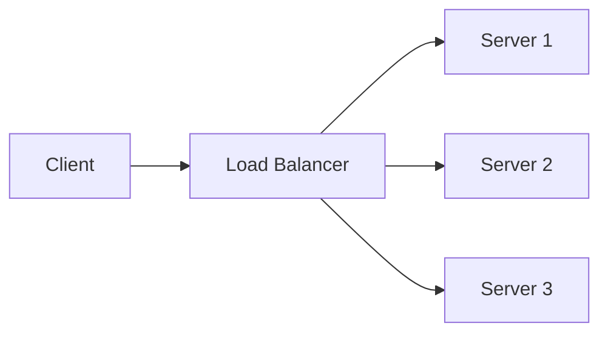
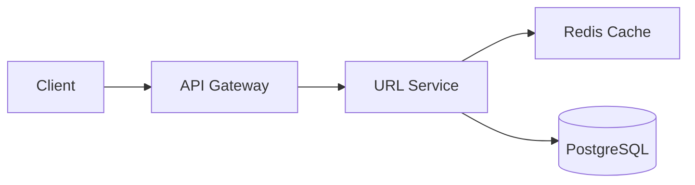
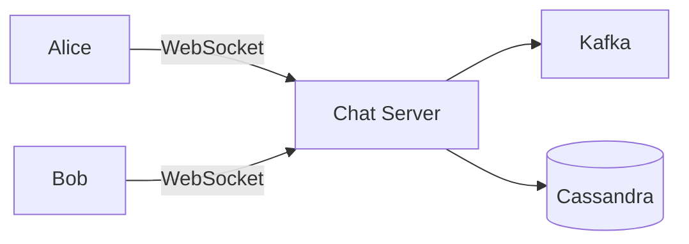
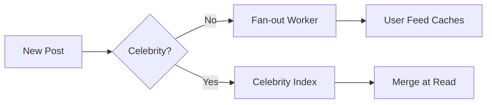
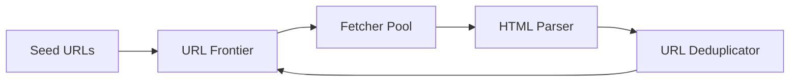
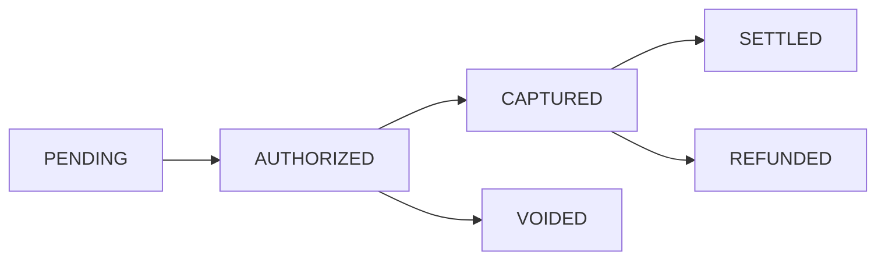

System design interviews separate engineers who build things that work from engineers who build things that scale. A feature that handles 100 users is a solved problem. The same feature handling 100 million users with 99.99% availability is where the interesting trade-offs begin. This guide gives you a repeatable framework, the essential building blocks, and five complete walkthroughs of the most common interview problems.

---

## 1. The RESHADED Framework

Every system design interview benefits from a structured approach. RESHADED is a mnemonic that covers the full lifecycle of a design:

| Letter | Step | What to do |
|--------|------|------------|
| **R** | Requirements | Clarify functional and non-functional requirements |
| **E** | Estimation | Back-of-envelope capacity calculation |
| **S** | Storage | Data model, schema, storage choices |
| **H** | High-level design | Core components, data flow diagram |
| **A** | APIs | Define key API endpoints |
| **D** | Deep dive | Bottlenecks, scale-out, edge cases |
| **E** | Evaluate | Trade-offs, alternatives considered |
| **D** | Distinctiveness | What makes this design production-grade |

> **Analogy**: Designing a system without RESHADED is like an architect starting to draw walls before asking the client how many people will use the building, whether it needs earthquake resistance, or what the budget is. The framework forces the right questions before the first line on the whiteboard.

### Requirements Clarification (always do this first)

Ask these before drawing anything:

**Functional requirements** (what the system does):
- What are the core features in scope?
- What is explicitly out of scope?
- Who are the users and what are their primary use cases?

**Non-functional requirements** (how the system behaves):
- Scale: How many users? What is the peak QPS (queries per second)?
- Availability: 99.9% (8.7 hrs/year downtime) or 99.99% (52 min/year)?
- Consistency: Strong (every read sees the latest write) or eventual?
- Latency: p99 read latency < 100ms? p50 write latency < 50ms?
- Durability: Can we lose any data, or is zero data loss mandatory?

---

## 2. Back-of-Envelope Calculations

Interviewers want to see that you can reason about scale quantitatively. Memorize these reference numbers:

| Metric | Value |
|--------|-------|
| L1 cache access | 1 ns |
| L2 cache access | 4 ns |
| RAM access | 100 ns |
| SSD random read | 100 µs |
| HDD random read | 10 ms |
| Network round trip (same DC) | 500 µs |
| Network round trip (cross-continent) | 150 ms |
| Read 1 MB from RAM | 250 µs |
| Read 1 MB from SSD | 1 ms |

**Storage estimation recipe:**

1. Daily active users (DAU)
2. × average writes per user per day = total writes/day
3. ÷ 86,400 = writes/second (QPS)
4. × average object size = storage per second
5. × 365 × 5 (years) × 3 (replication factor) = total storage

**Example — Twitter-scale estimation:**
- 500M DAU, each user reads 100 tweets/day, writes 2 tweets/day
- Read QPS: 500M × 100 / 86,400 ≈ 580,000 reads/sec
- Write QPS: 500M × 2 / 86,400 ≈ 11,600 writes/sec
- Tweet size: 280 chars UTF-8 + metadata ≈ 1 KB
- Storage: 11,600 writes/sec × 1 KB × 86,400 sec ≈ 1 TB/day
- 5-year storage: 1 TB × 365 × 5 × 3 = ~5.5 PB

These numbers tell you: you need read-heavy caching, write sharding, and object storage (not relational DB) at this scale.

---

## 3. Core Building Blocks

Every large-scale system is assembled from a small set of building blocks. Master these.

### 3.1 Load Balancer

Distributes incoming requests across a pool of servers. Prevents any single server from becoming a bottleneck.

**Algorithms:**
- Round Robin: requests cycle through servers evenly (good for stateless services)
- Least Connections: route to the server with fewest active connections (good for long-lived connections)
- Consistent Hashing: route based on a hash of the client IP or user ID (good for session affinity and distributed caches)
- Weighted Round Robin: heavier servers get more traffic (good for heterogeneous hardware)

**Health checking**: Load balancers probe backends every few seconds. Unhealthy backends are automatically removed from rotation.



### 3.2 Cache

Caches exploit locality of reference: recently accessed data is likely to be accessed again soon. A cache sits between the application and the database, serving hot data from memory.

**Cache-aside (Lazy Loading)**: Application checks cache first. On a miss, fetches from DB and populates cache. Simple and widely used.

```
1. App reads from cache
2. Cache miss → App reads from DB
3. App writes result to cache with TTL
4. Subsequent reads: cache hit (fast path)
```

**Write-through**: Every write goes to cache and DB synchronously. Cache is always consistent with DB, but every write pays double latency.

**Write-behind (Write-back)**: Write goes to cache immediately, DB is updated asynchronously. Lowest write latency, but data can be lost if cache crashes before DB sync.

**Cache eviction policies:**
- **LRU (Least Recently Used)**: evict the item accessed longest ago. Best for temporal locality.
- **LFU (Least Frequently Used)**: evict the item accessed least often. Best when access frequency is predictive.
- **TTL (Time To Live)**: evict after a fixed duration. Essential for correctness when data changes.

**Cache invalidation** is the hardest problem. Strategies:
- Time-based TTL (simple, eventually consistent)
- Event-driven invalidation (publish a "product updated" event → all caches invalidate that key)
- Cache versioning (change the cache key when data changes — e.g., `product:123:v4`)

### 3.3 Relational Database

ACID guarantees: Atomicity, Consistency, Isolation, Durability. Use when:
- Data has clear relational structure
- Transactions are required (financial records, inventory)
- Complex ad-hoc queries are needed

**Replication**: One primary node handles writes, multiple read replicas handle reads. Asynchronous replication gives the lowest write latency but allows brief inconsistency (replication lag).

**Sharding**: Split data across multiple database instances. Each shard holds a subset of rows.
- Range sharding: shard by user ID range (0-1M on shard 1, 1M-2M on shard 2...). Simple but creates hotspots.
- Hash sharding: shard by hash(user_id). Even distribution but cross-shard queries are expensive.
- Directory sharding: a lookup table maps each key to its shard. Flexible but the lookup table becomes a bottleneck.

### 3.4 NoSQL Database

Four types, each optimized for different access patterns:

| Type | Examples | Best for |
|------|----------|----------|
| Key-Value | Redis, DynamoDB | Session store, cache, rate limiting |
| Document | MongoDB, CouchDB | User profiles, product catalogs |
| Wide-column | Cassandra, HBase | Time-series, activity feeds, IoT |
| Graph | Neo4j, Amazon Neptune | Social graphs, recommendation engines |

Cassandra is worth understanding deeply for interview problems. Its data model forces you to design tables around query patterns (not normalization). It offers linear horizontal scalability and high write throughput at the cost of no joins and eventual consistency.

### 3.5 Message Queue

Message queues decouple producers from consumers and absorb traffic spikes. Think of a queue as a post office: the sender (producer) drops off a package and leaves; the receiver (consumer) picks it up when ready. Neither party needs to be present simultaneously.

**Kafka**: Log-based message broker. Messages are retained for a configurable period (days/weeks). Multiple consumer groups can read the same stream independently. Excellent for event sourcing, audit logs, and stream processing.

**RabbitMQ / SQS**: Traditional queue. Message is removed after one consumer acknowledges it. Better for task queues where each job should be processed exactly once.

### 3.6 CDN (Content Delivery Network)

Caches static assets (images, videos, JavaScript, CSS) at edge servers distributed globally. A user in Tokyo gets assets from a Tokyo edge node, not a server in Virginia. Reduces latency from 150ms to 5ms for static content.

Also used for:
- DDoS protection (edge absorbs attack traffic)
- Dynamic content acceleration (route API calls through CDN's private backbone)
- Origin shield (aggregate cache misses before hitting the origin)

---

## 4. Problem 1 — URL Shortener (bit.ly)

### Requirements

Functional:
- Given a long URL, return a short URL (e.g., `https://bit.ly/3xK9pQ`)
- Given a short URL, redirect to the original long URL
- Optional: custom aliases, expiration dates, click analytics

Non-functional:
- 100M new URLs created per day
- 10:1 read/write ratio (10B redirects/day)
- Low latency redirects (< 10ms p99)
- High availability (99.99%)

### Estimation

- Write QPS: 100M / 86,400 ≈ 1,160 writes/sec
- Read QPS: 1B / 86,400 ≈ 11,600 reads/sec
- Storage per URL: 500 bytes (original URL + metadata)
- 5-year storage: 100M/day × 365 × 5 × 500B ≈ 91 TB

### Core Design



**Short URL generation** — the most interesting part:

Option 1: **Base62 encoding of auto-increment ID**. The database generates a sequential ID (1, 2, 3...). Encode in base62 (a-z, A-Z, 0-9). ID=1 → "1", ID=3,521,614,606 → "4qlD3". Predictable, easy to reverse-engineer (enumeration attack).

Option 2: **MD5/SHA256 hash of long URL, take first 7 characters**. 62^7 ≈ 3.5 trillion unique short URLs. Collision probability is low but non-zero — must handle. Hash is deterministic: the same long URL always generates the same short URL (deduplication is free).

Option 3: **Pre-generated random tokens**. A background worker pre-generates 100M random 7-character tokens and stores them in a "pool" table. Each new URL creation pops one from the pool. No collision risk, no hash computation at request time. Best for high-throughput systems.

**Redirect flow:**
1. Client requests `GET /3xK9pQ`
2. Service checks Redis cache for key `3xK9pQ`
3. Cache hit: return `301 Moved Permanently` with the long URL
4. Cache miss: query PostgreSQL, store in Redis with 24-hour TTL, return redirect

**301 vs 302 redirect**: 301 (Permanent) tells browsers to cache the redirect locally — future clicks never hit your server. Great for CDN offload but kills analytics. 302 (Temporary/Found) forces every redirect through your server — bad for scale but essential for click counting.

### Data Model

```sql
CREATE TABLE urls (
    id          BIGSERIAL PRIMARY KEY,
    short_code  VARCHAR(10) UNIQUE NOT NULL,
    long_url    TEXT NOT NULL,
    user_id     BIGINT,
    created_at  TIMESTAMP DEFAULT NOW(),
    expires_at  TIMESTAMP,
    click_count BIGINT DEFAULT 0
);

CREATE INDEX idx_short_code ON urls(short_code);
```

### Scale Considerations

At 11,600 read QPS, Redis handles this trivially (single node can handle 100K+ QPS). PostgreSQL is only hit on cache misses. Set Redis TTL based on URL access patterns — popular URLs stay hot indefinitely.

For analytics (click counting), avoid updating a row on every redirect (write amplification). Instead, stream click events to Kafka → a stream processor aggregates counts every minute → write aggregated counts to a separate analytics table.

---

## 5. Problem 2 — Chat System (WhatsApp/Slack)

### Requirements

Functional:
- 1:1 messaging
- Group chats (up to 500 members)
- Message delivery status (sent, delivered, read)
- Online presence indicators
- Message history (persistent)

Non-functional:
- 50M DAU, each sends 40 messages/day
- Messages delivered within 100ms
- Messages must not be lost

### Estimation

- Write QPS: 50M × 40 / 86,400 ≈ 23,100 messages/sec
- Average message size: 100 bytes
- Storage: 23,100 × 100B × 86,400 = 200 GB/day

### Core Design

The key challenge: how does the server push a new message to the recipient's device in real time?

**WebSocket**: A persistent, bidirectional TCP connection. Client connects once, server can push messages at any time without the client polling. All modern chat systems use WebSockets for real-time delivery.



**Message flow:**
1. Alice sends message to server via WebSocket
2. Server persists message to Cassandra (durable)
3. Server checks Bob's online status (Redis: `user:bob:online_server = chat-server-3`)
4. Server routes message to chat-server-3 via internal message queue
5. chat-server-3 delivers to Bob via his WebSocket connection
6. Bob's client sends acknowledgment → server updates delivery status

**Offline delivery**: If Bob is offline, the message is persisted in Cassandra. When Bob reconnects, his client fetches messages since last seen timestamp: `SELECT * FROM messages WHERE recipient_id = ? AND created_at > ? ORDER BY created_at LIMIT 100`.

### Cassandra Schema

Cassandra's wide-column model is ideal for message history. Design the table around the query: "give me messages for conversation X, newest first."

```sql
CREATE TABLE messages (
    conversation_id UUID,
    message_id      TIMEUUID,    -- TimeUUID encodes creation time
    sender_id       UUID,
    content         TEXT,
    message_type    TINYINT,     -- 0=text, 1=image, 2=file
    status          TINYINT,     -- 0=sent, 1=delivered, 2=read
    PRIMARY KEY (conversation_id, message_id)
) WITH CLUSTERING ORDER BY (message_id DESC)
  AND default_time_to_live = 7776000;  -- 90-day retention
```

### Presence System

"Is this user online?" needs sub-100ms freshness and should not hit the main database.

Redis sorted set per user: each client sends a heartbeat every 5 seconds. Server stores `ZADD user_presence <timestamp> <user_id>`. To check presence: `ZSCORE user_presence user_id`. If timestamp is within 15 seconds of now, user is online.

Presence broadcasts: when Alice is in a conversation with 10 contacts, she subscribes to their presence updates via Redis Pub/Sub. When Bob comes online, his server publishes to `presence:bob`, and Alice's server (subscribed) pushes the update to Alice's WebSocket.

---

## 6. Problem 3 — News Feed (Twitter/Instagram)

### Requirements

Functional:
- User publishes a post (text, image, video)
- User follows other users
- User sees a chronological/ranked feed of posts from followed users
- Feeds update in near real-time

Non-functional:
- 300M DAU
- Each user follows ~200 users on average
- Celebrities have up to 50M followers
- Feed must load in < 200ms

### The Fan-Out Problem

When Taylor Swift (100M followers) posts a tweet, do you:

**Option A — Fan-out on write (push model)**: Immediately write the tweet to all 100M followers' feed caches. Feed reads are instant (pre-computed), but writes are catastrophically slow for celebrities.

**Option B — Fan-out on read (pull model)**: Do nothing on write. When a user requests their feed, query all followed accounts and merge. Reads are slow (merge 200 accounts' timelines), but writes are instant.

**Option C — Hybrid (production solution)**: Fan-out on write for normal users. For celebrities (> 1M followers), use fan-out on read and merge celebrity posts at read time. Most users have fast feeds; celebrity posts are merged from a small list at read time.



### Feed Cache Design

Each user's feed is a Redis sorted set: `ZADD feed:<user_id> <timestamp> <post_id>`. Reading the feed is `ZREVRANGE feed:<user_id> 0 19` (latest 20 posts). Feed cache is capped at 1,000 entries — older posts are loaded from Cassandra on scroll.

### Feed Ranking

Chronological feeds are simple but engagement is higher with ranked feeds. Ranking factors:
- Recency (newer posts score higher)
- Engagement (likes, comments, shares in last hour)
- User affinity (how often do you interact with this person)
- Content type preference (you watch videos more than images)

Ranking runs offline: a Spark job pre-computes ranked feeds every few minutes. Real-time signals (new likes) are applied as score adjustments at read time.

---

## 7. Problem 4 — Web Crawler

### Requirements

Functional:
- Crawl the entire public web (start from seed URLs)
- Download HTML content and extract new URLs
- Re-crawl pages periodically (important pages more often)
- Respect `robots.txt`

Non-functional:
- Target: 1 billion pages in 30 days
- Politeness: no more than 1 request per domain per second
- Deduplication: do not crawl the same URL twice

### Estimation

- 1B pages in 30 days = 386 pages/sec
- Average page size: 100 KB HTML
- Storage: 1B × 100KB = 100 TB (compressed: ~30 TB)
- URLs discovered per page: ~50 → 50B URLs to process

### Architecture



**URL Frontier**: A priority queue of URLs to crawl next. Priority is determined by:
- PageRank estimate (crawl important pages more often)
- Recency (when was this URL last crawled)
- Domain politeness (one URL per domain queued at a time)

The frontier is partitioned by domain. Each domain gets its own queue. A scheduler ensures at least 1 second between requests to the same domain.

**Deduplication**: Storing 50B URLs and checking for duplicates efficiently requires a Bloom filter. A Bloom filter with 50B elements at 1% false positive rate requires ~60 GB of memory — feasible with a distributed cache. False positives (occasionally skipping a valid new URL) are acceptable.

```python
# Bloom filter for URL deduplication
bloom_filter = BloomFilter(
    capacity=50_000_000_000,  # 50B URLs
    error_rate=0.01
)

def should_crawl(url):
    normalized = normalize_url(url)  # lowercase, strip fragments
    if normalized in bloom_filter:
        return False  # Probably already crawled
    bloom_filter.add(normalized)
    return True
```

**DNS caching**: Each HTTP fetch requires a DNS lookup. At 386 pages/sec, DNS becomes a bottleneck. Maintain a local DNS cache (TTL: 1 hour). Use multiple DNS resolvers for parallelism.

**Robots.txt compliance**: Cache `robots.txt` for each domain (TTL: 1 day). Before fetching any URL, check the cached robots.txt for disallow rules.

**Content deduplication**: The same content appears at multiple URLs (mirrors, pagination variants). Use SimHash (a locality-sensitive hash) to detect near-duplicate pages. Pages with SimHash distance < 3 are considered duplicates.

---

## 8. Problem 5 — Payment System

This is the most nuanced design problem because correctness is non-negotiable. A chat message delivered twice is annoying. A payment charged twice is a legal liability.

### Requirements

Functional:
- Process payments (credit card, bank transfer, wallet)
- Support refunds
- Transaction history
- Multi-currency support

Non-functional:
- Exactly-once payment processing (no double charges)
- Strong consistency for financial records
- High availability (99.999% — less than 5 minutes downtime per year)
- Audit trail for every state change (regulatory requirement)

### The Exactly-Once Problem

Payment processing involves external systems (Stripe, Visa, ACH networks) that can fail mid-operation. A request to charge $100 may time out — you do not know if it succeeded or failed. Retrying blindly risks double-charging.

**Idempotency keys**: Every payment request carries a unique `idempotency_key` (client-generated UUID). The payment service stores this key and the result. On retry, the service returns the cached result instead of re-processing.

```java
@Transactional
public PaymentResult processPayment(PaymentRequest request) {
    // Check idempotency: return cached result if already processed
    Optional<PaymentResult> existing = idempotencyStore
        .findByKey(request.getIdempotencyKey());
    if (existing.isPresent()) {
        return existing.get();
    }

    // Process payment with PSP (Payment Service Provider)
    PaymentResult result = pspClient.charge(
        request.getAmount(),
        request.getCurrency(),
        request.getPaymentMethod()
    );

    // Store result atomically with idempotency key
    idempotencyStore.save(request.getIdempotencyKey(), result);
    return result;
}
```

### Double-Entry Bookkeeping

Every payment system uses double-entry bookkeeping: every financial transaction creates two ledger entries that sum to zero. Money does not appear or disappear — it moves between accounts.

```sql
-- Every debit has a corresponding credit
INSERT INTO ledger_entries (account_id, amount, type, reference_id) VALUES
    ('user-alice-wallet',    -100.00, 'DEBIT',  'txn-123'),
    ('merchant-bob-wallet',  +100.00, 'CREDIT', 'txn-123');

-- Balance is always computed from ledger, never stored directly
SELECT SUM(amount) FROM ledger_entries WHERE account_id = 'user-alice-wallet';
```

This makes the balance always auditable and prevents "lost update" bugs that occur when two processes update a balance column concurrently.

### Payment State Machine



Each transition is an atomic database operation. The current state is always recoverable from the ledger.

### Reconciliation

External payment processors (Stripe, banks) settle transactions on their own schedule. Your internal ledger may temporarily disagree with the processor's records. Run daily reconciliation:

1. Download settlement file from processor
2. Compare every transaction: processor total vs your ledger total
3. Alert on any discrepancy > $0.01
4. Investigate and correct mismatches before the next settlement

Reconciliation is how you detect bugs (double-charges, missed credits) that made it through the idempotency guards.

---

## 9. Common Scale Patterns

### Read-Heavy Systems → Cache Everything

If your read QPS is 10x write QPS, add a cache layer. 80% of reads typically hit 20% of the data. Cache that 20% in memory. Use Redis Cluster for horizontal scaling of the cache layer.

### Write-Heavy Systems → Queue + Async Processing

If writes are bursty (e.g., Black Friday flash sale), a queue absorbs the spike. The queue decouples the HTTP response (instant) from the actual processing (async). Users get immediate feedback; the system processes at a sustainable rate.

### Mixed Workloads → CQRS

Separate read and write models. Writes go to a normalized, ACID database. Reads come from a denormalized, pre-computed read model. Neither path is slowed down by the other.

### Hotspot Mitigation

Consistent hashing distributes load across shards. But if one key becomes disproportionately hot (a celebrity's profile, a viral post), even consistent hashing concentrates load on one shard. Solutions:
- **Key replication**: replicate hot keys to N shards, read from any replica
- **Local cache**: cache hot keys in application memory (not just Redis)
- **Virtual nodes**: split one logical shard into many virtual shards, spread across physical machines

---

## 10. Interview Tips and Red Flags

**What impresses interviewers:**
- Asking clarifying questions before designing (shows you understand requirements drive design)
- Quantifying everything (not "we need a cache" but "at 50K QPS, a single Redis node handles this")
- Proactively identifying trade-offs ("this approach gives us stronger consistency at the cost of higher write latency")
- Knowing when to simplify ("for this scale, a single PostgreSQL with read replicas is sufficient — we do not need sharding yet")

**Red flags interviewers look for:**
- Jumping straight to the most complex solution (Kafka + microservices for a todo app)
- Designing without asking about scale requirements
- Saying "we'll use a distributed database" without explaining which one or why
- Not addressing the hardest problem in the design (for chat systems, that is real-time delivery; for payments, that is exactly-once processing)
- Confusing availability and consistency (these are in tension — CAP theorem)

**The CAP theorem in one sentence**: In a distributed system, during a network partition, you must choose between Consistency (every read returns the latest write) and Availability (every request gets a response). You cannot have both. Most systems choose availability and accept eventual consistency (AP systems: Cassandra, DynamoDB). Financial systems choose consistency (CP systems: PostgreSQL, HBase).

---

## Summary

System design interviews reward structured thinking over clever solutions. Use RESHADED to cover requirements, estimation, storage, high-level design, APIs, and deep-dives. For any large-scale problem, the answer involves combining a small set of building blocks: load balancers, caches, relational databases, NoSQL stores, and message queues — each chosen for specific access patterns.

The five problems covered here — URL shortener, chat, news feed, web crawler, and payment system — represent the most common interview archetypes. Master the core insight of each: hash-based short codes, WebSocket fan-out, hybrid news feed delivery, Bloom filter deduplication, and idempotency keys for payments. These insights transfer to every system design problem you will encounter.
