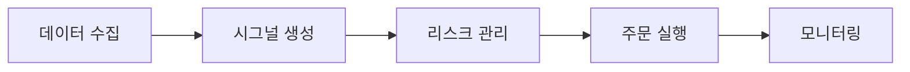

"코드를 짤 줄 아니까 자동매매도 만들 수 있겠지"라는 생각으로 시작했습니다. 맞습니다, 만들 수는 있습니다. 하지만 **돈을 버는 시스템을 만드는 것**은 완전히 다른 문제입니다. 이 글은 퀀트 트레이딩 시스템을 직접 구축하며 겪은 아키텍처 선택, 실전 교훈, 그리고 값비싼 실수들을 정직하게 기록한 글입니다.

---

## 1. 왜 개발자가 자동매매에 끌리는가

### 1-1. 개발자에게 매력적인 이유

```
개발자가 자동매매에 끌리는 이유:
1. 코드로 돈을 버는 가장 직접적인 방법처럼 보임
2. 24시간 자는 동안에도 동작
3. 감정 없는 규칙 기반 실행
4. 백테스트로 검증 가능해 보임
5. 기술 스택을 금융에 적용하는 지적 도전
```

> **비유:** 자동매매는 자판기와 비슷해 보입니다. 돈을 넣으면 원하는 것이 나오는 구조. 하지만 실제로는 자판기 안에 변덕스러운 사람이 앉아서 가끔 주지 않거나, 예상치 못한 것을 주거나, 기계 자체가 고장납니다.

### 1-2. 현실적인 기대치 설정

```
잘못된 기대:
- "백테스트 수익률 30% = 실전 30%"
- "코드 한 번 짜면 영원히 돈 벌기"
- "시장은 예측 가능하다"

현실:
- 백테스트 수익률의 30~50%가 실전에서 나오면 성공
- 지속적인 모니터링과 개선 필요
- 시장은 지속적으로 변화하며 전략을 무력화함
```

---

## 2. 시스템 아키텍처 설계

### 2-1. 전체 구조

자동매매 시스템은 크게 5개 레이어로 구성됩니다.



각 레이어는 독립적으로 테스트 가능해야 하며, 장애가 격리되어야 합니다.

### 2-2. 레이어별 역할

**레이어 1: 데이터 수집 (Data Layer)**

```python
# 데이터 수집 에이전트 구조 예시
class DataAgent:
    """
    책임: 시장 데이터를 수집하고 정규화
    입력: 원시 시장 데이터 (REST API, WebSocket)
    출력: 정규화된 OHLCV 데이터
    """

    def __init__(self, broker_api, event_bus):
        self.api = broker_api
        self.bus = event_bus

    def on_tick(self, raw_tick: dict) -> None:
        normalized = self._normalize(raw_tick)
        self.bus.publish("tick", normalized)

    def _normalize(self, raw: dict) -> dict:
        # 브로커별 포맷 차이를 표준 포맷으로 변환
        return {
            "symbol": raw["stbd_code"],
            "price": float(raw["stck_prpr"]),
            "volume": int(raw["cntg_vol"]),
            "timestamp": raw["stck_cntg_hour"],
        }
```

**레이어 2: 시그널 생성 (Strategy Layer)**

```python
class Strategy:
    """
    책임: 시장 데이터를 분석해 매매 신호 생성
    입력: 정규화된 시장 데이터
    출력: 매수/매도/관망 신호
    """

    def evaluate(self, market_data: dict) -> Signal:
        rsi = self._calc_rsi(market_data["closes"])
        vol_ratio = market_data["volume"] / market_data["avg_volume"]

        if rsi < 30 and vol_ratio > 1.5:
            return Signal.BUY
        elif rsi > 70:
            return Signal.SELL
        return Signal.HOLD
```

**레이어 3: 리스크 관리 (Risk Layer)**

```python
class RiskAgent:
    """
    책임: 포지션 크기와 손실 한도 관리
    입력: 매매 신호 + 현재 포트폴리오 상태
    출력: 승인된 주문 또는 거절
    """

    MAX_POSITION_PCT = 0.05   # 종목당 최대 5%
    DAILY_LOSS_LIMIT = 0.02   # 일일 최대 손실 2%

    def approve(self, signal: Signal, portfolio: Portfolio) -> Order | None:
        if self._is_daily_loss_exceeded(portfolio):
            return None  # 거래 중단

        size = self._calc_position_size(signal, portfolio)
        return Order(signal=signal, size=size)
```

### 2-3. 이벤트 버스 패턴

각 레이어는 이벤트 버스를 통해 느슨하게 결합됩니다.

```python
class EventBus:
    """발행-구독 패턴으로 레이어 간 결합 제거"""

    def __init__(self):
        self._handlers: dict[str, list] = {}

    def subscribe(self, topic: str, handler):
        self._handlers.setdefault(topic, []).append(handler)

    def publish(self, topic: str, data):
        for handler in self._handlers.get(topic, []):
            handler(data)

# 사용 예시
bus = EventBus()
bus.subscribe("tick", strategy.on_tick)
bus.subscribe("signal", risk_agent.on_signal)
bus.subscribe("order", execution.on_order)
```

> **비유:** 이벤트 버스는 회사 방송 시스템과 같습니다. 아나운서(발행자)는 마이크에 대고 말하고, 누가 듣는지 알 필요가 없습니다. 관련 부서(구독자)만 귀를 기울입니다. 이 구조 덕분에 각 레이어를 독립적으로 교체할 수 있습니다.

---

## 3. 데이터 수집 레이어 구축

### 3-1. REST API vs WebSocket 선택

```
데이터 수신 방식 비교:

REST API (폴링):
- 장점: 구현 단순, 재시도 쉬움
- 단점: 지연 발생, 서버 부하
- 적합: 분봉 이상, 배치성 데이터

WebSocket (스트리밍):
- 장점: 실시간, 저지연
- 단점: 연결 관리 복잡, 재연결 로직 필요
- 적합: 틱 데이터, 호가 데이터

결론: 실시간 전략은 WebSocket 필수
```

### 3-2. WebSocket 안정적 연결 관리

WebSocket은 끊어지는 순간 데이터가 유실됩니다. 재연결 로직이 핵심입니다.

```python
import asyncio
import websockets

class ResilientWebSocket:
    """자동 재연결 WebSocket 클라이언트"""

    def __init__(self, url: str, on_message, max_retries: int = 10):
        self.url = url
        self.on_message = on_message
        self.max_retries = max_retries
        self._retry_count = 0
        self._backoff_base = 2  # 지수 백오프

    async def connect(self):
        while self._retry_count < self.max_retries:
            try:
                async with websockets.connect(self.url) as ws:
                    self._retry_count = 0  # 성공 시 리셋
                    await self._listen(ws)
            except Exception as e:
                wait = self._backoff_base ** self._retry_count
                self._retry_count += 1
                await asyncio.sleep(min(wait, 60))  # 최대 60초

    async def _listen(self, ws):
        async for message in ws:
            await self.on_message(message)
```

### 3-3. 데이터 품질 검증

실전에서 발생하는 데이터 오염 문제들입니다.

```python
class DataValidator:
    """수신 데이터의 이상값 탐지"""

    def validate(self, tick: dict) -> bool:
        # 1. 가격이 0이거나 음수
        if tick["price"] <= 0:
            return False

        # 2. 전일 대비 30% 이상 변동 (서킷 브레이커 제외)
        if abs(tick["price"] / self.prev_close - 1) > 0.3:
            return False

        # 3. 타임스탬프 역전
        if tick["timestamp"] < self.last_timestamp:
            return False

        # 4. 거래량이 이전 평균의 50배 이상
        if tick["volume"] > self.avg_volume * 50:
            return False

        return True
```

---

## 4. 백테스팅 방법론

### 4-1. 백테스팅이란

백테스팅은 과거 데이터로 전략을 시뮬레이션하는 과정입니다.

> **비유:** 자동차 충돌 테스트와 같습니다. 실제 도로에 나가기 전에 안전성을 검증합니다. 다만 과거의 도로 상황이 미래와 다를 수 있다는 한계가 있습니다.

### 4-2. 백테스팅 프레임워크 선택

```
백테스팅 라이브러리 비교:

Backtrader:
- 장점: 풍부한 기능, 커뮤니티 활성
- 단점: 느림, 문서 부족
- 적합: 주식, 소규모 데이터

Zipline (Quantopian 유산):
- 장점: 미국 주식 데이터 연동
- 단점: 유지보수 미흡
- 적합: 미국 주식 전략 연구

직접 구현:
- 장점: 완전한 통제, 실제 엔진과 동일
- 단점: 개발 시간 투자 필요
- 적합: 독자적인 전략, 실전 엔진과 코드 공유
```

### 4-3. 직접 구현 백테스팅 엔진

```python
class Backtester:
    """이벤트 기반 백테스팅 엔진"""

    def __init__(self, strategy, data: list[dict], capital: float):
        self.strategy = strategy
        self.data = data
        self.capital = capital
        self.portfolio = Portfolio(capital)
        self.trades: list[Trade] = []

    def run(self) -> BacktestResult:
        for i, bar in enumerate(self.data):
            # 전략에 데이터 공급
            signal = self.strategy.evaluate(self.data[:i+1])

            if signal == Signal.BUY and not self.portfolio.has_position:
                self._execute_buy(bar)
            elif signal == Signal.SELL and self.portfolio.has_position:
                self._execute_sell(bar)

        return BacktestResult(self.trades, self.portfolio)

    def _execute_buy(self, bar: dict):
        # 슬리피지 시뮬레이션 (시가 대비 0.1% 불리하게)
        exec_price = bar["open"] * 1.001
        commission = exec_price * 0.00015  # 거래세 + 수수료
        ...
```

### 4-4. 슬리피지 모델링 — 가장 중요한 현실 반영

```python
class SlippageModel:
    """
    슬리피지: 원하는 가격과 실제 체결 가격의 차이
    백테스트에서 가장 많이 무시하는 요소
    """

    def apply(self, order_price: float, direction: str,
              volume: int, avg_daily_volume: int) -> float:

        # 1. 고정 슬리피지 (스프레드 기반)
        fixed_slip = order_price * 0.001  # 0.1%

        # 2. 시장 충격 슬리피지 (주문 크기 비례)
        participation_rate = volume / avg_daily_volume
        impact_slip = order_price * participation_rate * 0.1

        total_slip = fixed_slip + impact_slip

        if direction == "BUY":
            return order_price + total_slip
        else:
            return order_price - total_slip
```

---

## 5. 주요 함정 — 비싸게 배운 교훈들

### 5-1. 과최적화(Overfitting) — 가장 위험한 함정

> **비유:** 과최적화는 과거 시험 문제만 달달 외워서 시험을 준비하는 것과 같습니다. 이전 시험 점수는 100점이지만, 새 문제가 나오면 무력해집니다.

```
과최적화 징후:
- 백테스트 샤프 비율 > 3.0 (현실적으로 불가능)
- 파라미터가 5개 이상이고 모두 최적화됨
- 학습 데이터에서만 좋은 성과
- 포워드 테스트에서 급격히 성과 하락

과최적화 방지 전략:
1. 워크포워드 테스트 (Walk-Forward)
   → 학습 기간 / 검증 기간 분리 (70/30)

2. 파라미터 수 최소화
   → 파라미터 1개 추가 = 3배 더 많은 데이터 필요

3. 아웃샘플 테스트
   → 절대 건드리지 않는 홀드아웃 데이터셋 유지

4. 민감도 분석
   → 파라미터를 ±10% 변경해도 성과 유사해야 함
```

### 5-2. 룩어헤드 바이어스(Lookahead Bias)

```
룩어헤드 바이어스 예시:

# 잘못된 코드: 미래 데이터 참조
for i, bar in enumerate(data):
    # 당일 종가로 매수 신호 생성 후 당일 시가에 매수
    # 현실에서는 불가능! (종가를 알아야 신호가 나오는데
    # 당일 시가에 매수할 수 없음)
    if data[i]["close"] > data[i]["close"] * 1.02:
        buy_at = data[i]["open"]  # 이미 지나간 시가

# 올바른 코드: 신호는 항상 과거 데이터로
for i, bar in enumerate(data):
    if i < 1:
        continue
    prev_close = data[i-1]["close"]  # 전일 종가
    signal = strategy.evaluate(prev_close)
    if signal == Signal.BUY:
        buy_at = data[i]["open"]     # 다음 날 시가에 매수
```

### 5-3. 생존자 편향(Survivorship Bias)

```
생존자 편향 문제:

현재 상장된 종목만으로 백테스트 →
→ 상장폐지된 종목(나쁜 결과)이 제외됨
→ 백테스트 성과가 과대평가됨

해결책:
- 백테스트 시점에 존재했던 모든 종목 포함
- 상장폐지 데이터 별도 관리
- 지수 구성 종목 변경 이력 반영
```

### 5-4. 수수료/세금 현실화

```
실제 거래 비용 (국내 주식 기준):

매수 시:
- 증권사 수수료: 0.015% (키움 기준)
- 합계: 0.015%

매도 시:
- 증권사 수수료: 0.015%
- 거래세: 0.18% (코스피 기준)
- 합계: 0.195%

왕복 비용: 약 0.21%

월 10회 매매 시 연간 비용: 0.21% × 10 × 12 = 25.2%
→ 전략 수익이 25% 이하면 수수료에 잠식됨
```

---

## 6. 리스크 관리 시스템

### 6-1. 포지션 사이징 — 켈리 공식

```python
def kelly_fraction(win_rate: float, win_loss_ratio: float) -> float:
    """
    켈리 공식: 최적 베팅 비율 계산
    f* = (bp - q) / b
    b: 승리 시 수익률
    p: 승률
    q: 패률 (1-p)
    """
    p = win_rate
    q = 1 - win_rate
    b = win_loss_ratio

    kelly = (b * p - q) / b

    # 실전에서는 절반 켈리 사용 (보수적)
    half_kelly = kelly / 2
    return max(0, min(half_kelly, 0.25))  # 최대 25% 캡

# 예시
win_rate = 0.55   # 승률 55%
win_loss = 1.5    # 평균 수익/손실 비율

fraction = kelly_fraction(win_rate, win_loss)
print(f"최적 베팅 비율: {fraction:.1%}")  # 약 9.2%
```

### 6-2. 다층 리스크 한도

```
리스크 한도 4단계:

1. 개별 거래 손실 한도 (Stop Loss)
   → 진입가 대비 -1.5% 손절

2. 일일 최대 손실 한도
   → 포트폴리오 대비 -2% 초과 시 당일 거래 중단

3. 주간 최대 손실 한도
   → 포트폴리오 대비 -4% 초과 시 전략 재검토

4. 월간 최대 손실 한도
   → 포트폴리오 대비 -8% 초과 시 완전 중단
```

### 6-3. 드로우다운 모니터링

```python
class DrawdownMonitor:
    """최대 손실 추적 및 거래 제한"""

    def __init__(self, daily_limit: float = 0.02):
        self.daily_limit = daily_limit
        self.peak_equity = None
        self.daily_start_equity = None

    def update(self, current_equity: float) -> bool:
        """Returns: True = 거래 계속, False = 거래 중단"""
        if self.daily_start_equity is None:
            self.daily_start_equity = current_equity

        daily_dd = (current_equity - self.daily_start_equity) / self.daily_start_equity

        if daily_dd < -self.daily_limit:
            return False  # 거래 중단

        return True

    def reset_daily(self, equity: float):
        self.daily_start_equity = equity
```

---

## 7. 주문 실행 레이어

### 7-1. 주문 유형 선택

```
주문 유형별 트레이드오프:

시장가 주문 (Market Order):
- 장점: 즉시 체결, 단순
- 단점: 슬리피지 불확실
- 사용: 빠른 청산 필요 시

지정가 주문 (Limit Order):
- 장점: 원하는 가격에 체결
- 단점: 미체결 위험
- 사용: 진입 시 주로 사용

조건부 주문:
- Stop Loss: 특정 가격 이하 시 시장가 매도
- Take Profit: 목표 가격 도달 시 매도
```

### 7-2. 주문 상태 관리

```python
from enum import Enum

class OrderStatus(Enum):
    PENDING = "pending"
    SUBMITTED = "submitted"
    PARTIAL = "partial"
    FILLED = "filled"
    CANCELLED = "cancelled"
    REJECTED = "rejected"

class Order:
    def __init__(self, symbol: str, side: str, qty: int, price: float):
        self.id = self._generate_id()
        self.symbol = symbol
        self.side = side
        self.qty = qty
        self.price = price
        self.filled_qty = 0
        self.status = OrderStatus.PENDING

    def update_fill(self, filled_qty: int, fill_price: float):
        self.filled_qty += filled_qty
        if self.filled_qty >= self.qty:
            self.status = OrderStatus.FILLED
        else:
            self.status = OrderStatus.PARTIAL
```

---

## 8. 모니터링과 알림

### 8-1. 핵심 메트릭

```
실시간 모니터링 지표:

수익성:
- 당일 PnL (실현 + 미실현)
- 누적 PnL
- 샤프 비율 (rolling 30일)

리스크:
- 현재 드로우다운
- 최대 드로우다운
- VaR (Value at Risk)

운영:
- 전략 실행 지연 (latency)
- API 에러율
- 미체결 주문 수
```

### 8-2. 알림 체계

```python
class AlertSystem:
    """Telegram 봇을 통한 실시간 알림"""

    THRESHOLDS = {
        "daily_loss": -0.015,    # -1.5% 경보
        "daily_loss_halt": -0.02, # -2.0% 거래 중단
        "latency_warn": 500,      # 500ms 경보 (ms)
    }

    async def check_and_alert(self, metrics: dict):
        daily_pnl_pct = metrics["daily_pnl"] / metrics["equity"]

        if daily_pnl_pct < self.THRESHOLDS["daily_loss_halt"]:
            await self.send_urgent(
                f"거래 중단: 일일 손실 {daily_pnl_pct:.1%}"
            )
        elif daily_pnl_pct < self.THRESHOLDS["daily_loss"]:
            await self.send_warning(
                f"경고: 일일 손실 {daily_pnl_pct:.1%}"
            )
```

---

## 9. 기술 스택 선택 이유

### 9-1. 언어 선택

```
Python 선택 이유:
- 데이터 분석 생태계 (pandas, numpy, scipy)
- 브로커 API 대부분 Python 예제 제공
- 빠른 프로토타이핑
- 단점: GIL, 느린 속도

속도가 중요한 부분 → Go/Rust 분리:
- 주문 실행 엔진: 낮은 지연이 중요
- 틱 데이터 파싱: 초당 수만 건 처리
- WebSocket 연결 관리: 안정적인 동시성 필요
```

### 9-2. 데이터베이스 선택

```
데이터 저장 전략:

시계열 데이터 (틱, 분봉):
- TimescaleDB (PostgreSQL 확장)
- 이유: SQL 쿼리 가능, 시계열 최적화

주문/체결 데이터:
- PostgreSQL
- 이유: ACID, 감사 추적, 복잡한 쿼리

캐시/상태:
- Redis
- 이유: 낮은 지연, pub/sub 지원
```

### 9-3. 인프라 선택

```
인프라 요구사항:
- 안정적인 네트워크 (증권사 API와 가까울수록 좋음)
- 정전/재부팅 대비 자동 복구
- 장중 업데이트 불가 (무중단 배포)

선택: 클라우드 VM (서울 리전)
- AWS ap-northeast-2 (서울)
- 증권사 서버와 물리적으로 가장 가까움
- Spot Instance 금지 (강제 종료 위험)
- On-Demand + 자동 재시작 설정
```

---

## 10. 실전 운용 교훈

### 10-1. 페이퍼 트레이딩을 충분히 하라

```
페이퍼 트레이딩 → 실전 전환 기준:

최소 기간: 3~4주 (시장 다양한 국면 포함)

점검 항목:
[ ] 백테스트 vs 페이퍼 수익률 차이 < 30%
[ ] 주문 체결률 > 95%
[ ] 시스템 가동률 > 99% (장중 기준)
[ ] 알림 시스템 정상 작동
[ ] 긴급 종료 절차 검증 완료
[ ] 드로우다운 한도 작동 확인
```

### 10-2. 처음 실전은 소액으로

```
실전 전환 단계적 접근:

1단계: 전체 자본의 10%로 시작
2단계: 2주 후 성과 검증, 이상 없으면 20%
3단계: 4주 후 50%
4단계: 8주 후 100%

각 단계에서 포기 기준:
- 단계별 손실이 2% 초과 → 이전 단계로 복귀
- 3번 연속 손실 → 전략 재검토
```

### 10-3. 전략의 수명

```
현실: 대부분의 전략은 6~18개월 후 성과 저하

이유:
- 시장 참여자들이 같은 패턴 발견
- 규제 변경
- 시장 구조 변화 (유동성, 변동성)

대응:
- 전략 성과 월별 모니터링
- 조기 경보: 샤프 비율이 백테스트 대비 50% 하락
- 항상 차기 전략 연구 병행
```

---

## 11. 합법성과 규제

### 11-1. 국내 자동매매 법적 지위

```
현행법 기준 개인 자동매매:

허용:
- 개인 계좌로 자신의 자금 자동매매 → 합법
- 알고리즘 기반 매매 → 합법

주의:
- 타인 자금 운용 → 투자일임업 인가 필요
- 시세조종성 패턴 → 불법
- 내부정보 활용 → 불법

증권사 API 이용약관 확인 필수:
- 일부 증권사: 과도한 API 호출 제한
- 초단타(HFT) 수준은 개인 어려움
```

---

## 12. 마무리 — 솔직한 결론

자동매매 시스템을 구축하고 운용하면서 깨달은 것은, **시스템을 만드는 것보다 좋은 전략을 찾는 것이 훨씬 어렵다**는 사실입니다.

```
어려움 순서:
1위. 시장에서 통하는 엣지(Edge) 발견 → 매우 어려움
2위. 그 엣지가 유지되는지 지속 검증 → 어려움
3위. 리스크를 감내하는 멘탈 관리 → 어려움
4위. 시스템 구현과 운영 → 개발자에게는 상대적으로 쉬움
```

> **비유:** 자동매매 시스템은 좋은 요리사와 훌륭한 주방의 관계와 같습니다. 최첨단 주방(시스템)을 가져도, 레시피(전략)가 없으면 아무것도 나오지 않습니다. 개발자는 주방 만드는 것에 집중하기 쉽지만, 실제로 중요한 건 레시피입니다.

이 글에서 소개한 아키텍처와 코드는 **시스템 구현** 관점에서 검증된 패턴입니다. 하지만 수익을 보장하는 것은 아닙니다. 금융 시장에 참여하기 전에 충분한 학습과 소액 실험으로 자신만의 경험을 쌓으시길 권장합니다.

---

*이 글의 코드는 교육 목적이며, 실제 투자에 그대로 사용하기 전에 충분한 검증이 필요합니다. 투자는 항상 원금 손실 위험이 있습니다.*
