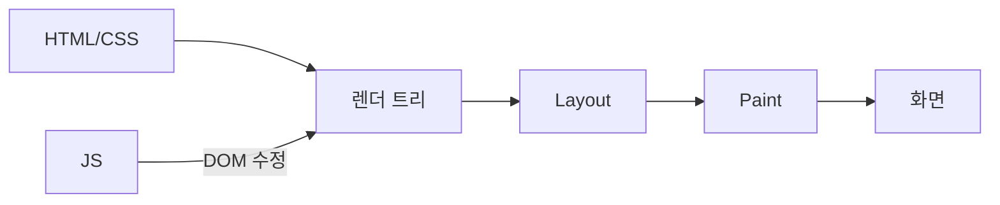
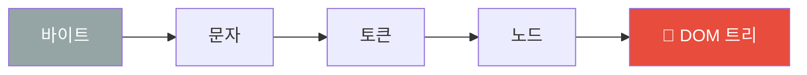
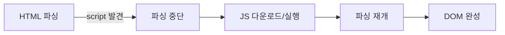
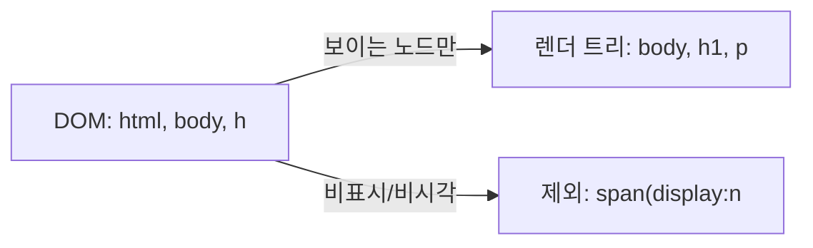
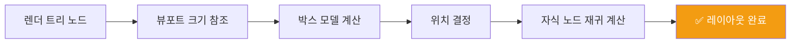
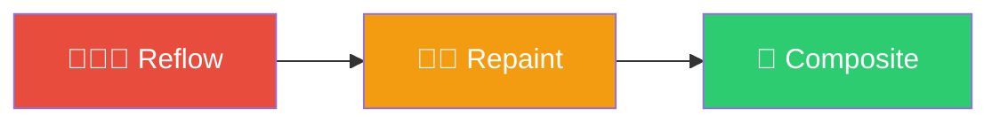
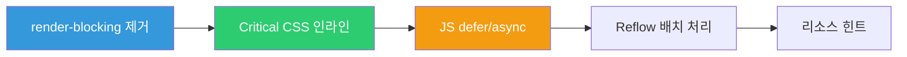
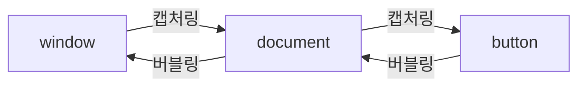

> **한 줄 요약**: 브라우저는 HTML/CSS/JS를 받아 DOM→CSSOM→렌더트리→Layout→Paint→Composite 6단계를 거쳐 화면에 픽셀을 그린다.

## 비유로 이해하기

웹 페이지가 화면에 나타나는 과정을 **건물 신축 공사**에 비유할 수 있습니다.

1. **설계도 받기** (HTML 수신): 건축 설계도(HTML)를 받습니다.
2. **뼈대 세우기** (DOM 생성): 철근과 콘크리트로 구조물(DOM 트리)을 올립니다.
3. **인테리어 설계** (CSSOM 생성): 색상·크기·배치 계획(CSSOM)을 수립합니다.
4. **배치도 작성** (렌더 트리): 실제로 보이는 요소만 선별한 도면(렌더 트리)을 만듭니다.
5. **면적 계산** (Layout/Reflow): 각 방의 면적·위치를 정확히 계산합니다.
6. **페인트 칠하기** (Paint/Repaint): 벽을 칠하고 마감재를 붙입니다.
7. **준공 검사** (Composite): 레이어별 결과를 합쳐 최종 건물(화면)을 완성합니다.

공사 중 벽 하나를 다시 칠하려면 (Repaint) 그 방만 작업하면 됩니다. 하지만 벽을 헐고 새로 세우면 (Reflow) 인접 구조물 전체에 영향이 미칩니다. **이것이 Reflow가 Repaint보다 훨씬 비싼 이유**입니다.

---

## 브라우저 렌더링 전체 파이프라인



---

## DOM (Document Object Model)

### DOM이란?

HTML을 파싱하여 생성하는 **트리 구조의 객체 모델**입니다. 브라우저가 HTML 바이트를 읽어 문자 → 토큰 → 노드 → DOM 트리 순서로 변환합니다.

DOM은 단순한 HTML 파싱 결과물이 아닙니다. 자바스크립트가 `document.getElementById`, `querySelector` 등을 통해 접근·조작할 수 있는 **살아있는 인터페이스**입니다. DOM 노드 하나하나가 객체이며, 이 객체들이 트리 형태로 연결되어 있습니다.

DOM은 **동적으로 변경 가능**합니다. 자바스크립트로 노드를 추가·삭제·수정하면 브라우저는 렌더 트리를 다시 계산합니다. 이것이 React, Vue 같은 프레임워크가 Virtual DOM을 도입한 이유입니다. 실제 DOM 조작을 최소화하기 위해서입니다.

#### HTML → DOM 변환 과정



```html
<!DOCTYPE html>
<html>
  <head>
    <title>My Page</title>
  </head>
  <body>
    <div id="container">
      <h1>Hello</h1>
      <p class="text">World</p>
    </div>
  </body>
</html>
```

```
DOM 트리:
document
└── html
    ├── head
    │   └── title "My Page"
    └── body
        └── div#container
            ├── h1 "Hello"
            └── p.text "World"
```

### HTML 파싱 중 JavaScript 만나면?

자바스크립트는 **파서 블로킹 리소스**입니다. `<script>` 태그를 만나면 HTML 파싱을 멈추고 JS를 다운로드·실행합니다. JS가 DOM을 변경할 수 있기 때문입니다.



```html
<!-- ❌ render-blocking: JS 실행 전까지 파싱 중단 -->
<script src="app.js"></script>

<!-- ✅ async: 다운로드는 병렬, 완료 즉시 실행 (순서 보장 X) -->
<script async src="analytics.js"></script>

<!-- ✅ defer: 다운로드는 병렬, HTML 파싱 완료 후 순서대로 실행 -->
<script defer src="app.js"></script>
```

#### 왜 이게 중요한가?

`<script>` 태그를 `<head>` 에 넣으면 HTML 파싱이 지연되어 흰 화면이 오래 지속됩니다. `defer`를 쓰면 병렬 다운로드 + 파싱 완료 후 실행이라 최적입니다. 외부 통계 스크립트처럼 실행 순서가 중요하지 않다면 `async`를 씁니다.

#### 실무에서 자주 하는 실수

```html
<!-- ❌ head에 defer/async 없이 배치 → 흰 화면 지연 -->
<head>
  <script src="heavy-library.js"></script>
</head>

<!-- ✅ defer 사용 또는 body 끝에 배치 -->
<head>
  <script defer src="app.js"></script>
</head>
```

#### 면접에서 이렇게 답하세요

> "`async`와 `defer`의 차이는 실행 시점입니다. `async`는 다운로드가 완료되는 즉시 실행하므로 DOM 파싱이 끝나기 전에 실행될 수 있고 순서가 보장되지 않습니다. `defer`는 DOM 파싱이 완전히 끝난 뒤 선언 순서대로 실행됩니다. 일반 앱 스크립트엔 `defer`, 독립적인 분석 스크립트엔 `async`가 적합합니다."

---

## CSSOM (CSS Object Model)

CSS를 파싱하여 생성하는 트리입니다. CSSOM은 **렌더 블로킹 리소스**입니다. CSSOM이 완성되기 전까지는 렌더 트리를 만들 수 없고, 렌더링이 시작되지 않습니다.

CSS 파싱은 HTML 파싱과 **병렬로 진행**됩니다. 그러나 렌더 트리 생성은 DOM과 CSSOM이 모두 준비된 후에야 시작됩니다.

```css
body { font-size: 16px; }
div  { color: blue; }
div p { font-size: 14px; }
```

```
CSSOM 트리:
body (font-size: 16px)
└── div (color: blue)
    └── p (font-size: 14px, color: blue [상속됨])
```

### CSS 선택자 성능: 오른쪽에서 왼쪽으로 평가

브라우저는 CSS 선택자를 **오른쪽에서 왼쪽** 방향으로 평가합니다. `body div p span`을 만나면 먼저 페이지의 모든 `span`을 찾고, 그 부모가 `p`인지, 또 그 부모가 `div`인지 역방향으로 탐색합니다.

```css
/* ❌ 느림: 모든 span을 찾아 역방향 체인 탐색 */
body div p span { color: red; }

/* ✅ 빠름: 클래스 직접 지정 */
.highlight-text { color: red; }
```

---

## 렌더 트리 (Render Tree)

DOM + CSSOM을 합쳐 **실제로 화면에 그려질 노드만** 포함한 트리입니다. 비시각적 노드는 제외됩니다.



| 요소/속성 | 렌더 트리 포함 여부 | 공간 차지 |
|---|---|---|
| `display: none` | ❌ 제외 | ❌ 없음 |
| `visibility: hidden` | ✅ 포함 | ✅ 있음 |
| `opacity: 0` | ✅ 포함 | ✅ 있음 |
| `<head>`, `<script>`, `<meta>` | ❌ 제외 | ❌ 없음 |
| HTML 주석 | ❌ 제외 | ❌ 없음 |

### 왜 이게 중요한가?

`display: none`은 DOM에는 있지만 렌더 트리에서 완전히 제거됩니다. 따라서 숨겨진 요소를 조작해도 Reflow가 발생하지 않습니다. 반면 `visibility: hidden`은 렌더 트리에 포함되어 공간을 차지하므로, 이 요소의 크기를 바꾸면 Reflow가 발생합니다.

---

## Reflow (Layout)

렌더 트리의 각 노드가 **화면의 어느 위치에, 얼마만한 크기로** 배치될지 픽셀 단위로 계산하는 단계입니다.

Reflow는 **계산 비용이 가장 큽니다**. 특정 요소의 크기가 바뀌면 부모·형제·자식 노드 모두에 영향을 줄 수 있기 때문입니다. 예를 들어 `<table>` 의 셀 하나가 바뀌면 테이블 전체가 다시 계산됩니다.



### Reflow를 발생시키는 속성

```javascript
// 이 속성들을 읽거나 변경하면 Reflow 발생
// ── 읽기만 해도 브라우저가 최신 레이아웃 값 계산 강제 ──
const w  = element.offsetWidth;     // Reflow 강제!
const h  = element.offsetHeight;    // Reflow 강제!
const cw = element.clientWidth;     // Reflow 강제!
const r  = element.getBoundingClientRect(); // Reflow 강제!

// ── 쓰기 ──
element.style.width    = '100px';   // Reflow
element.style.padding  = '10px';    // Reflow
element.style.margin   = '10px';    // Reflow
element.style.fontSize = '20px';    // Reflow
element.style.display  = 'flex';    // Reflow
```

### 실무에서 자주 하는 실수: Layout Thrashing

```javascript
// ❌ 나쁜 예: 읽기-쓰기 교차 → 매 반복마다 Reflow
const el1 = document.getElementById('el1');
const el2 = document.getElementById('el2');

el1.style.width = el2.offsetWidth + 'px';  // 읽기 → Reflow, 쓰기
el2.style.width = el1.offsetWidth + 'px';  // 읽기 → Reflow, 쓰기
// 총 2번 이상 Reflow 발생

// ✅ 좋은 예: 읽기 먼저, 쓰기 나중에
const width1 = el1.offsetWidth;  // 읽기 (Reflow 1번)
const width2 = el2.offsetWidth;  // 읽기 (캐시 사용)
el1.style.width = width2 + 'px'; // 쓰기
el2.style.width = width1 + 'px'; // 쓰기
// 총 1번 Reflow

// ✅ 더 나은 예: requestAnimationFrame으로 다음 프레임에 일괄 처리
requestAnimationFrame(() => {
    el1.style.width = width2 + 'px';
    el2.style.width = width1 + 'px';
});
```

---

## Repaint (Paint)

레이아웃 변경 없이 **색상, 배경, 테두리, 그림자** 등 시각적 스타일만 변경할 때 발생합니다.

Reflow보다 비용이 낮지만, Reflow가 일어나면 항상 Repaint도 따라옵니다.

```javascript
// Repaint만 발생 (Reflow 없음)
element.style.color           = 'red';
element.style.backgroundColor = 'blue';
element.style.borderColor     = 'green';
element.style.boxShadow       = '0 0 5px black';
element.style.visibility      = 'hidden'; // 레이아웃 그대로
```

### 성능 비용 순서



---

## GPU 합성 (Composite)

특정 CSS 속성은 CPU가 아닌 **GPU에서 처리**됩니다. Reflow도 Repaint도 없이 가장 빠릅니다.

```css
/* ✅ GPU 가속 속성 (Composite Only) */
transform: translate(10px, 10px);  /* 이동 - GPU */
transform: rotate(45deg);          /* 회전 - GPU */
transform: scale(1.5);             /* 확대 - GPU */
opacity:   0.5;                    /* 투명도 - GPU */

/* GPU 레이어 강제 생성 (꼭 필요할 때만) */
will-change: transform;
transform: translateZ(0);          /* 핵 (hack), 남용 금지 */
```

### 애니메이션 최적화 전/후

```css
/* ❌ 나쁜 예: left/top 변경 → Reflow 발생 */
.move-bad {
    left: 100px;       /* Reflow! */
    transition: left 0.3s;
}

/* ✅ 좋은 예: transform 사용 → GPU Composite만 */
.move-good {
    transform: translateX(100px);  /* GPU만 사용 */
    transition: transform 0.3s;
}
```

---

## Critical Rendering Path 최적화

첫 화면 렌더링을 빠르게 하는 전략입니다. 핵심은 **렌더 블로킹 리소스를 최소화**하는 것입니다.



### 1. render-blocking 리소스 최소화

```html
<!-- ✅ CSS: media 쿼리로 불필요한 블로킹 제거 -->
<link rel="stylesheet" href="main.css">
<link rel="stylesheet" href="print.css" media="print">
<link rel="stylesheet" href="mobile.css" media="(max-width: 768px)">

<!-- ✅ JS: defer/async 사용 -->
<script defer src="app.js"></script>
<script async src="analytics.js"></script>
```

### 2. Critical CSS 인라인화 (Above-the-fold)

첫 화면에 필요한 CSS만 `<style>` 태그로 인라인 삽입하고, 나머지는 비동기 로드합니다.

```html
<head>
    <!-- ✅ 첫 화면에 필요한 핵심 CSS만 인라인 -->
    <style>
        .hero { background: #333; color: white; padding: 20px; }
        .nav  { display: flex; justify-content: space-between; }
    </style>
    <!-- ✅ 나머지 CSS는 비동기 로드 (preload → rel 변경) -->
    <link rel="preload" href="full.css" as="style" onload="this.rel='stylesheet'">
</head>
```

### 3. Reflow 배치 처리

```javascript
// ❌ 나쁜 예: 루프 안에서 읽기-쓰기 교차 → N번 Reflow
const items = document.querySelectorAll('.item');
for (const el of items) {
    const w = el.offsetWidth;    // 읽기 → Reflow 강제
    el.style.width = w * 2 + 'px'; // 쓰기 → 레이아웃 무효화
}

// ✅ 좋은 예: 읽기 먼저, 쓰기 나중에 → 1번 Reflow
const widths = [...items].map(el => el.offsetWidth); // 읽기 일괄
items.forEach((el, i) => { el.style.width = widths[i] * 2 + 'px'; }); // 쓰기 일괄
```

### 4. DocumentFragment로 일괄 DOM 조작

```javascript
// ❌ 나쁜 예: 루프마다 DOM 수정 → 반복 Reflow
const list = document.getElementById('list');
for (let i = 0; i < 1000; i++) {
    const li = document.createElement('li');
    li.textContent = `Item ${i}`;
    list.appendChild(li);  // 매번 Reflow!
}

// ✅ 좋은 예: Fragment에 모아서 한 번에 추가 → 1번 Reflow
const fragment = document.createDocumentFragment();
for (let i = 0; i < 1000; i++) {
    const li = document.createElement('li');
    li.textContent = `Item ${i}`;
    fragment.appendChild(li);
}
list.appendChild(fragment);  // Reflow 1번만
```

---

## 이벤트 버블링과 캡처링

이벤트가 DOM 트리를 통해 전파되는 방식입니다.



```javascript
// 버블링 (기본): 자식 → 부모 방향
document.getElementById('parent').addEventListener('click', (e) => {
    console.log('부모 클릭');
});
document.getElementById('child').addEventListener('click', (e) => {
    console.log('자식 클릭');
    e.stopPropagation();  // 버블링 중단
});

// 캡처링: 부모 → 자식 방향 (세 번째 인자 true)
document.getElementById('parent').addEventListener('click', (e) => {
    console.log('부모 (캡처링)');
}, true);

// ✅ 이벤트 위임 (Event Delegation)
// 자식 요소마다 리스너 추가 대신 부모에 하나만 추가 → 메모리 절약
document.getElementById('todoList').addEventListener('click', (e) => {
    if (e.target.classList.contains('delete-btn')) {
        e.target.closest('.todo-item').remove();
    }
});
```

### 왜 이벤트 위임이 중요한가?

리스트 항목이 100개라면 이벤트 리스너도 100개가 필요합니다. 이벤트 위임을 사용하면 부모에 단 1개만 등록하면 됩니다. 동적으로 추가되는 요소에도 자동 적용됩니다.

---


## 극한 시나리오

**문제**: 10,000개 DOM 노드 → 렌더 트리 거대화 → 스크롤 시 Reflow 폭발 → 프레임 드랍

**해결: 가상 스크롤 (Virtual Scrolling)**

보이는 영역의 항목만 DOM에 렌더링하고, 스크롤 위치에 따라 동적으로 교체합니다.

```javascript
class VirtualList {
    constructor(container, items, itemHeight = 50) {
        this.container   = container;
        this.items       = items;
        this.itemHeight  = itemHeight;
        this.visibleCount = Math.ceil(container.clientHeight / itemHeight) + 2;

        this.render();
        container.addEventListener('scroll', () => this.render());
    }

    render() {
        const scrollTop  = this.container.scrollTop;
        const startIndex = Math.floor(scrollTop / this.itemHeight);
        const endIndex   = Math.min(startIndex + this.visibleCount, this.items.length);

        // 전체 높이 유지 (스크롤바 위치 정확하게)
        this.container.style.paddingTop    = `${startIndex * this.itemHeight}px`;
        this.container.style.paddingBottom =
            `${(this.items.length - endIndex) * this.itemHeight}px`;

        // 보이는 항목만 렌더링
        this.container.innerHTML = this.items
            .slice(startIndex, endIndex)
            .map(item => `<div style="height:${this.itemHeight}px">${item}</div>`)
            .join('');
    }
}
// DOM 노드 수: 10,000개 → 20여 개로 감소 → 60fps 달성 가능
```

---
## 핵심 포인트 정리

| 단계 | 역할 | 트리거 |
|------|------|--------|
| DOM 생성 | HTML 파싱 → 노드 트리 | HTML 수신 |
| CSSOM 생성 | CSS 파싱 → 스타일 트리 | CSS 수신 |
| 렌더 트리 | DOM + CSSOM → 보이는 노드 | 둘 다 준비 후 |
| Layout (Reflow) | 위치·크기 계산 | 레이아웃 속성 변경 |
| Paint (Repaint) | 픽셀 채우기 | 색상·배경 변경 |
| Composite | GPU 레이어 합성 | transform·opacity 변경 |

- **Reflow > Repaint > Composite** 순서로 성능 비용이 큽니다.
- `transform`과 `opacity`는 GPU로 처리되어 Reflow/Repaint 없이 부드럽게 동작합니다.
- `will-change: transform`은 레이어를 미리 생성하지만 남용하면 VRAM 낭비입니다.
- 읽기(`offsetWidth`)와 쓰기(`style.width`) 를 교차하면 Layout Thrashing이 발생합니다.
- `DocumentFragment`로 DOM 조작을 일괄 처리하면 Reflow 횟수를 줄일 수 있습니다.

---

## 왜 이 개념인가? (vs 프레임워크가 다 해주는데)

React·Vue 같은 프레임워크가 Virtual DOM으로 실제 DOM 조작을 최소화해 준다. 그러나 프레임워크 위에서도 Reflow/Repaint는 여전히 발생한다. `offsetWidth` 읽기, `style.width` 쓰기를 교차하거나, 대규모 목록을 가상화 없이 렌더링하면 프레임워크와 무관하게 성능이 무너진다. 브라우저 렌더링 원리를 이해해야 **프레임워크 안에서도 올바른 선택**을 할 수 있다.

| 상황 | 원인 | 해결 |
|------|------|------|
| 스크롤 시 버벅임 | Reflow 반복 | transform 사용, 가상 스크롤 |
| 애니메이션 끊김 | left/top 변경 → Reflow | transform으로 교체 |
| 빈 화면 오래 지속 | JS가 파싱 블로킹 | defer/async, body 끝 배치 |
| 레이아웃 이동(CLS) | 이미지 크기 미지정 | width/height 명시 |

---

## 추가 실무 실수

**실수 1: 루프 안에서 offsetWidth 읽기-쓰기 교차 (Layout Thrashing)**

```javascript
// ❌ 매 반복마다 Reflow — 100개 항목이면 200번 Reflow
items.forEach(el => {
    const w = el.offsetWidth;       // 읽기 → Reflow 강제
    el.style.width = w * 2 + 'px'; // 쓰기 → 레이아웃 무효화
});

// ✅ 읽기 일괄 → 쓰기 일괄 → Reflow 1번
const widths = [...items].map(el => el.offsetWidth);
items.forEach((el, i) => { el.style.width = widths[i] * 2 + 'px'; });
```

**실수 2: CSS 애니메이션에 left/top 대신 transform 미사용**

```css
/* ❌ Reflow 발생 → 버벅임 */
.moving { transition: left 0.3s; left: 100px; }

/* ✅ GPU Composite만 — 60fps 달성 가능 */
.moving { transition: transform 0.3s; transform: translateX(100px); }
```

**실수 3: will-change 남용으로 VRAM 낭비**

```css
/* ❌ 모든 요소에 will-change 적용 → GPU 레이어 과다 생성, 메모리 폭증 */
* { will-change: transform; }

/* ✅ 실제로 애니메이션이 임박한 요소에만 JS로 동적 적용 */
el.addEventListener('mouseenter', () => { el.style.willChange = 'transform'; });
el.addEventListener('animationend', () => { el.style.willChange = 'auto'; });
```

---

## 면접 포인트

<details>
<summary>펼쳐보기</summary>


**Q1. Reflow와 Repaint의 차이, 어떤 상황에 각각 발생하는가?**

Reflow(Layout)는 요소의 위치·크기가 바뀌어 레이아웃 전체를 재계산하는 단계다. `width`, `height`, `margin`, `padding`, `font-size` 변경과 `offsetWidth` 같은 레이아웃 값 읽기가 트리거한다. Repaint는 레이아웃 변경 없이 색상·배경·그림자만 바뀔 때 픽셀만 다시 칠한다. Reflow가 일어나면 항상 Repaint도 따라오지만, Repaint만 단독으로 발생하는 경우는 Reflow보다 비용이 낮다.

**Q2. async와 defer의 차이를 설명하라.**

`async`는 스크립트 다운로드를 병렬로 진행하고 완료되는 즉시 파싱을 중단하고 실행한다. 순서가 보장되지 않아 독립적인 분석 스크립트에 적합하다. `defer`는 다운로드를 병렬로 진행하되 HTML 파싱이 완전히 끝난 후 선언 순서대로 실행한다. 일반 앱 스크립트에 권장된다.

**Q3. transform이 left/top보다 빠른 이유는?**

`left`/`top` 변경은 Reflow → Repaint → Composite 전 단계를 유발한다. `transform`은 요소를 별도 GPU 레이어로 승격시켜 Composite 단계만 실행한다. CPU 대신 GPU가 처리하므로 메인 스레드가 블로킹되지 않아 60fps를 유지할 수 있다.

**Q4. 이벤트 버블링과 이벤트 위임을 연결해 설명하라.**

이벤트는 타깃에서 발생한 뒤 부모로 버블링(전파)된다. 이벤트 위임은 자식 요소마다 리스너를 등록하는 대신 부모에 하나만 등록하고, `e.target`으로 실제 클릭된 요소를 구별하는 패턴이다. 리스너 수가 줄어 메모리가 절약되고, 동적으로 추가된 자식 요소에도 자동 적용된다.

**Q5. Critical Rendering Path 최적화 핵심 전략 3가지는?**

첫째, render-blocking JS에 `defer`를 적용해 HTML 파싱 중단을 방지한다. 둘째, 첫 화면에 필요한 Critical CSS를 `<style>` 태그로 인라인화하고 나머지는 비동기 로드한다. 셋째, 읽기(`offsetWidth`)를 쓰기(`style.width`) 앞에 일괄 배치해 Layout Thrashing을 방지한다.

</details>
