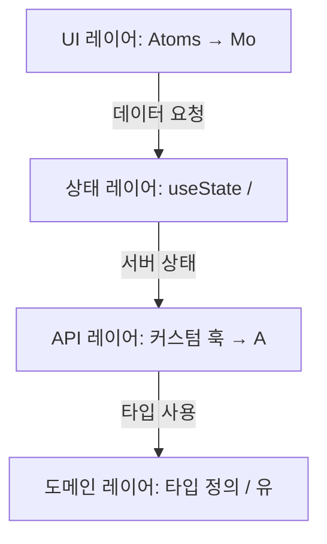
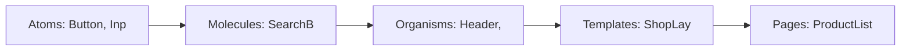
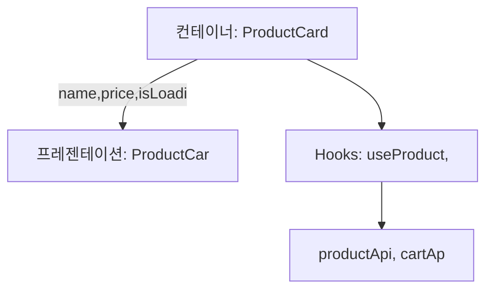
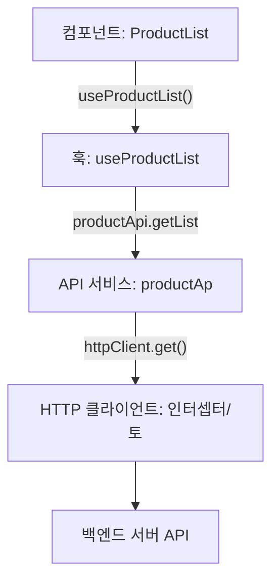
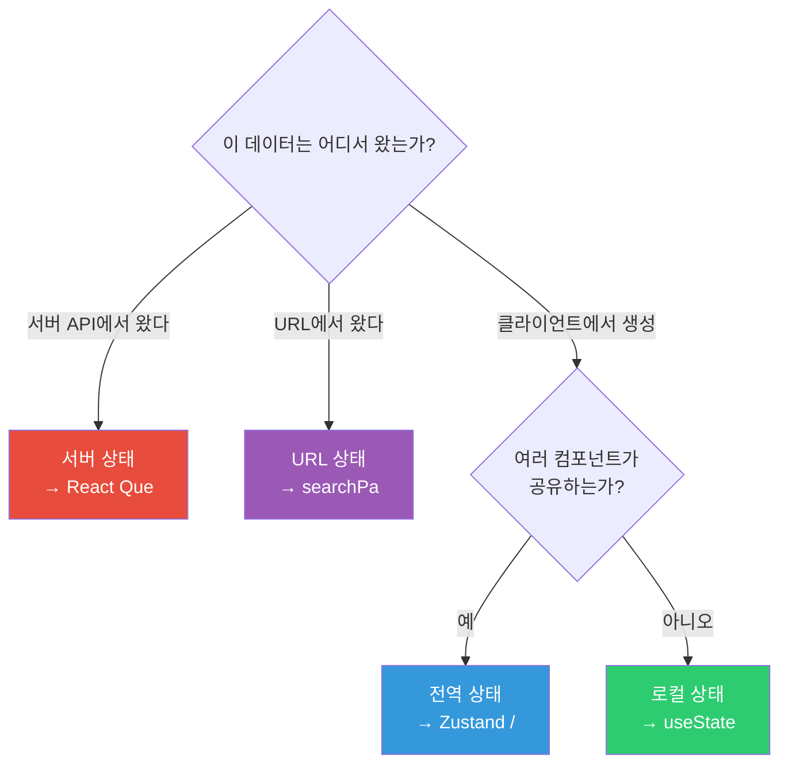
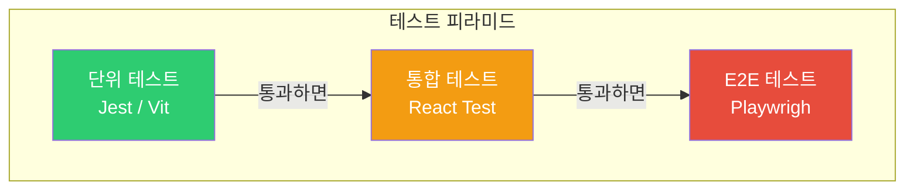
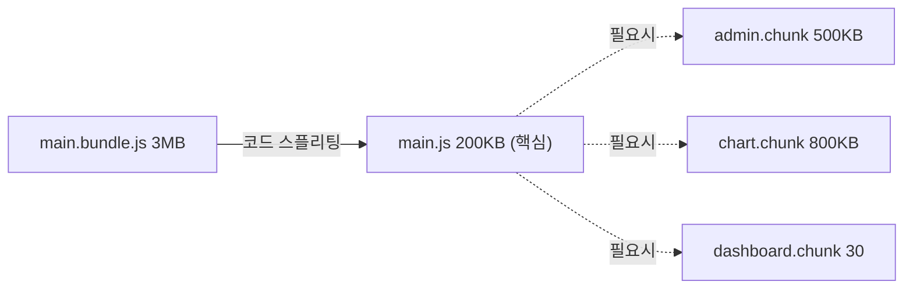
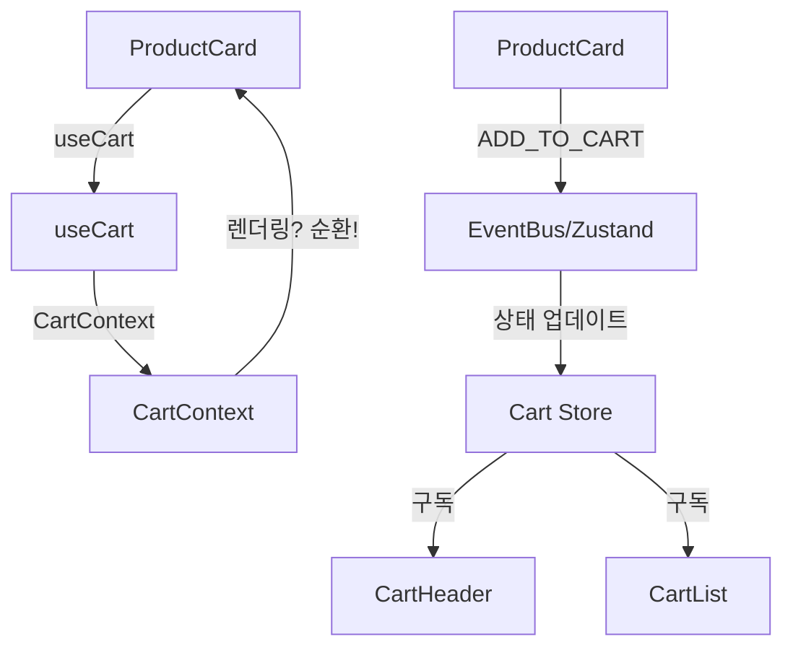

> **한 줄 요약**: 프론트엔드 아키텍처는 컴포넌트·상태·API·비즈니스 로직을 명확한 경계로 분리해, 변경이 쉽고 테스트 가능한 코드 구조를 만드는 설계 원칙입니다.

---

## 비유로 이해하기

도시 설계를 생각해보세요. 뉴욕 맨해튼처럼 잘 계획된 도시는 주거지역·상업지역·공업지역이 구역별로 분리되어 있고, 격자형 도로망(인터페이스)으로 각 구역이 연결됩니다. 상업지역의 건물이 새로 지어져도 주거지역의 삶에는 영향을 주지 않습니다. 지하철, 버스, 도로라는 명확한 이동 수단(데이터 흐름)이 있어 누구나 어디서든 목적지에 갈 수 있습니다.

반면 계획 없이 성장한 도시는 골목마다 가게와 집이 뒤섞이고, 길을 넓히려면 이미 지어진 건물을 허물어야 합니다. 이것이 스파게티 코드가 된 프론트엔드 프로젝트의 모습입니다. 컴포넌트 안에 API 호출이 있고, 비즈니스 로직이 UI 코드와 뒤섞이며, 전역 상태에 모든 것이 담겨 있습니다.

좋은 프론트엔드 아키텍처는 **관심사 분리(Separation of Concerns)**를 통해 각 레이어가 자신의 역할만 담당하게 만듭니다. UI는 UI만, 상태는 상태만, API는 API만 책임집니다. 이 경계를 잘 지키면 한 부분을 수정할 때 다른 부분이 깨지지 않습니다.

---

## 1. 전체 아키텍처 레이어



이 다이어그램에서 핵심은 **의존성 방향**입니다. 위에서 아래로만 의존합니다. UI는 상태에 의존하고, 상태는 API에 의존하고, API는 도메인 타입에 의존합니다. 역방향 의존(API가 UI를 알거나 유틸이 상태를 직접 수정)은 금지입니다.

#### 왜 이게 중요한가?

레이어 분리가 없으면 "버튼 색 바꾸려다 API 깨지는" 상황이 발생합니다. 각 레이어가 독립적으로 테스트 가능하고, 독립적으로 교체 가능해야 합니다. 예를 들어 axios에서 fetch로 변경하려면 HTTP 클라이언트 레이어만 수정하면 됩니다. 컴포넌트는 전혀 알 필요가 없습니다.

---

## 2. 컴포넌트 설계 원칙

### 아토믹 디자인 (Atomic Design)



아토믹 디자인의 핵심은 **조합 가능성**입니다. 원자는 가장 작은 단위로 독립적으로 존재할 수 있어야 합니다. 분자는 원자의 조합이지만, 그 자체로도 의미 있는 기능을 수행합니다. 유기체는 실제 UI 섹션에 해당하며 데이터를 받아 표시합니다.

### 컨테이너-프레젠테이션 패턴



```tsx
// ✅ 프레젠테이션 컴포넌트: UI만 담당, 순수함
function ProductCardView({
    name,
    price,
    imageUrl,
    onAddToCart,
    isLoading
}: ProductCardViewProps) {
    return (
        <div className="product-card">
            
            <h3>{name}</h3>
            <p>₩{price.toLocaleString()}</p>
            <button onClick={onAddToCart} disabled={isLoading}>
                {isLoading ? '처리 중...' : '장바구니 담기'}
            </button>
        </div>
    );
}

// ✅ 컨테이너 컴포넌트: 데이터와 로직 담당
function ProductCard({ productId }: { productId: string }) {
    const { data: product } = useProduct(productId);
    const { mutate: addToCart, isLoading } = useAddToCart();

    return (
        <ProductCardView
            name={product.name}
            price={product.price}
            imageUrl={product.imageUrl}
            onAddToCart={() => addToCart(productId)}
            isLoading={isLoading}
        />
    );
}
```

#### 왜 이게 중요한가?

프레젠테이션 컴포넌트를 순수하게 유지하면 **Storybook에서 독립적으로 개발**할 수 있고, **단위 테스트가 간단해집니다**. API 없이 props만 주입하면 어떤 UI 상태든 재현할 수 있습니다. 로딩 상태, 에러 상태, 빈 상태를 스토리로 정의하면 QA와 디자이너도 확인할 수 있습니다.

#### 실무에서 자주 하는 실수

```tsx
// ❌ 잘못된 예: 프레젠테이션 컴포넌트 안에서 API 호출
function ProductCard({ productId }) {
    const [product, setProduct] = useState(null);

    useEffect(() => {
        fetch(`/api/products/${productId}`)
            .then(r => r.json())
            .then(setProduct);
    }, [productId]);
    // UI와 데이터 로직이 섞임 → 테스트하기 어렵고 재사용 불가
    return <div>{product?.name}</div>;
}

// ✅ 올바른 예: 컨테이너가 데이터를, 프레젠테이션이 UI를 담당
function ProductCardContainer({ productId }) {
    const { data: product, isLoading } = useProduct(productId);
    return <ProductCardView product={product} isLoading={isLoading} />;
}

function ProductCardView({ product, isLoading }) {
    if (isLoading) return <Skeleton />;
    return <div>{product?.name}</div>;
}
```

#### 면접에서 이렇게 답하세요

> "컨테이너-프레젠테이션 패턴은 컴포넌트의 관심사를 분리합니다. 프레젠테이션 컴포넌트는 props를 받아 UI를 렌더링하는 것만 담당하고, 컨테이너 컴포넌트는 데이터 페칭과 상태 관리를 담당합니다. 이 분리로 인해 UI 컴포넌트는 API 없이도 독립적으로 테스트·개발 가능하고, 컨테이너만 교체해도 다른 데이터 소스에서 같은 UI를 사용할 수 있습니다."

---

## 3. 디렉토리 구조

```
src/
├── components/              # 공통 재사용 컴포넌트
│   ├── atoms/
│   │   ├── Button/
│   │   │   ├── Button.tsx
│   │   │   ├── Button.stories.tsx  # Storybook
│   │   │   ├── Button.test.tsx
│   │   │   └── index.ts
│   │   ├── Input/
│   │   └── Badge/
│   ├── molecules/
│   │   ├── SearchBar/
│   │   └── FormField/
│   ├── organisms/
│   │   ├── Header/
│   │   └── ProductCard/
│   └── templates/
│       └── MainLayout/
│
├── features/                # 기능별 모듈 (권장 구조)
│   ├── auth/
│   │   ├── components/      # auth 전용 컴포넌트
│   │   ├── hooks/           # useAuth, useSession
│   │   ├── services/        # authApi
│   │   ├── store/           # authSlice
│   │   └── index.ts         # 공개 API만 export
│   ├── products/
│   └── orders/
│
├── pages/                   # 라우트 컴포넌트 (또는 app/)
│   ├── HomePage.tsx
│   └── ProductPage.tsx
│
├── shared/                  # 전체 공유 유틸
│   ├── api/
│   │   └── httpClient.ts    # axios 인스턴스
│   ├── hooks/
│   │   ├── useDebounce.ts
│   │   └── useLocalStorage.ts
│   ├── utils/
│   │   ├── formatDate.ts
│   │   └── validators.ts
│   └── types/
│       └── common.types.ts
│
├── store/                   # 전역 상태
│   └── index.ts
└── App.tsx
```

feature 기반 구조의 핵심은 **`features/auth/index.ts`가 공개 API 역할**을 한다는 것입니다. 외부에서는 이 파일을 통해서만 auth 모듈에 접근합니다. 내부 구현 파일(`authSlice.ts`, `authApi.ts`)을 직접 import하면 안 됩니다. 이렇게 하면 내부 리팩토링을 해도 외부 코드가 깨지지 않습니다.

---

## 4. API 레이어 분리



```typescript
// ① shared/api/httpClient.ts - HTTP 클라이언트 (기반 설정)
import axios from 'axios';

const apiClient = axios.create({
    baseURL: process.env.NEXT_PUBLIC_API_URL,
    timeout: 10000,
    headers: { 'Content-Type': 'application/json' }
});

// 요청 인터셉터: 모든 요청에 토큰 자동 추가
apiClient.interceptors.request.use((config) => {
    const token = tokenStorage.get();
    if (token) config.headers.Authorization = `Bearer ${token}`;
    return config;
});

// 응답 인터셉터: 401이면 토큰 갱신 후 재시도
apiClient.interceptors.response.use(
    response => response,
    async (error) => {
        if (error.response?.status === 401) {
            await refreshToken();
            return apiClient(error.config);  // 원래 요청 재시도
        }
        return Promise.reject(error);
    }
);

export default apiClient;

// ② features/products/services/productApi.ts - 도메인별 API 서비스
import apiClient from '@/shared/api/httpClient';
import type { Product, CreateProductDto } from '../types';

export const productApi = {
    getList: (params: { category?: string; page?: number }) =>
        apiClient.get<Product[]>('/products', { params }).then(r => r.data),

    getById: (id: string) =>
        apiClient.get<Product>(`/products/${id}`).then(r => r.data),

    create: (data: CreateProductDto) =>
        apiClient.post<Product>('/products', data).then(r => r.data),

    update: (id: string, data: Partial<CreateProductDto>) =>
        apiClient.patch<Product>(`/products/${id}`, data).then(r => r.data),

    delete: (id: string) =>
        apiClient.delete(`/products/${id}`),
};

// ③ features/products/hooks/useProducts.ts - React Query 통합 훅
import { useQuery, useMutation, useQueryClient } from '@tanstack/react-query';
import { productApi } from '../services/productApi';

export function useProductList(params: { category?: string; page?: number }) {
    return useQuery({
        queryKey: ['products', params],  // params가 바뀌면 자동으로 재조회
        queryFn: () => productApi.getList(params),
        staleTime: 5 * 60 * 1000,       // 5분간 캐시 신선 유지
    });
}

export function useCreateProduct() {
    const queryClient = useQueryClient();
    return useMutation({
        mutationFn: productApi.create,
        onSuccess: () => {
            // 생성 성공 시 목록 캐시 무효화 → 자동 재조회
            queryClient.invalidateQueries({ queryKey: ['products'] });
        },
    });
}
```

---

## 5. 상태 관리 전략

어떤 상태를 어디서 관리할지 결정하는 것이 아키텍처의 핵심입니다.



```typescript
// URL 상태 활용 (필터/검색어/페이지 번호)
// URL: /products?category=electronics&sort=price&page=2

// app/products/page.tsx (Next.js App Router)
export default function ProductsPage({
    searchParams
}: {
    searchParams: { category?: string; sort?: string; page?: string }
}) {
    const params = {
        category: searchParams.category ?? 'all',
        sort: searchParams.sort ?? 'latest',
        page: Number(searchParams.page) ?? 1,
    };
    return <ProductList params={params} />;
}

// ✅ 상태를 URL에 저장하면:
// - 브라우저 뒤로가기/앞으로가기로 필터 이동 가능
// - URL 복사해서 공유 가능 (북마크)
// - 새로고침해도 상태 유지
// - 서버에서 SEO 메타데이터 생성 가능

// ❌ 잘못된 예: 필터를 전역 상태에 저장
// → 새로고침하면 초기화, URL 공유 불가, 뒤로가기 동작 이상
```

#### 상태 관리 라이브러리 비교

| 항목 | useState | Context | Zustand | Redux Toolkit | React Query |
|------|----------|---------|---------|---------------|-------------|
| 용도 | 로컬 UI 상태 | 소규모 전역 | 중소규모 전역 | 대규모 전역 | 서버 상태 |
| 보일러플레이트 | 없음 | 적음 | 매우 적음 | 많음 | 적음 |
| DevTools | X | X | O | O (강력) | O |
| 러닝 커브 | 낮음 | 낮음 | 낮음 | 높음 | 중간 |
| 추천 프로젝트 규모 | 모든 규모 | 소규모 | 소~중 | 중~대 | API 있는 모든 규모 |

---

## 6. 테스트 전략

### 테스트 피라미드



```tsx
// ① 단위 테스트: 컴포넌트 렌더링 및 상호작용
// components/Button/Button.test.tsx
import { render, screen } from '@testing-library/react';
import userEvent from '@testing-library/user-event';
import { Button } from './Button';

describe('Button', () => {
    it('텍스트가 렌더링된다', () => {
        render(<Button>Click me</Button>);
        expect(screen.getByRole('button', { name: 'Click me' })).toBeInTheDocument();
    });

    it('클릭 시 onClick이 호출된다', async () => {
        const handleClick = jest.fn();
        render(<Button onClick={handleClick}>Click</Button>);
        await userEvent.click(screen.getByRole('button'));
        expect(handleClick).toHaveBeenCalledTimes(1);
    });

    it('disabled 시 클릭이 동작하지 않는다', async () => {
        const handleClick = jest.fn();
        render(<Button onClick={handleClick} disabled>Click</Button>);
        await userEvent.click(screen.getByRole('button'));
        expect(handleClick).not.toHaveBeenCalled();
    });
});

// ② 통합 테스트: API 모킹(MSW)과 함께 전체 기능 검증
// __tests__/ProductDetail.test.tsx
import { setupServer } from 'msw/node';
import { http, HttpResponse } from 'msw';

const server = setupServer(
    http.get('/api/products/:id', ({ params }) => {
        return HttpResponse.json({
            id: params.id,
            name: '테스트 상품',
            price: 10000,
            stock: 5,
        });
    })
);

beforeAll(() => server.listen());
afterEach(() => server.resetHandlers());
afterAll(() => server.close());

test('상품 정보를 표시한다', async () => {
    render(<ProductDetail productId="1" />);
    // 로딩 중
    expect(screen.getByRole('progressbar')).toBeInTheDocument();
    // 로딩 완료
    await waitFor(() => {
        expect(screen.getByText('테스트 상품')).toBeInTheDocument();
        expect(screen.getByText('₩10,000')).toBeInTheDocument();
    });
});
```

---

## 7. 코드 스플리팅



```tsx
import dynamic from 'next/dynamic';
import { Suspense, lazy } from 'react';

// Next.js dynamic import - SSR 비활성화 (브라우저 전용 라이브러리)
const HeavyChart = dynamic(() => import('@/components/HeavyChart'), {
    loading: () => <ChartSkeleton />,
    ssr: false
});

// React lazy - App Router 밖에서 사용
const AdminPanel = lazy(() => import('./AdminPanel'));

function Dashboard({ isAdmin }) {
    return (
        <div>
            {/* 항상 필요한 컴포넌트 → 번들에 포함 */}
            <StatsSummary />

            {/* 차트는 뷰포트에 들어올 때 로드 */}
            <HeavyChart data={data} />

            {/* 관리자만 보는 패널 → 조건부 로드 */}
            {isAdmin && (
                <Suspense fallback={<Skeleton />}>
                    <AdminPanel />
                </Suspense>
            )}
        </div>
    );
}
```

---

## 8. 성능 최적화 체크리스트

### Core Web Vitals 목표

| 지표 | 의미 | 좋음 | 개선 필요 | 나쁨 |
|------|------|------|----------|------|
| LCP | 가장 큰 콘텐츠 로드 시간 | < 2.5초 | 2.5~4초 | > 4초 |
| FID/INP | 첫 입력 반응 시간 | < 100ms | 100~300ms | > 300ms |
| CLS | 레이아웃 이동 누적 점수 | < 0.1 | 0.1~0.25 | > 0.25 |


```tsx
// LCP 개선: Hero 이미지에 priority 설정 → preload link 자동 생성
<Image src="/hero.jpg" priority alt="히어로" width={1200} height={600} />

// CLS 개선: 이미지 크기 명시 → 로드 전 공간 예약
// ❌ 크기 없으면 이미지 로드 후 레이아웃 이동 발생

// ✅ 명시적 크기로 공간 예약
<Image src="/product.jpg" width={400} height={300} alt="상품" />

// CLS 개선: 스켈레톤 UI로 레이아웃 공간 예약
function ProductCardSkeleton() {
    return (
        <div className="product-card" style={{ minHeight: '300px' }}>
            <div className="skeleton" style={{ height: '200px' }} />
            <div className="skeleton" style={{ height: '24px', width: '70%' }} />
        </div>
    );
}

// INP 개선: 무거운 연산은 Web Worker로 분리
const worker = new Worker(new URL('./workers/calculation.js', import.meta.url));
worker.postMessage({ data: largeDataset });
worker.onmessage = (e) => setResult(e.data);
```


---


## 극한 시나리오



```typescript
// ✅ 순환 의존성 해결: 이벤트 기반 단방향 흐름
// store/cartStore.ts - 모든 컴포넌트가 의존하는 단일 소스
import { create } from 'zustand';

interface CartStore {
    items: CartItem[];
    addItem: (product: Product) => void;
    removeItem: (productId: string) => void;
    total: () => number;
}

export const useCartStore = create<CartStore>((set, get) => ({
    items: [],
    addItem: (product) => set(state => ({
        items: [...state.items, { ...product, quantity: 1 }]
    })),
    removeItem: (productId) => set(state => ({
        items: state.items.filter(item => item.id !== productId)
    })),
    total: () => get().items.reduce((sum, item) => sum + item.price * item.quantity, 0),
}));

// ProductCard는 store에만 의존 (CartContext 모름)
function ProductCard({ product }) {
    const addItem = useCartStore(state => state.addItem);
    return <button onClick={() => addItem(product)}>담기</button>;
}

// CartHeader도 store에만 의존 (ProductCard 모름)
function CartHeader() {
    const items = useCartStore(state => state.items);
    return <span>장바구니 ({items.length})</span>;
}
```

---
## 핵심 포인트 정리

| 원칙 | 설명 | 위반 시 문제 |
|------|------|-------------|
| 레이어 분리 | UI → 상태 → API → 도메인 단방향 의존 | 변경 시 여러 레이어 동시 수정 |
| 컨테이너-프레젠테이션 | UI와 로직 컴포넌트 분리 | 테스트 어려움, 재사용 불가 |
| 상태 종류별 관리 | 서버→RQ, 전역→Zustand, URL→Router | 상태 동기화 버그, 불필요한 리렌더 |
| API 레이어 분리 | 컴포넌트에서 직접 fetch 금지 | HTTP 클라이언트 교체 시 전체 수정 |
| Feature 모듈화 | 기능별로 독립 모듈, 공개 API 통해서만 접근 | 기능 간 결합도 증가 |
| 테스트 피라미드 | 단위 60% + 통합 30% + E2E 10% | 느린 테스트 스위트, 낮은 신뢰성 |

좋은 프론트엔드 아키텍처의 최종 목표는 **"변경이 두렵지 않은 코드"**입니다. 요구사항은 언제나 바뀝니다. 변경의 영향 범위를 최소화하는 경계를 잘 설계하는 것이 시니어 개발자의 핵심 역량입니다.
