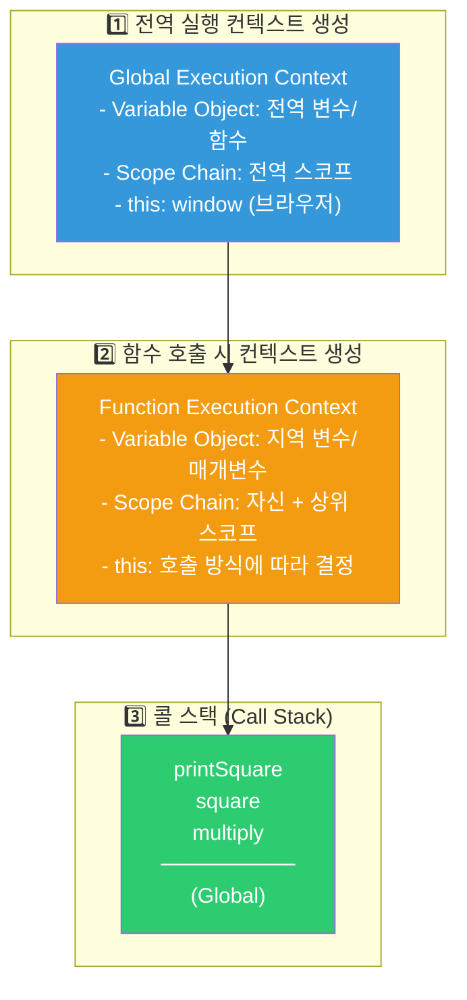
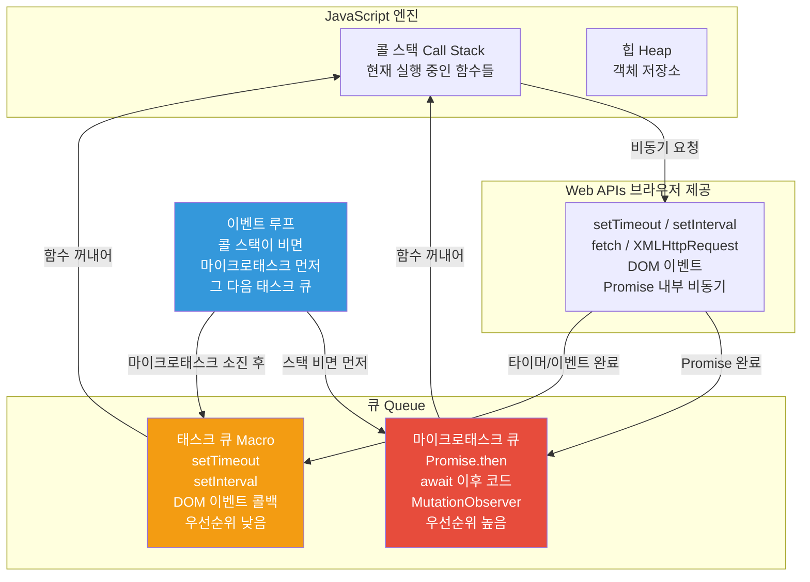
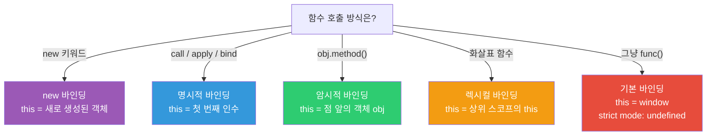
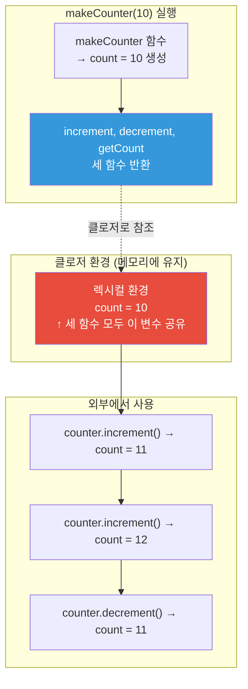
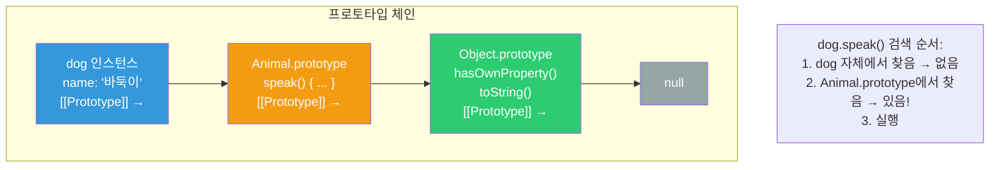
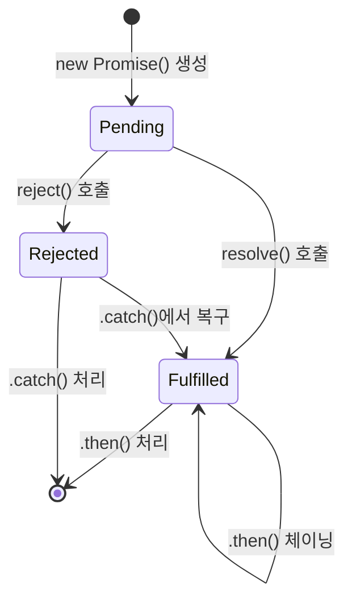

> **한 줄 요약**: JavaScript의 핵심은 싱글 스레드이면서도 비동기 처리가 가능한 이벤트 루프 메커니즘과, 렉시컬 스코프를 기억하는 클로저, 그리고 프로토타입 기반 상속입니다.

---

## 비유로 이해하기

JavaScript 런타임은 **한 명의 유능한 웨이터가 있는 레스토랑**과 같습니다. 이 웨이터(JavaScript 엔진)는 한 번에 한 가지 일만 합니다(싱글 스레드). 하지만 절대 멍하니 서 있지 않습니다.

손님이 주문하면 주방(Web API - setTimeout, fetch 등)에 주문서를 전달하고, 그 동안 다른 손님의 요청을 받습니다. 주방 준비가 끝나면 주문 완성 알림이 대기 테이블(태스크 큐)에 쌓입니다. 웨이터가 현재 서빙하던 일을 마치면(콜 스택 비면) 대기 테이블을 확인해 다음 일을 처리합니다. 이것이 **이벤트 루프**입니다.

클로저는 **웨이터가 손님 테이블 번호를 메모장에 기록하는 것**과 같습니다. 함수(웨이터)가 생성될 때의 환경(테이블 번호)을 기억하고, 나중에 그 함수가 실행될 때도 그 환경에 접근할 수 있습니다.

---

## 1. 실행 컨텍스트 (Execution Context)

JavaScript 코드가 실행될 때, 엔진은 **실행 컨텍스트**를 생성합니다. 실행 컨텍스트는 코드가 실행되는 환경으로, 변수·함수 선언·this 바인딩 정보를 담습니다.



```javascript
// 콜 스택 동작 예시
function multiply(a, b) {
    return a * b;  // 3. multiply 컨텍스트 생성 → 계산 → 제거
}

function square(n) {
    return multiply(n, n);  // 2. square 컨텍스트 생성
}

function printSquare(n) {
    const result = square(n);  // 1. printSquare 컨텍스트 생성
    console.log(result);
}

printSquare(5);

// 콜 스택 변화:
// [] → [printSquare] → [printSquare, square] → [printSquare, square, multiply]
// → multiply 반환 후 제거 → [printSquare, square]
// → square 반환 후 제거 → [printSquare]
// → printSquare 반환 후 제거 → []
```

### 호이스팅 (Hoisting)

실행 컨텍스트 **생성 단계**에서 변수와 함수 선언이 메모리에 미리 등록됩니다.

```javascript
// 함수 선언식: 완전히 호이스팅 (선언 + 초기화 + 할당)
console.log(greet("Kim"));  // ✅ "Hello, Kim" (에러 없음)
function greet(name) {
    return `Hello, ${name}`;
}

// var: 선언만 호이스팅, 값은 undefined로 초기화
console.log(x);  // ✅ undefined (에러 아님, 하지만 의도치 않은 동작)
var x = 10;
console.log(x);  // ✅ 10

// let/const: 선언은 호이스팅되지만 TDZ(Temporal Dead Zone) 존재
console.log(y);  // ❌ ReferenceError: Cannot access 'y' before initialization
let y = 20;
```

#### 면접에서 이렇게 답하세요

> "호이스팅은 JavaScript 엔진이 실행 컨텍스트를 생성하는 단계에서 변수와 함수 선언을 메모리에 먼저 등록하는 메커니즘입니다. `var`는 `undefined`로 초기화되고, `let`/`const`는 TDZ(Temporal Dead Zone)가 있어 선언 전에 접근하면 ReferenceError가 발생합니다. 함수 선언식은 완전히 호이스팅되어 선언 전에도 호출 가능하지만, 함수 표현식은 변수에 할당되므로 var의 경우 `undefined`가 됩니다."

---

## 2. 이벤트 루프 (Event Loop)

JavaScript는 싱글 스레드이지만 이벤트 루프 덕분에 비동기 처리가 가능합니다.



```javascript
// 실행 순서 퀴즈
console.log('1');           // ① 동기 - 즉시 실행

setTimeout(() => {
    console.log('2');       // ④ 태스크 큐 - 마지막
}, 0);

Promise.resolve()
    .then(() => {
        console.log('3');   // ③ 마이크로태스크 큐 - setTimeout보다 먼저
    });

console.log('4');           // ② 동기 - 즉시 실행

// 출력 순서: 1 → 4 → 3 → 2
// 이유:
// 1. 동기 코드 모두 실행 (1, 4)
// 2. 콜 스택이 비면 마이크로태스크 큐 확인 → Promise.then 실행 (3)
// 3. 마이크로태스크 큐가 비면 태스크 큐 확인 → setTimeout 실행 (2)
```

#### 실무에서 자주 하는 실수

```javascript
// ❌ 무한 마이크로태스크 - UI 블로킹 발생
function badRecursive() {
    Promise.resolve().then(badRecursive);
    // 마이크로태스크가 계속 추가되어 태스크 큐(렌더링 포함)가 실행 못 함
}

// ✅ 올바른 재귀 비동기: setTimeout으로 렌더링 기회 제공
function goodRecursive() {
    setTimeout(goodRecursive, 0);
}

// ❌ 동기 루프로 대용량 처리 - UI 프리즈
function processLargeArray(items) {
    items.forEach(item => heavyProcess(item));  // UI 완전 블로킹
}

// ✅ 청크 단위로 처리 - UI 반응성 유지
async function processInChunks(items, chunkSize = 100) {
    for (let i = 0; i < items.length; i += chunkSize) {
        const chunk = items.slice(i, i + chunkSize);
        chunk.forEach(item => heavyProcess(item));
        await new Promise(resolve => setTimeout(resolve, 0));  // 렌더링 기회
    }
}
```

#### 면접에서 이렇게 답하세요

> "이벤트 루프는 콜 스택이 비었을 때 큐에서 함수를 꺼내 실행합니다. 마이크로태스크 큐(Promise.then, await)는 태스크 큐(setTimeout, DOM 이벤트)보다 항상 먼저 처리됩니다. 콜 스택이 빌 때마다 마이크로태스크 큐를 완전히 소진한 후에야 태스크 큐의 다음 태스크를 처리합니다. 브라우저 렌더링도 태스크 사이에 발생하므로, 마이크로태스크가 무한히 추가되면 렌더링이 블로킹됩니다."

---

## 3. this 바인딩

`this`는 **함수가 호출되는 방식**에 따라 결정됩니다. 선언 위치가 아닌 호출 시점의 컨텍스트입니다.



```javascript
// 1. 기본 바인딩: 일반 함수 호출
function show() { console.log(this); }
show();  // window (strict mode에서 undefined)

// 2. 암시적 바인딩: 메서드 호출 - 점 앞의 객체가 this
const obj = {
    name: 'Kim',
    greet() { console.log(this.name); }
};
obj.greet();  // 'Kim'

// ⚠️ 함정: 메서드를 변수에 할당하면 바인딩 잃음
const greetFn = obj.greet;
greetFn();  // undefined (this = window)

// 3. new 바인딩: 생성자 호출
function Person(name) {
    this.name = name;  // this = 새로 생성된 객체
}
const p = new Person('Lee');
console.log(p.name);  // 'Lee'

// 4. 화살표 함수: 렉시컬 this (상위 스코프 this 그대로 사용)
const timer = {
    count: 0,
    start() {
        // 화살표 함수: this는 start() 호출 시의 this (= timer 객체)
        setInterval(() => {
            this.count++;  // ✅ timer.count++
        }, 1000);
    }
};

// 5. 명시적 바인딩: call, apply, bind
function greet(greeting, punctuation) {
    return `${greeting}, ${this.name}${punctuation}`;
}
const user = { name: 'Park' };
greet.call(user, 'Hello', '!');      // 'Hello, Park!' - 즉시 실행
greet.apply(user, ['Hi', '?']);      // 'Hi, Park?' - 배열로 인수 전달
const boundGreet = greet.bind(user); // 새 함수 반환
boundGreet('Hey', '~');              // 'Hey, Park~'
```

#### 실무에서 자주 하는 실수

```javascript
// ❌ React 이벤트 핸들러에서 this 바인딩 누락 (클래스 컴포넌트)
class Button extends React.Component {
    handleClick() {
        console.log(this.props.label);  // TypeError: this is undefined
    }
    render() {
        return <button onClick={this.handleClick}>클릭</button>;
    }
}

// ✅ 화살표 함수 클래스 필드로 해결
class Button extends React.Component {
    handleClick = () => {
        console.log(this.props.label);  // ✅ 정상 동작
    };
    render() {
        return <button onClick={this.handleClick}>클릭</button>;
    }
}
```

---

## 4. 클로저 (Closure)

클로저는 **함수가 생성될 때의 렉시컬 환경을 기억**하는 것입니다. 함수가 외부 함수의 실행이 끝난 후에도 외부 함수의 변수에 접근할 수 있는 메커니즘입니다.



```javascript
// 클로저로 private 변수 구현
function makeCounter(initial = 0) {
    let count = initial;  // 외부에서 직접 접근 불가 (캡슐화)

    return {
        increment() { return ++count; },
        decrement() { return --count; },
        getCount()  { return count; }
    };
}

const counter = makeCounter(10);
console.log(counter.increment());  // 11
console.log(counter.increment());  // 12
console.log(counter.decrement());  // 11
// count 변수에 직접 접근 불가 → 캡슐화 달성

// 독립적인 클로저 인스턴스
const counterA = makeCounter(0);
const counterB = makeCounter(100);
counterA.increment();  // 1
counterB.increment();  // 101 (서로 독립적)
```

### 실무 활용: 함수 팩토리와 메모이제이션

```javascript
// 함수 팩토리: 다양한 배율의 함수 생성
function makeMultiplier(factor) {
    return (num) => num * factor;  // factor를 클로저로 기억
}
const double = makeMultiplier(2);
const triple = makeMultiplier(3);
console.log(double(5));   // 10
console.log(triple(5));   // 15

// 메모이제이션: 결과값 캐싱
function memoize(fn) {
    const cache = new Map();
    return function(...args) {
        const key = JSON.stringify(args);
        if (cache.has(key)) {
            console.log('캐시 히트');
            return cache.get(key);
        }
        const result = fn.apply(this, args);
        cache.set(key, result);
        return result;
    };
}

const expensiveCalc = memoize((n) => {
    // 복잡한 피보나치 계산
    return n <= 1 ? n : expensiveCalc(n - 1) + expensiveCalc(n - 2);
});

expensiveCalc(40);  // 계산 실행
expensiveCalc(40);  // 캐시 히트 (즉시 반환)
```

#### 실무에서 자주 하는 실수: 클로저 메모리 누수

```javascript
// ❌ 메모리 누수: 대용량 데이터를 클로저로 계속 참조
function setupPage() {
    const largeData = new Array(1000000).fill('data');

    document.getElementById('btn').addEventListener('click', () => {
        console.log(largeData.length);  // largeData를 클로저로 잡고 있음
    });
    // 버튼이 DOM에서 제거되어도 largeData는 GC 불가
}

// ✅ 정리(cleanup) 함수로 해결
function setupPage() {
    const largeData = new Array(1000000).fill('data');
    const handler = () => console.log(largeData.length);

    document.getElementById('btn').addEventListener('click', handler);

    return () => {
        document.getElementById('btn').removeEventListener('click', handler);
        // 이제 largeData도 GC 가능
    };
}
const cleanup = setupPage();
// 페이지 언마운트 시
cleanup();
```

---

## 5. 프로토타입 (Prototype)

JavaScript는 **프로토타입 기반 상속**을 사용합니다. 모든 객체는 `[[Prototype]]` 내부 슬롯을 통해 다른 객체를 참조하고, 이 체인을 따라 프로퍼티를 검색합니다.



```javascript
// ES5 방식 (프로토타입 직접 조작)
function Animal(name) {
    this.name = name;  // 인스턴스 고유 프로퍼티
}
// 메서드는 prototype에 추가 → 모든 인스턴스가 공유 (메모리 효율)
Animal.prototype.speak = function() {
    return `${this.name}이 소리를 냅니다`;
};

const dog = new Animal('멍멍이');
console.log(dog.speak());                   // "멍멍이이 소리를 냅니다"
console.log(dog.hasOwnProperty('name'));    // true (자체 프로퍼티)
console.log(dog.hasOwnProperty('speak'));   // false (프로토타입의 것)

// ES6 Class - 프로토타입의 문법적 설탕 (동작은 동일)
class Animal {
    #name;  // Private field (ES2022)

    constructor(name) { this.#name = name; }
    speak() { return `${this.#name}이 소리를 냅니다`; }
    get name() { return this.#name; }
    static create(name) { return new Animal(name); }  // 정적 메서드
}

class Dog extends Animal {
    #breed;
    constructor(name, breed) {
        super(name);  // 부모 생성자 반드시 먼저 호출
        this.#breed = breed;
    }
    speak() {
        return `${super.speak()} - 멍멍!`;  // 부모 메서드 활용
    }
}

const dog = new Dog('바둑이', '진도');
console.log(dog.speak());         // "바둑이이 소리를 냅니다 - 멍멍!"
console.log(dog instanceof Dog);  // true
console.log(dog instanceof Animal); // true (프로토타입 체인)
```

#### 면접에서 이렇게 답하세요

> "JavaScript는 프로토타입 기반 상속을 사용합니다. 모든 객체는 내부적으로 `[[Prototype]]` 링크를 가지며, 프로퍼티를 찾을 때 자신에게 없으면 프로토타입 체인을 따라 올라갑니다. ES6의 `class` 문법은 이 프로토타입 메커니즘 위에 만들어진 문법적 설탕으로, 내부적으로는 동일하게 프로토타입 체인을 사용합니다."

---

## 6. Promise / async-await

### Promise 상태 다이어그램



```javascript
// Promise 생성
function fetchUser(id) {
    return new Promise((resolve, reject) => {
        setTimeout(() => {
            if (id > 0) {
                resolve({ id, name: 'Kim' });  // fulfilled 상태
            } else {
                reject(new Error('Invalid user ID'));  // rejected 상태
            }
        }, 1000);
    });
}

// Promise 체이닝 - 각 then은 새로운 Promise 반환
fetchUser(1)
    .then(user => {
        console.log(user);
        return fetchUserOrders(user.id);  // 다음 비동기 작업
    })
    .then(orders => console.log(orders))
    .catch(err => console.error('에러:', err.message))
    .finally(() => console.log('항상 실행'));

// Promise.all: 병렬 실행, 하나라도 실패하면 전체 실패
const [user, posts, comments] = await Promise.all([
    fetchUser(1),
    fetchPosts(1),
    fetchComments(1)
]);

// Promise.allSettled: 일부 실패해도 전체 결과 반환
const results = await Promise.allSettled([
    fetchUser(1),
    fetchUser(-1),  // 실패
]);
// [{ status: 'fulfilled', value: {...} }, { status: 'rejected', reason: Error }]

// Promise.race: 가장 먼저 완료된 것 반환 (타임아웃 구현)
const result = await Promise.race([
    fetchData(),
    new Promise((_, reject) => setTimeout(() => reject(new Error('Timeout')), 5000))
]);
```

### async/await - 동기 코드처럼 비동기 처리

```javascript
async function getOrderDetails(orderId) {
    try {
        const order = await fetchOrder(orderId);
        const user = await fetchUser(order.customerId);

        // 독립적인 요청은 병렬로 (await를 순차적으로 쓰면 불필요하게 느림)
        const [items, shipping] = await Promise.all([
            fetchOrderItems(orderId),
            fetchShippingInfo(orderId)
        ]);

        return { order, user, items, shipping };
    } catch (error) {
        if (error instanceof OrderNotFoundException) {
            throw error;  // 그대로 다시 던짐
        }
        throw new Error(`주문 상세 조회 실패: ${error.message}`);
    }
}
```

#### 실무에서 자주 하는 실수

```javascript
// ❌ async/await를 순차로 쓰면 느림 (총 3초 소요)
async function slowFetch() {
    const user = await fetchUser(1);    // 1초 대기
    const posts = await fetchPosts(1);  // 1초 대기
    const comments = await fetchComments(1);  // 1초 대기
    return { user, posts, comments };
}

// ✅ 독립적인 요청은 병렬 처리 (총 1초 소요)
async function fastFetch() {
    const [user, posts, comments] = await Promise.all([
        fetchUser(1),
        fetchPosts(1),
        fetchComments(1)
    ]);
    return { user, posts, comments };
}

// ❌ forEach에서 await는 동작하지 않음
async function badForEach(ids) {
    ids.forEach(async (id) => {
        const user = await fetchUser(id);  // 이 await는 forEach를 기다리지 않음
        console.log(user);
    });
    // 이 시점에 모든 fetch가 완료되지 않았을 수 있음
}

// ✅ for...of 또는 Promise.all 사용
async function goodForEach(ids) {
    for (const id of ids) {
        const user = await fetchUser(id);  // 순차 처리
        console.log(user);
    }
    // 또는 병렬 처리:
    const users = await Promise.all(ids.map(id => fetchUser(id)));
}
```

---

## 7. var / let / const

| 항목 | var | let | const |
|------|-----|-----|-------|
| 스코프 | 함수 스코프 | 블록 스코프 | 블록 스코프 |
| 호이스팅 | O (undefined) | O (TDZ) | O (TDZ) |
| 재선언 | 가능 | 불가 | 불가 |
| 재할당 | 가능 | 가능 | 불가 |
| 전역 객체 등록 | 등록됨 | 등록 안 됨 | 등록 안 됨 |

```javascript
// var의 함수 스코프 함정
for (var i = 0; i < 3; i++) {
    setTimeout(() => console.log(i), 100);
}
// 출력: 3, 3, 3 (클로저가 같은 var i를 참조, 루프 끝날 때 i=3)

// let으로 해결 (블록 스코프: 루프마다 새로운 i)
for (let i = 0; i < 3; i++) {
    setTimeout(() => console.log(i), 100);
}
// 출력: 0, 1, 2

// const: 참조 불변, 내부 변경은 가능
const arr = [1, 2, 3];
arr.push(4);        // ✅ 가능 (참조는 동일)
arr = [1, 2, 3, 4]; // ❌ TypeError (재할당 불가)

const obj = { name: 'Kim' };
obj.name = 'Lee';   // ✅ 가능 (참조는 동일)
obj = { name: 'Lee' }; // ❌ TypeError
```

---

## 핵심 포인트 정리

| 개념 | 핵심 | 실무 활용 |
|------|------|----------|
| 실행 컨텍스트 | 코드 실행 환경, 콜 스택으로 관리 | 호이스팅 이해, 스코프 디버깅 |
| 이벤트 루프 | 싱글 스레드 + 비동기 처리 메커니즘 | UI 블로킹 방지, 성능 최적화 |
| this 바인딩 | 호출 방식에 따라 결정 | 화살표 함수로 렉시컬 바인딩 활용 |
| 클로저 | 함수가 생성 시 렉시컬 환경 기억 | private 변수, 메모이제이션, 팩토리 |
| 프로토타입 | 체인을 통한 프로퍼티 검색 | class 문법 이해, 상속 구현 |
| Promise/async | 비동기 흐름 제어 | 병렬 처리(Promise.all), 에러 처리 |
| var/let/const | 스코프와 TDZ | 기본적으로 const, 재할당 필요 시 let |

JavaScript의 이 개념들은 서로 연결되어 있습니다. 실행 컨텍스트가 클로저의 기반이 되고, 이벤트 루프가 Promise의 실행 순서를 결정하며, 프로토타입이 class 문법의 내부 동작입니다. 하나하나 이해하면 "왜 이렇게 동작하는가"를 설명할 수 있게 됩니다.
