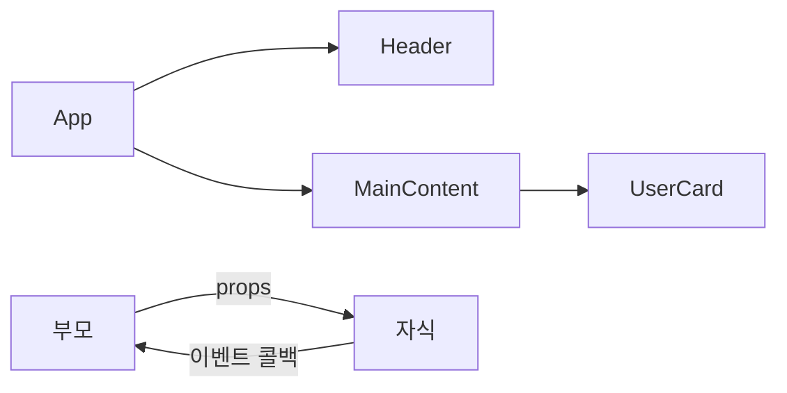
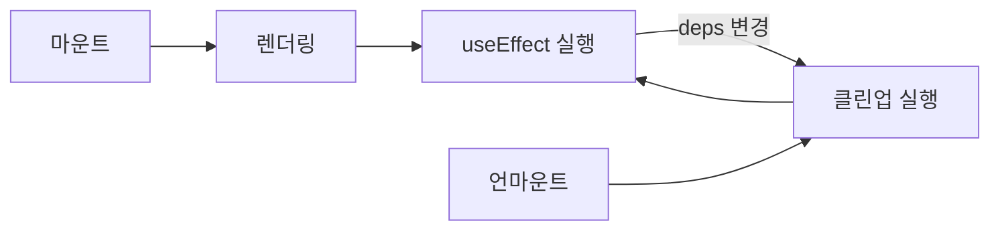
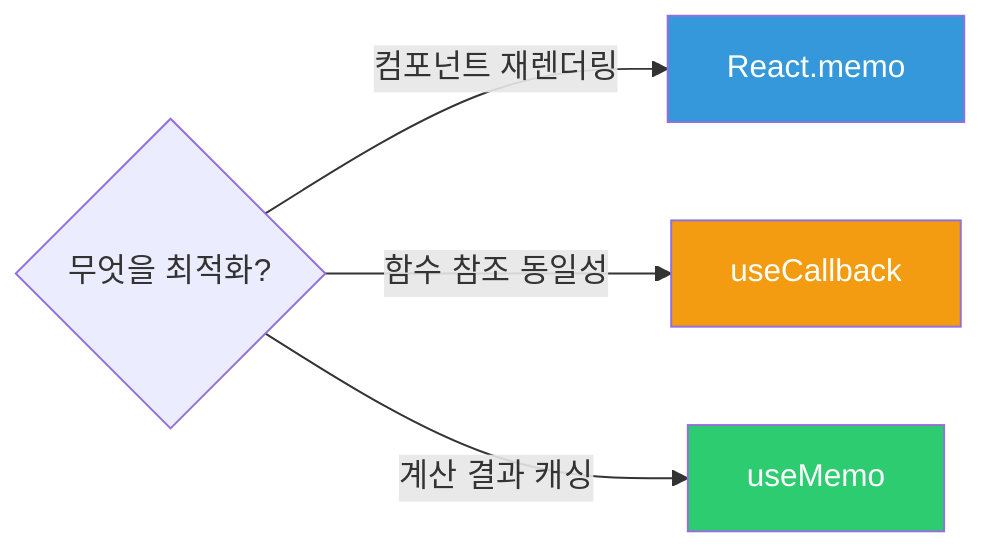
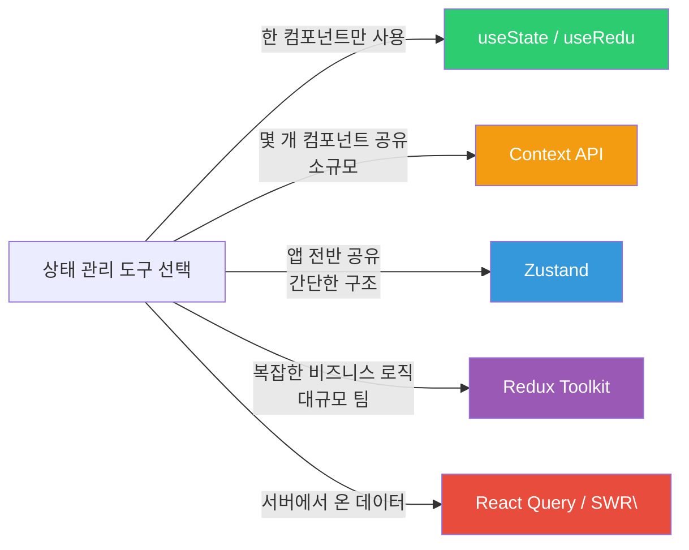
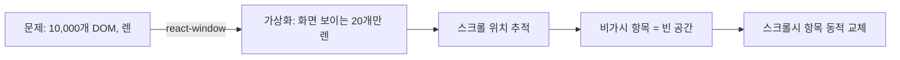

> **한 줄 요약**: React는 컴포넌트 기반 UI 라이브러리로, 상태(state) 변경에 따라 UI를 자동으로 재렌더링하며, Hook으로 로직을 재사용하고, 다양한 상태 관리 도구로 복잡한 앱을 구성합니다.

---

## 비유로 이해하기

React 컴포넌트는 **레고 블록**과 같습니다. 작은 블록(Button, Input)을 조립해 중간 블록(SearchBar, Card)을 만들고, 이를 다시 조립해 큰 구조물(Page)을 만듭니다. 각 블록은 자신의 모양(UI)과 상태(state)를 가지며, 상태가 바뀌면 그 블록만 다시 그려집니다. 부모 블록에서 자식 블록에게 색상이나 크기를 전달할 수 있는데, 이것이 props입니다.

Virtual DOM은 **설계 도면**과 같습니다. 건물(실제 DOM)을 고칠 때마다 전체를 허물지 않습니다. React는 먼저 도면(Virtual DOM)에서 변경사항을 계산하고, 정말 달라진 부분만 실제 건물에 반영합니다. 이 방식이 성능을 높이는 핵심입니다.

Hook은 **플러그인**과 같습니다. useState는 상태 플러그인, useEffect는 사이드이펙트 플러그인, useContext는 전역 데이터 접근 플러그인입니다. 필요한 기능을 조합해 컴포넌트를 구성하는 방식입니다.

---

## 1. 컴포넌트 (Component)

UI를 독립적으로 재사용 가능한 **조각**으로 나눈 것입니다. 함수형 컴포넌트가 현재 표준입니다.




```jsx
// 함수형 컴포넌트 (현재 표준)
function UserCard({ user, onFollow }) {  // props로 데이터 수신
    return (
        <div className="user-card">
            
            <h3>{user.name}</h3>
            <p>{user.bio}</p>
            <button onClick={() => onFollow(user.id)}>팔로우</button>
        </div>
    );
}

// 부모 컴포넌트
function App() {
    const handleFollow = (userId) => {
        console.log(`${userId} 팔로우`);
    };

    return (
        <UserCard
            user={{ id: 1, name: 'Kim', bio: '개발자', avatar: '/kim.jpg' }}
            onFollow={handleFollow}
        />
    );
}
```


---

## 2. State와 Props

```jsx
// Props: 부모 → 자식 데이터 전달 (읽기 전용, 불변)
// State: 컴포넌트 내부 상태 (변경 가능, 변경 시 리렌더링)

function Counter({ initialCount = 0, step = 1 }) {  // props
    const [count, setCount] = useState(initialCount);  // state

    const increment = () => setCount(prev => prev + step);
    const decrement = () => setCount(prev => prev - step);
    const reset = () => setCount(initialCount);

    return (
        <div>
            <button onClick={decrement}>-</button>
            <span>{count}</span>
            <button onClick={increment}>+</button>
            <button onClick={reset}>Reset</button>
        </div>
    );
}
```

#### State 업데이트 원칙

```jsx
// ❌ 직접 변경: React가 감지 못함, 리렌더링 안 됨
state.count = 1;
this.state.items.push(item);

// ✅ setter 함수 사용
setCount(1);

// ✅ 이전 값 기반 업데이트는 함수형 업데이트 (클로저 함정 방지)
setCount(prev => prev + 1);  // 안전
setCount(count + 1);          // ⚠️ 여러 번 연속 업데이트 시 문제

// ✅ 객체/배열 상태: 불변성 유지
setUser(prev => ({ ...prev, name: 'Kim' }));       // 스프레드
setItems(prev => [...prev, newItem]);               // 추가
setItems(prev => prev.filter(item => item.id !== id));  // 삭제
setItems(prev => prev.map(item =>
    item.id === id ? { ...item, done: true } : item  // 수정
));
```

---

## 3. useEffect

사이드 이펙트(API 호출, 구독, 타이머, DOM 조작)를 처리합니다.



```jsx
function UserProfile({ userId }) {
    const [user, setUser] = useState(null);
    const [loading, setLoading] = useState(true);
    const [error, setError] = useState(null);

    useEffect(() => {
        let cancelled = false;  // 언마운트 후 setState 방지

        const fetchUser = async () => {
            setLoading(true);
            setError(null);
            try {
                const data = await api.getUser(userId);
                if (!cancelled) setUser(data);
            } catch (err) {
                if (!cancelled) setError(err.message);
            } finally {
                if (!cancelled) setLoading(false);
            }
        };

        fetchUser();

        // 클린업: 컴포넌트 언마운트 또는 userId 변경 전 실행
        return () => { cancelled = true; };
    }, [userId]);  // userId가 바뀔 때만 재실행

    if (loading) return <Spinner />;
    if (error) return <ErrorMessage message={error} />;
    return <div>{user?.name}</div>;
}
```

#### Dependency Array 규칙

```jsx
useEffect(() => { ... });           // 매 렌더마다 실행 (거의 사용 X)
useEffect(() => { ... }, []);       // 마운트 1번만 실행
useEffect(() => { ... }, [id]);     // id 변경 시마다 실행
```

#### 실무에서 자주 하는 실수

```jsx
// ❌ dependency 누락 - stale closure 문제
function SearchBox({ onSearch }) {
    const [query, setQuery] = useState('');

    useEffect(() => {
        const timer = setTimeout(() => {
            onSearch(query);  // onSearch가 deps에 없으면 stale!
        }, 300);
        return () => clearTimeout(timer);
    }, [query]);  // onSearch 누락!

    // ✅ 모든 의존성 포함
    useEffect(() => {
        const timer = setTimeout(() => {
            onSearch(query);
        }, 300);
        return () => clearTimeout(timer);
    }, [query, onSearch]);  // onSearch도 포함
}
```

---

## 4. 렌더링 최적화

React는 state/props 변경 시 컴포넌트를 재렌더링합니다. 불필요한 재렌더링을 방지하는 세 가지 도구가 있습니다.



### React.memo

```jsx
// props가 변경되지 않으면 재렌더링 건너뜀
const UserCard = React.memo(function UserCard({ user, onFollow }) {
    console.log('UserCard 렌더링');
    return (
        <div>
            <h3>{user.name}</h3>
            <button onClick={() => onFollow(user.id)}>팔로우</button>
        </div>
    );
});

// ⚠️ 주의: 부모 렌더링 시 함수가 새로 생성되면 memo 효과 없음
function Parent() {
    // 매 렌더마다 새 함수 → UserCard는 항상 재렌더링
    const handleFollow = (id) => api.follow(id);  // ❌
    return <UserCard user={user} onFollow={handleFollow} />;
}
```

### useCallback

```jsx
function Parent() {
    const [users, setUsers] = useState([]);

    // deps 변경 안 되면 같은 함수 참조 유지 → memo 효과 발휘
    const handleFollow = useCallback((userId) => {
        api.follow(userId);
        setUsers(prev => prev.map(u =>
            u.id === userId ? { ...u, following: true } : u
        ));
    }, []);  // 빈 배열: 마운트 시 한 번만 생성

    return (
        <div>
            {users.map(user => (
                <UserCard key={user.id} user={user} onFollow={handleFollow} />
            ))}
        </div>
    );
}
```

### useMemo

```jsx
function ProductList({ products, searchQuery, category }) {
    // searchQuery나 category가 변경될 때만 재계산
    const filteredProducts = useMemo(() => {
        return products
            .filter(p => p.category === category)
            .filter(p => p.name.includes(searchQuery))
            .sort((a, b) => b.rating - a.rating);
    }, [products, searchQuery, category]);

    const stats = useMemo(() => ({
        total: filteredProducts.length,
        avgPrice: filteredProducts.reduce((sum, p) => sum + p.price, 0)
                  / filteredProducts.length,
    }), [filteredProducts]);

    return (
        <div>
            <p>총 {stats.total}개, 평균 ₩{stats.avgPrice.toFixed(0)}</p>
            {filteredProducts.map(p => <ProductCard key={p.id} product={p} />)}
        </div>
    );
}
```

#### 최적화 도구 비교표

| 도구 | 목적 | 언제 사용 | 비용 |
|------|------|----------|------|
| React.memo | 컴포넌트 재렌더링 방지 | props 변경이 적은 순수 컴포넌트 | props 얕은 비교 |
| useCallback | 함수 참조 안정화 | memo된 자식에 콜백 전달 시 | deps 비교 + 클로저 |
| useMemo | 무거운 계산 캐싱 | 필터링, 정렬, 통계 계산 | deps 비교 |

> 주의: 모든 함수에 useCallback, 모든 값에 useMemo를 쓰면 오히려 성능이 나빠질 수 있습니다. **실제로 성능 문제가 있을 때** 측정 후 적용하세요.

---

## 5. Custom Hook

상태 로직을 **함수로 추출해 재사용**하는 패턴입니다. `use`로 시작하는 함수이며, 내부에서 다른 Hook을 사용할 수 있습니다.

```jsx
// API 호출 훅
function useFetch(url) {
    const [data, setData] = useState(null);
    const [loading, setLoading] = useState(true);
    const [error, setError] = useState(null);

    useEffect(() => {
        let cancelled = false;
        fetch(url)
            .then(res => res.json())
            .then(data => { if (!cancelled) setData(data); })
            .catch(err => { if (!cancelled) setError(err); })
            .finally(() => { if (!cancelled) setLoading(false); });
        return () => { cancelled = true; };
    }, [url]);

    return { data, loading, error };
}

// 로컬 스토리지 훅
function useLocalStorage(key, initialValue) {
    const [value, setValue] = useState(() => {
        try {
            return JSON.parse(localStorage.getItem(key)) ?? initialValue;
        } catch {
            return initialValue;
        }
    });

    const setStoredValue = useCallback((newValue) => {
        setValue(newValue);
        localStorage.setItem(key, JSON.stringify(newValue));
    }, [key]);

    return [value, setStoredValue];
}

// 디바운스 훅 - 검색창 최적화에 필수
function useDebounce(value, delay = 300) {
    const [debouncedValue, setDebouncedValue] = useState(value);

    useEffect(() => {
        const timer = setTimeout(() => setDebouncedValue(value), delay);
        return () => clearTimeout(timer);  // 이전 타이머 클리어
    }, [value, delay]);

    return debouncedValue;
}

// 실제 사용 예
function SearchPage() {
    const [query, setQuery] = useState('');
    const debouncedQuery = useDebounce(query, 300);  // 300ms 후에만 API 호출

    const { data, loading } = useFetch(`/api/search?q=${debouncedQuery}`);
    const [recentSearches, setRecentSearches] = useLocalStorage('searches', []);

    return (
        <div>
            <input value={query} onChange={e => setQuery(e.target.value)} />
            {loading ? <Spinner /> : <SearchResults results={data} />}
        </div>
    );
}
```

---

## 6. 상태 관리 전략



### 1. Context API (소규모)


```jsx
const ThemeContext = createContext('light');

function App() {
    const [theme, setTheme] = useState('light');

    return (
        <ThemeContext.Provider value={{ theme, setTheme }}>
            <Router />
        </ThemeContext.Provider>
    );
}

function ThemeButton() {
    const { theme, setTheme } = useContext(ThemeContext);
    return (
        <button onClick={() => setTheme(t => t === 'light' ? 'dark' : 'light')}>
            현재: {theme}
        </button>
    );
}
```


### 2. Redux Toolkit (대규모)

```jsx
// store/orderSlice.js
import { createSlice, createAsyncThunk } from '@reduxjs/toolkit';

export const fetchOrders = createAsyncThunk('orders/fetch', async (userId) => {
    const response = await api.getOrders(userId);
    return response.data;
});

const orderSlice = createSlice({
    name: 'orders',
    initialState: { items: [], loading: false, error: null },
    reducers: {
        cancelOrder: (state, action) => {
            const order = state.items.find(o => o.id === action.payload);
            if (order) order.status = 'CANCELLED';  // Immer로 직접 수정 가능
        },
    },
    extraReducers: (builder) => {
        builder
            .addCase(fetchOrders.pending, state => { state.loading = true; })
            .addCase(fetchOrders.fulfilled, (state, action) => {
                state.loading = false;
                state.items = action.payload;
            })
            .addCase(fetchOrders.rejected, (state, action) => {
                state.loading = false;
                state.error = action.error.message;
            });
    },
});

export const { cancelOrder } = orderSlice.actions;
export default orderSlice.reducer;
```

### 3. Zustand (경량 - 권장)

```jsx
import { create } from 'zustand';
import { persist } from 'zustand/middleware';

// persist 미들웨어로 localStorage 자동 동기화
const useCartStore = create(persist(
    (set, get) => ({
        items: [],
        addItem: (product) => set(state => ({
            items: [...state.items, { ...product, quantity: 1 }]
        })),
        removeItem: (productId) => set(state => ({
            items: state.items.filter(item => item.id !== productId)
        })),
        updateQuantity: (productId, quantity) => set(state => ({
            items: state.items.map(item =>
                item.id === productId ? { ...item, quantity } : item
            )
        })),
        get total() {
            return get().items.reduce((sum, item) =>
                sum + item.price * item.quantity, 0);
        },
    }),
    { name: 'cart-storage' }  // localStorage 키
));

// Provider 없이 어디서든 사용
function CartButton() {
    const { items, addItem } = useCartStore();
    return <button onClick={() => addItem(product)}>담기 ({items.length})</button>;
}
```

### 4. React Query (서버 상태)

```jsx
import { useQuery, useMutation, useQueryClient } from '@tanstack/react-query';

function ProductDetail({ productId }) {
    const queryClient = useQueryClient();

    const { data: product, isLoading, isError } = useQuery({
        queryKey: ['product', productId],
        queryFn: () => api.getProduct(productId),
        staleTime: 5 * 60 * 1000,  // 5분간 신선 (재요청 안 함)
        gcTime: 10 * 60 * 1000,    // 10분 후 캐시 제거
    });

    const mutation = useMutation({
        mutationFn: (updatedProduct) => api.updateProduct(productId, updatedProduct),
        onMutate: async (newData) => {
            // Optimistic Update: 서버 응답 전에 UI 먼저 업데이트
            await queryClient.cancelQueries({ queryKey: ['product', productId] });
            const previous = queryClient.getQueryData(['product', productId]);
            queryClient.setQueryData(['product', productId], old => ({ ...old, ...newData }));
            return { previous };  // 롤백을 위해 이전 값 저장
        },
        onError: (err, newData, context) => {
            // 에러 시 롤백
            queryClient.setQueryData(['product', productId], context.previous);
        },
        onSettled: () => {
            queryClient.invalidateQueries({ queryKey: ['product', productId] });
        },
    });

    if (isLoading) return <Spinner />;
    if (isError) return <ErrorMessage />;
    return <div>{product.name}</div>;
}
```

---


## 극한 시나리오



```jsx
// 나쁜 예: 부모 state 변경 → 10,000개 자식 모두 재렌더링
function Parent() {
    const [tick, setTick] = useState(0);

    useEffect(() => {
        const id = setInterval(() => setTick(t => t + 1), 1000);
        return () => clearInterval(id);
    }, []);

    return (
        <div>
            {items.map(item => (
                // tick prop 때문에 모든 자식 재렌더링
                <ExpensiveChild key={item.id} item={item} tick={tick} />
            ))}
        </div>
    );
}

// 좋은 예: tick을 사용하는 컴포넌트만 분리
function TickDisplay() {
    const [tick, setTick] = useState(0);
    useEffect(() => {
        const id = setInterval(() => setTick(t => t + 1), 1000);
        return () => clearInterval(id);
    }, []);
    return <span>업데이트: {tick}회</span>;
}

const MemoizedChild = React.memo(ExpensiveChild);  // props 안 바뀌면 건너뜀

function Parent() {
    return (
        <div>
            <TickDisplay />  {/* tick 상태가 여기만 영향 */}
            {items.map(item => (
                <MemoizedChild key={item.id} item={item} />  {/* 재렌더링 없음 */}
            ))}
        </div>
    );
}

// 진짜 대용량: 가상 스크롤 (react-window)
import { FixedSizeList } from 'react-window';

function VirtualList({ items }) {
    const Row = ({ index, style }) => (
        <div style={style}>
            <ProductCard product={items[index]} />
        </div>
    );

    return (
        <FixedSizeList
            height={600}        // 화면 높이
            itemCount={items.length}
            itemSize={80}       // 각 행 높이
            width="100%"
        >
            {Row}
        </FixedSizeList>
        // 실제 DOM에는 600/80 = 약 8개 + 버퍼만 존재
        // 10,000개든 1,000,000개든 동일한 성능
    );
}
```

---
## 핵심 포인트 정리

| 개념 | 핵심 | 언제 사용 |
|------|------|----------|
| useState | 컴포넌트 내부 상태 | UI 토글, 입력값, 로컬 데이터 |
| useEffect | 사이드이펙트 처리 | API 호출, 구독, 타이머 |
| useCallback | 함수 참조 안정화 | memo된 자식에 콜백 전달 |
| useMemo | 계산 결과 캐싱 | 무거운 필터링/정렬 |
| React.memo | 불필요한 리렌더 방지 | props 자주 안 바뀌는 컴포넌트 |
| Custom Hook | 로직 재사용 | 여러 컴포넌트에서 같은 로직 |
| Context | 소규모 전역 상태 | 테마, 언어, 인증 정보 |
| Zustand | 경량 전역 상태 | 장바구니, 사용자 세션 |
| React Query | 서버 상태 관리 | API 데이터 캐싱/동기화 |

React의 핵심 철학은 **"UI는 상태의 함수"**입니다. `UI = f(state)`. 상태가 결정되면 UI는 자동으로 결정됩니다. 이 단방향 데이터 흐름을 잘 이해하고, 상태를 적절한 레벨에 배치하는 것이 좋은 React 코드의 기본입니다.

---

## 왜 React인가? (vs Vue vs Svelte)

| 항목 | React | Vue | Svelte |
|------|-------|-----|--------|
| 학습 곡선 | 높음 (JSX, Hook 개념) | 낮음 (템플릿 친화적) | 매우 낮음 |
| 번들 크기 | 중간 (~45KB) | 중간 (~34KB) | 최소 (컴파일 타임 제거) |
| 생태계 | 압도적으로 큼 | 큼 | 작음 |
| 기업 채용 | 가장 많음 | 많음 | 적음 |
| 상태 관리 | 외부 라이브러리 필요 | Pinia 내장 | 내장 Store |
| 렌더링 방식 | Virtual DOM | Virtual DOM | 컴파일 타임 변환 |

**React를 선택하는 이유**: 생태계 규모와 채용 시장이 압도적이다. Next.js, React Native로 웹·앱·서버를 같은 패러다임으로 커버할 수 있다. 팀이 크고 장기 프로젝트일수록 검증된 패턴과 풍부한 레퍼런스가 유리하다.

**Vue를 선택하는 이유**: 백엔드 개발자가 많은 팀, 기존 서버 렌더링 프로젝트에 점진적 도입, 작은 팀에서 빠른 초기 개발이 필요할 때 유리하다.

**Svelte를 선택하는 이유**: 번들 크기가 중요한 임베디드 환경이나 Virtual DOM 오버헤드를 없애고 싶을 때. 단, 생태계 부족으로 대규모 프로젝트에는 리스크가 있다.

---

## 실무에서 자주 하는 실수

**실수 1: useEffect 의존성 배열 누락 (stale closure)**

```jsx
// ❌ onSearch가 deps에 없어 예전 onSearch를 계속 참조
useEffect(() => {
    const timer = setTimeout(() => onSearch(query), 300);
    return () => clearTimeout(timer);
}, [query]); // onSearch 누락!

// ✅ 모든 의존성 포함
useEffect(() => {
    const timer = setTimeout(() => onSearch(query), 300);
    return () => clearTimeout(timer);
}, [query, onSearch]);
```

**실수 2: 객체/배열 상태 직접 변경**

```jsx
// ❌ 불변성 위반 — React가 변경을 감지 못해 리렌더링 안 됨
const [items, setItems] = useState([]);
items.push(newItem);  // 원본 변경
setItems(items);      // 같은 참조 → 리렌더링 없음

// ✅ 새 배열 반환
setItems(prev => [...prev, newItem]);
```

**실수 3: 모든 함수/값에 useCallback/useMemo 남용**

```jsx
// ❌ 단순 문자열 연산에 useMemo는 비교 비용만 추가
const title = useMemo(() => `Hello, ${name}`, [name]);

// ✅ 실제로 무거운 연산(필터링, 정렬)에만 사용
const filtered = useMemo(
    () => largeList.filter(x => x.active).sort((a, b) => b.score - a.score),
    [largeList]
);
```

**실수 4: key에 index 사용 (목록 재정렬 시 버그)**

```jsx
// ❌ 정렬/삽입/삭제 시 key가 바뀌어 불필요한 언마운트/마운트 발생
{items.map((item, index) => <Card key={index} item={item} />)}

// ✅ 고유 식별자 사용
{items.map(item => <Card key={item.id} item={item} />)}
```

**실수 5: 비동기 useEffect에서 언마운트 후 setState**

```jsx
// ❌ 컴포넌트 언마운트 후 setUser 호출 → 메모리 누수 경고
useEffect(() => {
    fetchUser(id).then(data => setUser(data));
}, [id]);

// ✅ cancelled 플래그로 방지
useEffect(() => {
    let cancelled = false;
    fetchUser(id).then(data => { if (!cancelled) setUser(data); });
    return () => { cancelled = true; };
}, [id]);
```

---

## 면접 포인트

**Q1. React의 Reconciliation(재조정) 알고리즘을 설명하라.**

Virtual DOM 비교 시 두 가지 가정을 전제한다. 첫째, 타입이 다른 두 엘리먼트는 다른 트리를 생성한다고 가정해 전체 서브트리를 교체한다. 둘째, `key` prop으로 목록의 안정적인 식별자를 제공한다. 이 두 가정 덕분에 O(n) 시간 복잡도로 diffing이 가능하다 (일반 트리 비교는 O(n³)).

**Q2. useState와 useReducer를 각각 언제 선택하는가?**

`useState`는 독립적인 단순 값에 적합하다. `useReducer`는 여러 상태가 서로 연관되어 있고 상태 전환 로직이 복잡할 때, 또는 상태 변경 로직을 컴포넌트 외부에서 테스트하고 싶을 때 선택한다. 상태 업데이트 분기가 3개 이상이면 useReducer를 고려한다.

**Q3. useMemo와 React.memo의 차이는?**

`React.memo`는 컴포넌트 자체를 메모이제이션한다. props가 바뀌지 않으면 리렌더링을 건너뛴다. `useMemo`는 컴포넌트 내부의 계산 결과를 메모이제이션한다. 무거운 필터링·정렬 계산을 deps가 바뀔 때만 재실행하도록 캐싱한다. `useCallback`은 `useMemo(() => fn, deps)`와 동일하며 함수 참조를 안정화한다.

**Q4. React 18 Concurrent Mode가 해결하는 문제는?**

기존 React는 렌더링을 중단할 수 없어 무거운 업데이트가 UI를 블로킹했다. Concurrent Mode는 렌더링에 우선순위를 부여해 긴급한 업데이트(사용자 입력)가 느린 업데이트(데이터 페칭 결과)를 중단하고 먼저 처리된다. `useTransition`은 낮은 우선순위 업데이트를 표시하고, `useDeferredValue`는 값의 업데이트를 지연시킨다.

**Q5. 컴포넌트 리렌더링이 발생하는 조건 3가지는?**

첫째, 해당 컴포넌트의 `state`가 변경됐을 때. 둘째, 부모 컴포넌트가 리렌더링돼 `props`가 새 참조로 전달됐을 때. 셋째, 구독 중인 `Context` 값이 변경됐을 때. `React.memo`는 두 번째 경우를 방지하지만, Context 변경은 막지 못한다.
