## 레스토랑 주방에서 요리가 나오기까지

URL을 입력하고 엔터를 누르는 순간, 브라우저는 엄청난 일을 시작합니다. 이를 레스토랑에 비유해 봅시다.

1. **주문서 받기** (HTML 파일 수신)
2. **재료 목록 만들기** (DOM, CSSOM 생성)
3. **요리 레시피 결합** (렌더 트리 생성)
4. **그릇 크기 결정** (레이아웃)
5. **음식 색깔 입히기** (페인트)
6. **접시에 담기** (컴포지팅)

이 6단계를 **Critical Rendering Path(CRP)**라고 합니다.

---

## 1. 전체 렌더링 파이프라인

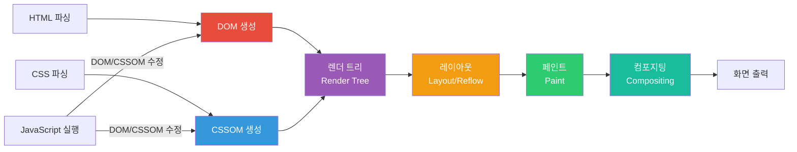

---

## 2. HTML 파싱과 DOM 생성

브라우저가 HTML을 받으면 바이트 → 문자 → 토큰 → 노드 → DOM의 과정을 거칩니다.

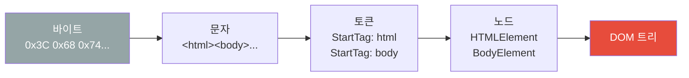

### DOM 트리 구조

```html
<!DOCTYPE html>
<html>
  <head>
    <title>예제</title>
    <link rel="stylesheet" href="style.css">
  </head>
  <body>
    <h1>제목</h1>
    <p>단락</p>
  </body>
</html>
```

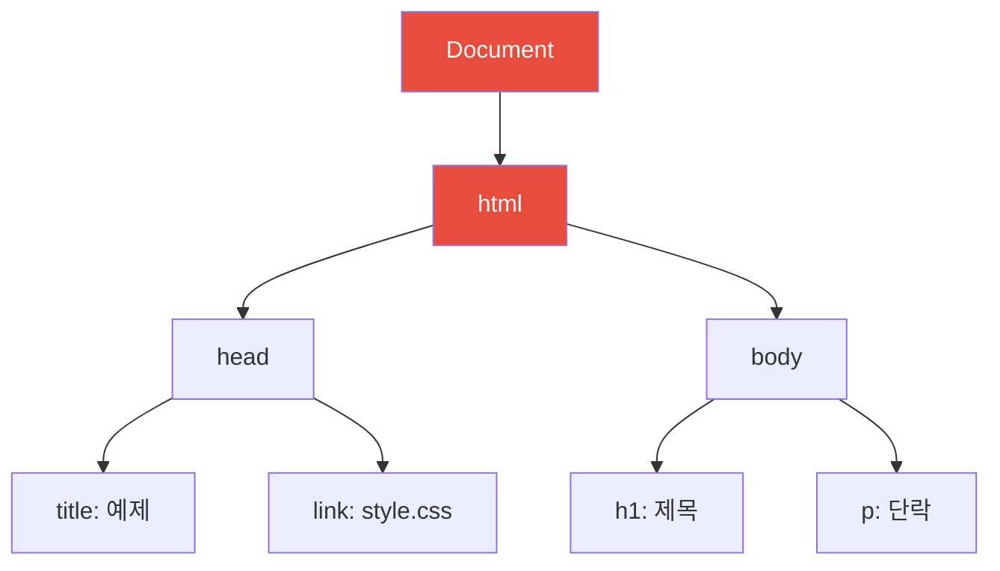

### 파싱 블로킹

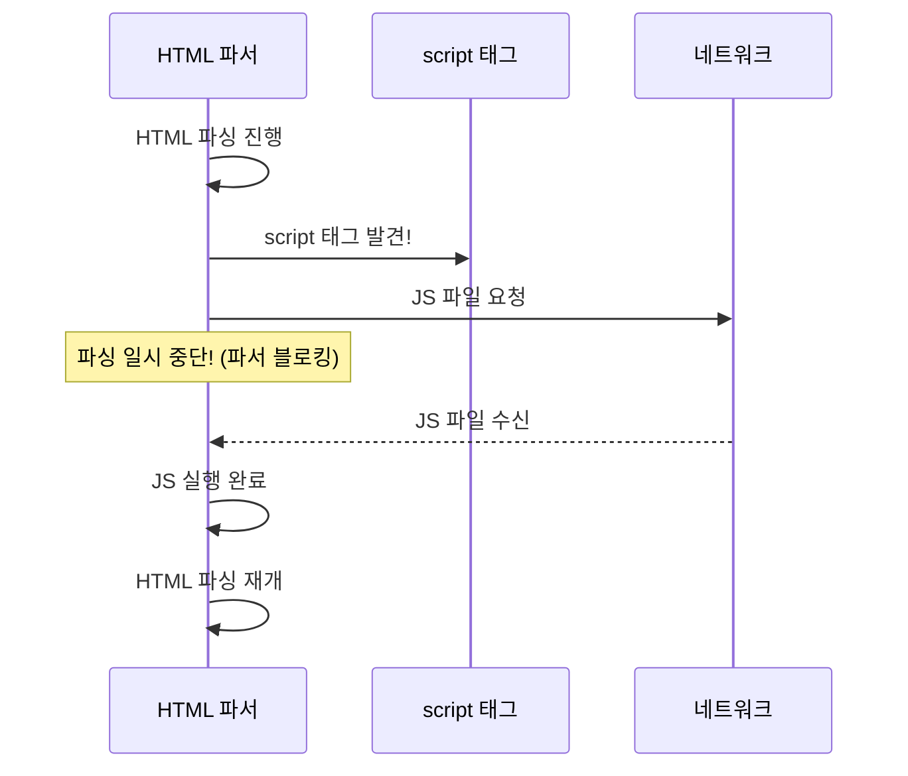

**해결책:**
```html
<!-- async: 다운로드 완료 즉시 실행 (파싱 중단) -->
<script async src="analytics.js"></script>

<!-- defer: 파싱 완료 후 실행 (권장) -->
<script defer src="app.js"></script>

<!-- body 끝에 배치: 파싱 완료 후 로드 -->
<body>
  ...
  <script src="app.js"></script>
</body>
```

---

## 3. CSS 파싱과 CSSOM 생성

CSS도 DOM과 유사한 과정으로 파싱되어 CSSOM(CSS Object Model) 트리를 만듭니다.

```css
body { font-size: 16px; }
p { color: blue; }
span { display: none; }
```

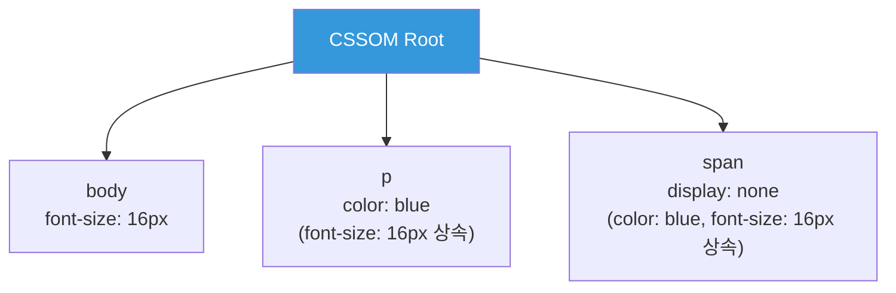

**중요**: CSS는 **렌더 블로킹 리소스**입니다. CSSOM이 완성되기 전까지 렌더 트리를 만들 수 없습니다.

---

## 4. 렌더 트리 (Render Tree) 생성

DOM + CSSOM을 결합하여 실제로 화면에 그려질 요소들의 트리를 만듭니다.

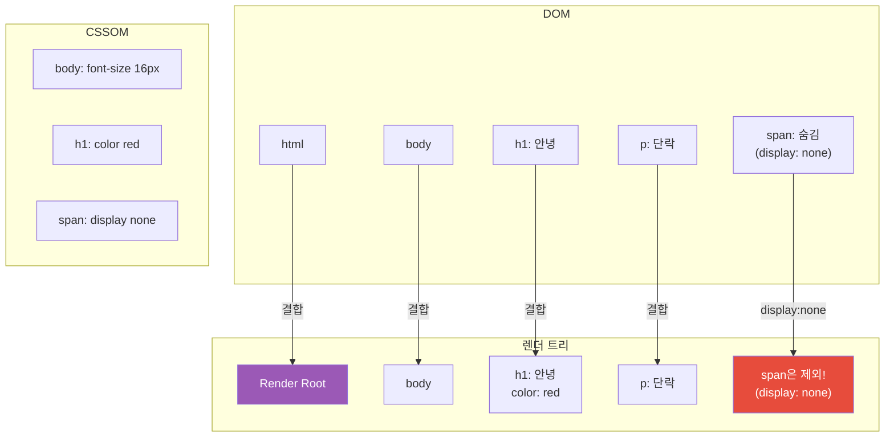

### 렌더 트리에서 제외되는 요소

- `display: none` 설정된 요소
- `<head>`, `<script>`, `<meta>` 등 비시각적 요소
- HTML 주석

**주의**: `visibility: hidden`은 공간은 차지하지만 보이지 않음 → 렌더 트리에 포함됨

---

## 5. 레이아웃 (Layout / Reflow)

렌더 트리의 각 노드가 화면의 **어느 위치에, 얼마나 크게** 그려질지 계산합니다.

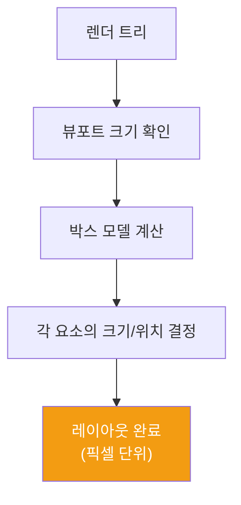

```javascript
// 레이아웃을 트리거하는 속성들
element.style.width = '100px';      // 리플로우
element.style.height = '200px';     // 리플로우
element.style.margin = '10px';      // 리플로우
element.style.padding = '5px';      // 리플로우
element.style.display = 'block';    // 리플로우

// 레이아웃 정보 읽기도 리플로우 발생
const width = element.offsetWidth;  // 리플로우!
const height = element.offsetHeight; // 리플로우!
```

---

## 6. 페인트 (Paint)

레이아웃 후 각 요소를 실제 픽셀로 그립니다. 여러 레이어로 나뉘어 그려집니다.

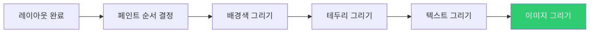

### 리페인트 vs 리플로우

| 작업 | 비용 | 트리거 조건 |
|------|------|------------|
| 리플로우 (Reflow) | 매우 높음 | 크기, 위치, 레이아웃 변경 |
| 리페인트 (Repaint) | 중간 | 색상, 배경, 그림자 변경 |
| 컴포지팅 | 낮음 | transform, opacity 변경 |

```javascript
// 비용 순서: 리플로우 > 리페인트 > 컴포지팅

// 비싼 작업 (리플로우)
element.style.width = '200px';
element.style.left = '10px';

// 중간 작업 (리페인트)
element.style.backgroundColor = 'red';
element.style.color = 'blue';

// 저렴한 작업 (컴포지팅만)
element.style.transform = 'translateX(10px)'; // GPU 가속!
element.style.opacity = '0.5'; // GPU 가속!
```

---

## 7. 컴포지팅 (Compositing)

여러 레이어를 합성하여 최종 화면을 만듭니다. GPU가 담당합니다.

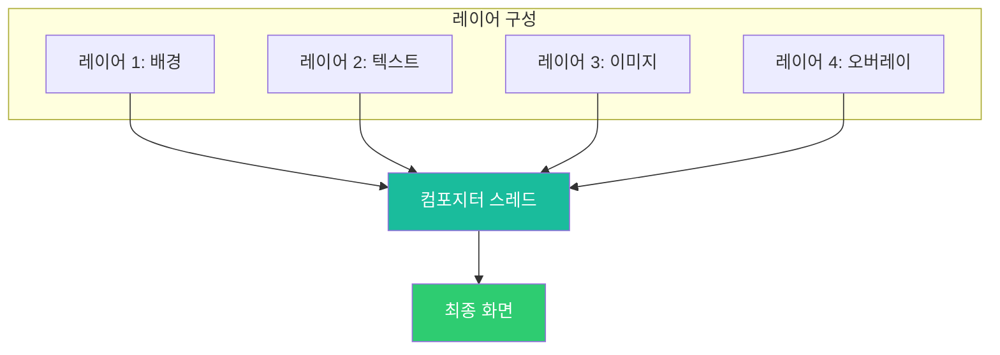

### 레이어 생성 조건

```css
/* 새 레이어를 생성하는 CSS 속성들 */
.new-layer {
  transform: translateZ(0);     /* GPU 레이어 */
  will-change: transform;        /* 미리 레이어 생성 힌트 */
  position: fixed;               /* 고정 레이어 */
  opacity: 0.5 + animation;      /* 애니메이션 시 레이어 */
}
```

---

## 8. Reflow와 Repaint 최적화

### 강제 동기 레이아웃 (Layout Thrashing)

```javascript
// 나쁜 코드 - 레이아웃 쓰래싱
const elements = document.querySelectorAll('.item');

for (const el of elements) {
  const width = el.offsetWidth; // 읽기 → 리플로우 발생
  el.style.width = `${width * 2}px`; // 쓰기 → 레이아웃 무효화
  // 다음 반복의 읽기가 다시 리플로우 발생...
}
```

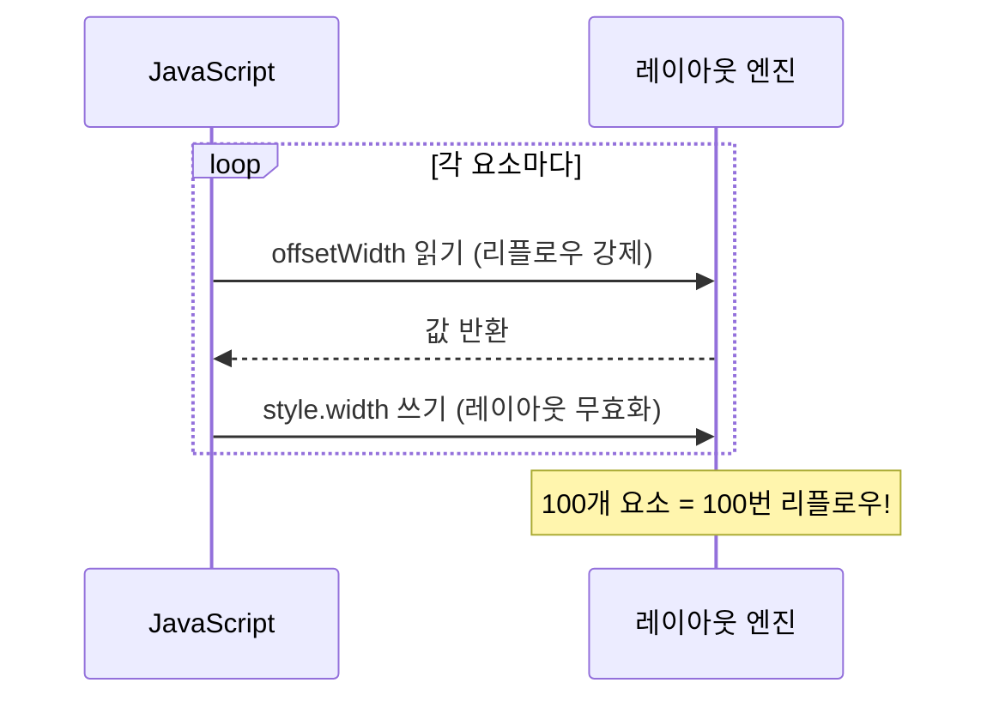

```javascript
// 좋은 코드 - 읽기/쓰기 분리
const elements = document.querySelectorAll('.item');

// 1단계: 모든 값 읽기
const widths = [...elements].map(el => el.offsetWidth);

// 2단계: 모든 값 쓰기
elements.forEach((el, i) => {
  el.style.width = `${widths[i] * 2}px`;
});
```

### requestAnimationFrame 활용

```javascript
// 레이아웃 쓰래싱 완전 방지
function updateElements() {
  requestAnimationFrame(() => {
    // 렌더링 직전에 한 번에 처리
    const widths = [...elements].map(el => el.offsetWidth);
    elements.forEach((el, i) => {
      el.style.width = `${widths[i] * 2}px`;
    });
  });
}
```

---

## 9. Critical Rendering Path 최적화

### 렌더 블로킹 리소스 제거

```html
<!-- 나쁜 예: 렌더 블로킹 CSS -->
<head>
  <link rel="stylesheet" href="all-styles.css"> <!-- 모든 CSS 로드 대기 -->
</head>

<!-- 좋은 예: 중요한 CSS만 인라인 -->
<head>
  <style>
    /* 위에 보이는 영역(above the fold)의 핵심 스타일만 */
    body { margin: 0; font-family: sans-serif; }
    .header { background: #333; color: white; }
  </style>
  <!-- 나머지 CSS는 비동기 로드 -->
  <link rel="preload" href="styles.css" as="style" onload="this.rel='stylesheet'">
</head>
```

### 리소스 힌트

```html
<!-- preconnect: 도메인에 미리 연결 -->
<link rel="preconnect" href="https://fonts.googleapis.com">

<!-- preload: 곧 필요한 리소스 미리 로드 -->
<link rel="preload" href="hero-image.jpg" as="image">
<link rel="preload" href="font.woff2" as="font" crossorigin>

<!-- prefetch: 다음 페이지에 필요한 리소스 미리 가져오기 -->
<link rel="prefetch" href="/next-page.html">
```

---

## 10. 성능 측정 - 브라우저 타이밍 API

```javascript
// Navigation Timing API
const timing = performance.timing;

// 주요 지표 계산
const pageLoad = timing.loadEventEnd - timing.navigationStart;
const domReady = timing.domContentLoadedEventEnd - timing.navigationStart;
const firstByte = timing.responseStart - timing.navigationStart;
const htmlParse = timing.domInteractive - timing.responseStart;

console.log({
  'Page Load': pageLoad + 'ms',
  'DOM Ready': domReady + 'ms',
  'First Byte (TTFB)': firstByte + 'ms',
  'HTML Parse': htmlParse + 'ms'
});
```

```mermaid
gantt
    title 브라우저 렌더링 타임라인
    dateFormat X
    axisFormat %Lms

    section 네트워크
    DNS 조회 :0, 50
    TCP 연결 :50, 100
    TTFB (첫 바이트) :100, 200

    section HTML 파싱
    HTML 수신 및 파싱 :200, 400
    CSS 다운로드 :250, 350
    JS 다운로드/실행 :300, 450

    section 렌더링
    DOM 생성 :200, 420
    CSSOM 생성 :350, 420
    렌더 트리 :420, 450
    레이아웃 :450, 480
    페인트 :480, 520
    컴포지팅 :520, 540
```

---

## 11. Core Web Vitals

구글이 정의한 웹 성능 핵심 지표입니다.

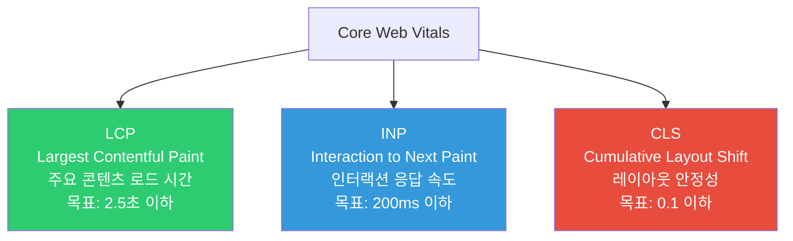

```javascript
// Web Vitals 측정
import { getLCP, getINP, getCLS } from 'web-vitals';

getLCP((metric) => {
  console.log('LCP:', metric.value, 'ms');
  // 2500ms 이하: Good, 4000ms 이하: Needs Improvement, 그 이상: Poor
});

getCLS((metric) => {
  console.log('CLS:', metric.value);
  // 0.1 이하: Good, 0.25 이하: Needs Improvement, 그 이상: Poor
});
```

---

## 12. 극한 시나리오 - 무한 리플로우 루프

```javascript
// 이런 코드는 브라우저를 멈춥니다
function infiniteReflow() {
  // ResizeObserver 콜백에서 크기를 변경하면
  // 다시 Resize 이벤트를 트리거 → 무한 루프!
  const observer = new ResizeObserver((entries) => {
    for (const entry of entries) {
      // 이 안에서 크기를 변경하면 안 됨
      entry.target.style.width = entry.contentRect.width + 'px';
    }
  });
  observer.observe(element);
}

// 올바른 방법
const observer = new ResizeObserver((entries) => {
  requestAnimationFrame(() => {
    for (const entry of entries) {
      // rAF 안에서 변경 → 다음 프레임에 처리
      entry.target.style.width = entry.contentRect.width + 'px';
    }
  });
});
```

---

## 13. 최적화 체크리스트

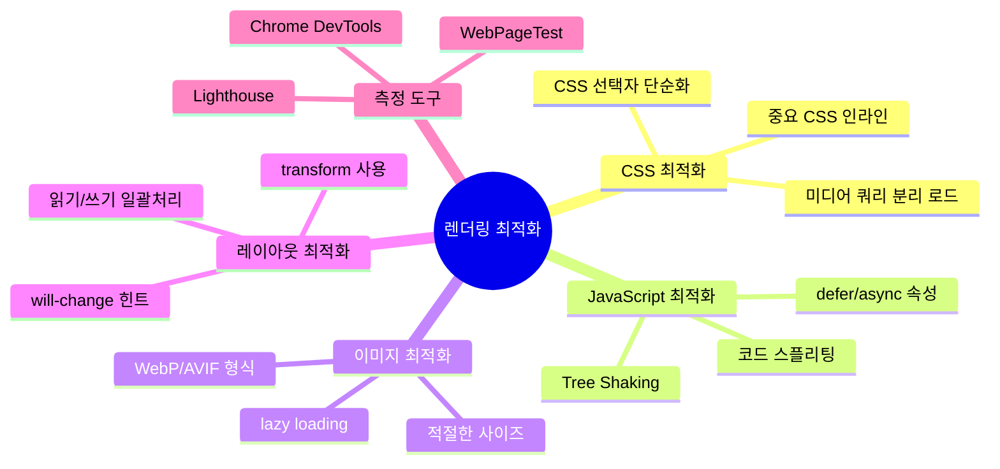

### 실전 체크리스트

```javascript
// 1. CSS 속성 선택
// 나쁨: 리플로우 유발
element.style.left = '10px';
// 좋음: 컴포지팅만
element.style.transform = 'translateX(10px)';

// 2. 복수 스타일 변경
// 나쁨: 여러 번 리플로우
element.style.width = '100px';
element.style.height = '200px';
element.style.margin = '10px';

// 좋음: 클래스로 한 번에 변경
element.classList.add('resized');

// 3. 문서 조각 사용
// 나쁨: 매번 DOM 업데이트
for (const item of items) {
  document.body.appendChild(createItem(item)); // N번 리플로우
}

// 좋음: DocumentFragment 사용
const fragment = document.createDocumentFragment();
for (const item of items) {
  fragment.appendChild(createItem(item));
}
document.body.appendChild(fragment); // 1번 리플로우
```

브라우저 렌더링을 이해하면 성능 문제의 근본 원인을 파악하고 효과적으로 해결할 수 있습니다. 모든 최적화의 핵심은 **불필요한 레이아웃과 페인트를 줄이는 것**입니다.
