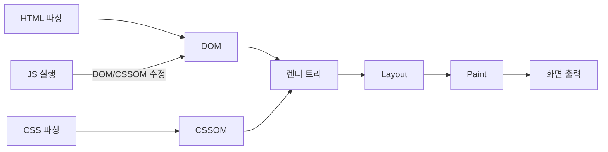
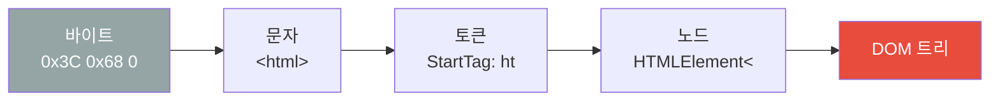
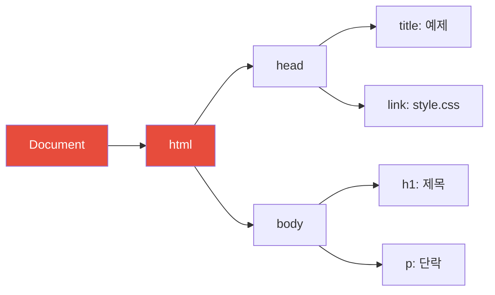
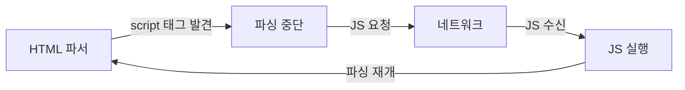
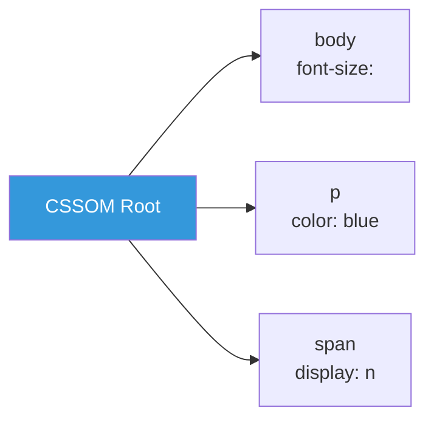
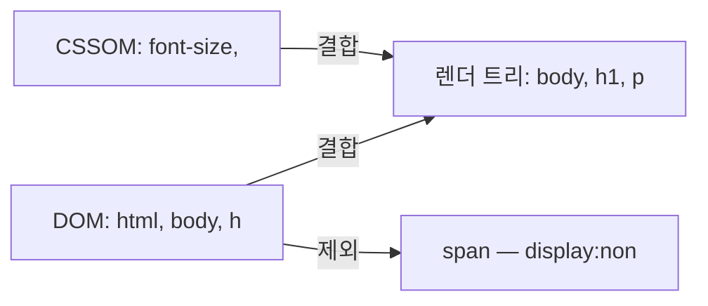
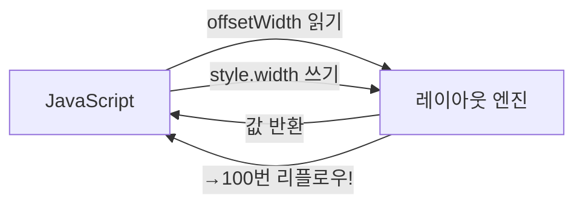
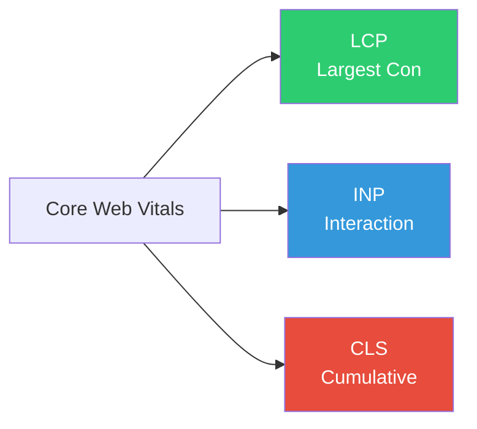
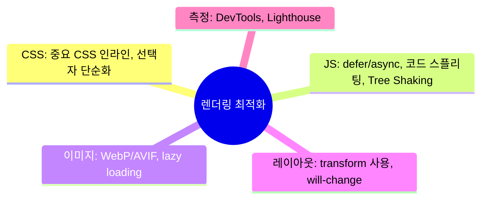

## 레스토랑 주방에서 음식이 나오기까지

URL을 입력하고 엔터를 누르는 순간, 브라우저는 믿기 어려울 정도로 복잡한 작업을 시작합니다. 이것을 레스토랑에 비유하면 이렇습니다.

1. **주문서 받기** — HTML 파일 수신
2. **재료 목록 작성** — DOM, CSSOM 생성
3. **요리 레시피 결합** — 렌더 트리 생성
4. **그릇 크기와 배치 결정** — 레이아웃
5. **색깔과 장식 입히기** — 페인트
6. **접시에 담아 서빙** — 컴포지팅

이 6단계를 **Critical Rendering Path(CRP, 핵심 렌더링 경로)**라고 합니다.

왜 이걸 알아야 할까요? 왜냐하면 성능 문제의 거의 대부분이 이 경로 어딘가에서 발생하기 때문입니다. "왜 페이지가 느린지", "왜 스크롤이 뚝뚝 끊기는지" — 그 이유를 이 경로에서 찾을 수 있습니다.

---

## 1번 다이어그램 - 전체 렌더링 파이프라인



DOM과 CSSOM은 따로 만들어지다가 렌더 트리에서 합쳐집니다. 자바스크립트는 이 두 트리를 모두 수정할 수 있습니다. 그래서 자바스크립트 실행 타이밍이 잘못되면 파싱이 중단되는 문제가 생깁니다.

---

## 2. HTML 파싱과 DOM 생성 — 레시피를 나무로

브라우저가 HTML을 받으면 그냥 텍스트로 읽지 않습니다. 여러 단계를 거쳐 자바스크립트가 조작할 수 있는 트리 구조로 변환합니다.



> 비유: 요리 레시피("타코 2개, 고기 100g, 양상추 50g")를 받아서 "재료 목록"이라는 구조화된 형태로 변환하는 것과 같습니다. 브라우저는 텍스트 HTML을 프로그래밍적으로 다룰 수 있는 DOM 트리로 만들어야 합니다.

```html
<!DOCTYPE html>
<html>
  <head>
    <title>예제</title>
    <link rel="stylesheet" href="style.css">
  </head>
  <body>
    <h1>제목</h1>
    <p>단락</p>
  </body>
</html>
```



### 파싱 블로킹 — script 태그가 왜 위험한가

브라우저는 HTML을 위에서 아래로 순서대로 파싱합니다. 그러다 `<script>` 태그를 만나면 파싱을 **완전히 멈춥니다.** 왜냐하면 자바스크립트가 DOM을 수정할 수 있기 때문에, 스크립트를 실행하기 전에는 "다음 HTML이 어떻게 바뀔지 모른다"는 불확실성 때문입니다.



만약 이걸 안 하면? `<head>` 안에 큰 스크립트를 넣으면 페이지가 **하얗게 빈 채로 오래 기다리는** 현상이 생깁니다. 사용자 입장에서는 페이지가 멈춘 것처럼 보입니다.

**해결책:**
```html
<!-- async: 다운로드 완료 즉시 실행 (파싱 잠깐 중단) -->
<!-- 실행 순서가 보장되지 않아서 독립적인 스크립트에 적합 -->
<script async src="analytics.js"></script>

<!-- defer: HTML 파싱이 완전히 끝난 후 실행 (권장) -->
<!-- DOM이 준비된 후 실행되므로 앱 스크립트에 적합 -->
<script defer src="app.js"></script>

<!-- 또는 body 끝에 배치: DOM이 모두 만들어진 후 로드 -->
<body>
  ...
  <script src="app.js"></script>
</body>
```

---

## 3. CSS 파싱과 CSSOM 생성 — 스타일 트리

CSS도 DOM과 비슷한 과정으로 파싱되어 CSSOM(CSS Object Model) 트리를 만듭니다.

> 비유: DOM이 "건물 구조(뼈대)"라면 CSSOM은 "인테리어 설계도"입니다. 두 가지가 모두 있어야 비로소 실제 건물(렌더 트리)이 만들어집니다.

```css
body { font-size: 16px; }
p { color: blue; }
span { display: none; }
```



**중요**: CSS는 **렌더 블로킹 리소스**입니다. CSSOM이 완성되기 전까지 렌더 트리를 만들 수 없습니다. 왜냐하면 스타일을 모르는 상태에서 그리기 시작하면, 스타일이 로드된 후 화면이 갑자기 바뀌는 FOUC(Flash of Unstyled Content) 문제가 생기기 때문입니다.

---

## 4. 렌더 트리 — DOM과 CSSOM의 결합

DOM과 CSSOM을 합쳐서 **실제로 화면에 그려질 요소들의 트리**를 만듭니다. 보이지 않는 요소는 여기서 제외됩니다.



렌더 트리에서 제외되는 요소들:
- `display: none` 설정된 요소
- `<head>`, `<script>`, `<meta>` 등 비시각적 요소
- HTML 주석

**주의**: `visibility: hidden`은 공간은 차지하지만 보이지 않습니다 → 렌더 트리에는 포함됩니다. `display: none`과 헷갈리기 쉬운 부분입니다.

---

## 5. 레이아웃 — 크기와 위치 계산

렌더 트리의 각 노드가 화면의 **어느 위치에, 얼마나 크게** 그려질지 계산합니다. 이 단계를 Reflow라고도 합니다.

> 비유: 인테리어 설계사가 도면 위에 각 가구의 정확한 위치와 크기를 픽셀 단위로 표시하는 작업입니다. "소파는 왼쪽 벽에서 10cm, 너비 180cm, 높이 80cm"처럼요.

```javascript
// 이런 속성들이 레이아웃을 새로 계산하게 만듭니다 (리플로우 유발)
element.style.width = '100px';      // 너비 변경 → 리플로우
element.style.height = '200px';     // 높이 변경 → 리플로우
element.style.margin = '10px';      // 마진 변경 → 리플로우
element.style.padding = '5px';      // 패딩 변경 → 리플로우
element.style.display = 'block';    // 레이아웃 속성 → 리플로우

// 레이아웃 정보를 읽어도 리플로우가 강제됩니다
const width = element.offsetWidth;  // 읽기만 해도 리플로우 발생!
const height = element.offsetHeight;
```

왜 읽기만 해도 리플로우가 발생할까요? 이유는 브라우저가 성능을 위해 레이아웃 변경을 한꺼번에 처리하려다가, 값을 읽으려면 즉시 최신 레이아웃이 필요하기 때문입니다. 이것이 강제 동기 레이아웃 문제의 원인입니다.

---

## 6. 페인트와 컴포지팅 — 그림 그리기

레이아웃 후 각 요소를 실제 픽셀로 그립니다. 여러 레이어로 나뉘어 그려집니다.

| 작업 | 비용 | 트리거 조건 |
|------|------|------------|
| 리플로우 (Reflow) | 매우 높음 | 크기, 위치, 레이아웃 변경 |
| 리페인트 (Repaint) | 중간 | 색상, 배경, 그림자 변경 |
| 컴포지팅 | 낮음 | transform, opacity 변경 |

```javascript
// 비용 비교

// 매우 비싼 작업 (리플로우 → 리페인트 → 컴포지팅)
element.style.width = '200px';
element.style.left = '10px';

// 중간 작업 (리페인트 → 컴포지팅)
element.style.backgroundColor = 'red';
element.style.color = 'blue';

// 가장 저렴한 작업 (컴포지팅만, GPU 가속)
element.style.transform = 'translateX(10px)'; // GPU에서 처리!
element.style.opacity = '0.5';
```

> 비유: 이사할 때 가구를 옮기면(리플로우) 방 전체 배치를 다시 생각해야 합니다. 가구에 색을 칠하면(리페인트) 옮길 필요는 없지만 다시 봐야 합니다. 투명도만 바꾸는 것(컴포지팅)은 사진 필터 적용처럼 GPU가 순식간에 처리합니다.

---

## 2번 다이어그램 - Reflow와 Repaint 최적화

### 강제 동기 레이아웃 (Layout Thrashing) — 최악의 안티패턴

```javascript
// 나쁜 코드 — 레이아웃 쓰래싱
const elements = document.querySelectorAll('.item');

for (const el of elements) {
  const width = el.offsetWidth; // 읽기 → 리플로우 강제 발생
  el.style.width = `${width * 2}px`; // 쓰기 → 레이아웃 무효화
  // 다음 반복의 읽기가 다시 리플로우 발생 → 100개 = 100번 리플로우!
}
```



만약 이걸 안 하면? 100개 요소가 있는 리스트를 이렇게 처리하면 브라우저가 100번 레이아웃을 강제 계산해서 심각한 버벅임이 생깁니다.

```javascript
// 좋은 코드 — 읽기와 쓰기를 분리
const elements = document.querySelectorAll('.item');

// 1단계: 모든 값 읽기 (리플로우 1번)
const widths = [...elements].map(el => el.offsetWidth);

// 2단계: 모든 값 쓰기 (리플로우 1번)
elements.forEach((el, i) => {
  el.style.width = `${widths[i] * 2}px`;
});
```

---

## 7. Critical Rendering Path 최적화

### 렌더 블로킹 리소스 제거

```html
<!-- 나쁜 예: 렌더 블로킹 CSS — 모든 CSS가 로드될 때까지 렌더 트리를 못 만듦 -->
<head>
  <link rel="stylesheet" href="all-styles.css">
</head>

<!-- 좋은 예: 중요한 CSS만 인라인 처리 -->
<head>
  <style>
    /* 위에 보이는 영역(above the fold)의 핵심 스타일만 */
    body { margin: 0; font-family: sans-serif; }
    .header { background: #333; color: white; }
  </style>
  <!-- 나머지 CSS는 비동기 로드 -->
  <link rel="preload" href="styles.css" as="style" onload="this.rel='stylesheet'">
</head>
```

### 리소스 힌트 — 브라우저에게 미리 알려주기

> 비유: 레스토랑 직원이 "10분 후에 단체 손님이 옵니다"라고 미리 알면 주방이 준비를 시작할 수 있습니다. 리소스 힌트는 브라우저에게 "이 리소스가 곧 필요합니다"라고 미리 알려주는 것입니다.

```html
<!-- preconnect: 도메인에 미리 TCP 연결 — DNS 조회 + 핸드셰이크 시간 절약 -->
<link rel="preconnect" href="https://fonts.googleapis.com">

<!-- preload: 곧 필요한 리소스 미리 로드 — 파서가 발견하기 전에 미리 요청 -->
<link rel="preload" href="hero-image.jpg" as="image">
<link rel="preload" href="font.woff2" as="font" crossorigin>

<!-- prefetch: 다음 페이지에 필요한 리소스를 유휴 시간에 미리 가져오기 -->
<link rel="prefetch" href="/next-page.html">
```

---

## 3번 다이어그램 - 브라우저 렌더링 타임라인

```mermaid
gantt
    title 브라우저 렌더링 타임라인
    dateFormat X
    axisFormat %Lms
    section 네트워크
    DNS+TCP :0, 100
    TTFB :100, 200
    section HTML파싱
    HTML파싱+CSS+JS :200, 450
    section 렌더링
    DOM+CSSOM+렌더트리 :200, 450
    레이아웃+페인트+컴포지팅 :450, 540
```



---

## 8. Core Web Vitals — 구글이 보는 성능 지표



이 세 가지가 중요한 이유는 구글 검색 순위에 직접 영향을 미치기 때문입니다. 아무리 기능이 좋아도 이 지표가 나쁘면 검색 결과 하위로 밀립니다.

```javascript
// Web Vitals 측정
import { getLCP, getINP, getCLS } from 'web-vitals';

getLCP((metric) => {
  console.log('LCP:', metric.value, 'ms');
  // 2500ms 이하: Good, 4000ms 이하: Needs Improvement, 그 이상: Poor
});

getCLS((metric) => {
  console.log('CLS:', metric.value);
  // 0.1 이하: Good, 0.25 이하: Needs Improvement, 그 이상: Poor
});
```

---


## 극한 시나리오

```javascript
// 이런 코드는 브라우저를 멈추게 합니다
const observer = new ResizeObserver((entries) => {
  for (const entry of entries) {
    // ResizeObserver 콜백에서 크기를 변경하면
    // 다시 Resize 이벤트를 트리거 → 무한 루프!
    entry.target.style.width = entry.contentRect.width + 'px';
  }
});
observer.observe(element);

// 올바른 방법: requestAnimationFrame으로 다음 프레임에 처리
const safeObserver = new ResizeObserver((entries) => {
  requestAnimationFrame(() => {
    for (const entry of entries) {
      entry.target.style.width = entry.contentRect.width + 'px';
    }
  });
});
```

왜 rAF로 감싸면 해결될까요? 이유는 rAF 콜백은 다음 렌더링 프레임에 실행되기 때문에, 현재 ResizeObserver 사이클과 완전히 분리됩니다. 무한 루프가 끊어집니다.

---
## 4번 다이어그램 - 렌더링 최적화 체크리스트



```javascript
// 실전 체크리스트

// 1. 리플로우 유발 속성 대신 transform 사용
// 나쁨: 리플로우 유발
element.style.left = '10px';
// 좋음: 컴포지팅만 (GPU)
element.style.transform = 'translateX(10px)';

// 2. 복수 스타일 변경은 클래스로 한 번에
// 나쁨: 여러 번 리플로우
element.style.width = '100px';
element.style.height = '200px';
element.style.margin = '10px';
// 좋음: 클래스로 한 번에
element.classList.add('resized');

// 3. 대량 DOM 추가는 DocumentFragment 사용
// 나쁨: 매번 DOM 업데이트
for (const item of items) {
  document.body.appendChild(createItem(item)); // N번 리플로우
}
// 좋음: DocumentFragment 사용
const fragment = document.createDocumentFragment();
for (const item of items) {
  fragment.appendChild(createItem(item));
}
document.body.appendChild(fragment); // 1번만 리플로우
```

브라우저 렌더링을 이해하면 성능 문제의 근본 원인을 파악하고 효과적으로 해결할 수 있습니다. 모든 최적화의 핵심은 결국 하나입니다. **불필요한 레이아웃 재계산과 페인트 작업을 줄이는 것.** 이 원칙만 기억해도 대부분의 성능 문제를 해결할 수 있습니다.

---

## 왜 이 개념인가? (vs 프레임워크가 다 해주는데)

| 증상 | 표면적 원인 | 렌더링 지식 없으면 | 렌더링 지식 있으면 |
|---|---|---|---|
| 스크롤 버벅임 | "컴퓨터가 느려서" | 재시작, 최적화 포기 | Forced Reflow 감지, requestAnimationFrame 적용 |
| 애니메이션 끊김 | "CSS가 문제" | 임의 수정 반복 | `left/top` → `transform` 전환으로 GPU 레이어 분리 |
| 빈 화면 노출 | "API가 느려서" | 로딩 스피너만 추가 | CRP 이해 → 렌더링 블로킹 JS 제거, 인라인 크리티컬 CSS |
| CLS (레이아웃 이동) | "디자인 문제" | 픽스 불가 | 이미지 width/height 명시, 동적 콘텐츠 공간 예약 |

React/Vue가 Virtual DOM을 써도, 최종 DOM 업데이트 → 브라우저 Reflow/Repaint는 동일하게 발생한다. 프레임워크는 불필요한 DOM 업데이트를 줄여주지만, 레이아웃 트래싱이나 컴포지트 레이어 남용은 여전히 개발자 책임이다.

---

## 실무에서 자주 하는 실수

### 실수 1: 루프 안에서 Layout Thrashing

```javascript
// 나쁜 예 — 읽기/쓰기 교차로 Reflow 반복 유발
const items = document.querySelectorAll('.item')
items.forEach(item => {
  const height = item.offsetHeight  // 읽기 → Reflow 강제
  item.style.height = height + 10 + 'px'  // 쓰기 → 레이아웃 무효화
})
// N개 요소 → N번 Reflow 발생

// 좋은 예 — 읽기를 먼저 모아서 처리
const heights = Array.from(items).map(item => item.offsetHeight)  // 읽기 일괄
items.forEach((item, i) => {
  item.style.height = heights[i] + 10 + 'px'  // 쓰기 일괄
})
// 1번 Reflow
```

### 실수 2: 애니메이션에 left/top 사용

```css
/* 나쁜 예 — Reflow + Repaint 유발 */
.moving { transition: left 0.3s; left: 100px; }

/* 좋은 예 — GPU 컴포지트 레이어에서 처리 (Reflow/Repaint 없음) */
.moving { transition: transform 0.3s; transform: translateX(100px); }
```

`transform`과 `opacity`만이 컴포지트 단계에서 처리되어 메인 스레드를 거치지 않는다.

### 실수 3: will-change 남용

```css
/* 나쁜 예 — 모든 요소에 적용 시 VRAM 고갈 */
* { will-change: transform; }

/* 좋은 예 — 실제 애니메이션 직전에만 JS로 추가/제거 */
element.addEventListener('mouseenter', () => {
  element.style.willChange = 'transform'
})
element.addEventListener('animationend', () => {
  element.style.willChange = 'auto'  // 반드시 해제
})
```

---

## 면접 포인트

**Q1. Reflow와 Repaint의 차이는? 어떻게 최소화하는가?**

Reflow(Layout)는 요소의 크기/위치를 재계산하는 과정이다. `width`, `height`, `margin`, `offsetTop` 같은 기하학적 속성 변경 시 발생하며, 부모-자식 관계로 전파된다. Repaint는 색상, 배경색, 그림자 등 시각적 속성만 변경될 때 발생하며 Reflow보다 비용이 낮다. 최소화 방법: DOM 변경을 batch 처리(DocumentFragment), 읽기/쓰기 분리, `transform`/`opacity` 전용 애니메이션.

**Q2. async와 defer의 차이는?**

둘 다 HTML 파싱을 블로킹하지 않고 스크립트를 병렬 다운로드한다. `async`는 다운로드 완료 즉시 실행하므로 실행 순서가 보장되지 않는다. `defer`는 HTML 파싱 완료 후, DOMContentLoaded 이벤트 직전에 선언 순서대로 실행된다. 독립적인 서드파티 스크립트(광고, 분석)는 `async`, 의존성이 있는 앱 스크립트는 `defer`.

**Q3. transform이 left/top보다 빠른 이유는?**

`left`/`top` 변경 시 브라우저는 레이아웃(Reflow) → 페인트(Repaint) → 컴포지트 전 과정을 거친다. `transform`은 이미 분리된 컴포지트 레이어에서 GPU가 직접 처리하므로 메인 스레드와 레이아웃 재계산을 건너뛴다. 60fps 애니메이션을 유지하려면 메인 스레드 작업이 16ms 이내여야 하는데, `transform`은 이 제약에서 자유롭다.

**Q4. Critical Rendering Path 최적화 방법 3가지는?**

(1) 렌더링 블로킹 CSS를 인라인 처리하거나 `<link rel="preload">`로 우선 로드한다. (2) `<script>`를 `</body>` 직전으로 이동하거나 `defer` 사용해 파싱 블로킹을 제거한다. (3) 초기 뷰포트에 필요한 크리티컬 CSS만 인라인으로 포함하고, 나머지는 비동기 로드한다.

**Q5. requestAnimationFrame을 사용해야 하는 이유는?**

`setTimeout(fn, 0)`으로 애니메이션을 처리하면 브라우저 렌더링 주기(16.7ms)와 어긋나 프레임 드롭이 발생한다. `requestAnimationFrame`은 브라우저가 다음 프레임을 그리기 직전에 콜백을 실행하므로 렌더링 주기와 동기화된다. 탭이 비활성화되면 자동으로 일시 정지되어 배터리/CPU를 절약한다.
