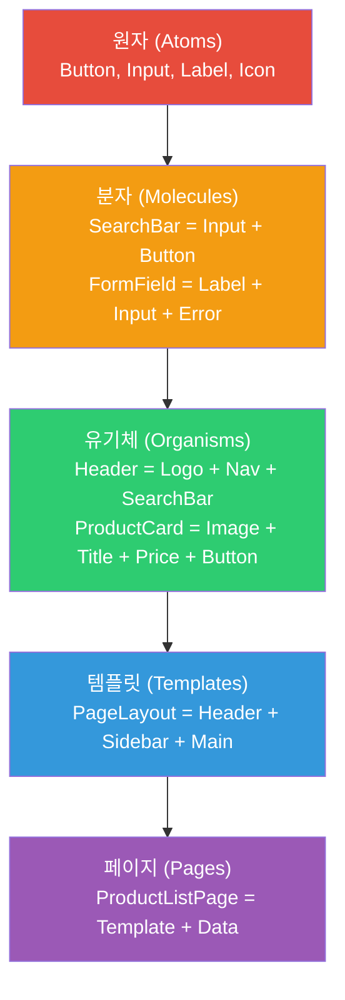
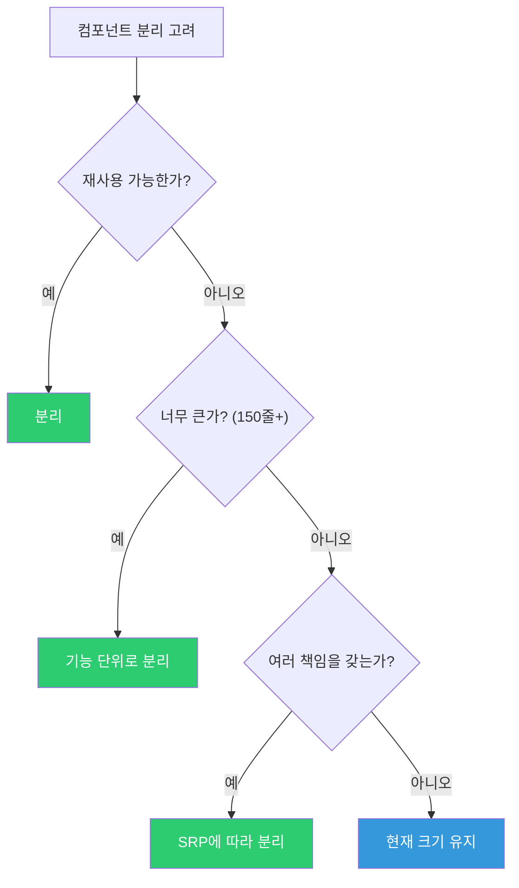
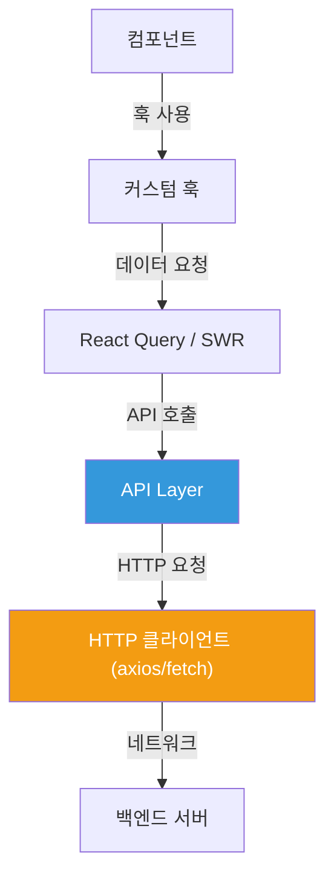
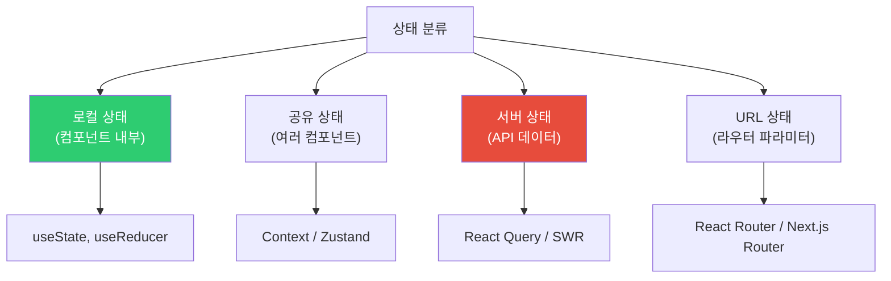
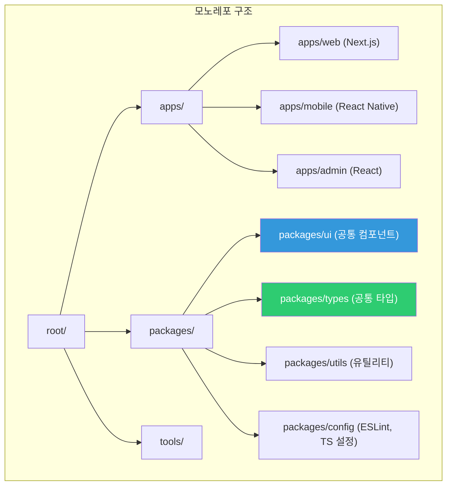
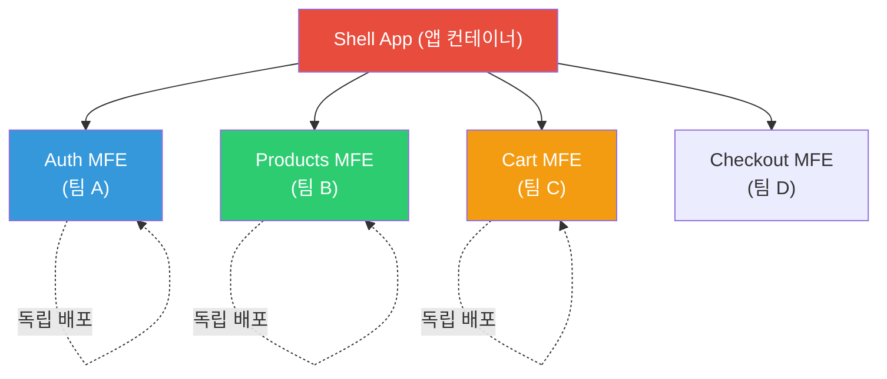
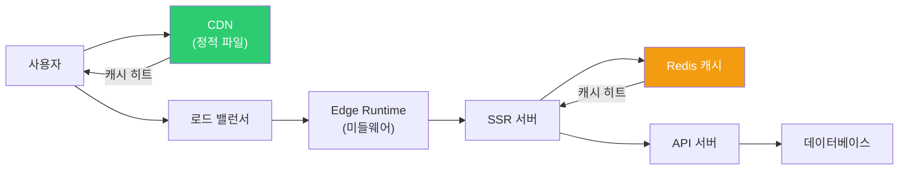
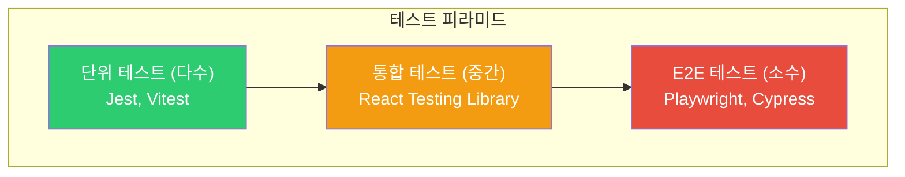
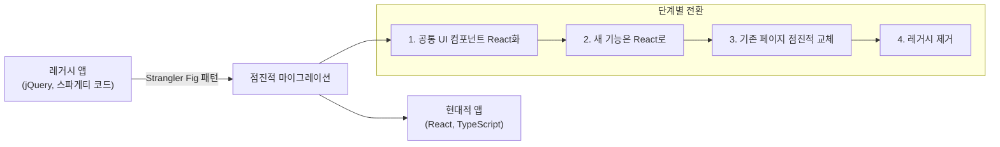
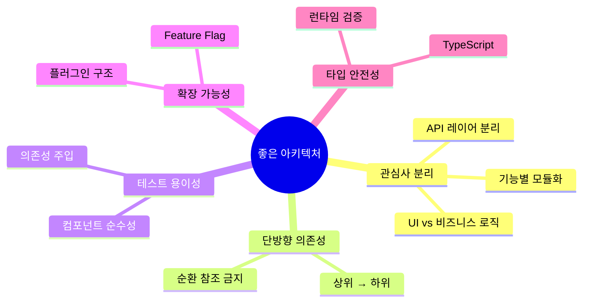

## 도시 계획처럼 생각하기

좋은 도시는 처음부터 잘 설계되어 있습니다. 주거지역, 상업지역, 공원이 분리되어 있고, 도로 체계가 명확합니다. 반면 무계획적으로 성장한 도시는 교통 체증, 슬럼화, 확장 어려움 등의 문제를 겪습니다.

프론트엔드 아키텍처도 마찬가지입니다. 초반 설계가 프로젝트의 미래를 결정합니다.

---

## 1. 컴포넌트 분리 기준

### 아토믹 디자인



### 컴포넌트 분리 판단 기준



---

## 2. 디렉토리 구조

### Feature-Based 구조 (권장)

```
src/
├── components/          # 공통 UI 컴포넌트 (atoms, molecules)
│   ├── ui/
│   │   ├── Button/
│   │   │   ├── Button.tsx
│   │   │   ├── Button.test.tsx
│   │   │   └── index.ts
│   │   ├── Input/
│   │   └── Modal/
│   └── layout/
│       ├── Header/
│       └── Sidebar/
├── features/            # 기능별 모듈
│   ├── auth/
│   │   ├── components/
│   │   │   ├── LoginForm.tsx
│   │   │   └── RegisterForm.tsx
│   │   ├── hooks/
│   │   │   └── useAuth.ts
│   │   ├── api/
│   │   │   └── authApi.ts
│   │   ├── store/
│   │   │   └── authSlice.ts
│   │   └── index.ts     # 공개 API
│   ├── products/
│   └── orders/
├── pages/               # 라우트 컴포넌트
│   ├── HomePage.tsx
│   └── ProductPage.tsx
├── shared/              # 공유 유틸리티
│   ├── api/
│   │   └── httpClient.ts
│   ├── hooks/
│   │   ├── useDebounce.ts
│   │   └── useLocalStorage.ts
│   ├── utils/
│   │   ├── formatDate.ts
│   │   └── validators.ts
│   └── types/
│       └── common.types.ts
├── store/               # 전역 상태
│   └── index.ts
└── App.tsx
```

---

## 3. API Layer 분리



```typescript
// shared/api/httpClient.ts
import axios from 'axios';

const httpClient = axios.create({
  baseURL: process.env.NEXT_PUBLIC_API_URL,
  timeout: 10000
});

// 요청 인터셉터
httpClient.interceptors.request.use(config => {
  const token = localStorage.getItem('token');
  if (token) config.headers.Authorization = `Bearer ${token}`;
  return config;
});

// 응답 인터셉터
httpClient.interceptors.response.use(
  response => response.data,
  async error => {
    if (error.response?.status === 401) {
      await refreshToken();
      return httpClient.request(error.config); // 재시도
    }
    return Promise.reject(error);
  }
);

export default httpClient;

// features/products/api/productsApi.ts
import httpClient from '@/shared/api/httpClient';
import type { Product, CreateProductDto } from '../types';

export const productsApi = {
  getAll: (params?: { category?: string; page?: number }) =>
    httpClient.get<Product[]>('/products', { params }),

  getById: (id: string) =>
    httpClient.get<Product>(`/products/${id}`),

  create: (dto: CreateProductDto) =>
    httpClient.post<Product>('/products', dto),

  update: (id: string, dto: Partial<CreateProductDto>) =>
    httpClient.patch<Product>(`/products/${id}`, dto),

  delete: (id: string) =>
    httpClient.delete(`/products/${id}`)
};

// features/products/hooks/useProducts.ts
import { useQuery, useMutation, useQueryClient } from '@tanstack/react-query';
import { productsApi } from '../api/productsApi';

export function useProducts(params?: { category?: string }) {
  return useQuery({
    queryKey: ['products', params],
    queryFn: () => productsApi.getAll(params)
  });
}

export function useCreateProduct() {
  const queryClient = useQueryClient();

  return useMutation({
    mutationFn: productsApi.create,
    onSuccess: () => {
      queryClient.invalidateQueries({ queryKey: ['products'] });
    }
  });
}
```

---

## 4. 상태 설계 패턴



---

## 5. 에러 처리 전략

```jsx
// ErrorBoundary 컴포넌트
class ErrorBoundary extends React.Component {
  state = { hasError: false, error: null };

  static getDerivedStateFromError(error) {
    return { hasError: true, error };
  }

  componentDidCatch(error, errorInfo) {
    // 에러 리포팅 서비스에 전송
    Sentry.captureException(error, { extra: errorInfo });
  }

  render() {
    if (this.state.hasError) {
      return (
        <ErrorFallback
          error={this.state.error}
          onReset={() => this.setState({ hasError: false })}
        />
      );
    }
    return this.props.children;
  }
}

// 중첩 ErrorBoundary로 세밀한 에러 처리
function App() {
  return (
    <ErrorBoundary fallback={<GlobalError />}>
      <Layout>
        <ErrorBoundary fallback={<SidebarError />}>
          <Sidebar />
        </ErrorBoundary>
        <ErrorBoundary fallback={<ContentError />}>
          <MainContent />
        </ErrorBoundary>
      </Layout>
    </ErrorBoundary>
  );
}
```

---

## 6. 모노레포 구조



```json
// package.json (루트)
{
  "name": "my-monorepo",
  "private": true,
  "workspaces": ["apps/*", "packages/*"],
  "scripts": {
    "build": "turbo run build",
    "dev": "turbo run dev",
    "test": "turbo run test",
    "lint": "turbo run lint"
  },
  "devDependencies": {
    "turbo": "latest",
    "typescript": "^5.0.0"
  }
}

// packages/ui/package.json
{
  "name": "@myapp/ui",
  "exports": {
    ".": "./src/index.ts"
  },
  "dependencies": {
    "react": "^18.0.0"
  }
}

// apps/web에서 사용
// import { Button, Input } from '@myapp/ui';
```

---

## 7. 마이크로 프론트엔드



```javascript
// Module Federation (Webpack 5)
// apps/shell/webpack.config.js
module.exports = {
  plugins: [
    new ModuleFederationPlugin({
      name: 'shell',
      remotes: {
        products: 'products@http://localhost:3001/remoteEntry.js',
        cart: 'cart@http://localhost:3002/remoteEntry.js'
      }
    })
  ]
};

// apps/products/webpack.config.js
module.exports = {
  plugins: [
    new ModuleFederationPlugin({
      name: 'products',
      filename: 'remoteEntry.js',
      exposes: {
        './ProductList': './src/ProductList',
        './ProductDetail': './src/ProductDetail'
      }
    })
  ]
};

// shell에서 사용
const ProductList = lazy(() => import('products/ProductList'));
```

---

## 8. 성능 아키텍처



---

## 9. 타입 안전성

```typescript
// 공통 타입 정의
// packages/types/src/api.types.ts

export type ApiResponse<T> = {
  data: T;
  meta: {
    page: number;
    total: number;
  };
};

export type ApiError = {
  code: string;
  message: string;
  details?: Record<string, string[]>;
};

// 타입 가드
export function isApiError(error: unknown): error is ApiError {
  return (
    typeof error === 'object' &&
    error !== null &&
    'code' in error &&
    'message' in error
  );
}

// Zod로 런타임 타입 검증
import { z } from 'zod';

const ProductSchema = z.object({
  id: z.string().uuid(),
  name: z.string().min(1).max(100),
  price: z.number().positive(),
  category: z.enum(['electronics', 'clothing', 'food']),
  createdAt: z.string().datetime()
});

type Product = z.infer<typeof ProductSchema>;

async function fetchProduct(id: string): Promise<Product> {
  const data = await httpClient.get(`/products/${id}`);
  return ProductSchema.parse(data); // 런타임 검증
}
```

---

## 10. 테스트 아키텍처



---

## 11. 극한 시나리오 - 레거시 마이그레이션



```javascript
// 레거시 jQuery와 React 공존
// iframe 또는 Custom Element로 격리

// React를 Custom Element로 래핑
class ReactWidget extends HTMLElement {
  connectedCallback() {
    const mountPoint = document.createElement('div');
    this.attachShadow({ mode: 'open' }).appendChild(mountPoint);

    ReactDOM.createRoot(mountPoint).render(
      <React.StrictMode>
        <ReactComponent props={this.dataset} />
      </React.StrictMode>
    );
  }
}

customElements.define('react-widget', ReactWidget);

// 레거시 HTML에서 사용
// <react-widget data-user-id="123"></react-widget>
```

---

## 12. 정리 - 좋은 아키텍처의 원칙



좋은 프론트엔드 아키텍처의 핵심은 **"변경이 쉬운 구조"**입니다. 비즈니스 요구사항은 항상 바뀌므로, 변경의 영향이 최소화되는 경계를 잘 설정하는 것이 가장 중요합니다.
