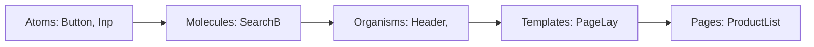
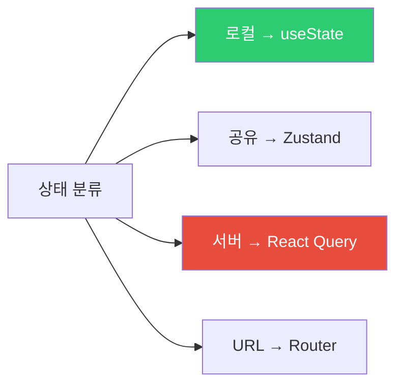
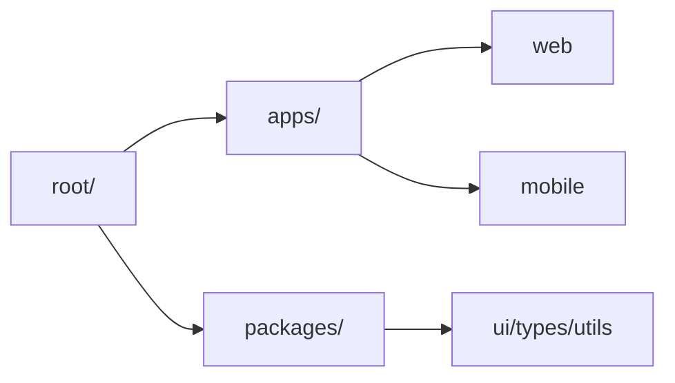
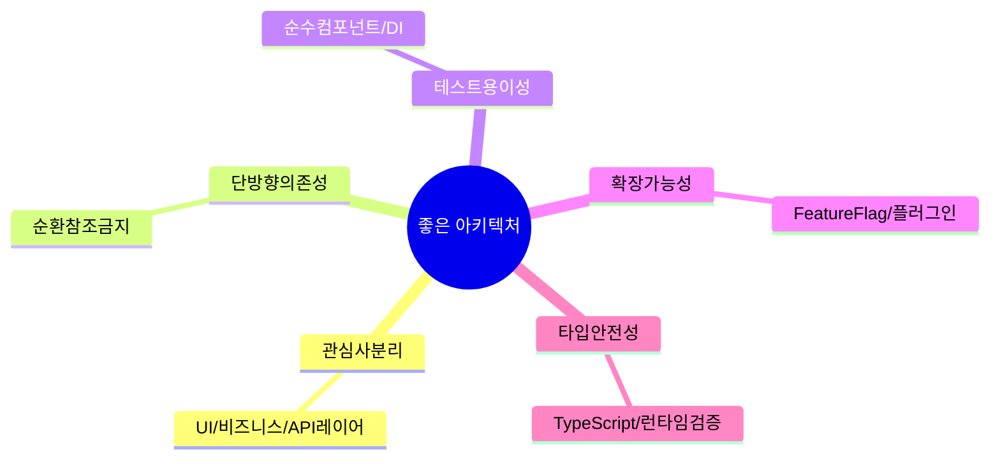

## 도시를 처음부터 다시 지을 수는 없다

서울과 뉴욕의 차이를 생각해 보세요. 뉴욕 맨해튼은 격자형 도로 체계로 설계되어 있어서, 처음 방문한 사람도 "14번가에서 좌회전하면 5번 에비뉴"처럼 쉽게 길을 찾을 수 있습니다. 반면 무계획적으로 성장한 도시는 교통 체증, 확장 어려움, 골목마다 다른 규칙으로 혼란이 생깁니다.

프론트엔드 프로젝트도 마찬가지입니다. **초반에 구조를 잘못 잡으면 프로젝트가 커질수록 수정 비용이 기하급수적으로 늘어납니다.** 나중에 아키텍처를 바꾸려면 사실상 도시를 다시 지어야 하는 것과 같습니다.

좋은 아키텍처의 핵심 질문은 하나입니다. "6개월 후 이 코드에 새 기능을 추가할 때, 어디를 바꿔야 하는지 바로 알 수 있는가?"

---

## 1. 컴포넌트 분리 기준 — 아토믹 디자인

아토믹 디자인은 "컴포넌트를 어떻게 쪼갤까"에 대한 체계적인 답입니다. 화학에서 물질이 원자 → 분자 → 화합물로 구성되듯, UI도 작은 단위에서 큰 단위로 조합됩니다.

> 비유: 레고 블록을 생각해 보세요. 1x1 블록(원자), 2x4 블록(분자), 문 모듈(유기체), 집 설계도(템플릿), 완성된 집(페이지)처럼 계층적으로 조합됩니다.



### 컴포넌트 분리 판단 기준

컴포넌트를 분리할지 말지 헷갈릴 때 사용하는 체크리스트입니다.

```mermaid
flowchart LR
    A["컴포넌트 분리 고려"] --> B{"재사용 가능한가?"}
    B -->|"예"| C["분리 — 다른 곳에서도..|"아니오"| D{"너무 큰가? 150줄 ..|"예"| E["기능 단위로 분리"]
    style C fill:#2ecc71,color:#fff
    style E fill:#2ecc71,color:#fff
    style G fill:#2ecc71,color:#fff
    style H fill:#3498db,color:#fff
```

만약 이걸 안 하면? 한 컴포넌트가 2000줄이 되고, 버그 하나 고치려면 어디서 고쳐야 할지 모르는 상황이 됩니다. 실제 프로젝트에서 가장 흔하게 발생하는 문제입니다.

---

## 2. 디렉토리 구조 — Feature-Based 구조

디렉토리 구조는 팀이 "이 코드가 어디 있지?"라는 질문에 바로 답할 수 있는지를 결정합니다.

> 비유: 도서관의 분류 체계와 같습니다. 책을 "색깔별"로 정리하면 찾기 어렵지만(Type-Based), "주제별"로 정리하면 쉽게 찾을 수 있습니다(Feature-Based).

```
src/
├── components/          # 공통 UI 컴포넌트 (atoms, molecules)
│   ├── ui/
│   │   ├── Button/
│   │   │   ├── Button.tsx
│   │   │   ├── Button.test.tsx
│   │   │   └── index.ts
│   │   ├── Input/
│   │   └── Modal/
│   └── layout/
│       ├── Header/
│       └── Sidebar/
├── features/            # 기능별 모듈 — 이것이 핵심
│   ├── auth/
│   │   ├── components/  # auth에서만 쓰는 컴포넌트
│   │   │   ├── LoginForm.tsx
│   │   │   └── RegisterForm.tsx
│   │   ├── hooks/
│   │   │   └── useAuth.ts
│   │   ├── api/
│   │   │   └── authApi.ts
│   │   ├── store/
│   │   │   └── authSlice.ts
│   │   └── index.ts     # 외부에 공개할 것만 export
│   ├── products/
│   └── orders/
├── pages/               # 라우트 컴포넌트
├── shared/              # 여러 feature에서 공유하는 것
│   ├── api/
│   │   └── httpClient.ts
│   ├── hooks/
│   │   ├── useDebounce.ts
│   │   └── useLocalStorage.ts
│   └── utils/
└── App.tsx
```

이 구조의 핵심은 **feature 안의 코드는 feature 안에서만 수정**하면 된다는 점입니다. `auth` 기능을 수정할 때 `products`나 `orders` 폴더를 건드릴 필요가 없습니다.

---

## 3. API Layer 분리 — 네트워크 코드는 컴포넌트 밖으로

컴포넌트가 직접 `fetch`를 호출하는 코드는 테스트하기 어렵고, API URL이 바뀌면 모든 컴포넌트를 수정해야 합니다.

```mermaid
graph LR
    COMPONENT["컴포넌트"] -->|"훅 사용"| HOOKS["커스텀 훅"]
..|"데이터 요청"| REACT_QUERY["Re..|"API 호출"| API_LAYER["API ..|"HTTP 요청"| HTTP_CLIENT["HT..|"네트워크"| SERVER["백엔드 서버"]
    style API_LAYER fill:#3498db,color:#fff
    style HTTP_CLIENT fill:#f39c12,color:#fff
```

> 비유: 컴포넌트가 직접 서버에 요청하는 것은 손님이 직접 주방에 들어가서 음식을 가져오는 것과 같습니다. 대신 웨이터(API Layer)를 두면, 주방(서버)이 바뀌어도 손님(컴포넌트)은 영향을 받지 않습니다.

```typescript
// shared/api/httpClient.ts — 모든 HTTP 요청의 관문
import axios from 'axios';

const httpClient = axios.create({
  baseURL: process.env.NEXT_PUBLIC_API_URL,
  timeout: 10000
});

// 요청 인터셉터: 모든 요청에 토큰 자동 추가
httpClient.interceptors.request.use(config => {
  const token = localStorage.getItem('token');
  if (token) config.headers.Authorization = `Bearer ${token}`;
  return config;
});

// 응답 인터셉터: 401이면 토큰 갱신 후 재시도
httpClient.interceptors.response.use(
  response => response.data,
  async error => {
    if (error.response?.status === 401) {
      await refreshToken();
      return httpClient.request(error.config);
    }
    return Promise.reject(error);
  }
);

export default httpClient;

// features/products/api/productsApi.ts — 도메인별 API 정의
export const productsApi = {
  getAll: (params?: { category?: string; page?: number }) =>
    httpClient.get<Product[]>('/products', { params }),

  getById: (id: string) =>
    httpClient.get<Product>(`/products/${id}`),

  create: (dto: CreateProductDto) =>
    httpClient.post<Product>('/products', dto)
};

// features/products/hooks/useProducts.ts — 컴포넌트가 실제로 쓰는 인터페이스
export function useProducts(params?: { category?: string }) {
  return useQuery({
    queryKey: ['products', params],
    queryFn: () => productsApi.getAll(params)
  });
}
```

---

## 4. 상태 설계 패턴 — 상태를 분류하면 라이브러리 선택이 쉬워진다



많은 개발자가 하는 실수는 API 데이터(서버 상태)를 `useState`로 직접 관리하는 것입니다. 서버 상태는 캐싱, 백그라운드 갱신, 에러 재시도, 중복 요청 제거 같은 복잡한 요구사항이 있습니다. React Query나 SWR이 이것을 다 처리해 줍니다.

---

## 5. 에러 처리 전략 — ErrorBoundary로 부분 장애 처리

컴포넌트에서 예상치 못한 에러가 발생하면 React 앱 전체가 흰 화면으로 망가집니다. ErrorBoundary는 에러 발생 시 앱 전체가 아닌 **해당 영역만** 대체 UI를 보여줍니다.

> 비유: 건물의 방화 구획과 같습니다. 한 방에서 불이 나도 다른 방으로 번지지 않도록 구획을 나눕니다. ErrorBoundary가 없으면 사이드바 버그가 메인 콘텐츠까지 망가뜨립니다.

```jsx
class ErrorBoundary extends React.Component {
  state = { hasError: false, error: null };

  static getDerivedStateFromError(error) {
    return { hasError: true, error };
  }

  componentDidCatch(error, errorInfo) {
    // 에러 리포팅 서비스에 전송 (Sentry 등)
    Sentry.captureException(error, { extra: errorInfo });
  }

  render() {
    if (this.state.hasError) {
      return (
        <ErrorFallback
          error={this.state.error}
          onReset={() => this.setState({ hasError: false })}
        />
      );
    }
    return this.props.children;
  }
}

// 중첩 ErrorBoundary로 세밀한 에러 처리
function App() {
  return (
    <ErrorBoundary fallback={<GlobalError />}>
      <Layout>
        <ErrorBoundary fallback={<SidebarError />}>
          <Sidebar />
        </ErrorBoundary>
        <ErrorBoundary fallback={<ContentError />}>
          <MainContent />
        </ErrorBoundary>
      </Layout>
    </ErrorBoundary>
  );
}
```

---

## 6. 모노레포 구조 — 하나의 저장소, 여러 앱

팀이 커지면 웹 앱, 모바일 앱, 관리자 페이지가 공통 컴포넌트와 타입을 공유해야 합니다. 모노레포는 이것을 하나의 저장소에서 관리하는 방식입니다.



> 비유: 한 회사의 여러 부서가 같은 복지 제도, 같은 업무 시스템을 공유하는 것과 같습니다. 각 팀은 독립적으로 일하지만, 공통 인프라는 함께 씁니다.

**실전 구현 — Turborepo 모노레포 설정:**

```json
// turbo.json — 빌드 파이프라인 정의
{
  "$schema": "https://turbo.build/schema.json",
  "pipeline": {
    "build": {
      "dependsOn": ["^build"],  // 의존 패키지 먼저 빌드
      "outputs": [".next/**", "dist/**"]
    },
    "dev": {
      "cache": false,
      "persistent": true
    },
    "lint": {
      "outputs": []
    },
    "test": {
      "dependsOn": ["build"],
      "outputs": ["coverage/**"]
    }
  }
}
```

```json
// package.json (루트)
{
  "name": "my-monorepo",
  "private": true,
  "workspaces": ["apps/*", "packages/*"],
  "scripts": {
    "dev": "turbo run dev",
    "build": "turbo run build",
    "lint": "turbo run lint",
    "test": "turbo run test"
  },
  "devDependencies": {
    "turbo": "latest"
  }
}
```

```typescript
// packages/ui/src/Button.tsx — 공유 컴포넌트
export interface ButtonProps {
    children: React.ReactNode;
    variant?: 'primary' | 'secondary' | 'ghost';
    size?: 'sm' | 'md' | 'lg';
    onClick?: () => void;
    disabled?: boolean;
}

export function Button({ children, variant = 'primary', size = 'md', ...props }: ButtonProps) {
    return (
        <button
            className={`btn btn-${variant} btn-${size}`}
            {...props}
        >
            {children}
        </button>
    );
}
```

```json
// packages/ui/package.json
{
  "name": "@myapp/ui",
  "version": "0.0.1",
  "main": "./src/index.ts",
  "exports": {
    ".": "./src/index.ts"
  }
}
```

```typescript
// packages/types/src/index.ts — 공유 타입 정의
export interface User {
    id: string;
    name: string;
    email: string;
    role: 'admin' | 'user';
}

export interface Product {
    id: string;
    name: string;
    price: number;
    stock: number;
}

export interface ApiResponse<T> {
    data: T;
    message: string;
    success: boolean;
}
```

```typescript
// apps/web/app/page.tsx — 공유 패키지 사용
import { Button } from '@myapp/ui';
import type { Product } from '@myapp/types';

export default function HomePage() {
    return (
        <main>
            <Button variant="primary" size="lg">
                시작하기
            </Button>
        </main>
    );
}
```

```bash
# 전체 빌드 (의존성 순서 자동 처리)
npx turbo run build

# web 앱만 dev 모드
npx turbo run dev --filter=web

# 변경된 패키지만 테스트 (캐시 활용)
npx turbo run test --filter=...[HEAD^1]
```

---

## 7. 마이크로 프론트엔드 — 팀별 독립 배포

대규모 조직에서는 여러 팀이 하나의 프론트엔드를 동시에 개발합니다. 마이크로 프론트엔드는 각 팀이 독립적으로 개발하고 배포할 수 있게 합니다.

```mermaid
graph LR
    SHELL["Shell App"]
    SHELL --> AUTH["Auth MFE 팀A"]
    SHELL --> PRODUCTS["Products MFE 팀B"]
    SHELL --> CART["Cart MFE 팀C"]
    AUTH -.->|"독립 배포"| AUTH
    PRODUC..|"독립 배포"| PRODUCTS
    CA..|"독립 배포"| CART
    style SHELL fill:#e74c3c,color:#fff
    style AUTH fill:#3498db,color:#fff
    style PRODUCTS fill:#2ecc71,color:#fff
    style CART fill:#f39c12,color:#fff
```

```javascript
// Module Federation (Webpack 5) — 런타임에 원격 모듈 로드
// apps/shell/webpack.config.js
module.exports = {
  plugins: [
    new ModuleFederationPlugin({
      name: 'shell',
      remotes: {
        products: 'products@http://localhost:3001/remoteEntry.js',
        cart: 'cart@http://localhost:3002/remoteEntry.js'
      }
    })
  ]
};

// shell에서 마치 로컬 컴포넌트처럼 사용
const ProductList = lazy(() => import('products/ProductList'));
```

---

## 8. 타입 안전성 — 런타임 검증까지

TypeScript 타입은 컴파일 타임에만 동작합니다. 서버에서 받은 데이터가 실제로 예상한 타입인지 런타임에도 확인해야 합니다.

> 비유: 식재료를 주문할 때(타입 선언), "신선한 재료를 보내주세요"라고 계약했습니다. 그런데 실제로 도착한 것이 정말 신선한지는 받아서 확인(런타임 검증)해야 합니다.

```typescript
// Zod로 런타임 타입 검증 — API 응답이 실제로 맞는지 확인
import { z } from 'zod';

const ProductSchema = z.object({
  id: z.string().uuid(),
  name: z.string().min(1).max(100),
  price: z.number().positive(),
  category: z.enum(['electronics', 'clothing', 'food']),
  createdAt: z.string().datetime()
});

type Product = z.infer<typeof ProductSchema>; // TypeScript 타입 자동 추론

async function fetchProduct(id: string): Promise<Product> {
  const data = await httpClient.get(`/products/${id}`);
  return ProductSchema.parse(data); // 파싱 실패 시 즉시 에러
}
```

만약 이걸 안 하면? 서버가 갑자기 필드 이름을 바꾸거나 빠뜨려도 타입 에러가 나지 않고, 런타임에서 `undefined is not a function` 같은 이상한 에러가 납니다.

---

## 9번 다이어그램 - 좋은 아키텍처의 원칙



### 레거시 마이그레이션 — Strangler Fig 패턴

기존 jQuery 스파게티 코드를 React로 전환할 때, 한꺼번에 바꾸는 것은 너무 위험합니다. Strangler Fig 패턴은 **새 기능은 React로, 기존 코드는 그대로 두면서 점진적으로 교체**하는 방식입니다.

```javascript
// 레거시 jQuery와 React 공존 — Custom Element로 격리
class ReactWidget extends HTMLElement {
  connectedCallback() {
    const mountPoint = document.createElement('div');
    this.attachShadow({ mode: 'open' }).appendChild(mountPoint);

    ReactDOM.createRoot(mountPoint).render(
      <React.StrictMode>
        <ReactComponent props={this.dataset} />
      </React.StrictMode>
    );
  }
}

customElements.define('react-widget', ReactWidget);

// 레거시 HTML에서 사용
// <react-widget data-user-id="123"></react-widget>
```

좋은 프론트엔드 아키텍처의 핵심은 결국 하나입니다. **"변경이 쉬운 구조"**를 만드는 것입니다. 비즈니스 요구사항은 항상 바뀌므로, 변경의 영향 범위가 최소화되는 경계를 잘 설정하는 것이 가장 중요합니다. 오늘 완벽한 아키텍처보다, 6개월 후에도 수정 가능한 아키텍처가 더 좋은 아키텍처입니다.

---

## 왜 이 아키텍처인가? (vs 파일 유형별 분류 vs 모놀리식)

| 방식 | 구조 예시 | 장점 | 한계 |
|---|---|---|---|
| 파일 유형별 | `components/`, `hooks/`, `utils/` | 단순, 소규모에 빠름 | 기능 추가 시 여러 폴더 동시 수정 |
| Feature-based | `features/cart/`, `features/product/` | 도메인 응집, 팀 분리 용이 | 공통 코드 중복 가능성 |
| Atomic Design | `atoms/`, `molecules/`, `organisms/` | UI 재사용성 최고 | 비즈니스 로직 위치 불명확 |
| Clean Architecture | `domain/`, `application/`, `infrastructure/` | 의존성 방향 명확 | 과도한 추상화 위험 |

팀 규모 5명 미만 + 스타트업: Feature-based가 속도와 구조의 균형에 가장 적합하다. 10명 이상 + 디자인 시스템 팀 분리: Atomic Design + Feature-based 하이브리드.

---

## 실무에서 자주 하는 실수

### 실수 1: Presentation 컴포넌트에 API 호출 직접 삽입

```tsx
// 나쁜 예 — UI 컴포넌트가 데이터 출처를 알고 있음
function ProductCard({ id }) {
  const [product, setProduct] = useState(null)
  useEffect(() => {
    fetch(`/api/products/${id}`).then(...)  // Presentation에 API 직접 호출
  }, [id])
  return <div>{product?.name}</div>
}

// 좋은 예 — Container가 데이터, Presentation은 렌더링만
function ProductCard({ name, price }) {  // 순수 props
  return <div>{name} - {price}</div>
}
function ProductCardContainer({ id }) {
  const { data } = useProduct(id)  // 커스텀 훅에서 fetch
  return <ProductCard name={data?.name} price={data?.price} />
}
```

### 실수 2: features/ 내부 구현을 직접 import

```typescript
// 나쁜 예 — 내부 구현에 직접 의존
import { CartItemRow } from '@/features/cart/components/CartItemRow'

// 좋은 예 — index.ts 공개 API만 사용
import { CartItemRow } from '@/features/cart'
// features/cart/index.ts에서 공개할 것만 export
```

`index.ts`가 없으면 어디서든 내부 파일에 접근 가능해져 모듈 경계가 무너진다.

### 실수 3: 필터/검색 상태를 전역 스토어에 넣음

URL 파라미터로 관리해야 할 상태(필터, 페이지, 검색어)를 Redux/Zustand에 넣으면 뒤로 가기, 공유 링크, 새로고침 시 상태가 초기화된다.

```typescript
// 나쁜 예 — 전역 스토어의 필터 상태
const { filter, setFilter } = useFilterStore()

// 좋은 예 — URL 쿼리 파라미터로 관리
const [searchParams, setSearchParams] = useSearchParams()
const filter = searchParams.get('filter') ?? 'all'
const setFilter = (val) => setSearchParams({ filter: val })
```

---

## 면접 포인트

**Q1. Container-Presentation 패턴이 테스트에 유리한 이유는?**

Presentation 컴포넌트는 props만 받아 렌더링하는 순수 함수다. 네트워크, 전역 상태에 의존하지 않으므로 단위 테스트가 단순해진다. Container는 데이터 로직을 담당하며 Mock 훅으로 격리 테스트한다. 이 분리가 없으면 컴포넌트 테스트에 항상 API Mock 설정이 필요해진다.

**Q2. 상태를 어디에 둘지 결정하는 기준은?**

4단계로 분류한다. (1) 컴포넌트 내부 UI 상태(모달 열림/닫힘) → `useState`. (2) 부모-자식 간 공유 → props 또는 context. (3) 서버에서 가져온 데이터 → React Query/SWR(서버 상태). (4) 여러 feature에서 공유하는 클라이언트 상태(장바구니, 인증) → Zustand/Jotai. Redux는 복잡한 상태 트랜지션과 미들웨어가 필요할 때만 도입한다.

**Q3. Atomic Design의 `organisms`와 `templates`의 구분 기준은?**

`molecules`는 2개 이상의 atom 조합(검색 입력창+버튼). `organisms`는 독립적인 비즈니스 의미가 있는 섹션(헤더 네비게이션, 상품 카드 리스트). `templates`는 organisms의 레이아웃 배치(페이지 골격). `pages`는 실제 데이터가 들어간 templates. 실무에서는 molecules/organisms 경계가 모호해지므로 팀 내 명확한 기준을 사전에 합의해야 한다.

**Q4. 모노레포에서 패키지 경계를 어떻게 설계하는가?**

`packages/ui` (디자인 시스템), `packages/api-client` (API 호출 레이어), `packages/utils` (순수 유틸), `apps/web` (Next.js 앱), `apps/mobile` (RN 앱)으로 분리하는 것이 기본이다. 핵심 원칙은 의존성 방향: `apps`는 `packages`를 참조하지만 `packages`는 서로 또는 `apps`를 참조하지 않아야 한다. Turborepo의 `lint-staged`와 workspace 의존성 그래프로 이 경계를 강제한다.
