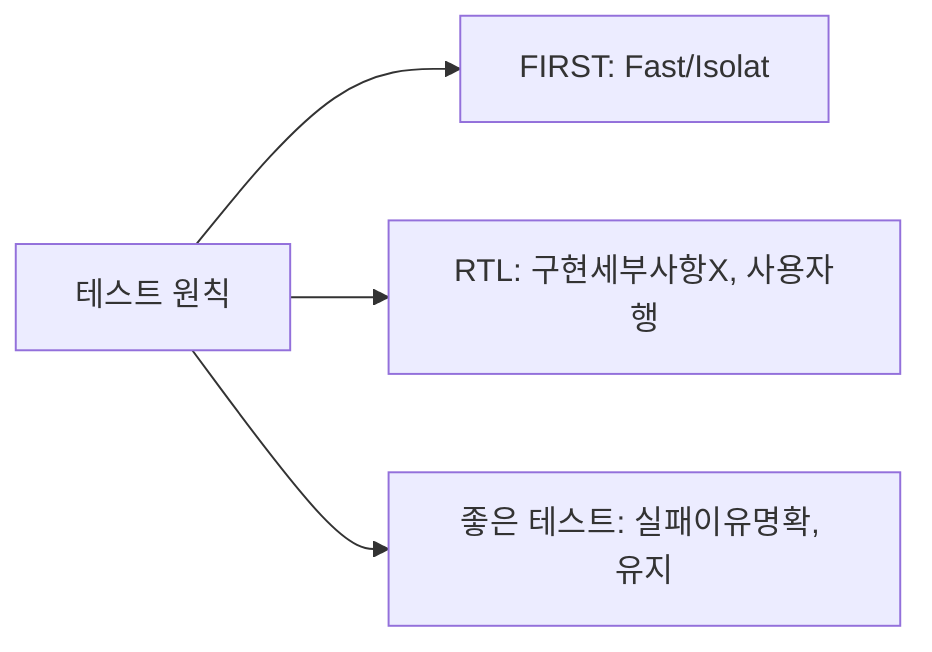
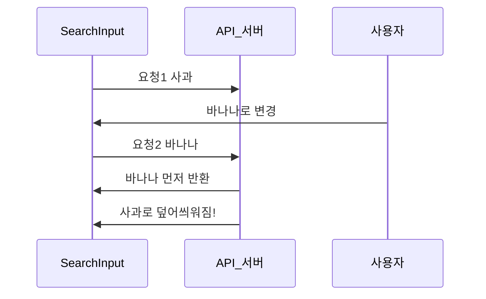

## 자동차 출고 검사처럼

자동차 공장에서 차를 출고할 때 세 단계의 검사를 거칩니다.

1. **부품 검사 (단위 테스트)**: 엔진, 브레이크 등 각 부품이 제대로 작동하는지
2. **조립 검사 (통합 테스트)**: 부품들이 함께 잘 동작하는지
3. **시험 주행 (E2E 테스트)**: 실제 도로에서 처음부터 끝까지 잘 달리는지

이 세 단계를 모두 통과해야 안전한 차가 출고되듯, 좋은 소프트웨어도 세 계층의 테스트가 필요합니다.

테스트를 왜 써야 할까요? 왜냐하면 **테스트가 없는 코드는 건드릴 수 없는 코드**이기 때문입니다. 기능을 고쳤는데 다른 곳이 망가졌는지 알 방법이 없으면, 결국 아무도 코드를 손대지 못하게 됩니다.

---

## 1번 다이어그램 - 테스트 피라미드


| 종류 | 속도 | 비용 | 신뢰성 | 도구 |
|------|------|------|--------|------|
| 단위 테스트 | 매우 빠름 | 낮음 | 높음 | Jest, Vitest |
| 통합 테스트 | 중간 | 중간 | 중간 | React Testing Library |
| E2E 테스트 | 느림 | 높음 | 낮음 | Cypress, Playwright |

왜 E2E 테스트를 적게 작성해야 할까요? 이유는 E2E 테스트는 실제 브라우저에서 실행되기 때문에 느리고, 네트워크 상태나 타이밍 이슈로 이유 없이 실패하는 경우가 많습니다. 핵심 사용자 흐름만 커버하고, 세부 로직은 단위 테스트로 검증하는 것이 효율적입니다.

---

## 2. Jest — 단위 테스트의 기본

### 순수 함수 테스트 — 가장 쉽고 가치 있는 테스트

순수 함수는 같은 입력에 항상 같은 출력을 냅니다. 그래서 테스트하기 가장 쉽고, 가장 안정적입니다.

> 비유: 계산기의 더하기 버튼 테스트입니다. 3 + 4를 누르면 항상 7이 나와야 합니다. 외부 상태, 네트워크, 시간과 무관합니다.

```javascript
// utils/formatters.ts
export function formatPrice(price: number, currency = 'KRW'): string {
  return new Intl.NumberFormat('ko-KR', {
    style: 'currency',
    currency
  }).format(price);
}

export function truncate(text: string, maxLength: number): string {
  if (text.length <= maxLength) return text;
  return `${text.slice(0, maxLength)}...`;
}

// utils/formatters.test.ts
describe('formatPrice', () => {
  it('원화 형식으로 포맷팅', () => {
    expect(formatPrice(10000)).toBe('₩10,000');
  });

  it('음수 가격 처리', () => {
    expect(formatPrice(-5000)).toBe('-₩5,000');
  });

  it('달러 형식 포맷팅', () => {
    expect(formatPrice(99.99, 'USD')).toBe('$99.99');
  });
});

describe('truncate', () => {
  it('최대 길이 이하면 원본 반환', () => {
    expect(truncate('Hello', 10)).toBe('Hello');
  });

  it('최대 길이 초과 시 ... 추가', () => {
    expect(truncate('Hello World', 5)).toBe('Hello...');
  });
});
```

### 비동기 함수 테스트 — 네트워크를 가짜로 만들기

비동기 함수는 실제 네트워크를 호출하면 안 됩니다. 왜냐하면 네트워크 상태에 따라 테스트가 실패할 수 있고, 테스트마다 실제 서버를 호출하면 느리고 비용도 생기기 때문입니다.

```javascript
// api/userApi.ts
export async function fetchUser(id: string) {
  const response = await fetch(`/api/users/${id}`);
  if (!response.ok) throw new Error('사용자를 찾을 수 없습니다');
  return response.json();
}

// api/userApi.test.ts
describe('fetchUser', () => {
  beforeEach(() => {
    global.fetch = jest.fn(); // fetch를 가짜로 교체
  });

  afterEach(() => {
    jest.restoreAllMocks();
  });

  it('성공적으로 사용자 반환', async () => {
    const mockUser = { id: '1', name: '홍길동' };

    (global.fetch as jest.Mock).mockResolvedValueOnce({
      ok: true,
      json: () => Promise.resolve(mockUser)
    });

    const user = await fetchUser('1');
    expect(user).toEqual(mockUser);
    expect(global.fetch).toHaveBeenCalledWith('/api/users/1');
  });

  it('404 응답 시 에러 발생', async () => {
    (global.fetch as jest.Mock).mockResolvedValueOnce({
      ok: false,
      status: 404
    });

    await expect(fetchUser('999')).rejects.toThrow('사용자를 찾을 수 없습니다');
  });
});
```

---

## 3. React Testing Library — "사용자처럼 테스트"

RTL의 철학은 한 문장으로 요약됩니다: **"구현 세부사항이 아닌 사용자 관점에서 테스트하라."**

> 비유: 자동차 테스트에서 "엔진 내부 볼트가 몇 개인지" 대신 "출발, 정지, 방향 전환이 잘 되는지"를 테스트하는 것과 같습니다. 내부 구현이 바뀌어도 사용자 경험이 같으면 테스트는 통과해야 합니다.

```jsx
// components/LoginForm.tsx
function LoginForm({ onLogin }) {
  const [email, setEmail] = useState('');
  const [password, setPassword] = useState('');
  const [error, setError] = useState('');

  const handleSubmit = async (e) => {
    e.preventDefault();
    try {
      await onLogin({ email, password });
    } catch (err) {
      setError(err.message);
    }
  };

  return (
    <form onSubmit={handleSubmit} aria-label="로그인 폼">
      <label htmlFor="email">이메일</label>
      <input
        id="email"
        type="email"
        value={email}
        onChange={e => setEmail(e.target.value)}
      />
      <label htmlFor="password">비밀번호</label>
      <input
        id="password"
        type="password"
        value={password}
        onChange={e => setPassword(e.target.value)}
      />
      {error && <p role="alert">{error}</p>}
      <button type="submit">로그인</button>
    </form>
  );
}
```

```javascript
// components/LoginForm.test.tsx
describe('LoginForm', () => {
  it('이메일과 비밀번호 입력 필드가 렌더링됨', () => {
    render(<LoginForm onLogin={jest.fn()} />);

    // 사용자가 보는 것(레이블)으로 요소를 찾습니다
    expect(screen.getByLabelText('이메일')).toBeInTheDocument();
    expect(screen.getByLabelText('비밀번호')).toBeInTheDocument();
    expect(screen.getByRole('button', { name: '로그인' })).toBeInTheDocument();
  });

  it('폼 제출 시 onLogin 호출됨', async () => {
    const user = userEvent.setup();
    const mockOnLogin = jest.fn().mockResolvedValueOnce({ token: 'abc123' });

    render(<LoginForm onLogin={mockOnLogin} />);

    // 사용자가 하는 행동(타이핑, 클릭)을 시뮬레이션
    await user.type(screen.getByLabelText('이메일'), 'test@example.com');
    await user.type(screen.getByLabelText('비밀번호'), 'password123');
    await user.click(screen.getByRole('button', { name: '로그인' }));

    expect(mockOnLogin).toHaveBeenCalledWith({
      email: 'test@example.com',
      password: 'password123'
    });
  });

  it('로그인 실패 시 에러 메시지 표시', async () => {
    const user = userEvent.setup();
    const mockOnLogin = jest.fn().mockRejectedValueOnce(
      new Error('이메일 또는 비밀번호가 틀렸습니다')
    );

    render(<LoginForm onLogin={mockOnLogin} />);

    await user.type(screen.getByLabelText('이메일'), 'wrong@example.com');
    await user.type(screen.getByLabelText('비밀번호'), 'wrongpass');
    await user.click(screen.getByRole('button', { name: '로그인' }));

    // role="alert"로 찾음 — 스크린 리더도 사용자가 아닌가요
    await waitFor(() => {
      expect(screen.getByRole('alert')).toHaveTextContent(
        '이메일 또는 비밀번호가 틀렸습니다'
      );
    });
  });
});
```

---

## 4. MSW — 실제 네트워크 레이어를 가로채기

MSW(Mock Service Worker)는 `jest.fn()`으로 fetch를 모킹하는 것보다 훨씬 현실적입니다. 왜냐하면 실제 HTTP 요청을 보내고 서비스 워커 레벨에서 가로채기 때문에, 앱 코드를 전혀 수정하지 않고 테스트할 수 있습니다.

> 비유: 가짜 fetch(jest.fn())는 전화선을 아예 끊어버리고 가짜 목소리를 내는 것입니다. MSW는 실제 전화를 걸되, 교환원(서비스 워커)이 중간에 응답을 가로채는 방식입니다. 훨씬 현실적입니다.

```javascript
// mocks/handlers.ts
import { http, HttpResponse } from 'msw';

export const handlers = [
  http.get('/api/users', ({ request }) => {
    const url = new URL(request.url);
    const page = Number(url.searchParams.get('page') ?? '1');

    return HttpResponse.json({
      users: [
        { id: '1', name: '홍길동', email: 'hong@example.com' },
        { id: '2', name: '김철수', email: 'kim@example.com' }
      ],
      total: 2,
      page
    });
  }),

  http.post('/api/auth/login', async ({ request }) => {
    const { email, password } = await request.json();

    if (email === 'admin@example.com' && password === 'password') {
      return HttpResponse.json({ token: 'mock-jwt-token' });
    }

    return HttpResponse.json(
      { error: '이메일 또는 비밀번호가 틀렸습니다' },
      { status: 401 }
    );
  })
];

// mocks/server.ts
export const server = setupServer(...handlers);

// jest.setup.ts
beforeAll(() => server.listen());
afterEach(() => server.resetHandlers()); // 각 테스트 후 핸들러 초기화
afterAll(() => server.close());
```

### MSW로 특정 에러 시나리오 테스트

```javascript
it('서버 오류 시 에러 처리', async () => {
  // 이 테스트에서만 500 응답 반환
  server.use(
    http.post('/api/auth/login', () => {
      return HttpResponse.json(
        { error: '서버 오류' },
        { status: 500 }
      );
    })
  );

  const user = userEvent.setup();
  render(<LoginPage />, { wrapper: TestProviders });

  await user.click(screen.getByRole('button', { name: '로그인' }));

  await waitFor(() => {
    expect(screen.getByText('서버 오류가 발생했습니다')).toBeInTheDocument();
  });
});
```

---

## 5. Cypress — E2E 테스트

E2E 테스트는 실제 브라우저에서 실제 사용자 흐름을 처음부터 끝까지 테스트합니다. 단위/통합 테스트로는 발견하기 어려운 **페이지 간 전환, 인증 플로우, 복잡한 사용자 시나리오**를 검증합니다.

```javascript
// cypress/e2e/shopping-flow.cy.ts
describe('쇼핑 플로우', () => {
  beforeEach(() => {
    cy.intercept('GET', '/api/products*', { fixture: 'products.json' }).as('getProducts');
    cy.intercept('POST', '/api/cart', { statusCode: 201 }).as('addToCart');
    cy.intercept('POST', '/api/orders', { fixture: 'order.json' }).as('createOrder');
  });

  it('상품 검색 → 장바구니 추가 → 주문 완료', () => {
    cy.visit('/');
    cy.wait('@getProducts');

    cy.get('[data-testid="search-input"]').type('맥북');
    cy.get('[data-testid="search-button"]').click();
    cy.url().should('include', '/search?q=맥북');

    cy.contains('맥북 프로').click();
    cy.get('[data-testid="add-to-cart"]').click();
    cy.wait('@addToCart');
    cy.get('[data-testid="cart-count"]').should('contain', '1');

    cy.visit('/cart');
    cy.contains('맥북 프로').should('be.visible');

    cy.get('[data-testid="checkout-btn"]').click();
    cy.get('[data-testid="confirm-order"]').click();
    cy.wait('@createOrder');

    cy.url().should('include', '/orders/success');
    cy.contains('주문이 완료되었습니다').should('be.visible');
  });
});
```

---

## 6. 테스트 작성 원칙 — 좋은 테스트 vs 나쁜 테스트



```javascript
// 나쁜 테스트: 구현 세부사항을 테스트
it('useState를 올바르게 호출', () => {
  const spy = jest.spyOn(React, 'useState');
  render(<Counter />);
  expect(spy).toHaveBeenCalledWith(0);
  // 왜 나쁜가? useState 대신 useReducer로 바꾸면 이 테스트는 깨집니다.
  // 하지만 사용자 경험은 그대로입니다.
});

// 좋은 테스트: 사용자 행동을 테스트
it('증가 버튼 클릭 시 카운트 증가', async () => {
  const user = userEvent.setup();
  render(<Counter />);

  const count = screen.getByTestId('count');
  const button = screen.getByRole('button', { name: '증가' });

  expect(count).toHaveTextContent('0');
  await user.click(button);
  expect(count).toHaveTextContent('1');
  // 왜 좋은가? 내부 구현이 어떻게 바뀌어도, 버튼 클릭 시 카운트가
  // 증가하는 동작이 유지되면 이 테스트는 통과합니다.
});
```

---

## 2번 다이어그램 - 극한 시나리오 — 레이스 컨디션 테스트

비동기 경쟁 조건은 실제 사용자가 겪는 버그 중 재현하기 가장 어려운 종류입니다. 검색창에 빠르게 타이핑할 때 첫 번째 요청이 두 번째 요청보다 늦게 도착하면, 오래된 결과가 화면에 남는 버그가 생깁니다.



```javascript
it('빠른 타이핑 시 마지막 결과만 표시', async () => {
  let resolveFirst: (v: any) => void;
  let resolveSecond: (v: any) => void;

  const mockSearch = jest.fn()
    .mockImplementationOnce(() => new Promise(r => { resolveFirst = r; }))
    .mockImplementationOnce(() => new Promise(r => { resolveSecond = r; }));

  const user = userEvent.setup();
  render(<SearchInput onSearch={mockSearch} />);

  const input = screen.getByRole('searchbox');

  await user.type(input, '사과');
  await user.clear(input);
  await user.type(input, '바나나');

  // 두 번째(바나나)가 먼저 완료
  resolveSecond!([{ name: '바나나' }]);
  await screen.findByText('바나나');

  // 첫 번째(사과)가 나중에 완료되어도 결과를 무시해야 함
  resolveFirst!([{ name: '사과' }]);
  await new Promise(r => setTimeout(r, 100));

  expect(screen.queryByText('사과')).not.toBeInTheDocument();
  expect(screen.getByText('바나나')).toBeInTheDocument();
});
```

---

## 7. CI/CD 통합 — 자동화의 완성

테스트는 자동으로 실행될 때 진짜 가치가 있습니다. PR을 올릴 때마다 자동으로 테스트가 실행되면, 코드 리뷰 전에 이미 기본 품질이 보장됩니다.

```yaml
# .github/workflows/test.yml
name: Test

on: [push, pull_request]

jobs:
  test:
    runs-on: ubuntu-latest
    steps:
      - uses: actions/checkout@v3

      - name: Node.js 설정
        uses: actions/setup-node@v3
        with:
          node-version: '18'
          cache: 'npm'

      - name: 의존성 설치
        run: npm ci

      - name: 단위/통합 테스트
        run: npm run test:coverage

      - name: 커버리지 업로드
        uses: codecov/codecov-action@v3

      - name: E2E 테스트 빌드
        run: npm run build

      - name: Playwright E2E 테스트
        run: npx playwright test

      - name: E2E 결과 업로드 (실패 시)
        uses: actions/upload-artifact@v3
        if: failure()
        with:
          name: playwright-report
          path: playwright-report/
```

테스트의 목적은 **버그를 찾는 것**이 아니라 **버그가 프로덕션에 가지 않도록 막는 것**입니다. 많은 테스트보다 **의미 있는 테스트**가 더 중요합니다. 사용자가 실제로 하는 행동을 테스트하세요. 내부 구현을 테스트하는 것은 리팩토링할 때마다 테스트를 고쳐야 하는 짐이 됩니다.

---

## 왜 이 테스트 전략인가? (vs 커버리지 100% vs 테스트 없음)

| 전략 | 비용 | 신뢰도 | 유지보수 | 적합 상황 |
|---|---|---|---|---|
| 테스트 없음 | 초기 0 | 없음 | N/A | 1회성 프로토타입 |
| 단위 테스트 100% | 높음 | 중간 (구현 변경 시 깨짐) | 높음 | 순수 함수 라이브러리 |
| 통합 테스트 중심 | 중간 | 높음 | 중간 | 컴포넌트 기반 앱 |
| E2E 테스트만 | 낮음 (작성) | 높음 | 낮음 (느리고 불안정) | 핵심 사용자 플로우 |
| Testing Trophy | 중간 | 높음 | 중간 | 대부분의 프론트엔드 앱 |

**Testing Trophy (Kent C. Dodds)**: 정적 분석(TypeScript, ESLint) → 단위 테스트(소량) → 통합 테스트(최다) → E2E(소량). 통합 테스트가 가장 ROI가 높다.

---

## 실무에서 자주 하는 실수

### 실수 1: 구현 세부사항을 테스트

```typescript
// 나쁜 예 — 내부 상태를 직접 검사
test('counter increments', () => {
  const { result } = renderHook(() => useCounter())
  act(() => result.current.increment())
  expect(result.current.count).toBe(1)  // 내부 상태 노출
})

// 좋은 예 — 사용자가 보는 것을 테스트
test('counter increments', async () => {
  render(<Counter />)
  await userEvent.click(screen.getByRole('button', { name: /increment/i }))
  expect(screen.getByText('Count: 1')).toBeInTheDocument()
})
```

구현이 변경되어도(useState → useReducer) 사용자 행동 기반 테스트는 깨지지 않는다.

### 실수 2: 모든 것을 Mock하는 단위 테스트

```typescript
// 나쁜 예 — 너무 많은 Mock으로 실제 동작 검증 불가
jest.mock('../api/products')
jest.mock('../hooks/useCart')
jest.mock('../utils/price')
// 실제로는 아무것도 테스트하지 않음

// 좋은 예 — 외부 의존성(네트워크)만 Mock
import { http, HttpResponse } from 'msw'
const handlers = [
  http.get('/api/products', () => HttpResponse.json([{ id: 1, name: 'Test' }]))
]
// 컴포넌트 → 훅 → API 호출까지 실제 코드 경로 검증
```

### 실수 3: `getByTestId`에 의존

```typescript
// 나쁜 예 — testId는 사용자가 볼 수 없는 구현 세부사항
screen.getByTestId('submit-button')

// 좋은 예 — 접근성 쿼리 사용 (스크린 리더도 테스트됨)
screen.getByRole('button', { name: /제출/i })
screen.getByLabelText('이메일')
screen.getByPlaceholderText('검색어를 입력하세요')
```

---

## 면접 포인트

### Q1. 단위 테스트, 통합 테스트, E2E 테스트의 차이와 각각 언제 쓰는가?
단위 테스트는 순수 함수, 유틸리티, 훅을 격리하여 테스트한다. 빠르고 안정적이다. 통합 테스트는 컴포넌트가 훅, API와 함께 동작하는지 검증한다. RTL(React Testing Library) + MSW 조합이 표준이다. E2E는 Playwright/Cypress로 실제 브라우저에서 사용자 플로우 전체를 검증한다. 느리고 불안정하므로 핵심 플로우(로그인, 결제)에만 사용한다.

### Q2. React Testing Library의 철학은 무엇인가?
"테스트는 소프트웨어가 사용되는 방식과 유사할수록 더 많은 신뢰를 준다." 내부 상태(`state`), 인스턴스 메서드, 컴포넌트 이름 기반 쿼리를 지양하고, 사용자가 실제로 보고 상호작용하는 것(`role`, `label`, `text`)으로 쿼리한다. 이 접근법은 리팩토링에 강하고, 접근성 개선을 자연스럽게 유도한다.

### Q3. MSW(Mock Service Worker)를 사용하는 이유는?
`jest.mock`으로 API 모듈 자체를 Mock하면 실제 HTTP 클라이언트(axios, fetch) 로직이 검증되지 않는다. MSW는 서비스 워커 또는 Node.js 인터셉터로 실제 네트워크 레이어에서 요청을 가로채 Mock 응답을 반환한다. 동일한 핸들러를 개발 서버와 테스트 환경에서 재사용할 수 있다.

### Q4. 테스트 커버리지 100%가 왜 좋지 않을 수 있는가?
커버리지는 줄이 실행되었는지만 측정하며, 의미 있는 검증이 됐는지는 보장하지 않는다. 커버리지를 채우기 위해 `expect(true).toBe(true)` 같은 무의미한 테스트를 작성하거나, 테스트하기 어려운 코드를 테스트하려고 프로덕션 코드를 테스트 친화적으로 억지로 변형하게 된다. 중요한 것은 커버리지 숫자가 아니라 핵심 사용자 플로우가 테스트되었는가다.
