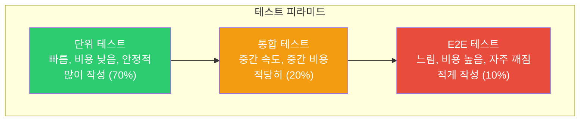
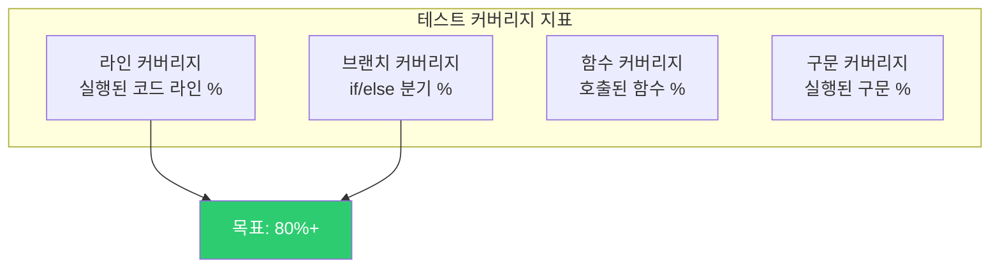
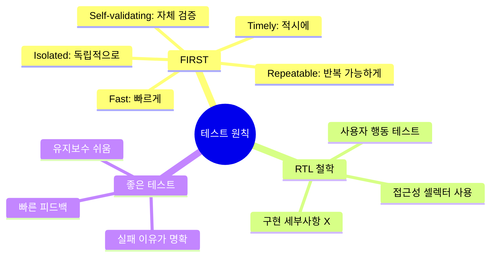
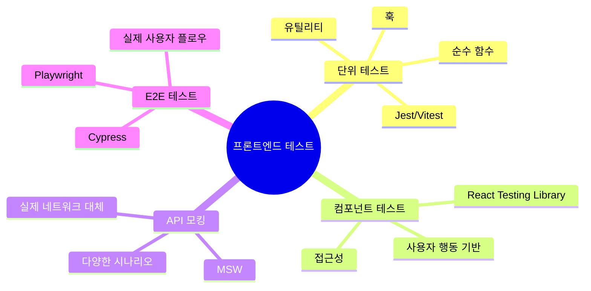

## 자동차 출고 검사

자동차 공장에서 차를 출고할 때 세 단계의 검사를 거칩니다.

1. **부품 검사 (단위 테스트)**: 엔진, 브레이크 등 각 부품이 제대로 작동하는지
2. **조립 검사 (통합 테스트)**: 부품들이 함께 잘 동작하는지
3. **시험 주행 (E2E 테스트)**: 실제 도로에서 처음부터 끝까지 잘 달리는지

이 세 단계를 모두 통과해야 안전한 차가 출고되듯, 좋은 소프트웨어도 세 계층의 테스트가 필요합니다.

---

## 1. 테스트 피라미드



| 종류 | 속도 | 비용 | 신뢰성 | 도구 |
|------|------|------|--------|------|
| 단위 테스트 | 매우 빠름 | 낮음 | 높음 | Jest, Vitest |
| 통합 테스트 | 중간 | 중간 | 중간 | React Testing Library |
| E2E 테스트 | 느림 | 높음 | 낮음 | Cypress, Playwright |

---

## 2. Jest - 단위 테스트

### 기본 설정

```javascript
// jest.config.js
module.exports = {
  testEnvironment: 'jsdom',
  setupFilesAfterFramework: ['@testing-library/jest-dom'],
  moduleNameMapper: {
    '^@/(.*)$': '<rootDir>/src/$1'
  },
  collectCoverageFrom: [
    'src/**/*.{ts,tsx}',
    '!src/**/*.d.ts',
    '!src/**/*.stories.tsx'
  ]
};
```

### 순수 함수 테스트

```javascript
// utils/formatters.ts
export function formatPrice(price: number, currency = 'KRW'): string {
  return new Intl.NumberFormat('ko-KR', {
    style: 'currency',
    currency
  }).format(price);
}

export function truncate(text: string, maxLength: number): string {
  if (text.length <= maxLength) return text;
  return `${text.slice(0, maxLength)}...`;
}

// utils/formatters.test.ts
import { formatPrice, truncate } from './formatters';

describe('formatPrice', () => {
  it('원화 형식으로 포맷팅', () => {
    expect(formatPrice(10000)).toBe('₩10,000');
  });

  it('음수 가격 처리', () => {
    expect(formatPrice(-5000)).toBe('-₩5,000');
  });

  it('달러 형식 포맷팅', () => {
    expect(formatPrice(99.99, 'USD')).toBe('$99.99');
  });
});

describe('truncate', () => {
  it('최대 길이 이하면 원본 반환', () => {
    expect(truncate('Hello', 10)).toBe('Hello');
  });

  it('최대 길이 초과 시 ... 추가', () => {
    expect(truncate('Hello World', 5)).toBe('Hello...');
  });

  it('정확히 최대 길이면 원본 반환', () => {
    expect(truncate('Hello', 5)).toBe('Hello');
  });
});
```

### 비동기 함수 테스트

```javascript
// api/userApi.ts
export async function fetchUser(id: string) {
  const response = await fetch(`/api/users/${id}`);
  if (!response.ok) throw new Error('사용자를 찾을 수 없습니다');
  return response.json();
}

// api/userApi.test.ts
import { fetchUser } from './userApi';

describe('fetchUser', () => {
  beforeEach(() => {
    global.fetch = jest.fn();
  });

  afterEach(() => {
    jest.restoreAllMocks();
  });

  it('성공적으로 사용자 반환', async () => {
    const mockUser = { id: '1', name: '홍길동' };

    (global.fetch as jest.Mock).mockResolvedValueOnce({
      ok: true,
      json: () => Promise.resolve(mockUser)
    });

    const user = await fetchUser('1');
    expect(user).toEqual(mockUser);
    expect(global.fetch).toHaveBeenCalledWith('/api/users/1');
  });

  it('404 응답 시 에러 발생', async () => {
    (global.fetch as jest.Mock).mockResolvedValueOnce({
      ok: false,
      status: 404
    });

    await expect(fetchUser('999')).rejects.toThrow('사용자를 찾을 수 없습니다');
  });
});
```

---

## 3. React Testing Library - 컴포넌트 테스트

RTL의 철학: **"구현 세부사항이 아닌 사용자 관점에서 테스트"**

```jsx
// components/LoginForm.tsx
function LoginForm({ onLogin }) {
  const [email, setEmail] = useState('');
  const [password, setPassword] = useState('');
  const [error, setError] = useState('');

  const handleSubmit = async (e) => {
    e.preventDefault();
    try {
      await onLogin({ email, password });
    } catch (err) {
      setError(err.message);
    }
  };

  return (
    <form onSubmit={handleSubmit} aria-label="로그인 폼">
      <label htmlFor="email">이메일</label>
      <input
        id="email"
        type="email"
        value={email}
        onChange={e => setEmail(e.target.value)}
        required
      />

      <label htmlFor="password">비밀번호</label>
      <input
        id="password"
        type="password"
        value={password}
        onChange={e => setPassword(e.target.value)}
        required
      />

      {error && <p role="alert">{error}</p>}

      <button type="submit">로그인</button>
    </form>
  );
}
```

```javascript
// components/LoginForm.test.tsx
import { render, screen, fireEvent, waitFor } from '@testing-library/react';
import userEvent from '@testing-library/user-event';
import LoginForm from './LoginForm';

describe('LoginForm', () => {
  const mockOnLogin = jest.fn();

  beforeEach(() => {
    mockOnLogin.mockClear();
  });

  it('이메일과 비밀번호 입력 필드가 렌더링됨', () => {
    render(<LoginForm onLogin={mockOnLogin} />);

    expect(screen.getByLabelText('이메일')).toBeInTheDocument();
    expect(screen.getByLabelText('비밀번호')).toBeInTheDocument();
    expect(screen.getByRole('button', { name: '로그인' })).toBeInTheDocument();
  });

  it('폼 제출 시 onLogin 호출됨', async () => {
    const user = userEvent.setup();
    mockOnLogin.mockResolvedValueOnce({ token: 'abc123' });

    render(<LoginForm onLogin={mockOnLogin} />);

    await user.type(screen.getByLabelText('이메일'), 'test@example.com');
    await user.type(screen.getByLabelText('비밀번호'), 'password123');
    await user.click(screen.getByRole('button', { name: '로그인' }));

    expect(mockOnLogin).toHaveBeenCalledWith({
      email: 'test@example.com',
      password: 'password123'
    });
  });

  it('로그인 실패 시 에러 메시지 표시', async () => {
    const user = userEvent.setup();
    mockOnLogin.mockRejectedValueOnce(new Error('이메일 또는 비밀번호가 틀렸습니다'));

    render(<LoginForm onLogin={mockOnLogin} />);

    await user.type(screen.getByLabelText('이메일'), 'wrong@example.com');
    await user.type(screen.getByLabelText('비밀번호'), 'wrongpass');
    await user.click(screen.getByRole('button', { name: '로그인' }));

    await waitFor(() => {
      expect(screen.getByRole('alert')).toHaveTextContent(
        '이메일 또는 비밀번호가 틀렸습니다'
      );
    });
  });
});
```

---

## 4. MSW - API 모킹

Mock Service Worker로 실제 네트워크 레이어를 가로챕니다.

```javascript
// mocks/handlers.ts
import { http, HttpResponse } from 'msw';

export const handlers = [
  // GET /api/users 핸들러
  http.get('/api/users', ({ request }) => {
    const url = new URL(request.url);
    const page = Number(url.searchParams.get('page') ?? '1');

    return HttpResponse.json({
      users: [
        { id: '1', name: '홍길동', email: 'hong@example.com' },
        { id: '2', name: '김철수', email: 'kim@example.com' }
      ],
      total: 2,
      page
    });
  }),

  // POST /api/auth/login 핸들러
  http.post('/api/auth/login', async ({ request }) => {
    const { email, password } = await request.json();

    if (email === 'admin@example.com' && password === 'password') {
      return HttpResponse.json({ token: 'mock-jwt-token' });
    }

    return HttpResponse.json(
      { error: '이메일 또는 비밀번호가 틀렸습니다' },
      { status: 401 }
    );
  })
];

// mocks/server.ts
import { setupServer } from 'msw/node';
import { handlers } from './handlers';

export const server = setupServer(...handlers);

// jest.setup.ts
import { server } from './mocks/server';

beforeAll(() => server.listen());
afterEach(() => server.resetHandlers());
afterAll(() => server.close());
```

### MSW로 통합 테스트

```javascript
// features/auth/Login.integration.test.tsx
import { render, screen, waitFor } from '@testing-library/react';
import userEvent from '@testing-library/user-event';
import { server } from '../../mocks/server';
import { http, HttpResponse } from 'msw';
import LoginPage from './LoginPage';

describe('LoginPage 통합 테스트', () => {
  it('성공적인 로그인 후 대시보드로 이동', async () => {
    const user = userEvent.setup();

    render(<LoginPage />, { wrapper: TestProviders });

    await user.type(screen.getByLabelText('이메일'), 'admin@example.com');
    await user.type(screen.getByLabelText('비밀번호'), 'password');
    await user.click(screen.getByRole('button', { name: '로그인' }));

    await waitFor(() => {
      expect(screen.getByText('대시보드')).toBeInTheDocument();
    });
  });

  it('서버 오류 시 에러 처리', async () => {
    // 이 테스트만 특별한 응답 설정
    server.use(
      http.post('/api/auth/login', () => {
        return HttpResponse.json(
          { error: '서버 오류' },
          { status: 500 }
        );
      })
    );

    const user = userEvent.setup();
    render(<LoginPage />, { wrapper: TestProviders });

    await user.click(screen.getByRole('button', { name: '로그인' }));

    await waitFor(() => {
      expect(screen.getByText('서버 오류가 발생했습니다')).toBeInTheDocument();
    });
  });
});
```

---

## 5. Cypress - E2E 테스트

```javascript
// cypress/e2e/shopping-flow.cy.ts
describe('쇼핑 플로우', () => {
  beforeEach(() => {
    cy.intercept('GET', '/api/products*', { fixture: 'products.json' }).as('getProducts');
    cy.intercept('POST', '/api/cart', { statusCode: 201 }).as('addToCart');
    cy.intercept('POST', '/api/orders', { fixture: 'order.json' }).as('createOrder');
  });

  it('상품 검색 → 장바구니 추가 → 주문 완료', () => {
    // 1. 홈페이지 방문
    cy.visit('/');
    cy.wait('@getProducts');

    // 2. 상품 검색
    cy.get('[data-testid="search-input"]').type('맥북');
    cy.get('[data-testid="search-button"]').click();
    cy.url().should('include', '/search?q=맥북');

    // 3. 상품 선택
    cy.contains('맥북 프로').click();
    cy.url().should('include', '/products/');

    // 4. 장바구니 추가
    cy.get('[data-testid="add-to-cart"]').click();
    cy.wait('@addToCart');
    cy.get('[data-testid="cart-count"]').should('contain', '1');

    // 5. 장바구니 페이지
    cy.visit('/cart');
    cy.contains('맥북 프로').should('be.visible');

    // 6. 주문 완료
    cy.get('[data-testid="checkout-btn"]').click();
    cy.get('[data-testid="confirm-order"]').click();
    cy.wait('@createOrder');

    // 7. 성공 페이지 확인
    cy.url().should('include', '/orders/success');
    cy.contains('주문이 완료되었습니다').should('be.visible');
  });
});
```

---

## 6. Playwright - 크로스 브라우저 E2E

```typescript
// tests/accessibility.spec.ts
import { test, expect } from '@playwright/test';
import AxeBuilder from '@axe-core/playwright';

test.describe('접근성 테스트', () => {
  test('메인 페이지 접근성', async ({ page }) => {
    await page.goto('/');

    const accessibilityScanResults = await new AxeBuilder({ page }).analyze();
    expect(accessibilityScanResults.violations).toEqual([]);
  });

  test('키보드 내비게이션', async ({ page }) => {
    await page.goto('/products');

    // Tab으로 이동
    await page.keyboard.press('Tab');
    await expect(page.locator(':focus')).toHaveRole('searchbox');

    await page.keyboard.press('Tab');
    await expect(page.locator(':focus')).toHaveRole('button');
  });
});

// playwright.config.ts
import { PlaywrightTestConfig } from '@playwright/test';

const config: PlaywrightTestConfig = {
  testDir: './tests',
  timeout: 30000,
  use: {
    baseURL: 'http://localhost:3000',
    screenshot: 'only-on-failure',
    video: 'retain-on-failure'
  },
  projects: [
    { name: 'Chrome', use: { browserName: 'chromium' } },
    { name: 'Firefox', use: { browserName: 'firefox' } },
    { name: 'Safari', use: { browserName: 'webkit' } },
    {
      name: 'Mobile Chrome',
      use: { ...devices['Pixel 5'] }
    }
  ]
};
```

---

## 7. 커버리지와 품질 지표



```javascript
// package.json
{
  "scripts": {
    "test": "jest",
    "test:coverage": "jest --coverage",
    "test:watch": "jest --watch"
  },
  "jest": {
    "coverageThreshold": {
      "global": {
        "branches": 80,
        "functions": 80,
        "lines": 80,
        "statements": 80
      }
    }
  }
}
```

---

## 8. 테스트 작성 원칙



### 나쁜 테스트 vs 좋은 테스트

```javascript
// 나쁜 테스트: 구현 세부사항 테스트
it('useState를 올바르게 호출', () => {
  const spy = jest.spyOn(React, 'useState');
  render(<Counter />);
  expect(spy).toHaveBeenCalledWith(0);
});

// 좋은 테스트: 사용자 행동 테스트
it('증가 버튼 클릭 시 카운트 증가', async () => {
  const user = userEvent.setup();
  render(<Counter />);

  const count = screen.getByTestId('count');
  const button = screen.getByRole('button', { name: '증가' });

  expect(count).toHaveTextContent('0');
  await user.click(button);
  expect(count).toHaveTextContent('1');
});
```

---

## 9. 극한 시나리오 - 레이스 컨디션 테스트

```javascript
// 비동기 경쟁 조건 테스트
it('빠른 타이핑 시 마지막 결과만 표시', async () => {
  let resolveFirst: (v: any) => void;
  let resolveSecond: (v: any) => void;

  const mockSearch = jest.fn()
    .mockImplementationOnce(() => new Promise(r => { resolveFirst = r; }))
    .mockImplementationOnce(() => new Promise(r => { resolveSecond = r; }));

  const user = userEvent.setup();
  render(<SearchInput onSearch={mockSearch} />);

  const input = screen.getByRole('searchbox');

  // 첫 번째 검색
  await user.type(input, '사과');

  // 두 번째 검색 (더 빠름)
  await user.clear(input);
  await user.type(input, '바나나');

  // 두 번째가 먼저 완료
  resolveSecond!([{ name: '바나나' }]);
  await screen.findByText('바나나');

  // 첫 번째가 나중에 완료되어도 결과 무시
  resolveFirst!([{ name: '사과' }]);

  await new Promise(r => setTimeout(r, 100));

  // 바나나 결과만 보여야 함
  expect(screen.queryByText('사과')).not.toBeInTheDocument();
  expect(screen.getByText('바나나')).toBeInTheDocument();
});
```

---

## 10. CI/CD 통합

```yaml
# .github/workflows/test.yml
name: Test

on: [push, pull_request]

jobs:
  test:
    runs-on: ubuntu-latest

    steps:
      - uses: actions/checkout@v3

      - name: Node.js 설정
        uses: actions/setup-node@v3
        with:
          node-version: '18'
          cache: 'npm'

      - name: 의존성 설치
        run: npm ci

      - name: 단위/통합 테스트
        run: npm run test:coverage

      - name: 커버리지 업로드
        uses: codecov/codecov-action@v3

      - name: E2E 테스트 빌드
        run: npm run build

      - name: Playwright E2E 테스트
        run: npx playwright test

      - name: E2E 결과 업로드
        uses: actions/upload-artifact@v3
        if: failure()
        with:
          name: playwright-report
          path: playwright-report/
```

---

## 11. 정리



테스트의 목적은 **버그를 찾는 것**이 아니라 **버그가 프로덕션에 가지 않도록 막는 것**입니다. 많은 테스트보다 **의미 있는 테스트**가 더 중요합니다. 사용자가 실제로 하는 행동을 테스트하세요.
