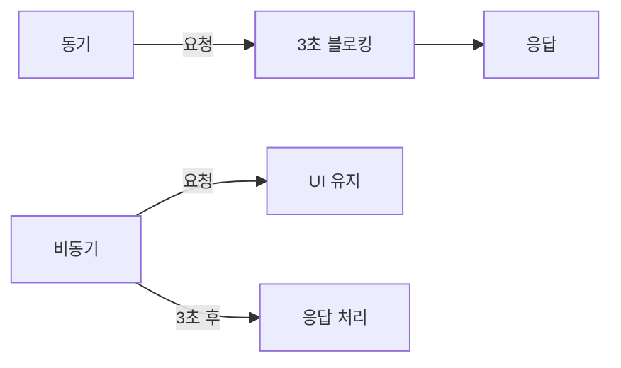
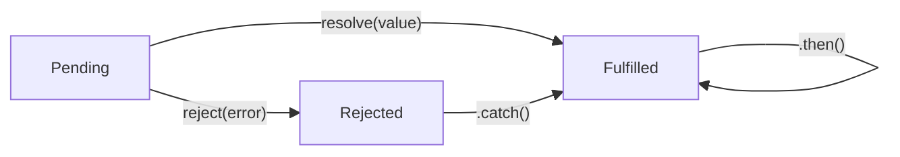
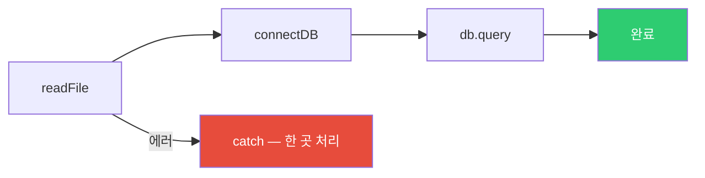
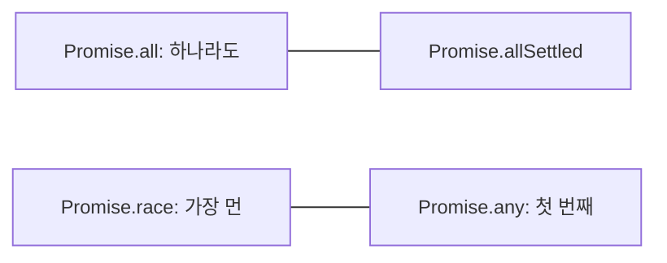
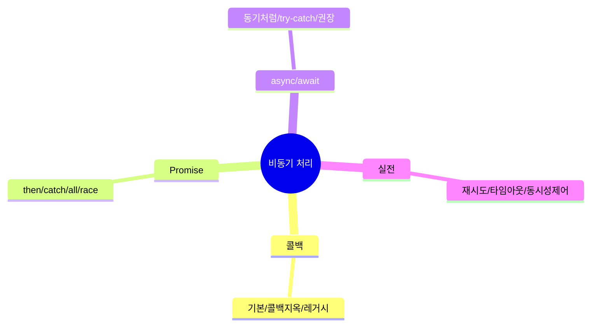

```mermaid
%%{init: {'theme': 'default', 'themeVariables': {'fontSize': '12px', 'nodePadding': '4px'}} }%%
gantt
    title 순차 vs 병렬 실행
    dateFormat X
    axisFormat %Ls
    section 순차 실행 (3초)
    fetchUser :0, 1000
    fetchPosts :1000, 2000
    fetchSettings :2000, 3000
    section 병렬 실행 (1초)
    fetchUser :0, 1000
    fetchPosts :0, 800
    fetchSettings :0, 600
```

## 음식 배달 앱의 진화

비동기 처리 패턴의 역사는 마치 음식 배달 서비스의 진화와 같습니다.

- **콜백 시대**: 주문 후 전화를 계속 들고 기다림. 음식이 오면 전화로 알려주는 방식. 다른 일은 못 합니다.
- **Promise 시대**: 주문 후 진동벨을 받음. 진동벨을 들고 다른 일을 하다가 진동하면 픽업. 체인도 됩니다.
- **async/await 시대**: 주문 앱에서 주문하고, 알림을 기다리는 동안 다른 일 가능. 마치 동기적으로 작성한 것처럼 읽힙니다.

각 방식이 왜 등장했는지, 어떤 문제를 해결했는지를 이해하면 세 패턴 모두 자연스럽게 익힙니다.

---

## 1. 비동기가 필요한 이유

자바스크립트는 싱글 스레드입니다. 모든 작업을 동기로 처리하면 브라우저가 멈춥니다.

> 비유: 혼자 운영하는 편의점을 생각해보세요. 손님 A의 계산을 하다가 재고 확인(3초짜리 작업)을 기다리는 동안 뒤 손님들은 줄 서서 기다려야 합니다. 비동기는 "재고 확인은 창고 직원에게 맡기고, 그 사이에 다음 손님 계산을 합니다"입니다.



---

## 2. 콜백 패턴 — 가장 오래된 방식

콜백은 "나중에 실행할 함수를 미리 전달하는" 방식입니다. 단순하고 직관적이지만, 여러 작업을 순서대로 처리해야 할 때 심각한 문제가 생깁니다.

```javascript
// 기본 콜백
function fetchUser(id, callback) {
  setTimeout(() => {
    if (id > 0) {
      callback(null, { id, name: '홍길동' });
    } else {
      callback(new Error('유효하지 않은 ID'));
    }
  }, 1000);
}

fetchUser(1, (error, user) => {
  if (error) {
    console.error('오류:', error.message);
    return;
  }
  console.log('유저:', user.name);
});
```

### 콜백 지옥 — 왜 이게 문제인가

여러 비동기 작업을 순서대로 처리해야 할 때 콜백을 중첩하면 이렇게 됩니다.

```javascript
readFile('config.json', (err, config) => {
  if (err) throw err;

  connectDB(config.db, (err, db) => {
    if (err) throw err;

    db.query('SELECT * FROM users', (err, users) => {
      if (err) throw err;

      sendEmail(users[0].email, (err, result) => {
        if (err) throw err;

        logActivity(result, (err) => {
          if (err) throw err;
          console.log('완료!'); // 5단계 중첩
        });
      });
    });
  });
});
```

코드가 오른쪽으로 계속 밀려납니다. 이것이 콜백 지옥(Callback Hell)입니다. 문제점이 세 가지입니다.

1. **가독성 저하**: 코드가 피라미드 형태로 중첩됨
2. **에러 처리 반복**: 각 단계마다 `if (err)` 체크 필요
3. **흐름 제어 어려움**: 중간에 작업을 건너뛰거나 반복하기 복잡

---

## 3. Promise — 콜백 지옥을 탈출하다

Promise는 "미래에 완료될 작업"을 나타내는 객체입니다. ES6에서 도입됐으며, 세 가지 상태를 가집니다.



```javascript
function fetchUser(id) {
  return new Promise((resolve, reject) => {
    setTimeout(() => {
      if (id > 0) {
        resolve({ id, name: '홍길동' }); // 성공
      } else {
        reject(new Error('유효하지 않은 ID')); // 실패
      }
    }, 1000);
  });
}

fetchUser(1)
  .then(user => {
    console.log('유저:', user.name);
    return user;
  })
  .then(user => {
    return fetchPosts(user.id); // 다른 비동기 작업 체이닝
  })
  .then(posts => {
    console.log('게시물:', posts);
  })
  .catch(error => {
    console.error('오류:', error.message); // 모든 에러를 한 곳에서 처리
  })
  .finally(() => {
    console.log('항상 실행됨'); // 성공/실패 무관
  });
```

콜백 지옥이 Promise 체인으로 어떻게 바뀌는지 보세요.

```javascript
// 콜백 지옥 → Promise 체인으로 개선
readFile('config.json')
  .then(config => connectDB(config.db))
  .then(db => db.query('SELECT * FROM users'))
  .then(users => sendEmail(users[0].email))
  .then(result => logActivity(result))
  .then(() => console.log('완료!'))
  .catch(err => console.error('오류:', err)); // 에러 한 곳에서 처리
```



---

## 4. Promise 고급 메서드 — 병렬 처리의 핵심

여러 비동기 작업을 어떻게 조합하느냐에 따라 실행 시간이 크게 달라집니다.

### Promise.all() — 모두 병렬로, 하나라도 실패하면 전체 실패

```javascript
const userPromise = fetchUser(1);
const postsPromise = fetchPosts(1);
const settingsPromise = fetchSettings(1);

// 세 개를 동시에 시작, 모두 완료되면 결과 반환
Promise.all([userPromise, postsPromise, settingsPromise])
  .then(([user, posts, settings]) => {
    console.log(user, posts, settings);
  })
  .catch(err => {
    console.error('하나 이상 실패:', err);
  });
```

### Promise.allSettled() — 실패해도 모든 결과를 수집

```javascript
// 실패해도 모든 결과 수집 (부분 성공 시 유용)
Promise.allSettled([userPromise, postsPromise, settingsPromise])
  .then(results => {
    results.forEach(result => {
      if (result.status === 'fulfilled') {
        console.log('성공:', result.value);
      } else {
        console.log('실패:', result.reason);
      }
    });
  });
```

### Promise.race() — 가장 먼저 완료된 것만

```javascript
// 타임아웃 구현에 자주 사용
const timeoutPromise = new Promise((_, reject) =>
  setTimeout(() => reject(new Error('타임아웃')), 5000)
);

Promise.race([fetchData(), timeoutPromise])
  .then(data => console.log(data))
  .catch(err => console.error(err)); // 5초 안에 안 오면 타임아웃
```

### Promise.any() — 하나라도 성공하면

```javascript
// 여러 미러 서버 중 가장 빠른 것 사용
Promise.any([
  fetchFromServer1(),
  fetchFromServer2(),
  fetchFromServer3()
])
  .then(data => console.log('가장 빠른 서버의 데이터:', data))
  .catch(err => console.error('모두 실패:', err));
```



---

## 5. async/await — Promise를 동기처럼 작성하기

async/await는 새로운 비동기 메커니즘이 아닙니다. **Promise 위에 얹은 문법적 설탕**입니다. 훨씬 읽기 쉬운 코드를 작성할 수 있게 해줍니다.

> 비유: Promise 체인이 "1번 완료 후 2번 시작, 2번 완료 후 3번 시작"이라는 지시서라면, async/await는 그 지시서를 마치 동기 코드처럼 자연스럽게 읽히게 해주는 번역기입니다.

```javascript
// Promise 체인
function loadUserData(userId) {
  return fetchUser(userId)
    .then(user => fetchPosts(user.id))
    .then(posts => fetchComments(posts[0].id))
    .then(comments => ({ comments }));
}

// async/await — 같은 동작, 훨씬 읽기 쉬움
async function loadUserData(userId) {
  const user = await fetchUser(userId);
  const posts = await fetchPosts(user.id);
  const comments = await fetchComments(posts[0].id);
  return { comments };
}
```

### async 함수가 항상 Promise를 반환하는 이유

```javascript
async function example() {
  return 42; // 실제로는 Promise.resolve(42) 반환
}

example().then(console.log); // 42

async function failing() {
  throw new Error('실패'); // Promise.reject(new Error('실패'))
}

failing().catch(console.error); // Error: 실패
```

async 함수 안에서 throw를 하면 자동으로 rejected Promise가 됩니다. 이 덕분에 try/catch로 비동기 에러를 처리할 수 있습니다.

### 에러 처리

```javascript
async function fetchUserSafe(id) {
  try {
    const user = await fetchUser(id);
    const posts = await fetchPosts(user.id);
    return { user, posts };
  } catch (error) {
    console.error('데이터 로드 실패:', error.message);
    return null;
  } finally {
    console.log('항상 실행');
  }
}

// 개별 에러 처리 — 한 단계 실패해도 다음 단계 진행 가능
async function fetchWithPartialErrors(id) {
  const user = await fetchUser(id).catch(err => {
    console.error('유저 로드 실패:', err);
    return null; // 기본값 반환
  });

  if (!user) return null;

  const posts = await fetchPosts(user.id).catch(() => []); // 실패 시 빈 배열

  return { user, posts };
}
```

---

## 6. 병렬 실행 최적화 — 순서가 중요하지 않으면 동시에 실행하세요

await를 남발하면 오히려 성능이 나빠집니다. 각 작업이 이전 결과에 의존하지 않는다면, 동시에 실행해야 합니다.

```javascript
// 나쁜 예 — 순차 실행 (총 3초)
async function loadDataSequential() {
  const user = await fetchUser(1);     // 1초 대기
  const posts = await fetchPosts(1);   // 1초 대기
  const settings = await fetchSettings(1); // 1초 대기
  return { user, posts, settings };
}

// 좋은 예 — 병렬 실행 (총 1초, 가장 느린 작업 기준)
async function loadDataParallel() {
  const [user, posts, settings] = await Promise.all([
    fetchUser(1),      // 동시 시작
    fetchPosts(1),     // 동시 시작
    fetchSettings(1)   // 동시 시작
  ]);
  return { user, posts, settings };
}
```



---

## 7. 실전 패턴 — 재시도 로직

네트워크는 불안정합니다. 한 번 실패했다고 바로 포기하지 말고, 몇 번 재시도하도록 만드세요.

```javascript
async function fetchWithRetry(url, maxRetries = 3, delay = 1000) {
  for (let attempt = 1; attempt <= maxRetries; attempt++) {
    try {
      const response = await fetch(url);

      if (!response.ok) {
        throw new Error(`HTTP ${response.status}`);
      }

      return await response.json();

    } catch (error) {
      console.warn(`시도 ${attempt}/${maxRetries} 실패:`, error.message);

      if (attempt === maxRetries) {
        throw new Error(`${maxRetries}번 모두 실패: ${error.message}`);
      }

      // 지수 백오프 — 1초, 2초, 4초... 점점 간격을 늘림
      await new Promise(resolve => setTimeout(resolve, delay * Math.pow(2, attempt - 1)));
    }
  }
}
```

지수 백오프(Exponential Backoff)를 쓰는 이유는, 서버가 과부하 상태일 때 짧은 간격으로 재시도를 계속하면 오히려 서버를 더 힘들게 만들기 때문입니다. 간격을 늘려가면 서버가 회복할 시간을 줍니다.

---

## 8. 실전 패턴 — 요청 취소

React에서 컴포넌트가 언마운트됐는데 비동기 작업이 완료되면 "언마운트된 컴포넌트에 setState"라는 경고가 납니다. AbortController로 해결합니다.

```javascript
async function fetchWithCancel(url) {
  const controller = new AbortController();
  const timeoutId = setTimeout(() => controller.abort(), 5000);

  try {
    const response = await fetch(url, { signal: controller.signal });
    clearTimeout(timeoutId);
    return await response.json();
  } catch (error) {
    if (error.name === 'AbortError') {
      throw new Error('요청이 취소됐습니다 (타임아웃)');
    }
    throw error;
  }
}

// React에서 컴포넌트 언마운트 시 취소
function useAsync(asyncFn) {
  useEffect(() => {
    const controller = new AbortController();

    asyncFn(controller.signal).catch(err => {
      if (err.name !== 'AbortError') {
        console.error(err);
      }
    });

    return () => controller.abort(); // 언마운트 시 자동 취소
  }, []);
}
```

---

## 9. 실전 패턴 — 동시성 제어

100개의 API 요청을 동시에 보내면 서버가 과부하됩니다. 최대 N개씩 병렬로 실행하도록 제어합니다.

```javascript
async function limitConcurrency(tasks, limit) {
  const results = [];
  const executing = [];

  for (const task of tasks) {
    const promise = task().then(result => {
      executing.splice(executing.indexOf(promise), 1);
      return result;
    });

    results.push(promise);
    executing.push(promise);

    if (executing.length >= limit) {
      await Promise.race(executing); // 하나가 완료될 때까지 대기
    }
  }

  return Promise.all(results);
}

// 100개 API 요청을 5개씩 병렬로
const tasks = urls.map(url => () => fetch(url).then(r => r.json()));
const results = await limitConcurrency(tasks, 5);
```

---

## 10. 에러 처리 전략 — 비동기 에러는 조용히 사라질 수 있다

비동기 코드에서 에러를 제대로 잡지 않으면 오류가 조용히 사라집니다. 항상 명시적으로 에러를 처리하세요.

```javascript
// 에러 타입 분류
class ApiError extends Error {
  constructor(message, status) {
    super(message);
    this.name = 'ApiError';
    this.status = status;
  }
}

async function apiRequest(url) {
  const response = await fetch(url);

  if (!response.ok) {
    throw new ApiError(
      `요청 실패: ${response.statusText}`,
      response.status
    );
  }

  return response.json();
}

// 에러 타입에 따른 다른 처리
async function handleRequest() {
  try {
    const data = await apiRequest('/api/data');
    return data;
  } catch (error) {
    if (error instanceof ApiError) {
      if (error.status === 401) {
        redirectToLogin();
      } else if (error.status === 404) {
        return null; // 없는 것은 null 반환
      }
    }
    throw error; // 기타 에러는 상위로 전파
  }
}
```

---

## 정리



| 패턴 | 장점 | 단점 | 사용 시기 |
|------|------|------|-----------|
| 콜백 | 간단, 낮은 오버헤드 | 콜백 지옥, 에러 처리 어려움 | 이벤트 리스너, 레거시 |
| Promise | 체인 가능, 에러 통합 | 디버깅 스택 추적 어려움 | 여러 비동기 조합 |
| async/await | 가독성 최고, 디버깅 쉬움 | 최신 문법 필요 | 대부분의 경우 |

현대 자바스크립트에서는 `async/await`를 기본으로 사용하고, 병렬 처리가 필요한 경우 `Promise.all`과 조합하는 것이 가장 좋은 패턴입니다.

---

## 왜 async/await인가? (vs 콜백 vs Promise 체인)

| 방식 | 가독성 | 에러 처리 | 디버깅 | 등장 시점 |
|---|---|---|---|---|
| 콜백 | 낮음 (콜백 지옥) | 어려움 | 스택 추적 불가 | ES5 |
| Promise 체인 | 중간 | `.catch()` | 중간 | ES6 |
| async/await | 높음 (동기 코드처럼) | `try/catch` | 정확한 스택 | ES2017 |

**콜백 지옥이 실제로 문제인 이유**: 에러 전파 방향이 불명확하고, 각 콜백에서 별도로 에러를 처리해야 한다. Promise는 이를 개선했지만 `.then()` 체인이 길어지면 가독성이 떨어진다.

---

## 실무에서 자주 하는 실수

### 실수 1: await를 루프 안에서 직렬 사용

```javascript
// 나쁜 예 — 순차 실행 (총 시간 = 합산)
const results = []
for (const id of ids) {
  const data = await fetch(`/api/${id}`)  // 이전 완료 후 다음 시작
  results.push(await data.json())
}

// 좋은 예 — 병렬 실행 (총 시간 = 최대값)
const results = await Promise.all(
  ids.map(id => fetch(`/api/${id}`).then(r => r.json()))
)
```

10개 요청이 각 100ms면: 직렬 1000ms, 병렬 ~100ms.

### 실수 2: async 함수에서 try/catch 없이 에러 무시

```javascript
// 나쁜 예 — rejected Promise가 Unhandled Promise Rejection
async function loadUser(id) {
  const user = await fetchUser(id)  // 에러 발생 시 조용히 무시
  return user
}

// 좋은 예 — 에러 명시적 처리
async function loadUser(id) {
  try {
    return await fetchUser(id)
  } catch (error) {
    console.error('User load failed:', error)
    return null  // 또는 throw로 상위에 전파
  }
}
```

Node.js에서 Unhandled Promise Rejection은 프로세스를 종료시킬 수 있다.

### 실수 3: Promise.all에서 하나라도 실패하면 전체 실패

```javascript
// 나쁜 예 — 하나 실패 시 전체 결과 손실
const [user, posts, comments] = await Promise.all([
  fetchUser(),
  fetchPosts(),   // 이것만 실패해도
  fetchComments() // 전체가 rejected
])

// 좋은 예 — Promise.allSettled로 각각 결과 확인
const results = await Promise.allSettled([fetchUser(), fetchPosts(), fetchComments()])
const [userResult, postsResult] = results
if (userResult.status === 'fulfilled') {
  const user = userResult.value
}
```

---

## 면접 포인트

**Q1. Promise의 세 가지 상태는?**

`pending`(초기, 비동기 작업 진행 중), `fulfilled`(성공, `.then()` 실행), `rejected`(실패, `.catch()` 실행). 상태는 한 번만 변경되며 이후 불변이다. `fulfilled` 또는 `rejected` 상태가 되면 "settled"라고 한다.

**Q2. async 함수의 반환값은?**

항상 Promise를 반환한다. `return 42`는 `Promise.resolve(42)`와 동일하다. `throw new Error()`는 `Promise.reject(error)`와 동일하다. 따라서 `async` 함수 결과를 사용할 때는 반드시 `await`하거나 `.then()`으로 처리해야 한다.

**Q3. Promise.all vs Promise.allSettled vs Promise.race vs Promise.any의 차이는?**

`Promise.all`: 모두 성공해야 resolve. 하나라도 실패 시 즉시 reject. `Promise.allSettled`: 모두 완료될 때까지 대기, 성공/실패 여부 관계없이 모든 결과 반환. `Promise.race`: 가장 먼저 settle된 것의 결과 반환(성공이든 실패든). `Promise.any`: 가장 먼저 fulfilled된 것 반환, 모두 rejected이면 AggregateError.

**Q4. 이벤트 루프와 Promise의 관계는?**

Promise의 `.then()` 콜백은 마이크로태스크 큐에 들어간다. 마이크로태스크는 현재 태스크가 끝난 직후, 다음 태스크(setTimeout 등)보다 먼저 실행된다. 따라서 `setTimeout(fn, 0)`보다 `Promise.resolve().then(fn)`이 먼저 실행된다. `async/await`도 내부적으로 Promise를 사용하므로 동일하게 마이크로태스크로 처리된다.
