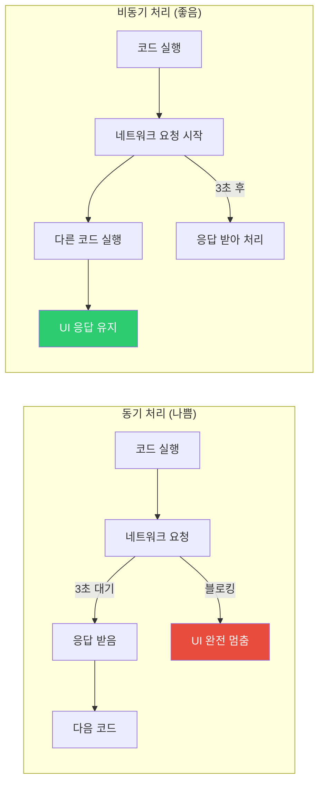
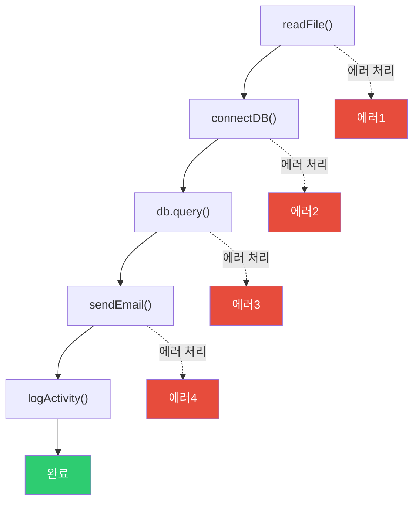
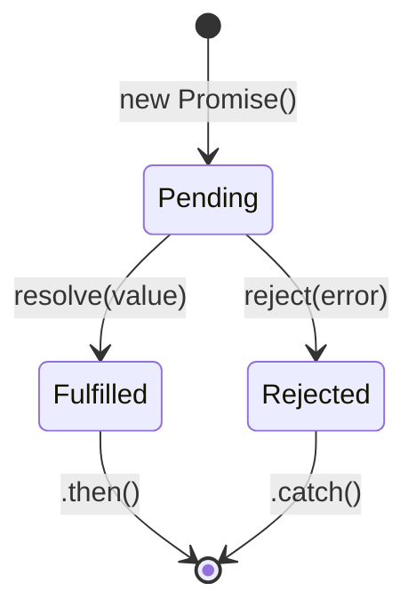
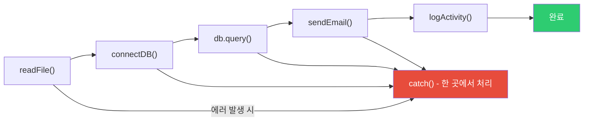
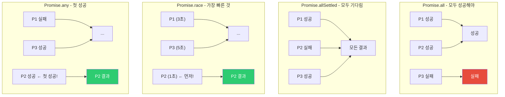
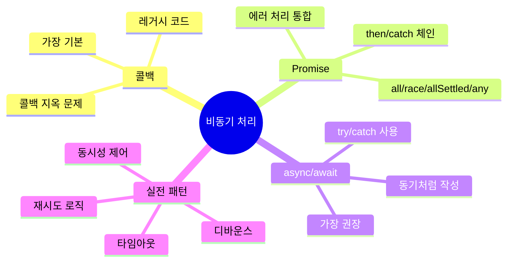

```mermaid
%%{init: {'theme': 'default', 'themeVariables': {'fontSize': '12px', 'nodePadding': '4px'}} }%%
gantt
    title 순차 vs 병렬 실행
    dateFormat X
    axisFormat %Ls
    section 순차 실행 (3초)
    fetchUser :0, 1000
    fetchPosts :1000, 2000
    fetchSettings :2000, 3000
    section 병렬 실행 (1초)
    fetchUser :0, 1000
    fetchPosts :0, 800
    fetchSettings :0, 600
```

## 음식 배달 앱의 진화

비동기 처리 패턴의 역사는 마치 음식 배달 서비스의 진화와 같습니다.

- **콜백 시대**: 음식 주문 후 전화를 계속 들고 기다림. 음식이 오면 전화로 알려주는 방식. (콜백 지옥)
- **Promise 시대**: 주문 후 진동벨을 받음. 진동벨이 울리면 픽업. (체인 가능)
- **async/await 시대**: 주문 앱에서 주문하고, 앱 알림을 기다리는 동안 다른 일 가능. (동기처럼 작성)

---

## 1. 비동기가 필요한 이유

자바스크립트는 싱글 스레드입니다. 모든 작업을 동기로 처리하면 브라우저가 멈춥니다.



---

## 2. 콜백 패턴

가장 오래된 비동기 처리 방식입니다.

```javascript
// 기본 콜백
function fetchUser(id, callback) {
  setTimeout(() => {
    if (id > 0) {
      callback(null, { id, name: '홍길동' });
    } else {
      callback(new Error('유효하지 않은 ID'));
    }
  }, 1000);
}

fetchUser(1, (error, user) => {
  if (error) {
    console.error('오류:', error.message);
    return;
  }
  console.log('유저:', user.name);
});
```

### 콜백 지옥 (Callback Hell)

```javascript
// Node.js 스타일의 콜백 지옥
readFile('config.json', (err, config) => {
  if (err) throw err;

  connectDB(config.db, (err, db) => {
    if (err) throw err;

    db.query('SELECT * FROM users', (err, users) => {
      if (err) throw err;

      sendEmail(users[0].email, (err, result) => {
        if (err) throw err;

        logActivity(result, (err) => {
          if (err) throw err;
          console.log('완료!'); // 5단계 중첩
        });
      });
    });
  });
});
```



**콜백 지옥의 문제점:**
1. 가독성 떨어짐 (코드가 오른쪽으로 치우침)
2. 에러 처리가 각 단계마다 필요
3. 흐름 제어 어려움

---

## 3. Promise

콜백 지옥을 해결하기 위해 ES6에서 도입됐습니다.



```javascript
// Promise 생성
function fetchUser(id) {
  return new Promise((resolve, reject) => {
    setTimeout(() => {
      if (id > 0) {
        resolve({ id, name: '홍길동' }); // 성공
      } else {
        reject(new Error('유효하지 않은 ID')); // 실패
      }
    }, 1000);
  });
}

// Promise 사용
fetchUser(1)
  .then(user => {
    console.log('유저:', user.name);
    return user; // 다음 then으로 전달
  })
  .then(user => {
    return fetchPosts(user.id); // 다른 비동기 작업
  })
  .then(posts => {
    console.log('게시물:', posts);
  })
  .catch(error => {
    console.error('오류:', error.message); // 모든 에러 처리
  })
  .finally(() => {
    console.log('항상 실행됨');
  });
```

### 콜백 지옥 → Promise 체인

```javascript
// Promise 체인으로 개선
readFile('config.json')
  .then(config => connectDB(config.db))
  .then(db => db.query('SELECT * FROM users'))
  .then(users => sendEmail(users[0].email))
  .then(result => logActivity(result))
  .then(() => console.log('완료!'))
  .catch(err => console.error('오류:', err));
```



---

## 4. Promise 고급 메서드

### Promise.all() - 병렬 실행, 모두 성공해야

```javascript
const userPromise = fetchUser(1);
const postsPromise = fetchPosts(1);
const settingsPromise = fetchSettings(1);

// 모두 병렬 실행, 하나라도 실패하면 전체 실패
Promise.all([userPromise, postsPromise, settingsPromise])
  .then(([user, posts, settings]) => {
    console.log(user, posts, settings);
  })
  .catch(err => {
    console.error('하나 이상 실패:', err);
  });
```

### Promise.allSettled() - 병렬 실행, 결과 무관

```javascript
// 실패해도 모든 결과 수집
Promise.allSettled([userPromise, postsPromise, settingsPromise])
  .then(results => {
    results.forEach(result => {
      if (result.status === 'fulfilled') {
        console.log('성공:', result.value);
      } else {
        console.log('실패:', result.reason);
      }
    });
  });
```

### Promise.race() - 가장 먼저 완료된 것

```javascript
// 타임아웃 구현
const timeoutPromise = new Promise((_, reject) =>
  setTimeout(() => reject(new Error('타임아웃')), 5000)
);

Promise.race([fetchData(), timeoutPromise])
  .then(data => console.log(data))
  .catch(err => console.error(err)); // 5초 안에 안 오면 타임아웃
```

### Promise.any() - 하나라도 성공하면

```javascript
// 여러 미러 서버 중 가장 빠른 것 사용
Promise.any([
  fetchFromServer1(),
  fetchFromServer2(),
  fetchFromServer3()
])
  .then(data => console.log('가장 빠른 서버의 데이터:', data))
  .catch(err => console.error('모두 실패:', err));
```



---

## 5. async/await

Promise를 동기 코드처럼 작성할 수 있게 해줍니다.

```javascript
// Promise 체인
function loadUserData(userId) {
  return fetchUser(userId)
    .then(user => fetchPosts(user.id))
    .then(posts => fetchComments(posts[0].id))
    .then(comments => ({ comments }));
}

// async/await - 훨씬 읽기 쉬움
async function loadUserData(userId) {
  const user = await fetchUser(userId);
  const posts = await fetchPosts(user.id);
  const comments = await fetchComments(posts[0].id);
  return { comments };
}
```

### async 함수의 반환값

```javascript
async function example() {
  return 42; // 실제로는 Promise.resolve(42) 반환
}

example().then(console.log); // 42

async function failing() {
  throw new Error('실패'); // Promise.reject(new Error('실패'))
}

failing().catch(console.error); // Error: 실패
```

### 에러 처리

```javascript
// try-catch로 에러 처리
async function fetchUserSafe(id) {
  try {
    const user = await fetchUser(id);
    const posts = await fetchPosts(user.id);
    return { user, posts };
  } catch (error) {
    console.error('데이터 로드 실패:', error.message);
    return null;
  } finally {
    console.log('항상 실행');
  }
}

// 개별 에러 처리
async function fetchWithPartialErrors(id) {
  const user = await fetchUser(id).catch(err => {
    console.error('유저 로드 실패:', err);
    return null; // 기본값 반환
  });

  if (!user) return null;

  const posts = await fetchPosts(user.id).catch(() => []); // 실패 시 빈 배열

  return { user, posts };
}
```

---

## 6. 병렬 실행 최적화

```javascript
// 나쁜 예 - 순차 실행 (느림)
async function loadDataSequential() {
  const user = await fetchUser(1);     // 1초
  const posts = await fetchPosts(1);   // 1초
  const settings = await fetchSettings(1); // 1초
  // 총 3초 소요
  return { user, posts, settings };
}

// 좋은 예 - 병렬 실행 (빠름)
async function loadDataParallel() {
  const [user, posts, settings] = await Promise.all([
    fetchUser(1),      // 동시 시작
    fetchPosts(1),     // 동시 시작
    fetchSettings(1)   // 동시 시작
  ]);
  // 총 1초 소요 (가장 느린 것 기준)
  return { user, posts, settings };
}
```



---

## 7. 실전 패턴 - 재시도 로직

```javascript
async function fetchWithRetry(url, maxRetries = 3, delay = 1000) {
  for (let attempt = 1; attempt <= maxRetries; attempt++) {
    try {
      const response = await fetch(url);

      if (!response.ok) {
        throw new Error(`HTTP ${response.status}`);
      }

      return await response.json();

    } catch (error) {
      console.warn(`시도 ${attempt}/${maxRetries} 실패:`, error.message);

      if (attempt === maxRetries) {
        throw new Error(`${maxRetries}번 모두 실패: ${error.message}`);
      }

      // 지수 백오프 (1초, 2초, 4초...)
      await new Promise(resolve => setTimeout(resolve, delay * Math.pow(2, attempt - 1)));
    }
  }
}

// 사용
fetchWithRetry('https://api.example.com/data')
  .then(data => console.log(data))
  .catch(err => console.error('최종 실패:', err));
```

---

## 8. 실전 패턴 - 요청 취소

```javascript
async function fetchWithCancel(url) {
  const controller = new AbortController();
  const timeoutId = setTimeout(() => controller.abort(), 5000);

  try {
    const response = await fetch(url, { signal: controller.signal });
    clearTimeout(timeoutId);
    return await response.json();
  } catch (error) {
    if (error.name === 'AbortError') {
      throw new Error('요청이 취소됐습니다 (타임아웃)');
    }
    throw error;
  }
}

// React에서 컴포넌트 언마운트 시 취소
function useAsync(asyncFn) {
  useEffect(() => {
    const controller = new AbortController();

    asyncFn(controller.signal).catch(err => {
      if (err.name !== 'AbortError') {
        console.error(err);
      }
    });

    return () => controller.abort(); // 클린업
  }, []);
}
```

---

## 9. 실전 패턴 - 디바운스와 스로틀

```javascript
// 디바운스: 마지막 호출 후 일정 시간 뒤 실행
function debounce(fn, delay) {
  let timer;
  return function(...args) {
    clearTimeout(timer);
    timer = setTimeout(() => fn.apply(this, args), delay);
  };
}

// async 디바운스
function asyncDebounce(fn, delay) {
  let timer;
  return function(...args) {
    return new Promise((resolve, reject) => {
      clearTimeout(timer);
      timer = setTimeout(async () => {
        try {
          resolve(await fn.apply(this, args));
        } catch (err) {
          reject(err);
        }
      }, delay);
    });
  };
}

const debouncedSearch = asyncDebounce(async (query) => {
  const results = await fetch(`/api/search?q=${query}`);
  return results.json();
}, 300);

// 입력마다 호출되지만 300ms 후 마지막 것만 실행
input.addEventListener('input', async (e) => {
  const results = await debouncedSearch(e.target.value);
  renderResults(results);
});
```

---

## 10. 제너레이터와 비동기

```javascript
// 제너레이터로 비동기 흐름 제어
function* asyncGenerator() {
  const user = yield fetchUser(1);
  const posts = yield fetchPosts(user.id);
  return { user, posts };
}

// 제너레이터 실행기
function runGenerator(gen) {
  const iterator = gen();

  function handle(result) {
    if (result.done) return Promise.resolve(result.value);

    return Promise.resolve(result.value)
      .then(value => handle(iterator.next(value)))
      .catch(err => handle(iterator.throw(err)));
  }

  return handle(iterator.next());
}

runGenerator(asyncGenerator).then(console.log);

// async/await는 이 패턴을 언어 수준에서 지원하는 것
```

---

## 11. 에러 처리 전략

```javascript
// 전략 1: 함수 레벨 try-catch
async function fetchUserData(id) {
  try {
    const user = await fetchUser(id);
    return { success: true, data: user };
  } catch (error) {
    return { success: false, error: error.message };
  }
}

// 전략 2: 에러 변환
class ApiError extends Error {
  constructor(message, status) {
    super(message);
    this.name = 'ApiError';
    this.status = status;
  }
}

async function apiRequest(url) {
  const response = await fetch(url);

  if (!response.ok) {
    throw new ApiError(
      `요청 실패: ${response.statusText}`,
      response.status
    );
  }

  return response.json();
}

// 에러 타입에 따른 처리
async function handleRequest() {
  try {
    const data = await apiRequest('/api/data');
    return data;
  } catch (error) {
    if (error instanceof ApiError) {
      if (error.status === 401) {
        redirectToLogin();
      } else if (error.status === 404) {
        return null; // 없는 것은 null 반환
      }
    }
    throw error; // 기타 에러는 상위로 전파
  }
}
```

---

## 12. Promise 구현

Promise가 내부적으로 어떻게 동작하는지 이해하기.

```javascript
class MyPromise {
  constructor(executor) {
    this.state = 'pending';
    this.value = undefined;
    this.handlers = [];

    const resolve = (value) => {
      if (this.state !== 'pending') return;
      this.state = 'fulfilled';
      this.value = value;
      this.handlers.forEach(h => h.onFulfilled(value));
    };

    const reject = (reason) => {
      if (this.state !== 'pending') return;
      this.state = 'rejected';
      this.value = reason;
      this.handlers.forEach(h => h.onRejected(reason));
    };

    try {
      executor(resolve, reject);
    } catch (err) {
      reject(err);
    }
  }

  then(onFulfilled, onRejected) {
    return new MyPromise((resolve, reject) => {
      this.handlers.push({
        onFulfilled: (value) => {
          try {
            resolve(onFulfilled ? onFulfilled(value) : value);
          } catch (err) {
            reject(err);
          }
        },
        onRejected: (reason) => {
          try {
            if (onRejected) {
              resolve(onRejected(reason));
            } else {
              reject(reason);
            }
          } catch (err) {
            reject(err);
          }
        }
      });
    });
  }

  catch(onRejected) {
    return this.then(null, onRejected);
  }
}
```

---

## 13. 극한 시나리오 - 동시성 제어

```javascript
// 동시에 최대 N개만 실행
async function limitConcurrency(tasks, limit) {
  const results = [];
  const executing = [];

  for (const task of tasks) {
    const promise = task().then(result => {
      executing.splice(executing.indexOf(promise), 1);
      return result;
    });

    results.push(promise);
    executing.push(promise);

    if (executing.length >= limit) {
      await Promise.race(executing); // 하나가 완료될 때까지 대기
    }
  }

  return Promise.all(results);
}

// 100개 API 요청을 5개씩 병렬로
const tasks = urls.map(url => () => fetch(url).then(r => r.json()));
const results = await limitConcurrency(tasks, 5);
```

---

## 14. 정리



| 패턴 | 장점 | 단점 | 사용 시기 |
|------|------|------|-----------|
| 콜백 | 간단, 낮은 오버헤드 | 콜백 지옥, 에러 처리 어려움 | 이벤트 리스너, 레거시 |
| Promise | 체인 가능, 에러 통합 | 디버깅 스택 추적 어려움 | 여러 비동기 조합 |
| async/await | 가독성 최고, 디버깅 쉬움 | 최신 문법 필요 | 대부분의 경우 |

현대 자바스크립트에서는 `async/await`를 기본으로 사용하고, 병렬 처리가 필요한 경우 `Promise.all`과 조합하는 것이 가장 좋은 패턴입니다.
