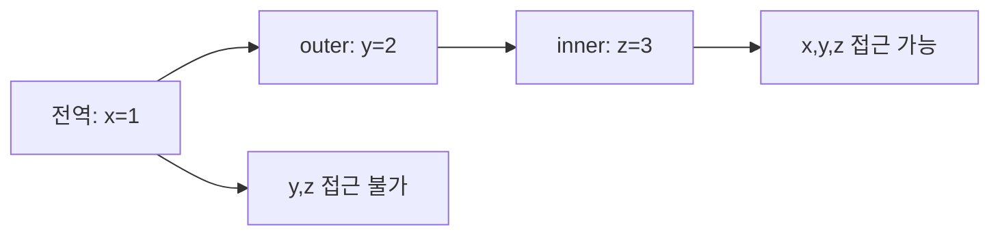
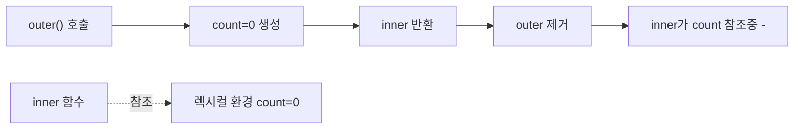
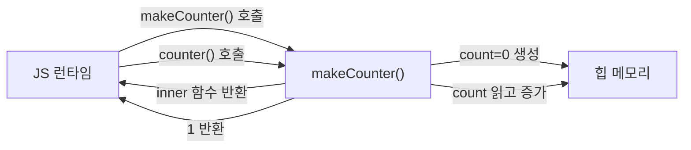
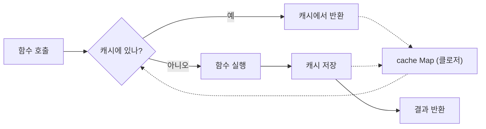
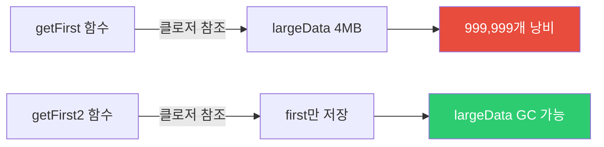
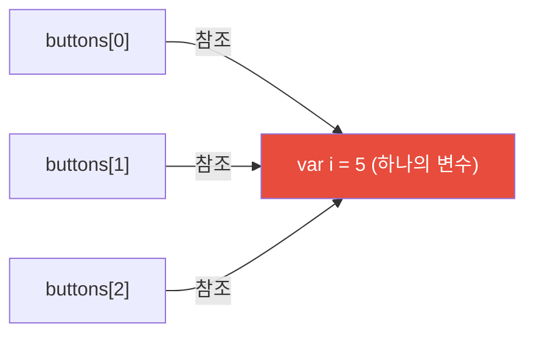
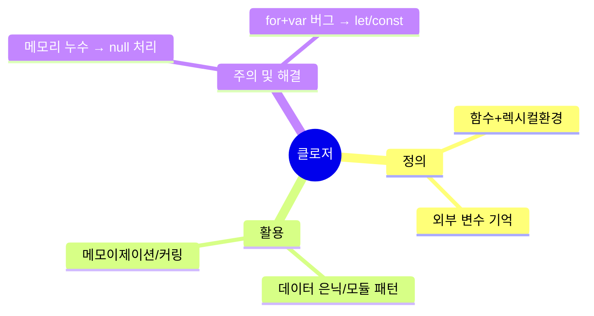

## 배달 음식의 비밀 봉투

배달 음식을 시키면 포장지 안에 음식이 들어 있습니다. 포장지를 열지 않아도 안에 뭐가 들었는지는 그 봉투만 알고 있습니다.

**클로저는 이 봉투와 같습니다.** 함수가 자신이 태어난 환경의 변수들을 포장해서 가지고 다닙니다. 외부에서는 직접 접근할 수 없지만, 그 함수를 통해서만 접근할 수 있습니다.

```javascript
function createSecret(password) {
  // password는 외부에서 직접 접근 불가
  return {
    check: (input) => input === password,
    change: (newPassword) => { password = newPassword; }
  };
}

const vault = createSecret('qwerty123');
console.log(vault.check('qwerty123')); // true
console.log(vault.check('wrongpass')); // false
// console.log(password); // ReferenceError!
```

이 예제 하나가 클로저의 핵심을 모두 담고 있습니다. 이제 왜 이게 가능한지부터 파헤쳐봅시다.

---

## 1. 렉시컬 스코프 — 클로저의 기반

클로저를 이해하려면 먼저 **렉시컬 스코프(Lexical Scope)**를 알아야 합니다.

렉시컬 스코프란 **함수가 어디서 정의됐느냐**에 따라 스코프가 결정되는 방식입니다. 어디서 호출됐느냐가 아닙니다. 이 차이가 핵심입니다.

> 비유: 학교 교칙을 생각해보세요. 학생은 어느 학교에 소속됐느냐에 따라 그 학교 규칙을 따릅니다. 외출해서 다른 학교 앞에 서 있어도, 본인 학교 규칙이 적용됩니다. 함수도 마찬가지입니다. 어디서 호출되든, 정의된 곳의 스코프 규칙을 따릅니다.



```javascript
const x = 1; // 전역

function outer() {
  const y = 2;

  function inner() {
    const z = 3;
    console.log(x, y, z); // 1, 2, 3 — 상위 스코프 모두 접근 가능
  }

  inner();
}

outer();
```

`inner` 함수는 `x`, `y`, `z` 모두에 접근할 수 있습니다. 왜냐하면 자신이 정의된 위치를 기준으로 스코프 체인을 따라 올라가기 때문입니다.

---

## 2. 클로저란 무엇인가

클로저는 **함수 + 그 함수가 선언된 렉시컬 환경**의 조합입니다.

보통 함수가 실행을 마치면 그 함수의 지역 변수는 메모리에서 사라집니다. 하지만 내부 함수가 외부 함수의 변수를 참조하고 있으면, 외부 함수가 끝나도 그 변수가 사라지지 않습니다. 내부 함수가 변수를 "붙잡고" 있기 때문입니다.

> 비유: 부모님이 이사를 가셨는데, 당신이 부모님 집 열쇠를 아직 가지고 있는 상황입니다. 부모님(외부 함수)은 이미 그 집에 살지 않지만, 열쇠(참조)를 가진 당신(내부 함수)은 여전히 그 집(변수)에 접근할 수 있습니다.



```javascript
function makeCounter() {
  let count = 0; // 이 변수는 makeCounter가 끝나도 사라지지 않음

  return function() {
    count++; // 외부 변수에 접근
    return count;
  };
}

const counter = makeCounter(); // makeCounter 실행 완료
// 보통이라면 count는 사라져야 하지만...

console.log(counter()); // 1 — count가 살아있음!
console.log(counter()); // 2
console.log(counter()); // 3
```

### 클로저가 생성되는 순간



---

## 3. 클로저 활용 패턴 1 — 데이터 은닉 (캡슐화)

클로저를 활용하면 JavaScript에서 private 변수를 구현할 수 있습니다. 만약 이걸 안 하면? 외부에서 잔액을 직접 조작하거나, 거래 내역을 마음대로 수정할 수 있게 됩니다.

> 비유: 은행 계좌를 생각해보세요. 잔액을 직접 수정할 수 없고, 반드시 입금/출금 함수를 통해서만 바꿀 수 있습니다. 클로저가 바로 이 창구 직원 역할을 합니다.

```javascript
function createBankAccount(initialBalance) {
  let balance = initialBalance; // private
  const transactionHistory = []; // private

  return {
    deposit(amount) {
      if (amount <= 0) throw new Error('금액은 양수여야 합니다');
      balance += amount;
      transactionHistory.push({ type: 'deposit', amount, balance });
      return balance;
    },

    withdraw(amount) {
      if (amount > balance) throw new Error('잔액 부족');
      balance -= amount;
      transactionHistory.push({ type: 'withdraw', amount, balance });
      return balance;
    },

    getBalance() {
      return balance; // 읽기만 허용
    },

    getHistory() {
      return [...transactionHistory]; // 복사본 반환 (직접 수정 방지)
    }
  };
}

const account = createBankAccount(10000);
account.deposit(5000);
account.withdraw(3000);

console.log(account.getBalance()); // 12000
// 직접 접근 불가
console.log(account.balance); // undefined
```

`balance`에 직접 접근이 불가능하기 때문에, 누군가 `account.balance = 999999999`로 잔액을 조작하려 해도 통하지 않습니다.

---

## 4. 클로저 활용 패턴 2 — 모듈 패턴

IIFE(즉시 실행 함수)와 클로저를 결합하면 완전한 모듈을 만들 수 있습니다. ES6 모듈 시스템이 나오기 전, 자바스크립트의 유일한 모듈화 수단이었습니다.

```javascript
const TodoModule = (function() {
  // private 상태
  let todos = [];
  let nextId = 1;

  // private 함수
  function validate(text) {
    return text && text.trim().length > 0;
  }

  // public API 반환
  return {
    add(text) {
      if (!validate(text)) throw new Error('할일을 입력하세요');
      const todo = { id: nextId++, text, completed: false };
      todos.push(todo);
      return todo;
    },

    complete(id) {
      const todo = todos.find(t => t.id === id);
      if (!todo) throw new Error('할일을 찾을 수 없습니다');
      todo.completed = true;
      return todo;
    },

    getAll() {
      return todos.map(t => ({ ...t })); // 불변 복사본
    },

    getPending() {
      return todos.filter(t => !t.completed).map(t => ({ ...t }));
    }
  };
})();

TodoModule.add('자바스크립트 공부');
TodoModule.add('클로저 이해');
TodoModule.complete(1);

console.log(TodoModule.getPending());
// [{ id: 2, text: '클로저 이해', completed: false }]
```


---

## 5. 클로저 활용 패턴 3 — 함수 팩토리

비슷하지만 약간씩 다른 함수들을 동적으로 만들 때 유용합니다. 반복 코드를 줄이고, 설정값을 함수 안에 "굳혀" 놓을 수 있습니다.

> 비유: 도장 찍기를 생각해보세요. 도장 틀(팩토리 함수)은 하나지만, 도장을 찍을 때마다 다른 글자(설정)를 넣어서 다른 도장(함수)을 만들 수 있습니다.

```javascript
function createDiscount(discountRate) {
  return function(price) {
    return price * (1 - discountRate);
  };
}

const student10 = createDiscount(0.10);  // 학생 10% 할인
const vip20 = createDiscount(0.20);      // VIP 20% 할인
const staff30 = createDiscount(0.30);    // 직원 30% 할인

console.log(student10(10000)); // 9000
console.log(vip20(10000));     // 8000
console.log(staff30(10000));   // 7000
```

각 함수는 자신이 만들어질 때의 `discountRate`를 클로저로 기억합니다. 이후 어디서 호출하든 그 값을 사용합니다.

### 더 실용적인 예: API 클라이언트 팩토리

```javascript
function createApiClient(baseUrl, defaultHeaders = {}) {
  async function request(endpoint, options = {}) {
    const response = await fetch(`${baseUrl}${endpoint}`, {
      headers: {
        'Content-Type': 'application/json',
        ...defaultHeaders,
        ...options.headers
      },
      ...options
    });

    if (!response.ok) {
      throw new Error(`HTTP ${response.status}: ${response.statusText}`);
    }

    return response.json();
  }

  return {
    get: (endpoint) => request(endpoint, { method: 'GET' }),
    post: (endpoint, data) => request(endpoint, {
      method: 'POST',
      body: JSON.stringify(data)
    }),
    delete: (endpoint) => request(endpoint, { method: 'DELETE' })
  };
}

const authApi = createApiClient('https://auth.example.com', {
  'X-Client-ID': 'web-app'
});

const userApi = createApiClient('https://api.example.com', {
  'Authorization': `Bearer ${localStorage.getItem('token')}`
});

// 각 API 클라이언트는 자신의 baseUrl과 headers를 클로저로 유지
await userApi.get('/users/1');
```

---

## 6. 클로저 활용 패턴 4 — 메모이제이션

비용이 큰 계산의 결과를 캐싱합니다. 함수가 호출될 때마다 같은 계산을 반복하지 않고, 처음 계산한 결과를 클로저 안에 저장해 재사용합니다.

> 비유: 수학 시험에서 같은 문제가 두 번 나왔을 때, 처음에 풀어둔 답안지를 다시 쓰는 것과 같습니다. 매번 처음부터 풀 필요가 없죠.

```javascript
function memoize(fn) {
  const cache = new Map(); // 클로저로 캐시 보존

  return function(...args) {
    const key = JSON.stringify(args);

    if (cache.has(key)) {
      console.log('캐시 히트!');
      return cache.get(key);
    }

    const result = fn.apply(this, args);
    cache.set(key, result);
    return result;
  };
}

const fibonacci = memoize(function(n) {
  if (n <= 1) return n;
  return fibonacci(n - 1) + fibonacci(n - 2);
});

console.time('첫 번째 계산');
console.log(fibonacci(40)); // 102334155
console.timeEnd('첫 번째 계산'); // 수십 ms

console.time('두 번째 계산');
console.log(fibonacci(40)); // 102334155
console.timeEnd('두 번째 계산'); // 거의 0ms — 캐시 히트!
```



---

## 7. 메모리 누수 — 클로저의 부작용

클로저는 참조를 유지하므로 잘못 사용하면 메모리 누수가 발생합니다. 이 부분을 모르면 앱이 시간이 지날수록 점점 느려지는 원인을 찾지 못합니다.

```javascript
// 메모리 누수 예시
function createHeavyResource() {
  const largeData = new Array(1000000).fill('*'); // 약 4MB 데이터

  return function() {
    // largeData 중 딱 하나만 사용하지만
    // 전체 배열이 계속 메모리에 유지됨
    return largeData[0];
  };
}

const getFirst = createHeavyResource();
// largeData 전체가 GC되지 않음 — 4MB가 계속 메모리 점유
```



```javascript
// 해결 방법: 필요한 값만 클로저에 포함
function createHeavyResource_Fixed() {
  const largeData = new Array(1000000).fill('*');
  const first = largeData[0]; // 필요한 값만 추출
  // largeData는 이 함수 종료 시 GC 가능 (아래 함수가 참조 안 함)

  return function() {
    return first; // largeData 전체가 아닌 first만 참조
  };
}
```

### DOM 이벤트 리스너 누수

```javascript
// 메모리 누수 패턴
function attachHandler(element) {
  const data = fetchHugeData(); // 큰 데이터

  element.addEventListener('click', function() {
    process(data); // element와 data 모두 클로저에 포함
  });
  // element가 DOM에서 제거되어도 이벤트 리스너가 element를 참조
  // element도 리스너를 참조 → 순환 참조 → GC 불가
}

// 해결: AbortController로 명시적 클린업
function attachHandlerSafe(element) {
  const controller = new AbortController();

  element.addEventListener('click', (e) => {
    // 처리
  }, { signal: controller.signal });

  return () => controller.abort(); // 클린업 함수 반환
}

const cleanup = attachHandlerSafe(element);
// 나중에 컴포넌트 언마운트 시
cleanup(); // 리스너 제거, 메모리 해제
```

---

## 8. 클래식 버그 — for 루프와 클로저

자바스크립트에서 가장 유명한 클로저 버그입니다. 모르면 반드시 한 번은 당합니다.

```javascript
// 버그 코드
var buttons = [];
for (var i = 0; i < 5; i++) {
  buttons[i] = function() {
    console.log(i); // 모두 5 출력!
  };
}

buttons[0](); // 5
buttons[1](); // 5
```

왜 이럴까요? `var i`는 함수 스코프이기 때문에 루프 전체에서 **단 하나의 i**만 존재합니다. 루프가 끝나면 `i = 5`가 됩니다. 모든 함수가 같은 `i`를 참조하기 때문에 모두 5를 출력합니다.



```javascript
// 해결 방법 1: IIFE로 각 반복마다 새 스코프
var buttons = [];
for (var i = 0; i < 5; i++) {
  buttons[i] = (function(j) {
    return function() {
      console.log(j); // j는 각 IIFE의 고유한 매개변수
    };
  })(i);
}

// 해결 방법 2: let 사용 (권장 — 가장 깔끔)
const buttons2 = [];
for (let i = 0; i < 5; i++) {
  buttons2[i] = function() {
    console.log(i); // let은 각 반복마다 새 바인딩
  };
}

buttons2[0](); // 0
buttons2[1](); // 1
buttons2[2](); // 2
```

---

## 9. 클로저와 가비지 컬렉션 — 언제 메모리가 해제되나

```javascript
function outer() {
  const big = new Array(10000).fill('data'); // 큰 데이터
  const small = 42; // 작은 데이터

  return function() {
    return small; // small만 참조
    // big은 참조 안 함 → GC 가능
  };
}

const fn = outer();
// big은 이제 참조 없음 → GC 가능
// small은 fn이 참조 중 → 유지

fn = null; // fn도 제거하면 small도 GC 가능
```

클로저가 참조하는 변수만 메모리에 남습니다. 클로저가 필요 없어지면 변수에 `null`을 할당해 명시적으로 참조를 끊어주세요.

---

## 10. 고급 패턴 — 부분 적용 함수와 커링

클로저를 활용한 함수형 프로그래밍 패턴입니다. 함수의 인자를 분리해서 재사용성을 높입니다.

> 비유: 스탬프 카드를 생각해보세요. "10번 방문"이라는 조건(첫 번째 인자)을 미리 설정해두고, 실제 방문할 때마다(두 번째 인자) 스탬프를 찍습니다.

```javascript
// 부분 적용(Partial Application)
function partial(fn, ...presetArgs) {
  return function(...laterArgs) {
    return fn(...presetArgs, ...laterArgs);
  };
}

function multiply(x, y, z) {
  return x * y * z;
}

const double = partial(multiply, 2);    // 첫 인자 2로 고정
const triple = partial(multiply, 3);    // 첫 인자 3으로 고정
const sixTimes = partial(multiply, 2, 3); // 첫 두 인자 고정

console.log(double(4, 5));   // 40 (2 * 4 * 5)
console.log(triple(4, 5));   // 60 (3 * 4 * 5)
console.log(sixTimes(7));    // 42 (2 * 3 * 7)
```

### 커링 구현

```javascript
function curry(fn) {
  return function curried(...args) {
    if (args.length >= fn.length) {
      return fn.apply(this, args);
    }
    return function(...args2) {
      return curried.apply(this, args.concat(args2));
    };
  };
}

const curriedAdd = curry((a, b, c) => a + b + c);

console.log(curriedAdd(1)(2)(3));   // 6
console.log(curriedAdd(1, 2)(3));   // 6
console.log(curriedAdd(1)(2, 3));   // 6
console.log(curriedAdd(1, 2, 3));   // 6
```

---

## 11. 클로저 vs 클래스 비교 — 어느 것을 선택할까

```javascript
// 클로저 방식
function createCounter(initial = 0) {
  let count = initial;

  return {
    increment: () => ++count,
    decrement: () => --count,
    getCount: () => count,
    reset: () => { count = initial; }
  };
}

// 클래스 방식 (ES2022 private fields)
class Counter {
  #count;
  #initial;

  constructor(initial = 0) {
    this.#count = initial;
    this.#initial = initial;
  }

  increment() { return ++this.#count; }
  decrement() { return --this.#count; }
  getCount() { return this.#count; }
  reset() { this.#count = this.#initial; }
}
```

어떤 걸 써야 할까요? 상황에 따라 다릅니다.

| 비교 항목 | 클로저 | 클래스 |
|----------|--------|-------|
| 문법 | 함수 반환 | class 키워드 |
| private | 클로저로 자연스럽게 지원 | # 키워드 (ES2022) |
| 상속 | 수동 구현 복잡 | extends로 쉬움 |
| 메모리 | 인스턴스마다 함수 복사 | prototype 공유 |
| 직관성 | OOP 배경 없이 이해 가능 | OOP 개념 필요 |

여러 인스턴스를 만들고 상속이 필요하면 클래스, 단순히 상태를 캡슐화하고 싶으면 클로저가 더 간단합니다.

---

## 12. 정리: 클로저 체크리스트



클로저는 단순히 "외부 변수에 접근하는 함수"가 아닙니다. 자바스크립트의 함수형 프로그래밍, 모듈 시스템, 상태 관리의 근간이 되는 핵심 개념입니다. React Hooks, Redux, 모든 JavaScript 라이브러리가 클로저를 기반으로 동작합니다. 클로저를 이해하면 이 모든 것의 동작 원리가 보이기 시작합니다.

---

## 왜 클로저인가? (vs 전역 변수 vs 클래스)

| 방식 | 캡슐화 | 상태 유지 | 부작용 위험 | 적합 용도 |
|---|---|---|---|---|
| 전역 변수 | 없음 | 가능 | 높음 (어디서든 수정) | 지양 |
| 클래스 인스턴스 | 중간 (`private` 필요) | 가능 | 중간 | OOP 패턴 |
| 클로저 | 완전 (외부 접근 불가) | 가능 | 낮음 | 함수형 패턴, 팩토리 |

클로저는 `private` 키워드 없이도 진정한 캡슐화를 구현할 수 있는 유일한 방법이다. React의 `useState`가 클로저로 구현되는 것이 그 증거다.

---

## 실무에서 자주 하는 실수

### 실수 1: var 루프 클로저 트랩

```javascript
// 나쁜 예 — var는 함수 스코프, i가 공유됨
for (var i = 0; i < 3; i++) {
  setTimeout(() => console.log(i), 0)
}
// 출력: 3, 3, 3 (루프 종료 후 i=3)

// 해결 1 — let 사용 (블록 스코프)
for (let i = 0; i < 3; i++) {
  setTimeout(() => console.log(i), 0)
}
// 출력: 0, 1, 2

// 해결 2 — IIFE로 클로저 캡처
for (var i = 0; i < 3; i++) {
  ;(function(j) {
    setTimeout(() => console.log(j), 0)
  })(i)
}
```

### 실수 2: useEffect에서 stale closure

```javascript
// 나쁜 예 — count가 초기값 0으로 고정됨 (stale closure)
function Counter() {
  const [count, setCount] = useState(0)
  useEffect(() => {
    const id = setInterval(() => {
      setCount(count + 1)  // count는 항상 0
    }, 1000)
    return () => clearInterval(id)
  }, [])  // 의존성 배열 비어있음

// 좋은 예 — 함수형 업데이트로 최신 값 참조
  useEffect(() => {
    const id = setInterval(() => {
      setCount(prev => prev + 1)  // 항상 최신 값
    }, 1000)
    return () => clearInterval(id)
  }, [])
}
```

### 실수 3: 클로저로 인한 메모리 누수

```javascript
// 위험한 패턴 — 큰 데이터가 클로저에 캡처되어 GC 불가
function setup() {
  const largeData = new Array(1000000).fill('data')
  document.addEventListener('click', () => {
    console.log(largeData[0])  // largeData가 클로저에 묶임
  })
  // 이벤트 리스너를 제거하지 않으면 largeData는 영원히 메모리에 남음
}

// 해결 — 리스너 제거 또는 필요한 데이터만 캡처
function setup() {
  const largeData = new Array(1000000).fill('data')
  const firstItem = largeData[0]  // 필요한 것만 캡처
  const handler = () => console.log(firstItem)
  document.addEventListener('click', handler)
  return () => document.removeEventListener('click', handler)  // cleanup 반환
}
```

---

## 면접 포인트

**Q1. 클로저란 무엇인가?**

함수가 자신이 생성된 렉시컬 환경(스코프)을 기억하여, 그 환경 밖에서 실행되더라도 해당 환경의 변수에 접근할 수 있는 특성이다. 함수가 반환된 후에도 외부 함수의 변수가 메모리에 유지되는 것이 핵심이다. 실용적으로는 "데이터 프라이버시"와 "상태 유지"를 함수만으로 구현하는 메커니즘이다.

**Q2. 클로저가 React Hook에서 어떻게 쓰이는가?**

`useState`는 내부적으로 클로저로 구현된다. `useState`가 반환하는 `setState` 함수는 상태 값이 저장된 렉시컬 환경을 캡처한다. `useCallback`이 반환하는 함수도 클로저다 — deps 배열이 변경되기 전까지 이전 렌더의 변수를 캡처한(stale) 함수를 반환한다. stale closure 버그가 이 원리에서 발생한다.

**Q3. 클로저로 private 변수를 만드는 방법은?**

```javascript
function createCounter() {
  let count = 0  // 외부에서 직접 접근 불가
  return {
    increment: () => ++count,
    decrement: () => --count,
    getCount: () => count
  }
}
const counter = createCounter()
counter.increment()
console.log(counter.count)     // undefined (접근 불가)
console.log(counter.getCount()) // 1
```

**Q4. 클로저와 스코프 체인의 관계는?**

클로저는 스코프 체인의 영속화다. 일반적으로 함수 실행이 끝나면 실행 컨텍스트와 내부 변수가 제거된다. 하지만 내부 함수가 외부 함수의 변수를 참조하면, 해당 변수는 참조가 살아있는 한 GC 대상이 되지 않는다. 스코프 체인을 통해 내부 함수 → 외부 함수 → 전역 순으로 변수를 탐색하는 메커니즘이 클로저의 기반이다.
