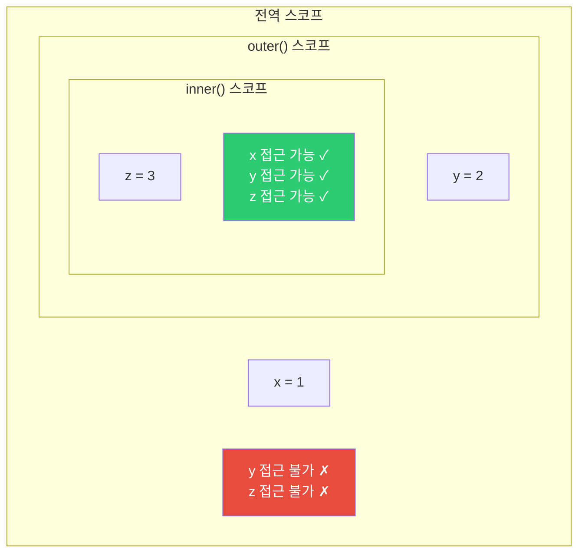
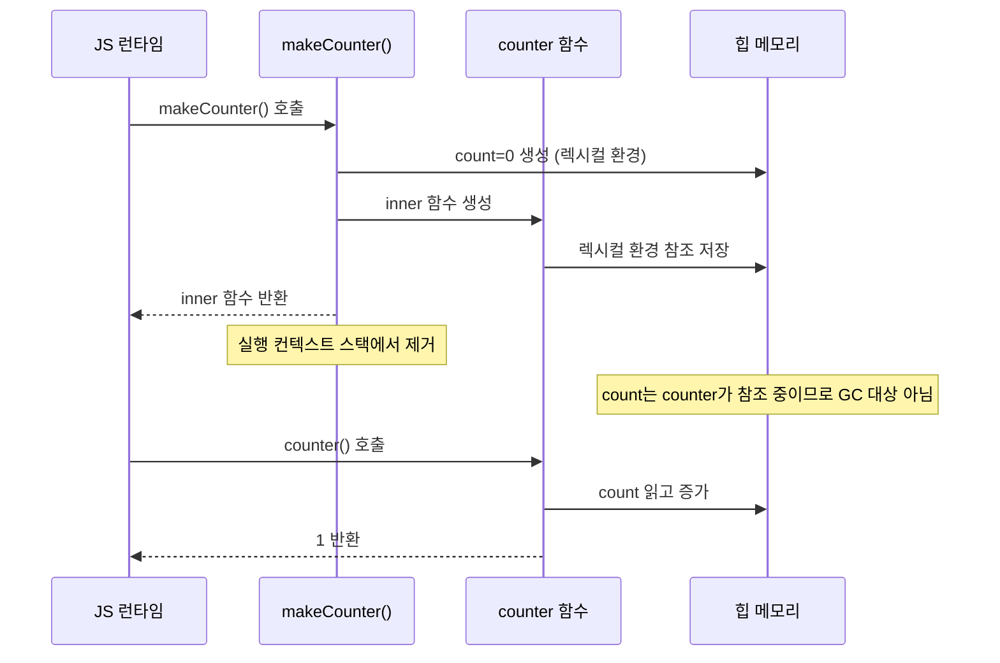
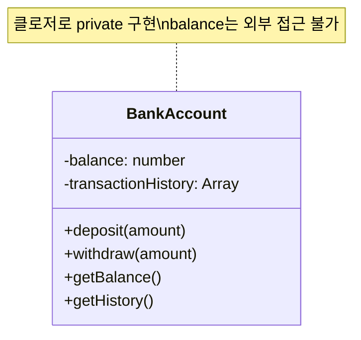
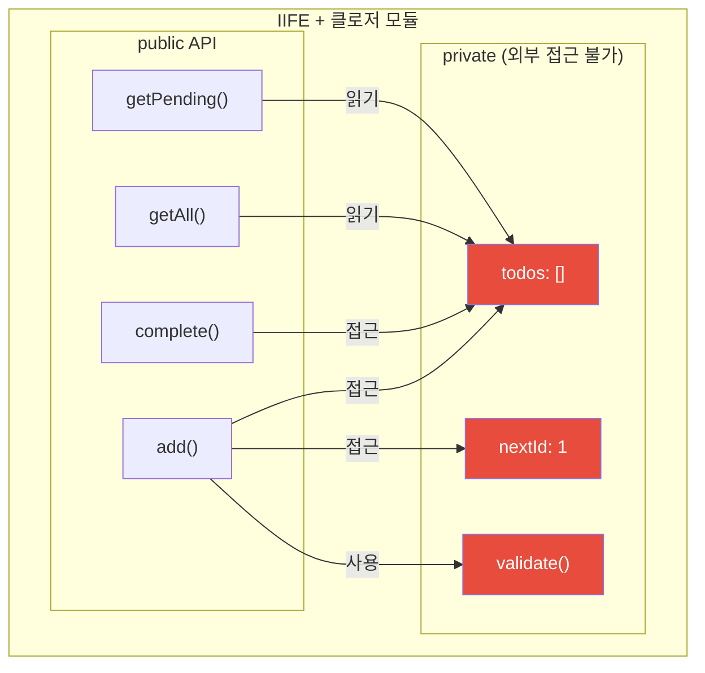
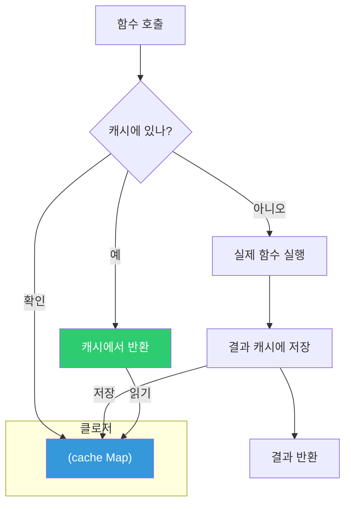
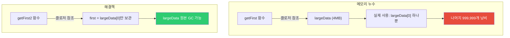
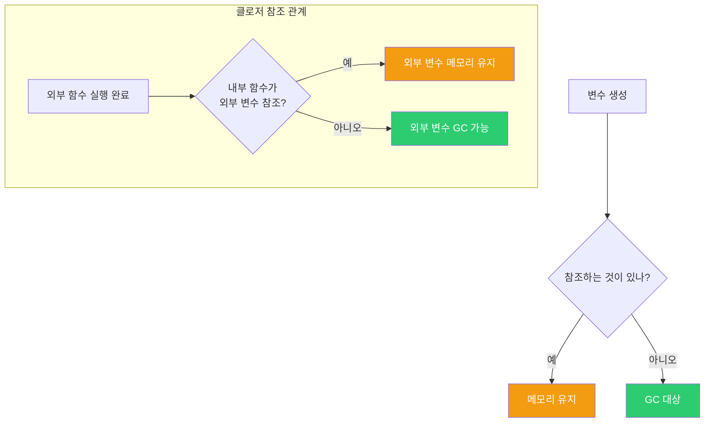
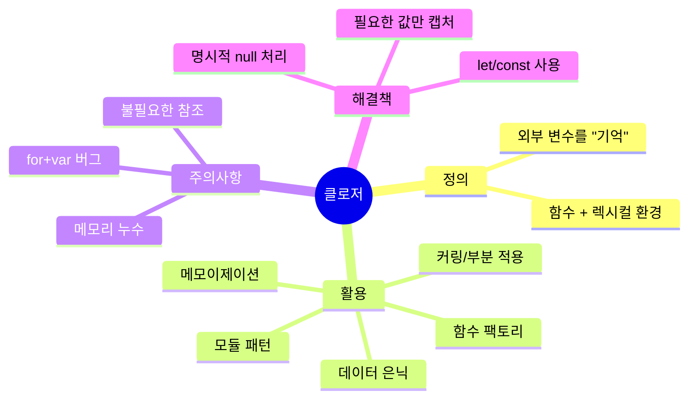

## 배달 음식의 비밀 봉투

배달 음식을 시키면 포장지 안에 음식이 들어 있습니다. 포장지를 열지 않아도 안에 뭐가 들었는지는 그 봉투만 알고 있습니다.

**클로저는 이 봉투와 같습니다.** 함수가 자신이 태어난 환경의 변수들을 포장해서 가지고 다닙니다. 외부에서는 직접 접근할 수 없지만, 그 함수를 통해서만 접근할 수 있습니다.

```javascript
function createSecret(password) {
  // password는 외부에서 직접 접근 불가
  return {
    check: (input) => input === password,
    change: (newPassword) => { password = newPassword; }
  };
}

const vault = createSecret('qwerty123');
console.log(vault.check('qwerty123')); // true
console.log(vault.check('wrongpass')); // false
// console.log(password); // ReferenceError!
```

---

## 1. 렉시컬 스코프 - 클로저의 기반

클로저를 이해하려면 먼저 **렉시컬 스코프**를 알아야 합니다.



```javascript
const x = 1; // 전역

function outer() {
  const y = 2;

  function inner() {
    const z = 3;
    console.log(x, y, z); // 1, 2, 3 - 상위 스코프 모두 접근 가능
  }

  inner();
}

outer();
```

**렉시컬 스코프**: 함수가 **어디서 정의됐느냐**에 따라 스코프가 결정됩니다. 어디서 호출됐느냐가 아닙니다.

---

## 2. 클로저란 무엇인가

클로저는 **함수 + 그 함수가 선언된 렉시컬 환경**의 조합입니다.

```mermaid
flowchart LR
    subgraph "outer() 실행 완료 후"
        subgraph "클로저"
            FN["inner 함수"]
            ENV["렉시컬 환경<br>count = 0 ("유지!")"]
            FN -.-->|"참조"| ENV
        end
    end

    A["outer() 호출"] --> B["count = 0 생성"]
    B --> C["inner 함수 반환"]
    C --> D["outer() 스택에서 제거"]
    D --> E["일반적으로 count 사라져야 하지만..."]
    E --> F["inner가 count를 참조 중이므로 유지!"]

    style ENV fill:#e74c3c,color:#fff
    style F fill:#f39c12,color:#fff
```

```javascript
function makeCounter() {
  let count = 0; // 이 변수는 makeCounter가 끝나도 사라지지 않음

  return function() {
    count++; // 외부 변수에 접근
    return count;
  };
}

const counter = makeCounter(); // makeCounter 실행 완료
// 보통이라면 count는 사라져야 하지만...

console.log(counter()); // 1 - count가 살아있음!
console.log(counter()); // 2
console.log(counter()); // 3
```

### 클로저가 생성되는 순간



---

## 3. 클로저 활용 패턴 1 - 데이터 은닉 (캡슐화)

클로저를 사용하면 private 변수를 구현할 수 있습니다.

```javascript
function createBankAccount(initialBalance) {
  let balance = initialBalance; // private
  const transactionHistory = []; // private

  return {
    deposit(amount) {
      if (amount <= 0) throw new Error('금액은 양수여야 합니다');
      balance += amount;
      transactionHistory.push({ type: 'deposit', amount, balance });
      return balance;
    },

    withdraw(amount) {
      if (amount > balance) throw new Error('잔액 부족');
      balance -= amount;
      transactionHistory.push({ type: 'withdraw', amount, balance });
      return balance;
    },

    getBalance() {
      return balance; // 읽기만 허용
    },

    getHistory() {
      return [...transactionHistory]; // 복사본 반환 (직접 수정 방지)
    }
  };
}

const account = createBankAccount(10000);
account.deposit(5000);
account.withdraw(3000);

console.log(account.getBalance()); // 12000
console.log(account.getHistory());
// [{ type: 'deposit', amount: 5000, balance: 15000 }, ...]

// 직접 접근 불가
console.log(account.balance); // undefined
```



---

## 4. 클로저 활용 패턴 2 - 모듈 패턴

IIFE(즉시 실행 함수)와 클로저를 결합한 모듈 패턴입니다.

```javascript
const TodoModule = (function() {
  // private 상태
  let todos = [];
  let nextId = 1;

  // private 함수
  function validate(text) {
    return text && text.trim().length > 0;
  }

  // public API 반환
  return {
    add(text) {
      if (!validate(text)) throw new Error('할일을 입력하세요');
      const todo = { id: nextId++, text, completed: false };
      todos.push(todo);
      return todo;
    },

    complete(id) {
      const todo = todos.find(t => t.id === id);
      if (!todo) throw new Error('할일을 찾을 수 없습니다');
      todo.completed = true;
      return todo;
    },

    getAll() {
      return todos.map(t => ({ ...t })); // 불변 복사본
    },

    getPending() {
      return todos.filter(t => !t.completed).map(t => ({ ...t }));
    }
  };
})();

TodoModule.add('자바스크립트 공부');
TodoModule.add('클로저 이해');
TodoModule.complete(1);

console.log(TodoModule.getPending());
// [{ id: 2, text: '클로저 이해', completed: false }]
```



---

## 5. 클로저 활용 패턴 3 - 함수 팩토리

비슷하지만 약간씩 다른 함수들을 동적으로 만들 때 유용합니다.

```javascript
// 할인율을 매개변수로 받아 할인 함수를 반환
function createDiscount(discountRate) {
  return function(price) {
    return price * (1 - discountRate);
  };
}

const student10 = createDiscount(0.10);  // 학생 10% 할인
const vip20 = createDiscount(0.20);      // VIP 20% 할인
const staff30 = createDiscount(0.30);    // 직원 30% 할인

console.log(student10(10000)); // 9000
console.log(vip20(10000));     // 8000
console.log(staff30(10000));   // 7000
```

### 더 실용적인 예: API 클라이언트 팩토리

```javascript
function createApiClient(baseUrl, defaultHeaders = {}) {
  async function request(endpoint, options = {}) {
    const response = await fetch(`${baseUrl}${endpoint}`, {
      headers: {
        'Content-Type': 'application/json',
        ...defaultHeaders,
        ...options.headers
      },
      ...options
    });

    if (!response.ok) {
      throw new Error(`HTTP ${response.status}: ${response.statusText}`);
    }

    return response.json();
  }

  return {
    get: (endpoint) => request(endpoint, { method: 'GET' }),
    post: (endpoint, data) => request(endpoint, {
      method: 'POST',
      body: JSON.stringify(data)
    }),
    put: (endpoint, data) => request(endpoint, {
      method: 'PUT',
      body: JSON.stringify(data)
    }),
    delete: (endpoint) => request(endpoint, { method: 'DELETE' })
  };
}

const authApi = createApiClient('https://auth.example.com', {
  'X-Client-ID': 'web-app'
});

const userApi = createApiClient('https://api.example.com', {
  'Authorization': `Bearer ${localStorage.getItem('token')}`
});

// 각 API 클라이언트는 자신의 baseUrl과 headers를 클로저로 유지
await userApi.get('/users/1');
```

---

## 6. 클로저 활용 패턴 4 - 메모이제이션

비용이 큰 계산의 결과를 캐싱합니다.

```javascript
function memoize(fn) {
  const cache = new Map(); // 클로저로 캐시 보존

  return function(...args) {
    const key = JSON.stringify(args);

    if (cache.has(key)) {
      console.log('캐시 히트!');
      return cache.get(key);
    }

    const result = fn.apply(this, args);
    cache.set(key, result);
    return result;
  };
}

// 피보나치 수열 (재귀, 느림)
const fibonacci = memoize(function(n) {
  if (n <= 1) return n;
  return fibonacci(n - 1) + fibonacci(n - 2);
});

console.time('첫 번째 계산');
console.log(fibonacci(40)); // 102334155
console.timeEnd('첫 번째 계산');

console.time('두 번째 계산');
console.log(fibonacci(40)); // 102334155 - 즉시!
console.timeEnd('두 번째 계산');
```



---

## 7. 클로저 활용 패턴 5 - 이벤트 핸들러와 상태 관리

```javascript
function createToggle(element) {
  let isActive = false; // private 상태

  function toggle() {
    isActive = !isActive;
    element.classList.toggle('active', isActive);
    element.textContent = isActive ? '켜짐' : '꺼짐';
  }

  function getState() {
    return isActive;
  }

  element.addEventListener('click', toggle);

  return { getState, toggle };
}

const btn1 = createToggle(document.getElementById('btn1'));
const btn2 = createToggle(document.getElementById('btn2'));

// 각 버튼은 독립적인 isActive 상태를 클로저로 유지
btn1.toggle(); // btn1만 토글
console.log(btn2.getState()); // false - btn2는 영향 없음
```

---

## 8. 메모리 누수 - 클로저의 부작용

클로저는 참조를 유지하므로 잘못 사용하면 메모리 누수가 발생합니다.

```javascript
// 메모리 누수 예시
function createHeavyResource() {
  const largeData = new Array(1000000).fill('*'); // 4MB 데이터

  return function() {
    // largeData 중 딱 하나만 사용하지만
    // 전체 배열이 계속 메모리에 유지됨
    return largeData[0];
  };
}

const getFirst = createHeavyResource();
// largeData 전체가 GC되지 않음
```



```javascript
// 해결 방법: 필요한 값만 클로저에 포함
function createHeavyResource_Fixed() {
  const largeData = new Array(1000000).fill('*');
  const first = largeData[0]; // 필요한 값만 추출
  // largeData는 함수 종료 시 GC 가능 (아래 함수가 참조 안 함)

  return function() {
    return first; // largeData 전체가 아닌 first만 참조
  };
}
```

### DOM 이벤트 리스너 누수

```javascript
// 메모리 누수 패턴
function attachHandler(element) {
  const data = fetchHugeData(); // 큰 데이터

  element.addEventListener('click', function() {
    process(data); // element와 data 모두 클로저에 포함
  });
  // element가 DOM에서 제거되어도 이벤트 리스너가 element를 참조
  // element도 리스너를 참조 → 순환 참조
}

// 해결: removeEventListener 또는 AbortController
function attachHandlerSafe(element) {
  const controller = new AbortController();

  element.addEventListener('click', (e) => {
    // 처리
  }, { signal: controller.signal });

  return () => controller.abort(); // 클린업 함수 반환
}

const cleanup = attachHandlerSafe(element);
// 나중에
cleanup(); // 리스너 제거, 메모리 해제
```

---

## 9. 클래식 버그 - for 루프와 클로저

자바스크립트에서 가장 유명한 클로저 버그입니다.

```javascript
// 버그 코드
var buttons = [];
for (var i = 0; i < 5; i++) {
  buttons[i] = function() {
    console.log(i); // 모두 5 출력!
  };
}

buttons[0](); // 5
buttons[1](); // 5
buttons[2](); // 5
```

```mermaid
graph TD
    subgraph "for 루프 종료 후"
        I["var i = 5 ("하나의 변수")"]
        B0["buttons[0]"] -->|"참조"| I
        B1["buttons[1]"] -->|"참조"| I
        B2["buttons[2]"] -->|"참조"| I
        B3["buttons[3]"] -->|"참조"| I
        B4["buttons[4]"] -->|"참조"| I
    end

    style I fill:#e74c3c,color:#fff
```

```javascript
// 해결 방법 1: IIFE로 각 반복마다 새 스코프
var buttons = [];
for (var i = 0; i < 5; i++) {
  buttons[i] = (function(j) {
    return function() {
      console.log(j); // j는 각 IIFE의 고유한 매개변수
    };
  })(i);
}

// 해결 방법 2: let 사용 (권장)
const buttons2 = [];
for (let i = 0; i < 5; i++) {
  buttons2[i] = function() {
    console.log(i); // let은 블록 스코프, 각 반복마다 새 바인딩
  };
}

buttons2[0](); // 0
buttons2[1](); // 1
buttons2[2](); // 2
```

---

## 10. 클로저와 가비지 컬렉션



```javascript
function outer() {
  const big = new Array(10000).fill('data'); // 큰 데이터
  const small = 42; // 작은 데이터

  return function() {
    return small; // small만 참조
    // big은 참조 안 함 → GC 가능
  };
}

const fn = outer();
// big은 이제 참조 없음 → GC
// small은 fn이 참조 중 → 유지

fn = null; // fn도 제거하면 small도 GC 가능
```

---

## 11. 실전 예제 - React의 useState 구현

React의 `useState`가 클로저 기반으로 동작합니다.

```javascript
// useState의 원리
function useState(initialValue) {
  let state = initialValue; // 클로저로 상태 보존

  function getState() {
    return state;
  }

  function setState(newValue) {
    state = newValue;
    render(); // 리렌더링 트리거
  }

  return [getState, setState];
}

// 실제 React useState 흉내내기
function createReactState() {
  let states = [];
  let cursor = 0;

  function useState(initialValue) {
    const currentCursor = cursor;

    if (states[currentCursor] === undefined) {
      states[currentCursor] = initialValue;
    }

    function setState(newValue) {
      states[currentCursor] = newValue;
      cursor = 0; // 리셋 후 리렌더링
    }

    cursor++;
    return [states[currentCursor], setState];
  }

  return { useState, reset: () => { cursor = 0; } };
}
```

---

## 12. 고급 패턴 - 부분 적용 함수

```javascript
// 부분 적용(Partial Application)
function partial(fn, ...presetArgs) {
  return function(...laterArgs) {
    return fn(...presetArgs, ...laterArgs);
  };
}

function multiply(x, y, z) {
  return x * y * z;
}

const double = partial(multiply, 2);    // 첫 인자 2로 고정
const triple = partial(multiply, 3);    // 첫 인자 3으로 고정
const sixTimes = partial(multiply, 2, 3); // 첫 두 인자 고정

console.log(double(4, 5));   // 40 (2 * 4 * 5)
console.log(triple(4, 5));   // 60 (3 * 4 * 5)
console.log(sixTimes(7));    // 42 (2 * 3 * 7)
```

### 커링 구현

```javascript
function curry(fn) {
  return function curried(...args) {
    if (args.length >= fn.length) {
      return fn.apply(this, args);
    }
    return function(...args2) {
      return curried.apply(this, args.concat(args2));
    };
  };
}

const curriedAdd = curry((a, b, c) => a + b + c);

console.log(curriedAdd(1)(2)(3));   // 6
console.log(curriedAdd(1, 2)(3));   // 6
console.log(curriedAdd(1)(2, 3));   // 6
console.log(curriedAdd(1, 2, 3));   // 6
```

---

## 13. 극한 시나리오 - 클로저 중첩

```javascript
function level1(a) {
  return function level2(b) {
    return function level3(c) {
      return function level4(d) {
        // 모든 상위 스코프의 변수에 접근 가능
        return a + b + c + d;
      };
    };
  };
}

const fn = level1(1)(2)(3);
console.log(fn(4)); // 10

// 성능 주의: 깊은 클로저는 스코프 체인 탐색 비용 증가
// 너무 깊은 중첩은 피하는 것이 좋음
```

---

## 14. 클로저 vs 클래스 비교

```mermaid
graph LR
    subgraph "클로저 방식"
        CF["function createCounter()"]
        CF --> CP["private: count"]
        CF --> CI["increment()"]
        CF --> CD["decrement()"]
        CF --> CG["getCount()"]
    end

    subgraph "클래스 방식"
        CC["class Counter"]
        CC --> CCF["#count ("private 필드")"]
        CC --> CCI["increment()"]
        CC --> CCD["decrement()"]
        CC --> CCG["getCount()"]
    end

    style CP fill:#e74c3c,color:#fff
    style CCF fill:#e74c3c,color:#fff
```

```javascript
// 클로저 방식
function createCounter(initial = 0) {
  let count = initial;

  return {
    increment: () => ++count,
    decrement: () => --count,
    getCount: () => count,
    reset: () => { count = initial; }
  };
}

// 클래스 방식 (ES2022 private fields)
class Counter {
  #count;
  #initial;

  constructor(initial = 0) {
    this.#count = initial;
    this.#initial = initial;
  }

  increment() { return ++this.#count; }
  decrement() { return --this.#count; }
  getCount() { return this.#count; }
  reset() { this.#count = this.#initial; }
}
```

| 비교 항목 | 클로저 | 클래스 |
|----------|--------|-------|
| 문법 | 함수 반환 | class 키워드 |
| private | 클로저 자연스럽게 지원 | # 키워드 (ES2022) |
| 상속 | 수동 구현 복잡 | extends로 쉬움 |
| 메모리 | 인스턴스마다 함수 복사 | prototype 공유 |
| 직관성 | OOP 배경 없이 이해 가능 | OOP 개념 필요 |

---

## 15. 정리: 클로저 체크리스트



클로저는 단순히 "외부 변수에 접근하는 함수"가 아닙니다. 자바스크립트의 함수형 프로그래밍, 모듈 시스템, 상태 관리의 근간이 되는 핵심 개념입니다. React Hooks, Redux, 모든 JavaScript 라이브러리가 클로저를 기반으로 동작합니다.
