## 식당 주방에서 일어나는 일

혼자 운영하는 라면 가게를 상상해 보세요. 사장님(자바스크립트 엔진)은 단 한 명입니다. 손님들이 동시에 주문을 넣어도, 사장님은 **한 번에 라면 하나만** 끓일 수 있습니다.

- 손님 A가 라면을 주문합니다 → 즉시 끓이기 시작
- 손님 B가 주문합니다 → 대기줄(큐)에 메모
- 라면이 끓는 동안 타이머(Web API)가 3분을 재고 있습니다
- 사장님은 빈 시간에 대기줄을 확인해 다음 주문을 처리

이것이 바로 **이벤트 루프**의 본질입니다. 자바스크립트는 싱글 스레드지만 비동기 작업을 우아하게 처리합니다.

---

## 1. 자바스크립트 런타임 구조

자바스크립트 런타임은 여러 구성 요소가 협력하는 시스템입니다.

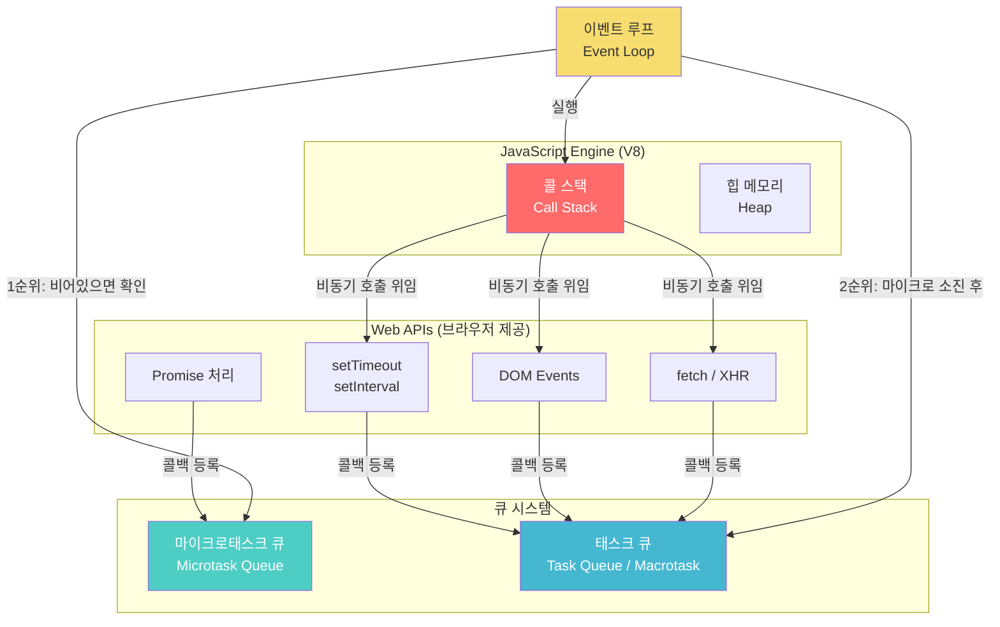

### 각 구성 요소 설명

| 구성 요소 | 역할 | 예시 |
|-----------|------|------|
| 콜 스택 (Call Stack) | 현재 실행 중인 함수들의 스택 | 동기 코드 실행 |
| 힙 (Heap) | 객체가 저장되는 메모리 공간 | 변수, 함수 객체 |
| Web API | 브라우저가 제공하는 비동기 기능 | setTimeout, fetch, addEventListener |
| 마이크로태스크 큐 | Promise 콜백, queueMicrotask | .then(), .catch(), async/await |
| 태스크 큐 | 일반 비동기 콜백 | setTimeout, setInterval, I/O |
| 이벤트 루프 | 큐를 감시하고 콜스택에 전달 | 조율자 역할 |

---

## 2. 콜 스택 (Call Stack) 동작 원리

콜 스택은 **LIFO(Last In, First Out)** 구조입니다. 마지막에 쌓인 것이 먼저 실행됩니다.

```javascript
function greet(name) {
  return `Hello, ${name}!`;
}

function sayHello() {
  const result = greet('World');
  console.log(result);
}

sayHello();
```

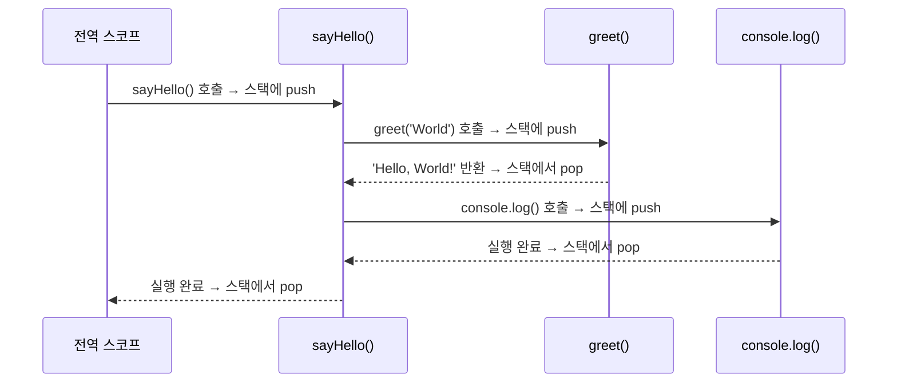

### 스택 오버플로우

재귀 호출이 무한히 반복되면 콜 스택이 꽉 찹니다.

```javascript
// 위험! 스택 오버플로우
function infinite() {
  return infinite(); // 종료 조건 없는 재귀
}

infinite(); // RangeError: Maximum call stack size exceeded
```

---

## 3. 이벤트 루프의 정확한 동작 알고리즘

이벤트 루프는 단순해 보이지만 정확한 순서가 있습니다.

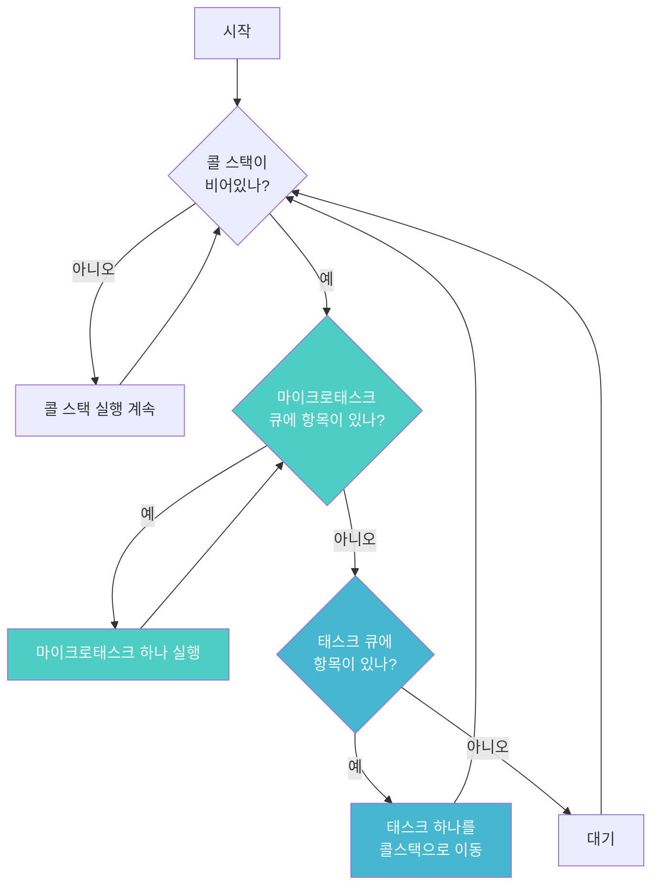

### 핵심 규칙

1. **콜 스택이 빌 때까지** 현재 작업을 완수합니다
2. **마이크로태스크 큐를 완전히 비운 후** 태스크 큐를 처리합니다
3. 태스크 큐에서는 **한 번에 하나씩만** 가져옵니다
4. 태스크 하나가 끝나면 **다시 마이크로태스크 큐**를 확인합니다

---

## 4. 마이크로태스크 vs 태스크(매크로태스크)

이 차이가 가장 중요합니다. 면접에서도 자주 나오는 핵심 개념입니다.

### 마이크로태스크 (높은 우선순위)

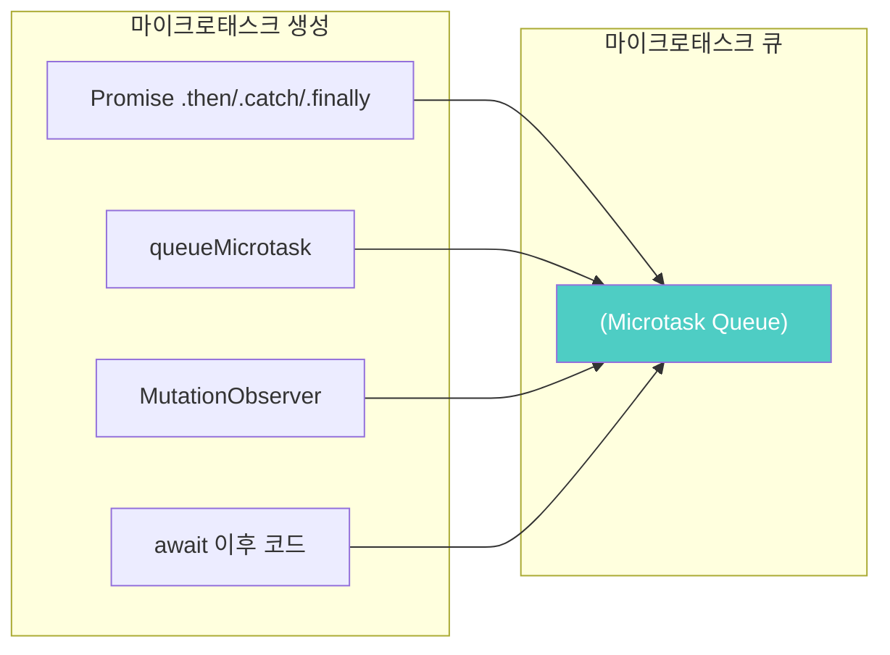

### 태스크(매크로태스크) (낮은 우선순위)

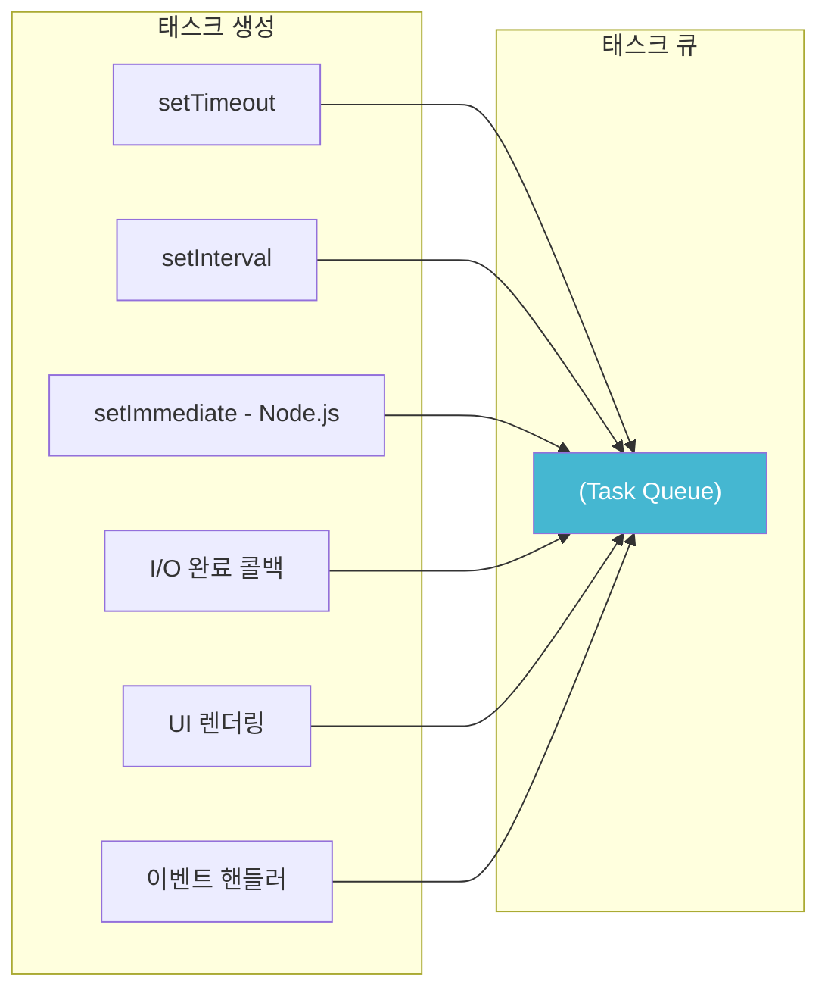

---

## 5. 실행 순서 예제 - 단계별 분석

### 예제 1: 기본 순서

```javascript
console.log('1. 시작');

setTimeout(() => {
  console.log('2. setTimeout');
}, 0);

Promise.resolve().then(() => {
  console.log('3. Promise');
});

console.log('4. 끝');
```

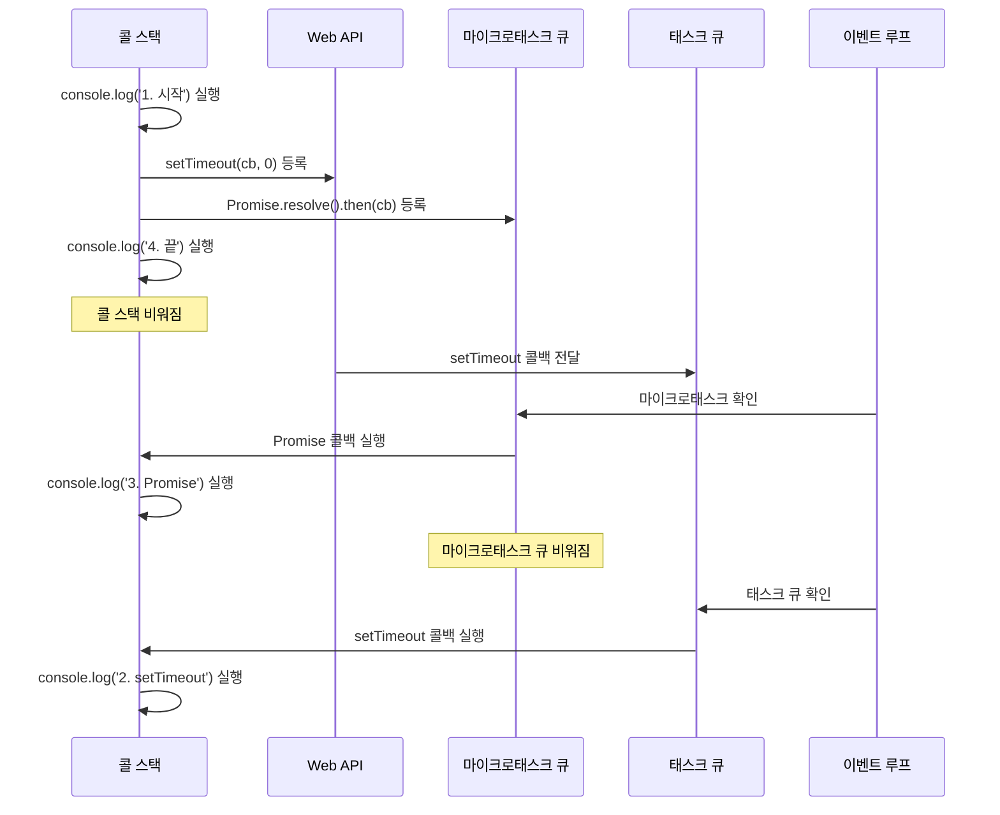

**출력 결과:**
```
1. 시작
4. 끝
3. Promise
2. setTimeout
```

### 예제 2: 마이크로태스크 연쇄

```javascript
console.log('시작');

Promise.resolve()
  .then(() => {
    console.log('Promise 1');
    return Promise.resolve();
  })
  .then(() => {
    console.log('Promise 2');
  });

setTimeout(() => {
  console.log('setTimeout');
}, 0);

console.log('끝');
```

**출력 결과:**
```
시작
끝
Promise 1
Promise 2
setTimeout
```

마이크로태스크 큐는 완전히 비워질 때까지 처리되기 때문에 `Promise 1`과 `Promise 2`가 연속으로 실행됩니다.

### 예제 3: async/await와 이벤트 루프

```javascript
async function fetchData() {
  console.log('A: fetchData 시작');

  const result = await Promise.resolve('데이터');

  console.log('B: await 이후'); // 마이크로태스크로 처리
  return result;
}

console.log('1: 전');
fetchData();
console.log('2: 후');
```

```mermaid
flowchart LR
    A["console.log("'1: 전'")"] --> B["fetchData() 호출"]
    B --> C["console.log("'A: fetchData 시작'")"]
    C --> D["await Promise.resolve()"]
    D --> E["함수 실행 일시 중단<br>제어권 반환"]
    E --> F["console.log("'2: 후'")"]
    F --> G["콜스택 비워짐"]
    G --> H["마이크로태스크 큐 처리"]
    H --> I["console.log("'B: await 이후'")"]

    style D fill:#4ecdc4,color:#fff
    style H fill:#4ecdc4,color:#fff
```

**출력 결과:**
```
1: 전
A: fetchData 시작
2: 후
B: await 이후
```

---

## 6. setTimeout의 진실 - 0ms는 정말 0ms인가?

```javascript
const start = Date.now();

setTimeout(() => {
  console.log(`실제 지연: ${Date.now() - start}ms`);
}, 0);
```

**실제로는 4~10ms 이상** 지연됩니다. 이유는:

1. 브라우저의 최소 타이머 해상도 (4ms)
2. 콜스택이 비어야 실행 가능
3. 마이크로태스크 큐가 먼저 처리됨

```mermaid
gantt
    title setTimeout(fn, 0) 실제 실행 타임라인
    dateFormat X
    axisFormat %Lms

    section 동기 코드
    console.log('시작') :0, 1
    Promise 등록 :1, 2
    console.log('끝') :2, 3

    section 마이크로태스크
    Promise 콜백 처리 :3, 5

    section 태스크
    setTimeout 콜백 (최소 4ms 후) :7, 9
```

---

## 7. 중첩 setTimeout과 setInterval 비교

```javascript
// setInterval - 간격이 일정하지 않을 수 있음
setInterval(() => {
  doHeavyWork(); // 만약 이 작업이 100ms 걸린다면?
}, 1000);

// 중첩 setTimeout - 작업 완료 후 정확히 1000ms 대기
function scheduleNext() {
  setTimeout(() => {
    doHeavyWork();
    scheduleNext(); // 완료 후 다음 예약
  }, 1000);
}
scheduleNext();
```

```mermaid
gantt
    title setInterval vs 중첩 setTimeout 비교
    dateFormat X
    axisFormat %Ls

    section setInterval (1000ms)
    작업1 (200ms) :0, 200
    대기 :200, 1000
    작업2 (200ms) :1000, 1200
    대기 :1200, 2000
    작업3 (200ms) :2000, 2200

    section 중첩 setTimeout (1000ms)
    작업1 (200ms) :0, 200
    대기 (1000ms) :200, 1200
    작업2 (200ms) :1200, 1400
    대기 (1000ms) :1400, 2400
```

---

## 8. 이벤트 루프와 렌더링의 관계

브라우저는 렌더링도 이벤트 루프와 함께 동작합니다.

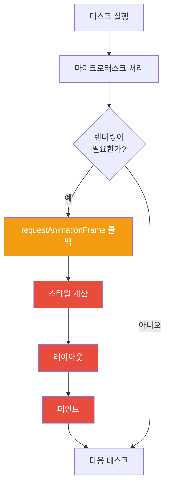

### requestAnimationFrame 활용

```javascript
// 나쁜 방법 - 이벤트 루프를 블로킹
function animateBad() {
  element.style.left = `${x++}px`;
  setTimeout(animateBad, 16); // 60fps 시도
}

// 좋은 방법 - 렌더링 주기에 맞춤
function animateGood() {
  element.style.left = `${x++}px`;
  requestAnimationFrame(animateGood); // 렌더링 직전에 실행
}
requestAnimationFrame(animateGood);
```

---

## 9. 실전 문제 - 복잡한 실행 순서 예측

```javascript
console.log('script start');

setTimeout(function() {
  console.log('setTimeout');
}, 0);

Promise.resolve()
  .then(function() {
    console.log('promise1');
  })
  .then(function() {
    console.log('promise2');
  });

async function asyncFunc() {
  console.log('async start');
  await Promise.resolve();
  console.log('async end');
}

asyncFunc();

console.log('script end');
```

```mermaid
flowchart TD
    A["script start 출력"] --> B["setTimeout 등록 → 태스크 큐"]
    B --> C["Promise.then 등록 → 마이크로태스크 큐"]
    C --> D["asyncFunc 호출"]
    D --> E["async start 출력"]
    E --> F["await → 마이크로태스크 큐에 등록 후 일시중단"]
    F --> G["script end 출력"]
    G --> H["콜스택 비워짐"]
    H --> I["마이크로태스크 처리 시작"]
    I --> J["promise1 출력"]
    J --> K["promise2 마이크로태스크 큐 추가"]
    K --> L["async end 출력 ("await 이후")"]
    L --> M["promise2 출력"]
    M --> N["태스크 큐 처리"]
    N --> O["setTimeout 출력"]

    style I fill:#4ecdc4,color:#fff
    style N fill:#45b7d1,color:#fff
```

**출력 결과:**
```
script start
async start
script end
promise1
async end
promise2
setTimeout
```

---

## 10. 이벤트 루프 블로킹 문제와 해결책

### 긴 동기 작업이 UI를 멈추는 문제

```javascript
// 나쁜 코드 - UI가 멈춤
function processMillionItems(items) {
  for (let i = 0; i < 1000000; i++) {
    heavyCalculation(items[i]); // 콜스택을 오래 점유
  }
}
```

```mermaid
gantt
    title 이벤트 루프 블로킹
    dateFormat X
    axisFormat %Ls

    section 문제 상황
    무거운 동기 작업 (5초) :0, 5000
    UI 클릭 무반응 :0, 5000

    section 해결 후
    청크1 처리 (100ms) :0, 100
    UI 응답 가능 :100, 200
    청크2 처리 (100ms) :200, 300
    UI 응답 가능 :300, 400
```

### 해결 방법 1: 청크 분할

```javascript
function processInChunks(items, chunkSize = 1000) {
  let index = 0;

  function processNextChunk() {
    const end = Math.min(index + chunkSize, items.length);

    for (; index < end; index++) {
      heavyCalculation(items[index]);
    }

    if (index < items.length) {
      setTimeout(processNextChunk, 0); // 다음 태스크로 위임
    }
  }

  processNextChunk();
}
```

### 해결 방법 2: Web Worker

```javascript
// main.js
const worker = new Worker('worker.js');

worker.postMessage({ items: millionItems });

worker.onmessage = (event) => {
  console.log('처리 완료:', event.data.result);
  // UI는 계속 응답 가능했음
};

// worker.js (별도 스레드)
self.onmessage = (event) => {
  const result = processAll(event.data.items); // 블로킹해도 OK
  self.postMessage({ result });
};
```

---

## 11. Node.js 이벤트 루프 - 브라우저와의 차이

Node.js는 libuv를 사용하며 이벤트 루프 단계가 더 세분화됩니다.

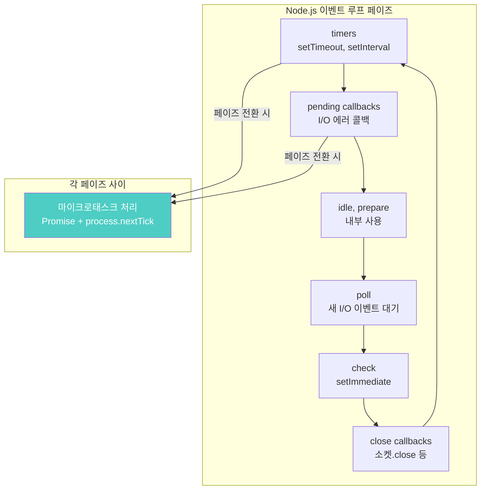

### process.nextTick vs Promise

```javascript
// Node.js 전용
Promise.resolve().then(() => console.log('Promise'));
process.nextTick(() => console.log('nextTick'));
setTimeout(() => console.log('setTimeout'), 0);
setImmediate(() => console.log('setImmediate'));

// 출력 순서:
// nextTick    ← process.nextTick이 Promise보다도 먼저!
// Promise
// setTimeout  또는 setImmediate (순서 불확정)
// setImmediate
```

---

## 12. 극한 시나리오 - 마이크로태스크 무한 루프

```javascript
// 위험! 브라우저를 완전히 멈춥니다
function infiniteMicrotask() {
  Promise.resolve().then(infiniteMicrotask);
}
infiniteMicrotask();

// 마이크로태스크 큐가 절대 비워지지 않아
// 태스크 큐(UI 렌더링 포함)가 실행되지 못함
// 결과: 페이지 완전 프리즈
```

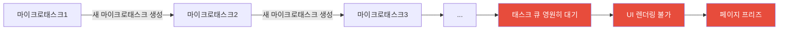

---

## 13. 디버깅 - 이벤트 루프 시각화

Chrome DevTools에서 이벤트 루프를 시각화할 수 있습니다.

```javascript
// Performance 패널에서 확인할 수 있는 패턴
performance.mark('task-start');

setTimeout(() => {
  performance.mark('setTimeout-callback');
  performance.measure('setTimeout-delay', 'task-start', 'setTimeout-callback');

  const measure = performance.getEntriesByName('setTimeout-delay')[0];
  console.log(`실제 지연: ${measure.duration}ms`);
}, 0);
```

---

## 14. 면접 단골 문제 총정리

### 문제 1: 출력 순서 맞추기

```javascript
for (var i = 0; i < 3; i++) {
  setTimeout(() => console.log(i), 0);
}
// 출력: 3, 3, 3 (var는 함수 스코프라 루프 종료 후의 i=3 참조)

for (let i = 0; i < 3; i++) {
  setTimeout(() => console.log(i), 0);
}
// 출력: 0, 1, 2 (let은 블록 스코프, 각 반복마다 새 바인딩)
```

### 문제 2: Promise 체이닝 순서

```javascript
Promise.resolve(1)
  .then(x => {
    console.log(x);      // 1
    return x + 1;
  })
  .then(x => {
    console.log(x);      // 2
    return Promise.resolve(x + 1);
  })
  .then(x => console.log(x)); // 3
```

---

## 15. 성능 모니터링 - Long Task 감지

```javascript
// PerformanceObserver로 Long Task 감지 (50ms 이상)
const observer = new PerformanceObserver((list) => {
  for (const entry of list.getEntries()) {
    console.warn(`Long Task 감지: ${entry.duration}ms`);
    // 개선이 필요한 작업
  }
});

observer.observe({ entryTypes: ['longtask'] });
```

---

## 정리: 이벤트 루프 5가지 핵심 원칙

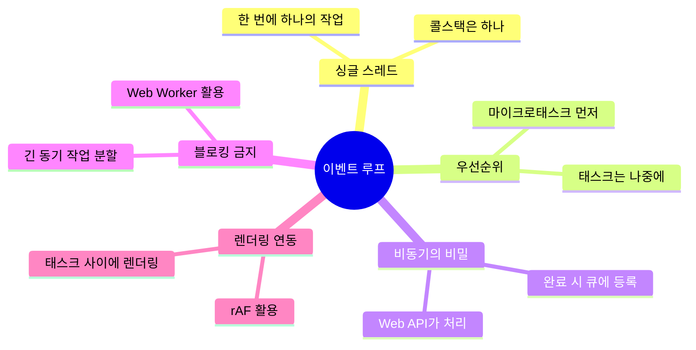

1. **자바스크립트는 싱글 스레드** - 콜스택은 하나뿐
2. **마이크로태스크가 태스크보다 우선** - Promise가 setTimeout보다 먼저
3. **콜스택이 빈 후에야 큐 처리** - 현재 작업 완료 후 다음으로
4. **긴 동기 작업은 블로킹** - 청크 분할이나 Web Worker 사용
5. **렌더링은 태스크 사이에** - requestAnimationFrame 활용

이벤트 루프를 완전히 이해하면 비동기 코드의 동작을 정확히 예측하고, 성능 문제를 효과적으로 해결할 수 있습니다.
