## 식당 주방에서 일어나는 일

혼자 운영하는 라면 가게를 상상해 보세요. 사장님(자바스크립트 엔진)은 단 한 명입니다. 손님들이 동시에 주문을 넣어도, 사장님은 **한 번에 라면 하나만** 끓일 수 있습니다.

- 손님 A가 라면을 주문합니다 → 즉시 끓이기 시작
- 손님 B가 주문합니다 → 대기줄(큐)에 메모
- 라면이 끓는 동안 타이머(Web API)가 3분을 재고 있습니다
- 사장님은 빈 시간에 대기줄을 확인해 다음 주문을 처리

이것이 바로 **이벤트 루프**의 본질입니다. 자바스크립트는 싱글 스레드지만 비동기 작업을 우아하게 처리합니다.

---

## 1. 자바스크립트 런타임 구조

자바스크립트 런타임은 여러 구성 요소가 협력하는 시스템입니다. 각 역할을 이해해야 "왜 Promise가 setTimeout보다 먼저 실행되는가"를 설명할 수 있습니다.

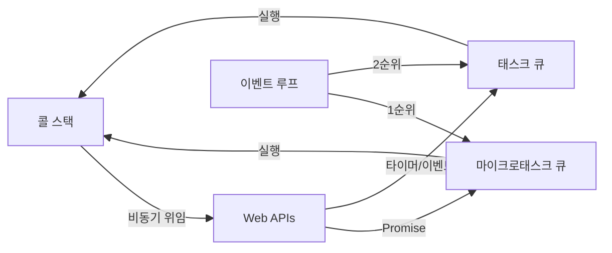

각 구성 요소의 역할을 정리하면 이렇습니다.

| 구성 요소 | 역할 | 예시 |
|-----------|------|------|
| 콜 스택 (Call Stack) | 현재 실행 중인 함수들의 스택 | 동기 코드 실행 |
| 힙 (Heap) | 객체가 저장되는 메모리 공간 | 변수, 함수 객체 |
| Web API | 브라우저가 제공하는 비동기 기능 | setTimeout, fetch, addEventListener |
| 마이크로태스크 큐 | Promise 콜백 대기 | .then(), .catch(), async/await |
| 태스크 큐 | 일반 비동기 콜백 대기 | setTimeout, setInterval, I/O |
| 이벤트 루프 | 큐를 감시하고 콜스택에 전달 | 조율자 역할 |

---

## 2. 콜 스택 동작 원리

콜 스택은 **LIFO(Last In, First Out)** 구조입니다. 마지막에 쌓인 것이 먼저 실행됩니다.

> 비유: 접시를 쌓아두는 것과 같습니다. 새 접시는 위에 쌓이고, 꺼낼 때는 위에서부터 꺼냅니다. 아래 접시를 먼저 꺼낼 수 없습니다.

```javascript
function greet(name) {
  return `Hello, ${name}!`;
}

function sayHello() {
  const result = greet('World');
  console.log(result);
}

sayHello();
```

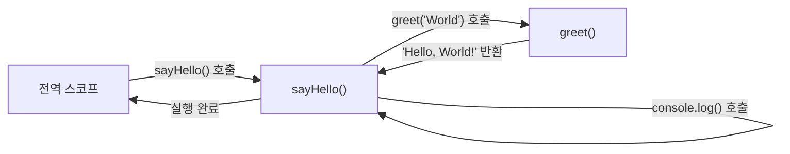

만약 이 스택이 꽉 차면 어떻게 될까요? **스택 오버플로우**가 발생합니다.

```javascript
// 위험! 스택 오버플로우
function infinite() {
  return infinite(); // 종료 조건 없는 재귀
}

infinite(); // RangeError: Maximum call stack size exceeded
```

---

## 3. 이벤트 루프의 정확한 동작 알고리즘

이벤트 루프가 하는 일을 정확히 표현하면 이렇습니다. 이 알고리즘을 외워두면 어떤 비동기 코드든 실행 순서를 예측할 수 있습니다.

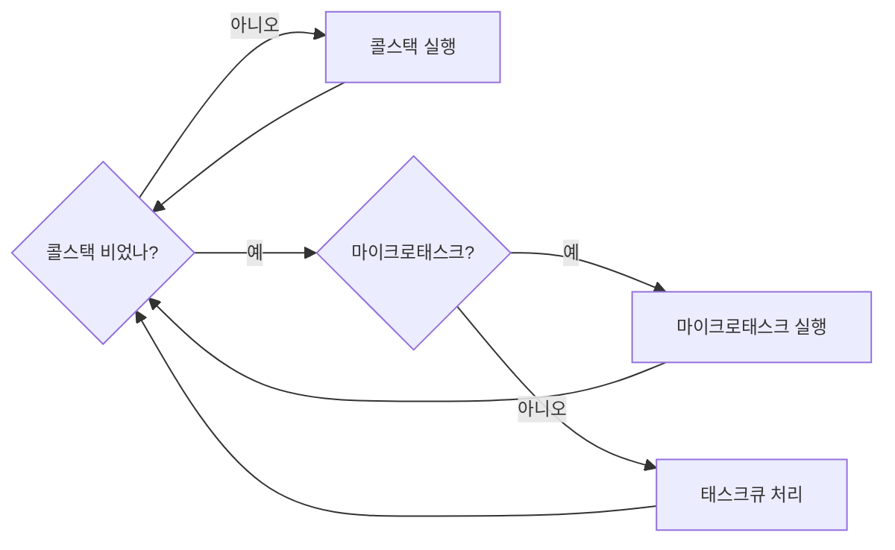

핵심 규칙 4가지를 기억하세요.

1. **콜 스택이 빌 때까지** 현재 작업을 완수합니다
2. **마이크로태스크 큐를 완전히 비운 후** 태스크 큐를 처리합니다
3. 태스크 큐에서는 **한 번에 하나씩만** 가져옵니다
4. 태스크 하나가 끝나면 **다시 마이크로태스크 큐**를 먼저 확인합니다

---

## 4. 마이크로태스크 vs 태스크 — 이게 핵심입니다

이 차이가 가장 중요합니다. 면접에서도 자주 나오고, 실무에서도 예상치 못한 버그의 원인이 됩니다.

> 비유: 레스토랑에서 주문을 처리하는 상황을 생각해보세요. 마이크로태스크는 "지금 테이블 손님의 추가 주문"이고, 태스크는 "새로 들어온 손님의 주문"입니다. 현재 테이블 손님의 모든 추가 주문을 처리한 후에야 새 손님을 받습니다.

### 마이크로태스크 생성원 (높은 우선순위)

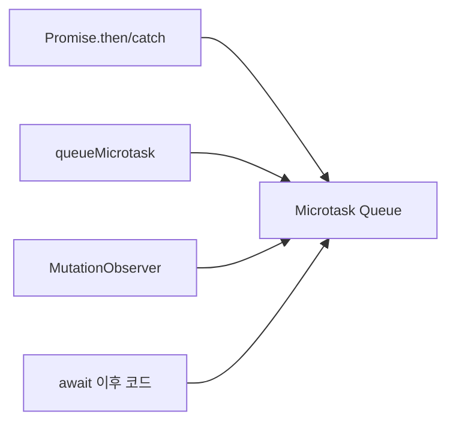

### 태스크 생성원 (낮은 우선순위)

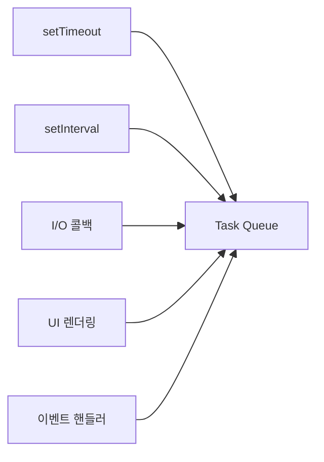

---

## 5. 실행 순서 예제 — 단계별 분석

이론을 알았으면 코드를 보고 출력 순서를 예측할 수 있어야 합니다.

### 예제 1: 기본 순서

```javascript
console.log('1. 시작');

setTimeout(() => {
  console.log('2. setTimeout');
}, 0);

Promise.resolve().then(() => {
  console.log('3. Promise');
});

console.log('4. 끝');
```

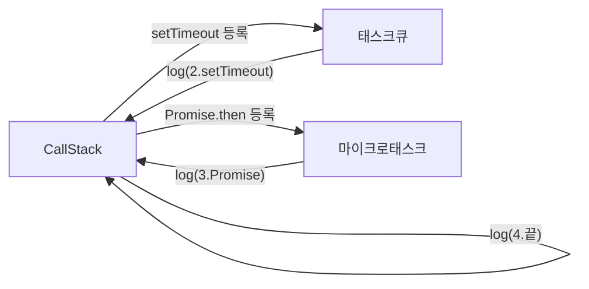

출력 결과:
```
1. 시작
4. 끝
3. Promise
2. setTimeout
```

`setTimeout(fn, 0)`이라도 Promise보다 늦게 실행됩니다. 이유는 setTimeout은 태스크 큐에, Promise는 마이크로태스크 큐에 들어가기 때문입니다.

### 예제 2: async/await와 이벤트 루프

```javascript
async function fetchData() {
  console.log('A: fetchData 시작');

  const result = await Promise.resolve('데이터');

  console.log('B: await 이후'); // 마이크로태스크로 처리
  return result;
}

console.log('1: 전');
fetchData();
console.log('2: 후');
```

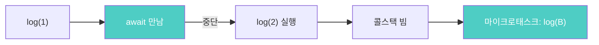

출력 결과:
```
1: 전
A: fetchData 시작
2: 후
B: await 이후
```

`await`를 만나면 함수가 일시 정지되고, **제어권이 호출자로 돌아갑니다.** 그래서 `2: 후`가 `B: await 이후`보다 먼저 출력됩니다.

---

## 6. setTimeout의 진실 — 0ms는 정말 0ms인가?

```javascript
const start = Date.now();

setTimeout(() => {
  console.log(`실제 지연: ${Date.now() - start}ms`);
}, 0);
```

실제로 실행해보면 **4~10ms 이상** 지연됩니다. 이유가 세 가지입니다.

1. 브라우저의 최소 타이머 해상도가 4ms입니다
2. 콜스택이 비어야 실행 가능합니다
3. 마이크로태스크 큐가 먼저 처리됩니다


따라서 `setTimeout(fn, 0)`은 "지금 당장은 아니지만 가능한 빨리 실행해줘"라는 의미입니다. 절대로 동기 코드보다 먼저 실행되지 않습니다.

---

## 7. 이벤트 루프와 렌더링의 관계

브라우저는 렌더링도 이벤트 루프와 함께 동작합니다. 이것을 모르면 애니메이션 코드에서 깜빡임이 왜 생기는지 이해하기 어렵습니다.

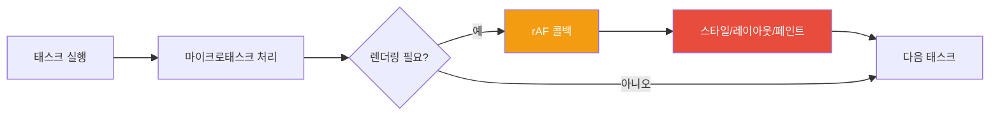

```javascript
// 나쁜 방법 — 이벤트 루프를 블로킹
function animateBad() {
  element.style.left = `${x++}px`;
  setTimeout(animateBad, 16); // 60fps 시도하지만 정확하지 않음
}

// 좋은 방법 — 렌더링 주기에 맞춤
function animateGood() {
  element.style.left = `${x++}px`;
  requestAnimationFrame(animateGood); // 렌더링 직전에 실행됨
}
requestAnimationFrame(animateGood);
```

`requestAnimationFrame`을 써야 하는 이유는, 브라우저의 렌더링 주기(보통 60fps, 약 16.7ms)에 정확히 맞춰 실행되기 때문입니다. `setTimeout(fn, 16)`은 타이머 오차 때문에 정확하지 않습니다.

---

## 8. 실전 문제 — 복잡한 실행 순서 예측

이 코드의 출력 순서를 예측할 수 있다면 이벤트 루프를 완전히 이해한 겁니다.

```javascript
console.log('script start');

setTimeout(function() {
  console.log('setTimeout');
}, 0);

Promise.resolve()
  .then(function() {
    console.log('promise1');
  })
  .then(function() {
    console.log('promise2');
  });

async function asyncFunc() {
  console.log('async start');
  await Promise.resolve();
  console.log('async end');
}

asyncFunc();

console.log('script end');
```

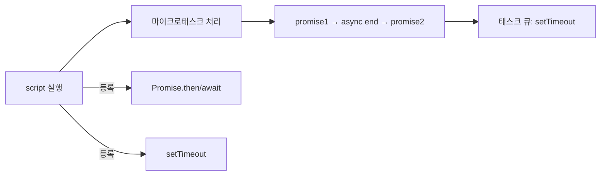

출력 결과:
```
script start
async start
script end
promise1
async end
promise2
setTimeout
```

---

## 9. 이벤트 루프 블로킹 문제와 해결책

긴 동기 작업이 콜스택을 점유하면 UI가 완전히 멈춥니다. 사용자가 클릭해도 반응이 없고, 애니메이션도 멈춥니다.

```javascript
// 나쁜 코드 — UI가 멈춤
function processMillionItems(items) {
  for (let i = 0; i < 1000000; i++) {
    heavyCalculation(items[i]); // 콜스택을 수초간 점유
  }
}
```

### 해결 방법 1: 청크 분할

작업을 작은 단위로 나눠 태스크 큐에 위임합니다. 각 청크 사이에 이벤트 루프가 UI 이벤트를 처리할 수 있습니다.

```javascript
function processInChunks(items, chunkSize = 1000) {
  let index = 0;

  function processNextChunk() {
    const end = Math.min(index + chunkSize, items.length);

    for (; index < end; index++) {
      heavyCalculation(items[index]);
    }

    if (index < items.length) {
      setTimeout(processNextChunk, 0); // 다음 태스크로 위임
    }
  }

  processNextChunk();
}
```

### 해결 방법 2: Web Worker

완전히 별도 스레드에서 실행합니다. 메인 스레드는 계속 UI를 처리합니다.

```javascript
// main.js
const worker = new Worker('worker.js');

worker.postMessage({ items: millionItems });

worker.onmessage = (event) => {
  console.log('처리 완료:', event.data.result);
  // UI는 계속 응답 가능했음
};

// worker.js (별도 스레드)
self.onmessage = (event) => {
  const result = processAll(event.data.items); // 블로킹해도 OK
  self.postMessage({ result });
};
```

---


## 극한 시나리오

```javascript
// 위험! 브라우저를 완전히 멈춥니다
function infiniteMicrotask() {
  Promise.resolve().then(infiniteMicrotask);
}
infiniteMicrotask();

// 마이크로태스크 큐가 절대 비워지지 않아
// 태스크 큐(UI 렌더링 포함)가 실행되지 못함
// 결과: 페이지 완전 프리즈
```

마이크로태스크가 새 마이크로태스크를 계속 생성하면, 이벤트 루프는 태스크 큐로 넘어갈 수 없습니다. 렌더링도, 이벤트도, setTimeout도 실행되지 않습니다.


---
## 11. Node.js 이벤트 루프 — 브라우저와의 차이

Node.js는 libuv를 사용하며 이벤트 루프 단계가 더 세분화됩니다.

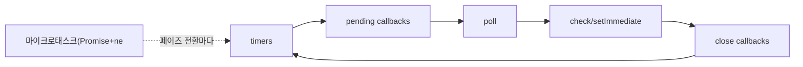

```javascript
// Node.js 전용 — 우선순위 순서
Promise.resolve().then(() => console.log('Promise'));
process.nextTick(() => console.log('nextTick'));
setTimeout(() => console.log('setTimeout'), 0);
setImmediate(() => console.log('setImmediate'));

// 출력 순서:
// nextTick    ← process.nextTick이 Promise보다도 먼저!
// Promise
// setTimeout  또는 setImmediate (환경에 따라 순서 달라질 수 있음)
// setImmediate
```

브라우저에는 `process.nextTick`이 없고, Node.js에는 `requestAnimationFrame`이 없습니다. 환경에 따라 사용 가능한 API가 다릅니다.

---

## 정리: 이벤트 루프 5가지 핵심 원칙

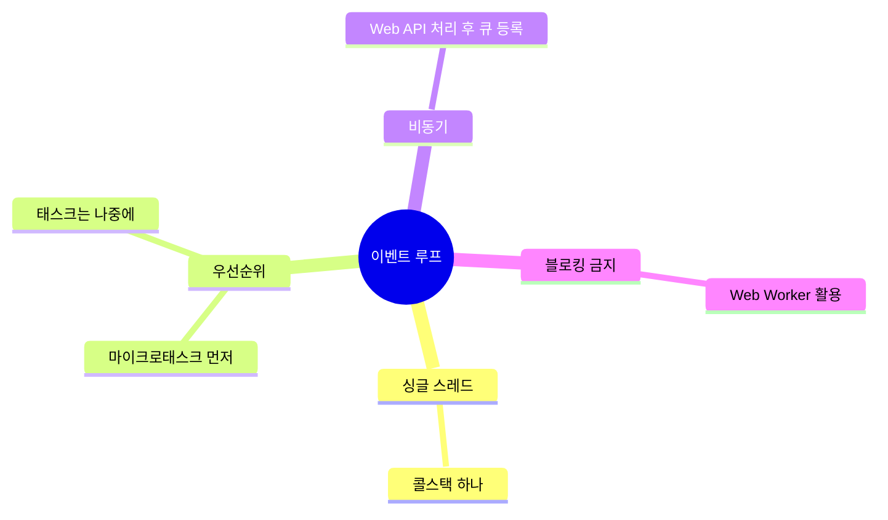

1. **자바스크립트는 싱글 스레드** — 콜스택은 하나뿐
2. **마이크로태스크가 태스크보다 우선** — Promise가 setTimeout보다 먼저
3. **콜스택이 빈 후에야 큐 처리** — 현재 작업 완료 후 다음으로
4. **긴 동기 작업은 블로킹** — 청크 분할이나 Web Worker 사용
5. **렌더링은 태스크 사이에** — requestAnimationFrame 활용

이벤트 루프를 완전히 이해하면 비동기 코드의 동작을 정확히 예측하고, "왜 setTimeout 0이어도 늦게 실행되지?"같은 의문이 모두 해소됩니다.

---

## 왜 이벤트 루프 방식인가?

다른 동시성 모델과 비교하면 자바스크립트가 왜 이 방식을 선택했는지 이해할 수 있습니다.

| 모델 | 동시성 방식 | 장점 | 단점 |
|------|-----------|------|------|
| **이벤트 루프 (JS)** | 단일 스레드 + 비동기 큐 | 락/경쟁 조건 없음, 메모리 낮음 | CPU 집중 작업에 취약 |
| **멀티스레드 (Java)** | 스레드 병렬 실행 | CPU 바운드 작업 강력 | 락/데드락/경쟁 조건 복잡 |
| **Web Worker** | 별도 스레드, 메시지 통신 | CPU 작업 분리 가능 | DOM 접근 불가, 통신 오버헤드 |
| **SharedArrayBuffer** | 공유 메모리 + Atomics | 스레드 간 빠른 데이터 공유 | Spectre 보안 제한, 복잡성 높음 |

UI가 중심인 브라우저 환경에서 **락 없는 단일 스레드**는 예측 가능성과 안정성을 극대화합니다. CPU 집중 작업은 Web Worker로 분리하는 것이 정석입니다.

---

## 실무에서 자주 하는 실수

**실수 1. 무한 마이크로태스크로 UI 완전 동결**

```javascript
// 위험: Promise 체인이 끊이지 않으면 렌더링이 영원히 안 됨
function loop() {
  Promise.resolve().then(loop); // 마이크로태스크 큐를 계속 채움
}
loop();

// 올바른 방법: setTimeout으로 태스크 큐에 넘겨 렌더링 기회 부여
function loop() {
  setTimeout(loop, 0);
}
```

**실수 2. 동기 루프로 메인 스레드 블로킹**

```javascript
// 위험: 수백만 건 루프가 이벤트 루프를 점령
for (let i = 0; i < 10_000_000; i++) {
  heavyCalc(i);
}

// 올바른 방법: 청크 분할 + setTimeout으로 제어권 반환
function processChunk(data, index = 0) {
  const chunk = data.slice(index, index + 1000);
  chunk.forEach(heavyCalc);
  if (index + 1000 < data.length) {
    setTimeout(() => processChunk(data, index + 1000), 0);
  }
}
```

**실수 3. async 함수 안에서 동기 블로킹 호출**

```javascript
// 위험: async라고 해서 동기 코드가 비동기가 되진 않음
async function fetchAndProcess() {
  const data = await fetch('/api/data');
  const result = data.json(); // 이 줄은 동기 — CPU 집중 시 블로킹
  return heavyTransform(result); // 무거운 변환이면 UI 멈춤
}

// 올바른 방법: 무거운 처리는 Web Worker로
const worker = new Worker('transform.worker.js');
worker.postMessage(data);
```

**실수 4. setTimeout(fn, 0)의 최소 딜레이 오해**

```javascript
// 브라우저는 최소 1ms (중첩 5단계 이상이면 4ms) 딜레이가 있음
// "즉시 실행"이 아니라 "현재 태스크 완료 후 가능한 빨리"
setTimeout(() => console.log('빠름'), 0);
Promise.resolve().then(() => console.log('더 빠름')); // 마이크로태스크가 먼저
```

**실수 5. requestAnimationFrame 타이밍 오해**

```javascript
// 위험: rAF 안에서 레이아웃 강제 발생 (Forced Reflow)
function animate() {
  const height = element.offsetHeight; // 레이아웃 읽기
  element.style.height = height + 1 + 'px'; // 레이아웃 쓰기
  requestAnimationFrame(animate);
}

// 올바른 방법: 읽기/쓰기 분리
function animate() {
  const height = element.offsetHeight; // 먼저 읽기
  requestAnimationFrame(() => {
    element.style.height = height + 1 + 'px'; // 다음 프레임에 쓰기
  });
}
```

---

## 면접 포인트

**Q1. 마이크로태스크와 태스크(매크로태스크)의 차이를 설명하고, 실행 순서를 코드로 보여주세요.**

마이크로태스크(Promise `.then`, `queueMicrotask`, `MutationObserver`)는 현재 태스크가 끝나면 즉시, 다음 태스크 전에 모두 실행됩니다. 태스크(setTimeout, setInterval, I/O)는 매번 이벤트 루프 한 사이클에 하나씩 실행됩니다.

```javascript
console.log('1');
setTimeout(() => console.log('2'), 0);   // 태스크 큐
Promise.resolve().then(() => console.log('3')); // 마이크로태스크
console.log('4');
// 출력: 1 → 4 → 3 → 2
```

**Q2. `async/await`와 Promise `.then()`의 실행 순서가 다른 경우가 있나요?**

`await`는 내부적으로 Promise `.then()`으로 변환되지만, 스펙 변경(V8 최적화)으로 `async/await`가 때로 `.then()` 체인보다 마이크로태스크를 하나 적게 소비합니다. 실무에서 순서 차이가 문제가 될 경우 `queueMicrotask`로 명시적으로 제어합니다.

**Q3. Web Worker와 이벤트 루프의 관계는?**

Web Worker는 별도 스레드에서 자체 이벤트 루프를 가집니다. 메인 스레드와 `postMessage`/`onmessage`로 통신하며, 데이터는 구조적 복제(Structured Clone)로 전달됩니다. DOM에는 접근할 수 없고, CPU 집중 작업을 메인 스레드에서 분리하는 데 사용합니다.

**Q4. Node.js 이벤트 루프와 브라우저 이벤트 루프의 차이는?**

Node.js는 libuv 기반으로 6단계 페이즈(timers → I/O → idle → poll → check → close)를 순환합니다. `process.nextTick`은 어느 페이즈든 현재 페이즈 직후 실행되는 특수 큐입니다. 브라우저에는 `process.nextTick`이 없고, Node.js에는 `requestAnimationFrame`이 없습니다.

**Q5. 이벤트 루프를 이용해 무거운 작업을 UI 블로킹 없이 처리하는 방법은?**

세 가지 접근법이 있습니다. (1) **청크 분할 + setTimeout**: 작업을 작은 단위로 나눠 매 청크 후 `setTimeout(fn, 0)`으로 이벤트 루프에 제어권 반환. (2) **Web Worker**: CPU 집중 작업을 별도 스레드로 완전히 분리. (3) **`scheduler.postTask`(현대 브라우저)**: 우선순위 기반 태스크 스케줄링으로 중요한 UI 작업에 높은 우선순위 부여.
